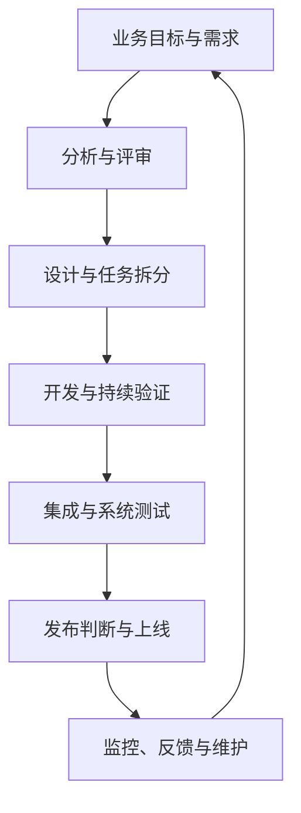
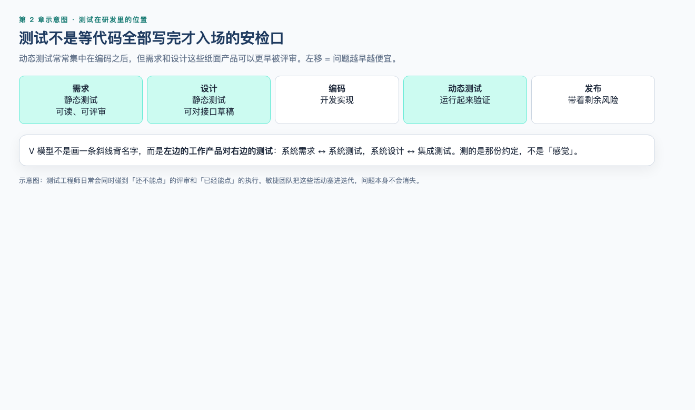
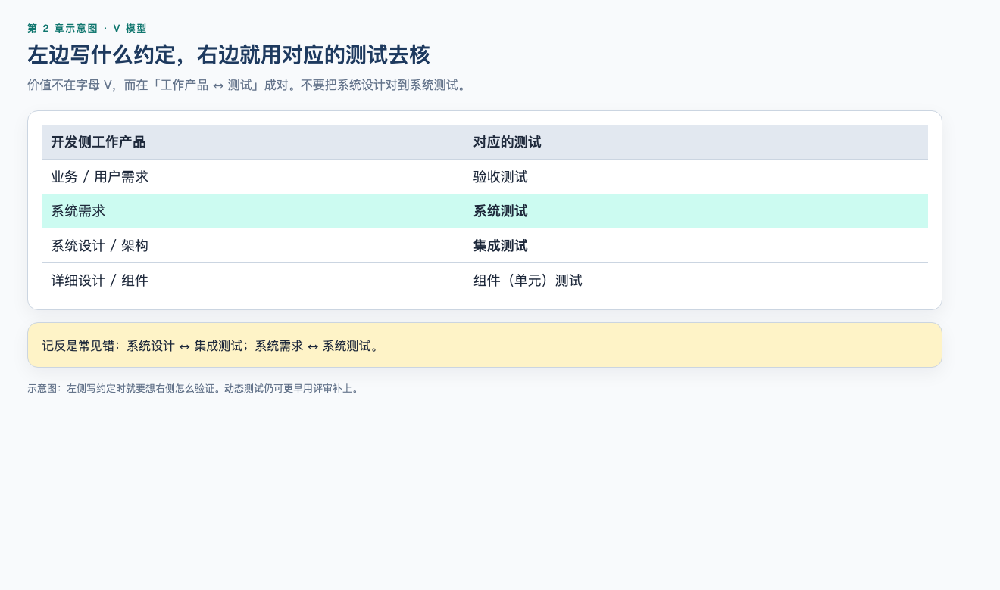
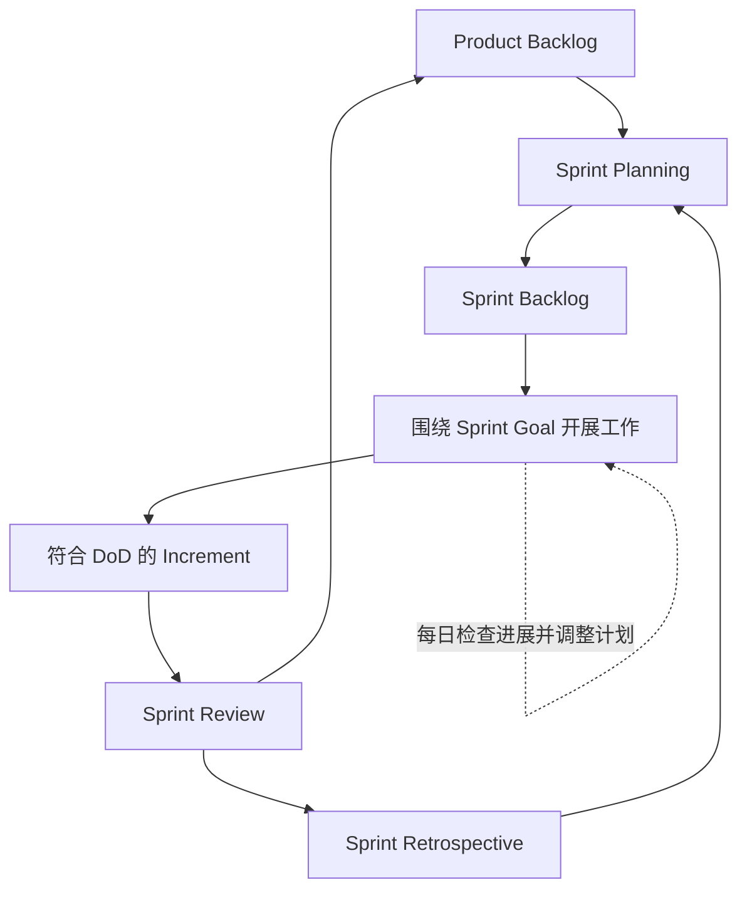
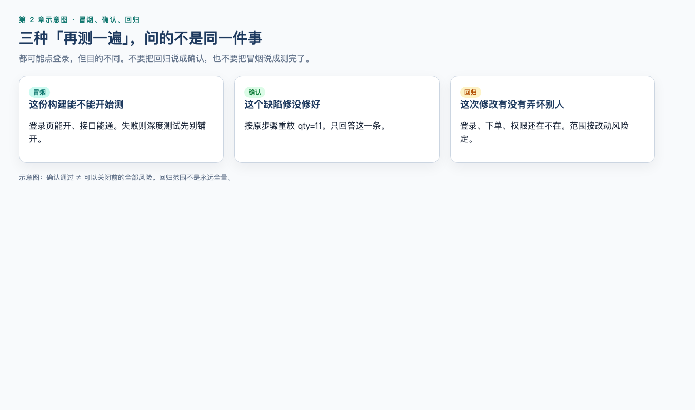

# 第 2 章：软件研发流程与测试的位置

> **一句话核心：** 测试的位置由研发生命周期决定，不是「开发全部写完才能测」。

## 本章解决什么问题

第 1 章说明了测试不只是“开发完成后找 Bug”。这一章继续回答：一个需求怎样变成可以交付的软件？测试工程师在哪些阶段参与？提测、冒烟、回归、Sprint 和上线分别是什么意思？

你不需要死背一条固定流程。真正需要建立的是一张地图：看懂当前处于什么阶段、有哪些工作产品、谁在协作、测试能提前做什么，以及发生变化后应该反馈到哪里。

## 学习目标

完成本章后，你应该能够：

- 解释 SDLC 和 STLC 的含义及关系；
- 描述需求从提出到上线维护的常见路径；
- 说明测试在需求、设计、开发、交付和运行阶段能做什么；
- 区分瀑布模型、V 模型和迭代式/敏捷交付的基本特点；
- 正确解释 Scrum Team、Sprint、Product Backlog、Sprint Backlog、Increment 和 Definition of Done；
- 区分测试左移和测试右移，并说明两者不能互相替代；
- 理解提测、冒烟测试、确认测试、回归测试和发布判断之间的关系；
- 使用最小 Git 工作流保存一次文档修改。

## 前置知识

- 已完成第 1 章；
- 能解释动态测试、静态测试和七大测试原则；
- Git 实操需要已安装 Git；概念学习不要求编程基础。

## 场景导入：一句话需求怎样变成可上线的功能？

MiniShop 收到一个需求：“购物车中的商品数量可以修改。”它不会直接从一句话跳到线上功能。测试人员要先知道：现在处在需求、开发、提测还是发布判断，自己能做什么，以及变化发生后反馈到哪里。

---

## 2.1 从一个需求到一次上线 ⭐⭐⭐

团队通常要经历以下活动：



这是一张教学地图，不是所有公司的固定审批流。小团队可能合并多个活动；持续交付团队可能每天多次完成较小循环；强监管项目可能需要更多正式评审和证据。



测试人员在每个阶段都能提供价值：

| 阶段 | 常见工作产品 | 测试可以做什么 |
| --- | --- | --- |
| 需求 | 用户故事、PRD、验收条件 | 找歧义、遗漏、冲突和不可测试表述 |
| 设计 | 原型、架构图、接口约定、数据库设计 | 分析可测性、接口、数据、权限和风险 |
| 开发 | 代码、构建包、单元测试结果 | 澄清示例、准备数据、评审变更、设计测试 |
| 集成与测试 | 可部署版本、测试环境、日志 | 冒烟、功能、接口、探索、确认和回归测试 |
| 发布 | 发布说明、风险清单、回滚方案 | 汇报覆盖范围、遗留缺陷和剩余风险 |
| 运行维护 | 监控、告警、用户反馈、事故记录 | 分析生产反馈、补充测试并验证修复 |

### 发布判断不是测试一个人的“批准章”

测试工程师应提供证据，例如哪些范围已测、哪些没测、有哪些已知缺陷和剩余风险。最终是否发布通常由产品、研发、测试、运维或业务负责人依据组织规则共同决定。不同团队的决策责任不同。

---

## 2.2 SDLC 与 STLC ⭐⭐⭐

### SDLC 是什么？

SDLC（Software Development Life Cycle，软件开发生命周期）描述软件从构想到开发、交付、运行和维护的一整套生命周期活动。

它存在的原因是：软件交付涉及多人、多种工作产品和持续变化，需要让目标、责任、依赖和反馈可管理。

### STLC 是什么？

STLC（Software Testing Life Cycle，软件测试生命周期）是教学和行业中常用的测试活动组织模型。ISTQB CTFL v4.0 把测试过程主活动写成：计划、**监控与控制**、分析、设计、实现、执行、完成。资料里有时还会单独谈维护阶段的回归与变更影响分析，那是 SDLC 维护活动中的测试工作，不要把它理解成 CTFL 主活动表里多出来的固定第八步。

不要把 STLC 理解成必须等开发结束才启动的独立流水线。测试活动应根据所采用的生命周期与开发活动协调、迭代或并行开展。

### 两者是什么关系？

SDLC 是完整的软件生命周期视角；STLC 聚焦其中的测试活动。它们不是两个互不联系的项目。

例如，需求变化属于 SDLC 中的产品决策，也会触发测试影响分析、用例更新、数据准备和回归范围调整。

---

## 2.3 团队中常见角色 ⭐⭐

| 角色 | 常见关注点 | 测试如何协作 |
| --- | --- | --- |
| 业务/客户 | 业务目标和价值 | 核对真实使用场景与风险 |
| 产品经理/业务分析师 | 需求、优先级、验收条件 | 澄清规则并提高可测试性 |
| 设计师 | 交互和视觉方案 | 检查状态、异常提示和可用性 |
| 开发工程师 | 设计、编码和维护 | 对齐接口、日志、测试数据和修复范围 |
| 测试工程师 | 质量评估与风险信息 | 设计和执行测试、报告结果 |
| 运维/SRE/平台人员 | 部署、稳定性、监控和恢复 | 对齐环境、日志、告警和回滚验证 |

这些名称和边界会因组织而变化。测试工程师不应只在“提测之后”联系开发，也不应把质量责任全部揽到测试角色身上；质量是团队共同责任。

---

## 2.4 常见生命周期模型 ⭐⭐⭐

### 瀑布模型

瀑布模型强调阶段顺序和阶段交付，例如需求、设计、编码、测试、部署和维护。

它适合帮助初学者理解工作产品之间的依赖，也可能适用于需求稳定、合规文档严格或阶段验收明确的环境。但现实项目即使采用阶段式管理，也常存在反馈、返工和重叠，不能把它想成永不回头的直线。

**测试风险：**如果把动态测试集中到编码后期，反馈可能较晚。不过需求、设计和代码仍可更早接受静态测试。

### V 模型

V 模型强调开发工作产品与相应测试活动之间的对应，提醒团队在左侧写需求或设计时，就要考虑右侧怎样验证。ISTQB CTFL 的常见对应是：

| 开发侧工作产品 | 对应的测试 |
| --- | --- |
| 业务/用户需求 | 验收测试 |
| 系统需求 | 系统测试 |
| 系统设计 / 架构设计 | 集成测试 |
| 详细设计 / 组件设计 | 组件（单元）测试 |

中文资料里的「系统设计」通常指概要或架构设计，对应的是**集成测试**，不是系统测试。系统测试对应的是**系统需求**。不要把这两对记反。




它的价值不是字母形状，也不代表所有测试只能在右侧一次性执行。

### 迭代式和增量式开发

- 迭代：通过多轮反馈改进解决方案；
- 增量：分批交付可用能力。

二者常同时出现。MiniShop 可以先交付登录和商品浏览，再增加购物车；购物车本身也可在多轮反馈中改进。

### 如何选择？

不存在对所有项目都最好的生命周期。应结合需求变化程度、风险、法规、团队能力、技术架构和交付频率选择并调整。

---

## 2.5 Agile 与 Scrum ⭐⭐⭐

敏捷不是“不要文档、不要计划、直接写代码”，也不是某一个工具。它强调通过协作、较短反馈周期和持续调整交付价值。

Scrum 是处理复杂问题的一种轻量框架。根据 2020 Scrum Guide，一个 Scrum Team 包含三类职责：

- Product Owner：对产品价值最大化和 Product Backlog 的有效管理负责；
- Scrum Master：对建立 Scrum 和提升团队有效性负责；
- Developers：对每个 Sprint 创建可用 Increment 的工作负责。

Scrum 中的 Developers 是一项责任角色，不等于职位名称“软件开发工程师”，也不只指写业务代码的人。测试工程师、设计师或其他专业人员，只要共同承担创建可用 Increment 的责任，都可能属于 Developers。Scrum 官方定义没有规定必须设置一个独立的“测试阶段”或“测试子团队”。

### 一个 Sprint 中发生什么？



Sprint 是包含其他 Scrum 事件的固定长度周期，长度不超过一个月。更短的 Sprint 可以缩短反馈周期，但具体长度由团队选择。

需要区分：

- Product Backlog：为改进产品所需工作的有序清单；
- Sprint Backlog：Sprint Goal、选入本 Sprint 的事项以及交付它们的行动计划；
- Increment：朝 Product Goal 前进的一步、可与以前增量共同使用的成果；
- Definition of Done（DoD）：Increment 达到所需质量状态的正式描述；
- 验收条件：某个需求或 Product Backlog Item 的具体可接受条件。

DoD 和验收条件有关，但不是同一个东西。例如“购物车数量不能超过库存”可以是该功能的验收条件；代码已评审、自动化测试通过并部署到测试环境可能属于团队 DoD 的组成部分。

---

## 2.6 测试左移与测试右移 ⭐⭐⭐

### 测试左移

测试左移是把合适的测试和质量活动更早融入生命周期，例如：

- 需求评审时补全库存边界；
- 接口实现前评审 OpenAPI；
- 开发阶段执行静态分析、单元测试和组件测试；
- 在持续集成中快速反馈。

左移不是简单地让测试人员更早加班，也不是把所有系统测试搬到开发前——尚未存在的可执行系统无法进行完整动态测试。

### 测试右移

测试右移是在发布和运行侧继续获取质量信息，例如：

- 监控错误率、延迟和关键业务指标；
- 灰度或金丝雀发布；
- 分析日志、告警和真实用户反馈；
- 在授权、受控条件下进行生产验证或故障演练。

右移不等于“把未完成的测试留到生产”。生产活动必须有权限控制、风险隔离、隐私保护和回滚方案。

### 二者关系

左移重在更早预防和发现问题，右移重在从真实运行环境获得反馈。两者互补，不能互相替代。

---

## 2.7 提测、冒烟、确认和回归 ⭐⭐⭐

### 提测

“提测”是许多团队对开发方将一个版本交给测试活动的常用说法，不是全球统一的标准术语。有效提测通常需要约定版本、变更范围、环境、已知问题、自测结果和部署方式。

### 冒烟测试

冒烟测试用较小的测试集快速判断版本的关键功能和基本稳定性是否足以继续更深入测试。冒烟失败后是否退回版本，要依据团队约定和风险，而不是机械执行。

### 测试入口条件和出口条件

入口条件用于判断计划中的测试活动是否具备合理的开始条件。例如 MiniShop 购物车版本可以约定：需求和验收条件已确认、指定版本已经部署、测试环境可用、必要数据已准备、关键开发自测已完成。

出口条件用于帮助判断计划中的测试活动是否可以结束。例如：约定范围已经执行、关键用例达到预期、阻塞性缺陷已处理、未关闭问题和未测范围已评估并报告。

入口和出口条件不是所有公司的统一清单，也不能只用“用例通过率达到某个固定数字”机械决定。团队应在测试计划或协作约定中，根据产品风险、法规、时间和发布策略明确条件。未达到条件时，应记录偏差、影响和接受风险的人，而不是悄悄降低标准。

### 确认测试与回归测试




- 确认测试：确认某个缺陷的修复是否有效；
- 回归测试：确认这次变更没有在其他已测试区域引入不良影响。

修复“购物车可超过库存”后，重新执行原复现步骤属于确认测试；再检查加购、删减数量、结算和多端库存一致性属于相关回归测试。二者可能在同一次测试会话中执行，但目的不同。

### 发布前测试输出

测试结论至少要说明：

- 测试版本、环境和时间；
- 已测与未测范围；
- 关键结果和失败项；
- 未关闭缺陷；
- 剩余风险及建议。

不要只写“测试通过，可以上线”。

---

## 2.8 MiniShop 工作实战 ⭐⭐⭐

### 场景

教学需求：用户在购物车中修改商品数量时，数量不得小于 1，也不得超过当前可售库存。

> 这是本章练习使用的局部教学假设，尚不是仓库级 MiniShop 正式规格。正式 PRD 建立后，以基线版本为准。

### 各阶段测试活动

| 阶段 | 测试问题或动作 | 产出 |
| --- | --- | --- |
| 需求 | 库存变化时以哪个时点为准？多个用户抢库存怎么办？ | 评审问题清单 |
| 设计 | 前端限制和后端校验分别如何处理？错误码是什么？ | 风险与接口检查点 |
| 开发 | 准备库存为 0、1、10 的数据；确认日志字段 | 测试数据和用例草稿 |
| 提测 | 核对版本、环境、变更范围和开发自测结果 | 提测检查记录 |
| 执行 | 正常值、边界值、非法值、并发变化和权限场景 | 测试结果与 Bug |
| 修复 | 重现原问题并检查结算、库存扣减等受影响区域 | 确认与回归结果 |
| 发布 | 汇总未测范围、遗留缺陷和库存一致性风险 | 发布风险信息 |
| 运行 | 观察库存冲突错误、接口失败和用户反馈 | 监控与改进输入 |

---

## 2.9 Git 最小工作流 ⭐⭐

Git 用来记录文件版本。工作区是正在编辑的文件；暂存区用于选择下一次提交的内容；提交是仓库历史中的一个快照。

在自己的练习仓库中，可以执行：

```bash
git status
git diff
git add chapters/02-software-development-process.md
git diff --staged
git commit -m "Add chapter 2 about SDLC and testing"
```

命令作用：

1. `git status` 查看状态；
2. `git diff` 查看尚未暂存的修改；
3. `git add` 把指定文件当前内容放入暂存区；
4. `git diff --staged` 检查即将提交的内容；
5. `git commit` 在当前分支创建本地提交。

`git commit` 不等于上传互联网。`git push` 会更新远端引用，执行前应确认远端、分支、权限和团队流程。本章不要求强制推送，也不要在不明仓库中照抄命令。

---

## 常见错误

1. **测试要等开发全部结束。** 需求和设计阶段已经可以静态测试。
2. **SDLC 和 STLC 是两条互不相关的流水线。** 测试活动应嵌入并配合软件生命周期。
3. **敏捷就是没有文档和计划。** 敏捷仍需要足够的信息、计划和质量标准，只是强调价值与反馈。
4. **Sprint 结束时把没测完的功能也算完成。** 未满足 DoD 的工作不能作为完成的 Increment；如何处理回到 Product Backlog 由团队透明管理。
5. **DoD 就是单条需求的验收条件。** DoD 描述 Increment 的整体质量状态，验收条件聚焦具体事项。
6. **确认测试等于回归测试。** 前者确认修复，后者寻找变更造成的副作用。
7. **测试右移等于去生产随便测试。** 生产活动需要授权、隔离、监控和回滚控制。
8. **测试报告只写“通过”。** 必须交代范围、环境、结果、遗留问题和风险。
9. **所有项目都使用相同的提测门槛和通过率。** 入口、出口和发布标准必须结合项目风险及组织约定。
10. **Scrum 中的 Developers 就是程序员。** Developers 是对创建可用 Increment 负责的一组成员，所需技能取决于产品工作。

---

## 面试角度 ⭐⭐⭐

### 测试在研发流程中什么时候介入？

测试应尽早并持续参与。需求阶段可以检查完整性和可测试性，设计与开发阶段可以分析风险、设计测试和准备数据，版本可执行后进行动态测试，发布后还可通过监控和反馈继续评估质量。具体活动取决于项目生命周期和风险。

### 瀑布和敏捷中的测试有什么差异？

阶段式项目的动态系统测试可能相对集中，敏捷团队通常在短周期内共同完成分析、开发和测试。但两者都可以提前评审并持续反馈，不能简单说“瀑布没有早期测试”或“敏捷没有独立测试人员”。

### 冒烟、确认和回归有什么区别？

冒烟判断版本是否值得继续深入测试；确认测试验证具体修复；回归测试检查变更是否影响其他区域。测试范围由风险、变更和可用资源决定。

### 什么是左移和右移？

左移把合适的质量活动更早开展，右移从发布和运行环境继续获得反馈。它们共同缩短反馈周期，但生产活动不能替代发布前必要验证。

---

## 小练习

### 练习 1

为什么“开发提测后测试才开始工作”是错误理解？至少举两个提测前的测试活动。

### 练习 2

SDLC 和 STLC 是什么关系？

### 练习 3

MiniShop 的需求只写“购物车数量可以修改”。请提出四个需求评审问题。

### 练习 4

修复登录按钮重复点击会提交两次的问题后，分别举一个确认测试和回归测试动作。

### 练习 5

以下哪项更准确？

A. Scrum 规定必须有独立测试团队  
B. Sprint 中只开发，测试放到 Sprint 结束以后  
C. Scrum Team 共同对每个 Sprint 创建有价值、可用的 Increment 负责  
D. Product Backlog 与 Sprint Backlog 完全相同

### 练习 6

DoD 与验收条件有什么区别？各举一个例子。

### 练习 7

列举两个左移活动和两个右移活动，并说明右移为什么不能替代发布前测试。

### 练习 8

一份发布测试报告只写“全部通过，建议上线”。还缺少哪些关键信息？

### 练习 9（Git 实操）

在自己的练习仓库修改一个 Markdown 文件，依次使用 `status`、`diff`、`add`、`diff --staged` 和 `commit`，保存命令输出或截图作为证据。不要推送到不属于你或未经授权的远端。

## 练习答案

1. 测试可以更早检查需求、原型、接口约定和设计，也能提前设计用例、准备数据与环境。
2. SDLC 覆盖完整软件生命周期；STLC 聚焦其中的测试活动。测试活动要与开发活动协调，而不是等待另一条流水线结束。
3. 示例：最小数量是多少？能否超过库存？库存变化以什么时点为准？非法字符、小数和负数如何处理？权限和并发冲突如何处理？答出任意四个合理问题即可。
4. 确认：按原步骤快速双击，验证只提交一次。回归：检查单击登录、错误密码、按钮状态和登录接口失败等相关场景。
5. C。
6. DoD 是 Increment 达到质量状态的通用描述，如代码评审完成且约定测试通过；验收条件针对具体事项，如购物车数量不得超过可售库存。
7. 左移示例：需求评审、接口契约评审、单元测试、持续集成；右移示例：监控、灰度发布、日志分析、用户反馈。生产风险更高且覆盖不可控，因此不能把必要验证推迟到线上。
8. 至少缺少版本、环境、时间、已测/未测范围、结果证据、遗留缺陷、剩余风险和判断依据。
9. 结果因环境不同而不同。通过标准：能解释五条命令作用，提交仅包含预期文件，且没有误推送敏感内容或无权限远端。

---

## 本章检查清单

- [ ] 我能画出需求到运行反馈的基本循环
- [ ] 我能解释 SDLC 和 STLC 的关系
- [ ] 我能说明测试在提测前后的活动
- [ ] 我能比较瀑布、V 模型和迭代式交付
- [ ] 我不会把敏捷理解为不要计划和文档
- [ ] 我能说出 Scrum Team 的三类职责
- [ ] 我能区分 Product Backlog、Sprint Backlog、Increment、DoD 和验收条件
- [ ] 我能区分左移和右移
- [ ] 我能区分冒烟、确认和回归测试
- [ ] 我能写出包含范围与风险的测试结论
- [ ] 我能完成一次最小 Git 本地提交

### 进入下一章的自测门槛

1. 练习 1～8 至少答对 7 题；
2. 能不看正文解释 SDLC/STLC、确认/回归、DoD/验收条件三组区别；
3. 能对一个新需求列出提测前、提测后和上线后三类测试活动；
4. 有条件使用 Git 时完成练习 9；暂时没有环境时，至少能解释五条命令而不盲目执行。

## 本章总结

1. 软件交付是带反馈的生命周期，不是从需求到上线的单向传送带。
2. 测试活动贯穿 SDLC，STLC 不应成为与开发隔离的流水线。
3. 生命周期模型依赖项目背景，没有万能选择。
4. Scrum 在 Sprint 中交付符合 DoD 的可用 Increment，测试是团队工作的一部分。
5. 左移和右移互补；确认测试与回归测试目的不同。
6. 测试输出应说明证据和剩余风险，而不是只给“通过”两个字。

## 下一章预告

下一章将建立软件测试分类地图，区分测试级别、测试类型、黑盒/白盒/灰盒、手工/自动化，以及冒烟、回归、探索性、兼容性、性能和安全测试。

## 本章可运行性说明

本章只有 Git 命令实操，不包含 Python、SQL、curl、JSON 或 pytest。Git 命令已依据官方文档核对；学习者应只在自己的练习仓库执行。Mermaid 图为教学模型，不表示所有组织的固定流程。

## 参考资料

- [ISTQB Certified Tester Foundation Level 官方页面](https://istqb.org/certifications/certified-tester-foundation-level-ctfl-v4-0/)（提供 CTFL Syllabus v4.0.1；2026-09-08 核验）
- [The Scrum Guide 2020 官方页面](https://scrumguides.org/)（2026-09-08 核验）
- [Git 官方文档：git-add](https://git-scm.com/docs/git-add)
- [Git 官方文档：git-commit](https://git-scm.com/docs/git-commit)
- [Git 官方文档：git-diff](https://git-scm.com/docs/git-diff)
- 本仓库 [课程主控大纲 v1.2](../docs/COURSE_OUTLINE_v1.2.md)
- 本仓库 [全局内容质量标准](../standards/QUALITY_STANDARD_v1.0.md)
