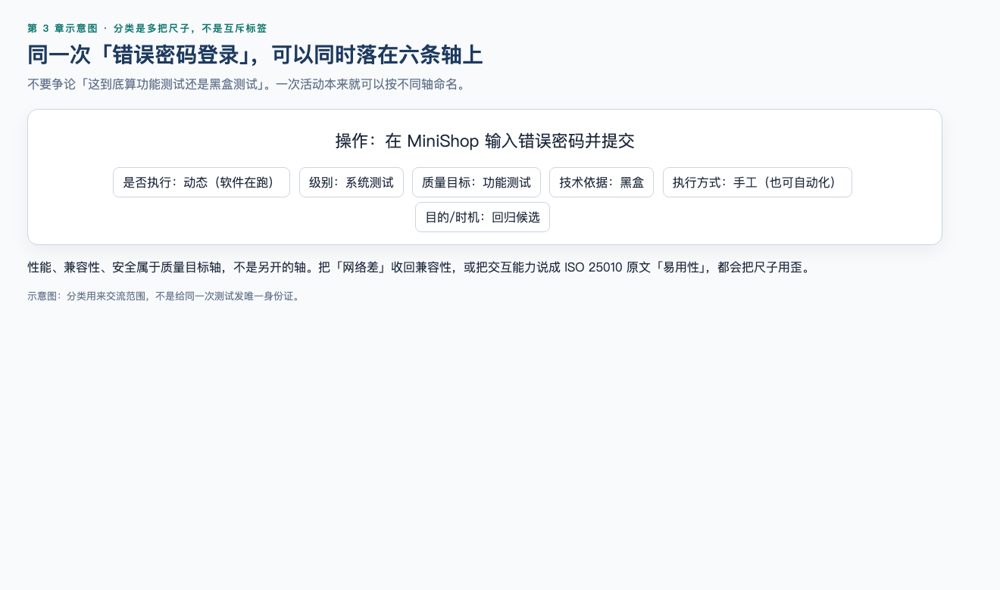
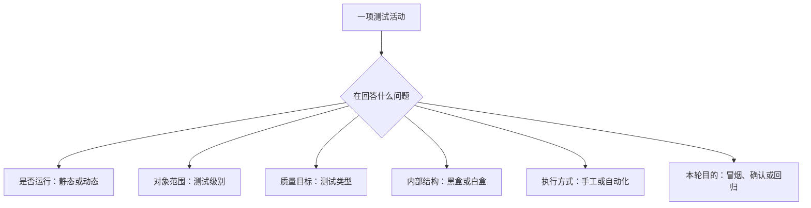
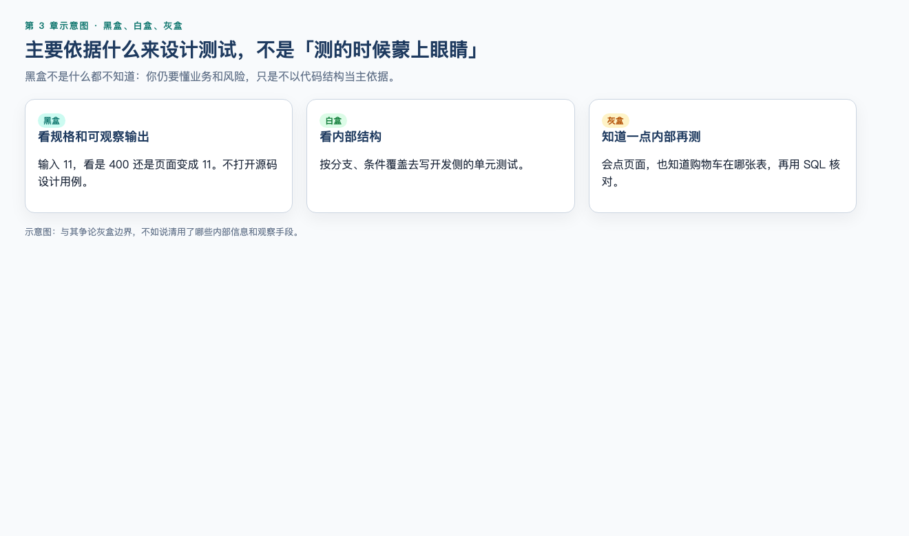
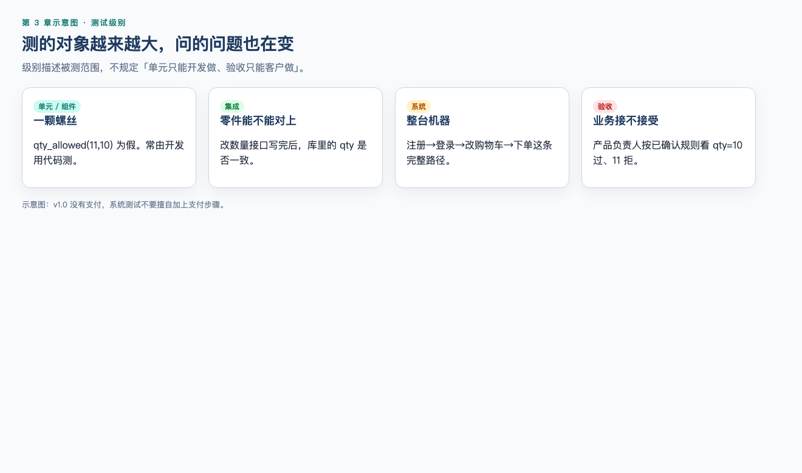

# 第 3 章：软件测试分类体系

> **一句话核心：** 分类是坐标轴，不是互斥工种；同一活动可以同时是功能测试、系统测试、手工测试。

## 这一章解决什么问题

刚开始学习测试时，你会连续遇到很多词：功能测试、系统测试、黑盒测试、回归测试、冒烟测试、手工测试、自动化测试……

最容易出现的误解，是把这些词当成同一张表里的互斥选项。例如有人会问：

> “登录测试到底属于功能测试、系统测试，还是黑盒测试？”

答案可能是：三者都属于。因为这些名称回答的是不同问题。

本章不会让你背一长串定义，而是建立一个分类坐标系。以后看到任何测试活动，先判断它在回答哪一个问题，再选择合适名称。

## 学习目标

学完本章后，你应该能够：

- 区分测试级别、测试类型、测试技术依据和执行方式；
- 区分静态测试与动态测试；
- 解释功能测试与非功能测试；
- 解释黑盒、白盒和灰盒测试；
- 区分单元、集成、系统和验收测试；
- 区分手工测试与自动化测试；
- 解释冒烟、回归、确认和探索性测试；
- 为 MiniShop 的具体场景选择合适的测试分类；
- 避免把不同维度的术语放在一起做错误比较。

## 前置知识

- 第 1 章：软件测试是什么；
- 第 2 章：软件从需求到上线的基本流程。

本章不要求编程基础。

## 场景导入：同一个登录测试为什么有多个名字？

假设测试工程师在浏览器中验证 MiniShop 登录功能：

1. 输入正确手机号和密码；
2. 点击登录；
3. 检查是否进入商城首页；
4. 不查看内部代码；
5. 由测试人员手动执行；
6. 这条用例被放入每次发布前的核心检查集合。

这项活动可以同时被描述为：

- 从关注目标看：功能测试；
- 从测试级别看：系统测试；
- 从掌握内部结构的程度看：黑盒测试；
- 从执行方式看：手工测试；
- 从变更后的测试目的看：回归测试的一部分。

这些说法并不冲突。

## 3.1 先建立六条分类轴 ⭐⭐⭐

先说明一个边界：不同标准、教材和组织对“测试类型”“测试方法”等词的使用范围可能不同。下面六条轴是本课程为了帮助初学者避免概念混淆而采用的教学模型，不是唯一的行业分类法。工作中应以团队采用的标准和术语表为准。

| 分类轴 | 它回答的问题 | 常见分类 |
| --- | --- | --- |
| 是否执行被测对象 | 是否需要运行软件来获得结果？ | 静态测试、动态测试 |
| 测试级别 | 正在测试多大范围的对象？ | 单元、集成、系统、验收 |
| 测试类型/质量目标 | 重点验证什么质量特性？ | 功能、性能、兼容性、安全性等 |
| 测试技术依据 | 测试设计主要依据规格还是内部结构？ | 黑盒、白盒，以及实践中的灰盒 |
| 执行方式 | 由人执行还是工具执行？ | 手工、自动化 |
| 测试目的/时机 | 这轮测试为什么执行？ | 冒烟、确认、回归等 |

分类的意义不是给工作贴更多标签，而是帮助团队说清测试范围、目标和方法。

### 静态测试与动态测试

静态测试（Static Testing）不执行被测对象，而是通过评审、静态分析等方式检查需求、设计、代码或其他工作产品。例如在需求评审中发现“退款后优惠券是否返还”没有定义（这是电商领域的分类练习，**不是** MiniShop v1.0 功能）。

动态测试（Dynamic Testing）需要执行被测对象并观察行为。例如启动 MiniShop，用错误密码登录，再检查页面提示和接口状态码。

静态和动态描述的是是否执行被测对象，并不等于“手工”和“自动化”。静态分析可以由工具支持，动态测试既可以手工执行，也可以自动执行。按学习顺序先读第 7 章 Web，再在第 4 章主讲静态测试和需求评审；本节只确定它在分类体系中的位置。

## 3.2 功能测试与非功能测试 ⭐⭐⭐

### 功能测试（Functional Testing）

功能测试关注系统“做了什么”，验证功能是否符合需求、业务规则或验收标准。

> 本章若用电商常见的优惠券、支付、退款、订单状态做分类例子，只为讲清词汇。MiniShop v1.0（第 19 章）**没有**这些能力：有注册、登录、商品、购物车数量和创建订单（成功只返回 `id`）。

MiniShop 示例（与 v1.0 对齐的部分）：

- 正确账号能否登录；
- 库存不足时能否阻止把数量改成 11；
- 创建订单是否返回 `id`、Body 是否不含 `status`；
- 普通用户能否访问管理员功能。

电商领域补充例子（非 MiniShop v1.0）：优惠券是否按规则抵扣；支付成功后订单状态是否正确。

功能测试不仅验证正常流程，还要覆盖异常、边界、状态、权限和数据一致性场景。

### 非功能测试（Non-functional Testing）

非功能测试关注系统“以什么质量完成工作”。它可以涉及性能效率、兼容性、可靠性、信息安全性、交互能力（ISO/IEC 25010:2023；旧资料常称易用性）等质量目标。

MiniShop 示例：

- 搜索结果是否在规定时间内返回；
- 手机和桌面浏览器是否都能正常显示；
- 服务长时间运行是否稳定；
- 在规定威胁和使用场景下，身份认证、授权与数据保护是否达到安全目标；
- 错误提示是否容易理解。

功能与非功能的边界有时取决于测试目标。例如，“普通用户访问管理员接口应返回拒绝结果”可以作为一条安全相关功能需求进行功能测试；当团队进一步评估访问控制机制抵御越权风险的能力时，则属于更广的安全测试。分类时要说明目标，不能只看操作步骤。

“功能”和“非功能”不是“重要”和“不重要”的区别。支付金额正确是功能问题；支付接口在目标负载下能否稳定响应是性能问题，两者都可能阻塞上线。

## 3.3 黑盒、白盒与灰盒测试 ⭐⭐⭐

### 黑盒测试（Black-box Testing）

黑盒测试主要依据需求、规则、输入和可观察输出设计测试，不依赖被测对象内部代码结构。

例如测试登录时，关注输入账号密码后页面和接口返回什么，而不依据某一条代码分支来设计用例。

黑盒不等于“什么都不知道”。测试人员仍然需要理解业务、接口、数据和风险，只是不以内部代码结构作为主要测试依据。

### 白盒测试（White-box Testing）

白盒测试依据代码、控制流、数据流或内部结构设计和评估测试。

例如开发人员检查登录函数中的每个判断分支是否被测试覆盖。白盒测试经常出现在单元测试和代码级测试中，但“白盒”与“单元”不是同义词：一个是设计视角，一个是测试级别。

### 灰盒测试（Gray-box Testing）

“灰盒”是行业实践中常用的描述，表示测试人员掌握部分内部信息，并利用这些信息提高测试针对性。

例如测试下单功能时，既从用户界面操作，也知道订单数据存在哪些表、接口如何调用，再通过数据库和日志验证结果。

需要注意：不同资料对灰盒边界可能不同。实际工作中，与其争论名称，不如说清楚你使用了哪些内部信息、测试依据和观察手段。

## 3.4 四个常见测试级别 ⭐⭐⭐

测试级别按照被测对象的范围和测试目标划分。不同组织的名称和边界可能略有差异。

### 单元/组件测试（Unit/Component Testing）

测试较小、可独立处理的代码单元或组件，常由开发人员使用代码完成。

MiniShop 示例：单独验证“数量是否超过当前库存”这个判断在 `qty=10` / `qty=11` 边界上的结果。

### 集成测试（Integration Testing）

关注组件、模块、服务或外部系统之间的接口和交互。

MiniShop 示例：改购物车数量的接口写完后，授权测试库里的 `qty` 是否与接口结果一致。电商补充例子：订单服务调用库存服务后两边数据是否一致（v1.0 无独立订单服务与支付回调）。

集成测试不只意味着“把两个页面连起来测”，重点是交互边界、数据传递和协议契约。

### 系统测试（System Testing）

针对完整、已集成系统验证端到端功能和系统级质量特性。

MiniShop 示例：从注册、登录、看商品、改购物车数量到创建订单，验证完整购物流程。v1.0 没有支付步骤。

### 验收测试（Acceptance Testing）

从业务和用户需要出发，判断系统是否满足验收标准，是否具备被接受或交付的条件。业务方、客户、产品代表或用户可能参与，具体责任以项目约定为准。

MiniShop 示例：产品负责人依据已确认的验收标准，验证库存为 10 时 `qty=10` 允许、`qty=11` 拒绝。优惠券促销是电商验收的常见例子，不属于 v1.0。

### 不要把测试级别理解成固定人员分工

“单元测试一定只由开发做”“验收测试一定只由客户做”都过于绝对。测试级别描述被测对象和目标，不直接规定唯一执行角色。

## 3.5 手工测试与自动化测试 ⭐⭐⭐

### 手工测试（Manual Testing）

由人直接操作、观察、判断和记录结果。它适合需求频繁变化、探索未知风险、体验判断和一次性验证等场景。

### 自动化测试（Automated Testing）

借助脚本或工具支持测试活动。自动化可以覆盖测试数据准备、环境配置、步骤执行、结果比较、报告生成等环节。它适合稳定、重复、高频且结果可明确判断的场景，并不等于“让脚本自动点击页面”。

| 场景 | 更可能适合的方式 | 原因 |
| --- | --- | --- |
| 新页面首次探索 | 手工为主 | 需要观察和临场判断 |
| 每次构建检查登录 API | 自动化 | 高频、稳定、断言明确 |
| 判断提示文案是否容易理解 | 人工评估为主 | 需要语境和体验判断 |
| 运行大量数据组合 | 自动化更有优势 | 机器重复执行效率高 |

手工和自动化不是互相淘汰的关系。自动化也不是一种独立测试级别，它是一种执行方式，可以用于单元、接口、系统、回归等多种场景。

## 3.6 冒烟测试 ⭐⭐⭐

第 2 章 2.7 已定义。本轴只回答这一轮为什么测。MiniShop 的冒烟集合可能包括：首页能打开、用户能登录、商品列表能加载、商品能加入购物车、订单能够提交。冒烟通过不代表系统质量已经合格。

## 3.7 确认测试与回归测试 ⭐⭐⭐

第 2 章 2.7 已定义。本轴只回答这一轮为什么测。

| 名称 | 这一轮为什么测 |
| --- | --- |
| 冒烟 | 这份构建能不能开始测 |
| 确认（Confirmation） | 这个缺陷修没修好 |
| 回归 | 这次修改有没有弄坏别的已测区域 |

例子：MiniShop 修复“购物车数量能超过库存”后，重测库存 10 时不能设为 11 是确认；检查合法改数量、登录和创建订单（Body 无 `status`）是回归。v1.0 没有删除购物车接口，也没有结算页。回归范围按修改和风险定，不是每次全量。

## 3.8 探索性测试 ⭐⭐

探索性测试（Exploratory Testing）是在测试过程中同时进行学习、测试设计和执行。测试人员根据即时发现不断调整下一步，而不是完全依照预先写好的固定步骤。

例如测试 MiniShop 搜索功能时，测试人员发现输入连续空格会出现异常提示，于是继续尝试前后空格、不同语言、超长关键词和快速连续搜索。

探索性测试不是“随便点”。高质量的探索通常有明确目标、时间盒、测试记录和发现总结。它可以补充脚本化测试，但不意味着所有文档和计划都没有价值。

## 3.9 兼容性测试 ⭐⭐

兼容性测试关注系统在目标环境组合中的行为，例如：

- 浏览器及其版本；
- 操作系统；
- 设备类型、屏幕尺寸和硬件配置；
- 与其他软件、服务、组件或数据格式的共存与互操作。

弱网、高延迟或丢包会影响用户体验，但“网络条件”本身不是兼容性的同义词。它可能作为性能效率、可靠性或特定移动场景的测试条件出现。

不能简单说“测 Chrome、Firefox、Edge 就覆盖了兼容性”。应根据用户分布、合同要求、业务风险和团队资源确定兼容矩阵。

## 3.10 性能测试基础 ⭐

性能测试关注响应时间、吞吐量、并发处理能力、资源使用和稳定性等目标。

例如“搜索很快”不可测试；“在约定环境和负载模型下，搜索请求响应时间的第 95 百分位数不超过目标阈值”才更接近可验证目标。阈值必须来自需求、服务目标或风险判断，不能照搬示例数字。

本章只认识分类。性能指标、负载模型和 JMeter 将在第 18 章展开。

## 3.11 安全测试基础 ⭐

安全测试关注身份认证、权限、敏感数据保护、输入处理、会话管理和安全配置等风险。

MiniShop 入门场景包括：

- 未登录用户不能查看订单；
- 普通用户不能进入后台管理；
- 用户不能读取其他人的订单；
- 密码和令牌不应出现在不恰当的位置。

本课程中的安全测试只允许在自己拥有或明确获授权的测试环境中进行，不把攻击真实网站作为练习。

## 3.12 一张表看懂常见混淆 ⭐⭐⭐

| 错误比较 | 为什么错误 | 正确问法 |
| --- | --- | --- |
| 功能测试还是系统测试？ | 一个是质量目标，一个是测试级别 | 这是哪一级别的功能测试？ |
| 黑盒测试还是手工测试？ | 一个是设计视角，一个是执行方式 | 是黑盒设计、手工执行吗？ |
| 自动化测试还是回归测试？ | 一个是执行方式，一个是测试目的 | 回归测试哪些部分适合自动化？ |
| 冒烟测试还是接口测试？ | 一个是测试目的/测试集，一个是测试对象与访问层面 | 冒烟集合是否包含接口检查？ |
| 白盒测试还是单元测试？ | 白盒是结构视角，单元是级别 | 单元测试是否采用白盒技术？ |

## MiniShop 工作实战

需求：空白关键字搜索不应返回全量商品（PRD `R-SEARCH`，当前实现不符合，见 BUG-001）。或：库存 10 时 `qty=11` 应被拒绝。

可以这样组合测试分类（用仓库里真实存在的功能，不要发明下架/双服务/结算）：

1. 开发用单元测试验证关键字过滤或 `qty_allowed`；
2. 用集成测试对照改数量接口与 `products.stock`；
3. 测试人员从页面执行黑盒功能测试；
4. 若缺陷修复，重测原失败场景属于确认测试；BUG-001 目前仍开放，不要写成已修复；
5. 检查登录、合法改数量和创建订单（无 `status`）属于回归测试；
6. 将稳定的核心场景加入自动化回归（仓库 pytest 已覆盖 qty 与搜索）；
7. 发布候选版本先跑关键冒烟集合。

这里没有哪一个名称能单独描述全部工作。专业表达应该包含维度，例如：“对购物车数量规则执行系统级功能测试，并在修复后完成确认测试和风险相关回归测试。”

### 本章实操作业：制作一张测试分类卡片

从 MiniShop 选择一个场景，例如登录、加入购物车或提交订单，建立一张分类卡片：

| 项目 | 你的判断 |
| --- | --- |
| 是否执行被测对象 | 静态还是动态？ |
| 测试级别 | 单元、集成、系统还是验收？ |
| 质量目标 | 功能或哪类非功能目标？ |
| 结构视角 | 黑盒、白盒或说明使用了哪些内部信息？ |
| 执行方式 | 手工、自动化或组合？ |
| 本轮目的 | 冒烟、确认、回归或其他？ |
| 选择依据 | 为什么这样分类？ |

完成标准：至少填写五个维度；每项都说明依据；允许一个活动同时属于多个维度；不得只写名称而不解释。

## 常见错误

### 错误 1：黑盒测试就是手工测试

黑盒测试也可以自动化执行；自动化接口测试经常依据输入和输出断言，不需要依据内部代码路径设计。

### 错误 2：自动化测试一定比手工测试高级

它们适合的目标不同。没有稳定需求和可靠断言时，自动化可能产生较高维护成本。

### 错误 3：冒烟测试通过就可以上线

冒烟只验证一组关键能力，不能替代完整的风险评估和必要测试。

### 错误 4：回归测试就是把所有用例再跑一遍

全量回归是可能的策略，但不是定义。实际范围应结合修改影响、产品风险、时间和自动化能力选择。

### 错误 5：探索性测试就是随便操作

探索性测试需要目标、观察、推理、记录和总结。

### 错误 6：测试分类是互斥的

一项活动可以同时属于多个分类维度。

## 面试角度

### 问题 1：测试有哪些分类？

不要直接背几十个词。可以回答：

> 我会按维度分类。按级别有单元、集成、系统和验收测试；按质量目标有功能和各类非功能测试；按测试设计依据可讨论黑盒和白盒技术；按执行方式分手工与自动化；按变更后的目的还会区分确认和回归测试。不同维度可以组合，不能混为互斥分类。

### 问题 2：确认测试和回归测试有什么区别？

先给结论，再举例：确认测试检查原缺陷是否修好；回归测试检查修改是否破坏其他原本正常的功能。购物车库存缺陷修复后，重测 `qty=11` 是确认，继续检查登录和创建订单是回归。

### 问题 3：手工测试会被自动化完全替代吗？

不会简单替代。稳定、重复、断言明确的检查适合自动化；探索未知风险、体验判断和频繁变化场景仍需要人的观察和推理。实际项目通常组合使用。

## 小练习

### 练习 1

测试人员不看代码，通过浏览器验证登录结果。这至少可以属于哪些分类维度？

### 练习 2

开发修复“库存为 10 时仍能把购物车改成 11”的问题后：

1. 重测原来失败的超库存步骤；
2. 检查合法数量、等于库存、登录和下单是否仍可用。

两部分分别更接近什么测试？

### 练习 3

为什么“自动化测试和系统测试哪个好”是一个不准确的问题？

### 练习 4

为 MiniShop 写出五项冒烟检查。

### 练习 5

一个测试人员没有预写详细步骤，但设定 45 分钟目标，围绕购物车异常操作边测试边记录。这是否属于探索性测试？为什么？

### 练习 6

“在 Chrome 上通过”能否证明兼容性没有问题？说明原因。

### 练习 7

将下面活动放到适合的测试级别：

- 验证“数量是否超过库存”这个函数；
- 验证改数量接口与数据库库存字段是否一致；
- 验证完整购物流程（登录到创建订单）；
- 业务代表依据验收标准确认购物车数量规则。

### 练习 8

需求评审发现“空搜索应不应该返回全量商品”没有定义，这属于静态还是动态测试？如果之后运行系统观察空关键字的搜索结果，又属于哪一种？

## 练习答案

1. 可以是系统级功能测试、黑盒测试、手工测试；如果它在版本修改后执行，也可能属于回归测试。关键是说明分类维度。
2. 重测原失败场景是确认测试；检查相关正常功能和风险场景是回归测试。
3. 自动化描述执行方式，系统测试描述测试级别，两者可以组合，不是同一维度的二选一。
4. 例如：首页打开、登录、商品加载、加入购物车、提交订单。实际集合应根据版本关键能力和风险调整。
5. 可以。探索性测试允许学习、设计和执行同步进行，但仍应有目标、时间盒、记录和总结。
6. 不能。目标环境可能包括其他浏览器、版本、操作系统和设备，以及与其他软件的互操作，应依据兼容矩阵判断。弱网、高延迟是常见测试条件，但不是兼容性的同义词（见 3.9）。
7. 依次为单元/组件测试、集成测试、系统测试、验收测试。
8. 需求评审没有执行被测系统，属于静态测试；运行系统并观察空搜索结果，属于动态测试。

## 本章检查清单

- [ ] 我能说出六条分类轴；
- [ ] 我能区分静态测试和动态测试；
- [ ] 我能区分功能测试和非功能测试；
- [ ] 我能区分黑盒、白盒和灰盒；
- [ ] 我能区分单元、集成、系统和验收测试；
- [ ] 我知道测试级别不等于固定人员分工；
- [ ] 我能解释手工和自动化的适用场景；
- [ ] 我能区分冒烟、确认和回归测试；
- [ ] 我能解释探索性测试为什么不是随便点；
- [ ] 我能为 MiniShop 场景组合多个分类标签；
- [ ] 我能独立完成一张 MiniShop 测试分类卡片；
- [ ] 我知道安全练习只能在自有或授权环境进行。

## 本章总结

本章最重要的不是记住多少名词，而是知道每个名词在回答什么问题。先判断是否执行被测对象，再分别说明测试级别、质量目标、结构视角、执行方式和本轮测试目的。不同维度可以组合，分类名称也必须带着上下文使用。

1. 静态和动态回答“是否执行被测对象”；
2. 测试级别回答“测试多大范围的对象”；
3. 测试类型回答“关注什么质量目标”；
4. 黑盒和白盒回答“是否依据内部结构”；
5. 手工和自动化回答“如何执行”；
6. 冒烟、确认和回归回答“这一轮为什么测”。

一项测试可以同时属于多个维度。先说维度，再说分类，表达才准确。

## 本章可运行性说明

本章是分类概念章，没有 Python、SQL、curl、JSON 或 pytest 示例，因此没有需要实际执行验证的代码。安全测试示例只用于自有或明确授权环境。

## 参考资料

- [ISTQB Certified Tester Foundation Level（CTFL）v4.0 官方页面](https://istqb.org/certifications/certified-tester-foundation-level-ctfl-v4-0/)
- 本仓库 [课程主控大纲](../docs/COURSE_OUTLINE_v1.2.md)
- 本仓库 [全局内容质量标准](../standards/QUALITY_STANDARD_v1.0.md)

## 下一章预告

按照正式学习顺序，下一章先学习第 7 章《Web 基础》。理解浏览器、URL、DNS、客户端、服务器和前后端后，再进入第 4 章的需求分析与静态测试。
