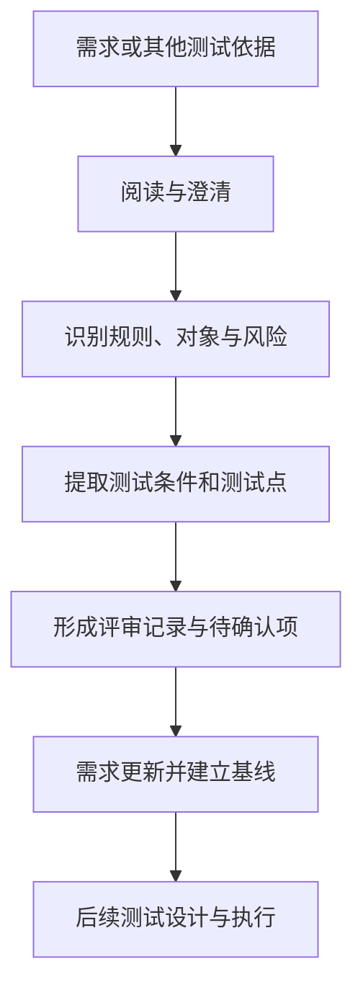

# 第 4 章：测试需求分析与静态测试

> 重要级别：⭐⭐⭐ 必须掌握  
> 主案例：MiniShop 个人软件测试实践项目

## 这一章解决什么问题

初级测试工程师最容易犯的错误之一，是拿到一个页面就立即开始“点”。如果需求本身存在歧义、遗漏或矛盾，测试人员即使执行了很多步骤，也可能不知道什么结果才算正确。

这一章解决两个核心问题：

1. 软件还没有运行时，测试人员能做什么？
2. 面对一份 PRD 或用户故事，怎样把业务描述转化为可测试的问题和测试点？

学完后，你应该能参加一次基础需求评审，并为 MiniShop 的注册、登录或购物车功能产出一份有证据的需求分析结果。

## 学习目标

完成本章后，你应该能够：

- 区分测试依据、测试需求、测试条件和测试用例；
- 解释静态测试与动态测试的关系；
- 说明评审和静态分析的区别；
- 阅读 PRD、用户故事、原型和验收条件；
- 判断需求是否清晰、一致、完整、可行、可测试和可追踪；
- 识别需求中的歧义、遗漏、矛盾和不可测试表述；
- 从功能、异常、边界、用户、数据、权限和状态角度拆解测试点；
- 提出带上下文、影响和待确认项的评审问题；
- 完成 MiniShop 注册、登录和购物车需求评审。

## 前置知识

- 已学习第 1 章，理解测试不只发生在程序运行以后；
- 已学习第 2 章，理解测试可以在需求和设计阶段介入；
- 已学习第 3 章，能区分静态测试与动态测试；
- 已学习第 7 章，理解 Web 页面、客户端、服务器和前后端的基本关系。

## 场景导入：一句“购物车数量可以修改”够不够？

MiniShop 新需求写道：

> 用户可以修改购物车中的商品数量。

这句话能说明大方向，却不足以直接开发和测试。测试人员至少还会问：

- 最小数量是多少？
- 最大数量受商品库存、限购还是系统上限控制？
- 能否输入小数、负数、空值或文字？
- 修改时库存发生变化怎么办？
- 商品下架后还能修改吗？
- 未登录用户是否有购物车？
- 修改成功后，页面和数据库里的数量如何一致？（v1.0 无价格、优惠券）
- 若需求提到价格或优惠，那是电商常见追问，须标明不是 MiniShop v1.0 范围
- 请求失败时页面显示什么？刷新后数据是否保持？

这些问题不是“故意挑刺”，而是在开发前降低返工和上线风险。



这是一张教学流程。真实项目可能多轮往返，也可能在 Backlog Refinement、三方协作会议或异步评论中完成。

## 4.1 什么是测试需求分析 ⭐⭐⭐

“测试需求分析”不是把产品需求重新抄一遍，而是结合测试目标和风险，分析需要测试什么、依据是什么、哪些地方还不能测试。

一个实用的产出通常包括：

- 测试对象和范围；
- 已确认的业务规则；
- 关键用户与权限；
- 正常、异常、边界、状态和数据场景；
- 依赖系统和限制条件；
- 需求问题与待确认项；
- 初步测试条件或测试点；
- 可追踪的需求标识。

ISTQB 将测试分析概括为回答“测试什么”，测试设计则进一步回答“怎样测试”。本章主要解决前者；第 5 章再把测试点系统地转化为测试用例。

## 4.2 四个容易混淆的概念 ⭐⭐⭐

| 概念 | 回答的问题 | MiniShop 示例 |
| --- | --- | --- |
| 测试依据（Test Basis） | 根据什么分析和设计测试？ | PRD、用户故事、原型、OpenAPI、业务规则 |
| 测试需求 | 为达到测试目标，需要验证哪些要求或质量需要？ | 验证购物车数量不能超过可售库存 |
| 测试条件（Test Condition） | 哪个可测试方面需要被检查？ | 数量等于库存、数量超过库存、库存变化 |
| 测试用例（Test Case） | 用什么前置条件、数据、步骤和预期结果检查？ | 库存 10，输入 11，提交后应拒绝并保持原值 |

企业中“测试需求”和“测试点”可能没有统一模板。本课程把“测试点”作为便于执行的教学名称：它是从测试条件继续细化出的检查角度，但还不一定包含完整步骤和数据。

## 4.3 静态测试与动态测试 ⭐⭐⭐

静态测试（Static Testing）不执行被测对象，通过检查工作产品发现缺陷或改进机会。动态测试（Dynamic Testing）需要运行被测对象并观察行为。

| 活动 | 静态还是动态 | 原因 |
| --- | --- | --- |
| 评审登录需求 | 静态 | 未运行登录功能 |
| 使用规则检查工具扫描代码 | 静态 | 分析代码而不执行被测代码 |
| 在浏览器提交登录表单 | 动态 | 运行系统并观察结果 |
| 调用登录 API 并检查响应 | 动态 | 执行接口行为 |

静态不等于人工，动态也不等于自动。静态分析可以由工具执行；动态测试可以手工或自动执行。

## 4.4 评审与静态分析 ⭐⭐⭐

静态测试常见两类方式：

### 评审（Review）

由人对工作产品进行检查、讨论和反馈，例如评审：

- PRD 和用户故事；
- 原型和交互说明；
- 架构或数据库设计；
- API 定义；
- 源代码；
- 测试计划和测试用例。

### 静态分析（Static Analysis）

通常由工具依据规则分析工作产品，例如检查代码规范、潜在缺陷、复杂度、依赖风险或配置问题。

本章重点是需求评审。静态分析只建立概念，不提前教授具体代码扫描工具。

### 静态测试的边界

静态测试能够提前发现问题，但不能证明软件运行时一定正确。例如评审可以发现登录锁定规则没有写清，却不能证明实现后的并发计数、数据库更新和页面提示都正确。运行行为仍需要动态测试验证。

静态测试与动态测试不是替代关系：前者更早检查工作产品，后者通过执行获得运行证据。

## 4.5 为什么测试要提前介入 ⭐⭐⭐

提前介入的价值包括：

- 在代码产生前发现规则问题；
- 提高需求可测试性；
- 提前识别测试环境、数据和依赖；
- 让开发、产品和测试对预期结果形成共同理解；
- 更早评估工作量和风险；
- 为后续测试设计建立可靠依据。

但“越早越好”不等于在信息不足时强行一次定稿。需求会演进，评审结论也要随变更更新。

## 4.6 需求评审是什么 ⭐⭐⭐

需求评审是相关人员检查需求工作产品、发现问题并形成处理结论的活动。

一次基础评审可以包含：

1. 计划：明确评审对象、范围、人员、时间和目标；
2. 启动：说明背景、入口材料和评审方式；
3. 独立检查：参与者先阅读并记录问题；
4. 沟通与分析：讨论问题、影响和处理人；
5. 修正与报告：更新需求并记录结论；
6. 跟踪：确认问题已经处理或被明确接受。

小团队不一定召开正式会议，但至少要保证问题有记录、结论有负责人、修改可以追踪。

### 常见参与者

- 作者：编写需求并负责修正；
- 评审者：从业务、开发、测试、设计、运维等角度发现问题；
- 主持或组织者：控制范围、节奏和结论；
- 记录者：保存问题、决定和行动项。

角色可以兼任，也不必在所有轻量评审中全部出现。

### 常见评审类型 ⭐⭐

评审可以从轻量到正式采用不同形式：

| 类型 | 典型特点 | 适用示例 |
| --- | --- | --- |
| 非正式评审 | 流程和记录要求较少，快速反馈 | 同事检查一条简单用户故事 |
| 走查（Walkthrough） | 通常由作者带领参与者理解工作产品并讨论 | 产品经理逐步讲解购物车流程 |
| 技术评审（Technical Review） | 由具备相关技术或领域知识的人员评估方案 | 评审库存并发和接口约定 |
| 审查（Inspection） | 目标、角色、入口、记录和跟踪通常更正式 | 高风险或强合规工作产品检查 |

正式程度越高，不代表一定越好。应根据风险、复杂度、法规、团队成熟度和评审目标选择。不同组织可能使用不同名称，不能只凭会议标题判断实际评审方式。

### 五种实用评审技术 ⭐⭐⭐

1. **自由检查（Ad hoc）**：根据个人经验寻找问题，上手快，但覆盖容易受经验影响；
2. **基于清单（Checklist-based）**：按历史缺陷和质量规则逐项检查，稳定但清单需要维护；
3. **基于场景（Scenario-based）**：沿用户流程或业务场景检查前置、主流程、异常和结束；
4. **基于角色（Role-based）**：分别站在普通用户、管理员、客服、攻击者或运维人员角度检查；
5. **基于视角（Perspective-based）**：评审者尝试从后续工作视角使用需求，例如测试人员据此提取测试点、开发人员据此设计实现。

实际评审可以组合使用。例如先用清单检查格式和通用规则，再用场景与角色方法发现业务遗漏。清单不是越长越好，应根据历史问题定期删除无效项、增加高价值项。

## 4.7 如何阅读 PRD ⭐⭐⭐

PRD（Product Requirements Document，产品需求文档）没有全球统一格式。阅读时可以按下面顺序：

### 第一次：理解业务目标

- 为什么做？
- 为谁解决什么问题？
- 怎样判断有价值？
- 本次明确不做什么？

### 第二次：建立业务流程

- 用户从哪里进入？
- 按什么顺序操作？
- 有哪些分支、失败和返回路径？
- 状态怎样变化？

### 第三次：核对规则和数据

- 输入、输出和计算规则是什么？
- 必填、范围、格式、唯一性和默认值是什么？
- 数据保存、更新和删除规则是什么？

### 第四次：核对角色、权限与依赖

- 谁能查看、创建、修改和删除？
- 是否只能访问自己的数据？
- 依赖哪些接口、服务、配置或第三方系统？

### 第五次：检查验收和可测试性

- 每条结果能否客观观察？
- 测试环境和数据是否可获得？
- 异常结果是否定义？
- 需求与原型、接口或其他规则是否一致？

以上“五次阅读”是本课程帮助初学者分层处理信息的方法，不是 ISTQB 或所有公司的强制标准流程。需求较短时可以合并，复杂需求则可能需要更多轮和不同专业人员参与。

## 4.8 需求可测试性 ⭐⭐⭐

可测试性意味着要求能够用可行的方法验证，并能判断通过或失败。

需求：

> 登录速度要快，页面要友好。

问题在于“快”和“友好”缺少场景、指标和判断方法。不能由测试人员擅自补成“2 秒以内”。正确做法是提出问题，例如：

- 在什么环境、网络条件和负载下测量？
- 测量从哪个时点到哪个时点？
- 使用平均值、百分位数还是最大值？
- 目标阈值和依据是什么？
- “友好”面向哪些用户、任务和可用性目标？

可测试需求通常应当：

- 有明确对象与触发条件；
- 有可观察结果；
- 规则、单位和范围清楚；
- 不与其他要求冲突；
- 在可获得的环境和数据下能够验证；
- 可以追踪到来源和后续测试证据。

## 4.9 发现需求歧义 ⭐⭐⭐

歧义是同一句话存在多种合理解释。

示例：

> 连续输错密码后锁定账号。

至少存在这些解释：

- “连续”是否在同一会话内？成功一次是否清零？
- 输错几次？
- 按账号、设备还是 IP 统计？
- 锁定多久？
- 管理员能否解锁？

不要只写“需求不明确”。更好的评审问题是：

> R-LOGIN-05 使用“连续输错”但未定义计数主体、次数、重置条件和锁定时长，开发可能产生不同实现，也无法确定边界测试。请产品与安全负责人确认规则。

## 4.10 发现需求遗漏 ⭐⭐⭐

遗漏是业务所需内容没有被描述。

购物车需求只描述“修改成功”，但可能遗漏：

- 修改失败如何提示；
- 商品已下架如何处理；
- 库存不足如何处理；
- 若需求包含优惠，金额何时重算（**v1.0 无优惠券**，这是电商遗漏检查的思路）；
- 多端同时修改如何处理；
- 请求超时后页面与服务端数据如何一致。

发现遗漏常用方法：顺着完整用户旅程，检查前置、主流程、分支、异常、结束和恢复。

## 4.11 发现需求矛盾 ⭐⭐⭐

矛盾是两个或多个要求不能同时成立。

例如：

- PRD 写“密码最少 8 位”；
- 原型提示“密码最少 6 位”；
- 接口文档限制 `minLength: 10`。

测试人员不能自行选择最喜欢的一个，也不能为三个版本分别写预期结果。应标出来源和冲突，推动需求所有者确定唯一基线。

## 4.12 功能拆解方法 ⭐⭐⭐

面对一个功能，可以按“对象—动作—规则—结果—状态—依赖”拆解。

以购物车为例：

| 维度 | 问题 |
| --- | --- |
| 对象 | 哪个用户、哪件商品、哪个购物车条目？ |
| 动作 | 添加、修改、删除还是结算？ |
| 规则 | 库存、限购是什么？若文档还写了价格或优惠，先确认是否在范围内（**v1.0 无价格/优惠券**） |
| 结果 | 页面、接口、数据和提示如何变化？ |
| 状态 | 商品、用户处于什么状态？（v1.0 订单无状态机） |
| 依赖 | 商品、库存或登录服务是否可用？ |

这不是测试用例模板，而是防止分析只盯着页面按钮的思考框架。

## 4.13 七类测试场景 ⭐⭐⭐

### 正常场景

用户具备合理前置条件，使用有效数据完成主要业务流程。

例：已登录用户把有库存商品数量从 1 改为 2。

### 异常场景

输入、依赖或操作不满足预期条件。

例：修改数量时库存服务不可用。

### 边界场景

检查规则临界点及其附近。

例：若数量范围为 1～库存，检查 0、1、库存和库存+1。具体规则确认前只能记录候选边界，不能把假设写成正式预期。

### 用户场景

从不同用户目标、经验和使用路径分析。

例：新用户首次注册、老用户重新登录、多设备用户恢复购物车。

### 数据场景

关注数据格式、状态、组合、持久化和一致性。

例：修改购物车后刷新页面，数量是否与服务端保存结果一致。

### 权限场景

关注身份、角色、资源归属和操作授权。

例：用户 A 不能读取或修改用户 B 的购物车。

### 状态场景

关注对象当前状态和允许的状态变化。

例：在售商品可以加入购物车；下架商品如何处理必须由需求定义。

这些维度会重叠。一条“用户 A 修改用户 B 的已下架商品”可能同时涉及权限、状态和异常场景。

## 4.14 从需求到测试点 ⭐⭐⭐

假设已确认规则（**本章教学规则**，用于练习从规则抽出测试点；v1.0 无价格/小计字段，正式契约以第 19 章 PRD 为准）：

> 登录用户可以修改自己购物车中在售商品的数量；数量必须是正整数且不得超过提交时可售库存。修改成功后保存新数量；失败时保持原值并提示原因。教学示例里还可以检查“小计是否重算”，那是为了练习数据场景，不代表 MiniShop 已有金额字段。

可以得到测试点：

- 修改为合法正整数；
- 修改为 1；
- 修改为等于可售库存；
- 修改为 0、负数、小数、空值、文字；
- 修改为超过可售库存；
- 提交前库存发生变化；
- 商品已下架；
- 未登录或登录失效；
- 尝试修改他人购物车条目；
- 修改成功后小计与总价重算；
- 修改失败后原值保持；
- 刷新或重新登录后数据保持一致。

这里只列“测什么”，尚未写完整步骤和预期结果。第 5 章再使用等价类、边界值等技术设计用例。

## 4.15 高质量评审意见怎么写 ⭐⭐⭐

推荐结构：

```text
需求标识/位置：
已观察问题：
可能影响：
需要确认的问题：
建议责任人：
当前状态：待确认 / 已确认 / 已修正 / 接受风险
```

还应根据影响确定处理优先级，例如：

- 阻塞：不确认就无法统一实现或形成有效预期；
- 高：可能造成关键业务、金额、权限或数据风险；
- 中：影响重要分支，但存在可控替代方案；
- 低：表达、提示或局部一致性问题。

这些级别是本课程的评审约定，不是行业统一标准。问题关闭时应保留证据，例如更新后的需求链接、版本、确认人和结论；仅在群聊里回复“知道了”不能保证基线已经更新。

低质量意见：

> 登录这里有问题。

高质量意见：

> R-LOGIN-05 仅写“多次失败后锁定”，未定义计数次数、时间窗口、重置条件和锁定时长。该遗漏会导致前后端实现及边界预期不一致。请产品负责人联合安全负责人确认；确认前相关测试点标记为阻塞。

评审意见应对准工作产品，不针对个人。

## 4.16 MiniShop 注册需求分析 ⭐⭐⭐

### 待评审草案

> 用户输入手机号、验证码和密码即可注册。手机号不能重复，密码为 8～20 位。注册成功后进入首页。

### 需要澄清

- 手机号支持哪些国家或地区？本项目是否暂定中国大陆 11 位手机号？
- 验证码长度、有效期、发送频率和错误次数是什么？
- 密码按字符、字节还是其他规则计数？允许哪些字符？
- 手机号已存在时是否提示可直接登录？
- 重复点击注册如何避免重复账户？
- 注册成功是否自动登录？登录状态如何建立？
- 验证码服务不可用时如何提示？
- 隐私政策是否必须勾选，版本如何记录？

注意：这些是评审问题，不是已经确认的 MiniShop 正式规则。草案里的短信验证码、8～20 位密码也不是 v1.0：v1.0 注册是手机号 + 8～16 位且须同时包含字母和数字的密码，**无短信**。第 19 章项目用例必须跟 PRD，不要把本草案抄进简历。

## 4.17 MiniShop 登录需求分析 ⭐⭐⭐

### 待评审草案

> 用户使用手机号和密码登录。密码错误多次后锁定账号。

### 需要澄清

- 账号不存在与密码错误是否使用相同提示？
- “多次”具体是多少次，在哪个时间窗口统计？
- 成功登录后失败计数是否清零？
- 锁定时长、解锁方式和通知方式是什么？
- 已禁用、未激活或已锁定账号分别如何处理？
- 同一账号是否允许多设备同时登录？
- 登录请求超时后，客户端如何判断是否成功？
- 登录成功跳转原目标页还是固定首页？

安全相关规则应由产品、安全和技术人员共同确认，测试人员不能凭经验擅自决定阈值。

## 4.18 MiniShop 购物车需求分析 ⭐⭐⭐

### 待评审草案

> 用户可把商品加入购物车、修改数量和删除商品，系统实时显示总价。

这是待评审草案。MiniShop v1.0 有购物车数量规则，**没有**价格、优惠、运费和总价字段；下面的澄清问题用来练习找遗漏，不要当成已冻结契约。

### 需要澄清

- 未登录用户是否支持本地购物车？登录后是否合并？
- 同一规格商品重复加入时新增条目还是累加数量？
- 数量上限取库存、限购、系统上限中的哪一个或最小值？
- “实时”是客户端即时计算还是服务端确认后更新？
- 价格变化、优惠失效或商品下架时如何显示？
- 删除是否需要确认，能否撤销？
- 多设备同时修改时采用什么冲突策略？
- 总价是否含优惠、运费和税费？金额舍入规则是什么？

## 4.19 MiniShop 需求评审实战 ⭐⭐⭐

### 练习材料：购物车数量修改需求 v0.1

```text
R-CART-01 用户可以修改购物车商品数量。
R-CART-02 商品数量最多为 99。
R-CART-03 商品数量不能超过库存。
R-CART-04 修改后立即更新总价。
R-CART-05 修改失败时提示用户。
原型提示：一次最多购买 20 件。
接口说明：quantity 为 integer，minimum 为 0。
```

### 第一步：标出问题

- R-CART-02、原型的 20 件与库存限制之间优先级不明；
- “minimum 为 0”与购物车条目通常至少 1 件的业务可能冲突；
- “立即”不可测量；
- “提示用户”没有提示内容和失败分类；
- 没有定义库存变化、下架、登录失效和数据保存；
- 没有定义总价组成与舍入规则。

### 第二步：形成评审记录

| ID | 类型 | 级别 | 问题 | 影响 | 状态 |
| --- | --- | --- | --- | --- | --- |
| REV-001 | 矛盾 | 阻塞 | 上限 99、原型 20 与库存限制未说明优先级 | 前后端校验可能不一致 | 待确认 |
| REV-002 | 矛盾/遗漏 | 阻塞 | 接口允许 0，但未定义 0 是删除还是非法 | 数据和交互结果不确定 | 待确认 |
| REV-003 | 不可测试 | 中 | “立即更新”无观察点和时限 | 无法形成客观预期 | 待确认 |
| REV-004 | 遗漏 | 高 | 未定义各种失败原因与提示 | 无法覆盖异常流程 | 待确认 |

### 第三步：建立候选测试点

在规则未确认前，可以先记录候选测试点，但必须标记“等待基线”：

- 有效数量；
- 最小值附近；
- 库存边界；
- 限购边界；
- 数量为 0；
- 非整数和空值；
- 库存变化；
- 商品下架；
- 失败后原值和总价；
- 多端数据一致性。

## 4.20 需求变更与追踪 ⭐⭐

评审结束不代表需求永远不变。发生变更时至少要：

- 记录变更内容、原因、时间和确认人；
- 标识受影响页面、接口、数据、测试点和文档；
- 更新需求基线与版本；
- 重新评估优先级和回归范围；
- 避免只在聊天中口头修改而不更新正式依据。

简单追踪表：

| 需求 ID | 需求摘要 | 测试点 ID | 状态 | 备注 |
| --- | --- | --- | --- | --- |
| R-CART-01 | 修改购物车数量 | TP-CART-001～006 | 待确认 | 等待数量规则基线 |

追踪不是为了增加表格，而是为了回答：某条需求是否被分析和测试？某次变更影响了哪些证据？

## MiniShop 工作实战：需求评审包

选择注册、登录或购物车之一，提交以下四份内容：

1. 功能流程和业务对象；
2. 需求问题清单；
3. 七类场景测试点；
4. 需求—测试点追踪表。

建议保存为：

```text
exercises/chapter-04-minishop-requirement-review.md
```

交付模板：

```markdown
# MiniShop 需求评审记录

## 基本信息
- 需求名称：
- 需求版本：
- 评审范围：
- 参与角色：
- 日期：

## 已确认规则
| 需求 ID | 规则 | 来源 |
| --- | --- | --- |

## 问题清单
| ID | 位置 | 类型 | 级别 | 问题 | 影响 | 责任人 | 状态 | 关闭证据 |
| --- | --- | --- | --- | --- | --- | --- | --- | --- |

## 测试点
| ID | 场景类型 | 前置/触发 | 检查点 | 依据 | 状态 |
| --- | --- | --- | --- | --- | --- |

## 追踪关系
| 需求 ID | 测试点 ID | 备注 |
| --- | --- | --- |
```

完成标准：至少发现 8 个有依据的问题，覆盖歧义、遗漏、矛盾或不可测试性中的至少三类；至少提取 15 个测试点并覆盖七类场景中的五类；每个问题都说明影响和状态。

其中至少标识一个可能阻塞后续设计的问题。若确实没有阻塞项，应说明判断依据，不能为了凑数虚构问题。

## 常见错误

### 错误 1：需求评审就是检查错别字

语言问题只是很小一部分，更重要的是业务规则、边界、异常、权限、数据、依赖和可测试性。

### 错误 2：测试人员替产品决定规则

测试人员可以提出风险和候选方案，但不能把个人猜测直接写成正式预期。

### 错误 3：只写“需求不清楚”

应指出具体位置、多个解释、可能影响和需要谁确认。

### 错误 4：需求评审没有发现问题就是没有价值

评审也能建立共同理解、确认可测试性并提前准备数据和环境。没有记录到缺陷不代表活动无价值。

### 错误 5：评审会开完就结束

问题需要修正、确认和跟踪；否则会议纪要不能自动变成可靠需求。

### 错误 6：测试点就是测试用例

测试点回答“测什么”，完整用例还会细化前置条件、数据、步骤和预期结果。

### 错误 7：所有需求必须写得无限详细

文档详细程度取决于风险、复杂度、法规和团队协作方式。目标是形成足够、共同、可追踪的理解，而不是追求页数。

## 面试角度

### 问题 1：你怎样进行需求分析？

> 我先确认业务目标、范围、角色和主流程，再检查规则、数据、状态、权限、异常和依赖；随后从正常、异常、边界、用户、数据、权限和状态角度提取测试点。同时记录需求中的歧义、遗漏、矛盾和不可测试项，推动责任人确认，并维护需求与测试点的追踪关系。

### 问题 2：需求不明确怎么办？

> 我不会自行猜测预期结果。我会记录具体需求位置、不同解释和对开发测试的影响，向产品或对应责任人确认；确认后更新正式需求或验收条件，并同步测试点。若在测试开始前仍未确认，会把它作为阻塞项或风险明确报告。

### 问题 3：静态测试有什么价值？

> 静态测试可以在不执行软件时发现需求、设计或代码中的问题，尤其有助于提前发现歧义、遗漏和不一致，降低后期返工。它不能替代动态测试，两者发现的问题类型和证据不同。

### 问题 4：测试点和测试用例有什么区别？

> 测试点主要说明需要检查什么；测试用例进一步规定怎样检查，通常包含前置条件、数据、步骤和预期结果。团队模板可能不同，但二者的详细程度和用途不同。

## 小练习

### 练习 1

判断下列活动属于评审、静态分析还是动态测试：

1. 产品、开发和测试共同检查用户故事；
2. 工具扫描代码中的潜在空指针问题；
3. 在浏览器输入错误密码并检查提示。

### 练习 2

需求写“订单应尽快创建”。指出它为什么不可测试，并提出至少三个澄清问题。

### 练习 3

下面三处说明是否存在矛盾？你应该怎样处理？

- PRD：密码 8～20 位；
- 页面原型：密码 6～16 位；
- API：`minLength=10, maxLength=20`。

### 练习 4

针对“用户可以删除购物车商品”，从正常、异常、权限、数据和状态中任选四类，各写一个测试点。

### 练习 5

为什么测试人员不能看到需求缺少锁定时长后，直接规定为 30 分钟？

### 练习 6

测试条件、测试点和测试用例之间是什么关系？

### 练习 7

阅读 4.19 的需求 v0.1，再补充四条未列出的评审问题。

### 练习 8

将下面意见改写成高质量评审记录：

> 购物车数量这里写得不好。

### 练习 9（实操）

使用本章模板完成一份 MiniShop 注册、登录或购物车需求评审包，并检查是否达到量化完成标准。

### 练习 10

需求很短、风险较低，希望当天获得快速反馈；另一个需求涉及支付金额与合规审计。两者是否必须采用完全相同的评审形式？你会怎样选择评审类型和技术？

## 练习答案

### 答案 1

1. 评审；2. 静态分析；3. 动态测试。

### 答案 2

“尽快”没有明确测量范围和通过标准。可询问：从哪个时点到哪个时点？在哪种环境和负载下？采用哪个统计指标？目标阈值和依据是什么？

### 答案 3

存在矛盾。应记录三个来源及影响，请需求所有者联合前后端确认唯一规则，更新 PRD、原型和接口基线后再形成正式预期，不能自行选择其中一个。

### 答案 4

参考：

- 正常：删除自己购物车中的在售商品；
- 异常：删除请求超时后页面和服务端状态如何处理；
- 权限：用户 A 不能删除用户 B 的条目；
- 数据：删除后刷新页面，条目和总价保持一致；
- 状态：商品已经下架时执行删除。

任选四类并说明预期依据；规则未确认时应标记待确认。

### 答案 5

锁定时长是业务与安全规则，需要考虑风险、用户体验、运营和技术实现。测试人员可以提出方案和风险，但无权把个人经验直接变成产品基线。

### 答案 6

测试条件标识需要检查的可测试方面；测试点将其细化为具体检查角度；测试用例进一步给出可执行的前置、数据、步骤和预期。团队可能合并这些产物，但必须保证“测什么”和“怎样判断”清楚。

### 答案 7

合理答案包括：数量字段能否直接输入？连续点击加减如何处理？修改是否需要服务端确认？价格变化时以哪个价格为准？访客购物车如何处理？页面刷新和多端同步规则是什么？答案不唯一，但要指出位置和影响。

### 答案 8

参考：

> R-CART-01 仅说明数量可修改，没有定义最小值、上限来源、数据类型和失败行为。前后端可能采用不同校验，测试也无法确定边界预期。请产品负责人确认数量规则，并同步原型与接口定义；当前状态为待确认。

### 答案 9

开放实操题。合格证据应包含基本信息、已确认规则、至少 8 个问题、至少 15 个测试点和追踪关系，并满足本章规定的覆盖要求。

### 答案 10

不必相同。低风险短需求可以采用非正式评审或轻量走查，并结合简短清单和场景检查；支付与合规需求适合更正式的技术评审或审查，明确角色、入口、记录和跟踪，并结合清单、场景、角色或视角技术。选择依据是风险、复杂度、法规和目标，而不是认为越正式永远越好。

## 本章检查清单

- [ ] 我能区分测试依据、测试需求、测试条件、测试点和测试用例
- [ ] 我能区分评审、静态分析和动态测试
- [ ] 我能根据风险选择基本评审类型和评审技术
- [ ] 我能说明测试提前介入的价值与边界
- [ ] 我能按五次阅读法分析 PRD
- [ ] 我能判断需求是否可测试
- [ ] 我能发现需求歧义、遗漏和矛盾
- [ ] 我不会擅自替产品确定业务规则
- [ ] 我能按对象、动作、规则、结果、状态和依赖拆解功能
- [ ] 我能从七类场景提取测试点
- [ ] 我能写出包含位置、影响和状态的评审意见
- [ ] 我能识别阻塞问题并保存关闭证据
- [ ] 我能维护简单的需求—测试点追踪关系
- [ ] 我能独立完成 MiniShop 需求评审包

### 进入下一章的自测门槛

1. 练习 1～8 至少完成 7 题，并完成练习 9；
2. 能在不看正文时解释歧义、遗漏、矛盾和不可测试性；
3. 能针对一个简单需求提出至少 8 个有价值的评审问题；
4. 能说明轻量评审与正式评审分别适合什么场景。

## 本章总结

1. 测试需求分析的核心是根据测试依据回答“测试什么”；
2. 静态测试可以在不运行软件时通过评审和静态分析发现问题；
3. 需求评审不只检查文字，还要检查规则、边界、异常、数据、权限、状态和依赖；
4. 需求不明确时应提出有上下文的问题，不能自行猜测预期；
5. 测试点回答“测什么”，测试用例进一步回答“怎样测”；
6. 评审问题必须跟踪到修正、确认或明确接受风险。

## 本章可运行性说明

本章没有 Python、SQL、curl、JSON 或 pytest 代码。Mermaid 图为教学模型；需求、评审表和 Markdown 模板属于示例结构。所有 MiniShop 数值和规则在明确写为“已确认规则”之前，均为教学草案或局部假设。

## 参考资料

- [ISTQB Certified Tester Foundation Level（CTFL）v4.0 官方页面](https://istqb.org/certifications/certified-tester-foundation-level-ctfl-v4-0/)
- [ISTQB CTFL Syllabus v4.0.1](https://istqb.org/wp-content/uploads/2024/11/ISTQB_CTFL_Syllabus_v4.0.1.pdf)
- 本仓库 [课程主控大纲 v1.2](../docs/COURSE_OUTLINE_v1.2.md)
- 本仓库 [全局内容质量标准](../standards/QUALITY_STANDARD_v1.0.md)

## 下一章预告

下一章进入第 5 章《测试用例设计》。我们会把本章得到的测试条件和测试点，进一步转化为可执行、可评审的测试用例，并学习等价类、边界值、判定表、场景法和状态迁移等技术。
