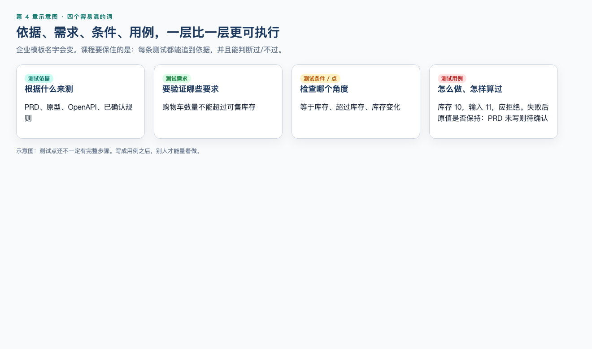
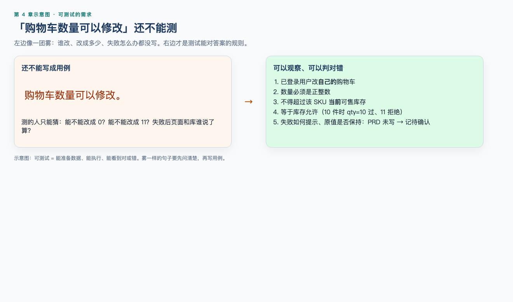
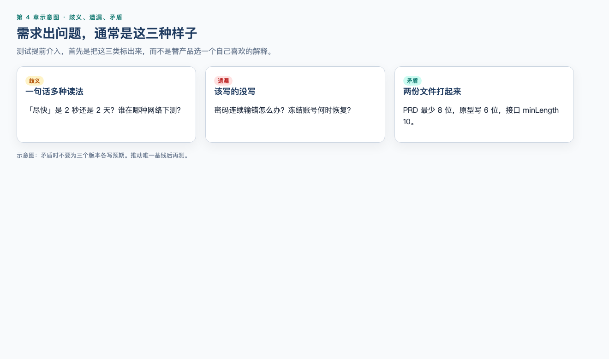
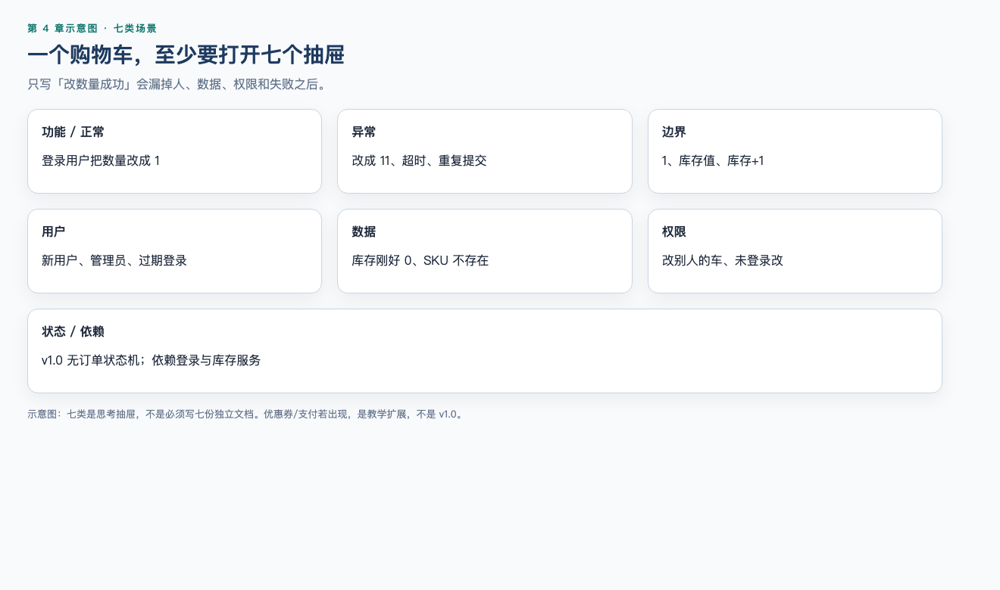

# 第 4 章（上）：测试需求分析与静态测试

> **一句话核心：** 判定标准来自需求；需求不清，后面的用例和缺陷都会漂。

> 重要级别：⭐⭐⭐ 必须掌握  
> 下一节：[04B MiniShop 需求评审](04b-minishop-requirement-review.md)

## 这一章解决什么问题

“购物车数量可以修改”无法写成可执行用例。上半章解决：什么是测试需求分析、静态/动态、评审、可测试性、歧义/遗漏/矛盾，以及七类场景。

MiniShop 三条需求的逐条评审放到 04B。第 19 章之前出现的验证码、优惠券、支付、订单状态，一律视为**教学约定**，必须在正文已标明处练习，不得当成 v1.0 契约。

## 学习目标

- 说明测试需求分析做什么；
- 区分静态测试与动态测试；
- 阅读 PRD 并判断可测试性；
- 发现歧义、遗漏、矛盾；
- 从功能拆到测试点。

## 前置知识

已完成第 1、2、3、7 章。

## 场景导入

一句“购物车数量可以修改”缺少：谁、改什么、合法范围、失败时数据和提示。

## 4.1 什么是测试需求分析 ⭐⭐⭐

“测试需求分析”不是把产品需求重新抄一遍，而是结合测试目标和风险，分析需要测试什么、依据是什么、哪些地方还不能测试。

一个实用的产出通常包括：

- 测试对象和范围；
- 已确认的业务规则；
- 关键用户与权限；
- 正常、异常、边界、状态和数据场景；
- 依赖系统和限制条件；
- 需求问题与待确认项；
- 初步测试条件或测试点；
- 可追踪的需求标识。

ISTQB 将测试分析概括为回答“测试什么”，测试设计则进一步回答“怎样测试”。本章主要解决前者；第 5 章再把测试点系统地转化为测试用例。

## 4.2 四个容易混淆的概念 ⭐⭐⭐




| 概念 | 回答的问题 | MiniShop 示例 |
| --- | --- | --- |
| 测试依据（Test Basis） | 根据什么分析和设计测试？ | PRD、用户故事、原型、OpenAPI、业务规则 |
| 测试需求 | 为达到测试目标，需要验证哪些要求或质量需要？ | 验证购物车数量不能超过可售库存 |
| 测试条件（Test Condition） | 哪个可测试方面需要被检查？ | 数量等于库存、数量超过库存、库存变化 |
| 测试用例（Test Case） | 用什么前置条件、数据、步骤和预期结果检查？ | 库存 10，输入 11，提交后应拒绝并保持原值 |

企业中“测试需求”和“测试点”可能没有统一模板。本课程把“测试点”作为便于执行的教学名称：它是从测试条件继续细化出的检查角度，但还不一定包含完整步骤和数据。

## 4.3 静态测试与动态测试 ⭐⭐⭐

静态测试（Static Testing）不执行被测对象，通过检查工作产品发现缺陷或改进机会。动态测试（Dynamic Testing）需要运行被测对象并观察行为。

| 活动 | 静态还是动态 | 原因 |
| --- | --- | --- |
| 评审登录需求 | 静态 | 未运行登录功能 |
| 使用规则检查工具扫描代码 | 静态 | 分析代码而不执行被测代码 |
| 在浏览器提交登录表单 | 动态 | 运行系统并观察结果 |
| 调用登录 API 并检查响应 | 动态 | 执行接口行为 |

静态不等于人工，动态也不等于自动。静态分析可以由工具执行；动态测试可以手工或自动执行。

## 4.4 评审与静态分析 ⭐⭐⭐

静态测试常见两类方式：

### 评审（Review）

由人对工作产品进行检查、讨论和反馈，例如评审：

- PRD 和用户故事；
- 原型和交互说明；
- 架构或数据库设计；
- API 定义；
- 源代码；
- 测试计划和测试用例。

### 静态分析（Static Analysis）

通常由工具依据规则分析工作产品，例如检查代码规范、潜在缺陷、复杂度、依赖风险或配置问题。

本章重点是需求评审。静态分析只建立概念，不提前教授具体代码扫描工具。

### 静态测试的边界

静态测试能够提前发现问题，但不能证明软件运行时一定正确。例如评审可以发现登录锁定规则没有写清，却不能证明实现后的并发计数、数据库更新和页面提示都正确。运行行为仍需要动态测试验证。

静态测试与动态测试不是替代关系：前者更早检查工作产品，后者通过执行获得运行证据。

## 4.5 为什么测试要提前介入 ⭐⭐⭐

提前介入的价值包括：

- 在代码产生前发现规则问题；
- 提高需求可测试性；
- 提前识别测试环境、数据和依赖；
- 让开发、产品和测试对预期结果形成共同理解；
- 更早评估工作量和风险；
- 为后续测试设计建立可靠依据。

但“越早越好”不等于在信息不足时强行一次定稿。需求会演进，评审结论也要随变更更新。

## 4.6 需求评审是什么 ⭐⭐⭐

需求评审是相关人员检查需求工作产品、发现问题并形成处理结论的活动。

一次基础评审可以包含：

1. 计划：明确评审对象、范围、人员、时间和目标；
2. 启动：说明背景、入口材料和评审方式；
3. 独立检查：参与者先阅读并记录问题；
4. 沟通与分析：讨论问题、影响和处理人；
5. 修正与报告：更新需求并记录结论；
6. 跟踪：确认问题已经处理或被明确接受。

小团队不一定召开正式会议，但至少要保证问题有记录、结论有负责人、修改可以追踪。

### 常见参与者

- 作者：编写需求并负责修正；
- 评审者：从业务、开发、测试、设计、运维等角度发现问题；
- 主持或组织者：控制范围、节奏和结论；
- 记录者：保存问题、决定和行动项。

角色可以兼任，也不必在所有轻量评审中全部出现。

### 常见评审类型 ⭐⭐

评审可以从轻量到正式采用不同形式：

| 类型 | 典型特点 | 适用示例 |
| --- | --- | --- |
| 非正式评审 | 流程和记录要求较少，快速反馈 | 同事检查一条简单用户故事 |
| 走查（Walkthrough） | 通常由作者带领参与者理解工作产品并讨论 | 产品经理逐步讲解购物车流程 |
| 技术评审（Technical Review） | 由具备相关技术或领域知识的人员评估方案 | 评审库存并发和接口约定 |
| 审查（Inspection） | 目标、角色、入口、记录和跟踪通常更正式 | 高风险或强合规工作产品检查 |

正式程度越高，不代表一定越好。应根据风险、复杂度、法规、团队成熟度和评审目标选择。不同组织可能使用不同名称，不能只凭会议标题判断实际评审方式。

### 五种实用评审技术 ⭐⭐⭐

1. **自由检查（Ad hoc）**：根据个人经验寻找问题，上手快，但覆盖容易受经验影响；
2. **基于清单（Checklist-based）**：按历史缺陷和质量规则逐项检查，稳定但清单需要维护；
3. **基于场景（Scenario-based）**：沿用户流程或业务场景检查前置、主流程、异常和结束；
4. **基于角色（Role-based）**：分别站在普通用户、管理员、客服、攻击者或运维人员角度检查；
5. **基于视角（Perspective-based）**：评审者尝试从后续工作视角使用需求，例如测试人员据此提取测试点、开发人员据此设计实现。

实际评审可以组合使用。例如先用清单检查格式和通用规则，再用场景与角色方法发现业务遗漏。清单不是越长越好，应根据历史问题定期删除无效项、增加高价值项。

## 4.7 如何阅读 PRD ⭐⭐⭐

PRD（Product Requirements Document，产品需求文档）没有全球统一格式。阅读时可以按下面顺序：

### 第一次：理解业务目标

- 为什么做？
- 为谁解决什么问题？
- 怎样判断有价值？
- 本次明确不做什么？

### 第二次：建立业务流程

- 用户从哪里进入？
- 按什么顺序操作？
- 有哪些分支、失败和返回路径？
- 状态怎样变化？

### 第三次：核对规则和数据

- 输入、输出和计算规则是什么？
- 必填、范围、格式、唯一性和默认值是什么？
- 数据保存、更新和删除规则是什么？

### 第四次：核对角色、权限与依赖

- 谁能查看、创建、修改和删除？
- 是否只能访问自己的数据？
- 依赖哪些接口、服务、配置或第三方系统？

### 第五次：检查验收和可测试性

- 每条结果能否客观观察？
- 测试环境和数据是否可获得？
- 异常结果是否定义？
- 需求与原型、接口或其他规则是否一致？

以上“五次阅读”是本课程帮助初学者分层处理信息的方法，不是 ISTQB 或所有公司的强制标准流程。需求较短时可以合并，复杂需求则可能需要更多轮和不同专业人员参与。

## 4.8 需求可测试性 ⭐⭐⭐

可测试性意味着要求能够用可行的方法验证，并能判断通过或失败。



需求：

> 登录速度要快，页面要友好。

问题在于“快”和“友好”缺少场景、指标和判断方法。不能由测试人员擅自补成“2 秒以内”。正确做法是提出问题，例如：

- 在什么环境、网络条件和负载下测量？
- 测量从哪个时点到哪个时点？
- 使用平均值、百分位数还是最大值？
- 目标阈值和依据是什么？
- “友好”面向哪些用户、任务和可用性目标？

可测试需求通常应当：

- 有明确对象与触发条件；
- 有可观察结果；
- 规则、单位和范围清楚；
- 不与其他要求冲突；
- 在可获得的环境和数据下能够验证；
- 可以追踪到来源和后续测试证据。

## 4.9 发现需求歧义 ⭐⭐⭐




歧义是同一句话存在多种合理解释。

示例：

> 连续输错密码后锁定账号。

至少存在这些解释：

- “连续”是否在同一会话内？成功一次是否清零？
- 输错几次？
- 按账号、设备还是 IP 统计？
- 锁定多久？
- 管理员能否解锁？

不要只写“需求不明确”。更好的评审问题是：

> R-LOGIN-05 使用“连续输错”但未定义计数主体、次数、重置条件和锁定时长，开发可能产生不同实现，也无法确定边界测试。请产品与安全负责人确认规则。

## 4.10 发现需求遗漏 ⭐⭐⭐

遗漏是业务所需内容没有被描述。

购物车需求只描述“修改成功”，但可能遗漏：

- 修改失败如何提示；
- 商品已下架如何处理；
- 库存不足如何处理；
- 若需求包含优惠，金额何时重算（**v1.0 无优惠券**，这是电商遗漏检查的思路）；
- 多端同时修改如何处理；
- 请求超时后页面与服务端数据如何一致。

发现遗漏常用方法：顺着完整用户旅程，检查前置、主流程、分支、异常、结束和恢复。

## 4.11 发现需求矛盾 ⭐⭐⭐

矛盾是两个或多个要求不能同时成立。

例如：

- PRD 写“密码最少 8 位”；
- 原型提示“密码最少 6 位”；
- 接口文档限制 `minLength: 10`。

测试人员不能自行选择最喜欢的一个，也不能为三个版本分别写预期结果。应标出来源和冲突，推动需求所有者确定唯一基线。

## 4.12 功能拆解方法 ⭐⭐⭐

面对一个功能，可以按“对象—动作—规则—结果—状态—依赖”拆解。

以购物车为例：

| 维度 | 问题 |
| --- | --- |
| 对象 | 哪个用户、哪件商品、哪个购物车条目？ |
| 动作 | 添加、修改、删除还是结算？ |
| 规则 | 库存、限购是什么？若文档还写了价格或优惠，先确认是否在范围内（**v1.0 无价格/优惠券**） |
| 结果 | 页面、接口、数据和提示如何变化？ |
| 状态 | 商品、用户处于什么状态？（v1.0 订单无状态机） |
| 依赖 | 商品、库存或登录服务是否可用？ |

这不是测试用例模板，而是防止分析只盯着页面按钮的思考框架。

## 4.13 七类测试场景 ⭐⭐⭐




### 正常场景

用户具备合理前置条件，使用有效数据完成主要业务流程。

例：已登录用户把有库存商品数量从 1 改为 2。

### 异常场景

输入、依赖或操作不满足预期条件。

例：修改数量时库存服务不可用。

### 边界场景

检查规则临界点及其附近。

例：若数量范围为 1～库存，检查 0、1、库存和库存+1。具体规则确认前只能记录候选边界，不能把假设写成正式预期。

### 用户场景

从不同用户目标、经验和使用路径分析。

例：新用户首次注册、老用户重新登录、多设备用户恢复购物车。

### 数据场景

关注数据格式、状态、组合、持久化和一致性。

例：修改购物车后刷新页面，数量是否与服务端保存结果一致。

### 权限场景

关注身份、角色、资源归属和操作授权。

例：用户 A 不能读取或修改用户 B 的购物车。

### 状态场景

关注对象当前状态和允许的状态变化。

例：在售商品可以加入购物车；下架商品如何处理必须由需求定义。

这些维度会重叠。一条“用户 A 修改用户 B 的已下架商品”可能同时涉及权限、状态和异常场景。

## 4.14 从需求到测试点 ⭐⭐⭐


假设已确认规则（**本章教学规则**，用于练习从规则抽出测试点；v1.0 无价格/小计字段，正式契约以第 19 章 PRD 为准）：

> 登录用户可以修改自己购物车中在售商品的数量；数量必须是正整数且不得超过提交时可售库存。修改成功后保存新数量；失败时保持原值并提示原因。教学示例里还可以检查“小计是否重算”，那是为了练习数据场景，不代表 MiniShop 已有金额字段。

可以得到测试点：

- 修改为合法正整数；
- 修改为 1；
- 修改为等于可售库存；
- 修改为 0、负数、小数、空值、文字；
- 修改为超过可售库存；
- 提交前库存发生变化；
- 商品已下架；
- 未登录或登录失效；
- 尝试修改他人购物车条目；
- 修改成功后小计与总价重算；
- 修改失败后原值保持；
- 刷新或重新登录后数据保持一致。

这里只列“测什么”，尚未写完整步骤和预期结果。第 5 章再使用等价类、边界值等技术设计用例。

## 4.15 高质量评审意见怎么写 ⭐⭐⭐

推荐结构：

```text
需求标识/位置：
已观察问题：
可能影响：
需要确认的问题：
建议责任人：
当前状态：待确认 / 已确认 / 已修正 / 接受风险
```

还应根据影响确定处理优先级，例如：

- 阻塞：不确认就无法统一实现或形成有效预期；
- 高：可能造成关键业务、金额、权限或数据风险；
- 中：影响重要分支，但存在可控替代方案；
- 低：表达、提示或局部一致性问题。

这些级别是本课程的评审约定，不是行业统一标准。问题关闭时应保留证据，例如更新后的需求链接、版本、确认人和结论；仅在群聊里回复“知道了”不能保证基线已经更新。

低质量意见：

> 登录这里有问题。

高质量意见：

> R-LOGIN-05 仅写“多次失败后锁定”，未定义计数次数、时间窗口、重置条件和锁定时长。该遗漏会导致前后端实现及边界预期不一致。请产品负责人联合安全负责人确认；确认前相关测试点标记为阻塞。

评审意见应对准工作产品，不针对个人。

---

书面评审包见 [04B](04b-minishop-requirement-review.md)。上半章先练：给模糊句子补可观察规则，并标出歧义、遗漏或矛盾。

## 常见错误

### 错误 1：把“尽快”“合理”“安全”直接当成可测规则

修正：没有测量范围和通过标准，就还不能写预期。先问从哪到哪、用什么指标、阈值是谁定的。

### 错误 2：发现需求缺锁定时长，测试自己规定 30 分钟

修正：可以提出方案和风险，不能把个人经验写成产品基线。

### 错误 3：静态测试等于“不运行，所以不算测试”

修正：评审和静态分析也是测试活动。它们改的是工作产品，不是正在跑的系统。

### 错误 4：04B 教学草案里的验证码、优惠券就是 MiniShop v1.0

修正：第 19 章才冻结 PRD。教学标签必须写明，不能抄进项目用例。

### 错误 5：评审意见写成“这里写得不好”

修正：写位置、类型、影响、请谁确认、当前状态。对准工作产品，不针对个人。

## 面试角度 ⭐⭐⭐

### 什么是静态测试？和动态测试差在哪？

结论：静态测试检查工作产品本身，不必运行系统；动态测试通过运行来观察。  
示例：一起读 PRD 是静态；在浏览器输错密码是动态。  
边界：静态发现不了只在运行时出现的失效，动态也替代不了需求澄清。

### 什么叫需求可测试？

结论：能写出可观察的预期，并且知道失败长什么样。  
示例：“密码 8～16 位且含字母和数字”可测；“尽快创建订单”不可测。  
边界：可测试不等于已经实现，只说明判定标准清楚。

### 测试为什么要提前介入？

结论：需求阶段的歧义越晚发现越贵。  
场景：购物车数量没写上限，用例和缺陷都会漂。  
边界：提前介入不是测试代替产品做决策。

## 小练习

### 练习 1

判断下列活动属于评审、静态分析还是动态测试：

1. 产品、开发和测试共同检查用户故事；
2. 工具扫描代码中的潜在空指针问题；
3. 在浏览器输入错误密码并检查提示。

### 练习 2

需求写“订单应尽快创建”。指出它为什么不可测试，并提出至少三个澄清问题。

### 练习 3

下面三处说明是否存在矛盾？你应该怎样处理？

- PRD：密码 8～20 位；
- 页面原型：密码 6～16 位；
- API：`minLength=10, maxLength=20`。

### 练习 4

针对“用户可以删除购物车商品”，从正常、异常、权限、数据和状态中任选四类，各写一个测试点。

### 练习 5

为什么测试人员不能看到需求缺少锁定时长后，直接规定为 30 分钟？


## 练习答案

### 答案 1

1. 评审；2. 静态分析；3. 动态测试。

### 答案 2

“尽快”没有明确测量范围和通过标准。可询问：从哪个时点到哪个时点？在哪种环境和负载下？采用哪个统计指标？目标阈值和依据是什么？

### 答案 3

存在矛盾。应记录三个来源及影响，请需求所有者联合前后端确认唯一规则，更新 PRD、原型和接口基线后再形成正式预期，不能自行选择其中一个。

### 答案 4

参考：

- 正常：删除自己购物车中的在售商品；
- 异常：删除请求超时后页面和服务端状态如何处理；
- 权限：用户 A 不能删除用户 B 的条目；
- 数据：删除后刷新页面，条目和总价保持一致；
- 状态：商品已经下架时执行删除。

任选四类并说明预期依据；规则未确认时应标记待确认。

### 答案 5

锁定时长是业务与安全规则，需要考虑风险、用户体验、运营和技术实现。测试人员可以提出方案和风险，但无权把个人经验直接变成产品基线。


## 本章检查清单

- [ ] 我能说明为什么测试要提前介入
- [ ] 我能区分静态与动态
- [ ] 我能给一句模糊需求补可观察规则

## 本章总结

判定标准来自需求。句子测不了，后面的用例和缺陷都会漂。静态测试把问题留在工作产品上，而不是等系统跑起来再猜。

## 本章可运行性说明

本章无运行代码。评审方法为教学模型。验证码/优惠券若出现，是教学约定，不是 v1.0 PRD。

## 参考资料

- 本仓库 [第 4 章索引](04-requirements-analysis-and-static-testing.md)
- [ISTQB CTFL v4.0.1](https://istqb.org/wp-content/uploads/2024/11/ISTQB_CTFL_Syllabus_v4.0.1.pdf)

## 下一章预告

[第 4 章（下）：MiniShop 需求评审](04b-minishop-requirement-review.md)
