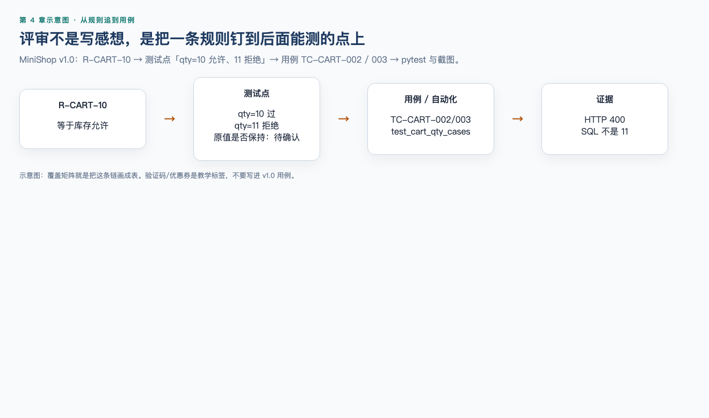

# 第 4 章（下）：MiniShop 需求评审

> **一句话核心：** 评审要写出可跟踪的问题，而不是把教学草案抄成项目契约。

> 上一节：[04A 需求分析与静态测试](04a-requirements-static-testing.md)

## 这一章解决什么问题

把上半章的方法落到 MiniShop 注册、登录、购物车，并写出一页评审记录。记住：验证码/优惠券若出现，是教学标签，不是 `project/minishop/docs/PRD.md`。

## 学习目标

- 评审 MiniShop 注册、登录、购物车教学需求；
- 写出可跟踪的评审意见；
- 说明需求变更后测试点如何跟着改。

## 前置知识

已完成 04A。

## 场景导入

打开本节注册草案：有验证码、密码 8～20 位、注册成功进首页。再打开 `project/minishop/docs/PRD.md`：没有验证码，密码 8～16 位，注册成功不自动登录。若把草案抄进项目用例，第 5 章和第 19 章都会按错尺子测。

## 4.16 MiniShop 注册需求分析 ⭐⭐⭐

### 待评审草案

> 用户输入手机号、验证码和密码即可注册。手机号不能重复，密码为 8～20 位。注册成功后进入首页。

### 需要澄清

- 手机号支持哪些国家或地区？本项目是否暂定中国大陆 11 位手机号？
- 验证码长度、有效期、发送频率和错误次数是什么？
- 密码按字符、字节还是其他规则计数？允许哪些字符？
- 手机号已存在时是否提示可直接登录？
- 重复点击注册如何避免重复账户？
- 注册成功是否自动登录？登录状态如何建立？
- 验证码服务不可用时如何提示？
- 隐私政策是否必须勾选，版本如何记录？

注意：这些是评审问题，不是已经确认的 MiniShop 正式规则。草案里的短信验证码、8～20 位密码也不是 v1.0：v1.0 注册是手机号 + 8～16 位且须同时包含字母和数字的密码，**无短信**。第 19 章项目用例必须跟 PRD，不要把本草案抄进简历。

## 4.17 MiniShop 登录需求分析 ⭐⭐⭐

### 待评审草案

> 用户使用手机号和密码登录。密码错误多次后锁定账号。

### 需要澄清

- 账号不存在与密码错误是否使用相同提示？
- “多次”具体是多少次，在哪个时间窗口统计？
- 成功登录后失败计数是否清零？
- 锁定时长、解锁方式和通知方式是什么？
- 已禁用、未激活或已锁定账号分别如何处理？
- 同一账号是否允许多设备同时登录？
- 登录请求超时后，客户端如何判断是否成功？
- 登录成功跳转原目标页还是固定首页？

安全相关规则应由产品、安全和技术人员共同确认，测试人员不能凭经验擅自决定阈值。

## 4.18 MiniShop 购物车需求分析 ⭐⭐⭐

### 待评审草案

> 用户可把商品加入购物车、修改数量和删除商品，系统实时显示总价。

这是待评审草案。MiniShop v1.0 有购物车数量规则，**没有**价格、优惠、运费和总价字段；下面的澄清问题用来练习找遗漏，不要当成已冻结契约。

### 需要澄清

- 未登录用户是否支持本地购物车？登录后是否合并？
- 同一规格商品重复加入时新增条目还是累加数量？
- 数量上限取库存、限购、系统上限中的哪一个或最小值？
- “实时”是客户端即时计算还是服务端确认后更新？
- 价格变化、优惠失效或商品下架时如何显示？
- 删除是否需要确认，能否撤销？
- 多设备同时修改时采用什么冲突策略？
- 总价是否含优惠、运费和税费？金额舍入规则是什么？

## 4.19 MiniShop 需求评审实战 ⭐⭐⭐




### 练习材料：购物车数量修改需求 v0.1

```text
R-CART-01 用户可以修改购物车商品数量。
R-CART-02 商品数量最多为 99。
R-CART-03 商品数量不能超过库存。
R-CART-04 修改后立即更新总价。
R-CART-05 修改失败时提示用户。
原型提示：一次最多购买 20 件。
接口说明：quantity 为 integer，minimum 为 0。
```

### 第一步：标出问题

- R-CART-02、原型的 20 件与库存限制之间优先级不明；
- “minimum 为 0”与购物车条目通常至少 1 件的业务可能冲突；
- “立即”不可测量；
- “提示用户”没有提示内容和失败分类；
- 没有定义库存变化、下架、登录失效和数据保存；
- 没有定义总价组成与舍入规则。

### 第二步：形成评审记录

| ID | 类型 | 级别 | 问题 | 影响 | 状态 |
| --- | --- | --- | --- | --- | --- |
| REV-001 | 矛盾 | 阻塞 | 上限 99、原型 20 与库存限制未说明优先级 | 前后端校验可能不一致 | 待确认 |
| REV-002 | 矛盾/遗漏 | 阻塞 | 接口允许 0，但未定义 0 是删除还是非法 | 数据和交互结果不确定 | 待确认 |
| REV-003 | 不可测试 | 中 | “立即更新”无观察点和时限 | 无法形成客观预期 | 待确认 |
| REV-004 | 遗漏 | 高 | 未定义各种失败原因与提示 | 无法覆盖异常流程 | 待确认 |

### 第三步：建立候选测试点

在规则未确认前，可以先记录候选测试点，但必须标记“等待基线”：

- 有效数量；
- 最小值附近；
- 库存边界；
- 限购边界；
- 数量为 0；
- 非整数和空值；
- 库存变化；
- 商品下架；
- 失败后原值和总价；
- 多端数据一致性。

## 4.20 需求变更与追踪 ⭐⭐

评审结束不代表需求永远不变。发生变更时至少要：

- 记录变更内容、原因、时间和确认人；
- 标识受影响页面、接口、数据、测试点和文档；
- 更新需求基线与版本；
- 重新评估优先级和回归范围；
- 避免只在聊天中口头修改而不更新正式依据。

简单追踪表：

| 需求 ID | 需求摘要 | 测试点 ID | 状态 | 备注 |
| --- | --- | --- | --- | --- |
| R-CART-01 | 修改购物车数量 | TP-CART-001～006 | 待确认 | 等待数量规则基线 |

追踪不是为了增加表格，而是为了回答：某条需求是否被分析和测试？某次变更影响了哪些证据？


配套书面实操：[实操 4-1](../practice/04-requirement-review/README.md)。模板在同目录 `template.md`，产出放到 `exercises/`。

## MiniShop 工作实战：需求评审包

选择注册、登录或购物车之一，提交以下四份内容：

1. 功能流程和业务对象；
2. 需求问题清单；
3. 七类场景测试点；
4. 需求—测试点追踪表。

建议保存为：

```text
exercises/chapter-04-minishop-requirement-review.md
```

交付模板：

```markdown
# MiniShop 需求评审记录

## 基本信息
- 需求名称：
- 需求版本：
- 评审范围：
- 参与角色：
- 日期：

## 已确认规则
| 需求 ID | 规则 | 来源 |
| --- | --- | --- |

## 问题清单
| ID | 位置 | 类型 | 级别 | 问题 | 影响 | 责任人 | 状态 | 关闭证据 |
| --- | --- | --- | --- | --- | --- | --- | --- | --- |

## 测试点
| ID | 场景类型 | 前置/触发 | 检查点 | 依据 | 状态 |
| --- | --- | --- | --- | --- | --- |

## 追踪关系
| 需求 ID | 测试点 ID | 备注 |
| --- | --- | --- |
```

完成标准：至少发现 8 个有依据的问题，覆盖歧义、遗漏、矛盾或不可测试性中的至少三类；至少提取 15 个测试点并覆盖七类场景中的五类；每个问题都说明影响和状态。

其中至少标识一个可能阻塞后续设计的问题。若确实没有阻塞项，应说明判断依据，不能为了凑数虚构问题。


对照仓库正式评审：`project/minishop/docs/requirement-review.md` 与覆盖矩阵 `docs/prd-coverage-matrix.md`。

评审时仍用第 4 章（上）的三张示意图当尺子：句子能不能测（`ch04-testable.png`）、问题属于歧义/遗漏/矛盾（`ch04-three-problems.png`）、场景抽屉有没有漏（`ch04-seven-scenes.png`）。v1.0 正式规则以 PRD 为准，不要把教学验证码/优惠券写进本项目用例。

## 常见错误

### 错误 1：把 04B 教学草案写进 MiniShop 项目用例

修正：验证码、8～20 位密码、注册后自动进首页都是教学材料。项目契约以 PRD 为准。

### 错误 2：评审意见只有“写得不好”

修正：写需求 ID、位置、类型、影响、请谁确认、状态。别人要能接着处理。

### 错误 3：为了凑“至少 8 个问题”去虚构阻塞项

修正：没有阻塞项就写判断依据。凑数比漏检更糟，因为后面的人会按假问题改需求。

### 错误 4：测试点不追踪回需求

修正：变更时要知道哪些检查点作废。追踪表是为了回答“这条规则测了没有”，不是为了多一张表。

## 面试角度 ⭐⭐⭐

### 评审时发现需求问题，意见怎么写？

结论：可跟踪，不要情绪句。  
应包含：位置、类型（歧义/遗漏/矛盾/不可测）、影响、建议确认人、状态。  
示例：见 04A 的锁定时长写法，以及练习 8 的改写。  
边界：测试提出风险，不代替产品拍板。

### 教学规则和 v1.0 PRD 怎么分？

结论：第 19 章前出现的验证码、优惠券、支付、订单状态，一律当教学约定，正文必须标明。  
场景：04B 草案用来练评审技术；项目用例、缺陷、简历只引用 `docs/PRD.md`。  
边界：练习技术时可以用扩展例子，但不能把例子写成已冻结契约。

## 小练习

### 练习 6

测试条件、测试点和测试用例之间是什么关系？

### 练习 7

阅读 4.19 的需求 v0.1，再补充四条未列出的评审问题。

### 练习 8

将下面意见改写成高质量评审记录：

> 购物车数量这里写得不好。

### 练习 9（实操）

使用本章模板完成一份 MiniShop 注册、登录或购物车需求评审包，并检查是否达到量化完成标准。

### 练习 10

需求很短、风险较低，希望当天获得快速反馈；另一个需求涉及支付金额与合规审计。两者是否必须采用完全相同的评审形式？你会怎样选择评审类型和技术？


## 练习答案

### 答案 6

测试条件标识需要检查的可测试方面；测试点将其细化为具体检查角度；测试用例进一步给出可执行的前置、数据、步骤和预期。团队可能合并这些产物，但必须保证“测什么”和“怎样判断”清楚。

### 答案 7

合理答案包括：数量字段能否直接输入？连续点击加减如何处理？修改是否需要服务端确认？价格变化时以哪个价格为准？访客购物车如何处理？页面刷新和多端同步规则是什么？答案不唯一，但要指出位置和影响。

### 答案 8

参考：

> R-CART-01 仅说明数量可修改，没有定义最小值、上限来源、数据类型和失败行为。前后端可能采用不同校验，测试也无法确定边界预期。请产品负责人确认数量规则，并同步原型与接口定义；当前状态为待确认。

### 答案 9

开放实操题。合格证据应包含基本信息、已确认规则、至少 8 个问题、至少 15 个测试点和追踪关系，并满足本章规定的覆盖要求。

### 答案 10

不必相同。低风险短需求可以采用非正式评审或轻量走查，并结合简短清单和场景检查；支付与合规需求适合更正式的技术评审或审查，明确角色、入口、记录和跟踪，并结合清单、场景、角色或视角技术。选择依据是风险、复杂度、法规和目标，而不是认为越正式永远越好。


## 本章检查清单

- [ ] 我能指出教学规则和 v1.0 PRD 的差别
- [ ] 我能写三条带依据的评审意见
- [ ] 我能从规则列出测试点

## 本章总结

评审要留下可跟踪的问题，而不是把教学草案抄成项目契约。分清尺子之后，测试点才能跟着需求走。

## 本章可运行性说明

对照 `project/minishop/docs/PRD.md` 与 `requirement-review.md`。教学规则不得写成已冻结契约。

## 参考资料

- [04A](04a-requirements-static-testing.md)
- `project/minishop/docs/prd-coverage-matrix.md`

## 下一章预告

第 5 章《测试用例设计》。
