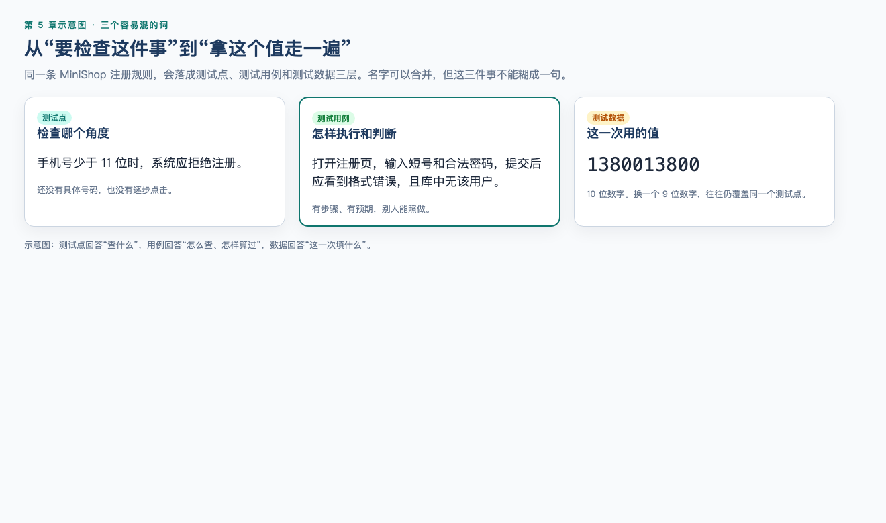
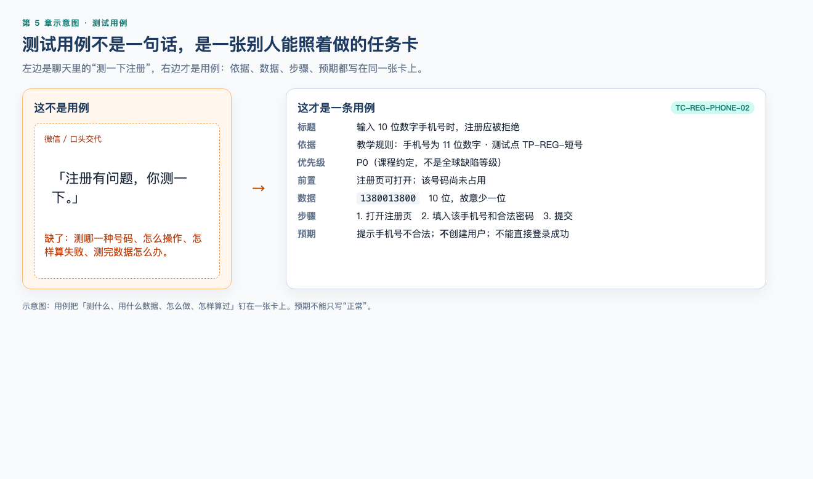
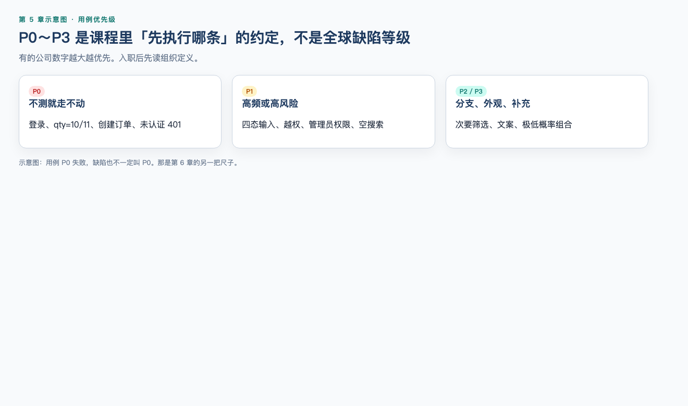
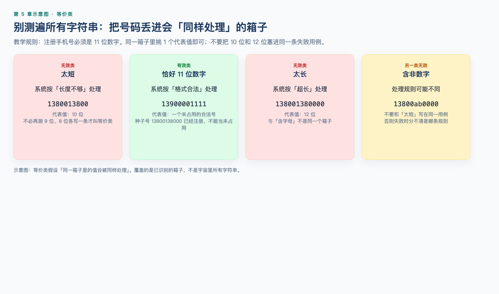
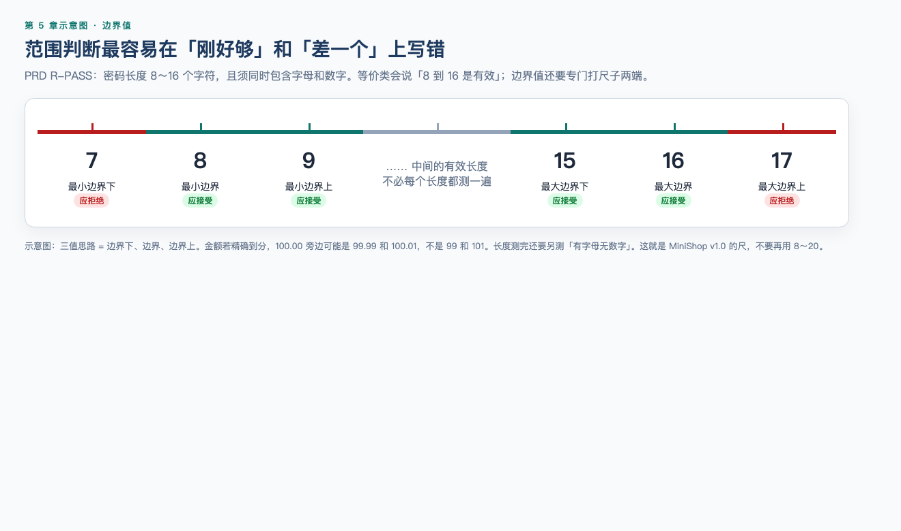
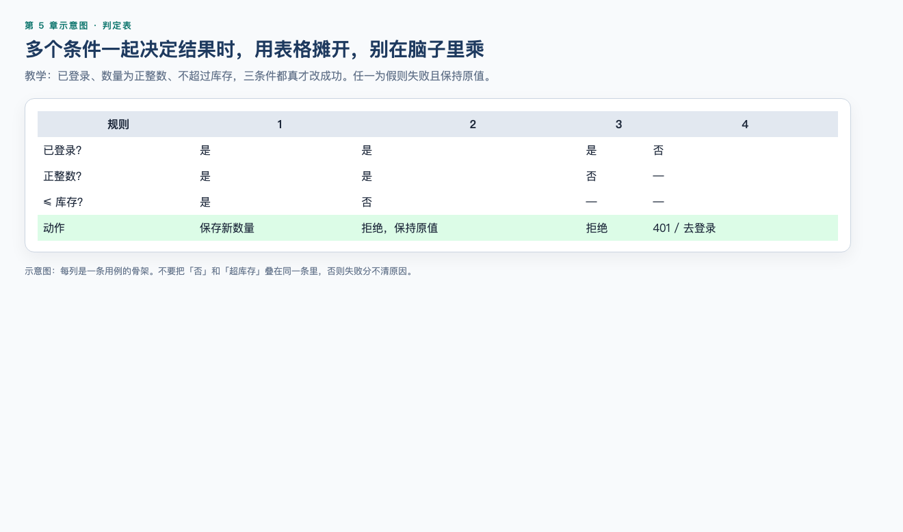
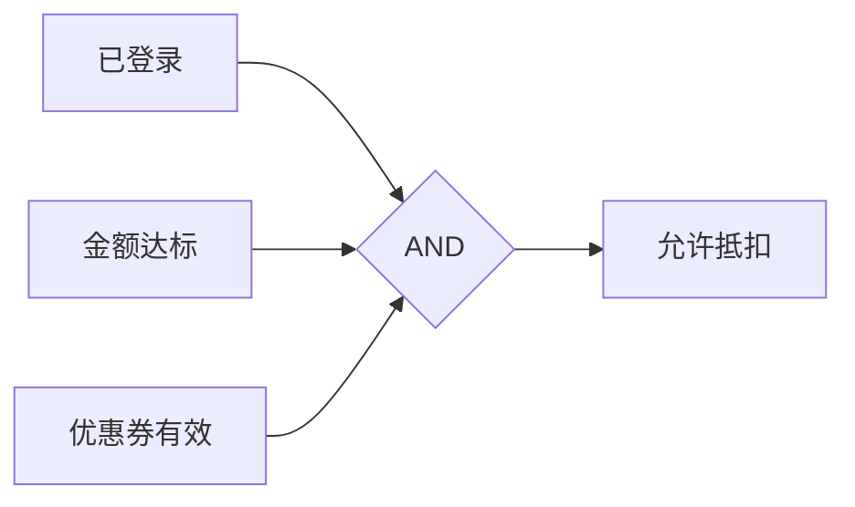
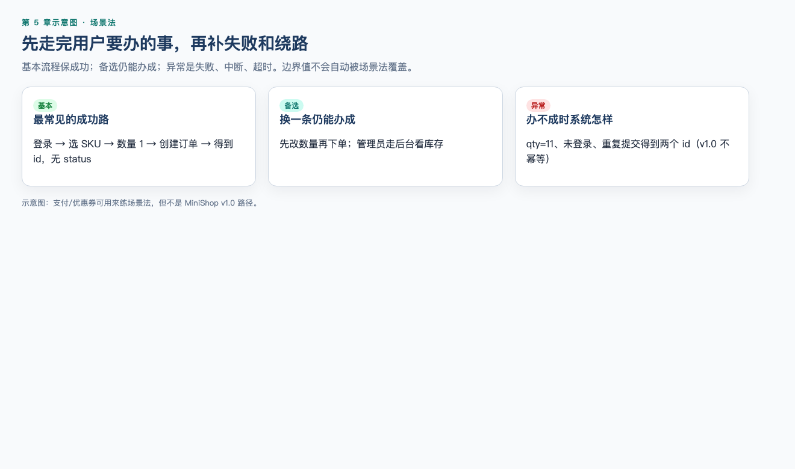
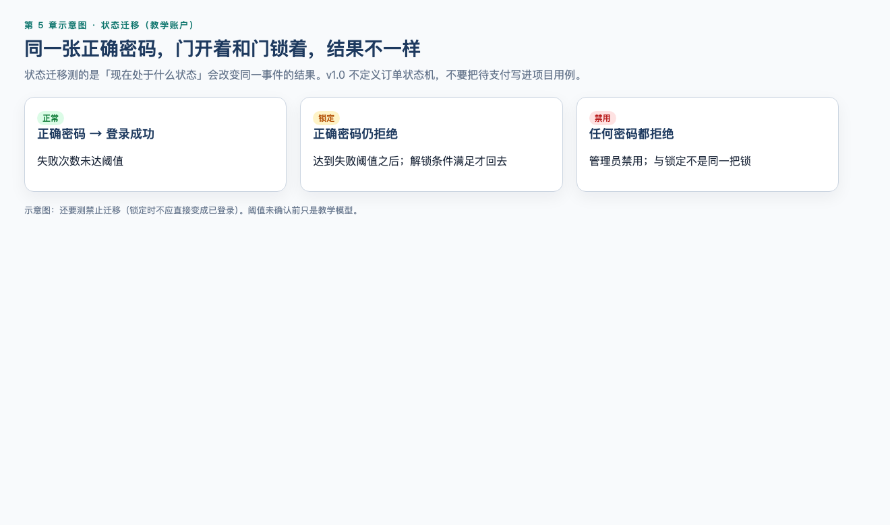
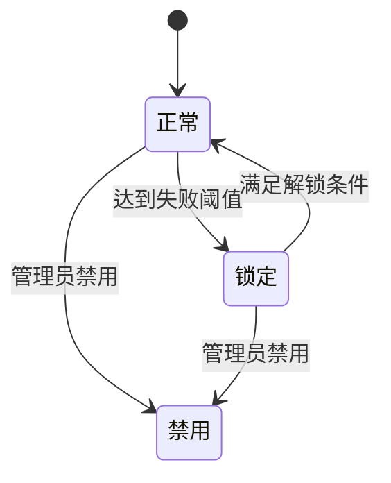

# 第 5 章：测试用例设计

> **一句话核心：** 用例是把判定写成可重复执行的步骤；优先级是资源分配，不是真理。

> **阅读提示：** 技术名词会很多。第一次读先抓住两件事：每条用例必须写得出预期结果（判定）；边界必须成对测。配套实操：[实操 5-1](../practice/05-qty-boundary/README.md)——`qty=10` 和 `qty=11` 都要看到。你不需要会写 Python。

> 重要级别：⭐⭐⭐ 必须掌握  
> 核心章节发布目标：≥95/100  
> 主案例：MiniShop 个人软件测试实践项目

## 这一章解决什么问题

第 4 章解决了“测什么”：从需求中发现问题并提取测试点。本章继续解决“怎样测”：怎样选择有代表性的数据、组合业务条件、覆盖状态变化，并把它们写成别人也能执行和判断的测试用例。

测试用例不是越多越好。真正目标是在有限时间内，用可追踪、可理解、可执行的一组测试，覆盖重要风险。

用第 1 章的公式说：测试点是你要观察的角度，用例是把**判定**写成可重复步骤，执行记录才是**证据**。没有预期结果的步骤，只是操作说明，还不是用例。

## 学习目标

完成本章后，你应该能够：

- 区分测试条件、测试点、测试用例和测试数据；
- 编写包含前置条件、步骤、数据和预期结果的基础用例；
- 使用课程约定的 P0/P1/P2/P3 优先级，并知道它不是统一行业标准；
- 应用等价类划分和边界值分析；
- 使用判定表覆盖业务规则组合；
- 理解因果图如何辅助构建判定表；
- 使用场景法覆盖主流程、备选流程和异常流程；
- 使用状态迁移测试覆盖合法与非法迁移；
- 使用错误推测补充系统化技术；
- 完成 MiniShop v1.0 注册与购物车边界用例设计（验证码、优惠券只作为「通用练习系统」，不写进项目用例）；
- 参与基础测试用例评审。

## 前置知识

- 已完成第 4 章，能够分析需求并提取测试点；
- 能区分功能、异常、边界、数据、权限和状态场景；
- 本章不要求编程能力。

## 场景导入：手机号应该测多少条？

假设已经确认一条规则（与 PRD `R-PHONE` 同方向，本章先用来练划分）：

> 注册手机号由 11 位数字组成，且以 1 开头。

逐个测试所有字符串不可能。只测试一个合法号码又容易漏掉长度和字符类型问题。

可以先划分：

- 11 位数字：有效类；
- 少于 11 位：无效类；
- 多于 11 位：无效类；
- 包含非数字字符：无效类；
- 未输入：无效类。

再从长度边界选择 10、11、12 位代表值。这样用少量数据覆盖了不同处理规则。

这就是测试设计技术的价值：不是凭感觉堆用例，而是说明为什么选这些数据，以及它们覆盖了什么。

库存规则更适合当场跑一遍。PRD `R-CART-10` 把切点钉在 10：等于 10 允许，超过 10 拒绝。只测 `qty=2` 说明不了切点；只测 `qty=11` 也不知道 `10` 有没有被误伤。

```bash
python3 practice/run.py 5-1
```

## 5.1 测试点、测试用例与测试数据 ⭐⭐⭐

| 概念 | 作用 | 示例 |
| --- | --- | --- |
| 测试条件 | 标识需要检查的可测试方面 | 注册手机号格式 |
| 测试点 | 进一步说明检查角度 | 手机号少于 11 位应被拒绝 |
| 测试用例 | 定义怎样执行和判断 | 输入 `1380013800` 提交，显示格式错误且不创建用户 |
| 测试数据 | 执行使用的具体值 | `1380013800` |

不同团队可能合并这些产物。本课程强调的不是表格名称，而是每条测试都能追踪到依据，并有明确通过/失败标准。



## 5.2 测试用例由什么组成 ⭐⭐⭐

基础用例可以包含：

| 字段 | 作用 |
| --- | --- |
| 用例 ID | 唯一识别和追踪 |
| 标题 | 一句话说明条件、动作和预期 |
| 需求/测试点 ID | 说明覆盖依据 |
| 优先级 | 帮助安排执行顺序 |
| 前置条件 | 执行前必须成立的状态 |
| 测试数据 | 明确输入和已有数据 |
| 操作步骤 | 可复现的动作 |
| 预期结果 | 每个关键动作后可观察的正确结果 |
| 后置/清理 | 执行后应保留或恢复的数据状态 |
| 环境/备注 | 必要的浏览器、版本或限制 |

示例（可在仓库 MiniShop 上执行；**不要**用种子号 `13800138000`，它已经注册）：

| 字段 | 内容 |
| --- | --- |
| ID | TC-REG-001 |
| 标题 | 使用未占用的合法手机号完成注册 |
| 依据 | PRD `R-REG`、`R-PHONE`、`R-PASS` |
| 优先级 | P0（课程约定） |
| 前置条件 | 服务已启动；手机号 `13900001111` 不在种子用户中；**无**验证码 |
| 数据 | 手机号 `13900001111`；密码 `Test1234`（8～16 位且同时含字母和数字） |
| 步骤与预期 | 1. 打开 `http://127.0.0.1:8765/` 注册表单 → 页面可用；2. 输入合法手机号和密码 → 字段正确接收；3. 单击注册 → 只提交一次；4. 观察结果 → 创建成功（接口为 201，JSON 有 `phone`、**没有** `token`），**不**自动进入已登录商品区 |
| 后置/清理 | 在授权测试环境删除或重置本用例创建的测试账户；默认 `MINISHOP_RESET=1` 重启也会清掉 |

预期结果不能只写“正常”“成功”或“与需求一致”。应说明页面、接口、数据或状态具体发生什么变化。



## 5.3 好用例的基本标准 ⭐⭐⭐

一条高质量用例通常具备：

- 正确：与当前需求基线一致；
- 清晰：其他人无需猜测；
- 可执行：环境、前置和数据可准备；
- 可判断：预期结果客观明确；
- 可追踪：能关联需求或风险；
- 独立性适当：失败时容易定位，不无必要依赖其他用例；
- 可维护：需求变化时容易找到并更新。

不要在步骤里写分支：

> 如果登录成功就下单，否则重新输入或换账号。

这会产生多个路径和多个预期。应拆成确定性的独立用例。

用例独立不代表完全没有共享环境，而是应控制依赖和数据污染。多个用例重复使用同一手机号时，前一个用例创建的账户可能让后一个用例意外失败。因此要使用唯一测试数据、可靠的初始化方式，或在授权测试环境中执行明确的清理操作。清理动作同样要可审计，不能误操作生产数据。

## 5.4 用例优先级 ⭐⭐⭐




本课程为了 MiniShop 项目采用以下约定：

| 优先级 | 课程定义 | 示例 |
| --- | --- | --- |
| P0 | 核心业务主路径或失败会阻塞基本测试 | 注册、登录、提交订单主流程 |
| P1 | 高频或高风险的重要功能、关键异常和权限 | 重复注册、库存不足、越权访问 |
| P2 | 一般业务分支、较低频边界和兼容组合 | 次要筛选条件、普通提示异常 |
| P3 | 低风险、低频、外观或补充场景 | 非关键文案、极低概率组合 |

这是课程项目约定，不是全球统一标准。有的公司数字越大优先级越高，有的使用 High/Medium/Low，也可能把 P0 用于缺陷或事故等级。进入真实团队后必须先阅读组织定义。

优先级不等于执行结果，也不等于缺陷严重程度。确定优先级可考虑业务影响、使用频率、失败概率、变更范围、历史缺陷、合规要求和可恢复性。

## 5.5 等价类划分 ⭐⭐⭐

等价类划分（Equivalence Partitioning，EP）把输入或输出域分成若干分区，假设同一分区中的值会被系统以相似方式处理，再从每个分区选择代表值。



### 示例：年龄 18～60 岁

| 分区 | 类型 | 代表值 |
| --- | --- | --- |
| 小于 18 | 无效 | 17 |
| 18～60 | 有效 | 30 |
| 大于 60 | 无效 | 61 |
| 非整数/错误类型 | 无效 | `abc` |
| 空值 | 取决于是否必填 | 空字符串 |

### 应用步骤

1. 找到测试对象和规则；
2. 识别系统会采用不同处理方式的分区；
3. 标记有效与无效分区；
4. 从每个分区选择代表值；
5. 检查每个分区至少被一个测试覆盖；
6. 对高风险分区增加更多数据，而不是机械每类只测一次。

### 等价类覆盖

基础分区覆盖率可以表示为：

```text
已被测试覆盖的等价分区数 ÷ 已识别的等价分区总数 × 100%
```

如果识别出 6 个分区并全部至少测试一次，则分区覆盖率为 100%。这只说明已识别分区被覆盖，不证明分区划分一定完整，也不证明系统没有缺陷。

### 常见错误

- 只划分有效类，遗漏无效类；
- 把 18、30、60 当成三个等价类；
- 多个无效条件放在同一用例，失败后不知道由哪个条件触发；
- 没有说明空值、空字符串和 `null` 是否属于同一种输入；
- 需求不清楚时自行创造分区。

## 5.6 等价类实战：MiniShop 注册手机号 ⭐⭐⭐

PRD `R-PHONE`：必填、11 位数字且以 1 开头。下表先练长度和字符类型；「不以 1 开头」应另开无效类，不要和「含字母」叠在同一条里。

| 编号 | 等价类 | 有效性 | 数据 |
| --- | --- | --- | --- |
| EP-01 | 恰好 11 位数字且以 1 开头 | 有效 | `13900001111`（格式合法；不要用已占用的 `13800138000` 当「未注册」） |
| EP-02 | 少于 11 位数字 | 无效 | `1380013800` |
| EP-03 | 多于 11 位数字 | 无效 | `138001380000` |
| EP-04 | 包含字母 | 无效 | `13800abc000` |
| EP-05 | 包含符号或空格 | 无效 | `138 0138000` |
| EP-06 | 未输入 | 无效 | 空字符串 |
| EP-07 | 11 位但不以 1 开头 | 无效 | `23800138000` |

真实运营商号段比这更细。项目用例跟 PRD，不要自行发明「支持哪些国家」。

## 5.7 边界值分析 ⭐⭐⭐

边界值分析（Boundary Value Analysis，BVA）用于有序分区，重点检查边界及其相邻值，因为范围判断容易出现 `<`、`<=`、偏移或漏判错误。



年龄有效范围为 18～60，最小步长为 1：

- 两值边界法：17、18、60、61；
- 三值边界法：17、18、19、59、60、61。

课程默认先掌握三值思路：边界下、边界值、边界上。但测试值必须考虑数据精度。金额保留两位小数时，100.00 的相邻值可能是 99.99 和 100.01，而不是 99 和 101。

边界值是等价类的扩展，不适用于没有顺序关系的任意分类。例如红、黄、蓝三种颜色没有天然数值边界。

边界覆盖同样应说明采用两值还是三值方法。不能把“两值方法覆盖 100%”和“三值方法覆盖 100%”当成同一个覆盖标准；后者要求更多边界相邻值。

## 5.8 边界值实战 ⭐⭐⭐

PRD `R-PASS`：密码 8～16 位，须同时包含字母和数字，按 Unicode 字符数量计数。长度边界如下；「有字母无数字」「有数字无字母」是另一组等价类，不要和长度叠在同一条用例里。

| 数据长度 | 目的 | 预期（在含字母和数字的前提下） |
| ---: | --- | --- |
| 7 | 最小边界下 | 拒绝 |
| 8 | 最小边界 | 接受 |
| 9 | 最小边界上 | 接受 |
| 15 | 最大边界下 | 接受 |
| 16 | 最大边界 | 接受 |
| 17 | 最大边界上 | 拒绝 |

示例值：`A234567`（7，拒）、`A2345678`（8，收）、`A23456789012345`（15，收）、`A234567890123456`（16，收）、`A2345678901234567`（17，拒）。

“字符数量”必须由需求明确。如果前端按字符计数、后端按字节限制，中文、Emoji 等输入可能产生不一致。v1.0 没有另写字节规则，测项目时不要发明。

## 5.9 判定表 ⭐⭐⭐

判定表测试（Decision Table Testing）适合多个条件组合决定结果的业务规则。




通用练习系统（**不是** MiniShop v1.0）优惠券规则，只练判定表：

- 用户已登录；
- 订单金额至少 100 元；
- 优惠券有效；
- 三项都满足才抵扣 20 元。

| 规则 | R1 | R2 | R3 | R4 |
| --- | --- | --- | --- | --- |
| 已登录 | Y | Y | Y | N |
| 金额≥100 | Y | Y | N | - |
| 券有效 | Y | N | - | - |
| 抵扣20元 | X |  |  |  |
| 拒绝并说明原因 |  | X | X | X |

`-` 表示该条件在本规则下不影响结果。这个例子经过规则合并，没有机械列出所有八种组合；四条有效规则都应至少由一条测试覆盖。

### 应用步骤

1. 列出相互影响的条件；
2. 列出可能动作或结果；
3. 构造有意义的条件组合；
4. 检查冲突、遗漏和不可能组合；
5. 在规则允许时合并无关条件；
6. 每条有效规则至少设计一条测试。

判定表不是条件越多越好。条件过多时组合会爆炸，应按业务规则拆表或优先覆盖高风险组合。

## 5.10 判定表实战：购物车结算 ⭐⭐⭐

通用练习系统（**不是** MiniShop v1.0）：只有已登录、购物车非空、全部商品可售且库存充足时，才允许进入订单确认页。v1.0 没有确认页、没有结算金额；创建订单是 `POST /api/orders`，成功只返回 `id`。

| 规则 | R1 | R2 | R3 | R4 | R5 |
| --- | --- | --- | --- | --- | --- |
| 已登录 | Y | N | Y | Y | Y |
| 购物车非空 | Y | - | N | Y | Y |
| 商品可售 | Y | - | - | N | Y |
| 库存充足 | Y | - | - | - | N |
| 进入确认页 | X |  |  |  |  |
| 引导登录 |  | X |  |  |  |
| 提示购物车为空 |  |  | X |  |  |
| 提示商品不可售 |  |  |  | X |  |
| 提示库存不足 |  |  |  |  | X |

该表假设错误处理有明确优先级。如果多个失败条件同时出现时提示哪个原因尚未定义，应回到需求评审，而不是由测试人员擅自排序。

## 5.11 因果图 ⭐⭐

因果图（Cause-Effect Graphing）用逻辑关系表示输入条件（原因）与输出动作（结果），适合条件较多、直接画判定表容易遗漏约束的场景。

因果图是本课程大纲要求的辅助建模方法。ISTQB CTFL v4.0.1 的基础黑盒技术重点包括等价类、边界值、判定表和状态迁移；学习者不应误以为所有项目都必须先画因果图。

常见逻辑：

- AND：多个原因同时成立才产生结果；
- OR：任一原因成立即可产生结果；
- NOT：原因不成立时产生结果；
- 约束：某些原因互斥、至少一个或不能同时成立。

优惠券例子可表示为：



因果图通常用于梳理逻辑，再转换成判定表和测试用例。简单规则直接使用判定表更高效，不必为了“专业”强行画图。

## 5.12 场景法 ⭐⭐⭐




场景法围绕用户目标和业务流程设计测试，常从用例或用户旅程提取：

- 基本流程：最常见的成功路径；
- 备选流程：仍能完成目标的其他路径；
- 异常流程：失败、中断、超时和恢复；
- 前置与后置状态：开始前和结束后系统状态。

教学用下单流程（练场景法，**不是** MiniShop v1.0 已实现路径）：登录 → 选择商品 → 加入购物车 → 确认订单 → 提交。v1.0 到创建订单为止，没有支付、优惠券和地址切换。

备选或异常可用库存不足、重复提交、网络中断；支付取消、优惠券只作为场景法技术示例，不要写进第 19 章项目用例。

场景法适合覆盖端到端业务，但不自动覆盖所有输入边界。通常要与等价类、边界值和判定表组合。

## 5.13 场景法实战 ⭐⭐⭐

| 场景 ID | 流程 | 关键检查 |
| --- | --- | --- |
| SC-ORDER-01 | 正常创建订单 | 返回订单 `id`，Body 不含 `status` |
| SC-ORDER-02 | 使用有效优惠券（技术示例） | 优惠规则和实付金额正确；**v1.0 无此功能** |
| SC-ORDER-03 | 提交前库存不足 | 阻止下单并明确提示 |
| SC-ORDER-04 | 重复点击提交 | 记录两次响应：v1.0 创建订单默认不幂等，两次成功得到两个 `id` 符合当前契约；若正式需求改为只允许一笔，再按防重失败报缺陷 |
| SC-ORDER-05 | 支付取消（技术示例） | 不冻结、不发明订单状态名；**v1.0 无支付、无状态机** |
| SC-ORDER-06 | 网络中断后重试 | 可查询是否已创建，不以状态名字段为准 |

MiniShop v1.0 **不定义**待支付/已发货等状态名；创建成功只保证返回 `id`。本章场景表里的支付/优惠券行只练技术，不得当成项目基线。

幂等是**接口级约定**，不是全站开关：v1.0 创建订单两次成功得到两个 `id`；注册是否允许重复账户要另看注册接口的需求，不能从下单规则推导出「全站都不幂等」或「全站都要防重」。

## 5.14 状态迁移测试 ⭐⭐⭐




状态迁移测试（State Transition Testing）适用于系统对相同事件的响应取决于当前状态或历史事件的情况。

通用练习系统（**不是** MiniShop v1.0）的登录账户状态：正常、锁定、禁用。PRD 无锁定、无禁用。



### 状态表

| 当前状态 | 事件 | 预期状态/动作 |
| --- | --- | --- |
| 正常 | 正确密码 | 保持正常并登录 |
| 正常 | 达到失败阈值 | 转为锁定并拒绝登录 |
| 锁定 | 正确密码 | 仍拒绝，除非需求另有规定 |
| 锁定 | 满足解锁条件 | 转为正常 |
| 禁用 | 正确密码 | 拒绝登录 |

不仅要测试图中允许的迁移，也要检查未允许事件不会产生非法状态变化。状态和阈值在需求未确认前只是教学模型。

## 5.15 状态迁移实战 ⭐⭐⭐

设计时至少覆盖：

- 每个状态能够到达；
- 每条合法迁移至少一次；
- 关键状态下的重要事件；
- 禁止迁移；
- 重复事件；
- 达到状态所需的事件序列；
- 状态持久化与多端一致性。

例如锁定阈值为 5 次时，只测“第 5 次失败”不够，还应检查前 4 次仍是正常状态、第 5 次发生迁移、锁定后的正确密码处理，以及解锁后计数是否重置。

## 5.16 错误推测 ⭐⭐

错误推测（Error Guessing）是基于经验、历史缺陷、技术知识和常见错误预测系统可能失败的位置。

MiniShop 常见猜测：

- 重复点击导致重复提交；
- 前后空格处理不一致；
- 刷新后数据丢失；
- 多标签页状态不同步；
- 金额出现浮点或舍入错误；
- Token 过期后页面仍显示已登录；
- 接口成功但页面没有更新。

错误推测不是随便猜。应记录来源，例如历史 Bug、相似模块、技术实现风险或生产事故。它用于补充系统化技术，不能替代需求覆盖。

## 5.17 MiniShop 注册综合设计 ⭐⭐⭐

### v1.0 需求基线（项目用例只跟这张表）

打开 `project/minishop/docs/PRD.md`。注册相关已确认规则：

1. `R-PHONE`：手机号 11 位数字且以 1 开头；
2. `R-PASS`：密码 8～16 位，须同时包含字母和数字；
3. `R-REG`：未占用的合法手机号 + 合法密码 → 201 与 `phone`，**不**返回 `token`，不自动登录；非法手机号或密码 400；已占用 409。

没有验证码、没有隐私政策勾选、没有锁定/禁用。第 19 章项目用例必须跟这张表。

### 技术组合（v1.0）

| 风险 | 主要技术 |
| --- | --- |
| 手机号长度/类型、是否以 1 开头 | 等价类 |
| 密码长度 8 和 16 | 边界值 |
| 有字母无数字 / 有数字无字母 | 等价类（与长度分开测） |
| 未占用 vs 已占用 | 判定表或等价类 |
| 注册成功不自动登录 | 场景法 |
| 重复点击是否两个账户 | 错误推测；以接口实际契约为准 |

### 综合用例节选（可在仓库执行）

| ID | 标题 | 技术 | 优先级 |
| --- | --- | --- | --- |
| TC-REG-001 | 合法新号注册，201 有 phone 无 token | 场景 | P0 |
| TC-REG-002 | 10 位手机号 → 400 | 等价类/边界值 | P0 |
| TC-REG-003 | 17 位密码 → 400 | 边界值 | P0 |
| TC-REG-004 | 已占用 `13800138000` → 409 | 等价类 | P0 |
| TC-CART-002 | `qty=10` 允许 | 边界值 | P0 |
| TC-CART-003 | `qty=11` 拒绝且不落库 | 边界值 | P0 |

### 通用练习系统（可选加分，禁止写进 MiniShop 用例）

若还要练状态迁移和「多条件判定表」，用**另一套**虚构系统，标题写「通用练习系统」，不要写 MiniShop：

- 6 位验证码有效/过期/已使用；
- 必须勾选隐私政策；
- 登录失败锁定、管理员禁用。

这些规则**不是** PRD。测验第 9 题会检查你有没有把它们抄进 v1.0。

## 5.18 用例常见问题 ⭐⭐⭐

1. 标题只写“测试注册功能”，无法识别条件和结果；
2. 前置条件不可获得，例如依赖未知验证码；
3. 一条用例包含多个无关目标；
4. 步骤写“正常操作”，无法复现；
5. 预期写“系统正常”，无法判断；
6. 使用随机数据但不保存实际值；
7. 无效输入一次叠加多个错误，无法定位规则；
8. 只覆盖主流程，没有异常、权限和状态；
9. 需求变化后不更新用例；
10. 为追求数量复制大量低价值用例。

## 5.19 测试用例评审 ⭐⭐⭐

用例评审重点检查：

- 是否覆盖需求、风险和验收条件；
- 技术选择是否合适；
- 等价类和边界是否完整；
- 组合规则是否遗漏或冲突；
- 前置、数据和环境是否可获得；
- 步骤是否可复现；
- 预期结果是否明确；
- 优先级是否符合项目约定；
- 是否存在重复、过时或维护成本过高的用例；
- 是否包含敏感或真实生产数据。

评审发现需求不清时，应回到需求负责人确认，不能在用例里隐藏个人假设。

配套可运行实操：[实操 5-1 库存边界](../practice/05-qty-boundary/README.md)（`python3 practice/run.py 5-1`）。`qty=10` 与 `qty=11` 必须成对看。

## MiniShop 工作实战：v1.0 用例包

先跑配套实操，再写用例。不要交一份验证码注册包来「过关」。

```bash
python3 practice/run.py 5-1
```

交付文件建议：

```text
exercises/chapter-05-minishop-test-cases.md
```

至少包含：

1. 需求基线：抄 PRD 的 `R-PHONE` / `R-PASS` / `R-REG` / `R-CART-10`，并写明**没有**验证码、优惠券、结算页；
2. 实操 5-1 的观察：`qty=10` 通过、`qty=11` 拒绝；
3. 等价类表、边界值表（密码尺用 8 和 16，不是 8 和 20）；
4. 一张判定表或场景表（注册占用/未占用，或购物车已登录/未登录）；
5. 不少于 8 条可在 MiniShop 上执行的用例；
6. 需求—测试点—用例追踪；
7. 一次用例评审记录（可自评）。

完成标准：跑过 5-1；每种核心技术至少有一项可解释的应用；P0 能指向仓库真实规则；**没有**把验证码、隐私政策、锁定、优惠券写入已确认规则。通用练习系统若要做，单独成节，标题不得叫 MiniShop。

最小追踪表示例：

| 需求 ID | 测试点 ID | 用例 ID | 技术 | 状态 |
| --- | --- | --- | --- | --- |
| R-PHONE | TP-REG-PHONE-01 | TC-REG-002 | 等价类/边界值 | 已设计 |
| R-PASS | TP-REG-PASS-01 | TC-REG-003 | 边界值 | 已设计 |
| R-REG | TP-REG-DUP-01 | TC-REG-004 | 等价类 | 已设计 |
| R-CART-10 | TP-CART-QTY-01 | TC-CART-002～003 | 边界值 | 已跑 5-1 |

## 常见错误

### 错误 1：用例越多，覆盖越高

数量不能证明风险覆盖。大量重复用例可能增加维护成本，却没有覆盖新的分区、边界、规则或状态。

### 错误 2：每种技术必须单独使用

一条用例可以同时来自边界值和等价类，也可以处于某个业务场景和状态迁移中。

### 错误 3：边界值就是最小值和最大值

还要考虑边界两侧，并按照数据的最小有效步长选值。

### 错误 4：判定表必须列出所有组合

应先考虑业务约束和无关条件。不能出现的组合应说明，能够合并的规则可以合并。

### 错误 5：P0 在所有公司都最紧急

本章 P0～P3 只是 MiniShop 课程约定，真实组织定义优先。

### 错误 6：错误推测可以代替系统化设计

经验能够补充盲区，但无法单独证明需求、分区、规则和状态已覆盖。

## 面试角度

### 怎样设计测试用例？

> 我先确认需求基线、测试条件和风险，再根据问题选择技术：输入范围使用等价类和边界值，多条件业务规则使用判定表，端到端流程使用场景法，依赖历史状态的功能使用状态迁移，最后结合历史缺陷做错误推测。用例要有明确前置、数据、步骤和预期，并通过追踪和评审检查覆盖。

### 等价类和边界值有什么关系？

> 等价类把输入域划分为系统可能采用不同处理方式的分区；边界值进一步关注有序分区的边界及相邻值。边界值通常建立在等价类分析基础上，但只适合有顺序的数据。

### 判定表适合什么场景？

> 多个条件组合决定业务结果时适合判定表。它能显式展示组合、动作和遗漏，但条件过多会组合爆炸，需要利用约束、无关条件和风险合理拆分。

### 场景法和状态迁移有什么区别？

> 场景法围绕用户目标和完整流程；状态迁移关注当前状态、事件和历史对下一行为的影响。下单流程适合场景法，账号锁定和验证码生命周期适合状态迁移，两者也可以组合。

## 小练习

1. 手机号规则为 11 位数字，划分有效和无效等价类。
2. 整数范围 1～99，分别给出两值和三值边界数据。
3. 为什么一条用例同时输入短手机号、错误验证码和短密码通常不是好设计？
4. 为“已登录、金额达标、优惠券有效才抵扣”补全判定表并说明是否可合并规则。
5. 为**通用练习系统**（不是 MiniShop）的登录画出正常、锁定、禁用三个状态的关键迁移。
6. 为 MiniShop 下单流程写一个基本场景和三个异常场景（v1.0 无支付、无状态机）。
7. 列出五个有来源的错误推测，并说明来源。
8. 判断：P0 在所有公司都代表最高优先级。为什么？
9. 将“点击按钮，检查正常”改写为可执行步骤和明确预期。
10. 选择 MiniShop 注册、登录或购物车，使用至少三种技术设计 8 条测试用例，规则必须来自 PRD。

## 练习答案

1. 有效：恰好 11 位数字；无效：少于 11 位、多于 11 位、含非数字、空值。正式项目还要以手机号业务规则为准。
2. 两值：0、1、99、100；三值：0、1、2、98、99、100。
3. 多个无效条件叠加时，即使系统拒绝，也无法判断每条校验是否正确。通常应控制变量分别测试；多错组合可作为补充场景。
4. 可写成四条规则（与 5.9 同类）：已登录/金额≥100/券有效均为 Y 才抵扣；券无效、金额不足、未登录分别拒绝。未登录时金额和券可标 `-` 并合并。不同失败原因若提示不同，不要合并成一条“失败”。这是优惠券技术示例，v1.0 无优惠券。
5. 参考本章状态图（通用练习系统）：正常达到失败阈值进入锁定；锁定满足解锁条件回到正常；正常或锁定可被管理员禁用；禁用状态正确密码仍不能登录。v1.0 **没有**这些状态，不要画进项目用例。
6. 基本场景：登录后把购物车改为合法数量并成功创建订单（检查返回 `id`、无 `status`）。异常可包括库存不足（`qty=11`）、未登录下单（401）、重复提交（v1.0 默认不幂等，两次成功两个 `id`）。支付取消只作为技术示例，不要写成 MiniShop v1.0 用例。
7. 示例：重复点击—来自历史重复订单 Bug；前后空格—来自输入处理经验；多标签状态不同步—来自 Web 状态风险；金额舍入—来自支付领域风险；Token 过期—来自认证机制。答案不唯一，但必须说明依据。
8. 错误。P0 是本课程约定，真实公司可能使用不同方向、字母或风险模型。
9. 示例：前置为 `13900001111` 未占用、密码 `Test1234` 已填写；单击“注册”；预期提交一次请求，成功时 201 且 JSON 有 `phone`、无 `token`、不自动登录；失败时显示规定原因且不创建用户。具体结果必须来自 PRD。
10. 开放题。需求基线必须是 PRD；使用三种技术；包含前置、数据、步骤和预期。验证码/优惠券只能出现在单独的「通用练习系统」节。

## 本章检查清单

- [ ] 我能区分测试点、测试用例和测试数据
- [ ] 我能写出清晰的前置、步骤和预期结果
- [ ] 我知道 P0/P1/P2/P3 是课程约定
- [ ] 我能划分有效和无效等价类
- [ ] 我能为有序分区选择边界及相邻值
- [ ] 我能构造并简化基础判定表
- [ ] 我理解因果图与判定表的关系
- [ ] 我能覆盖基本、备选和异常流程
- [ ] 我能建立状态图或状态表
- [ ] 我能测试合法与禁止的状态迁移
- [ ] 我能使用有依据的错误推测补充测试
- [ ] 我能组合多种技术设计 MiniShop v1.0 用例，并且不把验证码抄进去
- [ ] 我能参与一次基础用例评审

### 进入下一章的自测门槛

1. 练习 1～9 至少完成 8 题；
2. 能不看正文解释等价类、边界值、判定表、场景法和状态迁移；
3. 完成练习 10，并能说明每种技术的选择依据；
4. 完成实操 5-1，并提交一组 v1.0 注册或购物车用例（不要交验证码注册包）。

## 本章总结

1. 测试用例把“测什么”变成“怎样执行和判断”；
2. 等价类减少无意义重复，边界值聚焦有序分区边缘；
3. 判定表处理条件组合，因果图帮助梳理复杂逻辑；
4. 场景法覆盖用户流程，状态迁移覆盖状态和历史影响；
5. 错误推测补充系统化技术，但不能替代需求覆盖；
6. 优先级、追踪和评审帮助团队在有限时间内执行高价值测试。

## 本章可运行性说明

配套实操 5-1 为 ✅ 可运行（`python3 practice/run.py 5-1`），验收 `qty=10` 通过、`qty=11` 拒绝。章内没有要求你写 Python。Mermaid 因果图和状态图为教学模型。优惠券、结算确认页、锁定/禁用、验证码属于「通用练习系统」，**不是** MiniShop v1.0。正式规则以 `project/minishop/docs/PRD.md` 为准。

## 参考资料

- [ISTQB Certified Tester Foundation Level（CTFL）v4.0 官方页面](https://istqb.org/certifications/certified-tester-foundation-level-ctfl-v4-0/)
- [ISTQB CTFL Syllabus v4.0.1](https://istqb.org/wp-content/uploads/2024/11/ISTQB_CTFL_Syllabus_v4.0.1.pdf)
- 本仓库 [第 4 章：测试需求分析与静态测试](04-requirements-analysis-and-static-testing.md)
- 本仓库 [全局内容质量标准](../standards/QUALITY_STANDARD_v1.0.md)

## 下一章预告

下一章进入第 6 章（上）《缺陷管理》：[06a-bug-management.md](06a-bug-management.md)。先把问题写成可复现的缺陷；测试计划放到 06B。
