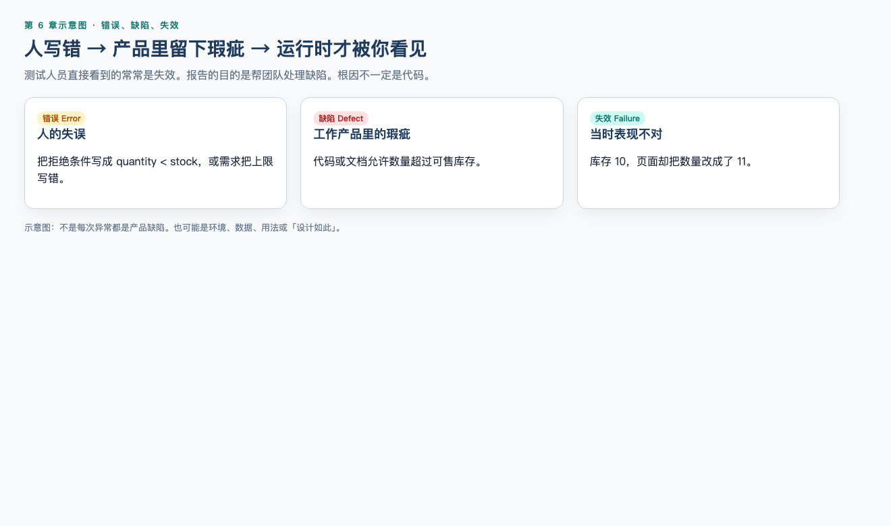
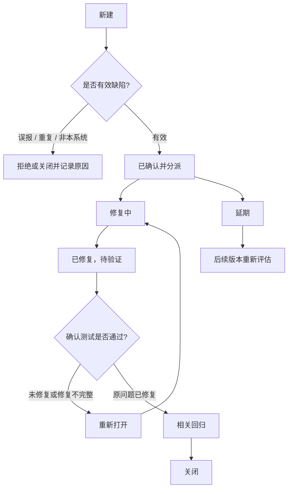
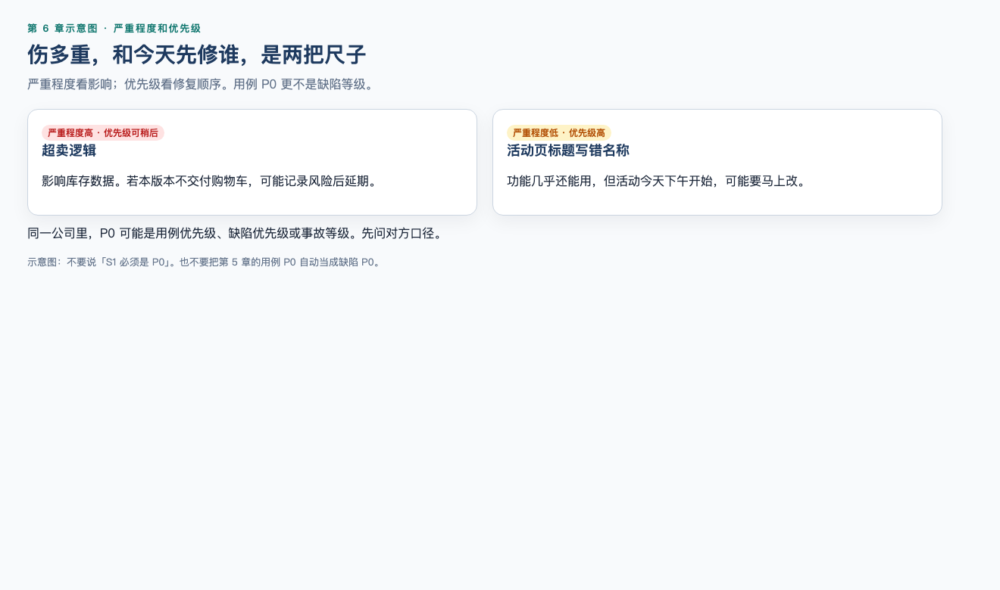
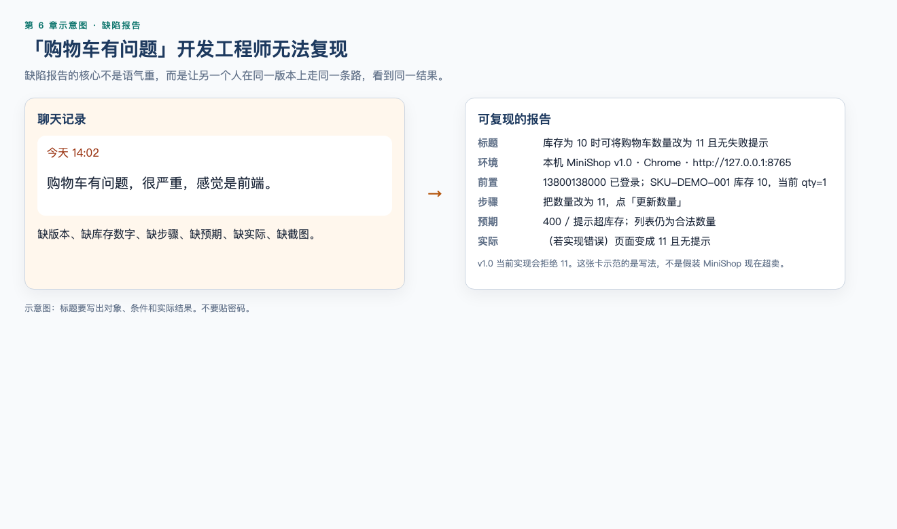

# 第 6 章（上）：缺陷管理

> **一句话核心：** 缺陷报告是给别人复核的证据，不是情绪宣泄。

> 重要级别：⭐⭐⭐ 必须掌握  
> 主案例：MiniShop 个人软件测试实践项目  
> 阅读顺序：06A → [06B 测试管理](06b-test-management.md)

## 这一章解决什么问题

第 5 章已经能把测试点写成用例。执行之后，问题不会自动变成团队可处理的工作项。上半章只解决一件事：怎样把发现的问题写成可复现、可沟通、可跟踪的缺陷。

测试计划、入口/出口、指标和环境放到 [06B](06b-test-management.md)。

## 学习目标

- 区分错误、缺陷和失效；
- 描述一条常见缺陷生命周期，并知道状态名不是全球统一标准；
- 区分严重程度与优先级，且不和用例 P0～P3 混用；
- 编写含环境、步骤、预期、实际结果和证据的缺陷报告；
- 处理无法复现、争议和偶现。

## 前置知识

已按正式学习顺序完成第 1、2、3、7、4、5 章。知道 P0～P3 是课程用例优先级约定。

## 场景导入：一句“购物车有问题”为什么不够？

库存显示为 10，输入 11 后页面变成 11 且无提示。只发“购物车有问题”，开发工程师无法复现。上半章训练把这句话写成可执行的缺陷报告。

v1.0 **不定义**订单状态机。本章购物车规则若出现小计、支付，视为教学示例，正式字段以第 19 章 PRD 为准。

## 6.1 错误、缺陷与失效 ⭐⭐⭐




先把三个容易混用的词分开。ISTQB 的常用区分是：

| 概念 | 含义 | MiniShop 例子 |
| --- | --- | --- |
| 错误（Error / Mistake） | 人做出了不正确的判断或动作 | 需求把库存上限写错，或开发工程师把拒绝条件 `quantity > stock` 写成 `quantity < stock` |
| 缺陷（Defect / Fault / Bug） | 工作产品中的瑕疵 | 代码或需求允许数量超过可售库存 |
| 失效（Failure） | 系统表现出与预期不符的行为 | 测试时库存 10 却能把数量改成 11 |

关系通常是：人的错误可能把缺陷引入需求、设计、代码、配置或测试工作产品；缺陷在特定条件被执行或使用时，才可能表现为失效。

因此：

- 测试人员直接观察到的常常是**失效**；
- 缺陷报告的目的是帮助团队定位并处理**缺陷**；
- 根因可能是代码，也可能是需求、数据、配置或环境。

不是每一次异常都是产品缺陷。它也可能是：

- 测试数据或前置条件准备错误；
- 测错了版本或环境；
- 用例预期本身过时；
- 重复提交了已有缺陷；
- 一次尚未确认的需求变更。

缺陷管理过程的一项工作，就是判断这次报告到底是有效缺陷、误报、重复项，还是变更请求。

需求评审、设计评审中发现的问题，不一定一开始就建成缺陷单。第 4 章的需求问题清单仍然有效。团队应约定：哪些问题走需求跟踪，哪些在开发开始后转入缺陷工作流。静态测试发现的需求瑕疵也是缺陷，只是记录形式可能不同。

本课程中“Bug”和“缺陷”视为同一类工作项的常用叫法。口头交流可以说 Bug；书面和面试中应能切换到缺陷、失效这些更准确的词。

---

## 6.2 为什么要管理缺陷 ⭐⭐⭐

如果缺陷只存在于个人备忘录或聊天记录里，团队会遇到这些问题：

- 无法确认谁负责、当前状态是什么；
- 无法判断修复是否经过确认测试；
- 无法统计还剩哪些高影响问题；
- 同一问题被重复提出，或修复后再次出现却没有历史；
- 发布时只能说“好像还有点问题”。

缺陷管理的最小价值是：**让每个已发现的异常从发现走到关闭，过程可追踪，结论可复查。**

它通常要回答：

- 这个问题现在处于什么状态？
- 影响有多大，应多快处理？
- 修复针对哪个版本？
- 确认测试和相关回归是否完成？
- 未关闭问题对发布意味着什么？

发现缺陷不是测试的全部目的，但管理已发现的缺陷，是测试能为发布决策提供信息的前提。

---

## 6.3 缺陷生命周期 ⭐⭐⭐

缺陷生命周期描述一个异常从被发现到被关闭的状态变化。不同组织、工具和项目的状态名称可以完全不同。下面是本课程的**教学模型**，不是 Jira、禅道或 TAPD 的官方标准，也不是所有公司必须采用的流程。



教学状态可以这样理解：

| 教学状态 | 含义 | 常见责任人 |
| --- | --- | --- |
| 新建 | 已记录异常，尚未确认是否为有效缺陷 | 发现者，通常是测试人员 |
| 已确认 | 团队承认需要处理，并指定处理人 | 开发、测试或缺陷管理员 |
| 修复中 | 正在修改代码、配置、数据或文档 | 开发工程师或其他修复责任人 |
| 已修复，待验证 | 声称已修复，等待在约定环境确认 | 测试人员做确认测试 |
| 重新打开 | 确认测试失败，或关闭后再次出现 | 测试人员退回 |
| 延期 | 承认是缺陷，但当前版本不修复；后续版本仍要重新评估，不是让缺陷消失 | 产品、开发与测试共同评估 |
| 拒绝/关闭 | 结束该工作项，必须有原因 | 按团队权限约定 |

几个实践原则比记住状态名更重要：

1. **状态表示当前走到哪一步，解决方案/关闭原因说明为什么结束。** 有的工具把二者分成两个字段。例如“已关闭 + 重复”“已关闭 + 无法复现”“已关闭 + 已修复”。
2. **谁发现，通常由谁在验证后关闭。** 这是常见实践，不是定律。有的团队由测试负责人统一关闭。
3. **开发工程师完成修复，不等于缺陷已经关闭。** 还需要在约定版本和环境中做确认测试，并按风险决定回归范围。
4. **关闭不是让问题消失，而是留下可审计的结论。** 延期、不予修复、设计如此，都要记录接受该风险的人和依据。

第 2 章和第 3 章已经区分过确认测试与回归测试。放到缺陷流程中：

- 确认测试：按原复现步骤检查这个缺陷是否还在；
- 回归测试：检查这次修改是否影响加购、结算、库存扣减等关联区域。

二者可以在同一次验证中完成，但目的不同。回归范围按修改内容和风险决定，不是每次把全部用例再跑一遍。

---

## 6.4 严重程度与优先级 ⭐⭐⭐




这是面试和工作中最容易被问到、也最容易答错的一对概念。

| 维度 | 回答的问题 | 关注点 |
| --- | --- | --- |
| 严重程度（Severity） | 这个问题对用户、业务或系统的影响有多大？ | 失效后果 |
| 优先级（Priority） | 应多快、以什么顺序修复？ | 修复紧急程度和版本安排 |

二者相关，但不自动相等。

### 课程教学等级

为了 MiniShop 练习能够互相讨论，本章采用以下约定。**真实组织标准优先；入职后先读团队定义。**

严重程度：

| 等级 | 课程定义 | 例子 |
| --- | --- | --- |
| S1 致命 | 核心流程不可用，或导致严重数据/资金/权限错误，且没有可接受的变通方法 | 支付成功但重复扣款；所有用户无法登录 |
| S2 严重 | 主要功能错误，明显影响关键任务，变通方法很差或仅少数人能绕过 | 购物车可把数量改为超过库存，且会进入结算 |
| S3 一般 | 功能有缺陷，但有合理变通方法，或不阻断主路径 | 失败提示不准确，但数量实际上没有被保存 |
| S4 轻微 | 对功能影响很小，主要是文案、对齐、低价值体验问题 | 帮助页错别字、非关键图标偏移 |

优先级：

| 等级 | 课程定义 | 例子 |
| --- | --- | --- |
| P0 立即处理 | 阻塞测试、阻塞发布或正在造成持续损失 | 测试环境无法登录，冒烟无法开始 |
| P1 本版本必须修复 | 当前交付范围里的高风险问题 | 购物车可超库存，且本版本要上购物车 |
| P2 计划修复 | 需要修，但可放入后续迭代，前提是风险已被记录 | 次要筛选条件错误 |
| P3 可延期 | 低风险，资源不足时可以接受遗留 | 非关键说明文案 |

### 必须分开的三套“P0”

第 5 章的 P0～P3 是**测试用例优先级**：先执行哪些用例。  
本章的 P0～P3 是**缺陷修复优先级**：先修哪些缺陷。  
有的团队还会把 P0 用于线上事故。

这三套标签不是同一套标准，也不能根据数字自动换算。例如：

- 一条 P0 用例失败，对应缺陷的严重程度可能是 S1，也可能只是测试数据导致的误报；
- 一个 S4 文案问题，在大型促销首页上可能被设为 P1，因为当天品牌影响很大。

### 四种常见组合

| 组合 | 理解 | MiniShop 例子 |
| --- | --- | --- |
| 高严重程度 + 高优先级 | 影响大，且必须尽快修 | 结算时金额少计，且本周要开放下单 |
| 高严重程度 + 较低优先级 | 影响大，但当前场景很少发生，或有正式变通方法，且不在本版本范围 | 仅年底对账后台在特定日期崩溃；若本版本不含该功能，可能延期并记录风险 |
| 低严重程度 + 高优先级 | 功能影响不大，但修复窗口或业务影响要求马上处理 | 活动页主标题写错活动名称 |
| 低严重程度 + 低优先级 | 影响小，可纳入常规优化 | 帮助中心段落间距 |

测试人员可以提出严重程度和优先级建议，最终常由产品、开发、测试共同确认。不要把个人情绪写成等级：“我觉得很严重”需要改成可观察的影响。

同一现象的严重程度要看后果，而不是只看页面。若数量改成 11 后无法提交订单，影响可能低于已经超卖并生成订单。等级是对影响的判断，需要写清判断依据。

不要把任何一张等级表说成全球统一标准。有的团队用 1～5，有的用 Blocker/Critical/Major/Minor，有的数字越大越紧急。

---

## 6.5 缺陷报告怎么写 ⭐⭐⭐

合格的缺陷报告让一个没看过你屏幕的人，能够在相同条件下复现，并判断这是不是问题。



### 标题怎么写

标题应包含：**对象 + 条件 + 实际结果**。必要时补上预期。

| 差标题 | 更好的标题 |
| --- | --- |
| 购物车有问题 | 购物车：库存为 10 时可将数量修改为 11，未提示失败 |
| 登录失败 | 使用正确测试账号登录后仍停留在登录页，无错误提示 |
| 不行 | 提交订单后库存未扣减，商品详情仍显示原库存 |
| 偶现 bug | 连续快速点击结算时，约 3/10 次生成两笔订单 |

不要在标题里写情绪、猜测根因或内部争吵，例如“前端又没校验”“开发不认真”。

### 报告应包含什么

ISTQB CTFL v4.0.1 要求缺陷报告清晰、可理解。初级工作中一份可用报告通常包含：

| 字段 | 作用 | 注意 |
| --- | --- | --- |
| 缺陷 ID | 唯一识别 | 由工具生成，或按课程约定编号 |
| 标题 | 一句话概括失效 | 见上表 |
| 发现日期 / 作者 | 可追溯 | 使用工作标识，不必写个人隐私 |
| 被测对象与版本 | 明确测的是哪一个构建 | 环境名、构建号、提交号或发布包名 |
| 环境 | 浏览器、操作系统、账号角色、语言和分辨率等必要信息 | 只写影响复现的条件 |
| 关联需求 / 用例 | 说明预期来自哪里 | 例如本章教学规则、TC-CART-012 |
| 发现阶段 | 在需求、测试执行或其他阶段发现 | 便于区分静态发现和动态发现 |
| 前置条件 | 复现前必须成立的状态 | 含测试数据，不含生产机密 |
| 步骤 | 可重复的动作 | 一步一个动作，不要写分支 |
| 预期结果 | 依据当前需求基线应出现什么 | 不能只写“正常” |
| 实际结果 | 实际观察到什么 | 与预期分开写 |
| 证据 | 截图、录屏、日志、接口响应 | 脱敏后再上传 |
| 发生频率 | 必现、偶现及大约比例 | 偶现必须写尝试次数 |
| 严重程度 / 优先级 | 影响和建议处理顺序 | 标明这是建议值 |
| 状态 | 当前生命周期位置 | 按团队工作流 |

提交前应先搜索是否已有相同缺陷，避免重复单干扰统计和修复。

根因不是必填项。可以写“待查”或“假设：提交时未按可售库存校验”，但不要把未验证的假设写成事实。

### 完整示例

```markdown
# BUG-CART-001 购物车：库存为 10 时可将数量修改为 11

- 发现日期：2026-09-08
- 作者：测试工程师 A
- 被测对象：MiniShop 购物车数量修改
- 版本：test 环境构建 `minishop-test-20260908-01`（教学示例号）
- 环境：macOS；Chrome 稳定版；窗口宽度 1280px；测试账号角色=普通登录用户
- 关联：教学规则 R-CART-数量上限；用例 TC-CART-012
- 严重程度建议：S2
- 优先级建议：P1
- 频率：5/5 必现

## 前置条件
1. 使用指定测试账号登录，不要在报告中填写密码。
2. 购物车中有在售商品 SKU-DEMO-001，页面显示可售库存为 10，当前数量为 1。

## 步骤
1. 打开购物车页面。
2. 将 SKU-DEMO-001 的数量从 1 改为 11。
3. 保存或触发数量提交。
4. 观察页面数量、提示和结算小计。

## 预期结果
提交失败；数量保持为 1；出现库存不足或超限提示；结算小计仍按数量 1 计算。

## 实际结果
数量显示为 11；无失败提示；小计按 11 件计算。刷新后数量仍为 11。

## 证据
- 页面截图：库存 10、数量 11、无错误提示（已去除账号隐私）。
- 如后续章节提供接口信息，再补充请求与响应；本章不虚构接口路径。

## 备注
未验证其他用户并发抢占该库存时的结果。暂不把并发问题写入本缺陷的既定范围。
```

这不是要求每条缺陷都写成小说。步骤越短越好，但必须完整。缺环境和版本的“漂亮描述”仍然很难处理。

### 证据与安全

- 只在自有或明确授权的测试环境中制造和收集缺陷证据；
- 不要把真实用户密码、验证码、身份证号、完整支付卡号或生产地址写入缺陷；
- 截图中的手机号、地址、邮件如有必要，应遮盖；
- 日志只要与复现相关的时间窗，不要整包上传后放任敏感配置泄露。

---

## 6.6 无法复现 ⭐⭐⭐

“无法复现”表示：在当前已知条件下，其他人或你自己再也观察不到该失效。它不是对测试人员的否定，也不等于系统没有问题。

常见原因：

- 版本已经变化；
- 测试数据被其他用例改过；
- 浏览器缓存、登录态、权限或功能开关不同；
- 步骤漏了关键动作；
- 只在特定时间、并发、网络或第三方依赖下出现。

建议处理顺序：

1. 自己按原步骤再测一次，并记录版本和时间；
2. 核对环境、账号角色、数据和构建号是否一致；
3. 补充日志、时间戳、请求标识或录屏；
4. 尝试相邻数据或相邻步骤，寻找更稳定的复现条件；
5. 若仍不能复现，把尝试次数、差异条件和当前结论写进缺陷，而不是删除它；
6. 与开发工程师对着同一环境核对；需要关闭时，使用“无法复现”类原因，而不是假装已修复。

关闭后如果再次出现，应重新打开或新建并关联旧单，不要只在聊天里说“那个问题又来了”。

---

## 6.7 争议缺陷 ⭐⭐⭐

争议通常不是“有没有看到这个现象”，而是“这个现象算不算缺陷”。

常见说法：

- 需求没写，所以不是 Bug；
- 设计如此；
- 这是优化，不是缺陷；
- 只影响极少数人；
- 测试环境数据特殊。

处理争议时，先回到测试依据，而不是先争论对错：

| 问题 | 你要出示的东西 |
| --- | --- |
| 预期从哪来？ | 需求、验收条件、原型、接口约定或已确认规则 |
| 实际是什么？ | 步骤、证据、版本 |
| 影响是什么？ | 用户任务、资金、数据、权限、测试阻塞 |
| 若按“设计如此”接受，后果是什么？ | 哪些用例、风险和文档需要更新 |

可能的结果：

- 确认为缺陷，继续修复；
- 确认为需求遗漏，转为需求变更，同时更新测试依据；
- 确认为设计如此，关闭缺陷，并修改用例预期；
- 暂不修复，记录接受风险的人、版本和下次评估点。

测试人员可以坚持风险，但不应在依据不足时把个人偏好写成缺陷。产品负责人可以决定接受某项体验，但不能在没有记录的情况下要求测试把明显的数据错误说成“正常”。

---

## 6.8 偶现缺陷 ⭐⭐⭐

偶现缺陷有时能复现，有时不能。它比“完全无法复现”更需要记录频率和条件。

报告里不要只写“偶现”。至少补充：

- 尝试了多少次，失败多少次；
- 是否与快速重复操作、刷新、返回、并发、弱网、特定浏览器有关；
- 出现时的时间点和前后动作；
- 有无日志、状态码或页面提示差异。

查找模式时可以问：

- 第一次操作和连续操作是否不同？
- 清空缓存或换无痕窗口后是否变化？
- 只影响某一个账号、商品或库存值吗？
- 页面显示和刷新后的数据是否一致？

偶现缺陷在未找到稳定复现前，不要仅仅因为“不好演示”就标成低严重程度或低优先级。支付、库存、权限类偶现问题，往往比稳定的文案错误更危险。如果必须延期，应在测试报告里作为剩余风险单独列出。

---

## 6.9 缺陷管理工具 ⭐⭐

工具用来承载工作流，不决定什么算缺陷。本课程介绍 Jira、禅道和 TAPD，是因为国内初级测试岗位常见，不代表 MiniShop 必须使用其中某一个，也不讲解容易过时的按钮路径。

| 工具 | 认识它时要记住的边界 |
| --- | --- |
| Jira | 工作流可配置。团队管理项目常见 To Do / In Progress / Done；公司管理项目里仍可能看到 Open、Resolved、Closed、Reopened。Jira 里状态和 Resolution（解决方案）可能是不同字段。默认优先级通常是 Highest 到 Lowest，不是 P0～P3。 |
| 禅道 | 官方手册中的常见路径是：测试提交 → 开发确认/解决 → 测试验证关闭；验证失败则激活后重新解决。常见状态示例为激活、已解决、已关闭。解决方案示例包括 fixed、duplicate、bydesign、notrepro、postponed、willnotfix。具体以当前版本和团队配置为准。 |
| TAPD | 腾讯推出的协作与缺陷跟踪平台之一。状态、字段和权限同样可配置，不能把某次演示中的“新建/处理中/已解决/已关闭”当成所有 TAPD 项目的标准。 |

使用任何工具时，先问团队四个问题：

1. 缺陷从新建到关闭要经过哪些状态？
2. 谁有权限分派、拒绝、延期和关闭？
3. 严重程度、优先级、模块和版本字段怎么填？
4. 重复缺陷、无法复现和设计如此分别用什么解决方案？

MiniShop 在项目材料尚未建立前，可以用 Markdown 缺陷登记表练习。工具可以稍后替换，报告质量不能等工具。

---


配套书面实操：[实操 6-1](../practice/06-bug-report/README.md)。先跑实操 1-1 复现，再自己写报告，不要把仓库 `BUG-001.md` 抄成作业。

## MiniShop 工作实战：缺陷报告

先写一份完整缺陷报告（标题、版本、步骤、预期、实际、证据）。计划摘要放到 06B。

可对照仓库 `project/minishop/bugs/BUG-001.md`：空搜索与 R-SEARCH 不符，证据在 `evidence/http/03-products-empty-keyword.txt` 和 `evidence/screenshots/04-search-empty-bug001.png`。不要把开放缺陷写成已修复。

## 常见错误

### 错误 1：严重程度就是优先级

修正：严重程度描述影响，优先级描述修复顺序。二者常一起评估，但不能互相替代。

### 错误 2：用例 P0 等于缺陷 P0

修正：第 5 章 P0 表示先执行哪些用例；本章 P0 表示缺陷应多快修复。还要再与线上事故等级区分。

### 错误 3：缺陷标题只写“有问题”“登录失败”

修正：写对象、条件和实际结果。需要时补预期。

### 错误 4：预期结果写成“应该正常”

修正：写页面、数据、提示或状态的可观察变化。预期必须能追溯到测试依据。

### 错误 5：开发说已修复，测试就把缺陷关闭

修正：在约定版本上做确认测试，再按风险做回归。修复声明不是关闭证据。

### 错误 6：把工具默认状态当成行业标准

修正：先读团队工作流。Jira、禅道、TAPD 的状态名都可以被配置。

### 错误 7：通过率高就可以上线

修正：还要看范围、未测项、未关闭缺陷、环境和剩余风险。测试不能证明没有缺陷。

### 错误 8：争议时只重复“这就是 Bug”

修正：出示依据、证据、影响和可选处理。若确认为设计如此，要回写需求和用例。

### 错误 9：偶现缺陷因为难复现就标成 S4

修正：先看影响对象。资金、库存、权限的偶现问题通常不能按文案问题处理。

### 错误 10：为了尽快提 Bug 把密码和真实用户数据贴进报告

修正：使用测试账号标识，证据脱敏，只在授权环境操作。

---


## 面试角度 ⭐⭐⭐

回答顺序继续使用：结论 → 原理 → 场景 → 示例 → 边界。

### 严重程度和优先级有什么区别？

结论：严重程度看影响大小，优先级看修复紧急程度。  
原理：影响大的问题通常优先修，但发布范围、发生频率、变通方法和业务窗口会改变顺序。  
示例：购物车可超库存通常高严重程度；若本版本不交付购物车，可能记录风险后延期。活动页错字严重程度低，但活动当天可能高优先级。  
边界：不要把某公司的 P0/S1 定义说成全球标准。

### 缺陷报告有哪些关键内容？

结论：让别人能复现并判断是否为缺陷。  
应包含：标题、版本和环境、前置条件、步骤、预期、实际结果、证据、频率、关联需求和建议等级。  
边界：根因可以是假设；没有证据的指责没有价值。

### 开发说无法复现，怎么办？

结论：先核对是否在同一版本、环境和数据上操作，再补充证据，而不是立即争论。  
可增加：录屏、日志、时间戳、尝试次数、账号角色差异。  
若仍无法复现，记录原因与尝试过程，按团队规则保持打开、延期或关闭。

### 测试计划里有什么？

结论：说明测什么、不测什么、怎么测、何时开始和结束、风险是什么。  
敏捷团队可能把这些内容放进迭代计划，但问题本身仍然存在。  
边界：计划长度服从项目风险，不存在必须 20 页的规定。

### 还有未关闭缺陷，能不能上线？

结论：可以上线的是“剩余风险被评估并可接受的版本”，不是“缺陷数量为零的版本”。  
需要说明未关闭缺陷的影响、变通方法、发生条件和接受人。  
边界：测试不能证明系统没有缺陷；无缺陷谬论在第 1 章已经讲过。

### 入口标准和出口标准是什么？

结论：入口标准判断是否具备开始测试的合理条件，出口标准帮助判断计划中的测试能否结束。  
示例：构建未部署或冒烟失败，通常不应开始深度测试；S1 未关闭且未评估，通常不能只凭通过率宣布结束。  
边界：具体清单由项目约定，达不到时要记录偏差而不是偷偷改标准。

---


## 小练习

### 练习 1

开发工程师把库存比较符写错，测试时购物车允许数量超过库存。错误、缺陷、失效分别对应什么？

### 练习 2

哪一项最能说明“严重程度 ≠ 优先级”？

A. S1 缺陷都必须是 P0  
B. 用例 P0 失败则缺陷一定是 P0  
C. 活动页主标题写错活动名称，功能影响小但可能需要马上修  
D. 只要能复现，严重程度就等于优先级

### 练习 3

把标题改得可执行：

> 购物车有问题，很严重，感觉是前端没校验。

### 练习 4

一份缺陷只有“打开购物车，改数量，失败”。它最缺哪三类信息？说明为什么没有这些信息就很难修复。

### 练习 5

你提交的库存超卖缺陷，开发工程师在本地无法复现。写出你的前四步处理，而不是直接关闭或直接争吵。

### 练习 6

产品经理说“需求没写不能输入 11，所以这不是 Bug，是优化。”测试人员应出示哪些依据？若最终判定为设计如此，测试侧还要做什么？


## 练习答案

1. 错误：开发工程师写错比较符（人的失误）。缺陷：代码中允许数量超过可售库存的瑕疵。失效：运行时库存 10 却成功把数量改为 11。若需求本身写错，则错误发生在需求阶段，缺陷位于需求文档，失效仍可能在运行时出现。比较符例子只说明“人的失误如何进入工作产品”，真实缺陷还可能是漏校验、用错字段或前后端不一致。

2. C。低功能影响也可能因业务窗口而高优先级。A、B、D 把两套或三套等级错误等同。

3. 示例：购物车在可售库存为 10 时可将数量修改为 11，无失败提示。不要保留“很严重”“感觉是前端”这类无证据判断。

4. 至少缺少：版本/环境、可观察的预期与实际结果、数据前置（如库存值）。没有版本可能修错构建；没有预期无法判断是否为缺陷；没有库存等数据则步骤不可复现。

5. 示例顺序：用同一构建和账号重测并记录结果；核对库存、商品状态和角色；补充截图/日志/时间；在同一测试环境与开发工程师对测。不要第一步就关闭，也不要在缺少版本信息时坚持“你一定没认真看”。

6. 应出示教学已确认规则或当前需求基线、复现证据、超卖影响。若判定设计如此：关闭时写明原因，更新需求和用例预期，评估是否需要新的测试点，并在报告中记录该决策。


## 本章检查清单

- [ ] 我能区分错误、缺陷和失效
- [ ] 我能口述缺陷从新建到关闭的路径
- [ ] 我能区分严重程度和优先级
- [ ] 我能写出可复现的标题和步骤
- [ ] 我知道报告里不应出现密码
- [ ] 我能处理无法复现、争议和偶现

### 进入 06B 的自测门槛

能举一组高严重程度低优先级、一组低严重程度高优先级；能说明确认测试通过才更接近关闭。

## 本章总结

缺陷管理让失效变成可跟踪的工作项。报告的核心是让别人能复现。

## 本章可运行性说明

本章无 Python/SQL。缺陷报告模板为示例结构。对照仓库 `bugs/BUG-001.md` 与 `evidence/screenshots/04-search-empty-bug001.png`。

## 参考资料

- [06B](06b-test-management.md)
- ISTQB CTFL v4.0.1

## 下一章预告

下一节是 [第 6 章（下）：测试计划与测试管理](06b-test-management.md)。
