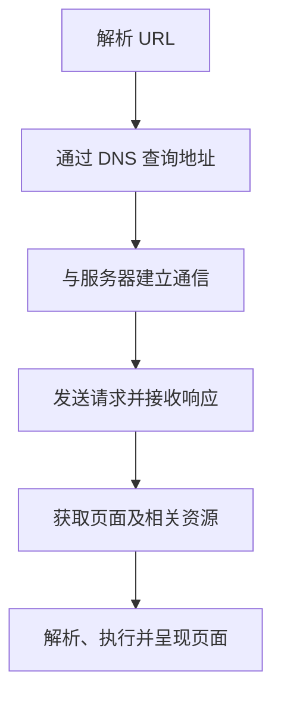
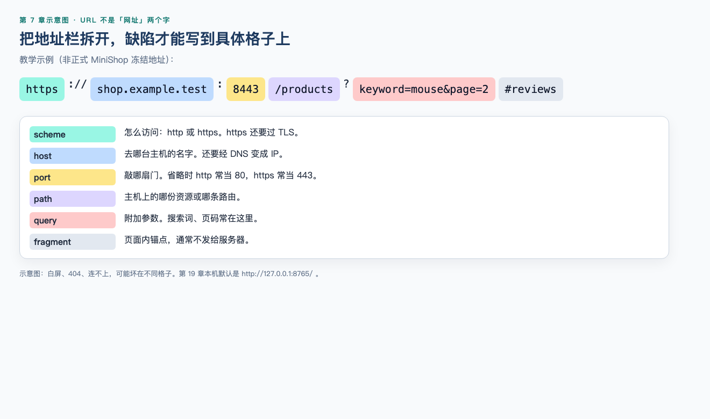
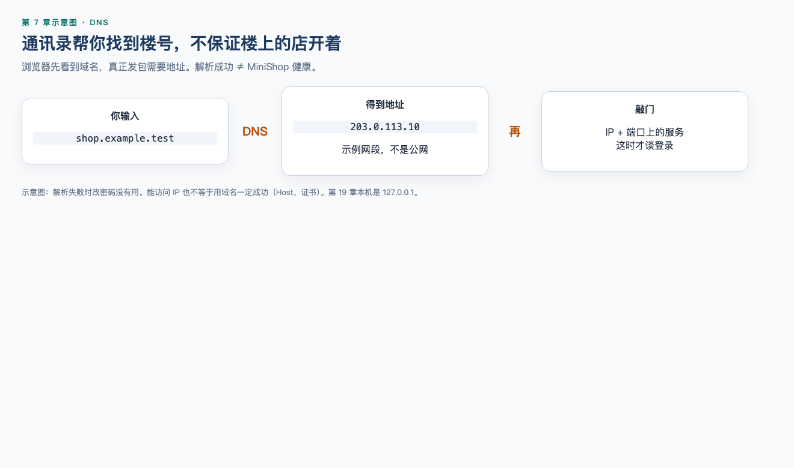
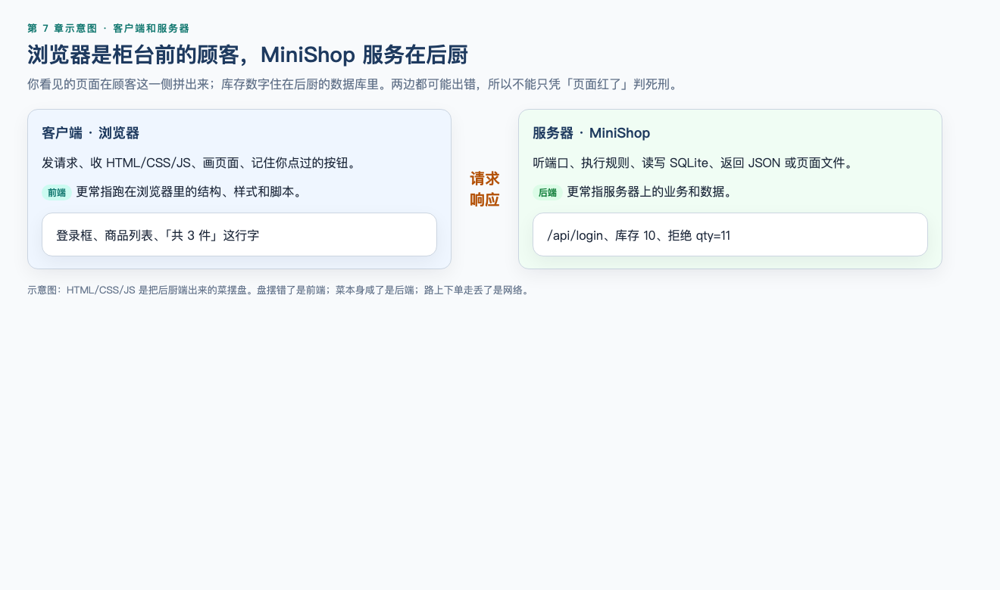
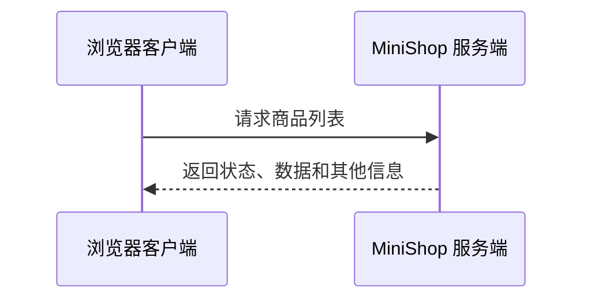
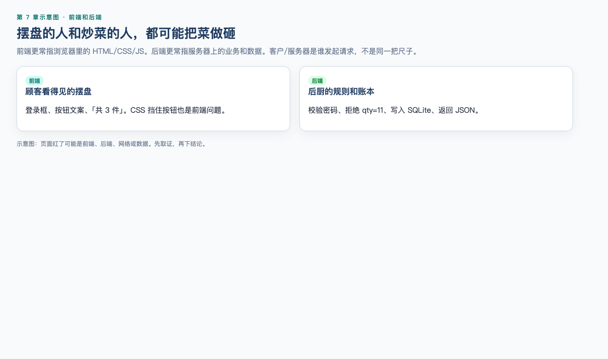
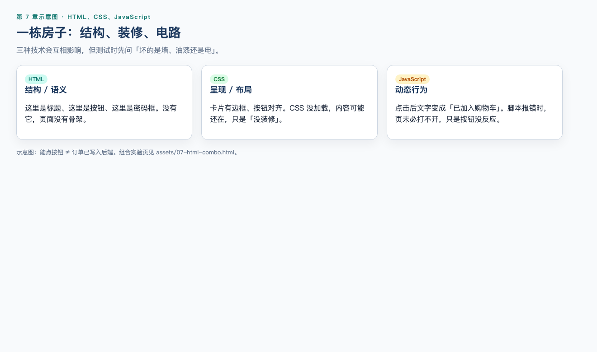
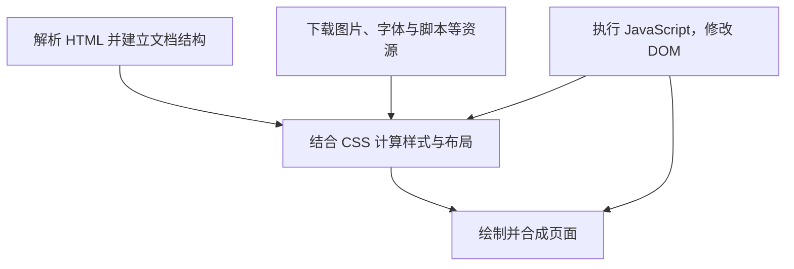

# 第 7 章：Web 基础

> **一句话核心：** 浏览器里的页面只是一条观察通道，不是整个被测系统。

> 重要级别：⭐⭐⭐ 必须掌握  
> 主案例：MiniShop 个人软件测试实践项目

## 这一章解决什么问题

当你在浏览器里输入 MiniShop 的网址并看到商品首页时，背后并不是“浏览器打开了一个文件”这么简单。

浏览器需要识别地址、找到服务器、发送请求、接收资源，再把 HTML、CSS、JavaScript 等内容组合成页面。测试工程师如果不了解这条链路，就很容易把“页面没显示”笼统地写成一个前端 Bug，也无法判断问题更可能发生在哪里。

本章建立一张够用的 Web 心智地图。它不会提前展开 HTTP 报文、网络分层或 DevTools 操作；这些内容分别在第 9 章和第 10 章主讲。

## 学习目标

完成本章后，你应该能够：

- 解释 Web、网页、网站和 Web 应用的基本含义；
- 说清浏览器访问网站的主要步骤；
- 识别 URL 的 scheme、host、port、path、query 和 fragment；
- 区分域名、主机名与 IP 地址，理解 DNS 的作用；
- 区分客户端、服务器、前端和后端；
- 说明 HTML、CSS 和 JavaScript 的主要职责；
- 用简化模型解释浏览器如何把资源呈现为页面；
- 根据现象提出初步排查方向，而不是武断归因；
- 完成一份 MiniShop Web 页面观察记录。

## 前置知识

- 已学习第 1 章，理解测试的目的和基本原则；
- 已学习第 2 章，理解软件研发流程与团队角色；
- 已学习第 3 章，知道同一个测试活动可以从多个维度分类；
- 不要求编程和网络基础。

## 场景导入：输入网址以后发生了什么？

你在浏览器地址栏输入：

```text
https://shop.example.test:8443/products?keyword=mouse&page=2#reviews
```

然后按下 Enter。

你看到的结果可能是商品列表，也可能是白屏、加载动画、错误页或“找不到服务器”。这些现象背后的故障位置并不相同。

测试工程师至少要能建立下面的简化链路：



这张图是教学模型。真实浏览器还会涉及缓存、代理、TLS、重定向、多个资源请求、渲染优化等过程，不能把它理解为所有场景都严格只执行六步。

例如，缓存命中时浏览器可能不必再次从原服务器下载某项资源；发生重定向时，也可能先收到一个响应，再访问新的 URL。流程图表达的是主要职责，不是固定的请求次数。

## 7.1 Web、网页、网站和 Web 应用 ⭐⭐

### Web 是什么？

万维网（World Wide Web，Web）可以先理解为：用户通过浏览器等客户端，使用 URL 定位资源，并通过网络协议访问相互关联的页面和服务。

互联网（Internet）是更广的网络基础设施；Web 是运行在互联网之上的一种重要应用。电子邮件、即时通信也使用互联网，但不等同于 Web。

### 网页、网站与 Web 应用

| 概念 | 简化理解 | MiniShop 示例 |
| --- | --- | --- |
| 网页（Web Page） | 浏览器中呈现的一个页面或文档 | 商品详情页 |
| 网站（Website） | 同一业务或主体下相互关联的一组页面和资源 | MiniShop 整个站点 |
| Web 应用（Web Application） | 强调交互、业务处理和数据变化的 Web 系统 | 登录、购物车、下单和后台管理 |

这些概念在日常交流中可能交叉使用。测试时比“争论名称”更重要的是弄清对象边界：要测哪个页面、哪些服务、哪些用户流程和哪些外部依赖。

## 7.2 浏览器访问网站的基本流程 ⭐⭐⭐

以首次访问 MiniShop 商品页为例，可以拆成下面几步。

### 第一步：浏览器解析 URL

浏览器先识别访问协议、主机、端口、路径等信息。URL 不是“域名的另一种叫法”，域名通常只是 URL 中 host 的组成部分。

### 第二步：查找服务器地址

如果 URL 使用域名，客户端通常需要通过域名系统（Domain Name System，DNS）获得可用于通信的 IP 地址。结果可能来自浏览器、操作系统或网络侧缓存，不一定每次都重新查询远端 DNS 服务器。

### 第三步：建立通信

客户端与目标服务器建立所需连接。HTTPS 通常还涉及 TLS 安全协商。这里先知道“需要建立安全通信”即可，具体过程在第 9 章学习。

### 第四步：发送请求并接收响应

浏览器请求目标资源，服务器处理后返回响应。响应可能包含 HTML，也可能是 JSON、图片、文件、重定向或错误信息。

### 第五步：继续获取依赖资源

一个 HTML 页面往往还引用 CSS、JavaScript、图片和字体。看到一次页面访问，不代表网络中只发生一次请求。

### 第六步：解析、执行和呈现

浏览器解析 HTML，应用 CSS，并在适当时机执行 JavaScript，最终把结果呈现给用户。页面展示和资源下载可能交错进行，不应死记成完全串行的流水线。

### 测试工程师如何使用这条链路？

| 现象 | 可优先确认 | 不能直接下的结论 |
| --- | --- | --- |
| 域名无法访问 | 地址、网络、DNS、代理、环境状态 | “一定是后端挂了” |
| 页面返回 404 | URL、路由、部署路径、资源是否存在 | “一定是前端 Bug” |
| 页面框架出现但数据为空 | 数据请求、响应、权限、前端处理 | “数据库里一定没数据” |
| 页面白屏 | 控制台错误、资源加载、脚本执行、响应内容 | “服务器完全不可用” |
| 样式错乱 | CSS 资源、选择器、缓存、兼容性 | “HTML 写错了” |

这些只是排查方向，不是仅凭现象就能确定的根因。

## 7.3 URL：资源的地址 ⭐⭐⭐

统一资源定位符（Uniform Resource Locator，URL）用于标识资源的位置以及访问方式。



继续拆解示例：

```text
https://shop.example.test:8443/products?keyword=mouse&page=2#reviews
```

| 部分 | 示例 | 作用 |
| --- | --- | --- |
| scheme | `https` | 表示使用的方案或协议 |
| host | `shop.example.test` | 表示目标主机 |
| port | `8443` | 表示目标服务端口；省略时通常使用该 scheme 的默认端口 |
| path | `/products` | 表示目标路径 |
| query | `keyword=mouse&page=2` | 携带查询信息；由 `?` 引入 |
| fragment | `reviews` | 标识资源内部片段；由 `#` 引入 |

URL 标准还允许出现用户信息等结构，本章不要求完整掌握 URL 语法。实际测试中不要把账号、密码或敏感令牌写进 URL：URL 可能出现在浏览器历史、日志、截图或其他记录中。

### 三个容易出错的地方

第一，`https` 不属于域名。

第二，query 不等于“GET 专属参数”。URL 可以带 query，但请求方法的语义要到第 9 章结合 HTTP 学习。

第三，fragment 通常由客户端处理，并不会作为 HTTP 请求目标的一部分发送给服务器。因此“服务端没有收到 `#reviews`”不一定是缺陷。

### 测试 URL 时关注什么？

- scheme 是否正确，是否发生意外降级；
- host 和环境是否正确；
- port 是否正确；
- path 大小写、斜杠和路由是否符合约定；
- query 缺失、重复、空值、特殊字符和编码时如何处理；
- fragment 是否定位到正确区域；
- 复制链接、刷新页面、前进后退后状态是否合理。

## 7.4 Domain、Host、Hostname 与 IP ⭐⭐⭐

### 域名（Domain Name）

域名是分层命名体系中的名称，例如：

```text
example.test
```

为了避免把教学地址误认为真实生产站点，本书示例使用 `.test` 保留顶级域名。

### 主机与主机名

在 URL 语境中，host 表示要连接的目标主机信息。`shop.example.test` 可以作为主机名（hostname）。URL 的 host 也可能直接写成 IP 地址。

不同工具、标准和日常表达对 domain、host、hostname 的展示方式可能略有差异。初级阶段先掌握：

- 域名是便于管理和记忆的分层名称；
- 主机名可以标识具体主机或服务入口；
- URL 中的 host 用于确定访问目标；
- 它们都不等同于完整 URL。

### IP 地址

IP 地址用于网络通信中的寻址。一个域名可能对应多个 IP；多个域名也可能由同一个 IP 提供服务。因此禁止把“一个域名永远只对应一台服务器”当作规则。

## 7.5 DNS：把名称解析为地址 ⭐⭐⭐




DNS 最常见的教学类比是“互联网通讯录”：客户端知道域名，但网络通信还需要可用地址，于是查询 DNS。

这个类比有帮助，但并不完整。DNS 是分布式、分层的命名系统，可以保存多种类型的记录；“域名转 IP”只是初学阶段最需要理解的用途。

### MiniShop 场景

测试环境地址：

```text
https://shop.example.test
```

如果测试机无法正确解析该名称，浏览器可能在发送业务请求之前就失败。此时反复修改登录密码没有意义。

### 常见误区

- DNS 成功只说明获得了解析结果，不代表应用服务一定健康；
- 能直接访问某个 IP，不代表用域名访问一定正常，服务可能依赖 Host、证书或网关配置；
- 修改 DNS 后可能受多级缓存影响，不能假设全球立即一致；
- “打不开网站”不等于一定是 DNS 问题。

## 7.6 Client 与 Server ⭐⭐⭐



### 客户端（Client）

客户端是发起请求、使用服务的一方。浏览器是典型客户端，但命令行工具、手机应用和自动化脚本也可以是客户端。

### 服务器（Server）

服务器可以指提供服务的软件，也可以在某些语境中指运行软件的计算机。实际交流要结合上下文。

MiniShop 中可能存在：

- 提供页面静态资源的服务；
- 处理登录、商品和订单业务的应用服务；
- 保存数据的数据库服务；
- 提供图片的对象存储或内容分发服务。

所以“服务器”不一定是一台机器，也不一定只有一个程序。

### 请求与响应

客户端常通过“请求—响应”完成交互：



本章只建立角色关系。请求方法、状态码、Header 和 Body 在第 9 章主讲。

## 7.7 Frontend 与 Backend ⭐⭐⭐




### 前端（Frontend）

前端通常负责用户直接看到和交互的部分，例如：

- 页面结构和内容；
- 样式与布局；
- 按钮、表单和交互；
- 调用后端接口；
- 对返回数据进行展示。

### 后端（Backend）

后端通常负责：

- 业务规则；
- 身份认证与权限判断；
- 数据读写；
- 与其他服务交互；
- 向客户端提供页面或 API 响应。

### 不要用位置机械判断责任

“页面上看见的问题”不一定由前端引起。

例如商品价格显示为 `-99`：

- 后端可能返回了错误数据；
- 前端可能计算或格式化错误；
- 测试数据本身可能非法；
- 缓存可能返回旧结果。

专业表达应是：

> 页面观察到负数价格；从响应数据、前端转换逻辑和测试数据三个方向继续定位。

而不是尚未检查就写：

> 前端价格 Bug。

## 7.8 HTML、CSS 与 JavaScript ⭐⭐⭐




可以用“房屋”帮助初步理解，但不要把类比当成正式定义。

| 技术 | 主要职责 | 房屋类比 | MiniShop 示例 |
| --- | --- | --- | --- |
| HTML | 描述文档结构与语义 | 房间结构 | 标题、图片、表单、按钮 |
| CSS | 控制呈现、布局和视觉效果 | 装修与摆放 | 颜色、间距、响应式布局 |
| JavaScript | 实现脚本逻辑与动态交互 | 控制系统 | 加入购物车、动态更新数量 |

### HTML：不只是“放文字”

下面是一个最小示例：

```html
<article class="product-card">
  <h2>无线鼠标</h2>
  <p>价格：¥99.00</p>
  <button type="button">加入购物车</button>
</article>
```

HTML 元素表达结构和语义。标题用 `<h2>`、按钮用 `<button>`，通常比全部使用无语义容器更有利于可访问性和测试定位。

进行基础页面观察时，还可以确认：图片是否有合适的文本替代信息、表单控件是否有可识别的标签、只使用键盘能否到达并操作关键控件。完整的可访问性测试不在本章展开，但结构和语义会直接影响不同用户能否使用页面。

### CSS：控制呈现

```css
.product-card {
  border: 1px solid #d0d7de;
  padding: 16px;
}
```

如果 CSS 资源没有加载，HTML 内容可能仍存在，但页面会像“没有装修”。

### JavaScript：实现动态行为

```javascript
const button = document.querySelector(".product-card button");

button.addEventListener("click", () => {
  button.textContent = "已加入购物车";
});
```

如果脚本报错，页面未必完全打不开；也可能只是某个按钮没有反应。反过来，能点击按钮也不代表订单数据一定正确写入后端。

> 代码说明：以上代码用于观察三种技术的职责，可独立放入简单 HTML 页面中验证；本章不要求学习者独立编写 JavaScript。

组合页已放入仓库，用浏览器直接打开即可：[`assets/07-html-combo.html`](assets/07-html-combo.html)。另有登录表单练习页 [`assets/07-html-lab.html`](assets/07-html-lab.html)。验证只证明示例本身可运行，不代表真实 MiniShop 的加购业务已经完成。v1.0 真页面截图：[`assets/01-login.png`](assets/01-login.png)。

## 7.9 浏览器如何呈现页面 ⭐⭐

初学阶段可以使用下面的简化模型：



需要注意：

- HTML 解析会建立浏览器使用的文档对象模型（Document Object Model，DOM）；
- CSS 会参与样式计算和布局；
- 这是简化模型：JavaScript 常见路径是修改 DOM，并可能触发布局与绘制，不要读成「JS 会重新解析 HTML」；
- 浏览器实现包含更复杂的线程、任务调度与优化机制；
- 不同浏览器对标准、默认样式和边缘行为的实现可能有差异。

因此“查看网页源代码”与“查看运行后的 DOM”可能看到不同内容；后者可能已经被 JavaScript 修改。第 10 章会用 DevTools 观察这些差异。

## MiniShop 工作实战：建立页面观察记录

观察 MiniShop 登录页 `http://127.0.0.1:8765/`（未登录时 `/` 就是登录/注册，不要虚构商品列表）。若项目尚未运行，可打开练习页 [`assets/07-html-lab.html`](assets/07-html-lab.html)，或对任意已获授权的练习站点执行同样观察，但不要把第三方网站当作攻击练习目标。

### 任务一：拆解地址

记录：

```text
完整 URL：
scheme：
host：
port：
path：
query：
fragment：
```

没有出现的部分填写“未显式提供”，不要凭空补值。

### 任务二：识别页面组成

至少记录五项：

| 页面观察 | 更可能涉及 | 仍需确认 |
| --- | --- | --- |
| 标题或表单标签 | HTML/数据呈现 | 数据来自初始 HTML 还是接口 |
| 表单或卡片布局 | CSS | 不同窗口宽度是否变化 |
| 登录或提交按钮 | HTML + JavaScript | 是否请求后端、失败如何提示 |

请自行补充至少两行。

### 任务三：做初步故障假设

针对下面现象，各写至少两个可能方向和下一步证据：

1. 浏览器提示无法解析主机名；
2. 页面文字存在，但所有样式消失；
3. 商品页能显示，加入购物车按钮无反应；
4. 商品数量显示错误。

本任务不要求立即找到根因，目标是训练“现象—假设—证据”的思路。

### 实操作业交付模板

将观察结果保存为 `exercises/chapter-07-web-observation.md`，至少包含：

```markdown
# MiniShop Web 页面观察报告

## 测试对象
- 环境：
- 浏览器及版本：
- 观察时间：
- 页面名称：

## URL 拆解
- 完整 URL：
- scheme：
- host：
- port：
- path：
- query：
- fragment：

## 页面组成观察
| 页面元素或行为 | 可能涉及的 Web 技术 | 观察证据 |
| --- | --- | --- |

## 故障分析练习
| 已观察事实 | 可能原因 | 下一步证据 | 当前结论 |
| --- | --- | --- | --- |

## 自检结论
- 是否区分事实与假设：
- 仍不理解的问题：
```

完成标准：URL 各部分填写准确；页面组成不少于五项；故障分析不少于四个场景；每个场景至少给出两个假设和对应取证方向。

## 常见错误

### 错误 1：互联网就是 Web

Web 使用互联网基础设施，但互联网还承载其他类型的服务。

### 错误 2：域名就是完整网址

域名只是 URL 相关结构中的一部分。完整 URL 还可能包含 scheme、端口、路径、查询和片段。

### 错误 3：一个域名永远对应一台服务器

域名可以对应多个 IP；同一 IP 也可能服务多个域名。

### 错误 4：浏览器打开一页只发一个请求

页面通常还会请求脚本、样式、图片、字体和业务数据。

### 错误 5：页面报错就是前端 Bug

页面现象可能由前端、后端、网络、配置、数据或依赖服务造成，需要证据定位。

### 错误 6：HTML、CSS、JavaScript 分别对应结构、样式、行为，所以互不影响

这是入门时的职责模型，不是绝对边界。例如 JavaScript 可以修改样式和结构，CSS 也会影响元素是否可见和可交互。

### 错误 7：页面已经显示就说明请求全部成功

页面可能部分成功，某些图片、脚本或数据请求仍然失败。

## 面试角度

### 问题 1：在浏览器输入 URL 后发生了什么？

推荐表达：

> 浏览器先解析 URL；如果使用域名，会通过 DNS 等机制获得目标地址；随后建立所需连接，HTTPS 还涉及 TLS；浏览器发送请求并接收响应，解析 HTML，并继续获取 CSS、JavaScript、图片等资源，最终计算布局并呈现页面。真实过程还会受到缓存、代理、重定向和浏览器实现影响。

面试中不需要在没被追问时背出每个网络分组细节，但要避免把过程说成“DNS 找到网页，然后服务器把整个页面一次发回来”。

### 问题 2：前端问题和后端问题怎么区分？

推荐表达：

> 不能只凭页面现象判断。我会先稳定复现并确认环境，再观察请求是否发出、响应状态和响应数据是否符合约定，同时检查浏览器控制台、页面处理逻辑和后端日志。若后端返回数据正确但页面展示错误，更偏向前端；若响应数据或服务处理已经错误，更偏向后端。最终以证据定位。

### 问题 3：HTML、CSS、JavaScript 分别做什么？

推荐表达：

> HTML 主要描述页面结构和语义，CSS 主要控制呈现和布局，JavaScript 主要实现动态逻辑和交互。这是职责上的简化划分，实际运行中三者会相互作用。

### 问题 4：域名和 IP 有什么关系？

推荐表达：

> 用户通常使用域名访问服务，DNS 可以把名称解析为可通信的地址。关系并非固定一对一：一个域名可以对应多个 IP，多个域名也可能共享一个 IP。

## 小练习

### 练习 1

拆解下面 URL：

```text
https://admin.example.test:9443/orders/1001?tab=payment#history
```

写出 scheme、host、port、path、query 和 fragment。

### 练习 2

判断：域名解析成功，就能证明 MiniShop 应用服务一定正常。说明理由。

### 练习 3

一个商品页显示了标题和价格，但商品图片全部加载失败。能否直接报告为“后端服务宕机”？你会先检查什么？

### 练习 4

解释客户端和服务器。浏览器是不是唯一的客户端？

### 练习 5

页面按钮外观正常，但点击后没有任何变化。至少列出三个可能方向。

### 练习 6

为什么查看页面源代码时可能找不到屏幕上已经显示的商品名称？

### 练习 7

判断：fragment `#reviews` 通常会随 HTTP 请求发送给服务器。说明理由。

### 练习 8

请为“MiniShop 商品数量显示为负数”写一条专业的初步问题描述，要求区分已观察事实与待验证假设。

## 练习答案

### 答案 1

- scheme：`https`
- host：`admin.example.test`
- port：`9443`
- path：`/orders/1001`
- query：`tab=payment`
- fragment：`history`

### 答案 2

不能。DNS 解析成功只说明客户端获得了名称对应的地址信息。服务器进程、端口、网关、证书、应用代码或依赖服务仍然可能异常。

### 答案 3

不能。页面主体已经出现，至少说明部分资源可以获得。可以先检查图片 URL、图片请求状态、权限、防盗链或对象存储、前端路径拼接和网络拦截情况，再根据证据归因。

### 答案 4

客户端是请求和使用服务的一方，服务器是提供服务的一方。浏览器只是常见客户端；手机应用、`curl`、Postman 和自动化脚本也可以充当客户端。

### 答案 5

合理方向包括：

- 点击事件没有正确绑定；
- JavaScript 在此前已经报错；
- 按钮被透明元素遮挡或实际处于禁用状态；
- 请求没有发出或被浏览器策略阻止；
- 请求已发出，但响应失败或前端没有处理结果。

列出三个并说明如何取证即可。

### 答案 6

屏幕内容可能不是初始 HTML 直接包含的，而是 JavaScript 获取数据后动态写入 DOM。查看源代码偏向初始响应，DevTools 中的 Elements 通常反映运行后的 DOM。

### 答案 7

错误。fragment 通常由客户端用于定位资源内部片段，不作为 HTTP 请求目标的一部分发送给服务器。

### 答案 8

参考答案：

> 在测试环境的商品详情页中，商品库存显示为 `-1`。刷新后仍可复现。当前已确认页面展示值异常；尚未确认响应数据、前端转换逻辑和数据库测试数据是否正确，需继续检查后再确定责任模块。

开放题可有其他合理表达，但必须把事实和假设分开。

## 本章检查清单

完成本章后，请确认：

- [ ] 我能区分 Web 与互联网；
- [ ] 我能区分网页、网站和 Web 应用；
- [ ] 我能讲出浏览器访问网站的主要步骤；
- [ ] 我知道这条流程是简化模型，不是绝对串行规则；
- [ ] 我能拆解常见 URL；
- [ ] 我能区分 URL、域名、主机名和 IP；
- [ ] 我能解释 DNS 的主要作用和边界；
- [ ] 我知道域名与 IP 不一定一对一；
- [ ] 我能区分客户端与服务器；
- [ ] 我能区分前端与后端的主要职责；
- [ ] 我不会仅凭页面现象武断归因；
- [ ] 我能说明 HTML、CSS 和 JavaScript 的主要职责；
- [ ] 我知道一张页面通常包含多个资源请求；
- [ ] 我能用简化模型解释浏览器呈现页面；
- [ ] 我能完成 MiniShop 页面观察记录。

## 本章总结

本章最需要记住五件事：

1. URL 用于定位资源，域名只是相关结构的一部分；
2. DNS 帮助客户端从名称获得地址信息，但解析成功不等于应用健康；
3. 浏览器是客户端，服务端可能由多个服务共同组成；
4. HTML、CSS、JavaScript 分别侧重结构语义、呈现布局和动态行为，但会相互作用；
5. 页面上的故障现象不等于故障根因，测试工程师需要沿访问链路收集证据。

## 参考资料

- [WHATWG URL Standard](https://url.spec.whatwg.org/)
- [WHATWG HTML Living Standard](https://html.spec.whatwg.org/)
- [MDN：How the web works](https://developer.mozilla.org/en-US/docs/Learn_web_development/Getting_started/Web_standards/How_the_web_works)
- [MDN：Populating the page—how browsers work](https://developer.mozilla.org/en-US/docs/Web/Performance/Guides/How_browsers_work)

## 下一章预告

现在你已经知道页面从哪里来、URL 如何组成，以及前端和后端怎样协作。

按课程正式学习顺序，下一章进入第 4 章《测试需求分析与静态测试》（先读 [04A](04a-requirements-static-testing.md)）。你将开始把“理解页面”转化为真正的测试工作：阅读 PRD、发现歧义和遗漏、拆解功能并提取测试点。

学完第 1、2、3、7 章后，做 [阶段测验 1](quizzes/stage-1-foundations.md)。
