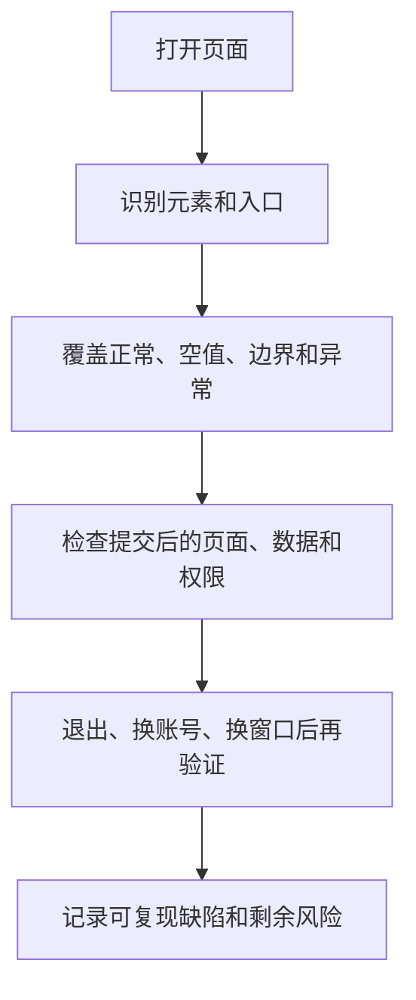
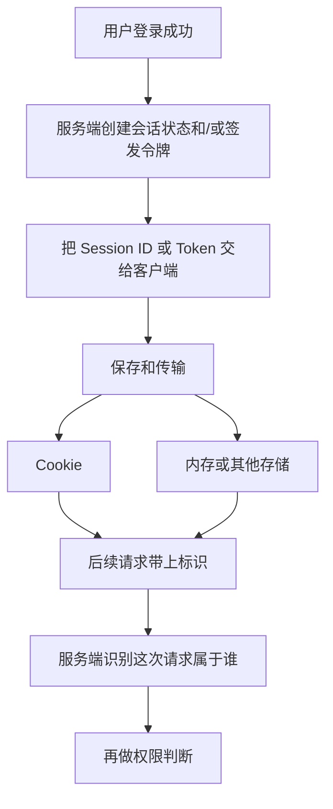

# 第 8 章：Web 功能测试

> 重要级别：⭐⭐⭐ 必须掌握  
> 核心章节发布目标：≥95/100  
> 主案例：MiniShop 个人软件测试实践项目

## 这一章解决什么问题

第 7 章解决了“页面从哪里来”。本章解决“页面上的功能对不对”：按钮、表单、搜索、分页、上传下载、注册登录、登录态和权限，是否按需求工作。

只确认首页能打开，远远不够。用户会输入空搜索、翻到最后一页、把购物车链接粘到未登录窗口、用自己的账号去猜别人的订单入口。Web 功能测试要把这些真实用法变成可执行、可判断的检查。

本章建立页面功能测试的检查清单，并讲清 Cookie、Session、Session ID、Token 和 Bearer Token 的层次差异。它们不是三种互相替代的“登录技术”。HTTP 报文、状态码和 DevTools 操作分别在第 9 章、第 10 章主讲。

## 学习目标

完成本章后，你应该能够：

- 识别常见页面元素，并按真实控件角色而不是外观设计测试；
- 测试表单、输入框、链接、搜索、分页、上传和下载的主要风险点；
- 设计 MiniShop 注册、登录、退出后的功能检查；
- 用层次模型解释 Cookie、Session、Session ID、Token 和 Bearer Token；
- 测试登录态：未登录、已登录、退出后、多标签页和过期；
- 区分未授权、横向越权和纵向越权；
- 区分兼容性测试与响应式测试，并设计最小兼容矩阵；
- 把 Web 功能失效写成第 6 章要求的可复现缺陷；
- 完成一份 MiniShop Web 功能测试包。

## 前置知识

- 已按正式学习顺序完成第 1、2、3、7、4、5、6 章；
- 能从需求提取测试点并编写基础用例；
- 能区分确认测试与回归测试，能写可复现的缺陷报告；
- 理解 URL、客户端/服务器、前端/后端和 HTML/CSS/JavaScript 的基本职责；
- 不要求编写后端或掌握 HTTP 报文细节。

## 场景导入：首页能打开，功能就算测完了吗？

MiniShop 测试环境：

```text
https://shop.example.test
```

首页商品列表能显示。这只说明冒烟中的“页面可访问”可能通过，不能说明功能正确。

继续操作时，常见失效是：

- 搜索只输入空格，页面转圈后既没有结果也没有“无结果”提示；
- 地址栏 `page=2` 能打开，`page=99999` 却空白且没有说明；
- 登录后把购物车 URL 粘到未登录的隐私窗口，仍能看到上一个用户的商品；
- 用自己的账号把地址中的用户标识改成别人的，仍能打开他人信息。

这些都是 Web 功能问题。有的出在页面交互，有的出在登录态和权限。测试时既要会点，也要问：系统凭什么认为我是这个用户、我被允许做什么。



本章所有安全相关检查只允许在 MiniShop 或明确授权的测试环境中进行，不要把公开网站当成越权练习场。

---

## 8.1 Web 功能测试测什么 ⭐⭐⭐

Web 功能测试验证用户通过浏览器完成业务时，系统是否满足已确认规则。它通常是系统测试级别上的功能测试，常用黑盒技术，执行方式可以是手工或自动化。第 3 章的分类轴在这里仍然适用：不要把“Web 测试”理解成与功能测试、系统测试互斥的新类别。

一轮 MiniShop Web 功能测试至少要回答：

| 问题 | 例子 |
| --- | --- |
| 入口找得到吗？ | 搜索框、登录、加入购物车是否可见可用 |
| 正常路径通吗？ | 合法搜索、合法登录、合法修改购物车数量 |
| 空值和非法输入呢？ | 空搜索、超长词、错误验证码 |
| 状态变了还能对吗？ | 登录后、退出后、锁定后、商品下架后 |
| 数据一致吗？ | 列表、详情、购物车数量和小计 |
| 权限对吗？ | 未登录、用户 A、用户 B、后台入口 |
| 不同窗口和设备呢？ | 浏览器、视口宽度、刷新和后退 |

前端校验通过不等于功能正确。页面提示“成功”，还要看刷新后数据是否还在、换一个账号是否隔离、服务端是否同样拒绝非法值。第 7 章已经强调：页面现象不等于根因。本章继续强调：页面提示不等于业务结果。

---

## 8.2 页面元素：先认对对象 ⭐⭐⭐

先识别用户真正操作的是什么，再设计步骤。看起来像按钮的东西，可能是 `<button>`、链接、或只能点的 `<div>`。

| 对象 | 测试时要确认 | MiniShop 例子 |
| --- | --- | --- |
| 按钮 | 能否聚焦、单击、重复单击；禁用时是否仍可提交 | 加入购物车、提交订单 |
| 链接 | 跳转目标、新窗口、失效地址 | 商品标题进入详情 |
| 输入框 | 可输入、可粘贴、最大长度、清空 | 搜索词、手机号、数量 |
| 单选/复选 | 互斥或可多选是否符合规则 | 规格、协议勾选 |
| 下拉框 | 默认值、选项完整性、可搜索时的过滤 | 排序方式 |
| 图片 | 加载失败时的替代信息、点击热区 | 商品主图 |
| 提示文本 | 是否来自真实校验，会不会挡住操作 | 库存不足提示 |

观察建议：

- 用键盘 Tab 走一遍关键路径，确认能否到达搜索、登录和提交；
- 看控件是否有可见标签，不要只靠占位符（placeholder）当标签；
- 占位符不是已输入的值，刷新后也不应把它当成用户数据。

完整可访问性测试超出初级功能测试范围，但“找不到控件、键盘到不了、没有标签”已经足以影响功能，应作为缺陷提出。

---

## 8.3 表单测试 ⭐⭐⭐

表单把多个输入组织成一次提交。注册、登录、搜索、改地址、上传都可能是表单。

### 教学示例

下面是一个**完整、可独立打开**的教学页面，只用于观察标签、必填和浏览器约束，不是 MiniShop 正式登录实现。

```html
<!DOCTYPE html>
<html lang="zh-CN">
<head>
  <meta charset="utf-8">
  <title>MiniShop 教学登录表单</title>
  <style>
    body { font-family: sans-serif; max-width: 420px; margin: 2rem auto; }
    label { display: block; margin-top: 1rem; }
    input { width: 100%; box-sizing: border-box; padding: 8px; }
    button { margin-top: 1rem; }
    .hint { color: #57606a; font-size: 0.9rem; }
  </style>
</head>
<body>
  <h1>教学登录表单</h1>
  <p class="hint">仅用于观察标签、必填和客户端约束。</p>
  <form id="login-form" action="#" method="post">
    <label for="phone">手机号</label>
    <input id="phone" name="phone" type="text" required maxlength="11" autocomplete="username">
    <label for="password">密码</label>
    <input id="password" name="password" type="password" required minlength="8" maxlength="20" autocomplete="current-password">
    <button type="submit">登录</button>
  </form>
  <p id="result" hidden>已触发提交（教学页面不会真正登录）。</p>
  <script>
    document.getElementById("login-form").addEventListener("submit", function (event) {
      event.preventDefault();
      document.getElementById("result").hidden = false;
    });
  </script>
</body>
</html>
```

`required`、`minlength`、`maxlength` 属于浏览器约束验证。用户可能通过开发者工具、禁用脚本或直接调用接口绕过它们。因此：

- 客户端有提示，只说明页面做了第一层拦截；
- 非法值是否真正被拒绝，要看服务端规则；
- 测试计划里应同时包含“界面拦截”和“绕过界面后的结果”，后者可在第 9、10、13 章用请求观察，本章先建立这个意识。

`method="post"` 只表示这个教学表单把数据放在请求体里提交。不要由此推出“POST 一定安全、GET 一定不安全”。请求方法的语义在第 9 章展开。

### 表单检查清单

| 检查点 | 问什么 |
| --- | --- |
| 必填 | 空提交时，哪些字段被拦截，提示是否指向具体字段 |
| 可选 | 不填可选字段仍能成功 |
| 默认值 | 默认值是否符合需求，会不会被误当成用户输入 |
| 重置/清空 | 是否只清输入、不清业务数据 |
| 重复提交 | 连续点击提交会不会创建两个账号或两笔订单 |
| 成功路径 | 跳转、提示、会话和数据是否一致 |
| 失败路径 | 原输入是否保留（密码通常应清空或按需求处理） |
| 刷新 | 成功页刷新会不会重复提交 |

---

## 8.4 输入框测试 ⭐⭐⭐

输入框是 Web 功能缺陷的高发区。第 5 章的等价类、边界值和错误推测在这里直接使用。

以 MiniShop 搜索框和数量框为例，至少覆盖：

| 类型 | 搜索框例子 | 数量框例子 |
| --- | --- | --- |
| 空值 | 不输入直接搜索 | 清空数量后保存 |
| 空白 | 若干空格、Tab | 只输入空格 |
| 合法值 | 已有商品关键词 | 1 到可售库存之间的整数 |
| 边界 | 1 个字符、需求允许的最大长度 | 1、库存、库存+1 |
| 非法类型 | 特殊字符、表情 | 小数、负数、字母 |
| 前后空格 | ` 鼠标 ` | 复制带空格的数字 |
| 粘贴 | 从别处粘贴超长文本 | 粘贴 `11` |
| 快速编辑 | 连续删除再输入 | 连续点击加号 |

沿用第 4、6 章的教学规则：数量必须是正整数，且不得超过提交时可售库存。这仍是教学规则，不是正式 PRD 冻结。

预期不能只写“不能输入”。要写清：

- 界面是否允许键入；
- 提交时是否拒绝；
- 拒绝后显示值是否回到合法值；
- 提示是否可理解。

有的输入框在界面上按键被拦住，有的允许输入但提交失败。两种都可能符合需求，但测试记录必须写实际行为，不能把“我打不进去”和“提交被拒绝”混成一句。

---

## 8.5 链接测试 ⭐⭐⭐

链接把站点串起来。失效链接会把完整流程切断。

检查：

- 当前页可见的主导航、页脚、面包屑、商品卡片标题；
- 跳转是否到达预期页面，而不是只看“点了有反应”；
- 在新标签打开时，原页面是否保持；
- 页面内锚点（URL 的 fragment）是否滚到对应位置；第 7 章已说明 fragment 通常不发给服务器；
- 空链接、`javascript:void(0)`、指向 404 或错误环境的地址；
- 需要登录才能访问的链接，未登录时是跳登录页还是直接报错。

不要对未授权的第三方网站做大规模爬取或破坏性点击。MiniShop 范围内逐条检查主导航和主流程链接即可。

---

## 8.6 搜索测试 ⭐⭐⭐

搜索同时涉及输入、结果列表、空态和 URL。第 7 章的示例地址已经出现过查询参数：

```text
https://shop.example.test:8443/products?keyword=mouse&page=2
```

这是教学 URL，不代表 MiniShop 已冻结正式路由。

| 测试点 | 为什么要测 |
| --- | --- |
| 空搜索 | 是搜全部、提示必填，还是无结果 |
| 只有空格 | 常被当成有输入，结果却不可理解 |
| 精确匹配 / 部分匹配 | 需求未写清时先记录实际行为并提评审 |
| 无结果 | 必须有明确空态，不能无限转圈 |
| 特殊字符 | 结果页应作为文本显示，而不是把输入当脚本执行 |
| 大小写与中英文 | 按需求，不要假设一定忽略大小写 |
| URL 与页面一致 | 搜索词应能从地址栏复现；刷新后结果不应无故丢失 |
| 搜索后的分页 | 翻页不应丢掉关键词 |

特殊字符检查只观察 MiniShop 是否正确显示和过滤，例如输入 `<script>` 后页面应显示转义文本或无结果，而不是执行脚本。不要对外部站点做注入攻击。

---

## 8.7 分页测试 ⭐⭐⭐

分页把长列表拆成多页。缺陷常出现在最后一页、非法页码和筛选条件丢失。

| 测试点 | 例子 |
| --- | --- |
| 第一页 | 上一页应不可用或保持第一页 |
| 中间页 | `page=2` 与页面内容、页码高亮一致 |
| 最后一页 | 剩余条数可以少于每页条数 |
| 超出范围 | `page=0`、`page=-1`、`page=99999` |
| 每页条数 | 若可切换，总数、页数和当前页要重算 |
| 条件组合 | 搜索后再翻页，关键词应保持 |
| 数据变化 | 删除或下架后，原最后一页不应静默空白而不说明 |
| 直接改 URL | 用户可以手动改查询参数，服务端仍应给出合理响应 |

不要把“空白页”当成通过。应判断：是无数据的合法空态，还是未处理的非法页码。

---

## 8.8 上传测试 ⭐⭐

上传出现在头像、售后凭证、商品图等场景。MiniShop 若尚未提供上传入口，可用授权练习页完成同类检查，不要对任意网站上传文件。

| 检查点 | 说明 |
| --- | --- |
| 类型 | 需求允许的扩展名；也要关注实际文件内容是否被检查 |
| 大小 | 0 字节、刚好上限、超过上限 |
| 空文件 / 未选择 | 提示是否明确 |
| 文件名 | 超长、空格、中文、特殊字符 |
| 替换与取消 | 选错后能否重选，取消后是否仍提交旧文件 |
| 进度与失败 | 网络中断或服务失败时的提示 |
| 权限 | 未登录或无权限用户不能上传成功 |
| 结果 | 上传成功后，页面展示与再次进入是否仍在 |

不要上传恶意软件样本到未授权系统。类型绕过（把不允许的文件改扩展名）只允许在自己的测试环境观察系统是否只看扩展名。

---

## 8.9 下载测试 ⭐⭐

下载常见于导出订单、发票、模板文件。若 MiniShop 暂无下载，先掌握检查方法。

| 检查点 | 说明 |
| --- | --- |
| 权限 | 未登录、他人数据、普通用户导出管理报表 |
| 内容 | 下载文件与页面筛选条件一致 |
| 文件名 | 可读、编码正确，不要全是乱码 |
| 类型 | 扩展名与实际内容匹配 |
| 空数据 | 无订单时是空文件、提示还是报错 |
| 中断 | 能再次下载；不要求本章做专业断点续传工具测试 |

下载到本地的测试数据同样可能含账号或地址，注意不要把真实隐私文件发到缺陷单或聊天工具。第 6 章的脱敏要求在这里继续有效。

---

## 8.10 注册与登录功能测试 ⭐⭐⭐

第 4 章给出的注册、登录需求仍是待评审草案，第 5 章的手机号 11 位数字、登录正常/锁定/禁用是教学模型。本章用它们练习 Web 功能测试，**不把阈值、提示文案和跳转写成 MiniShop 正式规则。**

### 注册

在草案范围内，优先检查：

- 必填项为空；
- 手机号长度和字符（按当前教学规则或已确认规则）；
- 重复注册；
- 验证码错误、过期、重复使用——规则未确认就记实际行为并提问题，不擅自规定秒数；
- 密码可见性切换是否只影响显示，不改变提交值；
- 连续点击注册是否只创建一个账号；
- 成功后是自动登录还是回到登录页。

### 登录

- 正确账号密码；
- 账号不存在、密码错误的提示是否符合需求（有的系统故意使用同一提示）；
- 空值、前后空格；
- 教学模型中的锁定、禁用状态；
- 登录成功后的落地页：首页还是登录前想去的页面；
- 已登录用户再打开登录页：保持登录、重定向还是允许再登。

### 退出

退出是登录测试的一部分，常常被漏掉：

- 退出后访问购物车、订单或账号页应被拒绝或跳到登录；
- 浏览器后退不应把已退出用户重新带进需登录的业务操作；
- 多标签页中一处退出后，另一处继续提交应失败或要求重新登录，具体以需求为准，但必须测。

把这些结果写成用例时，沿用第 5 章字段；发现失效时，沿用第 6 章缺陷报告，写清浏览器、是否隐私窗口、账号角色和版本。

---

## 8.11 Cookie、Session、Session ID 和 Token 不是三种替代技术 ⭐⭐⭐

这是本章最容易考错、也最容易在工作中说错的一组概念。正确说法是：**它们处于不同层次，常常配合使用，而不是三选一的登录方案。**



| 概念 | 层次 | 它是什么 | 常见误解 |
| --- | --- | --- | --- |
| Cookie | HTTP 状态管理机制 | 服务器通过 `Set-Cookie` 让浏览器保存的小段数据；符合条件时浏览器在后续请求中用 `Cookie` 头自动带上 | 把 Cookie 当成“登录”的同义词 |
| Session | 应用会话状态 | 服务端把多次请求识别为同一次访问或同一用户的状态，通常保存在服务端 | 以为 Session 是 Cookie 的另一种名字 |
| Session ID | 会话标识 | 用来找到那份 Session 的标识符 | 以为必须显示在页面上 |
| Token | 凭证或声明 | 一串用于证明身份或授权的数据，可以是随机不透明串，也可以是 JWT 这类有结构的格式 | 以为 Token 特指 JWT，或以为它是第三种登录产品 |
| Bearer Token | 出示 Token 的一种方式 | 在请求中声明“持有这个令牌的人被允许访问”，常见写法是 `Authorization: Bearer <token>` | 以为 Bearer 等于 Session，或等于 Cookie |

### Cookie

Cookie 解决的是：HTTP 请求本身不自动记住你是谁，浏览器可以用 Cookie 在后续请求中带上服务器之前给过的数据。

测试时只需要掌握这些属性的**行为影响**，不必背完整规范：

| 属性 | 对测试的意义 |
| --- | --- |
| 名称和值 | 值里不应出现明文密码；教学环境也不要把真实密码写成 Cookie 示例 |
| `Expires` / `Max-Age` | 过期后浏览器不应再带上该 Cookie |
| `Secure` | 只在 HTTPS（以及部分 localhost 情况）发送；Safari 对 localhost 例外的支持可能不同 |
| `HttpOnly` | JavaScript 的 `document.cookie` 读不到它；登录会话类 Cookie 常见此属性。它**不**阻止浏览器在后续请求里自动带上该 Cookie，脚本发起的同站请求通常仍会带上 |
| `SameSite` | 控制跨站请求是否带 Cookie。未设置时，现代浏览器通常按 `Lax` 处理；`None` 必须同时有 `Secure` |
| `Path` / `Domain` | 决定哪些路径或主机名会带上它 |

Cookie 会由浏览器在符合条件时自动附带，这与 CSRF（跨站请求伪造）风险相关。`SameSite=Lax`（现代浏览器对未设置 SameSite 的常见默认）会挡住大多数跨站 **POST**，购物车修改这类写操作通常因此带不上 Cookie；顶层跨站 **GET** 导航、`SameSite=None; Secure`、或旧浏览器仍可能带上登录态。`SameSite` 和额外的 CSRF 令牌都是常见缓解手段，不是本章要演练的攻击。测试时若在授权环境发现跨站请求仍能改购物车，应记录实际的方法、`SameSite` 值和是否带上 Cookie，而不是对外部系统做攻击实验。

当前浏览器还可能限制第三方 Cookie。如果 MiniShop 把登录放在跨站 iframe 里，功能失败不一定是账号密码错误。本章不展开分区 Cookie（CHIPS）细节。

观察 Cookie 的具体面板在第 10 章用 DevTools。本章先建立判断：

- 登录后，浏览器里**可能**出现会话相关 Cookie；
- 找不到 `document.cookie` 里的值，不代表没有 Cookie，它可能是 `HttpOnly`；
- Cookie 还在，不代表服务端会话一定有效。最终仍以访问受保护功能的结果为准。

### Session 与 Session ID

Session 是服务端的会话状态：购物车未登录暂存、登录身份、验证码尝试次数都可能放在会话里。Session ID 是打开这份状态的钥匙。

钥匙常常放在 Cookie 里，例如很多系统用 Cookie 保存 Session ID。这是 **Cookie 承载 Session ID**，不是“用了 Cookie 就没有 Session”，也不是“用了 Session 就不用 Cookie”。

Session ID 也可能出现在 URL 里。这会增加泄露风险（日志、Referer、分享链接）。若在 MiniShop 测试中发现登录后 URL 带有很长的会话标识，应作为风险记录，而不是当成正常装饰参数忽略。

测试关注：

- 登录成功后，同一浏览器继续访问需登录功能应识别为同一用户；
- 退出后，原 Session 应失效；只清页面、不清会话，是常见缺陷；
- 换一个浏览器或隐私窗口，不应自动继承上一次登录，除非需求明确允许且有对应机制。

### Token

Token 是凭证。服务端可以签发 Token，客户端在后续请求中出示它。JWT 只是 Token 的一种编码格式，不是 Token 的定义。

Token 可以：

- 放在 Cookie 里由浏览器自动携带；
- 放在内存里，由前端加到请求头；
- 放在 `localStorage` / `sessionStorage` 等 Web Storage 里。

Web Storage **不会**像 Cookie 那样自动随每次 HTTP 请求发送。`sessionStorage` 也不是服务端 Session：它只是标签页级别的浏览器存储，名字容易混淆。放在 Web Storage 里的 Token 通常能被页面脚本读取，XSS 风险与 `HttpOnly` Cookie 不同。不要根据“看起来更现代”判断哪种一定更安全。

因此不能说“我们不用 Session，改用 Token，所以没有登录态”。用 Token 的系统仍然有登录态，只是识别方式变成校验 Token。

### 它们如何配合

现实系统常见组合：

- Cookie 里保存 Session ID，服务端查 Session；
- Cookie 里保存 Token；
- 页面用 Cookie，接口用 `Authorization: Bearer`；
- 同时存在 CSRF 防护 Cookie 和认证 Cookie。

所以面试若问“Cookie、Session、Token 有什么区别”，不要答“三种登录方式，现在都用 Token”。应答：层次不同，Cookie 管如何保存和发送，Session 管服务端会话，Token 管凭证，Bearer 管如何出示 Token。

---

## 8.12 Bearer Token ⭐⭐⭐

Bearer Token 来自 HTTP 认证实践（RFC 6750）。核心含义是：**谁持有这个令牌，谁就可以用它访问被允许的资源。** 它通常放在请求头：

```text
Authorization: Bearer <token>
```

这是教学示意，不是 MiniShop 已冻结的接口约定。第 9 章再看真实请求头；第 13、14 章再在接口工具里使用。

对 Web 功能测试的意义：

- 浏览器页面登录成功后，后续接口调用可能自动带 Cookie，也可能由页面脚本加上 Bearer Token；
- 复制别人的 Bearer Token 就等于复制了那份访问资格，所以缺陷单、截图、日志里要脱敏；
- Token 过期、登出作废、权限变更后旧 Token 是否立即失效，属于登录态和权限测试，而不是“页面按钮还在不在”。

不要把 Bearer Token、JWT、OAuth、Cookie 说成同一个东西。OAuth 2.0 是授权框架，JWT 是令牌格式，Bearer 是出示方式，Cookie 是浏览器存储和发送机制。

---

## 8.13 登录态怎样测 ⭐⭐⭐

登录态测试验证系统能否持续、正确地识别“当前请求是谁”。

最小集合：

| 场景 | 预期方向 |
| --- | --- |
| 未登录访问需登录页 | 拒绝或跳转到登录，且不应泄露他人数据 |
| 登录后访问 | 识别为当前用户，看到自己的购物车 |
| 退出后访问 | 不能继续完成需登录的写操作 |
| 隐私窗口打开同一 URL | 不继承原窗口登录态 |
| 过期后操作 | 提示重新登录，而不是半成功半失败 |
| 后退/前进 | 不把已退出用户当成仍可结算 |
| 多标签 | 一处退出后，另一处提交的结果符合需求 |

判断登录态，不要只看页面右上角头像。应尝试一个真正需要身份的操作，例如查看账号信息或修改自己的购物车。头像还在但提交失败，或头像没了却仍能改他人数据，都是缺陷。

Cookie 被删除、被改坏或过期后，功能应回到未登录或友好错误，而不应 500 且把堆栈显示给用户。具体状态码等到第 9 章再精确阅读。

---

## 8.14 权限测试 ⭐⭐⭐

权限测试回答：当前身份允许做什么。第 3 章已要求未登录不能看订单、普通用户不能进后台、用户不能读他人订单。本章把它变成可执行步骤。

| 类型 | 含义 | MiniShop 例子 |
| --- | --- | --- |
| 未认证 | 没有有效登录态 | 直接打开购物车、账号页 |
| 横向越权 | 同级用户访问他人资源 | 用户 A 把标识改成用户 B 的购物车或订单入口 |
| 纵向越权 | 低权限访问高权限功能 | 普通用户打开后台管理入口 |
| 认证后权限变化 | 禁用、锁定、角色变更后旧登录态 | 管理员禁用账号后，原窗口继续提交 |

步骤建议：

1. 用账号 A 登录，打开只属于 A 的页面，复制 URL；
2. 退出，或换隐私窗口用账号 B 登录；
3. 粘贴 A 的 URL；
4. 预期：拒绝、404 或无权限提示，且响应中不应出现 A 的地址、电话等数据。

只在授权环境使用自己创建的测试账号。不要对生产用户或外部系统猜测他人 ID。

页面隐藏按钮不等于没有权限。后台入口可能被 CSS 隐藏，但直接访问 URL 仍能打开。功能测试必须测直接访问，而不是只测菜单里看不看得见。

---

## 8.15 兼容性测试 ⭐⭐

第 3 章已经说明：兼容性覆盖浏览器、操作系统、设备，以及与其他组件的共存；不能说“测了 Chrome、Firefox、Edge 就覆盖了兼容性”。

本章补上怎么做最小矩阵：

1. 先问用户主要用什么：来自产品说明、访问统计或合同，而不是测试人员个人偏好；
2. 列出浏览器 × 操作系统 × 视口的优先级，P0 覆盖最常见组合；
3. 同一条主流程（登录、搜索、加购）在矩阵里各跑一遍；
4. 记录具体版本，例如“Chrome 当前稳定版 / macOS”，不要只写“Chrome 没问题”。

常见差异：

- 日期控件、下拉框、文件选择在不同浏览器上的表现；
- Safari 对 Cookie、第三方存储的限制更严；
- 旧浏览器不支持某些页面脚本，表现为按钮无反应。

弱网不是兼容性的同义词。它可以作为额外条件，但主分类仍按第 3 章：性能、可靠性或移动场景。

没有用户数据时，课程练习至少覆盖一种 Chromium 浏览器和一种移动视口宽度，并在测试计划里写明未覆盖项。

---

## 8.16 响应式测试 ⭐⭐

响应式关注同一站点在不同视口宽度、高度下的布局和可操作性。它和兼容性相关，但不是一回事：

- 兼容性：换浏览器、操作系统、设备后功能是否可用；
- 响应式：换窗口宽度后，关键操作是否仍能完成。

MiniShop 商品列表可以检查：

| 视口 | 关注点 |
| --- | --- |
| 宽窗口（如 1280px） | 列表、筛选、加购不被遮挡 |
| 中等窗口 | 布局变化后搜索框仍在 |
| 窄窗口（如 375px） | 导航是否可展开，按钮是否点得到，文字是否互相覆盖 |

只缩窗口不够，还要真正完成一次搜索或加购。布局没错位但按钮被挡住，仍是功能失败。

不要把响应式测试写成“在手机浏览器里点一点就行”。手机浏览器同时涉及兼容性和响应式。报告里应分开写：是 Safari 特有问题，还是 375px 宽度下所有浏览器都会挡住按钮。

---

## 8.17 把 Web 失效写成缺陷 ⭐⭐⭐

Web 功能问题仍用第 6 章的报告结构。本章多出来的字段往往是：

- 浏览器和版本；
- 窗口宽度；
- 是否隐私窗口、是否多标签；
- 账号角色；
- 完整 URL（可含查询参数，不要含密码、Token 明文）；
- 刷新前后是否变化。

差标题：`搜索有问题`。  
更好：`商品搜索仅输入空格时一直显示加载，无结果也无错误提示`。

不要在标题里写“肯定是前端 Cookie 没清”。先写失效，再在备注里给假设。

---

## MiniShop 工作实战：Web 功能测试包

若 MiniShop 应用尚未运行，可对授权练习站点执行同样结构，但必须在报告中写明对象，且不得把第三方站点当攻击目标。购物车数量规则继续沿用第 4、6 章教学规则。

请提交：

1. 功能范围和未测项；
2. 注册/登录/搜索/分页/购物车/权限测试点表；
3. 至少 8 条可执行用例，覆盖正常、空值/边界、登录态、权限中的至少三类；
4. 至少 1 条按第 6 章格式书写的缺陷报告，或“未发现问题”的证据说明；
5. 最小兼容与响应式记录。

建议保存为：

```text
exercises/chapter-08-minishop-web-functional.md
```

```markdown
# MiniShop Web 功能测试包

## 对象与环境
- 站点：
- 版本/构建：
- 浏览器及版本：
- 视口宽度：
- 账号角色：
- 日期：

## 范围
- 范围内：
- 范围外：

## 测试点
| ID | 模块 | 场景 | 检查点 | 依据 | 优先级 |

## 用例结果
| 用例 ID | 标题 | 结果 | 缺陷 ID | 备注 |

## 登录态与权限
| 场景 | 步骤摘要 | 结果 | 证据 |

## 兼容与响应式
| 组合 | 主流程结果 | 问题 |

## 缺陷或无缺陷说明
```

完成标准：

- 测试点覆盖搜索、分页、登录/退出、权限中的至少四类；
- 至少有一条未登录或换账号后的权限用例；
- 至少有一条空值或非法输入用例；
- 用例步骤可执行，预期可观察；
- 缺陷标题含对象、条件和实际结果，或明确写清已测范围且未发现失效；
- 不虚构尚未基线化的接口路径、订单状态或 Token 字段名；
- 不在报告中粘贴密码或完整 Token。

---

## 常见错误

### 错误 1：Cookie、Session、Token 是三种登录技术，现在都用 Token

修正：层次不同。Cookie 是浏览器保存和发送机制，Session 是服务端会话，Token 是凭证。它们经常一起出现。

### 错误 2：页面校验过了就等于功能正确

修正：浏览器 `required` 可以被绕过。关键规则必须在服务端同样生效。

### 错误 3：测了首页和登录就算完成 Web 测试

修正：还要覆盖搜索空态、分页、刷新、退出、权限和直接访问 URL。

### 错误 4：菜单里没有后台入口，就说明没有越权风险

修正：应直接访问 URL。隐藏不等于鉴权。

### 错误 5：兼容性就是 Chrome、Firefox、Edge 各点一次

修正：先根据用户和风险做矩阵。还要记录版本。弱网、响应式不能和兼容性混成一句话。

### 错误 6：右上角头像还在就说明仍登录

修正：用需权限的操作验证。也要用退出后、隐私窗口和过期后再验证。

### 错误 7：Bearer Token 就是 JWT，也就是 Session

修正：Bearer 是出示方式，JWT 是一种令牌格式，Session 是服务端状态。

### 错误 8：搜索输入特殊字符，是为了攻击网站

修正：在授权环境观察是否被当作文本处理。禁止对未授权系统做注入攻击。

### 错误 9：发现失效后只截一张图，不写 URL、浏览器和账号角色

修正：Web 缺陷离开这些上下文常常无法复现。

### 错误 10：把 `sessionStorage` 当成服务端 Session

修正：那是浏览器标签页存储，不会自动等同于服务端会话。

### 错误 11：设置了 `HttpOnly` 的 Cookie 就不会随请求发送

修正：`HttpOnly` 只阻止页面脚本读取 Cookie 值。浏览器在后续请求中仍可能自动带上它。

---

## 面试角度 ⭐⭐⭐

回答顺序：结论 → 原理 → 场景 → 示例 → 边界。

### Cookie、Session、Token 有什么区别？

结论：它们不是三种互相替代的登录产品，而是不同层次的机制。  
原理：Cookie 负责在浏览器保存并可能自动发送数据；Session 是服务端会话状态；Session ID 是找 Session 的钥匙，常放在 Cookie 里；Token 是身份或授权凭证。  
示例：MiniShop 登录后，服务端创建会话，把 Session ID 写入 Cookie；之后加购请求自动带上 Cookie，服务端据此识别用户。  
边界：也可以把 Token 放进 Cookie，或用 Bearer Token 放请求头。看到 Token 不等于没有 Session。`HttpOnly` 只表示脚本读不到该 Cookie，不表示请求不会携带它。

### 什么是 Bearer Token？

结论：它是出示访问令牌的一种方式，常见为 `Authorization: Bearer <token>`。  
原理：持有令牌的一方被当作有资格的访问者。  
边界：不是 JWT 的别名，也不自动比 Cookie 更安全。安全取决于签发、传输、存储、过期和吊销。

### 登录功能怎么测？

结论：测成功、失败、空值、状态（锁定/禁用）、退出、登录态保持和权限。  
示例：正确登录后应进入约定页面；退出后不能继续改购物车；用户 A 不能打开用户 B 的订单入口。  
边界：锁定次数等阈值以需求为准，测试人员不能为了“感觉安全”私自规定。

### 前端校验和后端校验有什么关系？

结论：前端提升体验，后端保证规则。  
示例：数量输入框可以拦字母，但改请求后服务端仍必须拒绝库存 10 时的 11。  
边界：没有前端拦截不一定是缺陷；只有前端拦截、服务端放行，通常是缺陷。

### 兼容性和响应式有什么区别？

结论：兼容性看不同运行环境，响应式看不同视口下能否完成操作。  
示例：Safari 登录失败可能是兼容性；所有浏览器在 375px 宽度下按钮被挡住是响应式问题。  
边界：一次手机测试可能同时暴露两类问题，报告要分开描述。

---

## 小练习

### 练习 1

为什么不能说“Cookie、Session、Token 是三种登录方式”？用一层一句话说明它们各是什么。

### 练习 2

教学登录表单设置了 `required` 和 `maxlength="11"`。这能否证明服务端也会拒绝空手机号和超长手机号？为什么？

### 练习 3

MiniShop 搜索只输入空格。列出至少四个应观察的结果，不能只写“不能搜”。

### 练习 4

地址 `https://shop.example.test/products?keyword=mouse&page=99999` 打开后是空白。是否一定是缺陷？你还要补充哪些观察？

### 练习 5

把标题改得可执行：`上传有问题`。场景是：选择 0 字节的 `.png` 后提示成功，但头像仍是默认图。

### 练习 6

用户 A 登录后复制自己的购物车 URL，发给已登录的用户 B。B 打开后能看到 A 的商品。这属于哪类权限问题？缺陷报告至少还要写哪些上下文？

### 练习 7

退出登录后，浏览器点后退又能看到刚才的账号页。是否足以关闭为“已退出”？还应做什么？

### 练习 8

下面哪句正确？

A. Bearer Token 就是 Session  
B. `sessionStorage` 就是服务端 Session  
C. Cookie 可以用来保存 Session ID 或 Token  
D. 有 Token 的系统一定不再使用 Cookie

### 练习 9

产品说“我们只保证 Chrome”。测试计划应如何写兼容性和响应式范围？未覆盖项怎么处理？

### 练习 10

根据教学规则，为“库存 10 的商品，在购物车把数量改为 11”写出 Web 功能测试步骤、预期，以及若页面显示 11 时的缺陷标题。不要虚构接口路径。

## 练习答案

1. 因为它们层次不同，常配合使用。Cookie：浏览器保存并可能自动发送的数据机制。Session：服务端会话状态。Token：身份或授权凭证。Session ID 常放在 Cookie 里，不能把三者当成三选一产品。
2. 不能。这些属性是浏览器约束，可被绕过。服务端是否拒绝要以绕过页面或观察实际保存结果为准。
3. 示例：是否发起搜索；结果是全部商品、空列表还是报错；有无“无结果/请输入”提示；URL 是否出现只有空格的关键词；刷新后是否保持。答出其中四个合理观察即可。
4. 不一定。可能是无数据的合法空态，也可能是未处理非法页码。应观察：总页数、是否有提示、改回 `page=2` 是否恢复、搜索关键词是否还在、控制台/响应是否报错（详细定位留到第 10 章）。没有说明的空白通常应提缺陷或需求问题。
5. 示例：头像上传选择 0 字节 PNG 时提示成功，但重新进入页面仍显示默认头像。
6. 横向越权（同级访问他人资源）。报告还应包含两个账号角色、完整 URL（脱敏）、浏览器、是否隐私窗口、实际看到的他人数据范围。只在授权测试账号上复现。
7. 不足以。后退看到的可能是缓存页面。应再尝试修改资料或购物车等写操作，并在新窗口访问同一需登录 URL。若只是缓存展示但提交失败，按需求判断是否可接受，并写清实际行为。
8. C。A、B、D 把不同层次的概念等同或绝对化。
9. 计划应写明：P0 浏览器/系统组合来自产品声明；响应式至少覆盖约定的窄/中/宽视口；范围外（如 Safari、旧版 Edge）列入未测项和剩余风险，而不是默认为通过。
10. 步骤示例：登录测试账号；打开购物车；确认 SKU 教学商品库存显示 10、当前数量 1；把数量改为 11 并提交。预期：提交失败，数量保持合法值，出现超限或库存不足提示，小计不按 11 计算。缺陷标题示例：购物车在库存为 10 时可将数量修改为 11 且无失败提示。

---

## 本章检查清单

- [ ] 我能按控件角色而不是外观设计 Web 功能测试
- [ ] 我知道浏览器约束不等于服务端校验
- [ ] 我能为搜索、分页、链接、上传、下载列出主要测试点
- [ ] 我能测试注册、登录和退出，而不是只测登录成功
- [ ] 我能用层次模型解释 Cookie、Session、Session ID、Token
- [ ] 我能说明 Bearer Token 是出示方式，不是 JWT 的别名
- [ ] 我知道 `HttpOnly` 只阻止脚本读取 Cookie，不阻止请求自动携带
- [ ] 我不会把 `sessionStorage` 当成服务端 Session
- [ ] 我能设计未登录、换账号、直接访问 URL 的权限用例
- [ ] 我能区分横向越权和纵向越权
- [ ] 我能区分兼容性和响应式
- [ ] 我能把 Web 失效写成含浏览器、URL 和角色的缺陷
- [ ] 我能完成 MiniShop Web 功能测试包

### 进入下一章的自测门槛

1. 练习 1～10 至少完成 9 题，且第 1、2、6、8 题能用自己的话回答；
2. 不看正文，能画出 Cookie / Session / Token 的层次关系并举一个配合使用的例子；
3. 能说明为什么隐藏菜单项不能代替权限测试；
4. 完成 MiniShop Web 功能测试包，达到本节完成标准。

## 本章总结

本章需要真正掌握七件事：

1. Web 功能测试验证浏览器里的业务是否按规则完成，而不是首页能否打开；
2. 先认对页面元素，再测表单、输入、链接、搜索、分页、上传和下载；
3. 前端校验不能代替服务端规则；
4. 注册、登录必须连同退出、过期和多窗口一起测；
5. Cookie、Session、Token 处于不同层次，不是三种替代技术；Bearer Token 只是出示 Token 的一种方式；
6. 权限测试要换账号、换窗口、直接访问 URL；
7. 兼容性看环境组合，响应式看视口，缺陷报告要能复现。

## 本章可运行性说明

教学登录表单是完整 HTML 页面，可保存为本地 `.html` 文件用浏览器打开：必填为空时浏览器会拦截提交；填写后点击登录会显示“已触发提交”，不会连接真实服务器。该示例只验证标签、`required`、`maxlength` 和提交事件，不代表 MiniShop 登录业务。

其余 Mermaid 图、URL、SKU 和 Token 请求头均为教学模型。购物车数量规则沿用第 4、6 章教学规则。不冻结正式路由、订单状态、Cookie 名称或接口字段。安全检查只允许在授权环境进行。

## 参考资料

- [MDN：Using HTTP cookies](https://developer.mozilla.org/en-US/docs/Web/HTTP/Guides/Cookies)（本章于 2026-09-08 核验）
- [MDN：Set-Cookie](https://developer.mozilla.org/en-US/docs/Web/HTTP/Reference/Headers/Set-Cookie)
- [RFC 6750：The OAuth 2.0 Authorization Framework: Bearer Token Usage](https://www.rfc-editor.org/rfc/rfc6750)
- [WHATWG HTML：Forms](https://html.spec.whatwg.org/multipage/forms.html)
- 本仓库 [第 3 章：软件测试分类体系](03-software-testing-classification.md)
- 本仓库 [第 6 章：Bug、缺陷管理与测试管理基础](06-bug-and-test-management.md)
- 本仓库 [第 7 章：Web 基础](07-web-basics.md)
- 本仓库 [全局内容质量标准](../standards/QUALITY_STANDARD_v1.0.md)

## 下一章预告

下一章进入第 9 章《计算机网络与 HTTP》。你将在请求和响应里看到方法、状态码、Header 和 Body，并理解 GET/POST 的语义、安全和幂等，而不是“GET 不安全、POST 安全”。那时可以用报文验证本章说的登录态和表单提交，而不是只看页面。
