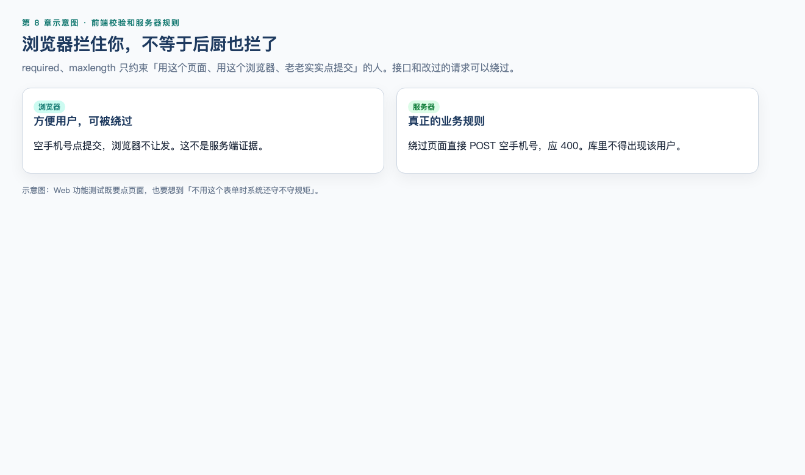
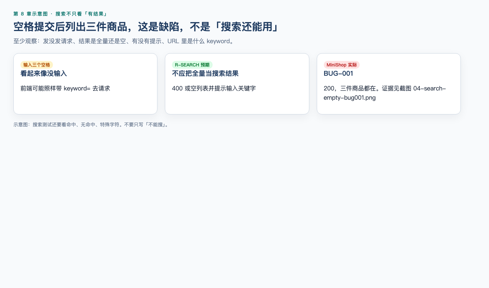

# 第 8 章（上）：页面与表单测试

> **一句话核心：** 页面测试是在浏览器这条观察通道上执行判定。

> 重要级别：⭐⭐⭐ 必须掌握  
> 下一节：[08B 登录态、权限与兼容](08b-web-auth-permission.md)

## 这一章解决什么问题

首页能打开不等于功能测完。上半章先认对页面元素，再测表单、输入、链接、搜索、分页、上传、下载、注册与登录的页面行为。

Cookie / Session / Token 放到 08B。

## 学习目标

- 按控件角色而不是外观设计 Web 功能测试；
- 知道浏览器约束不等于服务端校验；
- 为搜索、分页、链接、上传、下载列出主要测试点；
- 测试注册、登录和退出，而不是只测登录成功。

## 前置知识

已完成第 7 章 Web 基础和第 6 章缺陷报告习惯。

## 场景导入：首页能打开，功能就算测完了吗？

能打开只证明文档请求可能成功。库存 10 改成 11、空搜索、空密码，都还没测。

本机可打开练习页：[`assets/07-html-lab.html`](assets/07-html-lab.html)（不连服务器）。v1.0 真页面见 `http://127.0.0.1:8765/`，截图 [`assets/01-login.png`](assets/01-login.png)。

## 8.1 Web 功能测试测什么 ⭐⭐⭐

Web 功能测试验证用户通过浏览器完成业务时，系统是否满足已确认规则。它通常是系统测试级别上的功能测试，常用黑盒技术，执行方式可以是手工或自动化。第 3 章的分类轴在这里仍然适用：不要把“Web 测试”理解成与功能测试、系统测试互斥的新类别。

一轮 MiniShop Web 功能测试至少要回答：

| 问题 | 例子 |
| --- | --- |
| 入口找得到吗？ | 搜索框、登录、加入购物车是否可见可用 |
| 正常路径通吗？ | 合法搜索、合法登录、合法修改购物车数量 |
| 空值和非法输入呢？ | 空搜索、超长词、错误验证码 |
| 状态变了还能对吗？ | 登录后、退出后、锁定后、商品下架后 |
| 数据一致吗？ | 列表、详情、购物车数量和小计 |
| 权限对吗？ | 未登录、用户 A、用户 B、后台入口 |
| 不同窗口和设备呢？ | 浏览器、视口宽度、刷新和后退 |

前端校验通过不等于功能正确。页面提示“成功”，还要看刷新后数据是否还在、换一个账号是否隔离、服务端是否同样拒绝非法值。第 7 章已经强调：页面现象不等于根因。本章继续强调：页面提示不等于业务结果。

---

## 8.2 页面元素：先认对对象 ⭐⭐⭐

先识别用户真正操作的是什么，再设计步骤。看起来像按钮的东西，可能是 `<button>`、链接、或只能点的 `<div>`。

| 对象 | 测试时要确认 | MiniShop 例子 |
| --- | --- | --- |
| 按钮 | 能否聚焦、单击、重复单击；禁用时是否仍可提交 | 加入购物车、提交订单 |
| 链接 | 跳转目标、新窗口、失效地址 | 商品标题进入详情 |
| 输入框 | 可输入、可粘贴、最大长度、清空 | 搜索词、手机号、数量 |
| 单选/复选 | 互斥或可多选是否符合规则 | 规格、协议勾选 |
| 下拉框 | 默认值、选项完整性、可搜索时的过滤 | 排序方式 |
| 图片 | 加载失败时的替代信息、点击热区 | 商品主图 |
| 提示文本 | 是否来自真实校验，会不会挡住操作 | 库存不足提示 |

观察建议：

- 用键盘 Tab 走一遍关键路径，确认能否到达搜索、登录和提交；
- 看控件是否有可见标签，不要只靠占位符（placeholder）当标签；
- 占位符不是已输入的值，刷新后也不应把它当成用户数据。

完整可访问性测试超出初级功能测试范围，但“找不到控件、键盘到不了、没有标签”已经足以影响功能，应作为缺陷提出。

---

## 8.3 表单测试 ⭐⭐⭐




表单把多个输入组织成一次提交。注册、登录、搜索、改地址、上传都可能是表单。

### 教学示例

下面是一个**完整、可独立打开**的教学页面，只用于观察标签、必填和浏览器约束，不是 MiniShop 正式登录实现。

```html
<!DOCTYPE html>
<html lang="zh-CN">
<head>
  <meta charset="utf-8">
  <title>MiniShop 教学登录表单</title>
  <style>
    body { font-family: sans-serif; max-width: 420px; margin: 2rem auto; }
    label { display: block; margin-top: 1rem; }
    input { width: 100%; box-sizing: border-box; padding: 8px; }
    button { margin-top: 1rem; }
    .hint { color: #57606a; font-size: 0.9rem; }
  </style>
</head>
<body>
  <h1>教学登录表单</h1>
  <p class="hint">仅用于观察标签、必填和客户端约束。</p>
  <form id="login-form" action="#" method="post">
    <label for="phone">手机号</label>
    <input id="phone" name="phone" type="text" required maxlength="11" autocomplete="username">
    <label for="password">密码</label>
    <input id="password" name="password" type="password" required minlength="8" maxlength="20" autocomplete="current-password">
    <button type="submit">登录</button>
  </form>
  <p id="result" hidden>已触发提交（教学页面不会真正登录）。</p>
  <script>
    document.getElementById("login-form").addEventListener("submit", function (event) {
      event.preventDefault();
      document.getElementById("result").hidden = false;
    });
  </script>
</body>
</html>
```

`required`、`minlength`、`maxlength` 属于浏览器约束验证。用户可能通过开发者工具、禁用脚本或直接调用接口绕过它们。因此：

- 客户端有提示，只说明页面做了第一层拦截；
- 非法值是否真正被拒绝，要看服务端规则；
- 测试计划里应同时包含“界面拦截”和“绕过界面后的结果”，后者可在第 9、10、13 章用请求观察，本章先建立这个意识。

`method="post"` 只表示这个教学表单把数据放在请求体里提交。不要由此推出“POST 一定安全、GET 一定不安全”。请求方法的语义在第 9 章展开。

### 表单检查清单

| 检查点 | 问什么 |
| --- | --- |
| 必填 | 空提交时，哪些字段被拦截，提示是否指向具体字段 |
| 可选 | 不填可选字段仍能成功 |
| 默认值 | 默认值是否符合需求，会不会被误当成用户输入 |
| 重置/清空 | 是否只清输入、不清业务数据 |
| 重复提交 | 连续点击提交会不会创建两个账号或两笔订单 |
| 成功路径 | 跳转、提示、会话和数据是否一致 |
| 失败路径 | 原输入是否保留（密码通常应清空或按需求处理） |
| 刷新 | 成功页刷新会不会重复提交 |

---

## 8.4 输入框测试 ⭐⭐⭐

输入框是 Web 功能缺陷的高发区。第 5 章的等价类、边界值和错误推测在这里直接使用。

以 MiniShop 搜索框和数量框为例，至少覆盖：

| 类型 | 搜索框例子 | 数量框例子 |
| --- | --- | --- |
| 空值 | 不输入直接搜索 | 清空数量后保存 |
| 空白 | 若干空格、Tab | 只输入空格 |
| 合法值 | 已有商品关键词 | 1 到可售库存之间的整数 |
| 边界 | 1 个字符、需求允许的最大长度 | 1、库存、库存+1 |
| 非法类型 | 特殊字符、表情 | 小数、负数、字母 |
| 前后空格 | ` 鼠标 ` | 复制带空格的数字 |
| 粘贴 | 从别处粘贴超长文本 | 粘贴 `11` |
| 快速编辑 | 连续删除再输入 | 连续点击加号 |

沿用第 4、6 章的教学规则：数量必须是正整数，且不得超过提交时可售库存。这仍是教学规则，不是正式 PRD 冻结。

预期不能只写“不能输入”。要写清：

- 界面是否允许键入；
- 提交时是否拒绝；
- 拒绝后显示值是否回到合法值；
- 提示是否可理解。

有的输入框在界面上按键被拦住，有的允许输入但提交失败。两种都可能符合需求，但测试记录必须写实际行为，不能把“我打不进去”和“提交被拒绝”混成一句。

---

## 8.5 链接测试 ⭐⭐⭐

链接把站点串起来。失效链接会把完整流程切断。

检查：

- 当前页可见的主导航、页脚、面包屑、商品卡片标题；
- 跳转是否到达预期页面，而不是只看“点了有反应”；
- 在新标签打开时，原页面是否保持；
- 页面内锚点（URL 的 fragment）是否滚到对应位置；第 7 章已说明 fragment 通常不发给服务器；
- 空链接、`javascript:void(0)`、指向 404 或错误环境的地址；
- 需要登录才能访问的链接，未登录时是跳登录页还是直接报错。

不要对未授权的第三方网站做大规模爬取或破坏性点击。MiniShop 范围内逐条检查主导航和主流程链接即可。

---

## 8.6 搜索测试 ⭐⭐⭐




搜索同时涉及输入、结果列表、空态和 URL。第 7 章的示例地址已经出现过查询参数：

```text
https://shop.example.test:8443/products?keyword=mouse&page=2
```

这是教学 URL，不代表 MiniShop 已冻结正式路由。

| 测试点 | 为什么要测 |
| --- | --- |
| 空搜索 | 是搜全部、提示必填，还是无结果 |
| 只有空格 | 常被当成有输入，结果却不可理解 |
| 精确匹配 / 部分匹配 | 需求未写清时先记录实际行为并提评审 |
| 无结果 | 必须有明确空态，不能无限转圈 |
| 特殊字符 | 结果页应作为文本显示，而不是把输入当脚本执行 |
| 大小写与中英文 | 按需求，不要假设一定忽略大小写 |
| URL 与页面一致 | 搜索词应能从地址栏复现；刷新后结果不应无故丢失 |
| 搜索后的分页 | 翻页不应丢掉关键词 |

特殊字符检查只观察 MiniShop 是否正确显示和过滤，例如输入 `<script>` 后页面应显示转义文本或无结果，而不是执行脚本。不要对外部站点做注入攻击。

---

## 8.7 分页测试 ⭐⭐⭐

分页把长列表拆成多页。缺陷常出现在最后一页、非法页码和筛选条件丢失。

| 测试点 | 例子 |
| --- | --- |
| 第一页 | 上一页应不可用或保持第一页 |
| 中间页 | `page=2` 与页面内容、页码高亮一致 |
| 最后一页 | 剩余条数可以少于每页条数 |
| 超出范围 | `page=0`、`page=-1`、`page=99999` |
| 每页条数 | 若可切换，总数、页数和当前页要重算 |
| 条件组合 | 搜索后再翻页，关键词应保持 |
| 数据变化 | 删除或下架后，原最后一页不应静默空白而不说明 |
| 直接改 URL | 用户可以手动改查询参数，服务端仍应给出合理响应 |

不要把“空白页”当成通过。应判断：是无数据的合法空态，还是未处理的非法页码。

---

## 8.8 上传测试 ⭐⭐

上传出现在头像、售后凭证、商品图等场景。MiniShop 若尚未提供上传入口，可用授权练习页完成同类检查，不要对任意网站上传文件。

| 检查点 | 说明 |
| --- | --- |
| 类型 | 需求允许的扩展名；也要关注实际文件内容是否被检查 |
| 大小 | 0 字节、刚好上限、超过上限 |
| 空文件 / 未选择 | 提示是否明确 |
| 文件名 | 超长、空格、中文、特殊字符 |
| 替换与取消 | 选错后能否重选，取消后是否仍提交旧文件 |
| 进度与失败 | 网络中断或服务失败时的提示 |
| 权限 | 未登录或无权限用户不能上传成功 |
| 结果 | 上传成功后，页面展示与再次进入是否仍在 |

不要上传恶意软件样本到未授权系统。类型绕过（把不允许的文件改扩展名）只允许在自己的测试环境观察系统是否只看扩展名。

---

## 8.9 下载测试 ⭐⭐

下载常见于导出订单、发票、模板文件。若 MiniShop 暂无下载，先掌握检查方法。

| 检查点 | 说明 |
| --- | --- |
| 权限 | 未登录、他人数据、普通用户导出管理报表 |
| 内容 | 下载文件与页面筛选条件一致 |
| 文件名 | 可读、编码正确，不要全是乱码 |
| 类型 | 扩展名与实际内容匹配 |
| 空数据 | 无订单时是空文件、提示还是报错 |
| 中断 | 能再次下载；不要求本章做专业断点续传工具测试 |

下载到本地的测试数据同样可能含账号或地址，注意不要把真实隐私文件发到缺陷单或聊天工具。第 6 章的脱敏要求在这里继续有效。

---

## 8.10 注册与登录功能测试 ⭐⭐⭐

第 4 章给出的注册、登录需求仍是待评审草案，第 5 章的手机号 11 位数字、登录正常/锁定/禁用是教学模型。本章用它们练习 Web 功能测试，**不把阈值、提示文案和跳转写成 MiniShop 正式规则。**

### 注册

在草案范围内，优先检查：

- 必填项为空；
- 手机号长度和字符（按当前教学规则或已确认规则）；
- 重复注册；
- 验证码错误、过期、重复使用——规则未确认就记实际行为并提问题，不擅自规定秒数；
- 密码可见性切换是否只影响显示，不改变提交值；
- 连续点击注册是否只创建一个账号；
- 成功后是自动登录还是回到登录页。

### 登录

- 正确账号密码；
- 账号不存在、密码错误的提示是否符合需求（有的系统故意使用同一提示）；
- 空值、前后空格；
- 教学模型中的锁定、禁用状态；
- 登录成功后的落地页：首页还是登录前想去的页面；
- 已登录用户再打开登录页：保持登录、重定向还是允许再登。

### 退出

退出是登录测试的一部分，常常被漏掉：

- 退出后访问购物车、订单或账号页应被拒绝或跳到登录；
- 浏览器后退不应把已退出用户重新带进需登录的业务操作；
- 多标签页中一处退出后，另一处继续提交应失败或要求重新登录，具体以需求为准，但必须测。

把这些结果写成用例时，沿用第 5 章字段；发现失效时，沿用第 6 章缺陷报告，写清浏览器、是否隐私窗口、账号角色和版本。

---


## MiniShop 工作实战（上）

对照 [`assets/01-login.png`](assets/01-login.png)、[`assets/02-login-fail.png`](assets/02-login-fail.png)、[`assets/04-search-empty-bug001.png`](assets/04-search-empty-bug001.png)、[`assets/05-cart-qty-11.png`](assets/05-cart-qty-11.png)：

1. 登录表单有 label 和 `type=password`；
2. 错误密码页面提示「登录失败」；
3. 空白搜索仍列出三件商品（BUG-001）；
4. qty=11 提示 `qty exceeds stock`，购物车行仍是 10。

完整 Web 测试包模板见 08B。

## 小练习

### 练习 2

教学登录表单设置了 `required` 和 `maxlength="11"`。这能否证明服务端也会拒绝空手机号和超长手机号？为什么？

### 练习 3

MiniShop 搜索只输入空格。列出至少四个应观察的结果，不能只写“不能搜”。

### 练习 4

地址 `https://shop.example.test/products?keyword=mouse&page=99999` 打开后是空白。是否一定是缺陷？你还要补充哪些观察？

### 练习 5

把标题改得可执行：`上传有问题`。场景是：选择 0 字节的 `.png` 后提示成功，但头像仍是默认图。

### 练习 10

根据教学规则，为“库存 10 的商品，在购物车把数量改为 11”写出 Web 功能测试步骤、预期，以及若页面显示 11 时的缺陷标题。不要虚构接口路径。


## 练习答案

2. 不能。这些属性是浏览器约束，可被绕过。服务端是否拒绝要以绕过页面或观察实际保存结果为准。

3. 示例：是否发起搜索；结果是全部商品、空列表还是报错；有无“无结果/请输入”提示；URL 是否出现只有空格的关键词；刷新后是否保持。答出其中四个合理观察即可。

4. 不一定。可能是无数据的合法空态，也可能是未处理非法页码。应观察：总页数、是否有提示、改回 `page=2` 是否恢复、搜索关键词是否还在、控制台/响应是否报错（详细定位留到第 10 章）。没有说明的空白通常应提缺陷或需求问题。

5. 示例：头像上传选择 0 字节 PNG 时提示成功，但重新进入页面仍显示默认头像。

10. 步骤示例：登录测试账号；打开购物车；确认 SKU 教学商品库存显示 10、当前数量 1；把数量改为 11 并提交。预期：提交失败，数量保持合法值，出现超限或库存不足提示。v1.0 没有小计/价格，不要把小计写进 MiniShop 预期。缺陷标题示例：购物车在库存为 10 时可将数量修改为 11 且无失败提示。

---


## 本章检查清单

- [ ] 我能按控件角色设计用例
- [ ] 我知道浏览器约束不等于服务端校验
- [ ] 我能为搜索、分页、上传列出测试点
- [ ] 我能测试注册、登录和退出

## 本章可运行性说明

练习页 [`assets/07-html-lab.html`](assets/07-html-lab.html) 不连服务器。v1.0 截图来自本机 Chrome。

## 参考资料

- [08B](08b-web-auth-permission.md)
- WHATWG HTML Forms

## 下一章预告

[第 8 章（下）：登录态、权限与兼容](08b-web-auth-permission.md)
