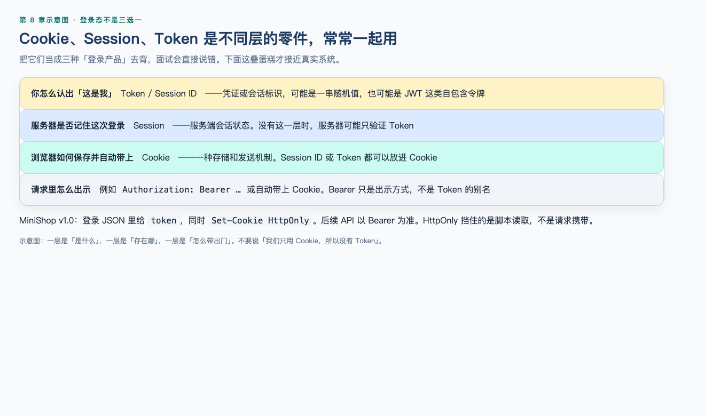
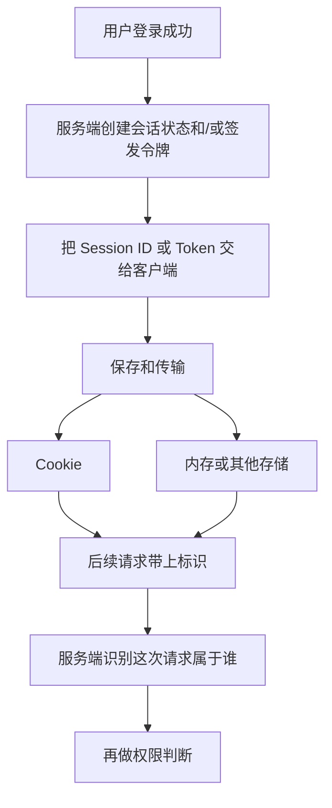
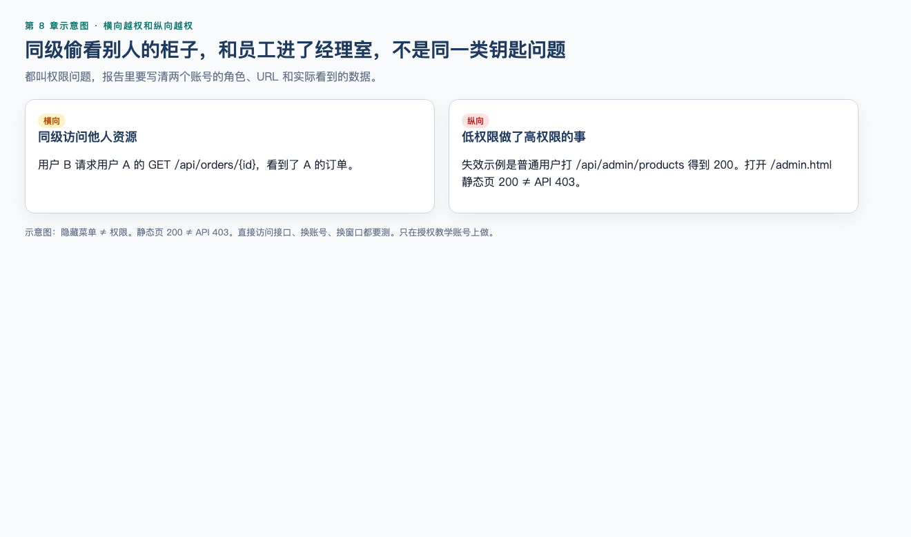
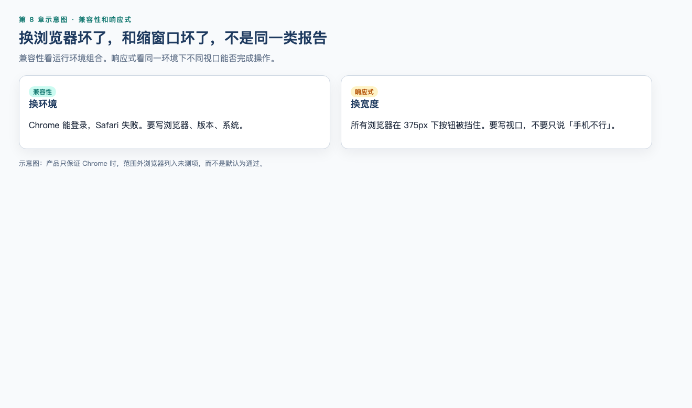

# 第 8 章（下）：登录态、权限与兼容

> **一句话核心：** Cookie、Session、Token 不是三种可互换的登录产品。

> 重要级别：⭐⭐⭐ 必须掌握  
> 上一节：[08A 页面与表单](08a-web-page-testing.md)

## 这一章解决什么问题

页面元素测完后，还要解释登录态怎么保存、权限怎么绕，以及兼容性和响应式。

## 学习目标

- 用层次模型解释 Cookie、Session、Session ID、Token；
- 说明 Bearer Token 是出示方式，不是 JWT 的别名；
- 知道 `HttpOnly` 只阻止脚本读取 Cookie；
- 设计未登录、换账号、直接访问 URL 的权限用例；
- 区分横向/纵向越权，以及兼容性与响应式。

## 前置知识

已完成 08A。

## 场景导入

用户 A 把购物车 URL 发给已登录的用户 B，B 看到了 A 的商品。这不是“链接坏了”，是权限问题。

## 8.11 Cookie、Session、Session ID 和 Token 不是三种替代技术 ⭐⭐⭐

这是本章最容易考错、也最容易在工作中说错的一组概念。正确说法是：**它们处于不同层次，常常配合使用，而不是三选一的登录方案。**





| 概念 | 层次 | 它是什么 | 常见误解 |
| --- | --- | --- | --- |
| Cookie | HTTP 状态管理机制 | 服务器通过 `Set-Cookie` 让浏览器保存的小段数据；符合条件时浏览器在后续请求中用 `Cookie` 头自动带上 | 把 Cookie 当成“登录”的同义词 |
| Session | 应用会话状态 | 服务端把多次请求识别为同一次访问或同一用户的状态，通常保存在服务端 | 以为 Session 是 Cookie 的另一种名字 |
| Session ID | 会话标识 | 用来找到那份 Session 的标识符 | 以为必须显示在页面上 |
| Token | 凭证或声明 | 一串用于证明身份或授权的数据，可以是随机不透明串，也可以是 JWT 这类有结构的格式 | 以为 Token 特指 JWT，或以为它是第三种登录产品 |
| Bearer Token | 出示 Token 的一种方式 | 在请求中声明“持有这个令牌的人被允许访问”，常见写法是 `Authorization: Bearer <token>` | 以为 Bearer 等于 Session，或等于 Cookie |

### Cookie

Cookie 解决的是：HTTP 请求本身不自动记住你是谁，浏览器可以用 Cookie 在后续请求中带上服务器之前给过的数据。

测试时只需要掌握这些属性的**行为影响**，不必背完整规范：

| 属性 | 对测试的意义 |
| --- | --- |
| 名称和值 | 值里不应出现明文密码；教学环境也不要把真实密码写成 Cookie 示例 |
| `Expires` / `Max-Age` | 过期后浏览器不应再带上该 Cookie |
| `Secure` | 只在 HTTPS（以及部分 localhost 情况）发送；Safari 对 localhost 例外的支持可能不同 |
| `HttpOnly` | JavaScript 的 `document.cookie` 读不到它；登录会话类 Cookie 常见此属性。它**不**阻止浏览器在后续请求里自动带上该 Cookie，脚本发起的同站请求通常仍会带上 |
| `SameSite` | 控制跨站请求是否带 Cookie。未设置时，现代浏览器通常按 `Lax` 处理；`None` 必须同时有 `Secure` |
| `Path` / `Domain` | 决定哪些路径或主机名会带上它 |

Cookie 会由浏览器在符合条件时自动附带，这与 CSRF（跨站请求伪造）风险相关。`SameSite=Lax`（现代浏览器对未设置 SameSite 的常见默认）会挡住大多数跨站 **POST**，购物车修改这类写操作通常因此带不上 Cookie；顶层跨站 **GET** 导航、`SameSite=None; Secure`、或旧浏览器仍可能带上登录态。`SameSite` 和额外的 CSRF 令牌都是常见缓解手段，不是本章要演练的攻击。测试时若在授权环境发现跨站请求仍能改购物车，应记录实际的方法、`SameSite` 值和是否带上 Cookie，而不是对外部系统做攻击实验。

当前浏览器还可能限制第三方 Cookie。如果 MiniShop 把登录放在跨站 iframe 里，功能失败不一定是账号密码错误。本章不展开分区 Cookie（CHIPS）细节。

观察 Cookie 的具体面板在第 10 章用 DevTools。本章先建立判断：

- 登录后，浏览器里**可能**出现会话相关 Cookie；
- 找不到 `document.cookie` 里的值，不代表没有 Cookie，它可能是 `HttpOnly`；
- Cookie 还在，不代表服务端会话一定有效。最终仍以访问受保护功能的结果为准。

### Session 与 Session ID

Session 是服务端的会话状态：购物车未登录暂存、登录身份、验证码尝试次数都可能放在会话里。Session ID 是打开这份状态的钥匙。

钥匙常常放在 Cookie 里，例如很多系统用 Cookie 保存 Session ID。这是 **Cookie 承载 Session ID**，不是“用了 Cookie 就没有 Session”，也不是“用了 Session 就不用 Cookie”。

Session ID 也可能出现在 URL 里。这会增加泄露风险（日志、Referer、分享链接）。若在 MiniShop 测试中发现登录后 URL 带有很长的会话标识，应作为风险记录，而不是当成正常装饰参数忽略。

测试关注：

- 登录成功后，同一浏览器继续访问需登录功能应识别为同一用户；
- 退出后，原 Session 应失效；只清页面、不清会话，是常见缺陷；
- 换一个浏览器或隐私窗口，不应自动继承上一次登录，除非需求明确允许且有对应机制。

### Token

Token 是凭证。服务端可以签发 Token，客户端在后续请求中出示它。JWT 只是 Token 的一种编码格式，不是 Token 的定义。

Token 可以：

- 放在 Cookie 里由浏览器自动携带；
- 放在内存里，由前端加到请求头；
- 放在 `localStorage` / `sessionStorage` 等 Web Storage 里。

Web Storage **不会**像 Cookie 那样自动随每次 HTTP 请求发送。`sessionStorage` 也不是服务端 Session：它只是标签页级别的浏览器存储，名字容易混淆。放在 Web Storage 里的 Token 通常能被页面脚本读取，XSS 风险与 `HttpOnly` Cookie 不同。不要根据“看起来更现代”判断哪种一定更安全。

因此不能说“我们不用 Session，改用 Token，所以没有登录态”。用 Token 的系统仍然有登录态，只是识别方式变成校验 Token。

### 它们如何配合

现实系统常见组合：

- Cookie 里保存 Session ID，服务端查 Session；
- Cookie 里保存 Token；
- 页面用 Cookie，接口用 `Authorization: Bearer`；
- 同时存在 CSRF 防护 Cookie 和认证 Cookie。

所以面试若问“Cookie、Session、Token 有什么区别”，不要答“三种登录方式，现在都用 Token”。应答：层次不同，Cookie 管如何保存和发送，Session 管服务端会话，Token 管凭证，Bearer 管如何出示 Token。

---

## 8.12 Bearer Token ⭐⭐⭐

Bearer Token 来自 HTTP 认证实践（RFC 6750）。核心含义是：**谁持有这个令牌，谁就可以用它访问被允许的资源。** 它通常放在请求头：

```text
Authorization: Bearer <token>
```

这是教学示意，不是 MiniShop 已冻结的接口约定。第 9 章再看真实请求头；第 13、14 章再在接口工具里使用。

对 Web 功能测试的意义：

- 浏览器页面登录成功后，后续接口调用可能自动带 Cookie，也可能由页面脚本加上 Bearer Token；
- 复制别人的 Bearer Token 就等于复制了那份访问资格，所以缺陷单、截图、日志里要脱敏；
- Token 过期、登出作废、权限变更后旧 Token 是否立即失效，属于登录态和权限测试，而不是“页面按钮还在不在”。

不要把 Bearer Token、JWT、OAuth、Cookie 说成同一个东西。OAuth 2.0 是授权框架，JWT 是令牌格式，Bearer 是出示方式，Cookie 是浏览器存储和发送机制。

---

## 8.13 登录态怎样测 ⭐⭐⭐

登录态测试验证系统能否持续、正确地识别“当前请求是谁”。

最小集合：

| 场景 | 预期方向 |
| --- | --- |
| 未登录访问需登录页 | 拒绝或跳转到登录，且不应泄露他人数据 |
| 登录后访问 | 识别为当前用户，看到自己的购物车 |
| 退出后访问 | 不能继续完成需登录的写操作 |
| 隐私窗口打开同一 URL | 不继承原窗口登录态 |
| 过期后操作 | 提示重新登录，而不是半成功半失败 |
| 后退/前进 | 不把已退出用户当成仍可结算 |
| 多标签 | 一处退出后，另一处提交的结果符合需求 |

判断登录态，不要只看页面右上角头像。应尝试一个真正需要身份的操作，例如查看账号信息或修改自己的购物车。头像还在但提交失败，或头像没了却仍能改他人数据，都是缺陷。

Cookie 被删除、被改坏或过期后，功能应回到未登录或友好错误，而不应 500 且把堆栈显示给用户。具体状态码等到第 9 章再精确阅读。

---

## 8.14 权限测试 ⭐⭐⭐




权限测试回答：当前身份允许做什么。第 3 章已要求未登录不能看订单、普通用户不能进后台、用户不能读他人订单。本章把它变成可执行步骤。

| 类型 | 含义 | MiniShop 例子 |
| --- | --- | --- |
| 未认证 | 没有有效登录态 | 直接打开购物车、账号页 |
| 横向越权 | 同级用户访问他人资源 | 用户 A 把标识改成用户 B 的购物车或订单入口 |
| 纵向越权 | 低权限访问高权限功能 | 普通用户打开后台管理入口 |
| 认证后权限变化 | 禁用、锁定、角色变更后旧登录态 | 管理员禁用账号后，原窗口继续提交 |

步骤建议：

1. 用账号 A 登录，打开只属于 A 的页面，复制 URL；
2. 退出，或换隐私窗口用账号 B 登录；
3. 粘贴 A 的 URL；
4. 预期：拒绝、404 或无权限提示，且响应中不应出现 A 的地址、电话等数据。

只在授权环境使用自己创建的测试账号。不要对生产用户或外部系统猜测他人 ID。

页面隐藏按钮不等于没有权限。后台入口可能被 CSS 隐藏，但直接访问 URL 仍能打开。功能测试必须测直接访问，而不是只测菜单里看不看得见。

---

## 8.15 兼容性测试 ⭐⭐




第 3 章已经说明：兼容性覆盖浏览器、操作系统、设备，以及与其他组件的共存；不能说“测了 Chrome、Firefox、Edge 就覆盖了兼容性”。

本章补上怎么做最小矩阵：

1. 先问用户主要用什么：来自产品说明、访问统计或合同，而不是测试人员个人偏好；
2. 列出浏览器 × 操作系统 × 视口的优先级，P0 覆盖最常见组合；
3. 同一条主流程（登录、搜索、加购）在矩阵里各跑一遍；
4. 记录具体版本，例如“Chrome 当前稳定版 / macOS”，不要只写“Chrome 没问题”。

常见差异：

- 日期控件、下拉框、文件选择在不同浏览器上的表现；
- Safari 对 Cookie、第三方存储的限制更严；
- 旧浏览器不支持某些页面脚本，表现为按钮无反应。

弱网不是兼容性的同义词。它可以作为额外条件，但主分类仍按第 3 章：性能、可靠性或移动场景。

没有用户数据时，课程练习至少覆盖一种 Chromium 浏览器和一种移动视口宽度，并在测试计划里写明未覆盖项。

---

## 8.16 响应式测试 ⭐⭐

响应式关注同一站点在不同视口宽度、高度下的布局和可操作性。它和兼容性相关，但不是一回事：

- 兼容性：换浏览器、操作系统、设备后功能是否可用；
- 响应式：换窗口宽度后，关键操作是否仍能完成。

MiniShop 商品列表可以检查：

| 视口 | 关注点 |
| --- | --- |
| 宽窗口（如 1280px） | 列表、筛选、加购不被遮挡 |
| 中等窗口 | 布局变化后搜索框仍在 |
| 窄窗口（如 375px） | 导航是否可展开，按钮是否点得到，文字是否互相覆盖 |

只缩窗口不够，还要真正完成一次搜索或加购。布局没错位但按钮被挡住，仍是功能失败。

不要把响应式测试写成“在手机浏览器里点一点就行”。手机浏览器同时涉及兼容性和响应式。报告里应分开写：是 Safari 特有问题，还是 375px 宽度下所有浏览器都会挡住按钮。

---

## 8.17 把 Web 失效写成缺陷 ⭐⭐⭐

Web 功能问题仍用第 6 章的报告结构。本章多出来的字段往往是：

- 浏览器和版本；
- 窗口宽度；
- 是否隐私窗口、是否多标签；
- 账号角色；
- 完整 URL（可含查询参数，不要含密码、Token 明文）；
- 刷新前后是否变化。

差标题：`搜索有问题`。  
更好：`商品搜索仅输入空格时一直显示加载，无结果也无错误提示`。

不要在标题里写“肯定是前端 Cookie 没清”。先写失效，再在备注里给假设。

---


配套可运行实操：[实操 8-1 权限](../practice/08-privilege/README.md)（`python3 practice/run.py 8-1`）。页面藏按钮不算测过权限。章内工作实战仍要交 Web 功能测试包。

## MiniShop 工作实战：Web 功能测试包

若 MiniShop 应用尚未运行，可对授权练习站点执行同样结构，但必须在报告中写明对象，且不得把第三方站点当攻击目标。测正在跑的 MiniShop v1.0 时，购物车规则以 PRD `R-CART-10` 为准（`qty=10` 允许、`qty=11` 拒绝）；第 4、6 章教学草案里的验证码/小计不是本项目契约。

请提交：

1. 功能范围和未测项；
2. 注册/登录/搜索/分页/购物车/权限测试点表；
3. 至少 8 条可执行用例，覆盖正常、空值/边界、登录态、权限中的至少三类；
4. 至少 1 条按第 6 章格式书写的缺陷报告，或“未发现问题”的证据说明；
5. 最小兼容与响应式记录。

建议保存为：

```text
exercises/chapter-08-minishop-web-functional.md
```

```markdown
# MiniShop Web 功能测试包

## 对象与环境
- 站点：
- 版本/构建：
- 浏览器及版本：
- 视口宽度：
- 账号角色：
- 日期：

## 范围
- 范围内：
- 范围外：

## 测试点
| ID | 模块 | 场景 | 检查点 | 依据 | 优先级 |

## 用例结果
| 用例 ID | 标题 | 结果 | 缺陷 ID | 备注 |

## 登录态与权限
| 场景 | 步骤摘要 | 结果 | 证据 |

## 兼容与响应式
| 组合 | 主流程结果 | 问题 |

## 缺陷或无缺陷说明
```

完成标准：

- 测试点覆盖搜索、分页、登录/退出、权限中的至少四类；
- 至少有一条未登录或换账号后的权限用例；
- 至少有一条空值或非法输入用例；
- 用例步骤可执行，预期可观察；
- 缺陷标题含对象、条件和实际结果，或明确写清已测范围且未发现失效；
- 不虚构尚未基线化的接口路径、订单状态或 Token 字段名；
- 不在报告中粘贴密码或完整 Token。

## 常见错误

### 错误 1：Cookie、Session、Token 是三种可互换的登录产品

修正：它们层次不同，常常配合使用。Cookie 是浏览器保存并可能自动发送的机制；Session 是服务端会话状态；Token 是凭证。Session ID 或 Token 都可以放进 Cookie。

### 错误 2：`HttpOnly` 能阻止请求携带 Cookie

修正：`HttpOnly` 只阻止脚本读取 Cookie。浏览器仍会在后续请求里自动带上它。MiniShop 登录同时下发 JSON `token` 和 HttpOnly Cookie。

### 错误 3：页面藏掉后台按钮，就算测过权限

修正：权限以服务器判定为准。直接访问 URL 或打 `/api/admin/*`，普通用户应 403。见实操 8-1。

### 错误 4：Bearer Token 就是 JWT，有 Token 就不再用 Cookie

修正：Bearer 是出示方式，不是某一种令牌格式。系统可以同时用 Cookie 和 Token。

### 错误 5：产品说“只保证 Chrome”，其他浏览器没测也算通过

修正：计划写明 P0 组合；范围外列入未测项和剩余风险，不要默认为通过。兼容性和响应式也要分开写。

## 面试角度 ⭐⭐⭐

### 为什么不能说 Cookie、Session、Token 是三种登录方式？

结论：层次不同，常配合使用，不是三选一产品。  
原理：Cookie 管怎么存和带；Session 管服务端状态；Token 管出示什么凭证。  
示例：MiniShop 登录 200 同时给 JSON `token` 和 `Set-Cookie: HttpOnly`。后续接口以 `Authorization: Bearer` 为准。  
边界：不要把 `sessionStorage` 说成服务端 Session。

### 横向越权和纵向越权有什么区别？

结论：横向是同级访问他人资源；纵向是低权限做高权限的事。  
示例：用户 B 读用户 A 的订单应 403；普通用户打 `/api/admin/products` 应 403。  
边界：只在授权测试账号上复现；报告写两个角色和脱敏 URL。

### HttpOnly 的边界是什么？

结论：脚本读不到这条 Cookie，请求仍可能带上它。  
场景：XSS 不容易偷到 HttpOnly Cookie，但 CSRF 和服务端鉴权仍要另测。  
边界：前端把 token 放进 `sessionStorage` 时，脚本仍可读；这和 HttpOnly Cookie 不是同一层。

## 小练习

### 练习 1

为什么不能说“Cookie、Session、Token 是三种登录方式”？用一层一句话说明它们各是什么。

### 练习 6

用户 A 登录后复制自己的购物车 URL，发给已登录的用户 B。B 打开后能看到 A 的商品。这属于哪类权限问题？缺陷报告至少还要写哪些上下文？

### 练习 7

退出登录后，浏览器点后退又能看到刚才的账号页。是否足以关闭为“已退出”？还应做什么？

### 练习 8

下面哪句正确？

A. Bearer Token 就是 Session  
B. `sessionStorage` 就是服务端 Session  
C. Cookie 可以用来保存 Session ID 或 Token  
D. 有 Token 的系统一定不再使用 Cookie

### 练习 9

产品说“我们只保证 Chrome”。测试计划应如何写兼容性和响应式范围？未覆盖项怎么处理？


## 练习答案

1. 因为它们层次不同，常配合使用。Cookie：浏览器保存并可能自动发送的数据机制。Session：服务端会话状态。Token：身份或授权凭证。Session ID 常放在 Cookie 里，不能把三者当成三选一产品。

6. 横向越权（同级访问他人资源）。报告还应包含两个账号角色、完整 URL（脱敏）、浏览器、是否隐私窗口、实际看到的他人数据范围。只在授权测试账号上复现。

7. 不足以。后退看到的可能是缓存页面。应再尝试修改资料或购物车等写操作，并在新窗口访问同一需登录 URL。若只是缓存展示但提交失败，按需求判断是否可接受，并写清实际行为。

8. C。A、B、D 把不同层次的概念等同或绝对化。

9. 计划应写明：P0 浏览器/系统组合来自产品声明；响应式至少覆盖约定的窄/中/宽视口；范围外（如 Safari、旧版 Edge）列入未测项和剩余风险，而不是默认为通过。


## 本章检查清单

- [ ] 我能画出 Cookie / Session / Token 层次
- [ ] 我能说明 HttpOnly 的边界
- [ ] 我能设计越权用例
- [ ] 我能区分兼容性和响应式

## 本章总结

Cookie、Session、Token 不是三种可互换产品。权限看服务器判定，不看按钮在不在。兼容性写范围，响应式写视口，未测项必须显式留下。

## 本章可运行性说明

Cookie/Session/Token 层次为教学模型。v1.0 登录同时下发 token 与 HttpOnly Cookie，见 `evidence/http/01-login-ok.txt`。

## 参考资料

- [08A](08a-web-page-testing.md)
- RFC 6750 Bearer Token

## 下一章预告

第 9 章《计算机网络与 HTTP》。学完第 10 章后做 [阶段测验 3](quizzes/stage-3-web.md)。
