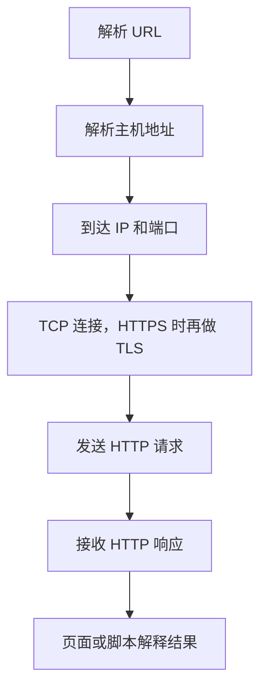
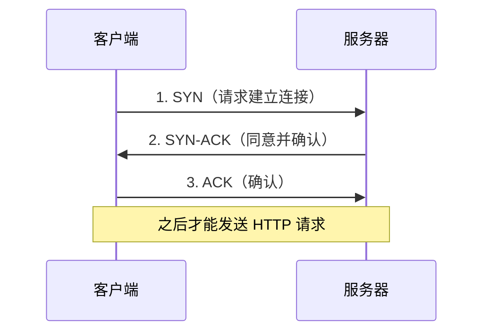
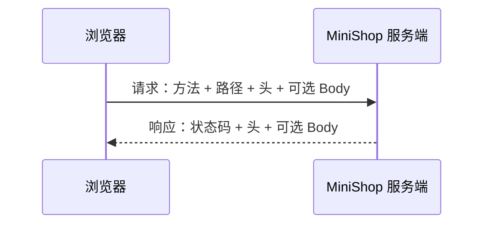

# 第 9 章：计算机网络与 HTTP

> 重要级别：⭐⭐⭐ 必须掌握  
> 主案例：MiniShop 个人软件测试实践项目

## 这一章解决什么问题

第 8 章已经能在页面上测登录、搜索和权限。页面提示“登录失败”时，问题可能出在浏览器、网络、TLS、HTTP 请求、服务端规则或前端展示。如果不会看请求和响应，就只能猜测“是前端还是后端”。

本章给测试工程师一张够用的网络地图：IP 和端口把请求送到哪；TCP/UDP 如何传输；HTTP 请求和响应里有什么；GET/POST 的真正语义是什么。

本章不把 GET 说成“不安全”、把 POST 说成“安全”。HTTP 里的安全方法（safe）指“语义上只读取”，不是机密性。机密性主要看 HTTPS/TLS。报文观察面板在第 10 章用 DevTools 展开；本章先读得懂报文。

## 学习目标

完成本章后，你应该能够：

- 说明 IP 与端口在访问 MiniShop 时各自做什么；
- 区分 TCP 与 UDP 的基本差异，并能用简化模型描述 TCP 三次握手；
- 解释 HTTP 与 HTTPS/TLS 的关系，以及证书问题对测试的影响；
- 拆解请求行、状态行、Header 和 Body；
- 按 RFC 9110 解释方法的安全（safe）与幂等（idempotent）；
- 正确比较 GET 与 POST：语义、query、body、缓存，而不是长度或“谁更安全”；
- 根据常见状态码选择下一步排查方向，而不是把 200 当成业务一定成功；
- 阅读一份教学用 MiniShop 登录请求，并指出身份信息出现在哪些位置；
- 完成一份 HTTP 观察记录。

## 前置知识

- 已按正式学习顺序完成第 1～8 章；
- 能拆解 URL 的 scheme、host、port、path、query；
- 知道 Cookie、Session、Token、Bearer Token 处于不同层次；
- 不要求编写服务端或掌握套接字编程。

## 场景导入：登录失败，问题在哪一层？

你在 MiniShop 测试环境打开登录页，输入指定测试账号后点击登录，页面显示“登录失败”。

只看页面，至少有这些可能：

- 浏览器根本没发出请求；
- 请求发到了错误的主机或端口；
- HTTPS 证书不被信任，连接在 HTTP 之前失败；
- 请求方法、路径或 `Content-Type` 不符合服务端预期；
- 账号密码在 Body 里，但服务端校验失败；
- 服务端返回了成功状态，前端把业务码理解错了；
- 登录成功了，但后续请求没有带上 Cookie 或 Token。

第 7 章的访问链路在这里要补上传输和 HTTP 这两层：



本章所有抓包、重放和登录尝试只允许针对 MiniShop 或明确授权的测试环境。不要对未授权系统重放别人的 Cookie 或 Token。

---

## 9.1 测试工程师要一张够用的网络地图 ⭐⭐⭐

面试有时会问 OSI 七层。那是教学分层模型，不是测试日常的操作清单。本课程优先使用这张够用的图：

| 你要定位的问题 | 更常落到 | MiniShop 例子 |
| --- | --- | --- |
| 访问的是哪台主机 | IP / DNS | `shop.example.test` 解析失败 |
| 访问的是哪个服务 | 端口 | `8443` 未开放，`443` 才是当前环境 |
| 连接是否建立、是否可靠交付 | TCP | 握手失败、连接被重置 |
| 实时或查询类短消息 | UDP | DNS 查询常见于 UDP |
| 资源怎么请求、结果是什么 | HTTP | 登录 POST、商品 GET |
| 传输是否被加密和认证 | TLS / HTTPS | 证书过期、混合内容 |

如果被问到七层模型，可以回答：它帮助讨论“问题大概在哪一层”，测试工作更常直接说 IP、端口、TCP、TLS 和 HTTP。不要把七层名称背诵当成已经会排查。

HTTP 本身通常被设计为无状态：每个请求单独理解。登录态是应用用 Cookie、Session 或 Token 加上去的，不是 TCP 或 HTTP 自动记住你。这和第 8 章一致。

---

## 9.2 IP 与端口 ⭐⭐⭐

### IP 地址

IP 地址用于在网络中定位主机（更准确说是网络接口）。浏览器通常先看到域名，真正发数据包时需要 IP。

测试时记住：

- 一个域名可能对应多个 IP；多个域名也可能指向同一 IP；
- 能 ping 通某个 IP，不代表该主机上的 MiniShop 服务可用；
- 本机回环地址 `127.0.0.1` 只代表当前机器，不能把它当成测试环境服务器；
- 文档和教材里的示例地址应使用保留示例网段，不要随手写一个公网 IP 当 MiniShop。

第 7 章已经说明 DNS 成功不等于应用健康。

### 端口

端口把同一台主机上的不同服务区分开。可以把它理解成“这栋楼的门牌号”：IP 是楼，端口是门。

| scheme | 常见默认端口 | 本章教学环境 |
| --- | --- | --- |
| `http` | 80 | 若 URL 省略端口，客户端通常用 80 |
| `https` | 443 | 若 URL 省略端口，客户端通常用 443 |
| 自定义 | 由部署决定 | 第 7 章示例用过 `8443` |

`https://shop.example.test:8443/products` 表示：用 HTTPS 访问主机 `shop.example.test` 上的 **8443** 端口。如果服务其实开在 443，你却访问 8443，页面打不开不一定是功能 Bug，而可能是环境或 URL 配错。

端口号范围是 0～65535。测试不需要背知名端口表，但要能从 URL 和缺陷报告里写出“访问了哪个端口”。

---

## 9.3 TCP 与 UDP ⭐⭐⭐

传输层常见两种协议：

| | TCP | UDP |
| --- | --- | --- |
| 连接 | 先建立连接再传数据 | 不先建立连接 |
| 可靠性 | 尽量保证顺序和到达，失败会重传 | 不保证到达和顺序 |
| 典型用途 | HTTP/1.1、HTTP/2、数据库连接 | DNS 查询、部分实时通信；HTTP/3 基于 QUIC，跑在 UDP 上 |
| 测试时的感觉 | 连接被拒绝、超时、重置 | 解析偶发失败、实时流卡顿 |

对初级 Web 测试，绝大多数页面请求仍建立在 TCP 之上（HTTP/1.1 或 HTTP/2）。看到“连接被拒绝”，优先核对 IP、端口、防火墙和服务是否启动，而不是先改登录密码。

HTTP/3 使用 QUIC（在 UDP 上）。本章不要求配置 HTTP/3。你只需要知道：浏览器地址栏看起来还是 `https://`，底层传输可能已经不是传统 TCP。排查时以实际抓到的协议为准。

---

## 9.4 TCP 三次握手 ⭐⭐⭐

TCP 在发送 HTTP 数据前，通常先完成三次握手，双方确认可以通信：



教学要点：

1. 握手成功只说明这一对 IP 和端口之间的 TCP 连接建立了，不说明登录业务成功；
2. 握手失败时，HTTP 请求还没发出，谈不上 401 或密码错误；
3. HTTPS 站点在 TCP 之后还要做 TLS 协商，证书问题常发生在这一段，而不是在 Body 里；
4. 真实 TCP 还有序号、窗口、半开连接和挥手结束。初级测试能把“连不上”和“已连接但业务失败”分开即可。

不要把三次握手背成“HTTP 的三步”。握手属于 TCP；HTTP 请求是连接建立之后的应用数据。

---

## 9.5 HTTP 是什么 ⭐⭐⭐

超文本传输协议（HTTP）是 Web 使用的应用层协议。客户端发出请求，服务器返回响应。RFC 9110 定义了 HTTP 的语义：方法、状态码、头字段和相关概念。

一次交换的最小模型：

```text
请求：我要对这个资源做什么，并带上必要的说明和数据
响应：结果如何，并带上说明和数据
```

HTTP/1.1 的请求在教学上可以看成：

```text
<方法> <请求目标> HTTP/1.1
<头字段名>: <值>
<空行>
<可选的消息体>
```

响应：

```text
HTTP/1.1 <状态码> <原因短语>
<头字段名>: <值>
<空行>
<可选的消息体>
```

HTTP/2 和 HTTP/3 在网上传输时不再是这种纯文本分行格式，但对测试工程师来说，方法、路径、状态码、Header、Body 这些语义仍然在。第 10 章的 Network 面板会把它们展示出来。

教学请求目标沿用第 7 章 URL，不代表 MiniShop 正式路由已冻结：

```text
GET /products?keyword=mouse&page=2 HTTP/1.1
Host: shop.example.test
```

`Host` 在 HTTP/1.1 中是必须的请求头，用来说明要访问哪一个主机。它和 URL 里的 host 对应，但出现在报文头里。

---

## 9.6 HTTPS 与 TLS ⭐⭐⭐

HTTPS 是“在 TLS 之上的 HTTP”。浏览器先与服务器完成 TLS，再发送 HTTP。TLS 的目标包括：

- 加密：传输内容不易被旁路窃听；
- 完整性：数据在路上被篡改应能被发现；
- 认证：客户端能验证自己连的是证书所声明的服务器（还可以做客户端证书，初级岗位较少直接配置）。

因此：

- **GET 不会因为改成 POST 就自动加密**；
- **POST 也不会因为有 Body 就自动保密**；
- 没有 TLS 的 HTTP 中，query 和 body 都可以被路径上的观察者看到。

测试中常见现象：

| 现象 | 更可能的方向 |
| --- | --- |
| 证书过期、域名不匹配、不受信任 | 环境证书、hosts、代理、时间 |
| 地址栏是 `https` 但图片或脚本是 `http` | 混合内容，部分资源被浏览器拦截 |
| 能访问 IP 不能用域名，或反过来 | 证书绑定的是域名；IP 访问可能校验失败 |
| 公司代理或抓包工具提示证书 | 中间人检查，需在授权前提下安装测试证书 |

不要把浏览器“继续访问不安全站点”当成测试通过。应记录证书警告，并确认是否符合当前测试环境约定。

TLS 还有版本和套件细节，本章不要求配置 OpenSSL。知道“HTTP 报文可以被 TLS 保护，保护的是整次交换，不是某一个方法”即可。

---

## 9.7 请求与响应 ⭐⭐⭐

把一次登录拆开看：



### 请求里通常有什么

| 部分 | 作用 | 登录场景例子 |
| --- | --- | --- |
| 方法 | 对资源的操作语义 | `POST` |
| 请求目标 | 路径和可能的 query | `/login` |
| Header | 补充说明 | `Host`、`Content-Type`、`Cookie` |
| Body | 消息体 | 表单或 JSON 中的手机号、密码 |

### 响应里通常有什么

| 部分 | 作用 | 登录场景例子 |
| --- | --- | --- |
| 状态码 | 协议级结果分类 | `200`、`401`、`302` |
| Header | 补充说明 | `Set-Cookie`、`Location`、`Content-Type` |
| Body | 消息体 | HTML 页面或 `{"message":"密码错误"}` |

测试时至少问四个问题：

1. 请求打到了哪个 Host、端口和路径？
2. 方法是不是服务端支持的那种？
3. 状态码和 Body 是否一致？
4. 后续请求是否带上了 Cookie 或 `Authorization`？

页面文案不能代替这四问。服务端可能返回 `200` 和 `{"success": false}`，页面再显示失败。

---

## 9.8 请求方法 ⭐⭐⭐

方法表示客户端**请求对目标资源做什么**。RFC 9110 为常见方法定义了两个重要性质：

| 性质 | 含义 | 不是什么 |
| --- | --- | --- |
| 安全（safe） | 语义上只读取，客户端不请求改变资源状态 | 不是“传输加密”或“不会泄露密码” |
| 幂等（idempotent） | 连续多次相同请求的**预期效果**与一次相同 | 不是“服务器不会写日志”，也不是“一定不会出错” |

RFC 9110 中的对照：

| 方法 | 安全 | 幂等 | 初级测试怎么用 |
| --- | --- | --- | --- |
| GET | 是 | 是 | 获取商品列表、详情、搜索结果 |
| HEAD | 是 | 是 | 只要头、不要 Body 时可能见到 |
| POST | 否 | 否 | 登录、下单、提交表单 |
| PUT | 否 | 是 | 用完整表示替换资源时可能见到 |
| DELETE | 否 | 是 | 删除地址或购物车条目时可能见到 |
| OPTIONS | 是 | 是 | 浏览器预检或探查允许的方法 |
| TRACE | 是 | 是 | 诊断回显，测试环境少用，且常被关闭 |
| CONNECT | 否 | 否 | 隧道，浏览器访问 HTTPS 代理时可能见到 |

PATCH（RFC 5789）用于部分更新，**不是** RFC 9110 方法表中的成员；其幂等性取决于应用如何实现，不能当成 GET 那样的默认保证。HTTP 后来还有 QUERY 等方法，用于带 Body 的安全查询；初级岗位以 GET/POST 为主，见到其他方法时先查该方法的语义，不要用 GET/POST 的口诀硬套。

安全方法可以被爬虫、预取和缓存更放心地自动使用。如果 MiniShop 用 `GET /cart/add?sku=DEMO&qty=1` 来加购，搜索引擎或浏览器预取也可能触发加购，这通常是设计问题。

幂等对测试的直接价值：登录、下单、支付这类 **POST** 被重复提交，可能产生两笔订单。第 8 章要求测连续点击，本章给出协议原因：POST 在规范里不是幂等的；应用若需要幂等，必须自己做（例如提交令牌），不能指望方法名。

---

## 9.9 GET 与 POST：语义、query、body 和缓存 ⭐⭐⭐

这是本章最容易考错的一对方法。先记结论：

> GET 用于获取当前表示，是安全且幂等的。POST 用于根据请求内容处理数据，既不是安全方法，规范也不保证幂等。二者的差别是语义，不是“谁加密、谁能传更长”。

### 不要使用的绝对化规则

| 错误说法 | 问题 |
| --- | --- |
| GET 不安全，POST 安全 | 把 HTTP 的 safe 当成了机密性。机密性看 TLS |
| POST 会加密，GET 不会 | 没有 TLS 时 Body 同样明文；有 TLS 时整份报文都被保护 |
| GET 有长度限制，POST 没有 | HTTP 没有这样规定。URL 和 Body 在实践中都受浏览器、网关、服务器限制 |
| GET 只能有 query，POST 只能有 body | POST 也可以带 query；GET 带 Body 虽被讨论，但互操作性差，测试不要依赖 |
| 有 query 就一定是 GET | query 属于请求目标，方法是另一件事 |

### query 和 body

| 位置 | 是什么 | 测试含义 |
| --- | --- | --- |
| query | URL 中 `?` 后面的部分，属于请求目标 | 出现在浏览器地址栏、历史、书签、服务器访问日志、部分 `Referer` 中。不要放密码、完整 Token |
| Body | 请求或响应的消息体 | 不出现在地址栏，但仍可能被日志、代理、调试工具记录 |

登录应把密码放在 **HTTPS 保护下的 Body**（或同等受保护的机制），不要放进 query。这不是因为 POST 魔法般更安全，而是因为 URL 更容易被复制和留下记录，且登录会改变会话状态，语义上也不该用安全方法。

GET 商品搜索把 `keyword=mouse` 放在 query 是常见且合理的：它可分享、可刷新、可缓存。

### 缓存

安全方法的响应在满足 RFC 9111 等规则时更常被缓存。POST 作为非安全方法，缓存默认不能在未转发源站的情况下自己编造成功响应。

测试含义：

- 商品列表“改了数据页面还是旧的”，可能是缓存，而不一定是数据库没更新；
- 登录、下单的响应不应被当成普通可缓存页面随便复用；
- `Cache-Control` 等头字段会改变实际行为，第 10 章可在 Network 里看到。

应用可以把本来安全的查询做成 POST（例如条件太长），这是工程权衡。测试时记录实际方法，并检查：重复提交会不会产生副作用、URL 能否复现同一次搜索。

### 对照表

| 维度 | GET | POST |
| --- | --- | --- |
| 规范语义 | 获取目标资源的当前表示 | 由服务端按请求内容处理 |
| 安全（safe） | 是 | 否 |
| 幂等 | 是 | 否（规范不保证） |
| 常见数据位置 | query | Body，也可以同时有 query |
| 默认缓存倾向 | 更容易被缓存 | 默认不按普通 GET 那样复用 |
| MiniShop 例子 | 搜索商品、打开详情 | 登录、提交订单、有时是加购 |
| 测试重点 | 可刷新、可分享、无副作用 | 重复提交、状态变化、Body 与 `Content-Type` |

---

## 9.10 状态码 ⭐⭐⭐

状态码是三位数字，表示**这一次 HTTP 交换**的协议级分类，不等于业务一定成功或失败。

| 类别 | 含义 | 测试时的第一反应 |
| --- | --- | --- |
| 1xx | 中间状态 | 初级功能测试较少直接断言 |
| 2xx | 成功收到并理解，通常已接受处理 | 还要看 Body 和后续数据 |
| 3xx | 需要额外动作，常为重定向或缓存再验证 | 看 `Location`、是否改写方法、是否丢失 Body |
| 4xx | 客户端这边的请求被认为有问题 | 核路径、方法、认证、权限、参数 |
| 5xx | 服务器在处理时发生错误 | 核环境、依赖、日志；不要立刻写成“浏览器坏了” |

### 必须能解释的常用码

| 状态码 | 常见含义 | 测试注意 |
| --- | --- | --- |
| 200 | OK | Body 里仍可能是业务失败 |
| 201 | Created | 创建类接口常见，应能找到新资源位置 |
| 204 | No Content | 成功但没有 Body，页面必须能处理空响应 |
| 301 / 302 | 重定向 | 登录后跳转、HTTP 升 HTTPS；核对最终落地 URL |
| 304 | Not Modified | 缓存再验证成功，不一定是“接口没数据” |
| 400 | Bad Request | 语法或无法理解的请求，细节看 Body |
| 401 | Unauthorized | 缺少有效认证。英文名字容易误导，它首先表示**未通过认证** |
| 403 | Forbidden | 服务器拒绝执行。常见于已认证但无权限，也用于拒绝说明原因 |
| 404 | Not Found | 路径、资源或故意隐藏 |
| 405 | Method Not Allowed | 路径存在但不接受该方法，响应或含 `Allow` |
| 409 | Conflict | 状态冲突，如重复提交 |
| 415 | Unsupported Media Type | `Content-Type` 不被接受 |
| 429 | Too Many Requests | 验证码或登录限流 |
| 500 | Internal Server Error | 服务端未处理的错误，缺陷里不要只写“500” |
| 502 / 503 | 网关或服务不可用 | 更像环境和发布问题 |

**401 和 403** 是面试高频题：401 优先想“你是谁还没说清或凭证无效”；403 优先想“知道你是谁，但不允许这样做”。真实项目可能混用，测试应以需求为准，并在缺陷里同时记录状态码和 Body。

**200 不是业务通过的充分条件。** 若 MiniShop 约定失败时 HTTP 仍为 200、在 JSON 里给错误码，测试必须断言 Body，而不是只看状态码。反过来，4xx/5xx 也不自动等于产品缺陷，可能是用例预期就是拒绝。

---

## 9.11 头字段（Headers） ⭐⭐⭐

头字段为请求和响应提供元数据。名称不区分大小写；教学中常见 `Content-Type` 这种写法。

### 请求头

| 头字段 | 作用 | 测试时看什么 |
| --- | --- | --- |
| `Host` | HTTP/1.1 的目标主机 | 是否打到正确环境 |
| `User-Agent` | 客户端标识 | 偶现问题是否只出现在某浏览器 |
| `Accept` | 客户端能处理的表示 | 与返回类型是否匹配 |
| `Content-Type` | Body 的媒体类型 | JSON 和表单不能混用预期 |
| `Content-Length` | Body 长度 | 与实际 Body 不一致时可能被拒绝 |
| `Cookie` | 浏览器自动带上的 Cookie | 第 8 章：自动携带，不等于 Session 本身 |
| `Authorization` | 认证信息 | 常见 `Bearer <token>`，截图必须脱敏 |

### 响应头

| 头字段 | 作用 | 测试时看什么 |
| --- | --- | --- |
| `Content-Type` | 响应体类型 | HTML、JSON、文件下载是否相符 |
| `Set-Cookie` | 让浏览器保存 Cookie | `HttpOnly`、`Secure`、`SameSite` |
| `Location` | 重定向目标 | 登录后去哪，是否串环境 |
| `Cache-Control` | 缓存指示 | 敏感页是否被缓存 |
| `WWW-Authenticate` | 401 时常出现 | 提示需要何种认证 |

第 8 章说过：`HttpOnly` 阻止脚本读取 Cookie，**不**阻止浏览器在后续请求的 `Cookie` 头里带上它。本章你可以在请求头里直接看到这个结果。

不要把 Header 名称写成 MiniShop 已冻结的接口契约。真实字段以后续 OpenAPI 为准。

---

## 9.12 消息体（Body） ⭐⭐⭐

Body 是请求或响应中头字段空行之后的内容。GET 商品列表的响应 Body 可能是 HTML 或 JSON；登录 POST 的请求 Body 可能是表单或 JSON。

常见媒体类型：

| `Content-Type` | 含义 | 例子 |
| --- | --- | --- |
| `text/html` | HTML 页面 | 登录页本身 |
| `application/json` | JSON | `{"phone":"13800138000"}` |
| `application/x-www-form-urlencoded` | 表单编码 | `phone=13800138000&password=...` |
| `multipart/form-data` | 含文件的表单 | 上传 |

测试要点：

- 声明的 `Content-Type` 必须和实际 Body 一致；
- JSON 的空对象、`null`、缺字段和空字符串不是一回事；
- 响应是 HTML 错误页还是 JSON，决定你下一步看页面还是看字段；
- Body 中的密码、Token、地址必须脱敏后再进缺陷单。

没有 Body 也可能是正常的，例如部分 `204` 响应。

---

## 9.13 阅读 MiniShop 登录请求 ⭐⭐⭐

下面两份报文是**教学示例结构**，用于练习阅读，不是已冻结的 MiniShop 登录接口。密码用占位符，不要在真实命令历史里留下明文密码。

### 示例 A：表单登录

```text
POST /login HTTP/1.1
Host: shop.example.test
Content-Type: application/x-www-form-urlencoded
Origin: https://shop.example.test
Cookie: session_demo=abc

phone=13800138000&password=<redacted>
```

可能的响应：

```text
HTTP/1.1 302 Found
Location: /products
Set-Cookie: session_demo=xyz; Path=/; HttpOnly; Secure; SameSite=Lax
Content-Length: 0
```

阅读清单：

1. 方法是 POST，符合“会改变会话状态”；
2. 密码在 Body，不在 query；
3. `Content-Type` 与 Body 形态一致；
4. 响应用 `Set-Cookie` 下发会话标识，属性与第 8 章一致；
5. `302` 表示还要再跟一次 GET 落地页，单看这一次响应 Body 可能为空。

### 示例 B：JSON 登录并返回 Token

路径写成 `/api/login` 只是为了让你看见“接口常常带前缀”这种**报文形态**。第 13～16 章教学服务用的是 `/login`（无 `/api`）；MiniShop v1.0 在第 19 章才把 `/api/login` 写成项目基线。本章不要把下面的路径背成已冻结契约。

```text
POST /api/login HTTP/1.1
Host: shop.example.test
Content-Type: application/json

{"phone":"13800138000","password":"<redacted>"}
```

```text
HTTP/1.1 200 OK
Content-Type: application/json

{"result":"ok","token":"<redacted>"}
```

后续请求可能出现：

```text
GET /api/cart HTTP/1.1
Host: shop.example.test
Authorization: Bearer <redacted>
```

这只说明身份凭证在 `Authorization` 头里出示，并不表示系统因此不再使用 Cookie 或 Session。第 8 章的层次模型在报文里会变成具体头字段。

### 登录失败时看什么

| 观察 | 可能方向 |
| --- | --- |
| 没有任何请求 | 前端校验、按钮未绑定、脚本错误 |
| 请求发到错误 Host/端口 | 环境配置 |
| TLS 失败 | 证书与 HTTPS |
| `405` | 方法不被该路径接受 |
| `415` | `Content-Type` 不匹配 |
| `401` / `403` | 认证或权限 |
| `429` | 尝试次数过多 |
| `200` 但 Body 表示失败 | 业务码，不能只断言状态码 |
| 登录响应成功，下一请求未带 Cookie/Token | 登录态保持失败 |

用 curl 复现时，不要在共享终端历史中写入真实密码。第 10 章可以用 DevTools 的 Copy as cURL，复制后必须先脱敏。第 11 章再系统练习 curl。

---

## MiniShop 工作实战：HTTP 观察记录

若 MiniShop 尚未提供可运行服务，使用授权练习环境或本章教学报文完成阅读，不要对未授权站点做登录爆破或重放。

请提交：

1. 一次搜索或打开列表的 GET 观察；
2. 一次登录或提交类 POST 观察（可用教学报文）；
3. 状态码、关键头字段和 Body 类型的记录；
4. 对 GET/POST 差异的三句话说明，必须包含 safe、幂等，以及“不是谁更加密”；
5. 一份缺陷标题或“未发现协议级异常”的说明。

建议保存为：

```text
exercises/chapter-09-minishop-http-observation.md
```

```markdown
# MiniShop HTTP 观察记录

## 环境
- 站点：
- 版本/构建：
- 浏览器或客户端：
- 日期：

## GET 观察
- 完整 URL（可含 query，不含密码）：
- 方法：
- 状态码：
- 重要请求头：
- 重要响应头：
- Body 类型：
- 页面结果：

## POST 观察
- 路径：
- 方法：
- Content-Type：
- 身份信息出现在 query / Cookie / Authorization / Body 中的哪几处（不要粘贴值）：
- 状态码：
- 后续请求是否带上登录态：

## 判断
- 这次失败或成功，更像哪一层：
- GET 与 POST 在本场景中为什么这样选：
- 剩余问题：
```

完成标准：

- GET 与 POST 各至少一条；
- 能指出密码或 Token 不应出现的位置；
- 能用 safe 和幂等解释方法选择，不出现“POST 更安全”这种句子；
- 状态码和 Body 都有记录；
- 不虚构已冻结的正式接口路径和订单状态。

---

## 常见错误

### 错误 1：GET 不安全，POST 安全

修正：safe 指只读取的语义。传输是否被窃听取决于是否使用 HTTPS。

### 错误 2：POST 会加密密码，所以登录一定用 POST 就够了

修正：没有 TLS，Body 同样可被观察。登录用 POST 主要因为会改变会话，且避免把密码放进 URL。

### 错误 3：GET 有长度限制，POST 没有

修正：这不是 HTTP 规范。URL 和 Body 都可能被中间设备截断或拒绝。

### 错误 4：状态码 200 就是功能通过

修正：还要看 Body、页面和数据。业务失败可以包在 200 里。

### 错误 5：401 就是没权限，403 就是没登录

修正：401 更接近未通过认证，403 更接近拒绝授权。项目可能混用，以需求和报文为准。

### 错误 6：三次握手就是 HTTP 的三次请求

修正：三次握手是 TCP 建立连接。HTTP 请求发生在连接建立之后。

### 错误 7：能 ping 通就说明 MiniShop 正常

修正：ping 最多说明主机或中间设备对 ICMP 有响应，不检查端口上的 HTTP 服务。

### 错误 8：有 `Authorization: Bearer` 就不再有 Cookie 和 Session

修正：它们仍可能同时存在。层次不同。

### 错误 9：HTTPS 页面里所有资源都自动加密

修正：若页面以 HTTPS 加载，但脚本或图片仍是 HTTP，可能出现混合内容。

### 错误 10：把 query 里的搜索词当成缺陷里的密码一并贴出

修正：搜索词通常可以保留；密码、Token、会话标识必须脱敏。

---

## 面试角度 ⭐⭐⭐

回答顺序：结论 → 原理 → 场景 → 示例 → 边界。

### GET 和 POST 有什么区别？

结论：语义不同。GET 用于获取表示，是安全且幂等的；POST 用于提交处理，规范不认为它安全或幂等。  
原理：安全方法可被预取和爬虫使用；非幂等请求重复发送可能产生额外业务效果。  
示例：搜索商品用 GET 便于分享 URL；登录、下单用 POST，并应放在 HTTPS 下，密码放 Body 不放 query。  
边界：不要说 POST 更加密、GET 一定更短。应用也可能用 POST 做复杂查询，那是权衡，测试要看副作用。

### HTTP 和 HTTPS 有什么区别？

结论：HTTPS 是 TLS 保护下的 HTTP。  
原理：TLS 提供加密、完整性和服务器认证。  
示例：证书过期时，浏览器在发出业务请求前就可能拦住。  
边界：方法改成 POST 不能代替 HTTPS。

### 401 和 403 有什么区别？

结论：401 表示需要或未通过认证；403 表示服务器拒绝该请求。  
示例：未带 Token 访问购物车接口更像 401；普通用户带有效登录访问后台更像 403。  
边界：有的系统全用 400 或 200 加业务码，先读约定再评价。

### 什么是幂等？

结论：多次相同请求的预期效果与一次相同。  
示例：对同一资源重复 DELETE，结果应是资源不存在，而不应每次删掉不同数据；重复 POST 下单则可能两笔订单，除非应用自己做了幂等键。  
边界：服务器写日志并不破坏方法的幂等定义。

### 为什么登录失败不能只看页面文案？

结论：失败可能发生在连接、TLS、方法、状态码、Body 或后续登录态。  
示例：返回 200 且 `success=false`，或 302 后又 401。  
边界：第 10 章用 Network 取证，本章先知道要看哪些字段。

---

## 小练习

### 练习 1

访问 `https://shop.example.test:8443/products` 时，IP 和端口分别解决什么问题？默认 HTTPS 端口是多少？为什么这里仍要写 8443？

### 练习 2

TCP 三次握手成功，能否说明 MiniShop 登录已经成功？为什么？

### 练习 3

哪一句正确？

A. GET 不安全，因为参数在 URL 里  
B. POST 安全，因为 Body 会加密  
C. GET 是安全方法，指语义上只读取  
D. 只要改用 POST，就可以不用 HTTPS

### 练习 4

用 safe 和幂等解释：为什么加购不应设计成 `GET /cart/add?sku=1`，而搜索可以用 `GET /products?keyword=mouse`。

### 练习 5

登录请求把密码放在 `?password=` 里，即使用了 HTTPS，测试仍应提出什么风险？

### 练习 6

响应是 `200 OK`，Body 为 `{"success":false,"message":"密码错误"}`。能否只根据状态码判定用例失败？应怎样写预期？

### 练习 7

未登录调用购物车接口返回 401，普通用户访问后台返回 403。分别更符合哪种含义？若两者都返回 200 加错误码，测试应怎么办？

### 练习 8

`Set-Cookie: session_demo=xyz; HttpOnly` 之后，下一请求的 `Cookie` 头里还能看到 `session_demo` 吗？脚本用 `document.cookie` 呢？

### 练习 9

证书过期时，用户还没看到登录表单提交结果。更可能卡在图中哪一段：TCP 握手、TLS、HTTP 业务处理？

### 练习 10

阅读示例 A 的登录请求，列出：方法、路径、密码所在位置、成功后登录态可能出现在哪些头字段。不要编造 MiniShop 正式路径之外的新接口。

## 练习答案

1. IP（通常经 DNS 得到）用于找到主机；端口用于找到该主机上的服务。默认 HTTPS 端口是 443。示例使用 8443，所以必须写明，否则客户端会去 443。
2. 不能。握手只说明 TCP 连接建立。登录还要经过 TLS（若为 HTTPS）和 HTTP 业务处理。
3. C。A 把 URL 泄露风险说成方法的 safe 定义；B、D 把 POST 当成加密。
4. 加购会改变购物车，不是安全方法应做的事，预取或爬虫可能误触发；搜索是读取当前列表，GET 安全且幂等，query 还可分享。若加购用 GET，重复抓取可能重复加购。
5. URL 可能进入历史、日志、Referer、截图和分享链接。HTTPS 保护传输路径，不删除这些记录点。登录语义也不应使用安全方法。
6. 不能只看 200。预期应同时规定状态码和 Body（以及页面提示）。本例协议成功、业务失败。
7. 401 更接近未认证，403 更接近已认证但拒绝。若都用 200 加错误码，按接口约定断言字段，并在缺陷中写明实际约定，不要用“标准 401”强行判错。
8. 下一请求通常仍会自动带上该 Cookie。`document.cookie` 读不到 `HttpOnly` 的值。
9. 更可能在 TLS 阶段。TCP 可能已经成功，HTTP 登录 Body 还没发出。
10. 方法 POST；路径 `/login`（教学示例）；密码在 Body 的表单字段，不在 query；登录态可能出现在响应 `Set-Cookie`，以及后续请求的 `Cookie` 头。示例 B 则可能在 `Authorization`。

---

## 本章检查清单

- [ ] 我能说明 IP 和端口的分工
- [ ] 我能区分 TCP 与 UDP，以及 HTTP/3 可能跑在 UDP 上
- [ ] 我知道三次握手成功不等于业务成功
- [ ] 我能拆解请求行、状态行、Header、Body
- [ ] 我能解释 HTTPS 保护整份 HTTP 交换
- [ ] 我能用 RFC 9110 的 safe 和幂等说明 GET/POST
- [ ] 我不会说“GET 不安全、POST 安全”
- [ ] 我不会说“GET 有长度限制、POST 没有”
- [ ] 我知道 query 和 Body 的不同泄露面
- [ ] 我能解释 200/302/304/401/403/404/500 的测试含义
- [ ] 我知道 200 不等于业务成功
- [ ] 我能在登录报文里指出密码和登录态出现的位置
- [ ] 我能完成 HTTP 观察记录

### 进入下一章的自测门槛

1. 练习 1～10 至少完成 9 题，且第 3、4、6、8 题能用自己的话回答；
2. 不看正文，能用三句话比较 GET 与 POST，且不出现加密或长度神话；
3. 能说明 401 与 403、200 与业务成功的差别；
4. 完成 MiniShop HTTP 观察记录。

## 本章总结

本章需要真正掌握七件事：

1. IP 找主机，端口找服务，TCP 管连接，HTTP 管请求语义；
2. 三次握手成功只说明连接建立；
3. HTTPS/TLS 保护传输，和 GET/POST 不是同一件事；
4. 方法的 safe 是只读取，幂等是一次与多次效果相同；
5. GET 与 POST 差在语义、query/body 习惯和缓存，不在“谁更安全、谁更长”；
6. 状态码要和 Body、后续请求一起看；
7. 登录报文里要分清密码在哪、登录态在哪，并脱敏。

## 本章可运行性说明

本章请求/响应文本为教学示例结构，不是 MiniShop 已冻结接口。登录示例中的路径、Cookie 名和 Token 字段均可被后续 OpenAPI 替换。

审查阶段使用本地教学 HTTP 服务与 `curl` 验证了 GET JSON 与 POST 登录响应的状态行、`Content-Type` 和 `Set-Cookie` 可读；该服务不是课程交付的 MiniShop 后端，学习者不需要为完成本章而启动它。真实页面抓包在第 10 章进行。

不要在 curl、缺陷或聊天里留下明文密码。安全测试只允许在授权环境进行。

## 参考资料

- [RFC 9110：HTTP Semantics](https://www.rfc-editor.org/rfc/rfc9110)（本章于 2026-09-08 核验）
- [RFC 9111：HTTP Caching](https://www.rfc-editor.org/rfc/rfc9111)
- [MDN：HTTP request methods](https://developer.mozilla.org/en-US/docs/Web/HTTP/Reference/Methods)
- [MDN：HTTP response status codes](https://developer.mozilla.org/en-US/docs/Web/HTTP/Reference/Status)
- [MDN：HTTPS](https://developer.mozilla.org/en-US/docs/Glossary/HTTPS)
- 本仓库 [第 7 章：Web 基础](07-web-basics.md)
- 本仓库 [第 8 章：Web 功能测试](08-web-functional-testing.md)
- 本仓库 [全局内容质量标准](../standards/QUALITY_STANDARD_v1.0.md)

## 下一章预告

下一章进入第 10 章《Chrome DevTools》。你将在 Elements、Console、Network 里定位请求，对照本章的方法、状态码、Header 和 Body，使用 Preserve Log、Disable Cache、Copy as cURL 观察 MiniShop 登录和慢加载，并把“页面失败”还原成一条具体报文。
