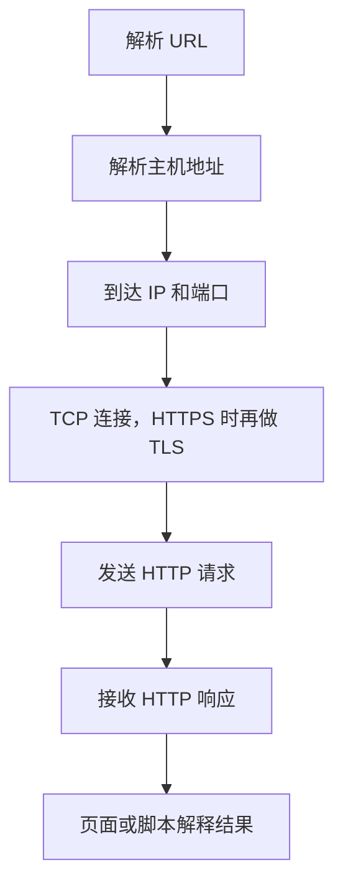
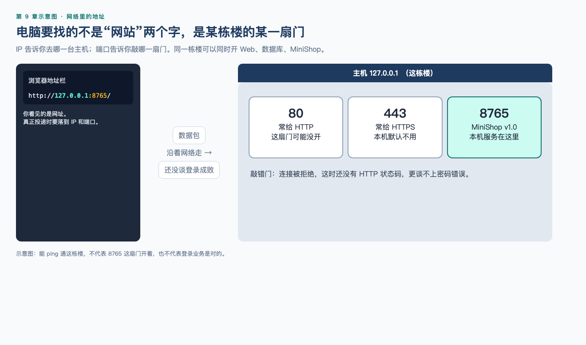
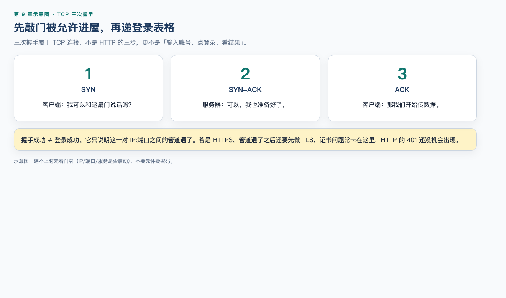
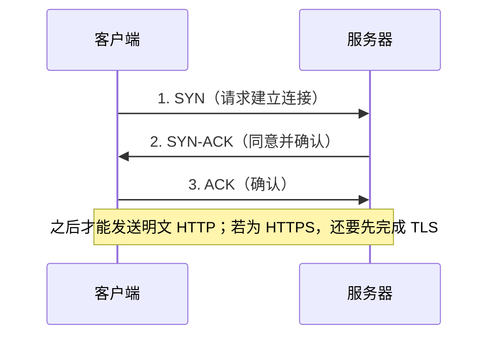
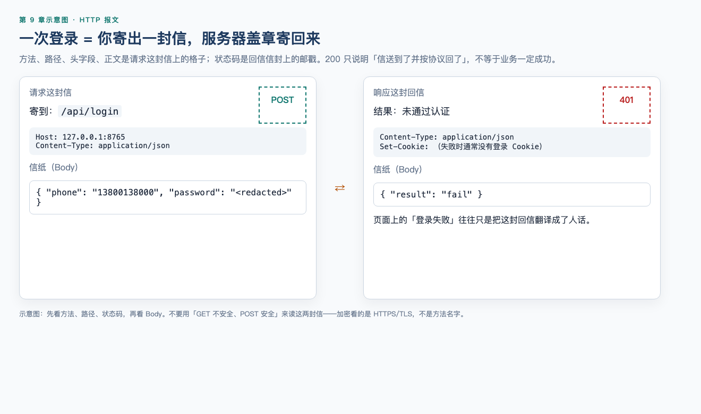
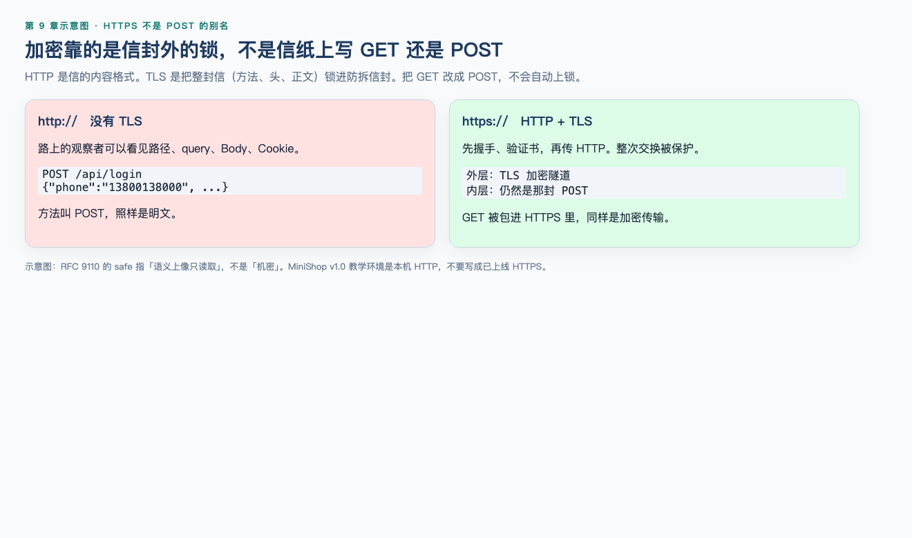
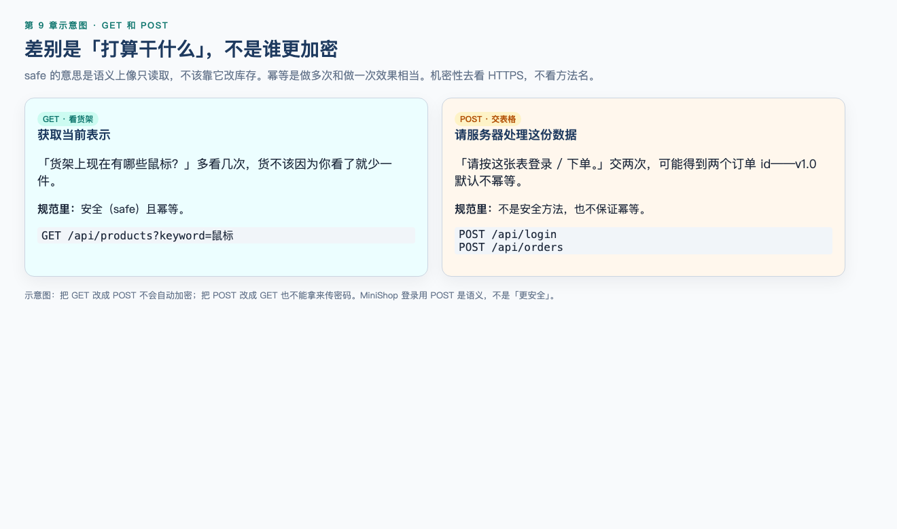

# 第 9 章（上）：网络地图与 HTTP 语义

> **一句话核心：** GET/POST 不按「安不安全」划分；safe 是只读取，加密看 TLS。

> **阅读提示：** IP、TCP、TLS 第一次读只需建立地图。真正要记住的是方法语义。报文四格和实操 9-1 在 [09B](09b-http-message-observe.md)。

> 重要级别：⭐⭐⭐ 必须掌握  
> 下一节：[09B 报文观察](09b-http-message-observe.md)  
> 主案例：MiniShop 个人软件测试实践项目

## 这一章解决什么问题

第 8 章已经能在页面上测登录、搜索和权限。页面提示“登录失败”时，问题可能出在浏览器、网络、TLS、HTTP 请求、服务端规则或前端展示。如果不会看请求和响应，就只能猜测“是前端还是后端”。

上半章给测试工程师一张够用的网络地图：IP 和端口把请求送到哪；TCP/UDP 如何传输；GET/POST 的真正语义是什么。

不把 GET 说成“不安全”、把 POST 说成“安全”。HTTP 里的安全方法（safe）指“语义上只读取”，不是机密性。机密性主要看 HTTPS/TLS。报文四格放到 [09B](09b-http-message-observe.md)；DevTools 面板在第 10 章。

## 学习目标

完成本节后，你应该能够：

- 说明 IP 与端口在访问 MiniShop 时各自做什么；
- 区分 TCP 与 UDP 的基本差异，并能用简化模型描述 TCP 三次握手；
- 解释 HTTP 与 HTTPS/TLS 的关系，以及证书问题对测试的影响；
- 按 RFC 9110 解释方法的安全（safe）与幂等（idempotent）；
- 正确比较 GET 与 POST：语义、query、body、缓存，而不是长度或“谁更安全”。

## 前置知识

- 已按正式学习顺序完成第 1～8 章；
- 能拆解 URL 的 scheme、host、port、path、query；
- 知道 Cookie、Session、Token、Bearer Token 处于不同层次；
- 不要求编写服务端或掌握套接字编程。

## 场景导入：登录失败，问题在哪一层？

你在 MiniShop 测试环境打开登录页，输入指定测试账号后点击登录，页面显示“登录失败”。

只看页面，至少有这些可能：

- 浏览器根本没发出请求；
- 请求发到了错误的主机或端口；
- HTTPS 证书不被信任，连接在 HTTP 之前失败；
- 请求方法、路径或 `Content-Type` 不符合服务端预期；
- 账号密码在 Body 里，但服务端校验失败；
- 服务端返回了成功状态，前端把业务码理解错了；
- 登录成功了，但后续请求没有带上 Cookie 或 Token。

第 7 章的访问链路在这里要补上传输和 HTTP 这两层：



本章所有抓包、重放和登录尝试只允许针对 MiniShop 或明确授权的测试环境。不要对未授权系统重放别人的 Cookie 或 Token。

---

## 9.1 测试工程师要一张够用的网络地图 ⭐⭐⭐

面试有时会问 OSI 七层。那是教学分层模型，不是测试日常的操作清单。本课程优先使用这张够用的图：

| 你要定位的问题 | 更常落到 | MiniShop 例子 |
| --- | --- | --- |
| 访问的是哪台主机 | IP / DNS | `shop.example.test` 解析失败 |
| 访问的是哪个服务 | 端口 | `8443` 未开放，`443` 才是当前环境 |
| 连接是否建立、是否可靠交付 | TCP | 握手失败、连接被重置 |
| 实时或查询类短消息 | UDP | DNS 查询常见于 UDP |
| 资源怎么请求、结果是什么 | HTTP | 登录 POST、商品 GET |
| 传输是否被加密和认证 | TLS / HTTPS | 证书过期、混合内容 |

如果被问到七层模型，可以回答：它帮助讨论“问题大概在哪一层”，测试工作更常直接说 IP、端口、TCP、TLS 和 HTTP。不要把七层名称背诵当成已经会排查。

HTTP 本身通常被设计为无状态：每个请求单独理解。登录态是应用用 Cookie、Session 或 Token 加上去的，不是 TCP 或 HTTP 自动记住你。这和第 8 章一致。

---

## 9.2 IP 与端口 ⭐⭐⭐

### IP 地址

IP 地址用于在网络中定位主机（更准确说是网络接口）。浏览器通常先看到域名，真正发数据包时需要 IP。

测试时记住：

- 一个域名可能对应多个 IP；多个域名也可能指向同一 IP；
- 能 ping 通某个 IP，不代表该主机上的 MiniShop 服务可用；
- 本机回环地址 `127.0.0.1` 只代表当前机器。ping 自己的回环，不能证明远端测试机活着；但若 MiniShop 就部署在本机（第 19 章默认 `http://127.0.0.1:8765`），它**就是**当前测试服务器；
- 文档和教材里的示例地址应使用保留示例网段，不要随手写一个公网 IP 当 MiniShop。

第 7 章已经说明 DNS 成功不等于应用健康。

### 端口

端口把同一台主机上的不同服务区分开。可以把它理解成“这栋楼的门牌号”：IP 是楼，端口是门。



| scheme | 常见默认端口 | 本章教学环境 |
| --- | --- | --- |
| `http` | 80 | 若 URL 省略端口，客户端通常用 80 |
| `https` | 443 | 若 URL 省略端口，客户端通常用 443 |
| 自定义 | 由部署决定 | 第 7 章示例用过 `8443` |

`https://shop.example.test:8443/products` 表示：用 HTTPS 访问主机 `shop.example.test` 上的 **8443** 端口。如果服务其实开在 443，你却访问 8443，页面打不开不一定是功能 Bug，而可能是环境或 URL 配错。

端口号范围是 0～65535。测试不需要背知名端口表，但要能从 URL 和缺陷报告里写出“访问了哪个端口”。

---

## 9.3 TCP 与 UDP ⭐⭐⭐

传输层常见两种协议：

| | TCP | UDP |
| --- | --- | --- |
| 连接 | 先建立连接再传数据 | 不先建立连接 |
| 可靠性 | 尽量保证顺序和到达，失败会重传 | 不保证到达和顺序 |
| 典型用途 | HTTP/1.1、HTTP/2、数据库连接 | DNS 查询、部分实时通信；HTTP/3 基于 QUIC，跑在 UDP 上 |
| 测试时的感觉 | 连接被拒绝、超时、重置 | 解析偶发失败、实时流卡顿 |

对初级 Web 测试，绝大多数页面请求仍建立在 TCP 之上（HTTP/1.1 或 HTTP/2）。看到“连接被拒绝”，优先核对 IP、端口、防火墙和服务是否启动，而不是先改登录密码。

HTTP/3 使用 QUIC（在 UDP 上）。本章不要求配置 HTTP/3。你只需要知道：浏览器地址栏看起来还是 `https://`，底层传输可能已经不是传统 TCP。排查时以实际抓到的协议为准。

---

## 9.4 TCP 三次握手 ⭐⭐⭐

TCP 在发送 HTTP 数据前，通常先完成三次握手，双方确认可以通信：





教学要点：

1. 握手成功只说明这一对 IP 和端口之间的 TCP 连接建立了，不说明登录业务成功；
2. 握手失败时，HTTP 请求还没发出，谈不上 401 或密码错误；
3. HTTPS 站点在 TCP 之后还要做 TLS 协商，证书问题常发生在这一段，而不是在 Body 里；
4. 真实 TCP 还有序号、窗口、半开连接和挥手结束。初级测试能把“连不上”和“已连接但业务失败”分开即可。

不要把三次握手背成“HTTP 的三步”。握手属于 TCP；HTTP 请求是连接建立之后的应用数据。

---

## 9.5 HTTP 是什么 ⭐⭐⭐

超文本传输协议（HTTP）是 Web 使用的应用层协议。客户端发出请求，服务器返回响应。RFC 9110 定义了 HTTP 的语义：方法、状态码、头字段和相关概念。



一次交换的最小模型：

```text
请求：我要对这个资源做什么，并带上必要的说明和数据
响应：结果如何，并带上说明和数据
```

HTTP/1.1 的请求在教学上可以看成：

```text
<方法> <请求目标> HTTP/1.1
<头字段名>: <值>
<空行>
<可选的消息体>
```

响应：

```text
HTTP/1.1 <状态码> <原因短语>
<头字段名>: <值>
<空行>
<可选的消息体>
```

HTTP/2 和 HTTP/3 在网上传输时不再是这种纯文本分行格式，但对测试工程师来说，方法、路径、状态码、Header、Body 这些语义仍然在。第 10 章的 Network 面板会把它们展示出来。

教学请求目标沿用第 7 章 URL，不代表 MiniShop 正式路由已冻结：

```text
GET /products?keyword=mouse&page=2 HTTP/1.1
Host: shop.example.test
```

`Host` 在 HTTP/1.1 中是必须的请求头，用来说明要访问哪一个主机。它和 URL 里的 host 对应，但出现在报文头里。

---

## 9.6 HTTPS 与 TLS ⭐⭐⭐

HTTPS 是“在 TLS 之上的 HTTP”。浏览器先与服务器完成 TLS，再发送 HTTP。TLS 的目标包括：



- 加密：传输内容不易被旁路窃听；
- 完整性：数据在路上被篡改应能被发现；
- 认证：客户端能验证自己连的是证书所声明的服务器（还可以做客户端证书，初级岗位较少直接配置）。

因此：

- **GET 不会因为改成 POST 就自动加密**；
- **POST 也不会因为有 Body 就自动保密**；
- 没有 TLS 的 HTTP 中，query 和 body 都可以被路径上的观察者看到。

测试中常见现象：

| 现象 | 更可能的方向 |
| --- | --- |
| 证书过期、域名不匹配、不受信任 | 环境证书、hosts、代理、时间 |
| 地址栏是 `https` 但图片或脚本是 `http` | 混合内容，部分资源被浏览器拦截 |
| 能访问 IP 不能用域名，或反过来 | 证书绑定的是域名；IP 访问可能校验失败 |
| 公司代理或抓包工具提示证书 | 中间人检查，需在授权前提下安装测试证书 |

不要把浏览器“继续访问不安全站点”当成测试通过。应记录证书警告，并确认是否符合当前测试环境约定。

TLS 还有版本和套件细节，本章不要求配置 OpenSSL。知道“HTTP 报文可以被 TLS 保护，保护的是整次交换，不是某一个方法”即可。

---

## 9.7 请求方法 ⭐⭐⭐

方法表示客户端**请求对目标资源做什么**。RFC 9110 为常见方法定义了两个重要性质：

| 性质 | 含义 | 不是什么 |
| --- | --- | --- |
| 安全（safe） | 语义上只读取，客户端不请求改变资源状态 | 不是“传输加密”或“不会泄露密码” |
| 幂等（idempotent） | 连续多次相同请求的**预期效果**与一次相同 | 不是“服务器不会写日志”，也不是“一定不会出错” |

RFC 9110 中的对照：

| 方法 | 安全 | 幂等 | 初级测试怎么用 |
| --- | --- | --- | --- |
| GET | 是 | 是 | 获取商品列表、详情、搜索结果 |
| HEAD | 是 | 是 | 只要头、不要 Body 时可能见到 |
| POST | 否 | 否 | 登录、下单、提交表单 |
| PUT | 否 | 是 | 用完整表示替换资源时可能见到 |
| DELETE | 否 | 是 | 删除地址或购物车条目时可能见到 |
| OPTIONS | 是 | 是 | 浏览器预检或探查允许的方法 |
| TRACE | 是 | 是 | 诊断回显，测试环境少用，且常被关闭。HTTP 的 safe 不等于没有安全风险：它可能回显 Cookie 等头字段 |
| CONNECT | 否 | 否 | 隧道，浏览器访问 HTTPS 代理时可能见到 |

PATCH（RFC 5789）用于部分更新，**不是** RFC 9110 方法表中的成员；其幂等性取决于应用如何实现，不能当成 GET 那样的默认保证。HTTP 还有 QUERY（RFC 10008）等方法，用于带 Body 的安全且可缓存查询；初级岗位以 GET/POST 为主，见到其他方法时先查该方法的语义，不要用 GET/POST 的口诀硬套。

安全方法可以被爬虫、预取和缓存更放心地自动使用。如果 MiniShop 用 `GET /cart/add?sku=DEMO&qty=1` 来加购，搜索引擎或浏览器预取也可能触发加购，这通常是设计问题。

幂等对测试的直接价值：创建订单这类 **POST** 被重复提交，可能产生两笔订单；登录被重复提交更常见的是两套会话或两次失败计数，不是两笔订单。第 8 章要求测连续点击，本章给出协议原因：POST 在规范里不是幂等的；应用若需要幂等，必须自己做（例如提交令牌），不能指望方法名。

---

## 9.8 GET 与 POST：语义、query、body 和缓存 ⭐⭐⭐

这是本章最容易考错的一对方法。先记结论：

> GET 用于获取当前表示，是安全且幂等的。POST 用于根据请求内容处理数据，既不是安全方法，规范也不保证幂等。二者的差别是语义，不是“谁加密、谁能传更长”。



### 不要使用的绝对化规则

| 错误说法 | 问题 |
| --- | --- |
| GET 不安全，POST 安全 | 把 HTTP 的 safe 当成了机密性。机密性看 TLS |
| POST 会加密，GET 不会 | 没有 TLS 时 Body 同样明文；有 TLS 时整份报文都被保护 |
| GET 有长度限制，POST 没有 | HTTP 没有这样规定。URL 和 Body 在实践中都受浏览器、网关、服务器限制 |
| GET 只能有 query，POST 只能有 body | POST 也可以带 query；GET 带 Body 虽被讨论，但互操作性差，测试不要依赖 |
| 有 query 就一定是 GET | query 属于请求目标，方法是另一件事 |

### query 和 body

| 位置 | 是什么 | 测试含义 |
| --- | --- | --- |
| query | URL 中 `?` 后面的部分，属于请求目标 | 出现在浏览器地址栏、历史、书签、服务器访问日志、部分 `Referer` 中。不要放密码、完整 Token |
| Body | 请求或响应的消息体 | 不出现在地址栏，但仍可能被日志、代理、调试工具记录 |

登录应把密码放在 **HTTPS 保护下的 Body**（或同等受保护的机制），不要放进 query。这不是因为 POST 魔法般更安全，而是因为 URL 更容易被复制和留下记录，且登录会改变会话状态，语义上也不该用安全方法。

GET 商品搜索把 `keyword=mouse` 放在 query 是常见且合理的：它可分享、可刷新、可缓存。

### 缓存

可缓存（cacheable）是另一项方法属性，**不等于** safe。RFC 9110 把 GET、HEAD 和 POST 列为可缓存方法；OPTIONS、TRACE 虽是安全方法，响应默认不可缓存。实践中多数缓存只实现 GET/HEAD。POST 响应只有带明确新鲜度等信息时才可能被存储，且缓存住的内容用来满足后续 **GET 或 HEAD**，不能拿来代替再发一次 POST。

测试含义：

- 商品列表“改了数据页面还是旧的”，可能是缓存，而不一定是数据库没更新；
- 登录、下单的响应不应被当成普通可缓存页面随便复用；
- `Cache-Control` 等头字段会改变实际行为，第 10 章可在 Network 里看到。

应用可以把本来安全的查询做成 POST（例如条件太长），这是工程权衡。测试时记录实际方法，并检查：重复提交会不会产生副作用、URL 能否复现同一次搜索。

### 对照表

| 维度 | GET | POST |
| --- | --- | --- |
| 规范语义 | 获取目标资源的当前表示 | 由服务端按请求内容处理 |
| 安全（safe） | 是 | 否 |
| 幂等 | 是 | 否（规范不保证） |
| 常见数据位置 | query | Body，也可以同时有 query |
| 默认缓存倾向 | 实践中更常被缓存 | 规范也可缓存，但多数实现不按 GET 那样复用 |
| MiniShop 例子 | 搜索商品、打开详情 | 登录、提交订单、有时是加购 |
| 测试重点 | 可刷新、可分享、无副作用 | 重复提交、状态变化、Body 与 `Content-Type` |

---

## 常见错误

### 错误 1：GET 不安全，POST 安全

修正：safe 指只读取的语义。传输是否被窃听取决于是否使用 HTTPS。

### 错误 2：POST 会加密密码，所以登录一定用 POST 就够了

修正：没有 TLS，Body 同样可被观察。登录用 POST 主要因为会改变会话，且避免把密码放进 URL。

### 错误 3：GET 有长度限制，POST 没有

修正：这不是 HTTP 规范。URL 和 Body 都可能被中间设备截断或拒绝。

### 错误 4：三次握手就是 HTTP 的三次请求

修正：三次握手是 TCP 建立连接。HTTP 请求发生在连接建立之后。

### 错误 5：能 ping 通就说明 MiniShop 正常

修正：ping 最多说明主机或中间设备对 ICMP 有响应，不检查端口上的 HTTP 服务。

### 错误 6：HTTPS 页面里所有资源都自动加密

修正：若页面以 HTTPS 加载，但脚本或图片仍是 HTTP，可能出现混合内容。

## 面试角度 ⭐⭐⭐

回答顺序：结论 → 原理 → 场景 → 示例 → 边界。

### GET 和 POST 有什么区别？

结论：语义不同。GET 用于获取表示，是安全且幂等的；POST 用于提交处理，规范不认为它安全或幂等。  
原理：安全方法可被预取和爬虫使用；非幂等请求重复发送可能产生额外业务效果。  
示例：搜索商品用 GET 便于分享 URL；登录、下单用 POST，并应放在 HTTPS 下，密码放 Body 不放 query。  
边界：不要说 POST 更加密、GET 一定更短。应用也可能用 POST 做复杂查询，那是权衡，测试要看副作用。

### HTTP 和 HTTPS 有什么区别？

结论：HTTPS 是 TLS 保护下的 HTTP。  
原理：TLS 提供加密、完整性和服务器认证。  
示例：证书过期时，浏览器在发出业务请求前就可能拦住。  
边界：方法改成 POST 不能代替 HTTPS。

### 什么是幂等？

结论：多次相同请求的预期效果与一次相同。  
示例：对同一资源重复 DELETE，结果应是资源不存在，而不应每次删掉不同数据；重复 POST 下单则可能两笔订单，除非应用自己做了幂等键。  
边界：服务器写日志并不破坏方法的幂等定义。

## 小练习

练习编号 1～5 在本节；6～10 在 [09B](09b-http-message-observe.md)。拆章后从 1 编到 10，中间没有缺题。

### 练习 1

访问 `https://shop.example.test:8443/products` 时，IP 和端口分别解决什么问题？默认 HTTPS 端口是多少？为什么这里仍要写 8443？

### 练习 2

TCP 三次握手成功，能否说明 MiniShop 登录已经成功？为什么？

### 练习 3

哪一句正确？

A. GET 不安全，因为参数在 URL 里  
B. POST 安全，因为 Body 会加密  
C. GET 是安全方法，指语义上只读取  
D. 只要改用 POST，就可以不用 HTTPS

### 练习 4

用 safe 和幂等解释：为什么加购不应设计成 `GET /cart/add?sku=1`，而搜索可以用 `GET /products?keyword=mouse`。

### 练习 5

登录请求把密码放在 `?password=` 里，即使用了 HTTPS，测试仍应提出什么风险？

## 练习答案

1. IP（通常经 DNS 得到）用于找到主机；端口用于找到该主机上的服务。默认 HTTPS 端口是 443。示例使用 8443，所以必须写明，否则客户端会去 443。
2. 不能。握手只说明 TCP 连接建立。登录还要经过 TLS（若为 HTTPS）和 HTTP 业务处理。
3. C。A 把 URL 泄露风险说成方法的 safe 定义；B、D 把 POST 当成加密。
4. 加购会改变购物车，不是安全方法应做的事，预取或爬虫可能误触发；搜索是读取当前列表，GET 安全且幂等，query 还可分享。若加购用 GET，重复抓取可能重复加购。
5. URL 可能进入历史、日志、Referer、截图和分享链接。HTTPS 保护传输路径，不删除这些记录点。登录语义也不应使用安全方法。

## 本章检查清单

- [ ] 我能说明 IP 和端口的分工
- [ ] 我能区分 TCP 与 UDP，以及 HTTP/3 可能跑在 UDP 上
- [ ] 我知道三次握手成功不等于业务成功
- [ ] 我能解释 HTTPS 保护整份 HTTP 交换
- [ ] 我能用 RFC 9110 的 safe 和幂等说明 GET/POST
- [ ] 我不会说“GET 不安全、POST 安全”
- [ ] 我不会说“GET 有长度限制、POST 没有”
- [ ] 我知道 query 和 Body 的不同泄露面

### 进入下一节的自测门槛

1. 练习 1～5 至少完成 4 题，且第 3、4 题能用自己的话回答；
2. 不看正文，能用三句话比较 GET 与 POST，且不出现加密或长度神话。

## 本章总结

上半章只建立地图和方法语义：

1. IP 找主机，端口找服务，TCP 管连接，HTTP 管请求语义；
2. 三次握手成功只说明连接建立；
3. HTTPS/TLS 保护传输，和 GET/POST 不是同一件事；
4. 方法的 safe 是只读取，幂等是一次与多次效果相同；
5. GET 与 POST 差在语义、query/body 习惯和缓存，不在“谁更安全、谁更长”。

状态码、头、体和登录报文放到 [09B](09b-http-message-observe.md)。

## 本章可运行性说明

本节没有必须启动的服务。示意图是讲解图。动手观察报文见 09B 与实操 9-1（MiniShop `POST /api/login`）。

## 参考资料

- [RFC 9110：HTTP Semantics](https://www.rfc-editor.org/rfc/rfc9110)（本章于 2026-09-08 核验）
- [RFC 9111：HTTP Caching](https://www.rfc-editor.org/rfc/rfc9111)
- [MDN：HTTP request methods](https://developer.mozilla.org/en-US/docs/Web/HTTP/Reference/Methods)
- [MDN：HTTPS](https://developer.mozilla.org/en-US/docs/Glossary/HTTPS)
- [09B 报文观察](09b-http-message-observe.md)
- 本仓库 [第 8 章：Web 功能测试](08-web-functional-testing.md)
- 本仓库 [全局内容质量标准](../standards/QUALITY_STANDARD_v1.0.md)

## 下一节预告

下一节进入 [09B 报文观察](09b-http-message-observe.md)。把一次登录拆成方法、路径、头、体，对照 MiniShop `POST /api/login`，并完成实操 9-1。
