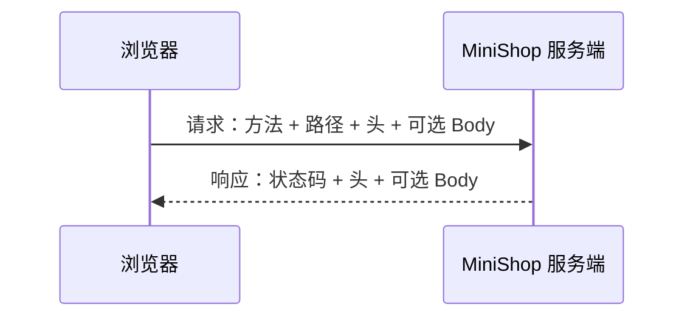
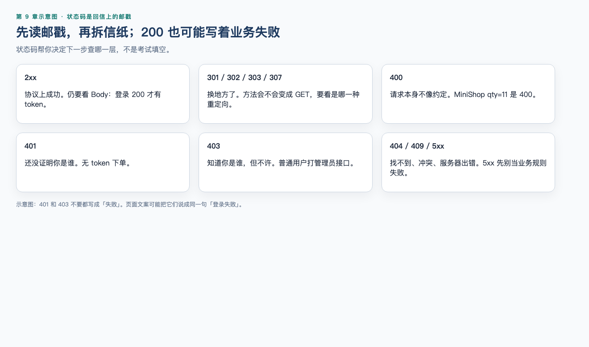

# 第 9 章（下）：报文观察

> **一句话核心：** HTTP 把一次观察拆成方法、路径、头、体。

> **阅读提示：** 方法语义在 [09A](09a-network-http-semantics.md)。本节对着 MiniShop 看报文。配套实操：[实操 9-1](../practice/09-http-observe/README.md)（`python3 practice/run.py 9-1`）。

> 重要级别：⭐⭐⭐ 必须掌握  
> 上一节：[09A 网络地图与 HTTP 语义](09a-network-http-semantics.md)  
> 主案例：MiniShop 个人软件测试实践项目

## 这一节解决什么问题

页面提示“登录失败”时，问题可能出在方法、路径、头或体。不会看请求和响应，就只能猜测。本节把一次交换拆成四格，并读懂状态码和 MiniShop 登录报文。

## 学习目标

- 拆解请求行、状态行、Header 和 Body；
- 根据常见状态码选择下一步排查方向，而不是把 200 当成业务一定成功；
- 阅读 MiniShop 登录请求，并指出身份信息出现在哪些位置；
- 完成一份 HTTP 观察记录。

## 前置知识

已完成 09A。知道 GET/POST 的 safe 与幂等，不会说“POST 更安全”。

## 场景导入：登录失败，先看哪四格？

只看页面文案不够。先问：方法、路径、头、体。实操 9-1 就是把一次 MiniShop 登录填进这四格。

## 9.9 请求与响应 ⭐⭐⭐

把一次登录拆开看：



### 请求里通常有什么

| 部分 | 作用 | 登录场景例子 |
| --- | --- | --- |
| 方法 | 对资源的操作语义 | `POST` |
| 请求目标 | 路径和可能的 query | 一般站点常见 `/login`；**MiniShop v1.0 是 `/api/login`**，无前缀会 404 |
| Header | 补充说明 | `Host`、`Content-Type`、`Cookie` |
| Body | 消息体 | 表单或 JSON 中的手机号、密码 |

### 响应里通常有什么

| 部分 | 作用 | 登录场景例子 |
| --- | --- | --- |
| 状态码 | 协议级结果分类 | `200`、`401`、`302` |
| Header | 补充说明 | `Set-Cookie`、`Location`、`Content-Type` |
| Body | 消息体 | HTML 页面或 `{"message":"密码错误"}` |

测试时至少问四个问题：

1. 请求打到了哪个 Host、端口和路径？
2. 方法是不是服务端支持的那种？
3. 状态码和 Body 是否一致？
4. 后续请求是否带上了 Cookie 或 `Authorization`？

页面文案不能代替这四问。服务端可能返回 `200` 和 `{"success": false}`，页面再显示失败。

---

## 9.10 状态码 ⭐⭐⭐




状态码是三位数字，表示**这一次 HTTP 交换**的协议级分类，不等于业务一定成功或失败。

| 类别 | 含义 | 测试时的第一反应 |
| --- | --- | --- |
| 1xx | 中间状态 | 初级功能测试较少直接断言 |
| 2xx | 成功收到并理解，通常已接受处理 | 还要看 Body 和后续数据 |
| 3xx | 需要额外动作，常为重定向或缓存再验证 | 看 `Location`、是否改写方法、是否丢失 Body |
| 4xx | 客户端这边的请求被认为有问题 | 核路径、方法、认证、权限、参数 |
| 5xx | 服务器在处理时发生错误 | 核环境、依赖、日志；不要立刻写成“浏览器坏了” |

### 必须能解释的常用码

| 状态码 | 常见含义 | 测试注意 |
| --- | --- | --- |
| 200 | OK | Body 里仍可能是业务失败 |
| 201 | Created | 创建类接口常见，应能找到新资源位置 |
| 204 | No Content | 成功但没有 Body，页面必须能处理空响应 |
| 301 / 302 | 重定向 | HTTP 升 HTTPS 常见 301；登录后跳转常见 302。历史原因下，不少客户端会把 POST 后的 302 改成 GET。核对最终落地 URL 和后继方法 |
| 303 | See Other | 更明确表示“请用 GET 去看另一个资源”，登录 POST 成功后常用 |
| 307 / 308 | 保持方法的重定向 | 后继请求保持原方法，POST 可能仍是 POST，Body 也可能还在 |
| 304 | Not Modified | 缓存再验证成功，不一定是“接口没数据” |
| 400 | Bad Request | 语法或无法理解的请求，细节看 Body |
| 401 | Unauthorized | 缺少有效认证。英文名字容易误导，它首先表示**未通过认证** |
| 403 | Forbidden | 服务器拒绝执行。常见于已认证但无权限，也用于拒绝说明原因 |
| 404 | Not Found | 路径、资源或故意隐藏 |
| 405 | Method Not Allowed | 路径存在但不接受该方法，响应或含 `Allow` |
| 409 | Conflict | 状态冲突，如重复提交 |
| 415 | Unsupported Media Type | `Content-Type` 不被接受 |
| 429 | Too Many Requests | 验证码或登录限流 |
| 500 | Internal Server Error | 服务端未处理的错误，缺陷里不要只写“500” |
| 502 / 503 | 网关或服务不可用 | 更像环境和发布问题 |

**401 和 403** 是面试高频题：401 优先想“你是谁还没说清或凭证无效”；403 优先想“知道你是谁，但不允许这样做”。真实项目可能混用，测试应以需求为准，并在缺陷里同时记录状态码和 Body。

**200 不是业务通过的充分条件。** 若 MiniShop 约定失败时 HTTP 仍为 200、在 JSON 里给错误码，测试必须断言 Body，而不是只看状态码。反过来，4xx/5xx 也不自动等于产品缺陷，可能是用例预期就是拒绝。

---

## 9.11 头字段（Headers） ⭐⭐⭐

头字段为请求和响应提供元数据。名称不区分大小写；教学中常见 `Content-Type` 这种写法。

### 请求头

| 头字段 | 作用 | 测试时看什么 |
| --- | --- | --- |
| `Host` | HTTP/1.1 的目标主机 | 是否打到正确环境 |
| `User-Agent` | 客户端标识 | 偶现问题是否只出现在某浏览器 |
| `Accept` | 客户端能处理的表示 | 与返回类型是否匹配 |
| `Content-Type` | Body 的媒体类型 | JSON 和表单不能混用预期 |
| `Content-Length` | Body 长度 | 与实际 Body 不一致时可能被拒绝 |
| `Cookie` | 浏览器自动带上的 Cookie | 第 8 章：自动携带，不等于 Session 本身 |
| `Authorization` | 认证信息 | 常见 `Bearer <token>`，截图必须脱敏 |

### 响应头

| 头字段 | 作用 | 测试时看什么 |
| --- | --- | --- |
| `Content-Type` | 响应体类型 | HTML、JSON、文件下载是否相符 |
| `Set-Cookie` | 让浏览器保存 Cookie | `HttpOnly`、`Secure`、`SameSite` |
| `Location` | 重定向目标 | 登录后去哪，是否串环境 |
| `Cache-Control` | 缓存指示 | 敏感页是否被缓存 |
| `WWW-Authenticate` | 401 时常出现 | 提示需要何种认证 |

第 8 章说过：`HttpOnly` 阻止脚本读取 Cookie，**不**阻止浏览器在后续请求的 `Cookie` 头里带上它。本章你可以在请求头里直接看到这个结果。

不要把 Header 名称写成 MiniShop 已冻结的接口契约。v1.0 字段以第 19 章 OpenAPI 为准。

---

## 9.12 消息体（Body） ⭐⭐⭐

Body 是请求或响应中头字段空行之后的内容。GET 商品列表的响应 Body 可能是 HTML 或 JSON；登录 POST 的请求 Body 可能是表单或 JSON。

常见媒体类型：

| `Content-Type` | 含义 | 例子 |
| --- | --- | --- |
| `text/html` | HTML 页面 | 登录页本身 |
| `application/json` | JSON | `{"phone":"13800138000"}` |
| `application/x-www-form-urlencoded` | 表单编码 | `phone=13800138000&password=...` |
| `multipart/form-data` | 含文件的表单 | 上传 |

测试要点：

- 声明的 `Content-Type` 必须和实际 Body 一致；
- JSON 的空对象、`null`、缺字段和空字符串不是一回事；
- 响应是 HTML 错误页还是 JSON，决定你下一步看页面还是看字段；
- Body 中的密码、Token、地址必须脱敏后再进缺陷单。

没有 Body 也可能是正常的，例如部分 `204` 响应。

---

## 9.13 阅读 MiniShop 登录请求 ⭐⭐⭐

示例 A 是一般站点的表单登录形态。示例 B 对齐 MiniShop v1.0：`POST /api/login`。密码用占位符；对着本机 MiniShop 复现时用教学账号 `Test1234`，不要把真实密码写进命令历史。

### 示例 A：表单登录

```text
POST /login HTTP/1.1
Host: shop.example.test
Content-Type: application/x-www-form-urlencoded
Origin: https://shop.example.test
Cookie: session_demo=abc

phone=13800138000&password=<redacted>
```

可能的响应：

```text
HTTP/1.1 302 Found
Location: /products
Set-Cookie: session_demo=xyz; Path=/; HttpOnly; Secure; SameSite=Lax
Content-Length: 0
```

阅读清单：

1. 方法是 POST，符合“会改变会话状态”；
2. 密码在 Body，不在 query；
3. `Content-Type` 与 Body 形态一致；
4. 响应用 `Set-Cookie` 下发会话标识，属性与第 8 章一致；
5. 这份示例用 `302`，浏览器常把 POST 之后的 302 改成 GET 再去 `Location`。规范上更贴“请用 GET 看另一个资源”的是 303；307/308 会保持原方法。测试要看实际后继请求的方法和落地 URL，单看这一次响应 Body 可能为空。

### 示例 B：JSON 登录并返回 Token

MiniShop v1.0 登录就是 `POST /api/login`（默认 `http://127.0.0.1:8765`）。示例 A 的 `/login` 只是一般站点形态，对着 MiniShop 打会 404。项目收口在第 19 章，路径现在就可以用。

```text
POST /api/login HTTP/1.1
Host: 127.0.0.1:8765
Content-Type: application/json

{"phone":"13800138000","password":"<redacted>"}
```

```text
HTTP/1.1 200 OK
Content-Type: application/json

{"result":"ok","token":"<redacted>"}
```

后续请求可能出现：

```text
GET /api/cart HTTP/1.1
Host: 127.0.0.1:8765
Authorization: Bearer <redacted>
```

这只说明身份凭证在 `Authorization` 头里出示，并不表示系统因此不再使用 Cookie 或 Session。第 8 章的层次模型在报文里会变成具体头字段。

### 登录失败时看什么

| 观察 | 可能方向 |
| --- | --- |
| 没有任何请求 | 前端校验、按钮未绑定、脚本错误 |
| 请求发到错误 Host/端口 | 环境配置 |
| TLS 失败 | 证书与 HTTPS |
| `405` | 方法不被该路径接受 |
| `415` | `Content-Type` 不匹配 |
| `401` / `403` | 认证或权限 |
| `429` | 尝试次数过多 |
| `200` 但 Body 表示失败 | 业务码，不能只断言状态码 |
| 登录响应成功，下一请求未带 Cookie/Token | 登录态保持失败 |

用 curl 复现时，不要在共享终端历史中写入真实密码。第 10 章可以用 DevTools 的 Copy as cURL，复制后必须先脱敏。第 11 章再系统练习 curl。

---

配套可运行实操：[实操 9-1 登录四格](../practice/09-http-observe/README.md)（`python3 practice/run.py 9-1`）。

## MiniShop 工作实战：HTTP 观察记录

先启动 MiniShop（`cd project/minishop && python3 run.py serve`），或直接跑实操 9-1。不要对未授权站点做登录爆破或重放。

请提交：

1. 一次搜索或打开列表的 GET 观察；
2. 一次登录 POST 观察（MiniShop `POST /api/login`，或实操 9-1）；
3. 状态码、关键头字段和 Body 类型的记录；
4. 对 GET/POST 差异的三句话说明，必须包含 safe、幂等，以及“不是谁更加密”；
5. 一份缺陷标题或“未发现协议级异常”的说明。

建议保存为：

```text
exercises/chapter-09-minishop-http-observation.md
```

```markdown
# MiniShop HTTP 观察记录

## 环境
- 站点：
- 版本/构建：
- 浏览器或客户端：
- 日期：

## GET 观察
- 完整 URL（可含 query，不含密码）：
- 方法：
- 状态码：
- 重要请求头：
- 重要响应头：
- Body 类型：
- 页面结果：

## POST 观察
- 路径：
- 方法：
- Content-Type：
- 身份信息出现在 query / Cookie / Authorization / Body 中的哪几处（不要粘贴值）：
- 状态码：
- 后续请求是否带上登录态：

## 判断
- 这次失败或成功，更像哪一层：
- GET 与 POST 在本场景中为什么这样选：
- 剩余问题：
```

完成标准：

- GET 与 POST 各至少一条；
- 能指出密码或 Token 不应出现的位置；
- 能用 safe 和幂等解释方法选择，不出现“POST 更安全”这种句子；
- 状态码和 Body 都有记录；
- MiniShop 登录路径写成 `/api/login`，不要写成无前缀的 `/login`。

---

## 常见错误

### 错误 1：状态码 200 就是功能通过

修正：还要看 Body、页面和数据。业务失败可以包在 200 里。

### 错误 2：401 就是没权限，403 就是没登录

修正：401 更接近未通过认证，403 更接近拒绝授权。项目可能混用，以需求和报文为准。MiniShop 他人订单是 403。

### 错误 3：有 `Authorization: Bearer` 就不再有 Cookie 和 Session

修正：它们仍可能同时存在。层次不同。v1.0 登录同时下发 JSON `token` 和 `Set-Cookie`。

### 错误 4：把 query 里的搜索词当成缺陷里的密码一并贴出

修正：搜索词通常可以保留；密码、Token、会话标识必须脱敏。

### 错误 5：对着 MiniShop 打 `POST /login`

修正：v1.0 是 `POST /api/login`。无前缀会 404，那不是登录坏了。

---

## 面试角度 ⭐⭐⭐

回答顺序：结论 → 原理 → 场景 → 示例 → 边界。

### 401 和 403 有什么区别？

结论：401 表示需要或未通过认证；403 表示服务器拒绝该请求。  
示例：未带 Token 访问购物车接口更像 401；普通用户带有效登录访问后台更像 403。  
边界：有的系统全用 400 或 200 加业务码，先读约定再评价。

### 为什么登录失败不能只看页面文案？

结论：失败可能发生在连接、TLS、方法、状态码、Body 或后续登录态。  
示例：返回 200 且 `success=false`，或 302 后又 401。  
边界：第 10 章用 Network 取证，本节先知道要看哪些字段。

---

## 小练习

### 练习 6

响应是 `200 OK`，Body 为 `{"success":false,"message":"密码错误"}`。能否只根据状态码判定用例失败？应怎样写预期？

### 练习 7

未登录调用购物车接口返回 401，普通用户访问后台返回 403。分别更符合哪种含义？若两者都返回 200 加错误码，测试应怎么办？

### 练习 8

`Set-Cookie: session_demo=xyz; HttpOnly` 之后，下一请求的 `Cookie` 头里还能看到 `session_demo` 吗？脚本用 `document.cookie` 呢？

### 练习 9

证书过期时，用户还没看到登录表单提交结果。更可能卡在图中哪一段：TCP 握手、TLS、HTTP 业务处理？

### 练习 10

阅读 MiniShop 登录：列出方法、路径、密码所在位置、成功后登录态可能出现在哪些头字段。不要写成无前缀的 `/login`。

## 练习答案

6. 不能只看 200。预期应同时规定状态码和 Body（以及页面提示）。本例协议成功、业务失败。
7. 401 更接近未认证，403 更接近已认证但拒绝。若都用 200 加错误码，按接口约定断言字段，并在缺陷中写明实际约定，不要用“标准 401”强行判错。
8. 下一请求通常仍会自动带上该 Cookie。`document.cookie` 读不到 `HttpOnly` 的值。
9. 更可能在 TLS 阶段。TCP 可能已经成功，HTTP 登录 Body 还没发出。
10. 方法 POST；路径 `/api/login`；密码在 Body，不在 query；登录态可能出现在响应 `Set-Cookie` 以及 JSON `token`，后续请求用 `Authorization: Bearer` 和/或 `Cookie`。

---

## 本章检查清单

- [ ] 我能拆解请求行、状态行、Header、Body
- [ ] 我能解释 200/302/304/401/403/404/500 的测试含义
- [ ] 我知道 200 不等于业务成功
- [ ] 我能在登录报文里指出密码和登录态出现的位置
- [ ] 我知道 MiniShop 登录是 `/api/login`
- [ ] 我能完成 HTTP 观察记录

### 进入下一章的自测门槛

1. 练习 6～10 至少完成 4 题，且第 6、8 题能用自己的话回答；
2. 能说明 401 与 403、200 与业务成功的差别；
3. 完成实操 9-1 或等价的 HTTP 观察记录。

## 本章总结

下半章把观察落到报文：

1. 一次 HTTP 交换是方法、路径、头、体；
2. 状态码要和 Body、后续请求一起看；
3. 登录报文里要分清密码在哪、登录态在哪，并脱敏；
4. MiniShop 登录路径是 `/api/login`，不是 `/login`。

## 本章可运行性说明

配套实操 9-1 为 ✅ 可运行（`python3 practice/run.py 9-1`），打的是 MiniShop `POST /api/login`，验收 token 与 `Set-Cookie`。示例 A 是一般站点形态。审查未假装拍过 DevTools 面板。

不要在 curl、缺陷或聊天里留下明文密码。安全测试只允许在授权环境进行。

## 参考资料

- [RFC 9110：HTTP Semantics](https://www.rfc-editor.org/rfc/rfc9110)
- [MDN：HTTP response status codes](https://developer.mozilla.org/en-US/docs/Web/HTTP/Reference/Status)
- [09A 网络地图与 HTTP 语义](09a-network-http-semantics.md)
- 本仓库 [第 10 章：Chrome DevTools](10-chrome-devtools.md)
- 本仓库 [全局内容质量标准](../standards/QUALITY_STANDARD_v1.0.md)

## 下一章预告

下一章进入第 10 章《Chrome DevTools》。你将在 Elements、Console、Network 里定位请求，对照本节的方法、状态码、Header 和 Body，使用 Preserve Log、Disable Cache、Copy as cURL 观察 MiniShop 登录和慢加载，并把“页面失败”还原成一条具体报文。
