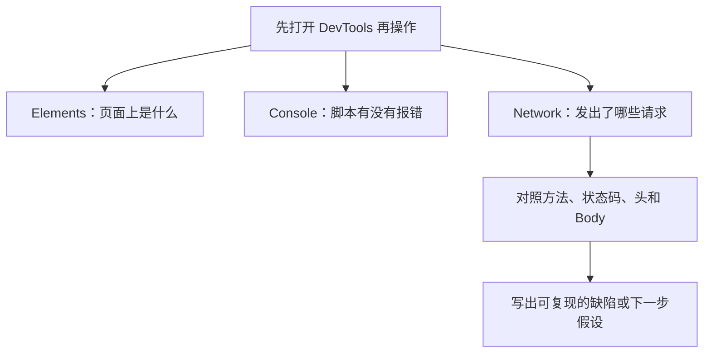

# 第 10 章：Chrome DevTools

> 重要级别：⭐⭐⭐ 必须掌握  
> 主案例：MiniShop 个人软件测试实践项目

## 这一章解决什么问题

第 9 章已经能读懂方法、状态码、Header 和 Body。真正排障时，这些字段藏在浏览器里。只会看页面文案，就只能写“登录失败”；打开开发者工具，才能指出是哪一条 POST、什么状态码、有没有 `Set-Cookie`、慢在 TTFB 还是下载。

本章用 Chrome DevTools 把页面现象还原成证据。重点是 Elements、Console、Network，以及 Preserve log、Disable cache、Copy as cURL、网络限速和 Timing/TTFB。目标不是把你培养成前端开发工程师，而是让初级测试工程师能取证、能判断方向、能把第 6 章的缺陷写清楚。

Chrome 的界面会改。本章以**功能名称和要观察的事实**为准，不把某一次按钮坐标写成永远正确的操作手册。

## 学习目标

完成本章后，你应该能够：

- 打开 Chrome DevTools，并说明 Elements、Console、Network 各自解决什么问题；
- 用 Elements 区分“查看源代码”和运行后的 DOM；
- 用 Console 识别脚本错误，并知道不要执行来路不明的代码；
- 在 Network 中于复现前开始记录，筛出登录、搜索或数据请求；
- 阅读一条请求的 Headers、请求体、响应体和 Timing；
- 根据报文和错误信息提出前端或后端的**待验证假设**，而不是武断归因；
- 在会跳转的流程中使用 Preserve log，在需要模拟首次访问时使用 Disable cache；
- 复制 Copy as cURL 后先脱敏，再用于授权环境复现；
- 用网络限速和 TTFB/下载时间给“慢”提供证据；
- 完成 MiniShop 登录与慢加载定位记录。

## 前置知识

- 已按正式学习顺序完成第 1～9 章；
- 能拆解 URL，能说明 GET/POST、状态码、Header、Body；
- 知道 Cookie 与 Token 出现在哪些头字段；
- 需要一台已安装 Google Chrome 的电脑。其他浏览器也有类似工具，本章以 Chrome 为准。

## 场景导入：登录失败，你能指出是哪一条请求吗？

MiniShop 测试环境登录后，页面只显示“登录失败”。

没有开发者工具时，缺陷往往是：

> 登录失败，请尽快修复。

有 Network 记录时，可以写成：

> 在 Chrome 当前稳定版中提交登录后，`POST /login` 返回 `401`，响应 JSON 含失败信息；页面提示与报文一致。未发现 `Set-Cookie`。构建 `minishop-test-20260908-01`（教学示例号）。

后者才能让开发工程师在同一版本上复现。本章训练的就是这种取证。



只在 MiniShop 或明确授权的测试环境使用这些技术。不要对未授权站点注入脚本、拦截他人 Cookie，或把带密码的 cURL 发到公开地方。

---

## 10.1 打开 DevTools ⭐⭐⭐

常用打开方式（以当前 Chrome 为准，系统快捷键可能被改写）：

| 方式 | Windows / Linux | macOS |
| --- | --- | --- |
| 快捷键 | `F12` 或 `Ctrl+Shift+I` | `Cmd+Option+I` |
| 检查元素 | `Ctrl+Shift+C`，或页面右键 **检查** / **Inspect** | `Cmd+Option+C`，或页面右键 **检查** |
| 菜单 | 更多工具 → 开发者工具 | 视图 → 开发者 → 开发者工具 |

打开后，工具可能停靠在底部、右侧或独立窗口。对测试来说，Network 需要足够宽度才能看清方法、状态码和耗时。

本章主用三个面板：

| 面板 | 回答的问题 | 不回答的问题 |
| --- | --- | --- |
| Elements | 当前页面 DOM 和样式是什么 | 服务端数据库里存了什么 |
| Console | 页面脚本和浏览器报了哪些错 | 业务一定失败的全部原因 |
| Network | 浏览器发出了哪些请求、得到什么响应 | 不看报文就断定“一定是前端” |

第 8 章提到的 Cookie，还可以在请求的 Cookies 视图，或 **Application**（应用程序）面板的存储里查看。Application 不是本章大纲主面板，但观察 `HttpOnly` Cookie 时很有用：脚本读不到的值，仍可能出现在这里和后续请求的 `Cookie` 头中。

---

## 10.2 界面会变，功能名相对稳定 ⭐⭐⭐

Chrome DevTools 的图标位置、中文翻译和子标签名称会随版本变化。测试应记住**要完成的事**：

- 在跳转后仍能看到登录请求 → **Preserve log**（保留日志）
- 避免旧缓存掩盖问题 → **Disable cache**（停用缓存）
- 把浏览器请求变成命令行 → **Copy as cURL**
- 模拟慢网络 → Network 的限速（throttling）
- 看等待首字节还是下载慢 → **Timing** 中的 **Waiting (TTFB)** 与内容下载

官方文档将 Preserve log、Disable cache、Copy as cURL 作为 Network 功能名。若你的 Chrome 把 Preserve log 显示成“保留日志”，指的是同一功能。找不到选项时，先让 DevTools 处于焦点，再用 Command Menu（Windows / Linux：`Ctrl+Shift+P`，macOS：`Cmd+Shift+P`）搜索英文功能名。

**Disable cache 只在 DevTools 打开时生效。** 关掉开发者工具后，浏览器缓存通常会恢复。不要以为勾选过一次就永远模拟首次访问。

---

## 10.3 Elements：看运行后的 DOM ⭐⭐⭐

第 7 章说过：查看网页源代码偏向初始 HTML；Elements 显示的是**当前 DOM**，可能已被 JavaScript 改过。

测试用法：

1. 用检查工具点到按钮、提示文案、库存数字；
2. 看它是 `<button>`、`<a>` 还是一个可点击的 `<div>`；
3. 看是否有 `disabled`、`hidden`、或被 CSS 挡住；
4. 搜索文本，确认“页面上没有”到底是没渲染，还是被折叠进菜单。

可以临时勾选或修改 DOM 来做**假设验证**，例如展开被隐藏的菜单，看直接访问时页面结构是否存在。这只影响当前标签页的显示，不是给生产环境打补丁，刷新即消失。

不要根据 Elements 里改通了，就写“前端已修复”。那只是本机临时 DOM。

---

## 10.4 Console：错误不是装饰 ⭐⭐⭐

Console 显示页面脚本、浏览器安全和部分网络失败信息。红色错误与黄色警告级别不同。过滤级别，避免被广告脚本刷屏。

测试时至少看：

- 点击登录或加购时是否出现 `TypeError`、`undefined`；
- 是否有跨源（CORS）相关报错——这通常表示浏览器拦截了响应，页面可能失败，但原因不一定是“后端没写接口”；
- 是否有混合内容警告（HTTPS 页面加载 HTTP 资源）。

**不要在 Console 里粘贴来路不明的脚本。** 任何人发给你的 `fetch` 片段都可能把测试账号或 Cookie 发走。只在授权环境、自己理解的前提下做试验。

Console 有报错不等于这就是根因，没有报错也不等于功能正确。它是证据之一，要和 Network、页面行为一起看。

---

## 10.5 Network：把页面还原成请求 ⭐⭐⭐

Network 是本章的核心。正确顺序：

1. 打开 DevTools，切到 Network；
2. 勾选需要的 Preserve log、Disable cache；
3. 清空当前列表；
4. **再**执行登录、搜索、加购；
5. 在列表里找到对应请求。

若先操作再打开 Network，登录请求可能已经结束，列表是空的。这是最常见的使用错误。

列表常见列：

| 列 | 看什么 |
| --- | --- |
| Name | 资源名或路径 |
| Method | GET/POST 等 |
| Status | 状态码；失败常标红 |
| Type | document、xhr、fetch、js、css、img |
| Size | 传输大小；`(from disk cache)` 等表示来自缓存 |
| Time | 总耗时 |

一次打开 MiniShop 首页，往往有文档、CSS、JS、图片和数据接口多条请求。第 7 章已说明“打开一个页面 ≠ 一次网络请求”。

---

## 10.6 请求定位 ⭐⭐⭐

不要在几十条静态资源里迷路。定位步骤：

1. 用过滤器选 **Fetch/XHR**（数据请求）或 **Doc**（主文档）；名称以当前 Chrome 标签为准；
2. 在过滤框输入路径片段，如 `login`、`products`、`cart`；
3. 看 Method：登录、下单更常是 POST；列表、搜索更常是 GET；
4. 看发起时机：你点击按钮后新出现的那几条；
5. 若有重定向，展开或查看 30x 后面的那一条。

一条候选请求要能对上你的操作时间。首页自动发出的统计请求，通常不是“登录失败”的直接证据。

找不到 POST 时，可能是：

- 没在操作前打开 Network；
- 跳转清掉了日志，未开 Preserve log；
- 前端校验拦截，请求根本没发出（此时应同时看 Console 和 Elements）；
- 过滤条件太窄。

---

## 10.7 Request 与 Response ⭐⭐⭐

点开一条请求，对照第 9 章阅读。子标签名称可能是 Headers、Payload、Request、Preview、Response、Timing、Cookies。

| 你要找的东西 | 通常在哪 |
| --- | --- |
| URL、方法、状态码 | 概要 / General |
| `Host`、`Content-Type`、`Cookie`、`Authorization`、`Set-Cookie` | 请求头 / 响应头 |
| 表单字段或 JSON 请求体 | Payload 或 Request（以当前标签名为准） |
| JSON/HTML 响应体 | Response 或 Preview |
| 等待与下载分段 | Timing |
| 该请求带上的 Cookie | Cookies |

阅读纪律：

- 先看方法、URL、状态码，再看 Body；
- `200` 仍要打开响应体，确认是不是业务失败；
- Preview 便于阅读 JSON，Response 更接近原始文本；两者不一致时以实际响应为准；
- 缺陷截图必须遮盖密码、Token、完整 Cookie 值。

把第 8、9 章的层次放回面板：`Set-Cookie` 在响应头，后续 `Cookie` 在请求头，`Authorization: Bearer` 也在请求头。Elements 里看不到 `HttpOnly` 的值，不等于登录态不存在。

---

## 10.8 前后端问题：先假设，再取证 ⭐⭐⭐

第 7 章禁止只凭页面现象写“前端 Bug”。DevTools 提供证据，仍不是判决书。

| 观察 | 更优先的待验证方向 | 还不能说死 |
| --- | --- | --- |
| 点击后 Network 没有任何对应请求，Console 有脚本错误 | 前端脚本、按钮绑定、客户端校验 | 一定与后端无关 |
| 请求发出，4xx/5xx，响应 Body 是明确业务/权限错误 | 接口、规则、认证、环境 | 一定与页面无关 |
| 请求 `200`，JSON 数据错，页面只是原样展示 | 后端数据或接口约定 | 前端绝无格式化问题 |
| 请求 `200` 且数据正确，页面显示错或没渲染 | 前端渲染、选择器、DOM | 后端一定没问题 |
| TTFB 很长，下载很短 | 服务端处理、远端依赖、链路 RTT | 一定是数据库 |
| 下载很长，资源体积很大 | 资源体积、带宽、未压缩 | 一定是后端算法 |
| CORS 报错 | 浏览器按跨源策略拦截 | “后端没接口”——响应可能已到达浏览器但被拒绝交给脚本 |

专业表达继续用：

> 页面显示登录失败；`POST /login` 返回 401，无 `Set-Cookie`。待开发核对认证逻辑。尚未证明是前端文案写错。

而不是：

> 前端登录 Bug。 / 后端肯定挂了。

---

## 10.9 Preserve log ⭐⭐⭐

默认情况下，导航或刷新会清空 Network 列表。登录成功后常发生跳转，**登录那条 POST 会消失**。

勾选 **Preserve log** 后，跳转前后的请求留在同一列表里。你才能看到：

- 登录 POST 的状态码和 `Set-Cookie`；
- 紧接着的 30x；
- 落地页的 GET 是否带上了 Cookie。

测完建议关掉 Preserve log，以免列表无限增长、把下一次定位变慢。清空列表再开始下一次复现。

SPA（单页应用）可能不整页刷新，但路由切换仍可能让你误以为“没发请求”。Preserve log 对整页跳转最关键；对 SPA 则更要看 Fetch/XHR 过滤器。

---

## 10.10 Disable cache ⭐⭐⭐

浏览器缓存会让第二次打开“看起来很快”，或让你看到旧的 JS/CSS，从而误判“我这边已经修好了”。

勾选 **Disable cache** 用于：

- 模拟更接近首次访问的加载；
- 避免旧资源掩盖缺陷；
- 对比“有缓存”和“无缓存”是否行为不同。

它不是性能验收的唯一手段。真实用户可能有缓存。若缺陷只在清缓存后出现，或只在有缓存时出现，报告里都要写明。

Disable cache 不会自动等于 Disable cache 对整个操作系统生效，通常只作用于**当前已打开 DevTools 的标签页**。

Service Worker 可能继续拦截请求。若 MiniShop 以后加入离线缓存，只勾选 Disable cache 不够，需要在 Application 里查看 Service Worker。当前课程不要求配置它，但若列表里出现 `from ServiceWorker`，不要当成普通磁盘缓存忽略。

---

## 10.11 Copy as cURL ⭐⭐⭐

在请求上右键，Copy → **Copy as cURL**，会生成一条尽量复现该浏览器请求的命令，通常包含 URL、方法、头字段和 Cookie。

用途：

- 交给开发工程师在授权环境复现；
- 自己在终端验证“不打开页面也能打到同一接口”；
- 第 11 章系统练习 curl 时，这是真实请求的来源。

风险：

- 命令里常有 `Cookie` 和 `Authorization`，等同于登录凭证；
- 可能包含内部环境地址；
- 直接贴进缺陷系统、聊天或截图，等于泄露测试账号。

复制后必须：

1. 删掉或替换密码、Token、Cookie 值；
2. 确认 URL 仍是授权测试环境；
3. 注明浏览器、时间和构建号；
4. 不要对着生产环境反复重放写操作。

Copy as cURL 有时还分 **bash** 与 **cmd**。在 macOS/Linux 终端用 bash 形式。它复现的是**这一次 HTTP 请求**，不是完整的浏览器渲染，也不是 TLS 证书问题的全部现场。

需要把一整段会话交给同事时，Network 还提供导出 HAR。优先选择带 **sanitized**（脱敏）字样的导出，导出后仍要自己检查是否残留 Cookie、Token 和密码。HAR 不是本章必须掌握的格式细节。

---

## 10.12 网络限速 ⭐⭐

Network 面板提供限速（throttling），用预设近似慢网，例如 3G、Slow 4G。**具体预设名称以当前 Chrome 列表为准**，不要把某年版本的名字当成行业标准。

测试用法：

- 观察弱网下登录、搜索、图片是否超时或一直转圈；
- 看是否有超时提示，还是静默失败；
- 结合第 8 章：慢网不是兼容性的同义词，它是额外条件。

局限（必须知道）：

- 这是浏览器里的近似，不是真实基站；
- 官方实现会对等待时间做补偿，**TTFB 等数字不能直接当成线上真实 RTT**；
- 默认常限制整个页面的请求，而不是只限一张图片；较新的 Chrome 还支持对单条请求限速或阻断（Request conditions），属于增强功能，本章不要求作为入门第一步；
- 本机 CPU、VPN、公司代理会叠加影响。

性能是否“不合格”必须对照需求阈值。没有约定时，限速只用来发现超时、错误提示和可访问性，而不是私自规定“必须小于 200 ms”。

---

## 10.13 Timing 与 TTFB ⭐⭐⭐

打开请求的 **Timing**（时序）视图。Chrome 文档把 **Waiting (TTFB)** 解释为：浏览器在等待响应的**第一个字节**，其中包含一次往返延迟，以及服务器准备响应的时间。

简化阅读：

| 阶段 | 偏什么 | 测试含义 |
| --- | --- | --- |
| 排队 / 停滞（Queueing / Stalled） | 连接数限制、主线程忙 | 同时请求过多，不一定是接口逻辑 |
| DNS、建连、TLS | 网络与证书 | 环境、代理、HTTPS |
| Waiting (TTFB) | 到首字节的等待 | 服务端处理慢或链路延迟 |
| Content Download | 下载正文 | 体积大、带宽小、未压缩 |

“页面慢”要拆开：

- 慢在文档的 TTFB：更像服务端或网关；
- 慢在一张未压缩大图的下载：更像资源策略；
- 慢在某个接口 TTFB，页面其余已渲染：更像该接口或其依赖。

瀑布图（waterfall）按时间排列请求。主文档阻塞后续资源时，后面的条会整体后移。不要把每一条长条都写成同一个 Bug。

TTFB 高不能自动写成“数据库没索引”。缺陷里应写：哪条 URL、TTFB 大约多少、限速是否开启、是否 Disable cache、重复几次是否稳定。

---

## 10.14 MiniShop 登录定位 ⭐⭐⭐

教学步骤。路径、状态码以实际环境为准，不冻结正式接口。

1. 打开 Chrome，进入授权测试环境登录页；
2. 打开 DevTools → Network；
3. 勾选 **Preserve log**；建议同时勾选 **Disable cache**；
4. 清空列表；
5. 输入指定测试账号（不要在记录中写密码）；
6. 提交登录；
7. 过滤 Fetch/XHR 或搜索 `login`；
8. 打开那条 POST（若实际是别的路径，以列表为准）；
9. 记录：方法、URL、状态码、`Content-Type`、是否出现 `Set-Cookie`、响应 Body 类型、随后落地请求是否带 `Cookie` 或 `Authorization`；
10. 若失败：看是请求未发出、4xx/5xx、200+业务失败，还是成功后下一跳丢失登录态。

对照第 9 章阅读清单。若发生跳转却没勾选 Preserve log，先不要下结论“没有登录请求”。

---

## 10.15 MiniShop 慢加载定位 ⭐⭐⭐

教学步骤，用于商品列表或首页：

1. 打开 Network，Disable cache，必要时 Preserve log；
2. 选择一个较慢的限速预设；
3. 清空列表后刷新；
4. 等页面达到可操作或明确超时；
5. 按 Time 排序或看瀑布图，找出最长时间的几条；
6. 打开 Timing：区分 TTFB 与 Content Download；
7. 记录资源类型（文档、接口、图片、脚本）和 URL；
8. 关掉限速再测一次，说明慢是“仅限速下出现”还是“正常网络也出现”。

不要把限速下的绝对毫秒写成 MiniShop 的正式性能指标。第 3 章和第 18 章要求阈值来自需求。本章产出的是**定位证据**：慢的是哪条请求、慢在等待还是下载。

---

## MiniShop 工作实战：DevTools 取证包

若 MiniShop 尚未运行，可对授权练习站点执行同样结构，并在报告中写明对象。禁止把第三方网站当攻击目标，禁止导出未脱敏 HAR/cURL。

请提交：

1. 登录（或一次会跳转的提交）Network 记录；
2. 一次慢加载或限速观察；
3. 一条 Console 或 Elements 补充证据（有或明确没有）；
4. 前后端待验证假设（至少两个方向）；
5. 脱敏后的 Copy as cURL 说明（可只保留方法和路径，删掉 Cookie 值）。

建议保存为：

```text
exercises/chapter-10-minishop-devtools.md
```

```markdown
# MiniShop DevTools 取证记录

## 环境
- 站点：
- 构建/版本：
- Chrome 版本：
- 视口：
- Preserve log：是/否
- Disable cache：是/否
- 限速预设：无 / 名称
- 日期：

## 登录或提交
- 操作步骤：
- 请求方法与 URL（可脱敏）：
- 状态码：
- 请求体类型（不要贴密码）：
- Set-Cookie / Authorization 是否出现：
- 跳转后后续请求是否带登录态：
- 页面结果：

## 慢加载
- 页面：
- 最长的 3 条请求：
- 各条 TTFB 与下载的大致关系：
- 限速开/关对比：

## Console / Elements
- 错误或 DOM 观察：

## 假设
- 更像前端的理由：
- 更像后端或环境的理由：
- 下一步证据：

## cURL
- 已删除 Cookie/Token/密码：是
- 仅用于授权环境：是
```

完成标准：

- 登录观察包含 Preserve log 的使用说明（或证明无整页跳转）；
- 能指出方法、状态码和登录态头字段是否存在；
- 慢加载能区分 TTFB 与下载，而不是只写“很慢”；
- 假设至少两个方向，没有“肯定是前端/后端”的无证据判决；
- cURL 或截图已脱敏。

---

## 常见错误

### 错误 1：先点击登录，再打开 Network

修正：先开面板、清空、再操作。否则最关键的那条请求可能已经结束。

### 错误 2：跳转后找不到登录 POST，就断定没发请求

修正：先检查 Preserve log。

### 错误 3：Elements 里改通了，就认为产品已修复

修正：那是当前标签页的临时 DOM，刷新即丢失。

### 错误 4：Console 有红字就一定是本功能根因

修正：过滤第三方脚本，并和 Network、操作时间对照。

### 错误 5：状态码 200 就不打开 Response

修正：业务失败可以包在 200 的 JSON 里。

### 错误 6：把 Copy as cURL 连同 Cookie 贴进缺陷单

修正：先脱敏。Cookie 和 Bearer Token 等同凭证。

### 错误 7：Disable cache 勾过一次，关掉 DevTools 后还以为在模拟首次访问

修正：该选项通常仅在开发者工具打开时生效。

### 错误 8：限速下的 TTFB 数字直接当成线上性能指标

修正：限速是近似。报告写预设名称、是否 Disable cache，以及相对哪条请求慢。

### 错误 9：看到 CORS 报错就写“后端没有这个接口”

修正：跨源策略可能在浏览器拦截已返回的响应。要看 Network 里是否已有该请求和状态码。

### 错误 10：用 DevTools 对未授权网站做越权和注入试验

修正：只在自有或明确授权环境操作。

---

## 面试角度 ⭐⭐⭐

回答顺序：结论 → 原理 → 场景 → 示例 → 边界。

### 测试为什么要用 DevTools？

结论：把页面现象变成可分享的请求和错误证据。  
示例：登录失败时给出 `POST /login`、状态码和是否 `Set-Cookie`。  
边界：它不能代替服务端日志，也不能证明没有缺陷。

### Preserve log 和 Disable cache 有什么区别？

结论：Preserve log 防止导航清空请求列表；Disable cache 避免用本地缓存冒充首次加载。  
示例：登录跳转必须开 Preserve log，才能看到登录 POST。  
边界：Disable cache 通常只在 DevTools 打开时有效。

### 如何判断问题在前端还是后端？

结论：看请求有没有发出、状态码和 Body 是什么、页面是否按数据渲染，给出待验证假设。  
示例：无请求且 Console 报错，先查脚本；有 500 和错误 JSON，先查服务端。  
边界：CORS、缓存、网关都会让“前后端”二分法失效，要写证据。

### 什么是 TTFB？

结论：Waiting (TTFB) 是等到响应首字节的时间，包含网络往返和服务器准备时间。  
示例：接口 TTFB 很长而下载很短，优先查服务端处理或链路，而不是图片体积。  
边界：DevTools 限速会扭曲绝对值，不能当生产 SLA。

### Copy as cURL 要注意什么？

结论：它便于复现同一请求，但常携带凭证。  
示例：发给同事前删除 Cookie 和 Authorization。  
边界：cURL 成功不代表页面渲染成功。

---

## 小练习

### 练习 1

为什么定位登录请求时，应先打开 Network 再点击登录？

### 练习 2

登录成功后页面跳到首页，Network 里没有 POST。先检查哪一个选项？为什么？

### 练习 3

查看网页源代码里没有“库存不足”，Elements 里有。这说明什么？能否据此写“后端没返回库存”？

### 练习 4

哪一项最合理地使用 Disable cache？

A. 让生产用户永远看到最新 JS  
B. 在 DevTools 打开时减少缓存对本次排障的干扰  
C. 替代性能测试工具给出正式 SLA  
D. 关掉 DevTools 后继续对整台电脑生效

### 练习 5

`POST /login` 返回 200，Body 为 `{"success":false}`。只看 Status 列的绿色 200，会犯什么错？

### 练习 6

Copy as cURL 的结果里有 `-H 'Cookie: session_demo=…'`。发给开发前应做什么？这条命令能证明页面按钮的前端逻辑正确吗？

### 练习 7

限速为较慢预设时，某图片 Content Download 很长，接口 TTFB 仍短。更像什么问题？还需要记录哪些上下文？

### 练习 8

点击加购后 Network 无对应请求，Console 出现 `Cannot read properties of undefined`。写出两个待验证假设，以及为什么还不能写“后端加购接口挂了”。

### 练习 9

CORS 错误出现在 Console，Network 里该请求状态是 200。应如何描述，而不是“没有接口”？

### 练习 10

根据本章步骤，列出 MiniShop 登录定位的最少 6 步（从打开 DevTools 到写出是否出现 `Set-Cookie`）。不要虚构正式接口字段。

## 练习答案

1. 否则请求可能在打开面板前已经完成，列表里看不到最关键的那一条。
2. Preserve log。跳转默认会清空列表，登录 POST 常因此消失。
3. 说明库存文案可能由脚本写入 DOM，源代码不等于运行后页面。不能据此断言后端没返回库存，应打开实际数据请求的 Response。
4. B。A、C、D 夸大了该选项的作用范围和时效。
5. 把协议成功当成业务成功。必须打开 Response/Preview。
6. 删除或替换 Cookie/Token/密码；确认测试环境 URL。不能：cURL 只复现该 HTTP 请求，不证明按钮绑定和页面渲染正确。
7. 更像资源体积或带宽导致的下载慢，而不是该接口服务端计算慢。需记录限速预设、是否 Disable cache、URL 和类型、是否可复现。
8. 假设一：前端脚本在发请求前出错。假设二：按钮未绑定或客户端校验拦住。没有对应请求，就不能说后端接口挂了——请求可能尚未离开浏览器。
9. 浏览器按跨源策略未把响应交给页面脚本；Network 显示服务器已给出 200。应记录请求 URL、状态码和 Console 原文，交给前后端一起看 CORS 配置，而不是写“接口不存在”。
10. 示例：打开登录页 → 打开 Network → 勾选 Preserve log（及按需 Disable cache）→ 清空列表 → 提交登录 → 筛出登录请求 → 记录方法、状态码、是否 `Set-Cookie`。合理等价步骤即可。

---

## 本章检查清单

- [ ] 我能打开 Chrome DevTools 并找到 Elements、Console、Network
- [ ] 我知道功能名相对稳定、按钮位置可能变化
- [ ] 我能用 Elements 区分源代码与运行后 DOM
- [ ] 我不会在 Console 执行来路不明的脚本
- [ ] 我会先开 Network 再复现
- [ ] 我能筛出登录或数据请求并阅读头与 Body
- [ ] 我会在跳转流程中使用 Preserve log
- [ ] 我知道 Disable cache 通常仅在 DevTools 打开时有效
- [ ] 我能在 Copy as cURL 后脱敏
- [ ] 我能用限速制造慢网观察，而不把数字当 SLA
- [ ] 我能区分 TTFB 与 Content Download
- [ ] 我能给出前端/后端待验证假设而不是判决
- [ ] 我能完成登录与慢加载取证记录

### 进入下一章的自测门槛

1. 练习 1～10 至少完成 9 题，且第 2、5、6、8 题能用自己的话回答；
2. 在授权站点亲手完成一次：Preserve log 下抓住会跳转的请求；
3. 能解释 TTFB 含往返与服务器准备时间；
4. 完成 MiniShop DevTools 取证包。

## 本章总结

本章需要真正掌握七件事：

1. 先打开 DevTools 再操作；
2. Elements 看运行后的 DOM，Console 看脚本错误，Network 看报文；
3. Preserve log 保住跳转前的请求，Disable cache 减少缓存干扰；
4. 阅读方法、状态码、头和 Body，200 仍要看响应体；
5. Copy as cURL 必须脱敏；
6. 限速和 TTFB 用来定位“慢在哪”，不是私自制定性能标准；
7. 前后端判断必须带证据，CORS、缓存和未发出的请求都会让简单归类失效。

## 本章可运行性说明

本章操作依赖本机 Google Chrome 与授权测试站点，无法在教材仓库里自动点击 DevTools。功能名称依据 Chrome for Developers《Network features reference》（Preserve log、Disable cache、Copy as cURL、Waiting (TTFB)）于 2026-09-08 核验。

界面文案、预设名称和子标签（Payload / Request 等）可能随 Chrome 版本变化。以功能名为准，必要时用 Command Menu 搜索。

登录路径、构建号和 Cookie 名为教学示例，不冻结 MiniShop 正式接口。HAR 与 cURL 必须脱敏。安全测试只允许在授权环境进行。

## 参考资料

- [Chrome DevTools：Network features reference](https://developer.chrome.com/docs/devtools/network/reference)（本章于 2026-09-08 核验）
- [Chrome DevTools：Inspect and edit pages and styles](https://developer.chrome.com/docs/devtools/css)
- [Chrome DevTools：Console overview](https://developer.chrome.com/docs/devtools/console)
- [Chrome for Developers：Throttle individual network requests](https://developer.chrome.com/blog/throttle-individual-network-requests)（Chrome 145 起的增强能力，了解即可）
- 本仓库 [第 7 章：Web 基础](07-web-basics.md)
- 本仓库 [第 8 章：Web 功能测试](08-web-functional-testing.md)
- 本仓库 [第 9 章：计算机网络与 HTTP](09-computer-network-and-http.md)
- 本仓库 [全局内容质量标准](../standards/QUALITY_STANDARD_v1.0.md)

## 下一章预告

下一章进入第 11 章《Linux》。你将在终端里用 `pwd`、`ls`、`grep`、`tail`、管道和 `curl` 查看日志、确认进程与磁盘，并把 DevTools 里复制的请求放到服务器侧交叉验证。Copy as cURL 的脱敏习惯在那里会继续使用。
