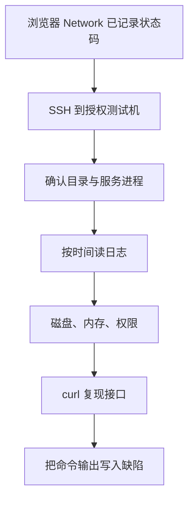
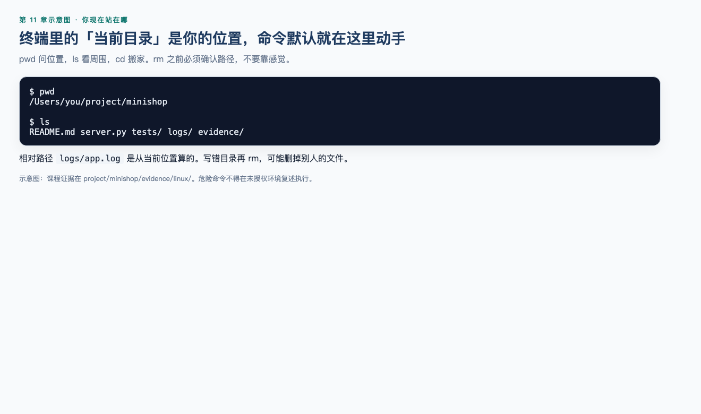
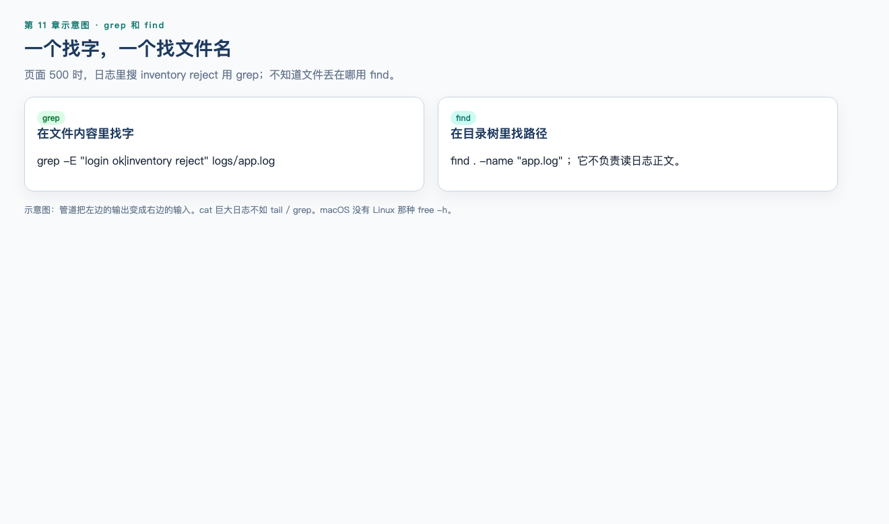
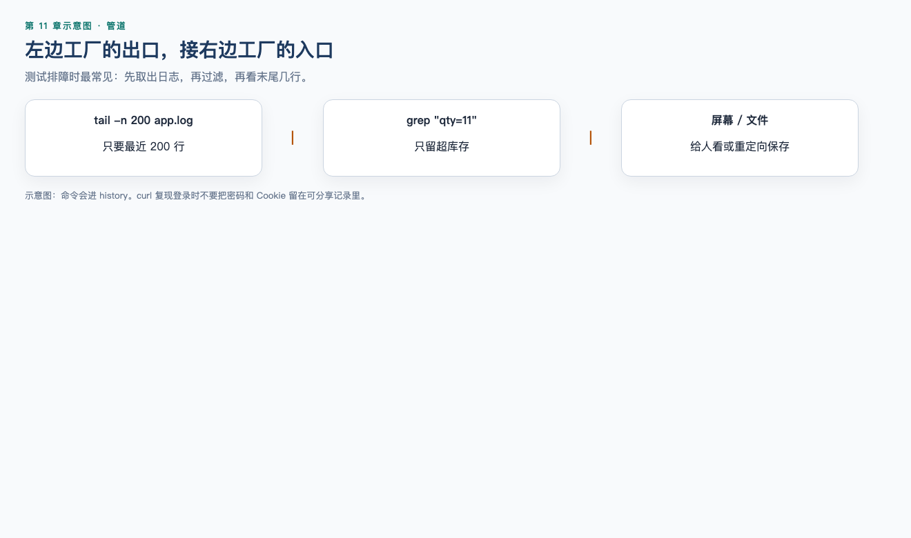

# 第 11 章：Linux

> **一句话核心：** 日志、进程和磁盘是页面上看不到的观察通道。

> 重要级别：⭐⭐⭐ 必须掌握  
> 主案例：MiniShop 个人软件测试实践项目

## 这一章解决什么问题

第 10 章能在浏览器里抓住登录请求。接口 500、页面空白或“偶现失败”时，证据往往在服务器上：进程在不在、磁盘满不满、日志里有没有 `ERROR`、同一条 curl 在服务端是什么结果。

初级测试工程师不需要成为 Linux 系统管理员，但要能在授权的测试机或跳板机上完成这些事：走进目录、读日志、查进程、看磁盘、用脱敏后的 curl 复现接口。

本章以 **Linux 服务器** 为目标环境。macOS 终端能练习大部分命令，但 `ls`、`grep`、`free` 等与 GNU/Linux 并不完全相同。正式排障应 SSH 到 Linux 测试机，不要假设本机 macOS 的输出可以原样写进缺陷。

Linux 与第 12 章的 SQL 是并列基础，互不作为硬前置。

## 学习目标

完成本章后，你应该能够：

- 说明终端、Shell 与文件系统路径的基本关系；
- 使用 `pwd`、`ls`、`cd` 在目录间移动并确认当前位置；
- 使用 `mkdir`、`touch`、`cp`、`mv`、`rm` 管理测试文件，并避免危险删除；
- 使用 `cat`、`less`、`head`、`tail` 阅读日志；
- 使用 `grep` 和 `find` 按内容和文件名查找；
- 使用管道与重定向组合命令；
- 使用 `ps`、`top`、`kill` 观察和终止进程，并知道 `-9` 不是第一步；
- 解释 `chmod` 常见权限，不把 `777` 当成默认修复；
- 使用 `df`、`du`、`free`、`which`、`echo`、`history` 做基础诊断；
- 说明 `ssh` 与 `scp` 的用途和授权边界；
- 在授权环境用 `curl` 做接口冒烟，并延续 Copy as cURL 的脱敏习惯；
- 完成一份 MiniShop Linux 排障记录。

## 前置知识

- 已完成第 1～10 章；
- 能阅读 HTTP 方法、状态码、Header 和 Body；
- 知道 Copy as cURL 必须删除 Cookie、Token 和密码；
- 不要求系统编程。需要一台可练习的终端：Linux、macOS，或 Windows 上的 WSL / 远程 SSH。

## 场景导入：页面 500，下一步去哪？

MiniShop 测试环境提交购物车数量 11 后，页面显示服务器错误。Network 里 `POST` 返回 `500`。

只停留在浏览器，缺陷只能写“接口 500”。登上授权测试机后，还可以查：

- 应用进程是否还在；
- `/var/log` 或应用日志目录是否有对应时间的 `ERROR`；
- 磁盘是否已满导致无法写日志或上传；
- 用同一条脱敏 curl 是否稳定复现。



只在自己拥有或明确获授权的主机上操作。不要扫描未授权网段、不要用 `rm -rf` 清理未知目录、不要把日志里的密码和 Token 贴到聊天工具。

---

## 11.1 终端、Shell 与你在做什么 ⭐⭐⭐

终端是输入命令的窗口。Shell 是解释命令的程序，Linux 测试机常见 `bash` 或 `zsh`。提示符里输入一行，回车后 Shell 执行并打印结果。

你输入的不是“电脑的心情”，而是：**程序名 + 选项 + 参数**。

```bash
ls -l /tmp
```

- `ls` 是程序；
- `-l` 是选项；
- `/tmp` 是参数。

看帮助：

```bash
ls --help
man ls
```

GNU/Linux 上 `ls --help` 通常可用。macOS 的 BSD `ls` 可能没有相同的 `--help`。不确定时用 `man ls`，用 `q` 退出手册页。

`which ls` 显示实际执行的是哪一个程序。环境 `PATH` 决定先找哪一个。测试机上若存在同名脚本，`which` 能避免“我敲的不是我想的那个”。

---

## 11.2 文件系统与路径 ⭐⭐⭐

Linux 目录是一棵树，根是 `/`。没有 Windows 那种 `C:` 盘符。常见位置：

| 路径 | 测试时为什么关心 |
| --- | --- |
| `/` | 整个系统的根，绝不是练习 `rm -rf` 的地方 |
| `/home/用户名` 或 `/root` | 个人目录；`~` 表示当前用户家目录 |
| `/tmp` | 临时文件，重启后可能被清 |
| `/var/log` | 系统和许多服务的日志 |
| `/etc` | 配置。没有授权不要改 |
| `/opt`、`/srv`、`/var/www` | 应用可能部署在这里 |

路径两种写法：

- **绝对路径**：从 `/` 开始，例如 `/var/log/nginx/error.log`；
- **相对路径**：从当前目录开始，例如 `./app.log`、`../logs`。

`.` 是当前目录，`..` 是上一级。确认位置永远比“感觉在哪”可靠：先 `pwd`。

隐藏文件以 `.` 开头，例如 `.env`。`ls` 默认不显示它们。配置和密钥常在这类文件里，**不要**把内容贴进缺陷单。

---

## 11.3 `pwd`、`ls`、`cd` ⭐⭐⭐




```bash
pwd
ls
ls -l
ls -la
ls -lh
cd /tmp
cd ~
cd -
cd ..
```

| 命令 | 作用 |
| --- | --- |
| `pwd` | 打印当前目录 |
| `ls` | 列出当前目录 |
| `ls -l` | 长格式：权限、所有者、大小、时间 |
| `ls -a` | 包含隐藏项 |
| `ls -h` | 与 `-l` 一起用时，大小更易读 |
| `cd 目录` | 进入目录 |
| `cd` 或 `cd ~` | 回到家目录 |
| `cd -` | 回到上一次目录 |
| `cd ..` | 上一级 |

`ls` 的选项可以组合，如 `ls -lah`。不同系统对颜色、排序的默认值不同；macOS 有时在权限后显示 `@` 或 `+`，表示扩展属性或 ACL，不等于权限坏了。缺陷里应粘贴命令和原文输出，不要只写“我 ls 了”。

进入不存在的目录会失败。先 `ls` 再 `cd`，或用 Tab 补全。

---

## 11.4 `mkdir`、`touch`、`cp`、`mv`、`rm` ⭐⭐⭐

在**自己的练习目录**里创建 MiniShop 排障练习，不要在 `/` 或别人的项目根目录乱建。

```bash
mkdir -p ~/minishop-linux-lab/logs
touch ~/minishop-linux-lab/logs/app.log
cp ~/minishop-linux-lab/logs/app.log ~/minishop-linux-lab/logs/app.log.bak
mv ~/minishop-linux-lab/logs/app.log.bak ~/minishop-linux-lab/logs/app.log.old
```

| 命令 | 作用 | 测试注意 |
| --- | --- | --- |
| `mkdir` | 建目录 | `-p` 可一次建多级 |
| `touch` | 建空文件或更新时间 | 不能当编辑器 |
| `cp` | 复制 | 覆盖前先确认目标是否存在 |
| `mv` | 移动或重命名 | 同样可能覆盖 |
| `rm` | 删除 | 默认不进回收站 |

删除前的纪律：

```bash
ls ~/minishop-linux-lab/logs/app.log.old
rm ~/minishop-linux-lab/logs/app.log.old
```

禁止：

- `rm -rf /`、`rm -rf /*`、在未确认路径时使用 `rm -rf *`；
- 对生产或共享目录“先删了再说”；
- 把 `sudo rm` 当成清理磁盘的常规手段。

`-r` 递归目录，`-f` 强制。两者组合威力最大，也最容易误伤。测试工程师没有授权时，应申请清理，而不是自己递归删除。

---

## 11.5 `cat`、`less`、`head`、`tail` ⭐⭐⭐

日志可能很大。不要一上来 `cat` 几百兆文件把终端打爆。

```bash
head -n 20 app.log
tail -n 50 app.log
tail -n 100 app.log | less
less app.log
```

| 命令 | 作用 |
| --- | --- |
| `cat` | 把整个文件打到终端；只适合短文件 |
| `head -n 20` | 前 20 行 |
| `tail -n 50` | 后 50 行，常看最新日志 |
| `tail -f` | 持续跟踪新追加的行，复现时开着它；`Ctrl+C` 停止 |
| `less` | 分页阅读。空格翻页，`/` 搜索，`q` 退出 |

教学日志示例（写入练习文件，不是 MiniShop 正式日志格式）：

```text
2026-09-08 13:01:02 INFO  login ok user=13800138000
2026-09-08 13:01:05 ERROR inventory reject sku=SKU-DEMO-001 stock=10 qty=11
```

若日志里出现密码或 Token，记录缺陷时脱敏，并应作为安全问题提出：日志不该保存明文凭证。

---

## 11.6 `grep` 与 `find` ⭐⭐⭐




`grep` 在**文件内容**里找文本。`find` 在**目录树**里找文件。

```bash
grep ERROR app.log
grep -n ERROR app.log
grep -i error app.log
grep -E "ERROR|WARN" app.log
find . -name "*.log"
find . -name "*minishop*"
```

| 选项 | 作用 |
| --- | --- |
| `grep -n` | 显示行号 |
| `grep -i` | 忽略大小写 |
| `grep -R` | 递归目录（GNU grep 常用；有的系统用 `grep -r`） |
| `find . -name '*.log'` | 按文件名模式找 |

组合：

```bash
grep ERROR app.log | tail -n 20
```

先缩小范围再搜索。在 `/` 上无限制 `find / -name '*'` 会很慢，且可能因权限刷大量报错。测试排障应从已知日志目录开始。

`grep` 的正则在 GNU 与 BSD 上略有差异。写进缺陷的应是你**实际执行**的命令和匹配行，而不是“标准答案里的那条”。

---

## 11.7 管道与重定向 ⭐⭐⭐




管道 `|` 把左边的输出变成右边的输入。

```bash
tail -n 200 app.log | grep inventory
ps aux | grep minishop
```

重定向把输出写入文件：

```bash
echo "hello MiniShop lab" > /tmp/minishop-linux-hello.txt
echo "second line" >> /tmp/minishop-linux-hello.txt
ls /no/such/path 2> /tmp/minishop-linux-err.txt
```

| 写法 | 作用 |
| --- | --- |
| `>` | 写入文件，覆盖已有内容 |
| `>>` | 追加 |
| `2>` | 重定向标准错误 |
| `2>&1` | 把错误并进标准输出，常与管道一起用 |

`>` 会覆盖。导出日志前用 `ls` 看目标文件是否已有内容。不要把带密码的 curl 输出重定向到共享目录。

过滤进程时，`ps aux | grep minishop` 可能匹配到 grep 自己。这是常见干扰，不等于真有两个应用进程。可用 `pgrep -a minishop`（若系统有）或看完整命令行再判断。

---

## 11.8 `ps`、`top`、`kill` ⭐⭐⭐

页面超时有时是进程已经不在，而不是“接口逻辑写错”。

```bash
ps aux
ps aux | grep -v grep | grep minishop
```

`ps aux` 列出进程。不同系统列含义相近：用户、PID、CPU、内存、命令行。记下 **PID**（进程号），后续 `kill` 用它。

`top` 动态刷新 CPU 和内存。按 `q` 退出。适合看“此刻谁把 CPU 打满”，不适合当日志工具。

结束进程：

```bash
kill 12345
```

默认发送 `TERM`（15）：请求进程自己退出并做清理。确认授权且进程仍无响应后，才考虑：

```bash
kill -9 12345
```

`-9` 是 `KILL`，进程不能捕获、不能做清理。可能留下锁文件或未完成的写入。**不要把 `kill -9` 当成第一反应。** 不要对未知 PID 下手。不要在生产上杀进程，除非变更窗口和授权已经明确。

`kill` 需要你对目标进程有权限。杀不掉不等于命令无效，可能是权限或 PID 已经变了。先 `ps` 再杀，杀完再 `ps` 验证。

---

## 11.9 `chmod` ⭐⭐

每个文件有读（r）、写（w）、执行（x）权限，分所有者、组、其他人。`ls -l` 最左边一列就是权限。

常见数字：

| 模式 | 含义 | 常见用途 |
| --- | --- | --- |
| `644` | `rw-r--r--` | 普通文件 |
| `755` | `rwxr-xr-x` | 可执行脚本或目录 |
| `600` | `rw-------` | 仅自己读写，密钥类 |

```bash
chmod 644 app.log
```

`777`（谁都可以读写执行）不是排障的默认答案。它能让“权限不够”暂时消失，也会让测试机上的日志和脚本被任意修改。真正做法是：看 `ls -l` 的所有者和权限，申请正确的组或 ACL，而不是把目录改成对世界可写。

没有授权不要改系统目录权限。测试发现应用因权限无法写日志，应记录路径和 `ls -l` 输出，交给负责环境的人。

---

## 11.10 `df`、`du`、`free`、`which`、`echo`、`history` ⭐⭐⭐

| 命令 | 作用 | 测试场景 |
| --- | --- | --- |
| `df -h` | 文件系统剩余空间 | 上传失败、无法写日志、数据库报磁盘满 |
| `du -sh 目录` | 该目录占用 | 哪个日志把盘打满 |
| `free -h` | 内存（**Linux**） | 进程被 OOM 杀掉的线索 |
| `which curl` | curl 在哪 | 命令找不到、有多个版本 |
| `echo $HOME` | 打印文本或变量 | 确认家目录、拼路径 |
| `history` | 历史命令 | 复盘自己刚执行过什么；分享前删掉含密码的行 |

`free -h` 是 Linux 命令。macOS 默认没有同样的 `free`。在 macOS 练习机上不要因为 `free` 失败就写“内存命令坏了”；到 Linux 测试机再执行。

磁盘满时应用可能突然 500，日志也可能写不进去。先 `df -h`，再 `du -sh` 缩小目录，不要一上来 `rm -rf /var/log`。

`history` 可能保存你用 curl 打过的密码。发现后应改测试密码，并学习用环境变量或文件提供敏感参数，而不是把密码写在命令行。第 10 章的脱敏在这里同样有效。

---

## 11.11 `ssh` 与 `scp` ⭐⭐⭐

`ssh` 登录远程 Linux。`scp` 在本机和远程之间复制文件。

```bash
ssh tester@192.0.2.10
scp app.log tester@192.0.2.10:~/logs/
scp tester@192.0.2.10:/var/log/minishop/app.log ./
```

`192.0.2.10` 是文档用示例地址，不是真实 MiniShop 主机。实际地址、账号和跳板规则以团队为准。

纪律：

- 只连接授权清单里的测试机；
- 首次连接会提示主机指纹，应与团队公布的指纹核对，不要习惯性输入 `yes` 后把密码发给未知主机；
- 密钥比把密码写进脚本更合适；私钥权限常为 `600`；
- `scp` 下来的日志同样可能含个人信息，发送前脱敏；
- 退出远程会话用 `exit` 或 `Ctrl+D`，确认提示符已经回到本机再执行 `rm`。

跳板机、堡垒机、VPN 各团队不同。本章不教破解 SSH，只要求你会在获准的路径上登录和拷日志。

---

## 11.12 日志定位 ⭐⭐⭐

测试工程师在 Linux 上最值钱的能力之一：按**时间**和**关键字**找到与本次失败对应的一行。

常见来源（名称因发行版和应用而异）：

| 来源 | 例子 |
| --- | --- |
| 系统日志 | `/var/log/syslog`、`/var/log/messages` |
| systemd | `journalctl -u 服务名 -n 100 --no-pager` |
| Web 反向代理 | `/var/log/nginx/access.log`、`error.log` |
| 应用日志 | `/var/log/minishop/` 或应用配置里的 path（教学名，未冻结） |

建议步骤：

1. 问清或查看部署文档里的日志路径，不要在整个盘盲搜；
2. `ls -lh` 确认文件大小和最近修改时间；
3. `tail -n 100` 看最新；复现时用 `tail -f`；
4. `grep` 错误关键字、请求 ID、手机号后四位或 SKU（按隐私规则最小化）；
5. 把**时间戳对齐** Network 里那条失败请求的时间；
6. 复制少量相关行到缺陷，脱敏。

`journalctl` 在无 systemd 的容器或旧系统上可能不可用。命令失败时改找文件日志，不要编造输出。

访问日志可能有 IP、Cookie。缺陷里保留能复现的最小集合。

---

## 11.13 `curl` 接口测试 ⭐⭐⭐

`curl` 在终端发 HTTP 请求。它复现的是接口，不是浏览器渲染。第 10 章 Copy as cURL 的结果，脱敏后可以在这里跑。

最小读取。下面 `PORT` 和 `/products` 是**教学占位**，不要对着正在跑的 MiniShop 原样粘贴。v1.0 是 `http://127.0.0.1:8765/api/products`。

```bash
curl -sS -D - -o ./minishop-curl-body.txt "http://127.0.0.1:PORT/products?keyword=mouse"
```

| 选项 | 作用 |
| --- | --- |
| `-sS` | 安静模式但仍显示错误 |
| `-D -` | 把响应头打到终端 |
| `-o 文件` | 响应体写入文件 |
| `-i` | 头和 Body 一起显示 |
| `-v` | 更详细，含请求头；可能刷出 Cookie |
| `-X POST` | 指定方法 |
| `-H` | 添加头 |
| `-d` | 请求体 |
| `--max-time 10` | 超时秒数 |
| `-w '%{http_code}'` | 额外打印状态码，便于脚本化记录 |
| `-k` | 忽略 TLS 证书错误；**仅**在已知原因的测试环境使用 |

教学 POST（密码占位，勿写入真实密码）。路径 `/login` 与端口 `8080` 仍是教学占位；MiniShop v1.0 为 `POST http://127.0.0.1:8765/api/login`。

```bash
curl -sS -D - \
  -H "Content-Type: application/json" \
  -d '{"phone":"13800138000","password":"<redacted>"}' \
  "http://127.0.0.1:PORT/login"
```

对照第 9 章阅读状态行、`Content-Type`、`Set-Cookie` 和 Body。`200` 仍要看 Body 是否业务失败。若头和 Body 混在一起不便复制，可用 `-D` 把头打到终端、`-o` 把 Body 写入文件，或用 `-w '%{http_code}\n'` 单独记录状态码。

纪律：

- 只打授权测试环境，不打生产，不对未授权主机做爆破；
- 不要 `curl https://未知地址 | sh` 或 `curl … | bash`；
- `-k` 不是“HTTPS 可有可无”，证书问题应记录，而不是习惯性跳过；
- 命令行中的密码会出现在 `history` 和进程列表，优先占位符或团队批准的测试密钥文件；
- GET 搜索可以带 query；登录、下单用 POST 是语义，不是“POST 更加密”。HTTPS 仍然必要。

第 13、14 章会用更完整的接口文档和 Postman。本章只要求：能把浏览器里的失败用 curl 在服务器可达的地址上再打一次，并保存状态码与 Body 类型。

---

配套可运行实操：[实操 11-1 日志 grep](../practice/11-log-grep/README.md)（`python3 practice/run.py 11-1`）。工作实战再补上 `pwd`/`ls`/`df` 和脱敏 curl。

## MiniShop 工作实战：Linux 排障包

在本机练习目录或授权测试机完成。不要对真实生产执行 `rm`、`kill`、`chmod 777` 或未脱敏 curl。

请提交：

1. `pwd` / `ls` / 练习目录结构；
2. 一份短日志的 `tail` + `grep` 结果；
3. `df -h` 或等价磁盘观察（Linux 再加 `free -h`）；
4. 一条脱敏 curl（GET 或 POST）及状态码；
5. 若有远程机：说明如何 SSH（可打码主机名），没有则写“仅本机练习”及原因。

建议保存为：

```text
exercises/chapter-11-minishop-linux.md
```

仓库已有本机真实输出（2026-09-09，`python3 run.py evidence`），优先对照，不要用手写假日志冒充：

```bash
cd project/minishop
pwd
ls
grep -E "login ok|inventory reject" evidence/logs/app-sample.log
df -h .
```

审查摘录：

```text
login ok user=13800138000
inventory reject sku=SKU-DEMO-001 stock=10 qty=11
```

完整文件：`evidence/linux/pwd-ls.txt`、`evidence/linux/grep-app-log.txt`、`evidence/linux/df.txt`、`evidence/linux/curl-login-headers.txt`（Set-Cookie 已打码）。

若要在家目录另建练习场，可以用上面同一格式自己造一份**练习用**日志，但课程证据以 `evidence/` 为准。

```markdown
# MiniShop Linux 排障记录

## 环境
- 本机系统：
- 是否 Linux 测试机 / SSH：
- 日期：

## 目录与文件
- pwd：
- ls 输出摘要：

## 日志
- 命令：
- 匹配行（已脱敏）：

## 资源
- df -h 关键行：
- free -h（仅 Linux）：

## curl
- 方法与 URL（无密码）：
- 状态码：
- Content-Type：
- 是否删除 Cookie/Token：是

## 结论
- 与浏览器 Network 如何交叉验证：
- 未做的危险操作（rm -rf / kill -9 / chmod 777）：确认未做
```

完成标准：

- 有 `pwd`、一次日志检索、一次磁盘观察、一次 curl；
- curl 无明文密码；
- 能说明 `grep` 与 `find` 的差别；
- 能说明为什么不先 `kill -9`、不先 `chmod 777`。

---

## 常见错误

### 错误 1：在未确认路径时 `rm -rf`

修正：先 `pwd` 和 `ls`。删除不可恢复。

### 错误 2：`chmod 777` 解决一切权限问题

修正：记录 `ls -l`，申请正确权限。`777` 会扩大攻击面。

### 错误 3：进程卡住立刻 `kill -9`

修正：先 `kill`（TERM），再验证，最后才在授权下用 `-9`。

### 错误 4：`cat` 整个巨大日志

修正：`tail`、`less`、`grep`。

### 错误 5：把 macOS 上跑不通的 `free` 写成产品缺陷

修正：确认命令是否属于目标 Linux。本机与服务器是两台机器。

### 错误 6：Copy as cURL 不过滤就在服务器上执行并贴到群里

修正：删除凭证；只打测试环境。

### 错误 7：`curl … | bash` 安装未知脚本

修正：不在测试机上执行不信任管道。

### 错误 8：日志时间与 Network 时间不对齐就当无关

修正：核对时区。服务器可能是 UTC。

### 错误 9：`ps | grep` 看到 grep 自己，报告启动了两个实例

修正：看完整命令行。

### 错误 10：用 `-k` 长期跳过测试环境证书错误且不记录

修正：证书问题本身可能是缺陷或环境风险。

---

## 面试角度 ⭐⭐⭐

回答顺序：结论 → 原理 → 场景 → 示例 → 边界。

### 测试为什么要会 Linux？

结论：许多缺陷的证据在服务器日志、进程和磁盘上，浏览器看不到。  
示例：接口 500 时 `tail`/`grep` 对齐时间戳。  
边界：不是要你接管生产主机。

### `grep` 和 `find` 有什么区别？

结论：`grep` 搜内容，`find` 搜文件名和路径。  
示例：`find` 找到 `*.log`，再 `grep ERROR`。  
边界：两者都能递归，但目的不同。

### 磁盘满了会有什么测试现象？如何确认？

结论：上传失败、无法写日志、突然 500。用 `df -h` 看挂载点，用 `du -sh` 找目录。  
边界：不要未经授权清空日志目录。

### 怎样安全地停掉一个测试进程？

结论：确认 PID 与命令行，先 `kill`，再 `ps` 验证，授权后再考虑 `kill -9`。  
边界：杀错进程会使整台测试机不可用。

### 如何用 curl 验证登录接口？

结论：对授权 URL 发 POST，看状态码、`Set-Cookie` 或 Body，不把密码写进可分享记录。  
示例：对照第 9 章报文结构。  
边界：curl 成功不代表页面渲染成功。

---

## 小练习

### 练习 1

`pwd` 和 `ls -l` 各回答什么问题？为什么进入未知目录前要先执行它们？

### 练习 2

相对路径 `../logs/app.log` 依赖于什么？怎样改成更不容易搞错的写法？

### 练习 3

为什么不建议对未知日志文件直接 `cat`？应改用哪些命令？

### 练习 4

要找包含 `inventory` 的日志行，以及文件名以 `.log` 结尾的文件，分别更适合 `grep` 还是 `find`？

### 练习 5

`tail -n 100 app.log | grep ERROR` 在做什么？把 `>` 和 `|` 弄反会有什么风险？

### 练习 6

哪一项是更合理的进程处理顺序？

A. `kill -9` → 再看 PID  
B. 确认命令行与授权 → `kill` → `ps` 验证 → 必要时才 `-9`  
C. `chmod 777` 进程文件  
D. `rm` 掉进程对应的可执行文件

### 练习 7

测试环境上传失败。`df -h` 显示 `/` 使用率 100%。下一步应做什么、不应做什么？

### 练习 8

从 DevTools 复制的 cURL 含有 Cookie。在 Linux 测试机执行前要改什么？执行后能证明前端按钮逻辑正确吗？

### 练习 9

macOS 上输入 `free -h` 失败。这能说明 MiniShop 内存泄漏吗？

### 练习 10

根据教学日志，写出一条能定位 `SKU-DEMO-001` 库存拒绝的命令，并说明缺陷里应粘贴哪些输出、应去掉什么。

## 练习答案

1. `pwd` 回答“我在哪”；`ls -l` 回答“这里有什么、权限和修改时间如何”。未确认就 `rm`/`cd` 容易操作错目录。
2. 依赖于当前工作目录。更稳妥使用绝对路径，或先 `cd` 到固定目录再操作。
3. 大文件会让终端卡死或刷掉有用信息。用 `head`、`tail`、`less`、`grep`。
4. 内容用 `grep`；按文件名用 `find . -name '*.log'`。
5. 取日志最后 100 行再筛 `ERROR`。`>` 会覆盖文件；若写成 `grep ERROR > app.log` 可能毁掉日志。
6. B。
7. 用 `du -sh` 找大目录，申请授权后再清理。不应 `rm -rf /var/log` 或 `chmod 777`。
8. 删除或替换 Cookie、Token、密码；确认测试 URL。不能证明按钮绑定和渲染，只验证该 HTTP 请求。
9. 不能。`free` 主要是 Linux 命令，失败多半是本机系统差异。到 Linux 测试机再看内存。
10. 示例：`grep SKU-DEMO-001 ~/minishop-linux-lab/logs/app.log`。粘贴命令、匹配行和时间戳；去掉密码、完整会话 ID 和无关个人信息。

---

## 本章检查清单

- [ ] 我能解释终端和路径，并先 `pwd` 再操作
- [ ] 我会 `ls`、`cd`、`mkdir`、`cp`、`mv`，删除前先确认
- [ ] 我会用 `tail`/`less`/`grep` 而不是盲目 `cat`
- [ ] 我能区分 `grep` 和 `find`
- [ ] 我会用管道和 `>` / `>>`，并知道覆盖风险
- [ ] 我知道 `kill` 先于 `kill -9`
- [ ] 我不会把 `chmod 777` 当常规修复
- [ ] 我会 `df -h`，并知道 `free -h` 是 Linux 命令
- [ ] 我能说明 `ssh`/`scp` 只用于授权主机
- [ ] 我能按时间对齐日志与 Network
- [ ] 我能用脱敏 curl 做接口冒烟
- [ ] 我能完成 Linux 排障记录

### 进入下一章的自测门槛

1. 练习 1～10 至少完成 9 题，且第 4、6、8、9 题能用自己的话回答；
2. 在练习目录亲手执行：建目录、写短日志、`grep`、`df -h`；
3. 完成一次不含明文密码的 curl；
4. 能口述 `rm -rf`、`kill -9`、`chmod 777` 各自的主要风险。

## 本章总结

本章需要真正掌握七件事：

1. 先确认路径再改文件；
2. 日志用 `tail`/`grep`/`less`，并对齐时间；
3. `grep` 搜内容，`find` 搜文件；
4. 管道组合命令，`>` 会覆盖；
5. 进程先观察再优雅终止；
6. 磁盘和内存能解释一部分“突然 500”；
7. curl 在授权环境复现接口，凭证必须脱敏。

## 本章可运行性说明

下列命令已在审查环境的临时练习目录与本地教学 HTTP 服务上验证：`pwd`、`ls`、`mkdir`、`touch`、`cp`、`mv`、`rm`（仅删除练习文件）、`cat`、`head`、`tail`、`grep`、`find`、`echo`、重定向、`df`、`du`、`which`、`ps`、`chmod`（仅练习文件）、`curl` GET/POST。审查主机若为 macOS，`free -h` 按正文约定视为 Linux 专用，不作为本机必过项。

`ssh`/`scp`、`top`、`kill`、`journalctl` 依赖真实远程主机或交互界面，正文以示例结构说明，不冒充已对 MiniShop 生产主机执行。

教学日志、IP `192.0.2.10`、路径 `/var/log/minishop/` 均未冻结为正式规格。危险命令不得在未授权环境复述执行。

## 参考资料

- [GNU Coreutils 手册](https://www.gnu.org/software/coreutils/manual/coreutils.html)（本章于 2026-09-08 核验）
- [grep 手册](https://www.gnu.org/software/grep/manual/)
- [curl 手册](https://curl.se/docs/manpage.html)
- [OpenSSH](https://www.openssh.com/)
- 本仓库 [第 9 章：计算机网络与 HTTP](09-computer-network-and-http.md)
- 本仓库 [第 10 章：Chrome DevTools](10-chrome-devtools.md)
- 本仓库 [全局内容质量标准](../standards/QUALITY_STANDARD_v1.0.md)

## 下一章预告

下一章进入第 12 章（上）《数据库与查询》：[12a-sql-query.md](12a-sql-query.md)。先学会 SELECT 再改数。
