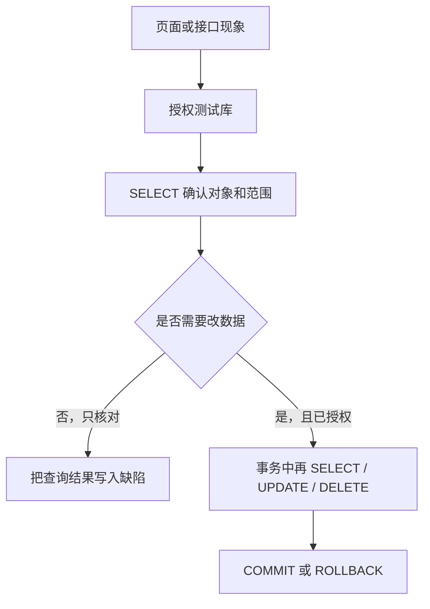

# 第 12 章：数据库与 SQL

> 重要级别：⭐⭐⭐ 必须掌握  
> 核心章节发布目标：≥95/100  
> 主案例：MiniShop 个人软件测试实践项目

## 这一章解决什么问题

页面显示购物车数量为 11，并不等于数据库里就是 11。接口返回成功，也不等于库存一定被扣减。测试工程师需要一种办法，在授权测试库里直接核对：**行还在不在、字段是什么、表之间的关系有没有断。**

本章教够用的 SQL：会 `SELECT`，会用 `WHERE`/`JOIN` 把用户、商品、购物车连起来，会在改数据前先查出范围，会用事务保证练习可回滚。

Linux 看机器和日志；SQL 看库里的行。两者一起，才能把“页面显示 11”核对成库存字段。

本章所有修改只允许发生在**授权测试库**。生产库、客户库、没有 WHERE 的 `UPDATE`/`DELETE`、以及随意 `DROP`/`TRUNCATE`，都不在初级测试的日常权限里。

## 学习目标

完成本章后，你应该能够：

- 说明数据库、表、行、列，以及关系型与非关系型的基本差别；
- 解释主键、外键，以及它们如何约束 MiniShop 教学数据；
- 对应 CRUD 与 `INSERT`/`SELECT`/`UPDATE`/`DELETE`；
- 编写带 `WHERE`、逻辑运算、`ORDER BY`、`LIMIT`、`DISTINCT` 的查询；
- 使用聚合、`GROUP BY`、`HAVING`；
- 使用 `INNER JOIN` 和 `LEFT JOIN` 做跨表核对；
- 正确处理 `NULL`（不用 `=` 判断空）；
- 在授权库中按“先 SELECT、再改、优先事务”的纪律使用 `UPDATE`/`DELETE`；
- 说明 `COMMIT` 与 `ROLLBACK`；
- 用 SQL 验证 MiniShop 教学规则：购物车数量不得超过库存。

## 前置知识

- 已完成第 1～11 章，或至少完成第 1～6 章与第 8、9 章（Linux 与 SQL 并列，不互为硬前置）；
- 理解测试点、用例和缺陷报告；
- 不要求成为数据库管理员或编写存储过程。

## 场景导入：页面是 11，库里是多少？

沿用第 4、6 章教学规则：登录用户修改购物车数量时，数量必须是正整数且不得超过提交时可售库存。

Network 里看到数量改成了 11 且没有失败提示。此时至少有三种可能：

1. 库里的 `qty` 已经是 11，`stock` 仍是 10——数据已违反规则；
2. 库里没有写成 11，只是页面算错或缓存——问题更像前端或接口响应；
3. 写进了另一张表或另一个用户的购物车——定位错误对象。

没有 SQL，这三种会混成一句“购物车有问题”。



> 本章表结构、SKU、手机号和库存数字是**教学库**，用于把 SQL 跑通。它们不是仓库级 MiniShop 正式 PRD，也不冻结订单状态或接口路径。

---

## 12.1 数据库是什么 ⭐⭐⭐

数据库是按规则组织、可查询、可持久保存的数据集合。测试关心的不是“有一个叫 MySQL 的软件”，而是：

- 业务状态最终落在哪里；
- 怎样用查询证明页面、接口、日志一致或不一致；
- 怎样在不破坏测试环境的前提下准备和清理数据。

几个词：

| 词 | 含义 | 教学例子 |
| --- | --- | --- |
| 表（Table） | 一类实体的集合 | `products` |
| 行（Row / Record） | 一条记录 | SKU-DEMO-001 这一行 |
| 列（Column / Field） | 一种属性 | `stock` |
| 模式/库（Schema / Database） | 表的容器 | 教学库 `minishop_lab` |

常见引擎：MySQL、PostgreSQL、SQLite。本章查询语句尽量通用。**建表语法因引擎而异**；文末教学脚本用 SQLite，因为零安装即可验证。连公司测试库时，以团队提供的 MySQL 或 PostgreSQL 为准。

---

## 12.2 关系型与非关系型 ⭐⭐

**关系型数据库**用表、主键、外键表达实体和关系，用 SQL 查询。MiniShop 教学库采用这种模型：用户、商品、购物车行可以互相引用。

**非关系型（NoSQL）**不是一种产品，而是一类不同模型的统称，例如文档库、键值库、列族、图。它们可能不用 SQL，或只用部分 SQL。测试时仍要问：数据在哪、怎样读、怎样确认写入、怎样隔离测试账号。

不要说“关系型一定过时”或“NoSQL 一定更快”。选型是架构决策。初级测试工程师先掌握 SQL，因为电商类系统和大多数后端测试环境仍大量使用关系型库。

---

## 12.3 主键与外键 ⭐⭐⭐

**主键（Primary Key）**唯一标识一行。同一张表里主键不能重复，也不能为 `NULL`。

**外键（Foreign Key）**引用另一张表的主键，用来约束“购物车必须属于已存在的用户、必须指向已存在的商品”。

```text
users.id  <----- cart_items.user_id
products.id <----- cart_items.product_id
```

没有外键时，库里可能出现 `user_id = 99` 这种幽灵用户。有外键且引擎真正启用约束时，这样的插入应失败。

SQLite 默认**不强制**外键，需要 `PRAGMA foreign_keys = ON;`。MySQL 需使用支持外键的引擎（常见 InnoDB）。PostgreSQL 默认强制外键。测试前要问清：约束开了没有，不要假设“有外键列就一定插不进去”。

---

## 12.4 教学库：三张表 ⭐⭐⭐

```sql
PRAGMA foreign_keys = ON;

CREATE TABLE users (
  id INTEGER PRIMARY KEY,
  phone TEXT NOT NULL UNIQUE,
  display_name TEXT
);

CREATE TABLE products (
  id INTEGER PRIMARY KEY,
  sku TEXT NOT NULL UNIQUE,
  name TEXT NOT NULL,
  stock INTEGER NOT NULL
);

CREATE TABLE cart_items (
  id INTEGER PRIMARY KEY,
  user_id INTEGER NOT NULL,
  product_id INTEGER NOT NULL,
  qty INTEGER NOT NULL,
  FOREIGN KEY (user_id) REFERENCES users(id),
  FOREIGN KEY (product_id) REFERENCES products(id)
);

INSERT INTO users(id, phone, display_name) VALUES
  (1, '13800138000', 'Tester A'),
  (2, '13800138001', 'Tester B'),
  (3, '13800138002', NULL);

INSERT INTO products(id, sku, name, stock) VALUES
  (1, 'SKU-DEMO-001', '无线鼠标', 10),
  (2, 'SKU-DEMO-002', '键盘', 5),
  (3, 'SKU-DEMO-003', '耳机', 3);

INSERT INTO cart_items(id, user_id, product_id, qty) VALUES
  (1, 1, 1, 1),
  (2, 1, 2, 2),
  (3, 2, 1, 1);
```

第三位用户 `13800138002` 的 `display_name` 为 `NULL`，是为了练习 `COUNT` 与 `IS NULL`。MiniShop v1.0 的第三个账号是管理员 `13800138099`，不要把教学库用户 3 当成项目管理员。

手机号用文本，不用整数：避免丢掉前导零，也避免把号码当成可以拿来加减的量。

示例数据（审查时已插入并查询）：

| users.id | phone | display_name |
| --- | --- | --- |
| 1 | 13800138000 | Tester A |
| 2 | 13800138001 | Tester B |
| 3 | 13800138002 | NULL |

| products.sku | name | stock |
| --- | --- | --- |
| SKU-DEMO-001 | 无线鼠标 | 10 |
| SKU-DEMO-002 | 键盘 | 5 |
| SKU-DEMO-003 | 耳机 | 3 |

| cart_items | user_id | product_id | qty |
| --- | --- | --- | --- |
| 1 | 1 | 1 | 1 |
| 2 | 1 | 2 | 2 |
| 3 | 2 | 1 | 1 |

MySQL 建表常用 `INT AUTO_INCREMENT`，PostgreSQL 常用 `GENERATED … AS IDENTITY` 或 `SERIAL`。查询部分下面通用。

---

## 12.5 CRUD ⭐⭐⭐

| 操作 | SQL | 测试用途 |
| --- | --- | --- |
| Create | `INSERT` | 准备账号、商品、购物车行 |
| Read | `SELECT` | 核对页面、接口、日志 |
| Update | `UPDATE` | 构造库存不足等前置（须授权） |
| Delete | `DELETE` | 清理自己插入的测试数据（须授权） |

日常测试 **Read 最多**。没有授权不要在共享测试库里批量改生产形态的数据。

---

## 12.6 `SELECT` ⭐⭐⭐

```sql
SELECT id, phone, display_name
FROM users;
```

- `SELECT` 后面是列；`*` 表示全部列，探索阶段可用，自动化里应写出真正关心的列；
- `FROM` 后面是表；
- 字符串用**单引号**：`'13800138000'`。双引号在标准 SQL 里常表示标识符，不要拿来写手机号。

```sql
SELECT id, phone, display_name
FROM users
WHERE phone = '13800138000';
```

审查结果：`id = 1`，`display_name = Tester A`。

---

## 12.7 `WHERE` 与逻辑运算 ⭐⭐⭐

`WHERE` 限制哪些行进入结果。

```sql
SELECT sku, name, stock
FROM products
WHERE stock >= 5 AND stock <= 10;

SELECT sku, stock
FROM products
WHERE stock < 5 OR sku = 'SKU-DEMO-001';

SELECT sku, name
FROM products
WHERE name LIKE '%鼠标%';

SELECT sku, stock
FROM products
WHERE sku IN ('SKU-DEMO-001', 'SKU-DEMO-002');

SELECT sku, stock
FROM products
WHERE stock BETWEEN 3 AND 5;
```

| 写法 | 含义 |
| --- | --- |
| `AND` / `OR` / `NOT` | 逻辑组合；复杂条件加括号 |
| `LIKE '%鼠标%'` | `%` 匹配任意长度，`_` 匹配单个字符 |
| `IN (…)` | 属于列表 |
| `BETWEEN 3 AND 5` | 闭区间，含 3 和 5 |

审查中 `BETWEEN 3 AND 5` 命中库存 5 的键盘和库存 3 的耳机。

比较数字列时不要加引号：`stock >= 5` 正确；`'5'` 会迫使引擎做类型转换，不同库行为可能不同。

### 了解：不要把用户输入拼进 SQL

在授权教学库里应知道：如果应用把搜索词直接拼进语句，输入可能改变查询结构。测试只在自有或授权环境观察参数化（预编译/绑定变量）是否被使用，**禁止**对未授权系统做注入攻击。本章不把攻击载荷当作练习答案。

---

## 12.8 排序、限制、去重 ⭐⭐⭐

```sql
SELECT sku, stock
FROM products
ORDER BY stock DESC, sku ASC
LIMIT 2;
```

审查结果：先 `SKU-DEMO-001`（10），再 `SKU-DEMO-002`（5）。

```sql
SELECT DISTINCT user_id
FROM cart_items;
```

审查结果：`1` 和 `2`。用户 3 没有购物车行，不会出现。

`LIMIT` 在 MySQL、PostgreSQL、SQLite 中常用。SQL Server 常用 `TOP` 或 `FETCH`。写缺陷时注明引擎。

没有 `ORDER BY` 的 `LIMIT` 不保证每次同一行。需要“前两名库存”时必须排序。

---

## 12.9 聚合、`GROUP BY`、`HAVING` ⭐⭐⭐

聚合把多行收成统计值。

```sql
SELECT COUNT(*) AS user_count FROM users;
SELECT COUNT(display_name) AS named_count FROM users;
SELECT SUM(qty) AS qty_sum FROM cart_items;
SELECT AVG(stock) AS stock_avg FROM products;
SELECT MIN(stock) AS stock_min, MAX(stock) AS stock_max FROM products;
```

审查结果：`user_count = 3`；`named_count = 2`（`NULL` 的显示名不计入 `COUNT(display_name)`）；`qty_sum = 4`；`stock_avg = 6.0`；最小库存 3，最大 10。

`COUNT(*)` 计行；`COUNT(列)` 不计该列为 `NULL` 的行。

```sql
SELECT product_id, COUNT(*) AS line_count, SUM(qty) AS qty_sum
FROM cart_items
GROUP BY product_id;
```

审查结果：商品 1 有 2 行合计数量 2；商品 2 有 1 行合计数量 2。

`WHERE` 在分组**前**过滤行；`HAVING` 在分组**后**过滤组：

```sql
SELECT product_id, COUNT(*) AS line_count
FROM cart_items
GROUP BY product_id
HAVING COUNT(*) > 1;
```

只有被两个用户加购的商品 1 会留下。

出现在 `SELECT` 中的非聚合列，一般必须出现在 `GROUP BY` 中。MySQL 在某些模式下较松，不要依赖这种宽松行为。

---

## 12.10 `JOIN` ⭐⭐⭐

购物车行本身没有手机号和库存，必须关联。

**INNER JOIN** 只保留两边都匹配的行：

```sql
SELECT u.phone, p.sku, c.qty, p.stock
FROM cart_items AS c
INNER JOIN users AS u ON c.user_id = u.id
INNER JOIN products AS p ON c.product_id = p.id
WHERE u.phone = '13800138000';
```

审查结果：

| phone | sku | qty | stock |
| --- | --- | --- | --- |
| 13800138000 | SKU-DEMO-001 | 1 | 10 |
| 13800138000 | SKU-DEMO-002 | 2 | 5 |

**LEFT JOIN** 保留左表全部行，右表没有匹配则为 `NULL`：

```sql
SELECT p.sku, c.qty
FROM products AS p
LEFT JOIN cart_items AS c ON c.product_id = p.id
ORDER BY p.sku;
```

审查结果：`SKU-DEMO-001` 出现两次（两个用户的购物车），`SKU-DEMO-003` 的 `qty` 为空——没有人加购耳机。LEFT JOIN 可能让左表一行变成多行，核对数量时不要把“结果行数”直接当成“商品数”。

`ON` 写连接条件，`WHERE` 写过滤。把过滤写进 `ON` 还是 `WHERE`，在 LEFT JOIN 上可能改变“未匹配行是否留下”。初学先把关系放 `ON`，过滤放 `WHERE`，再对 LEFT JOIN 的空行单独观察。

---

## 12.11 `NULL` ⭐⭐⭐

`NULL` 表示缺失，不是数字 0，也不是空字符串 `''`。

错误：

```sql
SELECT id, phone FROM users WHERE display_name = NULL;
```

审查结果：**零行**。`NULL` 用 `=` 比较得不到真。

正确：

```sql
SELECT id, phone FROM users WHERE display_name IS NULL;
```

审查结果：用户 3，`13800138002`。

| 写法 | 用途 |
| --- | --- |
| `IS NULL` / `IS NOT NULL` | 判断缺失 |
| `COUNT(列)` | 自动跳过 `NULL` |
| 与数字比较 | `NULL` 不大于也不小于 10，`WHERE stock > 0` 不会留下 `stock` 为 `NULL` 的行 |

准备测试数据时，要问需求：未填显示名是禁止、空字符串，还是 `NULL`。三者在库里不是一回事。

---

## 12.12 `INSERT` ⭐⭐⭐

```sql
INSERT INTO cart_items (user_id, product_id, qty)
VALUES (1, 3, 1);
```

这会给 Tester A 加一行耳机。外键开启时，`user_id = 99` 应失败。审查中在 `PRAGMA foreign_keys = ON` 下插入不存在的用户，SQLite 报 `FOREIGN KEY constraint failed`。

插入后立刻 `SELECT` 核对，不要假设成功。练习插入应放在事务里回滚，或随后用主键 `DELETE` 清掉自己的行，避免污染别人的用例——第 5 章的数据独立性在库里同样适用。

---

## 12.13 `UPDATE` 与 `DELETE`：先 SELECT 再改 ⭐⭐⭐

质量标准要求：修改数据只在授权测试库执行；**必须有明确 `WHERE`；先用同样条件 `SELECT` 看范围；优先放进事务或先备份。**

### 安全流程

1. 确认当前连接的是测试库，不是生产；
2. 写出 `WHERE`，用 `SELECT` 执行同一条件；
3. 看行数和内容是否只包含你打算改的数据；
4. `BEGIN` 开启事务；
5. 执行 `UPDATE` 或 `DELETE`；
6. 再 `SELECT` 确认；
7. 确认无误再 `COMMIT`；否则 `ROLLBACK`。

没有 `WHERE` 的 `UPDATE products SET stock = 0;` 会把**整表**库存清零。这不是“写得简洁”，这是事故。

### 带事务的库存练习

```sql
BEGIN;

SELECT sku, stock
FROM products
WHERE sku = 'SKU-DEMO-001';

UPDATE products
SET stock = 9
WHERE sku = 'SKU-DEMO-001'
  AND stock >= 1;

SELECT sku, stock
FROM products
WHERE sku = 'SKU-DEMO-001';

ROLLBACK;
```

审查中：事务内库存变为 9，`ROLLBACK` 后回到 10。

`AND stock >= 1` 把“不要把库存改成离谱值”写进条件，仍然不能替代第一步的 SELECT。

### DELETE

```sql
BEGIN;

SELECT id, user_id, qty
FROM cart_items
WHERE user_id = 1 AND id = 2;

DELETE FROM cart_items
WHERE user_id = 1 AND id = 2;

SELECT id, user_id, qty
FROM cart_items
WHERE user_id = 1 AND id = 2;

ROLLBACK;
```

审查中：删除在事务内生效，回滚后 `id = 2`、`qty = 2` 仍在。

`WHERE` 尽量用主键或“主键 + 用户”双条件，避免只按姓名模糊删除。

---

## 12.14 `DROP` 与 `TRUNCATE` ⭐⭐

| 语句 | 作用 | 测试纪律 |
| --- | --- | --- |
| `DROP TABLE …` | 删除表结构 | 初级日常测试不需要；教学库外禁止 |
| `TRUNCATE TABLE …` | 清空表数据 | 未授权禁止。本章动手环境是 SQLite，**没有**这条语句，清空用带确认的 `DELETE`。MySQL 上常是 DDL、难以当普通 `DELETE` 回滚；PostgreSQL 可以把 `TRUNCATE` 放进事务并 `ROLLBACK` |

它们不是 `DELETE FROM t WHERE id = 1` 的快捷方式。看到脚本里有 `DROP`/`TRUNCATE`，先停下来问：这是不是测试库、当前引擎支不支持、有没有备份、影响哪些人。

---

## 12.15 事务：`COMMIT` 与 `ROLLBACK` ⭐⭐⭐

事务把多步改动当成一个单位：要么一起生效，要么一起取消。

```sql
BEGIN;
-- 若干 SELECT / UPDATE / DELETE
COMMIT;    -- 确认写入
-- 或
ROLLBACK;  -- 全部撤销
```

MySQL 也可写 `START TRANSACTION`。自动提交（autocommit）开启时，每条语句自己提交，`ROLLBACK` 救不回上一句。测试改数前确认是否在显式事务里。

练习库存和删除时优先 `ROLLBACK`，避免教学库被永久改乱。只有准备数据的步骤在核对后 `COMMIT`。

事务不能替代权限：没有写权限，`BEGIN` 也改不了生产。事务也不能撤销已经 `COMMIT` 的误操作，除非有备份或审计回放。

---

## 12.16 MiniShop 数据验证 ⭐⭐⭐

教学规则：购物车 `qty` 不得超过该商品 `stock`。

核对当前教学数据：

```sql
SELECT u.phone, p.sku, c.qty, p.stock
FROM cart_items AS c
INNER JOIN users AS u ON c.user_id = u.id
INNER JOIN products AS p ON c.product_id = p.id
WHERE c.qty > p.stock;
```

当前示例数据应**零行**。若页面能把数量改成 11，再跑同一条查询：有行则数据库已接受非法值；无行则非法值可能只存在于页面或接口响应。

用事务构造“页面 11”的对照，然后回滚：

```sql
BEGIN;

SELECT c.id, c.qty, p.stock
FROM cart_items AS c
INNER JOIN products AS p ON c.product_id = p.id
WHERE c.id = 1;

UPDATE cart_items
SET qty = 11
WHERE id = 1;

SELECT c.id, c.qty, p.stock
FROM cart_items AS c
INNER JOIN products AS p ON c.product_id = p.id
WHERE c.id = 1;

ROLLBACK;
```

第二段 `SELECT` 会看到 `qty = 11`、`stock = 10`。这是**故意造出来的教学对照**，不是 MiniShop 已发生的测试结果。不要把这段输出写进简历当真实缺陷。

验证清单（授权库）：

1. 对象对不对：手机号、SKU、购物车行 id；
2. 规则有没有破：`qty > stock`、`qty < 1`；
3. 接口成功后库存有没有少、购物车有没有多；
4. 用户 A 的行会不会出现在用户 B 的查询里（和第 8 章权限一起看）。

---

## MiniShop 工作实战：SQL 验证包

在本机 SQLite 教学库或团队授权测试库完成。**禁止**连接生产。修改类语句必须带 `WHERE`，并先 `SELECT`。

建议保存为：

```text
exercises/chapter-12-minishop-sql.md
```

本机练习（审查用同等脚本跑通）：

```bash
sqlite3 ~/minishop-sql-lab.sqlite
```

进入后执行本章 12.4 的建表与插入，再完成：

1. 按手机号查询用户；
2. 一条 `JOIN`，列出该用户购物车的 sku、qty、stock；
3. 一条 `qty > stock` 巡检（记录行数）；
4. 在事务中 `UPDATE` 一行后 `SELECT`，再 `ROLLBACK`；
5. 解释 `COUNT(*)` 与 `COUNT(display_name)` 为何不同。

```markdown
# MiniShop SQL 验证记录

## 环境
- 引擎（SQLite / MySQL / PostgreSQL）：
- 是否授权测试库：
- 日期：

## 查询
- 用户查询语句与结果：
- JOIN 语句与结果：
- qty > stock 行数：

## 事务练习
- UPDATE 前 SELECT 行数：
- ROLLBACK 后是否恢复：
- 未使用的危险语句（无 WHERE 的 UPDATE/DELETE、DROP、TRUNCATE）：确认未执行

## NULL
- IS NULL 结果：
```

完成标准：

- 至少三条已执行的 `SELECT`（含一条 `JOIN`）；
- 有一次事务中的修改并回滚；
- 能说明为何 `= NULL` 找不到用户 3；
- 没有无 `WHERE` 的更新删除，没有 `DROP`/`TRUNCATE`。

---

## 常见错误

### 错误 1：页面数字等于数据库数字

修正：要用 `SELECT` 核对。缓存、前端计算、读了只读副本都会造成不一致。

### 错误 2：`WHERE display_name = NULL`

修正：使用 `IS NULL`。

### 错误 3：没有 `WHERE` 的 `UPDATE`/`DELETE`

修正：先 `SELECT` 同一条件。整表更新是事故。

### 错误 4：在生产库“只改一行试试”

修正：只使用授权测试库。连错主机比写错语句更常见。

### 错误 5：`COUNT(列)` 当成总行数

修正：`NULL` 不计入 `COUNT(列)`。总行数用 `COUNT(*)`。

### 错误 6：LEFT JOIN 结果行数当成商品数

修正：一对多会复制左表行。先看主键再统计。

### 错误 7：没有 `ORDER BY` 却相信 `LIMIT 1` 每次同一行

修正：无排序的限制是不确定的。

### 错误 8：把 `DROP`/`TRUNCATE` 当快速清空一条业务数据

修正：那是删表或清空表。用带主键的 `DELETE`，并放进事务。

### 错误 9：SQLite 没开外键就断言“外键没用”

修正：先确认引擎和 `PRAGMA`/InnoDB 约束是否启用。

### 错误 10：把教学库的 `ROLLBACK` 练习写成 MiniShop 真实超卖缺陷

修正：教材不得虚构不存在的项目结果。

---

## 面试角度 ⭐⭐⭐

回答顺序：结论 → 原理 → 场景 → 示例 → 边界。

### 测试为什么要会 SQL？

结论：核对页面、接口和持久化数据是否一致，并安全地准备测试数据。  
示例：购物车显示 11 时，JOIN 库存看 `qty` 与 `stock`。  
边界：不是让测试代替 DBA 做备份和调优。

### 主键和外键有什么区别？

结论：主键标识本表一行；外键引用另一表主键，限制脏引用。  
示例：`cart_items.user_id` 必须指向存在的 `users.id`。  
边界：约束是否生效取决于引擎配置。

### `WHERE` 和 `HAVING` 有什么区别？

结论：`WHERE` 过滤行，发生在分组前；`HAVING` 过滤组，发生在聚合后。  
示例：先 `WHERE user_id = 1`，再 `HAVING SUM(qty) > 10`。

### 什么是事务？

结论：一组要么全成功要么全取消的修改。  
示例：扣库存与写购物车放在同一事务；练习时 `ROLLBACK` 恢复教学数据。  
边界：已提交的需要备份或逆向修正，不是再执行一次 `ROLLBACK`。

### 怎样安全地改测试数据？

结论：授权库、先 SELECT、明确 WHERE、事务、再验证。  
示例：先查出 `id = 2` 的购物车行，再在事务中删除并回滚。  
边界：无 WHERE 的更新、`TRUNCATE`、生产库都不在此流程内。

---

## 小练习

### 练习 1

表、行、列分别对应 MiniShop 教学库中的什么？主键为什么不能为 `NULL`？

### 练习 2

关系型和非关系型对测试的共同问题是什么？为什么本章仍以 SQL 为主？

### 练习 3

`SELECT * FROM users WHERE display_name = NULL;` 为什么通常得不到用户 3？应改成什么？

### 练习 4

写出查询 Tester A（`13800138000`）购物车 sku、数量和库存的 `JOIN`。不要编造订单状态字段。

### 练习 5

`COUNT(*)` 与 `COUNT(display_name)` 在教学数据上各是多少？为什么不同？

### 练习 6

哪一项符合安全改数？

A. `DELETE FROM cart_items;`  
B. 先 `SELECT` 同一 `WHERE`，再在事务中 `DELETE … WHERE id = 2`，确认后 `COMMIT` 或 `ROLLBACK`  
C. `TRUNCATE TABLE products;` 清空库存方便重测  
D. 在生产只更新一行并立刻 `COMMIT`

### 练习 7

`LEFT JOIN` 后 `SKU-DEMO-001` 出现两行、`SKU-DEMO-003` 的数量为空，分别说明什么？

### 练习 8

没有 `ORDER BY` 的 `SELECT sku FROM products LIMIT 1` 有什么风险？

### 练习 9

页面把数量改成 11。`WHERE c.qty > p.stock` 返回零行，说明什么、还不能说明什么？

### 练习 10

在事务中把 `SKU-DEMO-001` 库存改为 9，`SELECT` 确认后回滚。预期回滚后库存是多少？若忘记 `WHERE` 会怎样？

## 练习答案

1. 表如 `products`；行如一条商品；列如 `stock`。主键要唯一标识一行，`NULL` 无法标识。
2. 共同问题：数据在哪、怎样读、怎样证明写入、怎样隔离测试数据。电商和多数后端测试环境仍大量使用关系型库和 SQL。
3. `NULL` 不能用 `=` 比较为真。应使用 `display_name IS NULL`。
4. 使用 12.10 的 `INNER JOIN` 三表查询，`WHERE u.phone = '13800138000'`。结果应含鼠标 qty 1 stock 10、键盘 qty 2 stock 5。
5. 3 与 2。用户 3 的 `display_name` 为 `NULL`，不计入 `COUNT(display_name)`。
6. B。
7. 两行：该商品被两个购物车行引用，JOIN 复制了商品侧。空数量：没有匹配的购物车行，LEFT JOIN 保留商品。
8. 每次返回哪一行不确定，缺陷无法稳定复现。
9. 说明持久化数据未出现 `qty > stock`；不能说明页面没显示 11，也不能说明接口没返回错误数字。还要看响应和 DOM。
10. 回滚后应为 10。忘记 `WHERE` 会更新整表所有商品库存，即使在事务里也极其危险，发现后应立即 `ROLLBACK` 并汇报。

---

## 本章检查清单

- [ ] 我能解释表、行、列、主键、外键
- [ ] 我知道关系型与非关系型的差别，不以口号选型
- [ ] 我会写 `SELECT … FROM … WHERE`
- [ ] 我会用 `AND`/`OR`/`LIKE`/`IN`/`BETWEEN`
- [ ] 我会 `ORDER BY`、`LIMIT`、`DISTINCT`
- [ ] 我会聚合和 `GROUP BY`/`HAVING`
- [ ] 我会用 JOIN 核对购物车与库存
- [ ] 我用 `IS NULL` 而不是 `= NULL`
- [ ] 我改数前先 SELECT，必带 WHERE，优先事务
- [ ] 我不在教学外执行 `DROP`/`TRUNCATE`
- [ ] 我能区分页面现象和库中的行
- [ ] 我能完成 SQL 验证包

### 进入下一章的自测门槛

1. 练习 1～10 至少完成 9 题，且第 3、4、6、9 题能用自己的话回答；
2. 在教学库亲手跑通 JOIN 与一次 `ROLLBACK`；
3. 能口述无 `WHERE` 的 `UPDATE` 会怎样；
4. 完成 MiniShop SQL 验证包。

## 本章总结

本章需要真正掌握七件事：

1. 数据库里的行才是持久化证据；
2. 主键标识行，外键限制引用，但约束可能没打开；
3. `SELECT`/`WHERE` 是测试最常用的工具；
4. 聚合和 JOIN 用来回答“合计”和“跨表是否一致”；
5. `NULL` 要用 `IS NULL`；
6. 改数据：授权库、先 SELECT、明确 WHERE、事务；
7. 页面、接口、SQL 三者不一致时，才定位得到缺陷在哪一层。

## 本章可运行性说明

教学库脚本与正文中的 `SELECT`/`JOIN`/`GROUP BY`/`HAVING`/`NULL` 比较、以及事务内 `UPDATE`/`DELETE` 再 `ROLLBACK`，已在 SQLite 3.43.2 实际执行。关键结果：用户 3 仅能用 `IS NULL` 查出；`COUNT(*)=3`、`COUNT(display_name)=2`；Tester A 的 JOIN 为两行；`ROLLBACK` 后 `SKU-DEMO-001` 库存仍为 10。

MySQL / PostgreSQL 的建表自增语法不同，正文已标明。外键在 SQLite 需 `PRAGMA foreign_keys = ON`。

未对真实 MiniShop 生产库执行任何语句。订单状态未在本章冻结。`DROP`/`TRUNCATE` 仅作禁止项说明，审查未执行。

## 参考资料

- [SQLite Language](https://www.sqlite.org/lang.html)（本章于 2026-09-08 核验）
- [PostgreSQL SQL Commands](https://www.postgresql.org/docs/current/sql-commands.html)
- [MySQL SQL Statement Syntax](https://dev.mysql.com/doc/refman/8.4/en/sql-statements.html)
- 本仓库 [第 5 章：测试用例设计](05-test-case-design.md)
- 本仓库 [第 8 章：Web 功能测试](08-web-functional-testing.md)
- 本仓库 [第 11 章：Linux](11-linux.md)
- 本仓库 [全局内容质量标准](../standards/QUALITY_STANDARD_v1.0.md)

## 下一章预告

下一章进入第 13 章《接口测试》。你将直接面对 API、REST 与 JSON，对照文档测 Path/Query/Header/Body 的缺失、空值、`null` 和类型错误，并把本章的库核对与第 9 章的 HTTP 语义连成“接口成功是否真的写对了数据”。
