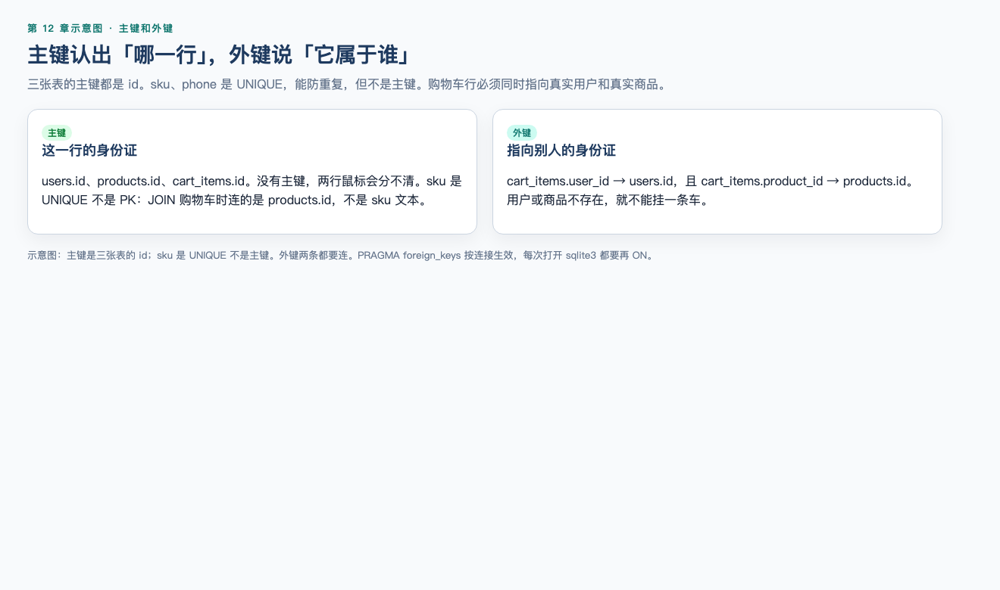
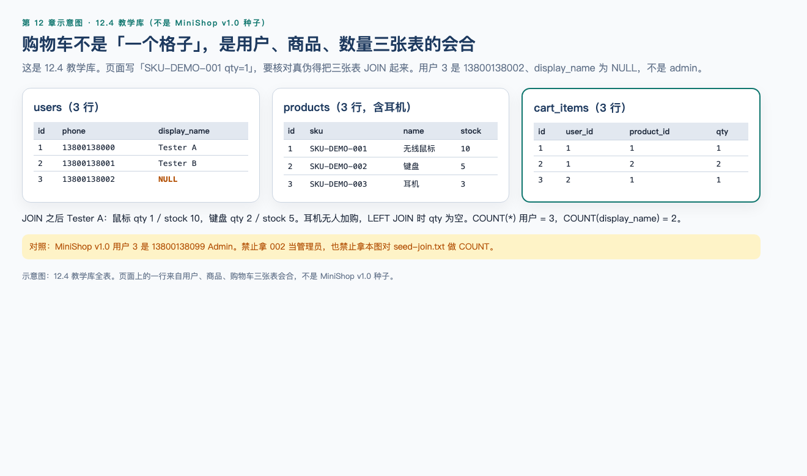
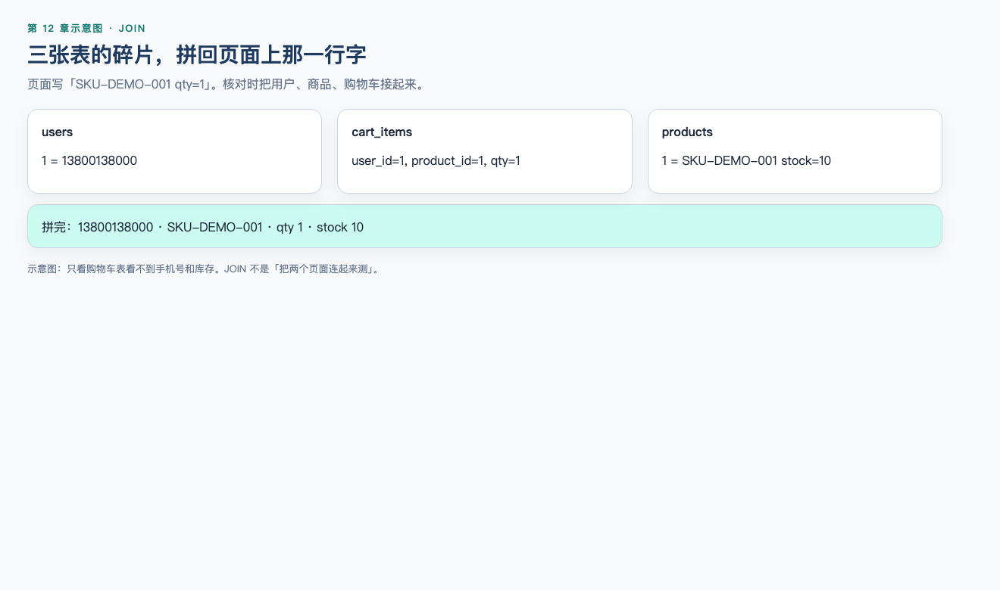
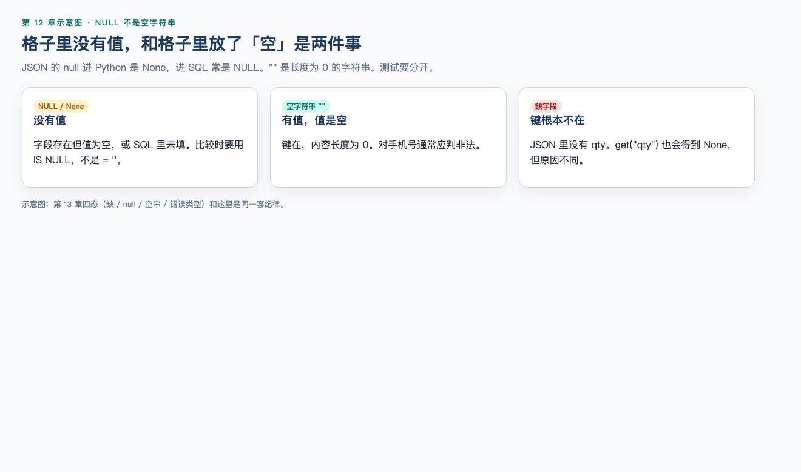

# 第 12 章（上）：数据库与查询

> **一句话核心：** SELECT 先问数据在哪，再谈改。

> 重要级别：⭐⭐⭐ 必须掌握  
> 下一节：[12B 写操作、事务与 MiniShop 核对](12b-sql-write-and-minishop.md)

## 这一章解决什么问题

页面是 11，库里是多少？上半章建立表、主键/外键、SELECT/WHERE/排序/聚合/JOIN/NULL。

写操作和事务放到 12B，避免还没学会 SELECT 就 DELETE。

## 学习目标

- 说明数据库、主键、外键；
- 写出带 WHERE 的 SELECT；
- 使用排序、限制、去重、聚合、JOIN；
- 解释 NULL 与空字符串不同。

## 前置知识

Linux 不是硬前置。会用终端更方便，但本章可在本机 `sqlite3` 完成。

## 场景导入

购物车页显示 11。可能是页面算错，也可能库里就是 11。不查库只能猜。

## 12.1 数据库是什么 ⭐⭐⭐

数据库是按规则组织、可查询、可持久保存的数据集合。测试关心的不是“有一个叫 MySQL 的软件”，而是：

- 业务状态最终落在哪里；
- 怎样用查询证明页面、接口、日志一致或不一致；
- 怎样在不破坏测试环境的前提下准备和清理数据。

几个词：

| 词 | 含义 | 教学例子 |
| --- | --- | --- |
| 表（Table） | 一类实体的集合 | `products` |
| 行（Row / Record） | 一条记录 | SKU-DEMO-001 这一行 |
| 列（Column / Field） | 一种属性 | `stock` |
| 模式/库（Schema / Database） | 表的容器 | 教学库 `minishop_lab` |

常见引擎：MySQL、PostgreSQL、SQLite。本章查询语句尽量通用。**建表语法因引擎而异**；文末教学脚本用 SQLite，因为零安装即可验证。连公司测试库时，以团队提供的 MySQL 或 PostgreSQL 为准。

---

## 12.2 关系型与非关系型 ⭐⭐

**关系型数据库**用表、主键、外键表达实体和关系，用 SQL 查询。MiniShop 教学库采用这种模型：用户、商品、购物车行可以互相引用。

**非关系型（NoSQL）**不是一种产品，而是一类不同模型的统称，例如文档库、键值库、列族、图。它们可能不用 SQL，或只用部分 SQL。测试时仍要问：数据在哪、怎样读、怎样确认写入、怎样隔离测试账号。

不要说“关系型一定过时”或“NoSQL 一定更快”。选型是架构决策。初级测试工程师先掌握 SQL，因为电商类系统和大多数后端测试环境仍大量使用关系型库。

---

## 12.3 主键与外键 ⭐⭐⭐




**主键（Primary Key）**唯一标识一行。同一张表里主键不能重复，也不能为 `NULL`。

**外键（Foreign Key）**引用另一张表的主键，用来约束“购物车必须属于已存在的用户、必须指向已存在的商品”。

```text
users.id  <----- cart_items.user_id
products.id <----- cart_items.product_id
```

没有外键时，库里可能出现 `user_id = 99` 这种幽灵用户。有外键且引擎真正启用约束时，这样的插入应失败。

SQLite 默认**不强制**外键，需要 `PRAGMA foreign_keys = ON;`。MySQL 需使用支持外键的引擎（常见 InnoDB）。PostgreSQL 默认强制外键。测试前要问清：约束开了没有，不要假设“有外键列就一定插不进去”。

---

## 12.4 教学库：三张表 ⭐⭐⭐



```sql
PRAGMA foreign_keys = ON;

CREATE TABLE users (
  id INTEGER PRIMARY KEY,
  phone TEXT NOT NULL UNIQUE,
  display_name TEXT
);

CREATE TABLE products (
  id INTEGER PRIMARY KEY,
  sku TEXT NOT NULL UNIQUE,
  name TEXT NOT NULL,
  stock INTEGER NOT NULL
);

CREATE TABLE cart_items (
  id INTEGER PRIMARY KEY,
  user_id INTEGER NOT NULL,
  product_id INTEGER NOT NULL,
  qty INTEGER NOT NULL,
  FOREIGN KEY (user_id) REFERENCES users(id),
  FOREIGN KEY (product_id) REFERENCES products(id)
);

INSERT INTO users(id, phone, display_name) VALUES
  (1, '13800138000', 'Tester A'),
  (2, '13800138001', 'Tester B'),
  (3, '13800138002', NULL);

INSERT INTO products(id, sku, name, stock) VALUES
  (1, 'SKU-DEMO-001', '无线鼠标', 10),
  (2, 'SKU-DEMO-002', '键盘', 5),
  (3, 'SKU-DEMO-003', '耳机', 3);

INSERT INTO cart_items(id, user_id, product_id, qty) VALUES
  (1, 1, 1, 1),
  (2, 1, 2, 2),
  (3, 2, 1, 1);
```

第三位用户 `13800138002` 的 `display_name` 为 `NULL`，是为了练习 `COUNT` 与 `IS NULL`。MiniShop v1.0 的第三个账号是管理员 `13800138099`，不要把教学库用户 3 当成项目管理员。

手机号用文本，不用整数：避免丢掉前导零，也避免把号码当成可以拿来加减的量。

示例数据（审查时已插入并查询）：

| users.id | phone | display_name |
| --- | --- | --- |
| 1 | 13800138000 | Tester A |
| 2 | 13800138001 | Tester B |
| 3 | 13800138002 | NULL |

| products.sku | name | stock |
| --- | --- | --- |
| SKU-DEMO-001 | 无线鼠标 | 10 |
| SKU-DEMO-002 | 键盘 | 5 |
| SKU-DEMO-003 | 耳机 | 3 |

| cart_items | user_id | product_id | qty |
| --- | --- | --- | --- |
| 1 | 1 | 1 | 1 |
| 2 | 1 | 2 | 2 |
| 3 | 2 | 1 | 1 |

MySQL 建表常用 `INT AUTO_INCREMENT`，PostgreSQL 常用 `GENERATED … AS IDENTITY` 或 `SERIAL`。查询部分下面通用。

---

## 12.5 CRUD ⭐⭐⭐

| 操作 | SQL | 测试用途 |
| --- | --- | --- |
| Create | `INSERT` | 准备账号、商品、购物车行 |
| Read | `SELECT` | 核对页面、接口、日志 |
| Update | `UPDATE` | 构造库存不足等前置（须授权） |
| Delete | `DELETE` | 清理自己插入的测试数据（须授权） |

日常测试 **Read 最多**。没有授权不要在共享测试库里批量改生产形态的数据。

---

## 12.6 `SELECT` ⭐⭐⭐

```sql
SELECT id, phone, display_name
FROM users;
```

- `SELECT` 后面是列；`*` 表示全部列，探索阶段可用，自动化里应写出真正关心的列；
- `FROM` 后面是表；
- 字符串用**单引号**：`'13800138000'`。双引号在标准 SQL 里常表示标识符，不要拿来写手机号。

```sql
SELECT id, phone, display_name
FROM users
WHERE phone = '13800138000';
```

审查结果：`id = 1`，`display_name = Tester A`。

---

## 12.7 `WHERE` 与逻辑运算 ⭐⭐⭐

`WHERE` 限制哪些行进入结果。

```sql
SELECT sku, name, stock
FROM products
WHERE stock >= 5 AND stock <= 10;

SELECT sku, stock
FROM products
WHERE stock < 5 OR sku = 'SKU-DEMO-001';

SELECT sku, name
FROM products
WHERE name LIKE '%鼠标%';

SELECT sku, stock
FROM products
WHERE sku IN ('SKU-DEMO-001', 'SKU-DEMO-002');

SELECT sku, stock
FROM products
WHERE stock BETWEEN 3 AND 5;
```

| 写法 | 含义 |
| --- | --- |
| `AND` / `OR` / `NOT` | 逻辑组合；复杂条件加括号 |
| `LIKE '%鼠标%'` | `%` 匹配任意长度，`_` 匹配单个字符 |
| `IN (…)` | 属于列表 |
| `BETWEEN 3 AND 5` | 闭区间，含 3 和 5 |

审查中 `BETWEEN 3 AND 5` 命中库存 5 的键盘和库存 3 的耳机。

比较数字列时不要加引号：`stock >= 5` 正确；`'5'` 会迫使引擎做类型转换，不同库行为可能不同。

### 了解：不要把用户输入拼进 SQL

在授权教学库里应知道：如果应用把搜索词直接拼进语句，输入可能改变查询结构。测试只在自有或授权环境观察参数化（预编译/绑定变量）是否被使用，**禁止**对未授权系统做注入攻击。本章不把攻击载荷当作练习答案。

---

## 12.8 排序、限制、去重 ⭐⭐⭐

```sql
SELECT sku, stock
FROM products
ORDER BY stock DESC, sku ASC
LIMIT 2;
```

审查结果：先 `SKU-DEMO-001`（10），再 `SKU-DEMO-002`（5）。

```sql
SELECT DISTINCT user_id
FROM cart_items;
```

审查结果：`1` 和 `2`。用户 3 没有购物车行，不会出现。

`LIMIT` 在 MySQL、PostgreSQL、SQLite 中常用。SQL Server 常用 `TOP` 或 `FETCH`。写缺陷时注明引擎。

没有 `ORDER BY` 的 `LIMIT` 不保证每次同一行。需要“前两名库存”时必须排序。

---

## 12.9 聚合、`GROUP BY`、`HAVING` ⭐⭐⭐

聚合把多行收成统计值。

```sql
SELECT COUNT(*) AS user_count FROM users;
SELECT COUNT(display_name) AS named_count FROM users;
SELECT SUM(qty) AS qty_sum FROM cart_items;
SELECT AVG(stock) AS stock_avg FROM products;
SELECT MIN(stock) AS stock_min, MAX(stock) AS stock_max FROM products;
```

审查结果：`user_count = 3`；`named_count = 2`（`NULL` 的显示名不计入 `COUNT(display_name)`）；`qty_sum = 4`；`stock_avg = 6.0`；最小库存 3，最大 10。

`COUNT(*)` 计行；`COUNT(列)` 不计该列为 `NULL` 的行。

```sql
SELECT product_id, COUNT(*) AS line_count, SUM(qty) AS qty_sum
FROM cart_items
GROUP BY product_id;
```

审查结果：商品 1 有 2 行合计数量 2；商品 2 有 1 行合计数量 2。

`WHERE` 在分组**前**过滤行；`HAVING` 在分组**后**过滤组：

```sql
SELECT product_id, COUNT(*) AS line_count
FROM cart_items
GROUP BY product_id
HAVING COUNT(*) > 1;
```

只有被两个用户加购的商品 1 会留下。

出现在 `SELECT` 中的非聚合列，一般必须出现在 `GROUP BY` 中。MySQL 在某些模式下较松，不要依赖这种宽松行为。

---

## 12.10 `JOIN` ⭐⭐⭐




购物车行本身没有手机号和库存，必须关联。

**INNER JOIN** 只保留两边都匹配的行：

```sql
SELECT u.phone, p.sku, c.qty, p.stock
FROM cart_items AS c
INNER JOIN users AS u ON c.user_id = u.id
INNER JOIN products AS p ON c.product_id = p.id
WHERE u.phone = '13800138000';
```

审查结果：

| phone | sku | qty | stock |
| --- | --- | --- | --- |
| 13800138000 | SKU-DEMO-001 | 1 | 10 |
| 13800138000 | SKU-DEMO-002 | 2 | 5 |

**LEFT JOIN** 保留左表全部行，右表没有匹配则为 `NULL`：

```sql
SELECT p.sku, c.qty
FROM products AS p
LEFT JOIN cart_items AS c ON c.product_id = p.id
ORDER BY p.sku;
```

审查结果：`SKU-DEMO-001` 出现两次（两个用户的购物车），`SKU-DEMO-003` 的 `qty` 为空——没有人加购耳机。LEFT JOIN 可能让左表一行变成多行，核对数量时不要把“结果行数”直接当成“商品数”。

`ON` 写连接条件，`WHERE` 写过滤。把过滤写进 `ON` 还是 `WHERE`，在 LEFT JOIN 上可能改变“未匹配行是否留下”。初学先把关系放 `ON`，过滤放 `WHERE`，再对 LEFT JOIN 的空行单独观察。

---

## 12.11 `NULL` ⭐⭐⭐




`NULL` 表示缺失，不是数字 0，也不是空字符串 `''`。

错误：

```sql
SELECT id, phone FROM users WHERE display_name = NULL;
```

审查结果：**零行**。`NULL` 用 `=` 比较得不到真。

正确：

```sql
SELECT id, phone FROM users WHERE display_name IS NULL;
```

审查结果：用户 3，`13800138002`。

| 写法 | 用途 |
| --- | --- |
| `IS NULL` / `IS NOT NULL` | 判断缺失 |
| `COUNT(列)` | 自动跳过 `NULL` |
| 与数字比较 | `NULL` 不大于也不小于 10，`WHERE stock > 0` 不会留下 `stock` 为 `NULL` 的行 |

准备测试数据时，要问需求：未填显示名是禁止、空字符串，还是 `NULL`。三者在库里不是一回事。

---


## MiniShop 工作实战（上）

只读查询 MiniShop v1.0 种子库（授权环境）。语句见 `project/minishop/docs/sql-check.md`。本机种子 JOIN：`project/minishop/evidence/sql/seed-join.txt` 第一节（鼠标 qty 1）。不要把 12.4 教学库的用户 3（`13800138002` / `NULL`）和这份 v1.0 证据对答案。

## 小练习

### 练习 1

表、行、列分别对应 MiniShop 教学库中的什么？主键为什么不能为 `NULL`？

### 练习 2

关系型和非关系型对测试的共同问题是什么？为什么本章仍以 SQL 为主？

### 练习 3

`SELECT * FROM users WHERE display_name = NULL;` 为什么通常得不到用户 3？应改成什么？

### 练习 4

写出查询 Tester A（`13800138000`）购物车 sku、数量和库存的 `JOIN`。不要编造订单状态字段。

### 练习 5

`COUNT(*)` 与 `COUNT(display_name)` 在教学数据上各是多少？为什么不同？


## 练习答案

1. 表如 `products`；行如一条商品；列如 `stock`。主键要唯一标识一行，`NULL` 无法标识。

2. 共同问题：数据在哪、怎样读、怎样证明写入、怎样隔离测试数据。电商和多数后端测试环境仍大量使用关系型库和 SQL。

3. `NULL` 不能用 `=` 比较为真。应使用 `display_name IS NULL`。

4. 使用 12.10 的 `INNER JOIN` 三表查询，`WHERE u.phone = '13800138000'`。结果应含鼠标 qty 1 stock 10、键盘 qty 2 stock 5。

5. 3 与 2。用户 3 的 `display_name` 为 `NULL`，不计入 `COUNT(display_name)`。


## 本章检查清单

- [ ] 我会写带 WHERE 的 SELECT
- [ ] 我能解释 JOIN 在核对购物车时的作用
- [ ] 我知道 NULL 不是空字符串

## 本章可运行性说明

v1.0 种子 JOIN 见 `project/minishop/evidence/sql/seed-join.txt` 第一节。12.4 教学库的 `COUNT` / `IS NULL` 练习不要对着该文件对答案。

## 参考资料

- [12B](12b-sql-write-and-minishop.md)
- SQLite 文档

## 下一章预告

[第 12 章（下）](12b-sql-write-and-minishop.md)
