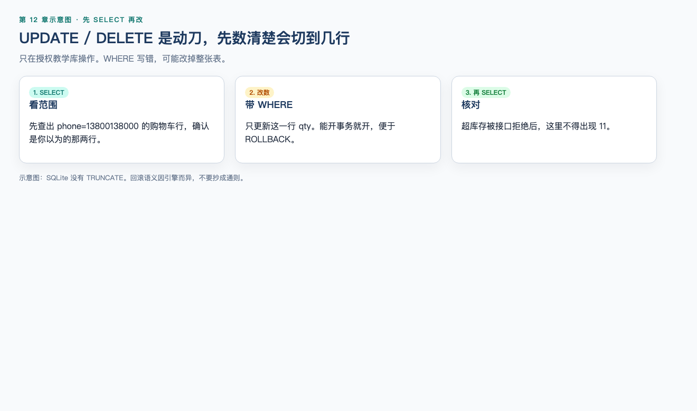

# 第 12 章（下）：写操作、事务与 MiniShop 核对

> **一句话核心：** 改数据前先 SELECT 范围；UI 对了库不对，仍是缺陷。

> 上一节：[12A 查询](12a-sql-query.md)

## 这一章解决什么问题

INSERT/UPDATE/DELETE 会改数据。必须先 SELECT 验证范围，只在授权教学库执行，并理解事务。

## 学习目标

- 在授权库执行 INSERT/UPDATE/DELETE 前先 SELECT；
- 说明 DROP/TRUNCATE 的风险，以及 SQLite 没有 TRUNCATE；
- 用 COMMIT/ROLLBACK 做可回退练习；
- 核对 MiniShop 购物车与超库存未写入。

## 前置知识

已完成 12A。

## 12.12 `INSERT` ⭐⭐⭐

```sql
INSERT INTO cart_items (user_id, product_id, qty)
VALUES (1, 3, 1);
```

这会给 Tester A 加一行耳机。外键开启时，`user_id = 99` 应失败。审查中在 `PRAGMA foreign_keys = ON` 下插入不存在的用户，SQLite 报 `FOREIGN KEY constraint failed`。

插入后立刻 `SELECT` 核对，不要假设成功。练习插入应放在事务里回滚，或随后用主键 `DELETE` 清掉自己的行，避免污染别人的用例——第 5 章的数据独立性在库里同样适用。

---

## 12.13 `UPDATE` 与 `DELETE`：先 SELECT 再改 ⭐⭐⭐




质量标准要求：修改数据只在授权测试库执行；**必须有明确 `WHERE`；先用同样条件 `SELECT` 看范围；优先放进事务或先备份。**

### 安全流程

1. 确认当前连接的是测试库，不是生产；
2. 写出 `WHERE`，用 `SELECT` 执行同一条件；
3. 看行数和内容是否只包含你打算改的数据；
4. `BEGIN` 开启事务；
5. 执行 `UPDATE` 或 `DELETE`；
6. 再 `SELECT` 确认；
7. 确认无误再 `COMMIT`；否则 `ROLLBACK`。

没有 `WHERE` 的 `UPDATE products SET stock = 0;` 会把**整表**库存清零。这不是“写得简洁”，这是事故。

### 带事务的库存练习

```sql
BEGIN;

SELECT sku, stock
FROM products
WHERE sku = 'SKU-DEMO-001';

UPDATE products
SET stock = 9
WHERE sku = 'SKU-DEMO-001'
  AND stock >= 1;

SELECT sku, stock
FROM products
WHERE sku = 'SKU-DEMO-001';

ROLLBACK;
```

审查中：事务内库存变为 9，`ROLLBACK` 后回到 10。

`AND stock >= 1` 把“不要把库存改成离谱值”写进条件，仍然不能替代第一步的 SELECT。

### DELETE

```sql
BEGIN;

SELECT id, user_id, qty
FROM cart_items
WHERE user_id = 1 AND id = 2;

DELETE FROM cart_items
WHERE user_id = 1 AND id = 2;

SELECT id, user_id, qty
FROM cart_items
WHERE user_id = 1 AND id = 2;

ROLLBACK;
```

审查中：删除在事务内生效，回滚后 `id = 2`、`qty = 2` 仍在。

`WHERE` 尽量用主键或“主键 + 用户”双条件，避免只按姓名模糊删除。

---

## 12.14 `DROP` 与 `TRUNCATE` ⭐⭐

| 语句 | 作用 | 测试纪律 |
| --- | --- | --- |
| `DROP TABLE …` | 删除表结构 | 初级日常测试不需要；教学库外禁止 |
| `TRUNCATE TABLE …` | 清空表数据 | 未授权禁止。本章动手环境是 SQLite，**没有**这条语句，清空用带确认的 `DELETE`。MySQL 上常是 DDL、难以当普通 `DELETE` 回滚；PostgreSQL 可以把 `TRUNCATE` 放进事务并 `ROLLBACK` |

它们不是 `DELETE FROM t WHERE id = 1` 的快捷方式。看到脚本里有 `DROP`/`TRUNCATE`，先停下来问：这是不是测试库、当前引擎支不支持、有没有备份、影响哪些人。

---

## 12.15 事务：`COMMIT` 与 `ROLLBACK` ⭐⭐⭐

事务把多步改动当成一个单位：要么一起生效，要么一起取消。

```sql
BEGIN;
-- 若干 SELECT / UPDATE / DELETE
COMMIT;    -- 确认写入
-- 或
ROLLBACK;  -- 全部撤销
```

MySQL 也可写 `START TRANSACTION`。自动提交（autocommit）开启时，每条语句自己提交，`ROLLBACK` 救不回上一句。测试改数前确认是否在显式事务里。

练习库存和删除时优先 `ROLLBACK`，避免教学库被永久改乱。只有准备数据的步骤在核对后 `COMMIT`。

事务不能替代权限：没有写权限，`BEGIN` 也改不了生产。事务也不能撤销已经 `COMMIT` 的误操作，除非有备份或审计回放。

---

## 12.16 MiniShop 数据验证 ⭐⭐⭐

教学规则：购物车 `qty` 不得超过该商品 `stock`。

核对当前教学数据：

```sql
SELECT u.phone, p.sku, c.qty, p.stock
FROM cart_items AS c
INNER JOIN users AS u ON c.user_id = u.id
INNER JOIN products AS p ON c.product_id = p.id
WHERE c.qty > p.stock;
```

当前示例数据应**零行**。若页面能把数量改成 11，再跑同一条查询：有行则数据库已接受非法值；无行则非法值可能只存在于页面或接口响应。

用事务构造“页面 11”的对照，然后回滚：

```sql
BEGIN;

SELECT c.id, c.qty, p.stock
FROM cart_items AS c
INNER JOIN products AS p ON c.product_id = p.id
WHERE c.id = 1;

UPDATE cart_items
SET qty = 11
WHERE id = 1;

SELECT c.id, c.qty, p.stock
FROM cart_items AS c
INNER JOIN products AS p ON c.product_id = p.id
WHERE c.id = 1;

ROLLBACK;
```

第二段 `SELECT` 会看到 `qty = 11`、`stock = 10`。这是**故意造出来的教学对照**，不是 MiniShop 已发生的测试结果。不要把这段输出写进简历当真实缺陷。

验证清单（授权库）：

1. 对象对不对：手机号、SKU、购物车行 id；
2. 规则有没有破：`qty > stock`、`qty < 1`；
3. 接口成功后库存有没有少、购物车有没有多；
4. 用户 A 的行会不会出现在用户 B 的查询里（和第 8 章权限一起看）。

---


配套可运行实操：[实操 12-1 API 与 SQL 交叉验证](../practice/12-sql-cross-check/README.md)（`python3 practice/run.py 12-1`）。在临时教学库进行，退出即删。

## MiniShop 工作实战：SQL 验证包

在本机 SQLite 教学库或团队授权测试库完成。**禁止**连接生产。修改类语句必须带 `WHERE`，并先 `SELECT`。

建议保存为：

```text
exercises/chapter-12-minishop-sql.md
```

本机练习（审查用同等脚本跑通）：

```bash
sqlite3 ~/minishop-sql-lab.sqlite
```

进入后执行本章 12.4 的建表与插入，再完成：

1. 按手机号查询用户；
2. 一条 `JOIN`，列出该用户购物车的 sku、qty、stock；
3. 一条 `qty > stock` 巡检（记录行数）；
4. 在事务中 `UPDATE` 一行后 `SELECT`，再 `ROLLBACK`；
5. 解释 `COUNT(*)` 与 `COUNT(display_name)` 为何不同。

```markdown
# MiniShop SQL 验证记录

## 环境
- 引擎（SQLite / MySQL / PostgreSQL）：
- 是否授权测试库：
- 日期：

## 查询
- 用户查询语句与结果：
- JOIN 语句与结果：
- qty > stock 行数：

## 事务练习
- UPDATE 前 SELECT 行数：
- ROLLBACK 后是否恢复：
- 未使用的危险语句（无 WHERE 的 UPDATE/DELETE、DROP、TRUNCATE）：确认未执行

## NULL
- IS NULL 结果：
```

完成标准：

- 至少三条已执行的 `SELECT`（含一条 `JOIN`）；
- 有一次事务中的修改并回滚；
- 能说明为何 `= NULL` 找不到用户 3；
- 没有无 `WHERE` 的更新删除，没有 `DROP`/`TRUNCATE`。

---


本机证据：qty=11 拒绝后购物车不得为 11，见 `evidence/sql/seed-join.txt` 与 `tests/test_api.py::test_cart_qty_11_does_not_persist`。

## 小练习

### 练习 6

哪一项符合安全改数？

A. `DELETE FROM cart_items;`  
B. 先 `SELECT` 同一 `WHERE`，再在事务中 `DELETE … WHERE id = 2`，确认后 `COMMIT` 或 `ROLLBACK`  
C. `TRUNCATE TABLE products;` 清空库存方便重测  
D. 在生产只更新一行并立刻 `COMMIT`

### 练习 7

`LEFT JOIN` 后 `SKU-DEMO-001` 出现两行、`SKU-DEMO-003` 的数量为空，分别说明什么？

### 练习 8

没有 `ORDER BY` 的 `SELECT sku FROM products LIMIT 1` 有什么风险？

### 练习 9

页面把数量改成 11。`WHERE c.qty > p.stock` 返回零行，说明什么、还不能说明什么？

### 练习 10

在事务中把 `SKU-DEMO-001` 库存改为 9，`SELECT` 确认后回滚。预期回滚后库存是多少？若忘记 `WHERE` 会怎样？


## 练习答案

6. B。

7. 两行：该商品被两个购物车行引用，JOIN 复制了商品侧。空数量：没有匹配的购物车行，LEFT JOIN 保留商品。

8. 每次返回哪一行不确定，缺陷无法稳定复现。

9. 说明持久化数据未出现 `qty > stock`；不能说明页面没显示 11，也不能说明接口没返回错误数字。还要看响应和 DOM。

10. 回滚后应为 10。忘记 `WHERE` 会更新整表所有商品库存，即使在事务里也极其危险，发现后应立即 `ROLLBACK` 并汇报。

---


## 本章检查清单

- [ ] 我改数之前会先 SELECT
- [ ] 我只在授权教学库修改
- [ ] 我知道 SQLite 无 TRUNCATE
- [ ] 我能完成 MiniShop SQL 验证包

## 阶段测验

[阶段测验 4](quizzes/stage-4-ops.md)

## 本章可运行性说明

写操作仅限本机教学库。qty=11 不落库由 pytest 与 SQL 交叉验证。SQLite 无 TRUNCATE。

## 参考资料

- [12A](12a-sql-query.md)
- `project/minishop/docs/sql-check.md`

## 下一章预告

第 13 章《接口测试》。
