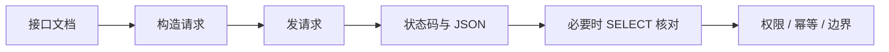
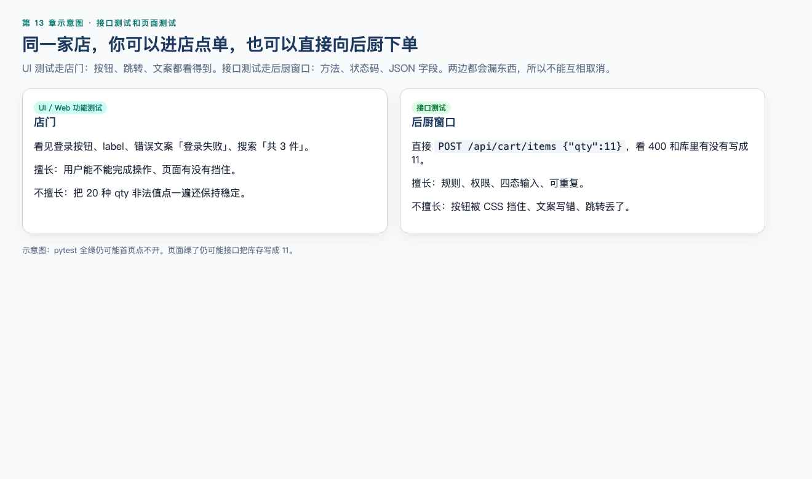
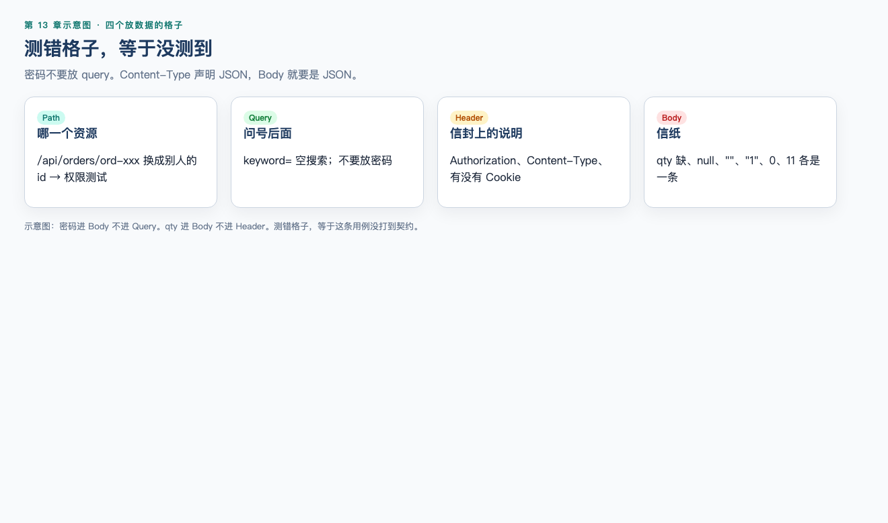
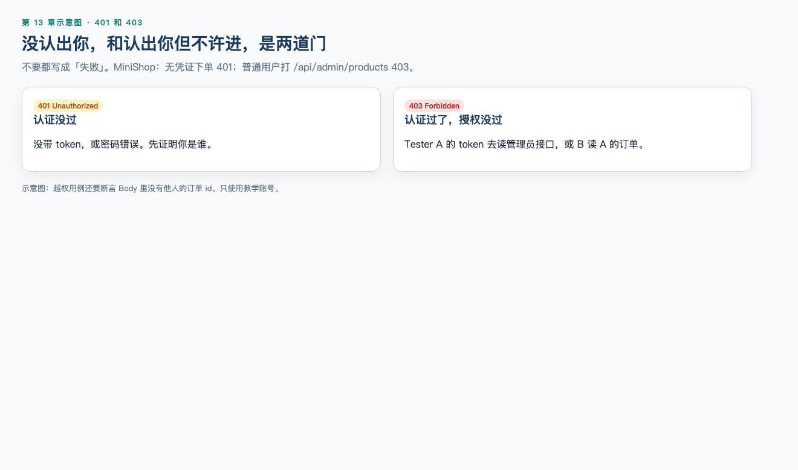

# 第 13 章：接口测试

> **一句话核心：** 接口测试绕过 UI，直接对契约做观察和判定。

> 重要级别：⭐⭐⭐ 必须掌握  
> 核心章节发布目标：≥95/100  
> 主案例：MiniShop 个人软件测试实践项目

## 这一章解决什么问题

第 8 章在页面上点，第 9～11 章看报文和服务器，第 12 章核数据库。接口测试把这些连起来：**不经过浏览器渲染，直接按文档向服务发请求，再判断状态码、JSON 和库里的行是否一致。**

页面能用，接口仍可能对错误类型放行；接口返回成功，库存仍可能没改。初级测试工程师必须会读接口文档，会构造 Path/Query/Header/Body，会区分缺失、空字符串和 `null`，会测权限和重复提交。

本章可运行示例一律打仓库 MiniShop：`python3 project/minishop/run.py serve`，路径带 `/api/`，购物车 `qty=10` 允许、`qty=11` 拒绝，需要 `Authorization: Bearer`。当前实现与 PRD 一致；项目收口和「冻结仪式」在第 19 章，本章不要假装已经做完整项目包。v1.0 不定义订单状态机，也没有支付。

## 学习目标

完成本章后，你应该能够：

- 说明接口、API，以及它们和页面测试的差别；
- 用测试视角解释 REST 常见约定，且不把“HTTP + JSON”等同于 REST；
- 阅读和编写合法 JSON，并区分缺字段、`""`、`null`、错误类型；
- 对照 OpenAPI/Swagger 文档找出方法、参数位置和响应；
- 设计 Path、Query、Header、Body 的测试点；
- 检查未登录、越权和错误凭证；
- 用幂等和重复提交解释下单风险；
- 用接口 + SQL 做一致性核对；
- 完成 MiniShop 登录、改数量与创建订单的接口检查包。

## 前置知识

- 已完成第 1～12 章中与 HTTP、Web、SQL、curl 相关的章节；
- 能阅读方法、状态码、Header、Body；
- 知道 Cookie、Session、Token、Bearer 处于不同层次；
- 会在授权环境使用脱敏后的 curl。

## 场景导入：页面绿了，接口就对了吗？

MiniShop 购物车在浏览器里把数量改成 2，页面提示成功。同一账号用接口提交：

```json
{"sku":"SKU-DEMO-001","qty":11}
```

若接口返回 `200` 且库中 `qty = 11`、`stock = 10`，这是数据层缺陷，即使某个页面按钮暂时点不出 11。

反过来，页面报错但接口其实写成功，也是缺陷。接口测试的价值是：**同一套规则，用更少的 UI 噪声去验证契约。**



只对你启动的 MiniShop（默认 `http://127.0.0.1:8765`）或明确授权的测试环境发请求。不要对未授权系统做爆破、越权扫描或注入。

---

## 13.1 接口和 API ⭐⭐⭐

**接口**在测试语境里通常指系统对外提供的调用约定：地址、方法、参数、响应和错误。

**API（Application Programming Interface）**是应用程序之间的接口。Web 场景里常说的“接口测试”，多半是在测 HTTP API。

可以把它想成餐厅后厨的出餐口：前台（页面）只是一种点餐方式；外卖软件（另一个客户端）走同一窗口。窗口的菜单就是接口文档。

测试要回答：

- 文档说能做什么，实际能不能做；
- 不按菜单点（缺参数、类型错）时如何拒绝；
- 谁有资格点这份菜（权限）；
- 点两次会不会上两道（幂等）。

不是所有接口都是 HTTP，也有 RPC、消息队列、数据库协议。本章只覆盖 MiniShop 这类 **HTTP + JSON** 的常见 Web API。

---

## 13.2 REST：约定，不是宗教 ⭐⭐⭐

REST 是一种架构风格：用资源、统一的 HTTP 方法和表示（常见 JSON）来交互。测试中见到的“REST API”往往表示：

| 约定 | 例子（教学） | 测试含义 |
| --- | --- | --- |
| 用 URL 表示资源 | `/api/products`、`/api/orders/{id}` | Path 错了就是找错对象 |
| 用方法表示动作 | `GET` 读取，`POST` 创建或提交 | 与第 9 章 safe/幂等一致 |
| 用状态码分类结果 | `201` 创建，`401` 未认证 | 还要看 Body |
| 用 JSON 表示数据 | `{"qty":1}` | 要核对 `Content-Type` |

不要说：

- 所有后端都是 REST；
- REST 等于 JSON；
- 用了 `POST /getUser` 就一定“不 RESTful 所以一定是缺陷”——这是风格问题，测试以**已发布契约**为准；
- 接口自动化 ROI 永远最高。是否适合自动化取决于变更频率、稳定性和风险，第 17 章再展开。

GraphQL、RPC 等其他风格本章不展开。见到它们时先找对应文档，不要硬套 REST 资源模型。

---

## 13.3 JSON ⭐⭐⭐

JSON 是一种文本数据格式，常见于 HTTP Body。RFC 8259 规定了对象、数组、字符串、数字、`true`/`false`/`null`。

合法对象：

```json
{"sku":"SKU-DEMO-001","qty":1}
```

四件必须分清的事：

| 形态 | 例子 | 含义 |
| --- | --- | --- |
| 缺字段 | `{}` | 键不存在 |
| `null` | `{"qty":null}` | 键存在，值是 JSON 的 `null`，不是空字符串 |
| 空字符串 | `{"qty":""}` | 值是长度为 0 的字符串 |
| 错误类型 | `{"qty":"11"}` | 看起来像 11，类型是字符串 |

它们在 JSON 里都可能是合法语法，但业务含义不同。测试必须分别构造，不能只测一个“正常数字”。

`0`、`false`、`[]`、`{}` 也不是 `null`。库存为 0 的商品和字段缺失不是同一条用例。

阅读纪律：

- 响应声明 `application/json` 时，Body 应能被解析；解析失败本身可能是缺陷；
- 注释、单引号、末尾多余逗号不是标准 JSON（有的服务宽松，测试仍以契约为准）；
- 缺陷里贴 JSON 时脱敏 Token 和密码。

---

## 13.4 接口测试和 UI 测试差在哪 ⭐⭐⭐

| 维度 | UI 测试 | 接口测试 |
| --- | --- | --- |
| 入口 | 浏览器操作 | HTTP 请求 |
| 擅长 | 渲染、跳转、真实点击路径 | 规则、数据、权限、组合、速度 |
| 看不到 | 未绑定按钮的隐藏接口 | CSS、键盘、响应式 |
| 通过含义 | 用户这条路大致能走完 | 契约在该输入下的行为 |

第 8 章测页面，本章测窗口。两者互补：

- 只测 UI：很难覆盖全部错误类型和越权 URL；
- 只测接口：可能漏掉“接口对了但按钮点了没发请求”。

不要把接口测试说成更高级所以可以取消手工功能测试。初级岗位两者都要会。



---

## 13.5 接口文档要读什么 ⭐⭐⭐

没有文档时，测试在猜。有文档时，先读：

1. 基础 URL 和环境（测试/预发，不要拿生产练手）；
2. 认证方式：Cookie、`Authorization: Bearer`、或其他（层次见第 8 章）；
3. 每个操作的方法与路径；
4. 参数在 Path / Query / Header / Body 的哪一层；
5. 必填与类型；
6. 成功与失败的状态码和 Body 形状；
7. 副作用：是否写库、是否发短信、是否扣库存；
8. 幂等与限流说明。

文档与实现不一致时，先记缺陷或需求问题，不要擅自把其中一方当成永恒真理。第 4 章的可测试性在这里仍然适用。

---

## 13.6 OpenAPI 与 Swagger ⭐⭐⭐

**OpenAPI Specification** 是描述 HTTP API 的标准文档格式（常见 3.x）。**Swagger** 一词常被用来称呼相关工具（编辑器、UI、代码生成）以及历史上的 Swagger 2.0 规范。测试时可以说“看 OpenAPI 文档 / Swagger UI”，但要知道：规范名是 OpenAPI，UI 只是阅读方式。

仓库文档摘录（完整文件：`project/minishop/docs/openapi.json`）：

```json
{
  "openapi": "3.0.3",
  "info": {"title": "MiniShop v1.0 API", "version": "1.0.0"},
  "paths": {
    "/api/login": {
      "post": {
        "summary": "Login",
        "requestBody": {
          "required": true,
          "content": {
            "application/json": {
              "schema": {
                "type": "object",
                "required": ["phone", "password"],
                "properties": {
                  "phone": {"type": "string"},
                  "password": {"type": "string"}
                }
              }
            }
          }
        },
        "responses": {
          "200": {"description": "OK with token; no order status field"},
          "401": {"description": "Bad password"}
        }
      }
    }
  }
}
```

对照文档设计用例时：

- `required` 里的字段做“缺失”测试；
- `type` 做错误类型测试；
- `responses` 里列出的状态码都要有预期，没列出的若出现应记录；
- `security` / 锁图标表示需要认证。

Swagger UI 上的 “Try it out” 适合探索，正式记录仍要保存请求、状态码和脱敏响应。第 14 章用 Postman 管理集合。

---

## 13.7 Path、Query、Header、Body ⭐⭐⭐




四个位置放不同种类的信息。测错位置等于没测到。

| 位置 | 是什么 | MiniShop 例子 | 测试关注 |
| --- | --- | --- | --- |
| Path | URL 路径中的资源标识 | `/api/orders/{id}` | 编码、不存在的 id、他人的 id |
| Query | `?` 之后 | `/api/products?keyword=鼠标` | 缺失、空、类型、组合；不要放密码。商品名是「无线鼠标」，搜 `mouse` 会空 |
| Header | 报文头 | `Authorization: Bearer …`、`Content-Type` | 缺失认证、错误 `Content-Type` |
| Body | 实体 | JSON 对象 | 缺字段、null、边界、重复键（不依赖） |

第 7、9 章已说明 query 不是 GET 专属；POST 也可以带 query。登录密码仍应放在 HTTPS 保护下的 Body，而不是 query。

`Content-Type: application/json` 与真正的 JSON Body 必须一致。声明 JSON 却发送表单，或反过来，常见 `415` 或服务端解析失败。

Path 参数通常标识**哪一个**资源。把 `ord-demo-01` 改成另一个用户的 id，就是权限测试，而不是普通功能测试。

---

## 13.8 缺失、空值、`null`、错误类型、边界 ⭐⭐⭐

以 MiniShop 改数量为例（PRD `R-CART` / `R-CART-10`：正整数且不得超过当前库存 10；请求必须带 Bearer）：

| 用例 | Body | 要观察 |
| --- | --- | --- |
| 正常 | `{"sku":"SKU-DEMO-001","qty":1}` | 200；库中 qty=1 |
| 等于库存 | `{"sku":"SKU-DEMO-001","qty":10}` | **200**；库中 qty=10 |
| 超过库存 | `{"sku":"SKU-DEMO-001","qty":11}` | 400 `qty exceeds stock`；库中不得变成 11 |
| 缺字段 | `{"sku":"SKU-DEMO-001"}` | 400 `missing qty` |
| `null` | `{"sku":"SKU-DEMO-001","qty":null}` | 400 `null qty` |
| 空字符串 | `{"sku":"SKU-DEMO-001","qty":""}` | 400 `wrong type qty` |
| 错误类型 | `{"sku":"SKU-DEMO-001","qty":"1"}` | 400 `wrong type qty` |
| 边界 | `qty` 为 `0` | 400 `qty not positive` |

这四态的错误字符串与实操 13-1、`server.py` 一致。无 Bearer 时购物车是 401，不要先测形状。配套实操：`python3 practice/run.py 13-1`。

设计纪律：

- 一次只测一个主要无效条件，否则失败时不知道哪个字段触发；
- 错误响应也要有契约：状态码、错误字段、是否泄露堆栈；
- 拒绝后用第 12 章 `SELECT` 确认没有脏写。

---

## 13.9 权限 ⭐⭐⭐




接口比页面更容易暴露越权：只要改 Path 里的 id 或换 Token。

最小集合（授权环境、自己的测试账号）：

| 场景 | 做法 | 更常见的协议结果 |
| --- | --- | --- |
| 未认证 | 不带 Cookie / Bearer | `401` |
| 坏凭证 | 过期或乱码 Token | `401` |
| 横向越权 | 用户 B 访问用户 A 的 `GET /api/orders/{id}` | MiniShop 为 **403**（有的系统用 404 隐藏资源） |
| 纵向越权 | 普通用户调用管理接口 | `403` |
| 认证后权限变化 | 禁用后再用旧 Token | 应失败 |

第 9 章：`401` 更接近未通过认证，`403` 更接近拒绝授权；项目可能混用，以契约为准，缺陷里两者都记。

成功响应中不应出现他人的地址、完整手机号等。状态码正确但 Body 仍返回他人数据，仍是缺陷。

不要对生产用户 id 做遍历。只使用自己创建的教学数据。

---

## 13.10 幂等 ⭐⭐⭐

第 9 章：GET 安全且幂等；POST 规范不保证幂等。接口测试要问：**同一请求发两次，业务效果是一次还是两次？**

| 操作 | 重复提交风险 | 测试 |
| --- | --- | --- |
| 登录 | 通常仍是同一用户会话 | 看是否发两套冲突凭证 |
| 改购物车数量为 2 | 两次后仍应是 2 | 较接近幂等 |
| 创建订单 | 可能两笔订单 | 必须测连点、重放 curl |
| 支付回调 | 可能重复入账 | 高风险，正式规则未冻结前只记录风险 |

有的服务支持 `Idempotency-Key` 请求头：相同键的重复 POST 只生效一次。若文档写了，就要测：同键重复、换键、过期。没写则不要发明该头当正式契约。

超时后客户端重试，服务端可能已经成功。测试应包含“网络超时后查询是否已创建”，而不是只看第一次响应。

---

## 13.11 一致性：接口、页面、数据库 ⭐⭐⭐

一次完整核对：

1. 调接口；
2. 看状态码和 JSON；
3. 用第 12 章 `SELECT` 看行；
4. 必要时再看页面或 DevTools。

| 组合 | 含义 |
| --- | --- |
| 接口成功，库已更新，页面一致 | 通过 |
| 接口成功，库未更新 | 契约或事务问题 |
| 接口失败，库已更新 | 响应撒谎或超时重试 |
| 接口与库一致，页面不一致 | 更像前端 |
| 用户 A 的接口改了用户 B 的行 | 权限 + 数据一致性缺陷 |

库存规则：数量不得超过可售库存。接口若返回成功，`cart_items.qty` 不得大于 `products.stock`。

---

## 13.12 登录 API ⭐⭐⭐

先启动 MiniShop：

```bash
cd project/minishop
python3 run.py serve
```

默认 `http://127.0.0.1:8765`。`Test1234` 是仓库写明的教学密码，只许用在本机。

请求：

```text
POST /api/login HTTP/1.1
Host: 127.0.0.1:8765
Content-Type: application/json

{"phone":"13800138000","password":"Test1234"}
```

成功时（脱敏后的形状）：

```text
HTTP/1.1 200 OK
Content-Type: application/json
Set-Cookie: minishop_session=<token>; HttpOnly; Path=/

{"result":"ok","token":"<token>","role":"user"}
```

检查清单：

- 密码在 Body，不在 query；
- 错误密码 → `401`；
- 成功后 JSON 有 `token`，响应有 `Set-Cookie` `HttpOnly`；后续接口以 `Authorization: Bearer` 为准，Cookie 可并存，不是三选一；
- 不要把 token 提交进 Git。

```bash
curl -sS -D - \
  -H "Content-Type: application/json" \
  -d '{"phone":"13800138000","password":"Test1234"}' \
  "http://127.0.0.1:8765/api/login"
```

没有 `/login`（无 `/api`）这条路由，打过去是 404。

---

## 13.13 订单 API ⭐⭐⭐

创建订单会改变数据，适合练 POST、幂等和权限。本章**只断言是否创建、是否返回 id**，不发明订单状态机。

Body 需要 `sku`。先登录拿到 token：

```bash
TOKEN=$(curl -sS -H "Content-Type: application/json" \
  -d '{"phone":"13800138000","password":"Test1234"}' \
  "http://127.0.0.1:8765/api/login" | python3 -c "import sys,json; print(json.load(sys.stdin)['token'])")

curl -sS -D - \
  -H "Content-Type: application/json" \
  -H "Authorization: Bearer $TOKEN" \
  -d '{"sku":"SKU-DEMO-001","qty":1}' \
  "http://127.0.0.1:8765/api/orders"
```

预期：

- 带有效 Bearer → `201`，Body 含 `id`，**不含** `status`；
- 缺少认证 → `401`；
- 连续两次成功 POST → 两个不同 `id`（默认不幂等）。

超库存应在购物车接口测：`POST /api/cart/items` `qty=11` → 400，不要指望下单接口替你练完库存规则。

不要在简历里写“已测通 MiniShop 全部订单状态”。

---

配套可运行实操：[实操 13-1 四种 Body 形状](../practice/13-api-shapes/README.md)（`python3 practice/run.py 13-1`）。工作实战再补文档对照、越权和重复下单。

## MiniShop 工作实战：接口检查包

对已启动的 MiniShop 执行（`python3 project/minishop/run.py serve`）。对照文档用 `project/minishop/docs/openapi.json`，不要另造一份 `/login`。保存：

```text
exercises/chapter-13-minishop-api.md
```

必做：

1. 对照 `docs/openapi.json` 列出登录接口的方法、必填、成功/失败码；
2. 正常登录一次（脱敏记录）；
3. 至少四种异常：缺失、`null`、错误类型、边界（如 qty=11）；
4. 一次未认证或越权；
5. 一次重复 POST 创建，记录是一个 id 还是两个；
6. 若有测试库，对成功/失败各做一次 `SELECT` 核对；没有库则写明“仅核对 HTTP”。

```markdown
# MiniShop 接口检查记录

## 环境
- 基础 URL：
- 文档来源：
- 是否授权：
- 日期：

## 登录
- 请求（无密码）：
- 状态码：
- 登录态出现在 Cookie / Authorization / 其他：

## 异常表
| 条件 | 位置 | 状态码 | Body 类型 | 库是否被改 |

## 权限与幂等
- 未认证：
- 重复创建：

## 一致性
- SQL 或“无库”说明：
```

完成标准：异常表至少四行；有权限用例；有幂等/重复提交观察；无明文密码；不编造订单状态。

---

## 常见错误

### 错误 1：把 HTTP + JSON 叫成 REST，并当作缺陷理由

修正：风格服从已发布契约。REST 不是 JSON 的别名。

### 错误 2：只测正常 JSON，不测缺字段、`null` 和错误类型

修正：它们是不同输入，也是线上高频缺陷来源。

### 错误 3：状态码 200 就不看 Body，更不查库

修正：业务失败可以包在 200 里；成功响应也可能没写库。

### 错误 4：在 query 里传密码

修正：泄露面大于 Body，且登录会改变会话，语义上也不该用安全方法。

### 错误 5：UI 过了就认为接口不用测

修正：隐藏接口、错误类型和越权往往只有直接打 API 才覆盖到。

### 错误 6：接口过了就取消页面测试

修正：发请求成功不等于按钮、脚本、布局可用。也不要说接口自动化 ROI 永远最高。

### 错误 7：把 Cookie、Token、Session 当成三种登录接口选型

修正：层次不同，常同时出现。看文档里实际出示方式。

### 错误 8：对未授权环境扫描他人订单 id

修正：只用自己的测试账号和数据。

### 错误 9：重复下单只看第一次 201，不查是否两笔

修正：POST 创建默认不幂等。要查第二次响应和数据库行数。

### 错误 10：对着 MiniShop 打 `POST /login`

修正：v1.0 登录是 `POST /api/login`。无前缀的 `/login` 会 404，那不是「登录坏了」。

---

## 面试角度 ⭐⭐⭐

回答顺序：结论 → 原理 → 场景 → 示例 → 边界。

### 什么是接口测试？

结论：按 API 契约发请求，验证状态码、报文和副作用，而不依赖 UI 渲染。  
示例：POST 登录后检查 `401`/`200` 和后续是否能带凭证访问购物车。  
边界：不能替代 UI 测试，也不能证明没有缺陷。

### 接口测试和 UI 测试怎么配合？

结论：规则、数据、权限以接口为主；真实用户路径以 UI 为主。  
示例：库存上限先在接口测 10 和 11，再在页面确认提示文案。  
边界：时间不够时按风险取舍，不是接口永远优先。

### `null`、空字符串和缺字段有什么区别？

结论：JSON 里分别是空值、长度为 0 的字符串、键不存在。  
示例：`{"qty":null}` 与 `{}` 可能触发不同校验。  
边界：有的后端把它们归一，必须有文档或实测证据，不能假设。

### 如何测接口权限？

结论：未认证、坏凭证、同级他人资源、更低角色访问管理接口。  
示例：用户 B 的 Token 访问用户 A 的 `/orders/{id}`。  
边界：401/403 以契约为准；Body 不得带他人数据。

### 什么是幂等？下单为什么要测两次？

结论：多次相同请求的预期效果与一次相同。创建类 POST 通常不幂等，连点可能两笔订单。  
边界：有幂等键时按文档测；没有则按重复创建的风险测。

---

## 小练习

### 练习 1

为什么“页面加购成功”不能代替接口测试？举一个接口能抓到、页面不容易抓到的例子。

### 练习 2

REST 和 JSON 是一回事吗？若文档写的是 `POST /getCart`，测试应听谁的？

### 练习 3

下列哪组是**不同**的测试输入？

A. `{"qty":null}` 与 `{}`  
B. `{"qty":1}` 与 `{"qty":1}` 重复粘贴  
C. 同一个合法 Token 用两次 GET 商品列表

### 练习 4

OpenAPI 里 `required: ["phone","password"]` 至少应设计哪些失败用例？

### 练习 5

把数量 11 放在 Query、Header 或 Body，对 MiniShop `POST /api/cart/items` 分别意味着什么？应把合法业务字段放哪？

### 练习 6

用户 A 创建订单得到一个 `id`。用户 B 带自己的 Token 访问 `GET /api/orders/{id}`，应观察哪些结果才算权限测试完整？

### 练习 7

连续两次 `POST /api/orders` 且都返回不同 `id`。这更说明什么？若产品要求只生成一笔，缺陷应怎么写？

### 练习 8

接口返回 `200 {"ok":true}`，`SELECT` 显示 `qty=11`、`stock=10`。缺陷标题应强调哪一层？

### 练习 9

哪一句正确？

A. 接口测试 ROI 永远高于 UI  
B. Bearer Token 就是 REST 的必备条件  
C. 缺字段、`null`、`""` 应分开测  
D. GET 登录比 POST 更安全，因为没有 Body

### 练习 10

根据 MiniShop 登录接口，列出检查的最少 5 项（含一项失败密码、一项后续带 Bearer）。不要写订单状态名。

## 练习答案

1. 页面可能未暴露全部参数组合或隐藏接口。例如直接 POST `qty=11`、改 Path 中的他人 id。
2. 不是一回事。测试以已发布文档和实现为准，而不是用 REST 纯度当缺陷理由。
3. A。B、C 是重复合法输入（C 还是安全方法读取）。
4. 缺 `phone`、缺 `password`、两者都缺；可再加空字符串与 `null`（若文档没等同处理）。
5. Query/Header 不是该业务字段的约定位置，测到的是“放错位置是否被误接受”。合法数量应在文档指定的 Body 字段。密码尤其不能放 Query。
6. MiniShop 预期 **403**；Body 不含 A 的订单 id；B 自己的资源没被改。只看“页面打不开”不够。有的系统用 404 隐藏资源，以契约为准。
7. 说明该创建接口两次调用产生两笔资源，符合 POST 默认不幂等。若需求是一次业务只一笔，应报缺陷：重复 POST 生成多个 id，并附两次响应和库中行数。
8. 持久化/规则层：接口声称成功但数据违反库存规则。不要只写“前端显示不对”。
9. C。A 违反质量标准中的 ROI 绝对化；B 把出示方式当成 REST 定义；D 是 GET/POST 安全神话。
10. 示例：方法 POST、路径 `/api/login`、JSON Body、200 且有 token 与 Set-Cookie、错误密码 401、后续 Bearer 能访问 `/api/cart`。合理五项即可。

---

## 本章检查清单

- [ ] 我能解释 API 和页面测试的分工
- [ ] 我不会把 REST 与 JSON 划等号
- [ ] 我能区分缺字段、`null`、`""`、错误类型
- [ ] 我会读 OpenAPI 的 path、required、responses
- [ ] 我能指出参数在 Path/Query/Header/Body 的哪一层
- [ ] 我会测未认证和越权
- [ ] 我会用重复 POST 观察创建是否幂等
- [ ] 我会在授权库核对接口是否真写了数据
- [ ] 我不会在 query 放密码，不会泄露 Token
- [ ] 我能对着 `run.py serve` 打通 `/api/login` 和购物车四态
- [ ] 我能完成接口检查包

### 进入下一章的自测门槛

1. 练习 1～10 至少完成 9 题，且第 3、6、7、9 题能用自己的话回答；
2. 亲手用 curl 完成一次登录和一次故意错误 Body；
3. 能口述接口成功后还为什么要 `SELECT`；
4. 完成 MiniShop 接口检查包。

## 本章总结

本章需要真正掌握七件事：

1. 接口测试验证契约和副作用，不依赖页面是否好看；
2. REST 是风格，JSON 是格式，文档才是测试依据；
3. 缺字段、`null`、空字符串、错误类型、边界都要分开测；
4. 参数位置测错等于没测；
5. 权限要改凭证和资源 id，不只是看登录按钮；
6. 创建类 POST 默认不幂等，必须测重复提交；
7. 接口、页面、数据库不一致时才能定位层。

## 本章可运行性说明

正文 JSON 已用 Python `json.loads` 解析。OpenAPI 摘录来自 `project/minishop/docs/openapi.json`（`paths./api/login.post`）。

审查在本机执行 `python3 project/minishop/run.py serve` 并 curl：

- `POST /api/login` 正确密码 → `200`，JSON 含 `result=ok` 与 `token`，响应带 `Set-Cookie` `HttpOnly`；
- 错误密码 → `401`；
- `POST /api/cart/items` 带 Bearer：`qty=10` → `200`；`qty=11` → `400`；缺字段 / null / 空串 / 错误类型分开返回对应 error；
- `POST /api/orders` 无认证 → `401`；带 token 两次 → 两个不同 `id`，`201`，Body **不含** `status`。

实操 13-1 打的是同一台服务。空搜索 BUG-001 仍开放，不要写成已修复。

## 参考资料

- [RFC 8259：JSON](https://www.rfc-editor.org/rfc/rfc8259)（本章于 2026-09-08 核验）
- [OpenAPI Specification](https://spec.openapis.org/oas/v3.0.3)
- [MDN：HTTP 请求方法](https://developer.mozilla.org/en-US/docs/Web/HTTP/Reference/Methods)
- 本仓库 [第 8 章：Web 功能测试](08-web-functional-testing.md)
- 本仓库 [第 9 章：计算机网络与 HTTP](09-computer-network-and-http.md)（safe/幂等见 09A）
- 本仓库 [第 12 章：数据库与 SQL](12-database-and-sql.md)
- 本仓库 [全局内容质量标准](../standards/QUALITY_STANDARD_v1.0.md)

## 下一章预告

下一章进入第 14 章《Postman》。导入仓库集合的逐步操作见该章 14.6.1。你将用 Collection、Environment 和变量管理本章这些请求，把 Token 从登录响应传到后续接口，并用 `pm.test` 写可重复的断言，而不是每次手改 curl。
