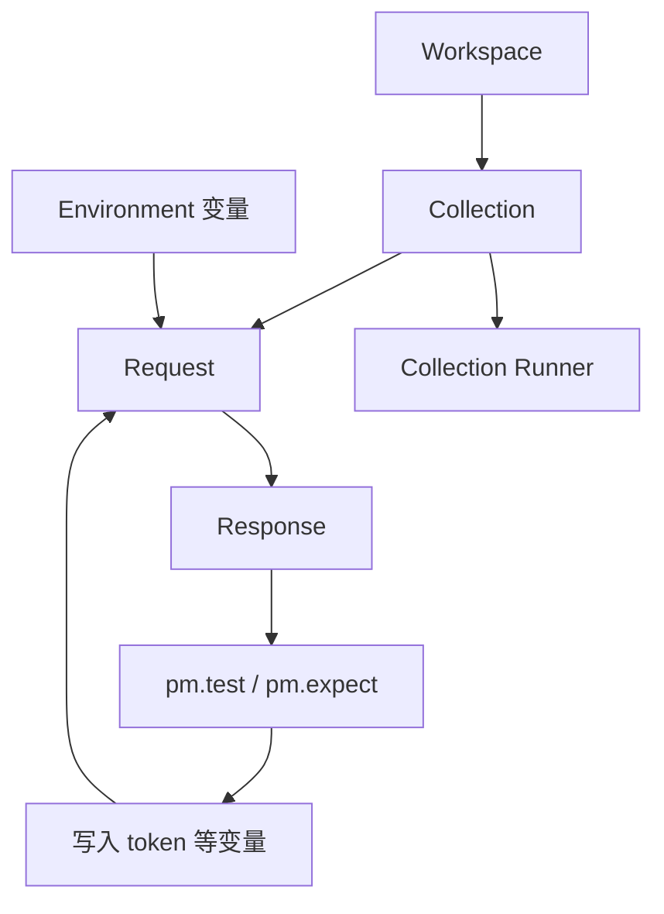

# 第 14 章：Postman

> 重要级别：⭐⭐⭐ 必须掌握  
> 核心章节发布目标：≥95/100  
> 主案例：MiniShop 个人软件测试实践项目

## 这一章解决什么问题

第 13 章已经能用 curl 打教学登录和订单接口。请求一多，手改 URL、Token 和断言就会出错：登录成功了，下一请求仍带着过期凭证；Collection 也没法给别人复现。

Postman 用来**组织请求、切换环境、传递变量、写可重复断言，并成组执行**。它不能代替契约和 SQL 核对，也不能把教学路径变成 MiniShop 正式 OpenAPI。

界面文案会改。本章以功能名为准：Workspace、Collection、Environment、`{{变量}}`、Post-response / Tests 脚本、Collection Runner。找不到按钮时，用应用内搜索这些英文名。

## 学习目标

完成本章后，你应该能够：

- 说明 Workspace、Collection、Request 的层次；
- 发出 GET/POST，填写 Query、Path、Header 和 JSON Body，并阅读 Response；
- 用 Environment 区分教学环境与其他环境，而不把生产配成默认；
- 使用 `{{baseUrl}}`、`{{token}}` 等变量；
- 在登录成功后用脚本把 Token 写入环境，供后续请求的 `Authorization` 使用；
- 使用 `pm.test` 与 `pm.expect` 断言状态码和 JSON 字段；
- 用 Collection Runner 按顺序跑 MiniShop 教学流程并看结果；
- 导出集合时脱敏，不分享真实密码和 Token。

## 前置知识

- 已完成第 13 章，理解接口、JSON、权限和幂等；
- 会读第 9 章的方法、状态码、Header、Body；
- 知道 Cookie 与 Bearer Token 不是互相替代的登录产品；
- 需要安装 Postman 应用，或使用团队提供的 Postman 网页版。本章不要求付费云功能。

## 场景导入：Token 又过期了

你用 curl 登录拿到 `teach-token`，粘到下一条 `Authorization`。十分钟后全部 401。同事无法复现，因为命令写在你的终端历史里，还夹着密码。

在 Postman 里应变成：

1. Collection 里固定顺序：登录 → 改购物车 → 创建订单；
2. Environment 提供 `baseUrl`；
3. 登录的 Post-response 脚本把 `token` 写入环境；
4. 后续请求使用 `Authorization: Bearer {{token}}`；
5. Runner 一次跑完，断言失败会标红。



只对授权测试环境或第 13 章教学服务发请求。不要把生产 Environment 分享到公开 Workspace。

---

## 14.1 Workspace、Collection、Request ⭐⭐⭐

| 对象 | 作用 | 测试纪律 |
| --- | --- | --- |
| Workspace | 人、集合、环境的工作空间 | 教学练习用个人或课程空间；不要把真实密钥放到公开空间 |
| Collection | 一组有名字、可分享的请求 | 按业务文件夹组织，如 `auth`、`cart`、`orders` |
| Request | 一次 HTTP 调用 | 名称写成可懂的测试意图，如 `登录-正确密码` |

Collection 不是测试报告，也不是 OpenAPI 本身。它可以对照文档建立，但文档仍是契约来源。

请求名称不要只叫 `POST` 或 `new request`。Runner 的结果列表靠名字阅读。

---

## 14.2 发出 GET 与 POST ⭐⭐⭐

新建 Request，选择方法，URL 使用变量：

```text
{{baseUrl}}/products?keyword=mouse
```

```text
{{baseUrl}}/login
```

第 9 章的语义在这里不变：GET 用于读取商品列表；登录、改数量、下单用 POST，因为会改变会话或数据。不要说“POST 更安全所以登录必须 POST”——登录用 POST 是因为会改状态，且密码不应出现在 query。

Params 面板编辑 Query 和 Path 变量，比把一长串 URL 写死更不容易漏。例如 Path `/orders/:orderId` 与 `{{orderId}}`。

Headers 至少检查：

- `Content-Type: application/json`（JSON Body 时）；
- `Authorization: Bearer {{token}}`（需认证时）。

Body 选 raw + JSON，不要用错误的 form 去冒充 JSON。第 13 章的缺字段、`null`、错误类型，在 Postman 里复制为**不同 Request**，不要在同一请求里来回改到分不清测了哪条。

发送后看 Response：状态码、耗时、Body、Headers。Preview 便于阅读 JSON，Raw 更接近原文。`200` 仍要断言 Body，不能只看绿色。

Postman 也能存 Cookie。教学登录若同时返回 `Set-Cookie` 与 JSON `token`，后续请求以文档为准：可能自动带 Cookie，也可能要你加 Bearer。两者可以同时存在，不是三选一的登录产品。

---

## 14.3 Environment 与变量 ⭐⭐⭐

**Environment** 是一组可切换的变量，用来区分本机教学服务、共享测试环境等。同一 Collection 换 Environment，不应改请求结构。

常用变量：

| 变量 | 建议范围 | 例子 |
| --- | --- | --- |
| `baseUrl` | Environment | `http://127.0.0.1:8080` |
| `phone` | Environment 或 Collection | 教学号 `13800138000` |
| `token` | Environment 的**当前值** | 登录脚本写入，不要填进可分享的初始值 |
| `orderId` | 运行中由脚本写入 | 创建订单后保存 |

在 URL、Header、Body 里用双花括号引用：

```text
{{baseUrl}}/orders
```

```json
{"phone":"{{phone}}","password":"{{password}}"}
```

密码若必须放变量：只放在本机 Environment 的当前值，导出前清空，Collection 里不要写死明文。更好的做法是本地一次性输入，不把真实密码提交进 Git。

脚本里读写环境（`tokenValue` 来自你解析后的响应，下面两行不是完整测试）：

```javascript
pm.environment.set("token", tokenValue);
const token = pm.environment.get("token");
```

范围从宽到窄常见为：global → collection → environment → data → local。同名时**更窄的生效**。`pm.variables.get` 按此解析。测试排障时先看当前选中了哪个 Environment，再看是否被 Collection 变量盖住。

官方文档还区分可分享的初始值与本机当前值。Token 属于凭证：不要勾选分享真实 Token，也不要在公开 Collection 注释里粘贴。

没有选中 Environment 时，`{{baseUrl}}` 可能发到错误地址或原样当字符串。Runner 前先确认选择器。

---

## 14.4 把登录 Token 传给后续请求 ⭐⭐⭐

教学流程（非正式 MiniShop 契约）：

1. `POST {{baseUrl}}/login`，JSON：`phone`、`password`；
2. 响应 `200`，Body 含 `token`（第 13 章教学服务还可能带 `Set-Cookie`）；
3. Post-response 脚本写入 `token`；
4. `POST {{baseUrl}}/cart/items` 与 `POST {{baseUrl}}/orders` 使用请求头 `Authorization: Bearer {{token}}`。

登录脚本（发送后执行；界面可能叫 **Tests** 或 **Post-response**）：

```javascript
pm.test("登录成功且返回 token", function () {
  pm.expect(pm.response.code).to.eql(200);
  const body = pm.response.json();
  pm.expect(body).to.have.property("result");
  pm.expect(body.result).to.eql("ok");
  pm.expect(body).to.have.property("token");
  pm.expect(body.token).to.be.a("string");
  pm.environment.set("token", body.token);
});
```

后续请求不要手抄 Token。断言失败时，先看登录是否真的 200，再看 Environment 里 `token` 是否被写入，最后看 Header 是否引用 `{{token}}` 而不是旧字符串。

未登录用例应使用**单独 Request**（去掉 Authorization 或不设 token），不要指望“先跑失败登录再跑业务”的顺序污染变量。需要时在预请求脚本里 `pm.environment.unset("token")`，但更清晰的是两个独立请求。

---

## 14.5 `pm.test` 与 `pm.expect` ⭐⭐⭐

Postman 沙箱提供 `pm` 对象。断言写在请求发送**之后**的脚本中。

- `pm.test("名称", function () { ... })`：登记一条有名字的检查，失败会在结果里显示该名称；
- `pm.expect(实际值)`：Chai 风格断言，如 `.to.eql`、`.to.have.property`、`.to.be.a`。

商品列表：

```javascript
pm.test("列表接口返回 JSON 数组结构", function () {
  pm.expect(pm.response.code).to.eql(200);
  const body = pm.response.json();
  pm.expect(body).to.have.property("items");
  pm.expect(body.items).to.be.an("array");
});
```

超过库存（教学服务 Body 必须带 `sku`，`qty=11` → `400`）：

```javascript
pm.test("超过库存应被拒绝", function () {
  pm.expect(pm.response.code).to.eql(400);
  const body = pm.response.json();
  pm.expect(body).to.have.property("error");
});
```

创建订单（Body 同样带 `sku` 与合法 `qty`）：

```javascript
pm.test("创建订单返回 id 且无状态字段", function () {
  pm.expect(pm.response.code).to.eql(201);
  const body = pm.response.json();
  pm.expect(body).to.have.property("id");
  pm.expect(body.id).to.be.a("string");
  pm.expect(body).to.not.have.property("status");
  const previous = pm.environment.get("orderId");
  if (previous) {
    pm.expect(body.id).to.not.eql(previous);
  }
  pm.environment.set("orderId", body.id);
});
```

第 6 步“再创建订单”复用上面脚本：第一次写入 `orderId`，第二次先比较再覆盖。不要只 `set` 而不比较，否则 Runner 无法证明不幂等。

未认证：

```javascript
pm.test("无凭证访问订单应失败", function () {
  pm.expect(pm.response.code).to.eql(401);
});
```

纪律：

- 一条 `pm.test` 只验证一件主要事情，名称用中文说清楚预期；
- `pm.response.json()` 在 Body 不是 JSON 时会抛错，可先断言状态码和 `Content-Type`；
- 不要在断言里打印完整 Token；
- 脚本通过不等于数据库正确，高风险步骤仍要按第 12、13 章做 `SELECT`；
- 预请求脚本（Pre-request）适合准备时间戳或跳过请求，不适合把“响应断言”写在发送前。

`pm.response.to.have.status(200)` 也可以。本章以 `pm.expect(pm.response.code)` 为主，便于和 curl `-w '%{http_code}'` 对照。

---

## 14.6 Collection Runner ⭐⭐⭐

**Collection Runner** 按你选择的顺序执行 Collection 或文件夹中的请求，并汇总 `pm.test` 结果。

跑 MiniShop 教学流程前：

1. 选对 Environment；
2. 确认顺序：登录（写 token）必须在需要认证的请求之前；
3. 未认证用例不要插在“登录成功写 token”和“带 token 的下单”中间，除非你有意 unset；
4. 看官方选项里与变量持久化相关的开关（名称可能是 Keep variable values / Persist）。教学跑完后检查 `token` 是否留在本机环境；不需要就不要持久化到可分享值。

迭代（Iterations）会把整段流程跑多遍。数据文件（CSV/JSON）可驱动不同 `phone`，属于进阶，本章不要求。多迭代时注意：创建订单可能产生多笔，测试库要能清理。

失败时：点开失败请求，看实际状态码、Body 和脚本行。不要只截一张“全红”的 Runner 首页。

Runner 只证明**这一组请求在当前环境下的断言**。它不是性能测试（Postman 另有性能运行类型，超出本章），也不是第 18 章的负载模型。

---

## 14.7 MiniShop 教学全流程 ⭐⭐⭐

在 Collection 中建立文件夹 `minishop-teaching`，建议请求如下。URL 一律带 `{{baseUrl}}`。密码只用变量或本机输入。

| 顺序 | 名称 | 方法与路径 | 主要断言 |
| --- | --- | --- | --- |
| 1 | 搜索商品 | `GET /products?keyword=mouse` | 200，`items` 为数组 |
| 2 | 登录-正确 | `POST /login` | 200，`result=ok`，写入 `token` |
| 3 | 改数量-合法 | `POST /cart/items` Body `{"sku":"SKU-DEMO-001","qty":1}` | 200 |
| 4 | 改数量-超库存 | `POST /cart/items` Body `{"sku":"SKU-DEMO-001","qty":11}` | 400 |
| 5 | 创建订单 | `POST /orders` + Bearer，Body `{"sku":"SKU-DEMO-001","qty":1}` | 201，有 `id`，无 `status` 字段 |
| 6 | 再创建订单 | 与 5 相同 | 201，新 `id` 与上次不同（演示不幂等） |
| 7 | 无凭证创建 | `POST /orders` 无 Authorization，Body 同上 | 401 |

第 6 步若产品正式要求幂等，应改为失败预期，并引用正式文档。教学服务两次成功、两个 id，与第 13 章审查结果一致。

Header：`Authorization: Bearer {{token}}` 仅用于 3～6。请求 7 明确不要该头。

导出 Collection 分享给同学时：删除 Environment 中的 token/password 当前值；检查请求 Body 没有真实密码；注释标明“教学路径，非正式 OpenAPI”。

---

## MiniShop 工作实战：Postman 集合包

提交一份可导入的说明，而不是无法复现的截图。保存：

```text
exercises/chapter-14-minishop-postman.md
```

必做：

1. 列出 Workspace / Collection / Environment 名称（可教学名）；
2. 实现 14.7 的 7 个请求（若无教学服务，对授权环境做等价映射，并写明真实路径不得冒充已冻结契约）；
3. 登录脚本写入 `token`，后续用 `{{token}}`；
4. 每个请求至少一条 `pm.test`；
5. 用 Runner 跑通一遍，记录通过/失败数（可打码截图，但必须有文字结果）；
6. 说明导出前如何脱敏。

```markdown
# MiniShop Postman 集合记录

## 环境
- Postman 版本：
- Environment 名：
- baseUrl：
- 是否授权：
- 日期：

## 请求清单
| 名称 | 方法 | 路径 | 断言要点 | Runner 结果 |

## Token
- 由哪个脚本 set：
- 后续哪几个请求 get：
- 是否写入可分享初始值：否

## Runner
- 顺序是否登录在前：
- 通过数 / 失败数：

## 脱敏
- 导出不含密码和 token：是
```

完成标准：7 个请求或等价映射；Token 不手抄；有超库存与未认证；有 Runner 结果；无订单状态臆造。

---

## 常见错误

### 错误 1：每个请求手粘 Token

修正：登录脚本 `pm.environment.set`，后续 `{{token}}`。

### 错误 2：Collection 写死 `http://127.0.0.1:8080`

修正：`{{baseUrl}}` + Environment，换机器只改环境。

### 错误 3：只看 Postman 状态码颜色，不写 `pm.test`

修正：Runner 不会替你记住“我刚才看过是 200”。

### 错误 4：把 `pm.test` 写在 Pre-request 里判断响应

修正：响应断言放在发送后的脚本。

### 错误 5：未认证请求放在登录成功之后，且共用已写入的 token

修正：单独请求，去掉 Authorization，或明确 unset。

### 错误 6：公开 Workspace 分享含生产 token 的 Environment

修正：凭证只留本机当前值；生产不要当练习默认环境。

### 错误 7：Runner 全绿就认为库存一定对

修正：脚本没查库。高风险仍要 SQL。

### 错误 8：GET 登录，因为“GET 能把 token 放 query 方便”

修正：凭证进 query 会进历史和日志；登录会改会话，应用 POST + Body。这不是“POST 加密”。

### 错误 9：两次下单都 201 就当作幂等通过

修正：应比较两个 `id` 和库中行数。教学服务两次不同 id 表示不幂等。

### 错误 10：把 Postman 集合当成 MiniShop 正式 OpenAPI 提交

修正：集合是测试资产，契约是 OpenAPI/PRD。教学路径未基线化。

---

## 面试角度 ⭐⭐⭐

回答顺序：结论 → 原理 → 场景 → 示例 → 边界。

### 为什么用 Postman 而不是只用不带变量的 curl？

结论：请求可组织、环境可切换、Token 可传递、断言可重复执行。  
示例：登录写入 `token`，Runner 跑购物车和订单。  
边界：curl 仍适合服务器上快速复现；Postman 不自动等于测试策略完整。

### Environment 和 Collection 变量有什么区别？

结论：Environment 随所选环境变；Collection 变量跟着集合走、不随环境切换而整组替换。  
示例：`baseUrl` 放 Environment；稳定的教学 header 名可放 Collection。  
边界：同名时更窄范围覆盖更宽范围。

### 如何把登录 Token 传给下一请求？

结论：在登录的 Post-response 里解析 JSON，`pm.environment.set("token", …)`，下一请求 Header 使用 `Bearer {{token}}`。  
边界：先断言 200 再 set；失败时不要写入错误 Body 当 token。

### `pm.test` 和 `pm.expect` 做什么？

结论：`pm.test` 注册一条有名字的检查；`pm.expect` 写具体比较。  
示例：`pm.expect(pm.response.code).to.eql(401)`。  
边界：脚本异常会导致测试失败，JSON 解析前要确认响应类型。

### Collection Runner 跑绿了能否上线？

结论：不能。它只说明所选请求在当前环境通过了你写的断言。  
还要看范围、未测权限组合、数据核对和剩余风险。第 6 章的出口标准仍然适用。

---

## 小练习

### 练习 1

Workspace、Collection、Request 各解决什么问题？为什么不要把所有练习塞进一个名叫 `new collection` 的扁平列表？

### 练习 2

为什么 `baseUrl` 应放在 Environment，而不是写进每一条 Request 的主机名？

### 练习 3

登录成功后下一请求仍 401。按顺序列出三个最该检查的点。

### 练习 4

下面脚本有什么问题？

```javascript
const body = pm.response.json();
pm.environment.set("token", body.token);
pm.test("ok", function () {
  pm.expect(true).to.eql(true);
});
```

### 练习 5

`pm.expect(pm.response.code).to.eql(200)` 通过，能否证明购物车数量没有超过库存？还缺什么？

### 练习 6

Collection Runner 中，把“无凭证创建订单”放在“登录成功”和“创建订单”之间，可能发生什么？

### 练习 7

哪一项正确？

A. Environment 里的 token 初始值应提交到 Git 方便同事  
B. Cookie 和 Bearer Token 在 Postman 里必须只保留一种  
C. 同名变量通常由更窄的范围覆盖更宽的范围  
D. Runner 全绿可以替代测试计划的出口标准

### 练习 8

教学两次 `POST /orders` 得到不同 `id`。在 Postman 里怎样断言“不幂等”？若正式需求改为幂等，断言应怎样改？

### 练习 9

导出 Collection 前应去掉哪些内容？为什么 HAR/cURL 的脱敏纪律在这里同样适用？

### 练习 10

根据 14.7，写出登录请求的方法、URL 变量、Body 字段，以及 Post-response 里至少两条断言。不要填写真实密码，不要写订单状态名。

## 练习答案

1. Workspace 管协作边界；Collection 管一组请求；Request 是单次调用。扁平无名称的列表在 Runner 里无法阅读，也无法按登录/权限拆分。
2. 换主机、端口、https 时只改环境；请求结构保持同一套教学路径。
3. 登录是否 200 且脚本执行；Environment 是否选中且含 `token`；后续请求 Header 是否为 `Bearer {{token}}` 而非空或旧值。
4. 未先断言状态码和 `token` 是否存在就 set；`pm.test` 恒真没有验证响应。失败登录可能把 `undefined` 写入环境。
5. 不能。还要断言 400 或业务错误 Body，并在授权库 `SELECT` qty 与 stock。
6. 若无凭证请求复用已写入的 token，可能变成已认证而测不到 401；若它 unset token，后面的创建订单会误失败。
7. C。
8. 保存第一次 `orderId`，第二次 `pm.expect(body.id).to.not.eql(pm.environment.get("orderId"))`。若需求幂等：第二次应同一 `id` 或明确拒绝重复创建，以正式文档为准。
9. 密码、token、Cookie、内部生产 URL。集合与 cURL 一样会复制凭证。
10. `POST {{baseUrl}}/login`；Body `phone` 与密码变量；断言 200、`result=ok`、存在字符串 `token` 并 set 环境。合理等价即可。

---

## 本章检查清单

- [ ] 我能分清 Workspace、Collection、Request
- [ ] 我会发 GET/POST 并阅读 Response
- [ ] 我会用 Environment 和 `{{baseUrl}}`
- [ ] 我能用脚本传递 `token`，而不是手抄
- [ ] 我会写 `pm.test` + `pm.expect`
- [ ] 我知道脚本绿不等于数据库对
- [ ] 我会用 Runner 按顺序执行并解读失败
- [ ] 我不会把未认证请求和已写入 token 的流程搅在一起
- [ ] 我导出前会脱敏
- [ ] 我不会把教学集合当成正式 OpenAPI
- [ ] 我能完成 Postman 集合包

### 进入下一章的自测门槛

1. 练习 1～10 至少完成 9 题，且第 3、4、7、8 题能用自己的话回答；
2. 亲手跑通：登录写 token → 带 token 的请求 → 无凭证 401；
3. 至少一条超库存或等价业务失败断言；
4. 完成 MiniShop Postman 集合包。

## 本章总结

本章需要真正掌握七件事：

1. Collection 组织请求，Environment 切换地址和密钥范围；
2. 用 `{{变量}}` 避免写死 URL 和 Token；
3. 登录后用 Post-response 写入 token，后续 Bearer 引用它；
4. `pm.test` 命名检查，`pm.expect` 做比较；
5. Runner 按顺序执行，登录必须在需要认证的请求之前；
6. 全绿只覆盖你写过的断言，不含未写的 SQL 和未测的权限组合；
7. 集合是测试资产，必须脱敏，不能冒充正式契约。

## 本章可运行性说明

Postman 界面无法在教材仓库里自动点击。审查做了两件事：

1. 将本章 `pm.test` / `pm.expect` / `pm.environment.set` 示例放进带有模拟 `pm` 对象的脚本，用教学响应 JSON 执行：登录 200 写入 `teach-token`；`qty=11` 断言 400；创建订单断言 201、有 `id`、无 `status`；无凭证断言 401。
2. 校验教学 Collection 的 JSON 能解析，且 `info.schema` 指向 Collection v2.1。

未启动 Postman GUI。学习者须在本机 Postman 对教学服务或授权环境完成门槛 2。正式 OpenAPI 未冻结。密码与 token 不得提交进 Git。

## 参考资料

- [Postman：pm.test and pm.expect](https://learning.postman.com/docs/tests-and-scripts/write-scripts/postman-sandbox-reference/pm-test-expect)（本章于 2026-09-08 核验）
- [Postman：Variables](https://learning.postman.com/docs/sending-requests/variables/variables)
- [Postman：Environments](https://learning.postman.com/docs/sending-requests/variables/managing-environments)
- [Postman：Collection Runner](https://learning.postman.com/docs/tests-and-scripts/running-collections/intro-to-collection-runs)
- [Postman Collection Format v2.1](https://schema.getpostman.com/json/collection/v2.1.0/collection.json)
- 本仓库 [第 13 章：接口测试](13-api-testing.md)
- 本仓库 [全局内容质量标准](../standards/QUALITY_STANDARD_v1.0.md)

## 下一章预告

下一章进入第 15 章《Python 测试基础》。你将用变量、列表、字典、函数和 JSON 处理测试数据，为第 16 章的 pytest 做准备。重点不是成为 Python 开发工程师，而是能读懂和改小段测试脚本。
