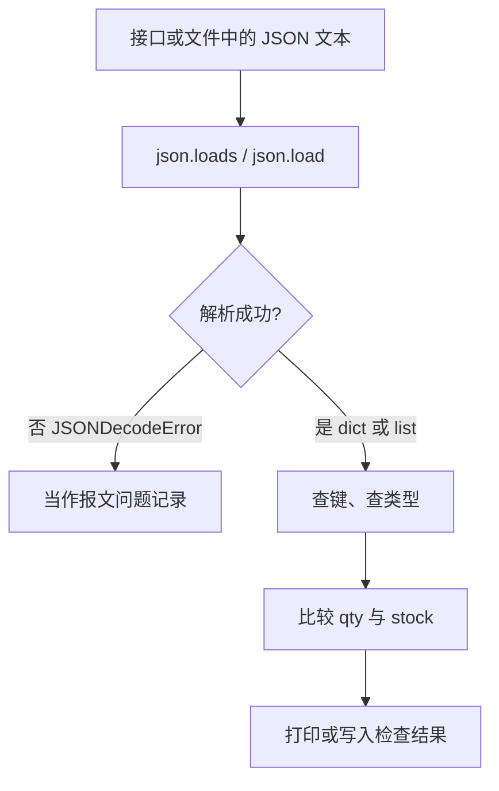

# 第 15 章：Python 测试基础

> 重要级别：⭐⭐⭐ 必须掌握  
> 主案例：MiniShop 个人软件测试实践项目

## 这一章解决什么问题

第 13、14 章已经能用 curl 和 Postman 打教学接口，并能对状态码和 JSON 字段写断言。请求一多，你就会反复做同一类事：从登录响应里取出 `token`，遍历购物车列表，判断 `qty` 有没有超过 `stock`，区分缺字段、`null` 和错误类型。

靠眼睛看三条响应还行，三十条就会漏。Python 用来**把已经拿到的测试数据变成可重复的检查**。它不是用来把你训练成 Python 开发工程师的。课程把 Python 和 pytest 放在第二梯队：初级功能测试可以先靠需求、用例、Web、HTTP、SQL 和 Postman 吃饭；要进入第 16 章的接口自动化，就必须能读懂和改这些小段脚本。

本章只使用 Python 标准库。不讲类、装饰器、继承、异步，也不在本章安装 `requests` 或 `pytest`。

审查环境为 Python 3.14.3。学习者使用 **Python 3.12 或更新的 3.x** 即可；语法以官方 3.x 文档为准，不要使用 Python 2。

## 学习目标

完成本章后，你应该能够：

- 在本机确认 Python 3 可用，并运行一个 `.py` 脚本；
- 使用变量、`int`/`str`/`bool`/`None`，并分清 `==` 与 `is`；
- 处理字符串、列表、字典、元组和集合；
- 编写 `if` / `for` 和简单函数；
- 使用 `import`，并用 `venv` + `python3 -m pip` 理解第三方库从哪来；
- 用 `encoding="utf-8"` 读写文本文件；
- 用 `try` / `except` 处理 `KeyError` 和 `json.JSONDecodeError`；
- 用 `json.loads` / `json.dumps` 在 JSON 文本和 Python 对象之间转换；
- 对 MiniShop 教学数据：取出 `token`，区分缺字段 / `null` / 错误类型，判断数量是否超过库存。

## 前置知识

- 已完成第 13、14 章，能阅读 JSON，知道缺字段、`null`、`""`、错误类型不是同一条用例；
- 会使用终端（第 11 章）；
- 不要求任何编程工作经验；
- 不要求成为 Python 开发工程师，不要求本时代码仓库或 Web 框架。

## 场景导入：三十条购物车，哪几条超库存？

教学规则仍是：登录用户修改购物车数量时，数量必须是正整数，且不得超过提交时可售库存。`SKU-DEMO-001` 的教学库存是 10。

Postman 里你已经见过这样的 Body：

```json
{"sku":"SKU-DEMO-001","qty":11}
```

再看一条登录成功响应：

```json
{"result":"ok","token":"teach-token"}
```

以及一条列表：

```json
{
  "items": [
    {"sku": "SKU-DEMO-001", "qty": 1, "stock": 10},
    {"sku": "SKU-DEMO-002", "qty": 11, "stock": 5}
  ]
}
```

测试要回答的不是“我会写 for 循环”，而是：

1. 这段文本是不是合法 JSON；
2. `token` 键在不在、值是不是非空字符串；
3. 哪一行 `qty > stock`；
4. `qty` 缺失、为 `null`、为 `""`、为 `"11"` 时分别怎么标。



这些 JSON 是**已经拿到的教学数据**，不是 MiniShop 正式 OpenAPI，也不冻结订单状态名。本章不发 HTTP；发请求是第 16 章 `requests` 的事。

---

## 15.1 测试工程师为什么学 Python ⭐⭐⭐

生活类比：Postman 像柜台点餐，一份一份看。Python 像把菜单打印成表格后用尺去对库存列。

正式一点：Python 是一种通用编程语言。测试工作里它最常用来：

- 解析和构造 JSON；
- 批量检查列表里的字段；
- 读测试数据文件；
- 作为 pytest、requests 等工具的宿主语言。

测试工程师需要它，是因为接口响应、配置和日志经常是结构化文本。不会处理 `dict` 和 `list`，自动化脚本就只能停留在“能发出去”。

实际使用时机：

- 把 Postman 里重复的取值判断写成函数；
- 读取一份 JSON 用例文件，逐条检查；
- 下一章用 pytest 调这些函数。

它不能替代：需求评审、用例设计、手工探索、SQL 核对、缺陷报告。也不要说“会 Python 就比接口测试 ROI 永远高”——适不适合自动化仍取决于变更频率、稳定性和风险。

---

## 15.2 安装、解释器与脚本 ⭐⭐⭐

到 [python.org](https://www.python.org/) 安装当前稳定的 Python 3。安装向导会变，本章以终端能运行为准。

| 系统 | 常用命令 |
| --- | --- |
| macOS / Linux | `python3 --version` |
| Windows | `py -3 --version` |

应看到 `Python 3.12` 或更新。若命令不存在，先安装，不要用编辑器“能高亮”当成已安装。

审查机器输出：

```text
Python 3.14.3
```

交互环境（REPL）适合试一句表达式。输入 `python3` 后：

```text
>>> 1 + 1
2
>>> exit()
```

正式练习写成 `.py` 文件。把下面保存为 `hello_minishop.py`：

```python
print("hello, minishop")
```

在同一目录执行：

```bash
python3 hello_minishop.py
```

应打印 `hello, minishop`。

三条纪律：

1. **缩进是语法。** 空格数量错了会 `IndentationError`。本章统一 4 个空格，不要混用 Tab。
2. **注释以 `#` 开头**，解释“为什么”，不要叙述“我正在写代码”。
3. **确认你运行的就是 3.x。** `python` 在部分机器上可能指向别的程序。测试脚本一律写明用 `python3` 或 `py -3`。

`print` 会把结果打到终端。测试脚本可以先用它看中间值；本章稍后用语言自带的 `assert` 做脚本自检；第 16 章再用 pytest 出报告。`assert` 不是 pytest 专用语法。

---

## 15.3 变量与基本类型 ⭐⭐⭐

变量是贴在对象上的名字。最简单：

```python
stock = 10
sku = "SKU-DEMO-001"
```

`stock` 不是“永远是整数的盒子”，它是当前指向那个整数对象的名字。

测试里常用的内置类型：

| 类型 | 例子 | 测试含义 |
| --- | --- | --- |
| `int` | `11` | 数量、库存 |
| `float` | `11.0` | JSON 里写成 `11.0` 时，`json.loads` 会得到浮点数 |
| `str` | `"SKU-DEMO-001"` | 编号、手机号、token |
| `bool` | `True` / `False` | 条件结果；对应 JSON 的 `true` / `false` |
| `None` | `None` | 对应 JSON 的 `null` |

```python
phone = "13800138000"
qty = 11
stock = 10
allowed = qty <= stock
missing = None
print(type(phone).__name__, type(qty).__name__, allowed, missing)
```

运行后打印：

```text
str int False None
```

手机号要用字符串。写成整数 `13800138000` 会丢掉“必须是 11 位数字”这种测试信息，也不该拿来做算术。

### `==` 和 `is`

- `==` 比较**值是否相等**；
- `is` 比较**是不是同一个对象**。

`None` 用 `is` / `is not`。数字、字符串、列表用 `==`。

```python
qty = 11
print(qty == 11)
print(qty is None)
print(None is None)
```

运行后打印：

```text
True
False
True
```

不要写 `qty is 11`。Python 3.14 会对“用 `is` 比较 int 字面量”给出 `SyntaxWarning`，而且即使某些小整数看起来碰巧 `is` 为真，也不能当测试依据。

### 真值：`if qty` 会漏掉 0

在条件里，下面这些会被当成假：`None`、`False`、`0`、`0.0`、`""`、`[]`、`{}`。

库存为 0 的商品是合法业务数据，不是“没有数量”。

```python
qty = 0
if qty:
    print("有数量")
else:
    print("被当成没有数量")
```

运行后打印：

```text
被当成没有数量
```

要判断“有没有这个字段”，用 `"qty" in item`。要判断“是不是 0”，用 `qty == 0`。不要用 `if qty` 代替这两种检查。

`True == 1` 在 Python 里成立。检查 JSON 整数时不要只用 `isinstance(value, int)`，否则 `true` 也会被当成数量。本章用 `type(value) is int`。不必为此去学类和继承；把它当成“布尔值会冒充整数”的测试陷阱即可。

---

## 15.4 字符串 ⭐⭐⭐

字符串是文本。教学手机号、SKU、token 都是字符串。

```python
phone = "13800138000"
sku = "SKU-DEMO-001"
print(len(phone), phone[:3], phone[-4:], sku.startswith("SKU-"))
print("138" in phone)
print(f"sku={sku}, phone={phone}")
```

运行后打印：

```text
11 138 8000 True
True
sku=SKU-DEMO-001, phone=13800138000
```

| 操作 | 作用 |
| --- | --- |
| `len(s)` | 长度 |
| `s[:3]` / `s[-4:]` | 切片：前 3 位、后 4 位 |
| `s.strip()` | 去掉首尾空白 |
| `s.split(",")` | 按分隔符切开，得到列表 |
| `s.startswith(...)` | 前缀 |
| `f"...{变量}..."` | 格式化（f-string，3.6+） |

边界：

- `"11"` 不是 `11`。接口把数量写成字符串时，业务层可能拒收，测试必须当错误类型，而不是自己先 `int("11")` 再宣称合法。
- 拼接路径可以，但构造 JSON 不要靠一长串 `+`。用字典再 `json.dumps`。
- 比较 token 时不要在日志里打印完整值。

---

## 15.5 列表、元组、集合 ⭐⭐⭐

### 列表 `list`

列表是有序、可改的序列。JSON 数组进 Python 后就是 `list`。

最简单：

```python
skus = ["SKU-DEMO-001"]
```

正常：购物车多行。

```python
items = [
    {"sku": "SKU-DEMO-001", "qty": 1, "stock": 10},
    {"sku": "SKU-DEMO-002", "qty": 11, "stock": 5},
]
print(len(items), items[0]["sku"], items[-1]["qty"])
items.append({"sku": "SKU-DEMO-003", "qty": 1, "stock": 3})
print(len(items))
```

运行后打印：

```text
2 SKU-DEMO-001 11
3
```

下标从 0 开始。`items[0]` 是第一行，`items[-1]` 是最后一行。超出范围会 `IndexError`。

### 元组 `tuple`

元组有序但**创建后不能改元素**。函数返回一对值时常见。

```python
pair = ("SKU-DEMO-001", 10)
print(pair[0], pair[1])
try:
    pair[1] = 9
except TypeError:
    print("tuple_immutable")
```

运行后打印：

```text
SKU-DEMO-001 10
tuple_immutable
```

JSON **没有**元组：`json.dumps((1, 2))` 会变成数组 `[1, 2]`。不要指望往接口 Body 里发“Python 元组类型”。

### 集合 `set`

集合无序、元素唯一。适合回答“去重后有几个 SKU”。

```python
skus = ["SKU-DEMO-001", "SKU-DEMO-001", "SKU-DEMO-002"]
unique = set(skus)
print(len(skus), len(unique), "SKU-DEMO-001" in unique)
```

运行后打印：

```text
3 2 True
```

集合**不能**直接 `json.dumps`：

```python
import json

try:
    json.dumps({"SKU-DEMO-001"})
except TypeError:
    print("set_not_json")
```

运行后打印：

```text
set_not_json
```

要写进 JSON 就先 `list(unique)`。

---

## 15.6 字典 ⭐⭐⭐

字典是键到值的映射。JSON 对象进 Python 后就是 `dict`。这是接口测试里最重要的结构。

最简单：

```python
item = {"sku": "SKU-DEMO-001", "qty": 1}
```

取值：

```python
item = {"sku": "SKU-DEMO-001", "qty": 1}
print(item["sku"])
print(item.get("qty"))
print("stock" in item)
print(item.get("stock"))
print(item.get("stock", "MISSING"))
```

运行后打印：

```text
SKU-DEMO-001
1
False
None
MISSING
```

| 写法 | 键不存在时 |
| --- | --- |
| `item["stock"]` | `KeyError` |
| `"stock" in item` | `False` |
| `item.get("stock")` | `None`（和值为 `null` 分不清） |
| `item.get("stock", "MISSING")` | 得到你给的默认值 |

第 13 章要求分清缺字段和 `null`。对应到 Python：

```python
missing = {}
null_qty = {"qty": None}
zero = {"qty": 0}

print("qty" in missing, missing.get("qty"))
print("qty" in null_qty, null_qty.get("qty"))
print("qty" in zero, zero.get("qty"))
```

运行后打印：

```text
False None
True None
True 0
```

`get` 在“没有键”和“键的值是 `None`”时都得到 `None`。要区分，必须先 `"qty" in body`。

`in` 对字典检查的是**键**，不是值：

```python
body = {"token": "teach-token"}
print("token" in body)
print("teach-token" in body)
```

运行后打印：

```text
True
False
```

### 赋值是贴名字，不是复制一份

```python
payload = {"sku": "SKU-DEMO-001", "qty": 1}
alias = payload
copy = dict(payload)
alias["qty"] = 11
print(payload["qty"], copy["qty"])
```

运行后打印：

```text
11 1
```

`alias` 和 `payload` 是同一个对象，改一个等于改另一个。构造多条用例时用 `dict(payload)` 或 `payload.copy()` 做浅拷贝。嵌套字典的深拷贝本章不展开；内层结构被改到“串味”，先怀疑是不是共用了同一个对象。

---

## 15.7 条件与循环 ⭐⭐⭐

### 条件

```python
qty = 11
stock = 10
if qty > stock:
    print("exceeds_stock")
elif qty < 1:
    print("qty_not_positive")
else:
    print("ok")
```

运行后打印：

```text
exceeds_stock
```

比较用 `==` `!=` `<` `>` `<=` `>=`。组合用 `and` / `or` / `not`。

### 循环

遍历购物车是测试里最常见的循环。

```python
items = [
    {"sku": "SKU-DEMO-001", "qty": 1, "stock": 10},
    {"sku": "SKU-DEMO-002", "qty": 11, "stock": 5},
]
for item in items:
    if item["qty"] > item["stock"]:
        print(item["sku"])
```

运行后打印：

```text
SKU-DEMO-002
```

`for sku, stock in stocks.items()` 用于遍历“SKU → 库存”这类字典。`range(n)` 用于“重复 n 次”，测试数据更常直接遍历列表。

`while` 适合“还不知道要做几次”，例如重试。必须有退出条件，避免死循环打接口。本章练习以 `for` 为主。

### 列表推导 ⭐⭐

从列表抽出一列 SKU：

```python
items = [
    {"sku": "SKU-DEMO-001", "qty": 1},
    {"sku": "SKU-DEMO-002", "qty": 11},
]
skus = [item["sku"] for item in items]
print(skus)
```

运行后打印：

```text
['SKU-DEMO-001', 'SKU-DEMO-002']
```

先写懂 `for` 再写推导。嵌套推导本章不要求。

---

## 15.8 函数 ⭐⭐⭐

函数把“一段可重复的检查”变成有名字的步骤。最简单：

```python
def add(a, b):
    return a + b


print(add(1, 2))
```

运行后打印：

```text
3
```

正常例子：数量是否允许。

```python
def qty_allowed(qty, stock):
    if type(qty) is not int or type(stock) is not int:
        return False
    if qty < 1:
        return False
    return qty <= stock


print(qty_allowed(1, 10))
print(qty_allowed(10, 10))
print(qty_allowed(11, 10))
print(qty_allowed("11", 10))
```

运行后打印：

```text
True
True
False
False
```

边界：默认参数不要用可变对象。

```python
def add_item(item, bucket=[]):
    bucket.append(item)
    return bucket


print(add_item("a"))
print(add_item("b"))
```

运行后打印：

```text
['a']
['a', 'b']
```

第二次调用仍在用**同一个**默认列表。正确写法：

```python
def add_item(item, bucket=None):
    if bucket is None:
        bucket = []
    bucket.append(item)
    return bucket


print(add_item("a"))
print(add_item("b"))
```

运行后打印：

```text
['a']
['b']
```

函数要 `return` 对调用者有用的值。只 `print` 不返回，下一章 pytest 很难断言。密码、完整 token 不要当返回值打印到会提交的文件里。

Python 的 `assert` 在条件为假时抛出 `AssertionError`：

```python
def qty_allowed(qty, stock):
    if type(qty) is not int or type(stock) is not int:
        return False
    if qty < 1:
        return False
    return qty <= stock


assert qty_allowed(1, 10)
assert not qty_allowed(11, 10)
```

无输出表示这两条通过。它适合脚本自检；批量测试报告、夹具和参数化是第 16 章 pytest 的工作。不要用 `python -O` 跑这些练习（`-O` 会去掉 `assert`）。

---

## 15.9 模块、import、venv 与 pip ⭐⭐⭐

**模块**是一份可被复用的 Python 代码。**导入**用 `import`。

```python
import json

body = json.loads('{"token":"teach-token"}')
print(body["token"])
```

运行后打印：

```text
teach-token
```

`from json import loads` 也可以，但看到 `loads(...)` 时不容易想起它来自哪。本章正文用 `import json`。

两类来源：

| 来源 | 例子 | 本章 |
| --- | --- | --- |
| 标准库 | `json`、`pathlib` | 直接 `import` |
| 第三方 | `requests`、`pytest` | 先安装到虚拟环境；第 16 章再用 |

**pip** 是安装第三方包的工具。官方推荐用解释器模块方式调用：`python3 -m pip`，避免系统里另一个 `pip` 装到错误的 Python。

**虚拟环境（venv）** 是项目自己的一套 Python 和 site-packages，避免把包装进系统解释器。Debian/Ubuntu 等发行版会把系统 Python 标成“由发行版管理”（PEP 668）：直接 `pip install` 常被拒绝。正确反应是建 venv，而不是随手加 `--break-system-packages`，更不要 `sudo pip install`。

在**你自己的练习目录**（不要拿课程仓库当安装实验场）：

```bash
python3 -m venv .venv
```

激活：

```bash
source .venv/bin/activate
```

Windows cmd 使用 `.venv\Scripts\activate`；PowerShell 使用 `.venv\Scripts\Activate.ps1`。

激活后，`python3 -m pip install -U pip` 只升级这个环境里的 pip。本章**不要**安装 `requests` / `pytest`；下一章再装。查看：

```bash
python3 -m pip list
```

应能看到 `pip`。`deactivate` 退出虚拟环境。

`.venv` 不要提交进 Git。团队若使用 uv、Poetry 等工具，隔离原理相同；本章以官方 `venv` + `pip` 为准，不把第三方打包工具当必修。

`if __name__ == "__main__":` 表示“直接运行本文件时才执行”，被 `import` 时不跑。完整练习脚本会用到它。

---

## 15.10 文件 ⭐⭐⭐

测试数据常放在 JSON 文件里。用 `with` 打开，并**显式写 UTF-8**，避免 Windows 默认编码把中文读乱。

先准备 `cart_cases.json`（内容见 15.12 实战）。读取：

```python
import json

with open("cart_cases.json", encoding="utf-8") as f:
    cases = json.load(f)
print(type(cases).__name__, len(cases), cases[0]["name"])
```

在包含该文件的目录运行后打印：

```text
list 8 合法数量
```

| 函数 | 对象 | 文件 |
| --- | --- | --- |
| `json.loads` / `json.dumps` | 字符串 | 不直接碰磁盘 |
| `json.load` / `json.dump` | — | 读写文件对象 |

写入练习结果：

```python
import json

result = {"over": ["SKU-DEMO-002"]}
with open("lab_result.json", "w", encoding="utf-8") as f:
    json.dump(result, f, ensure_ascii=False, indent=2)
```

无终端输出，会在当前目录生成 `lab_result.json`。

纪律：

- 只写自己的练习目录。不要覆盖别人的数据，不要写生产路径；
- `"w"` 会截断已有文件。不确定就换新文件名；
- 文本模式加 `encoding="utf-8"`。不要用默认编码碰含中文的用例文件；
- `with` 结束会关闭文件，不要依赖自己记得 `close()`。

`pathlib.Path` 也可以处理路径，属于常用进阶，本章练习用 `open` 即可。

---

## 15.11 异常 ⭐⭐⭐

程序遇到错误会**抛出异常**。不处理就会中断。测试脚本要区分：

- 输入本来就该失败（非法 JSON）——抓住并记成检查结果；
- 脚本自己写错了——不要用光秃秃的 `except:` 吞掉。

最简单：

```python
try:
    int("x")
except ValueError:
    print("not an int")
```

运行后打印：

```text
not an int
```

正常：解析接口 Body。

```python
import json

def parse_object(text):
    try:
        data = json.loads(text)
    except json.JSONDecodeError:
        return None
    if type(data) is not dict:
        return None
    return data


print(parse_object('{"qty":1}')["qty"])
print(parse_object("{qty:1}"))
```

运行后打印：

```text
1
None
```

边界：缺键是 `KeyError`，不是 `JSONDecodeError`。

```python
item = {"sku": "SKU-DEMO-001"}
try:
    print(item["qty"])
except KeyError:
    print("missing qty")
```

运行后打印：

```text
missing qty
```

业务上更稳的写法仍是 `"qty" in item`，而不是靠异常当控制流。异常留给“解析失败、文件不存在”这类意外。

`json.JSONDecodeError` 是 `ValueError` 的子类。文件不存在是 `FileNotFoundError`。捕获时尽量写具体类型。不要 `except Exception` 之后什么都不做；至少打印或返回明确失败原因。

解析失败本身可能是缺陷：响应声明 `application/json` 却不是 JSON。不要在脚本里“尽量修一修再当成功”。

---

## 15.12 JSON 与 Python 对照 ⭐⭐⭐

第 13 章按 RFC 8259 讲 JSON。Python 标准库 `json` 负责文本和对象的转换。官方文档可能仍引用较早的 RFC 编号；测试关心的对象、数组、`true` / `false` / `null` 规则与 RFC 8259 一致。

默认转换：

| JSON | Python |
| --- | --- |
| object | `dict` |
| array | `list` |
| string | `str` |
| 整数 | `int` |
| 带小数或指数的数字 | `float` |
| `true` / `false` | `True` / `False` |
| `null` | `None` |

反向：`dict` → object，`list`/`tuple` → array，`str` → string，`int`/`float` → number，`True`/`False`/`None` → `true`/`false`/`null`。`set` 不能默认编码。

```python
import json

text = '{"result":"ok","token":"teach-token","qty":null}'
body = json.loads(text)
print(type(body).__name__)
print(body["result"], body["token"], body["qty"])
print(json.dumps({"qty": None, "ok": True}))
print(json.dumps((1, 2)))
```

运行后打印：

```text
dict
ok teach-token None
{"qty": null, "ok": true}
[1, 2]
```

JSON **不是** Python 字面量：

| 非法当 JSON 的写法 | 原因 |
| --- | --- |
| `{'qty': 1}` | 单引号 |
| `{"qty": True}` | `True` 不是 `true` |
| `{"qty": None}` | `None` 不是 `null` |
| `{"qty": 1,}` | 标准 JSON 不允许末尾逗号 |

```python
import json

samples = [
    "{'qty': 1}",
    """{"qty": True}""",
    """{"qty": 1,}""",
]
for text in samples:
    try:
        json.loads(text)
        print("parsed")
    except json.JSONDecodeError:
        print("invalid")
```

运行后打印：

```text
invalid
invalid
invalid
```

不要用 `eval` 解析接口响应。`eval` 会执行文本里的 Python 代码，既不安全，也不能按 JSON 规则工作。

数字类型陷阱：

```python
import json

print(type(json.loads('{"qty":11}')["qty"]).__name__)
print(type(json.loads('{"qty":11.0}')["qty"]).__name__)
```

运行后打印：

```text
int
float
```

`11` 和 `11.0` 在 JSON 里都是 number，到 Python 后类型不同。测试“必须是整数数量”时要看类型，不能只看 `== 11`（`11.0 == 11` 为真）。

`json.dumps` 默认 `ensure_ascii=True`，非 ASCII 会写成 `\uXXXX`。写给自己看的中文结果文件可用 `ensure_ascii=False`。

---

## MiniShop 工作实战：教学数据检查脚本 ⭐⭐⭐

在自己的练习目录做，不要把密码写进文件。保存说明：

```text
exercises/chapter-15-minishop-python.md
```

以及两个可运行文件：`cart_cases.json`、`check_minishop_data.py`。

### 用例文件 `cart_cases.json`

```json
[
  {"name": "合法数量", "sku": "SKU-DEMO-001", "qty": 1, "stock": 10, "expect": "ok"},
  {"name": "等于库存", "sku": "SKU-DEMO-001", "qty": 10, "stock": 10, "expect": "ok"},
  {"name": "超过库存", "sku": "SKU-DEMO-001", "qty": 11, "stock": 10, "expect": "exceeds_stock"},
  {"name": "缺字段", "sku": "SKU-DEMO-001", "stock": 10, "expect": "missing_qty"},
  {"name": "null", "sku": "SKU-DEMO-001", "qty": null, "stock": 10, "expect": "null_qty"},
  {"name": "空字符串", "sku": "SKU-DEMO-001", "qty": "", "stock": 10, "expect": "wrong_type_qty"},
  {"name": "错误类型", "sku": "SKU-DEMO-001", "qty": "11", "stock": 10, "expect": "wrong_type_qty"},
  {"name": "数量为 0", "sku": "SKU-DEMO-001", "qty": 0, "stock": 10, "expect": "qty_not_positive"}
]
```

`expect` 是本章脚本自己的标签，不是 MiniShop 正式错误码，也不是订单状态。

### 脚本 `check_minishop_data.py`

```python
import json

LOGIN_OK = '{"result":"ok","token":"teach-token"}'
LOGIN_BAD = '{"result":"error"}'
CART_LIST = """
{
  "items": [
    {"sku": "SKU-DEMO-001", "qty": 1, "stock": 10},
    {"sku": "SKU-DEMO-002", "qty": 11, "stock": 5}
  ]
}
"""


def extract_token(body):
    if type(body) is not dict:
        return None
    if "token" not in body:
        return None
    token = body["token"]
    if type(token) is not str or token == "":
        return None
    return token


def qty_status(item):
    if type(item) is not dict:
        return "not_an_object"
    if "qty" not in item:
        return "missing_qty"
    qty = item["qty"]
    if qty is None:
        return "null_qty"
    if type(qty) is not int:
        return "wrong_type_qty"
    if "stock" not in item:
        return "missing_stock"
    stock = item["stock"]
    if type(stock) is not int:
        return "wrong_type_stock"
    if qty < 1:
        return "qty_not_positive"
    if qty > stock:
        return "exceeds_stock"
    return "ok"


def parse_object(text):
    try:
        data = json.loads(text)
    except json.JSONDecodeError:
        return None
    if type(data) is not dict:
        return None
    return data


def load_cases(path):
    with open(path, encoding="utf-8") as f:
        data = json.load(f)
    if type(data) is not list:
        raise ValueError("cases file must be a JSON array")
    return data


def main():
    login = parse_object(LOGIN_OK)
    token = extract_token(login)
    assert token == "teach-token"
    assert extract_token(parse_object(LOGIN_BAD)) is None

    cart = parse_object(CART_LIST)
    over = []
    for item in cart["items"]:
        if qty_status(item) == "exceeds_stock":
            over.append(item["sku"])
    assert over == ["SKU-DEMO-002"]

    failed = []
    for case in load_cases("cart_cases.json"):
        actual = qty_status(case)
        if actual != case["expect"]:
            failed.append((case["name"], actual, case["expect"]))
    if failed:
        raise AssertionError(failed)

    order = {"id": "ord-demo-01"}
    assert "id" in order
    assert "status" not in order

    print("token_ok")
    print("over", ",".join(over))
    print("cases_ok", len(load_cases("cart_cases.json")))


if __name__ == "__main__":
    main()
```

同一目录执行：

```bash
python3 check_minishop_data.py
```

审查结果：

```text
token_ok
over SKU-DEMO-002
cases_ok 8
```

完成标准：

1. 能取出教学 `token`，失败登录返回 `None`；
2. 列表里找出超库存的 SKU；
3. 八条用例的 `expect` 全部命中；
4. 订单只检查有 `id`、没有 `status` 字段，不编造状态名；
5. 说明文件里写明：这是个人练习脚本，不是 MiniShop 正式自动化框架，也不是已冻结契约。

记录模板：

```markdown
# MiniShop Python 数据检查记录

## 环境
- Python 版本：
- 是否虚拟环境：
- 日期：

## 运行
- 命令：
- 输出：

## 结论
- token 检查：
- 超库存 SKU：
- 用例文件条数与是否全部命中：

## 声明
- 非正式 OpenAPI；无订单状态臆造；无密码入库。
```

---

## 常见错误

### 错误 1：把 Python 2 或系统自带的不明解释器当 3.x

修正：先 `python3 --version` / `py -3 --version`。脚本用 3.x 运行。

### 错误 2：`if qty:` 判断有没有数量

修正：`0` 是假值，却是合法库存。缺字段用 `in`，是不是 0 用 `== 0`。

### 错误 3：用 `is` 比较数量

修正：数量用 `==`。`is` 留给 `None` 和类型对象。

### 错误 4：`item.get("qty")` 把缺字段和 `null` 当成一回事

修正：先 `"qty" in item`，再看值是不是 `None`。这和第 13 章四态一致。

### 错误 5：把 Python 字典字面量当 JSON 发给接口

修正：JSON 用双引号、`true`/`false`/`null`。用 `json.dumps` 生成文本。

### 错误 6：`eval(response_text)` 解析 Body

修正：只用 `json.loads`。`eval` 会执行代码。

### 错误 7：`pip install` 装到系统 Python，或 `sudo pip`

修正：`python3 -m venv .venv`，激活后再 `python3 -m pip`。遇到 externally-managed-environment 时同样先建 venv。

### 错误 8：函数默认参数写成 `bucket=[]`

修正：默认用 `None`，函数里再新建列表。否则多次调用会共用同一个列表。

### 错误 9：打开中文用例文件不指定编码

修正：`open(..., encoding="utf-8")`。

### 错误 10：把本章练习脚本写成“已完成 MiniShop 接口自动化 / 已测通全部订单状态”

修正：本章不发 HTTP，不冻结状态机。正式项目在第 16、19 章。Cookie、Session、Token 仍是不同层次，不要在脚本注释里写成三选一登录方案。

---

## 面试角度 ⭐⭐⭐

回答顺序：结论 → 原理 → 场景 → 示例 → 边界。

### 测试工程师为什么要学 Python？

结论：用来处理测试数据、解析 JSON、写可重复检查，并作为 pytest 等工具的语言，不是为了转开发。  
示例：从登录 JSON 取 token，遍历购物车找 `qty > stock`。  
边界：不会 Python 仍可做功能测试；自动化不是 ROI 永远最高的手段。

### 列表和字典在接口测试里怎么选？

结论：一组同形对象用列表；一个对象的字段用字典。JSON 数组 → `list`，对象 → `dict`。  
示例：`{"items":[...]}` 外层字典，`items` 是列表。  
边界：需要去重时用 `set`，但 set 不能直接变成 JSON。

### 缺字段、`null`、空字符串在 Python 里怎么区分？

结论：`"qty" in body` 看键在不在；值再分别与 `None`、`""` 比较。`get` 无法区分缺键和 `null`。  
示例：`{}`、`{"qty":null}`、`{"qty":""}` 三条用例。  
边界：有的后端把它们归一，必须有文档或实测，不能在脚本里先替对方转换。

### `==` 和 `is` 有什么区别？

结论：`==` 比相等，`is` 比是否同一对象。`None` 用 `is`，数量用 `==`。  
边界：不要用 `is` 测整数；`True == 1` 成立，所以检查 JSON 整数要用 `type(x) is int`。

### 为什么不能用 `eval` 解析 JSON？

结论：`eval` 执行 Python，不是 JSON 解析器，存在注入风险，也接受单引号等非法 JSON。  
示例：`json.loads('{"qty":1}')`。  
边界：即使用于“自己的文件”，测试脚本也不该养成 `eval` 习惯。

### 虚拟环境是做什么的？

结论：给项目一套隔离的解释器和第三方包，避免污染系统 Python。  
示例：`python3 -m venv .venv` 后安装下一章的 pytest。  
边界：venv 不是安全沙箱；它不管 HTTP 权限，也不能代替授权测试环境。

---

## 小练习

### 练习 1

为什么本章强调“不成为 Python 开发工程师”，却仍把变量、字典和 JSON 列为必须掌握？

### 练习 2

`python3 -m pip install` 和直接 `sudo pip install` 对测试环境有什么差别？

### 练习 3

`qty = 0` 时，`if qty:` 会走哪一分支？若业务允许库存为 0，测试应怎样写判断？

### 练习 4

对 `{}`、`{"qty": null}`、`{"qty": ""}`、`{"qty": 11}` 分别写出：键是否存在、`get("qty")` 的结果、你的分类标签。

### 练习 5

购物车应更像 `list` 还是只有一个 `dict`？为什么还需要外层 `{"items": [...]}` 这种字典？

### 练习 6

哪一句适合检查“还没有 token”？

A. `if token is 0:`  
B. `if token is None:`  
C. `if token == False:`  
D. `if token is "teach-token":`

### 练习 7

`eval('{"qty": 1}')` 和 `json.loads('{"qty": 1}')` 哪一个是测试脚本该用的？为什么另一个不行？

### 练习 8

下面函数连续调用两次，第二次打印什么？应如何改默认参数？

```python
def add_item(item, bucket=[]):
    bucket.append(item)
    return bucket
```

### 练习 9

哪一句正确？

A. Cookie、Session、Token 是三种互相替代的 Python 库  
B. `True` 不是 `int` 的子类，所以 `isinstance(True, int)` 为假  
C. 缺字段和 `null` 都该用 `get` 当成 `None` 即可，不必分开测  
D. JSON 的 `null` 对应 Python 的 `None`，标准 JSON 用双引号而不是单引号

### 练习 10

根据教学数据，写出 `extract_token` 对成功登录和缺少 `token` 的返回值，以及 `qty_status` 对 `qty=11, stock=10` 的返回值。不要写订单状态名。

## 练习答案

1. 因为初级自动化要能处理接口数据，而不是交付业务系统。字典、列表、JSON 是把第 13 章的检查点写成可重复步骤的最小工具箱。
2. `python3 -m pip` 对着当前解释器装包；再配合 venv 只影响本项目。`sudo pip` 改系统环境，可能破坏发行版 Python，也常把包装到你根本没在用的解释器。
3. 走假分支，被当成“没有数量”。应使用 `qty == 0` 或先检查类型再比较，不能靠真值测试。
4. `{}`：键不在，`get` 为 `None`，缺字段。`{"qty": null}`：键在，`get` 为 `None`，`null`。`{"qty": ""}`：键在，值为 `""`，错误类型或空字符串。`{"qty": 11}`：键在，值为 `11`，再和库存比。
5. 多行购物车是列表；每行是字典。外层字典用来放 `items` 等字段，和常见 JSON 对象包裹数组的形状一致。
6. B。
7. 用 `json.loads`。`eval` 执行代码，且不按 JSON 语法约束。
8. 第二次会得到含两个元素的同一个列表（先 `"a"` 再 `"b"` 则为 `['a', 'b']`）。默认值改为 `None`，在函数内新建列表。
9. D。A 把认证层次说成库选型；B 与事实相反；C 违反第 13 章四态。
10. 成功返回 `"teach-token"`；缺字段返回 `None`；`qty=11, stock=10` 返回 `exceeds_stock`。合理等价函数名即可。

---

## 本章检查清单

- [ ] 我能运行 `python3 --version` 并执行一个 `.py` 文件
- [ ] 我能分清 `int`、`str`、`bool`、`None`
- [ ] 我不会用 `if qty:` 判断库存是否为 0
- [ ] 我会用 `==` 比较数量，用 `is` 判断 `None`
- [ ] 我会用列表遍历购物车，用字典取字段
- [ ] 我能区分缺键、`None`、`""` 和错误类型
- [ ] 我会写带 `return` 的函数，并避开可变默认参数
- [ ] 我知道用 venv，而不是 `sudo pip`
- [ ] 我会用 UTF-8 读写 JSON 文件
- [ ] 我会用 `json.loads` 而不是 `eval`
- [ ] 我能完成 MiniShop 数据检查脚本，且不编造订单状态

### 进入下一章的自测门槛

1. 练习 1～10 至少完成 9 题，且第 3、4、7、8 题能用自己的话回答；
2. 亲手跑通 `check_minishop_data.py`（或等价脚本），输出与预期一致；
3. 能口述 `get` 为什么不能区分缺字段和 `null`；
4. 完成 MiniShop Python 数据检查记录。

## 本章总结

本章需要真正掌握七件事：

1. Python 3 用来处理测试数据，目标不是成为开发工程师；
2. 类型、真值和 `==` / `is` 会改变用例是否误判；
3. 列表装多行，字典装字段，集合去重但不能直接变 JSON；
4. 缺键、`None`、空字符串、错误类型必须分开；
5. 函数要返回值，默认参数不要用列表；
6. 第三方库进 venv，JSON 只用 `json` 模块解析；
7. 教学脚本只检查 token、数量规则和 `id`，不冻结订单状态，不冒充正式自动化项目。

## 本章可运行性说明

正文中的 Python 示例已在 Python 3.14.3 实际执行，包括：类型与真值、字符串切片、列表/集合、字典缺键与浅拷贝、条件循环、可变默认参数、`json.loads`/`dumps` 非法 JSON、以及完整 `check_minishop_data.py`（8 条用例全部命中，超库存 SKU 为 `SKU-DEMO-002`）。

未安装 `requests` / `pytest`。未对真实 MiniShop 后端发 HTTP。`venv` 命令已按官方 Packaging 指南核对；审查未把包安装进课程仓库。Windows 激活命令未在本机点击，依据官方文档给出。

教学 JSON、`teach-token`、SKU 与库存数字均为教学约定，不是仓库级正式 OpenAPI。

## 参考资料

- [Python 3 教程](https://docs.python.org/3/tutorial/)（本章于 2026-09-08 核验，文档站点当时对应 3.14.x）
- [json — JSON encoder and decoder](https://docs.python.org/3/library/json.html)
- [pip 与 venv 安装指南](https://packaging.python.org/guides/installing-using-pip-and-virtual-environments/)
- [PEP 668 — 由发行版管理的 Python 环境](https://peps.python.org/pep-0668/)
- RFC 8259：JSON
- 本仓库 [第 13 章：接口测试](13-api-testing.md)
- 本仓库 [第 14 章：Postman](14-postman.md)
- 本仓库 [全局内容质量标准](../standards/QUALITY_STANDARD_v1.0.md)

## 下一章预告

下一章进入第 16 章《pytest 自动化》。你将在虚拟环境中安装 pytest 和 requests，用测试函数和 `assert` 调登录接口，用 fixture 传递 Token，并用参数化覆盖数量边界。仍然不要把教学路径写成 MiniShop 正式契约。
