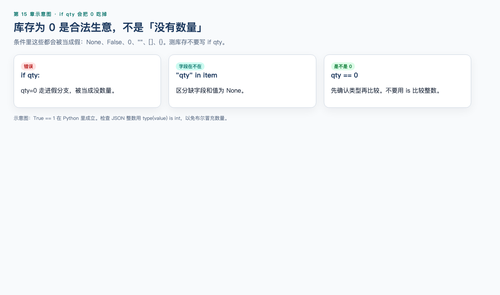
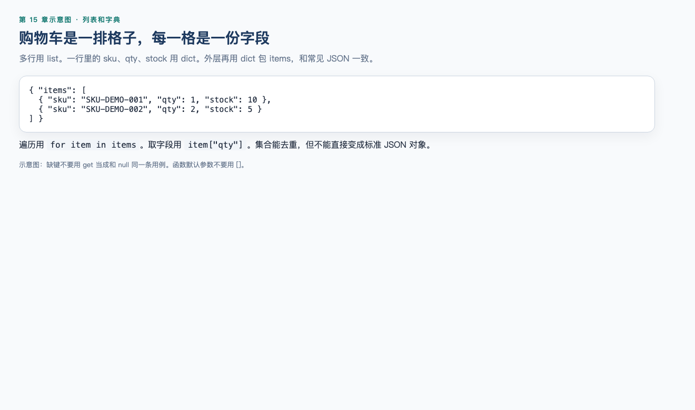

# 第 15 章（上）：Python 语法与数据

> **一句话核心：** 测试用 Python 是为了处理观察结果，不是为了成为开发。

> 重要级别：⭐⭐⭐ 必须掌握  
> 下一节：[15B 模块、文件与 JSON](15b-python-files-json.md)

## 这一章解决什么问题

接口响应一多，就要用脚本处理 token、列表和 qty。上半章只建立：变量、类型、字符串、列表/字典、条件循环、函数。不讲类、装饰器、继承、异步。

## 学习目标

- 运行一个 `.py` 文件；
- 分清 `int`/`str`/`bool`/`None` 以及 `==` 与 `is`；
- 处理字符串、列表、字典；
- 编写 `if`/`for` 和带 `return` 的函数，避开可变默认参数。

## 前置知识

已完成第 13、14 章，能阅读 JSON。

## 场景导入：三十条购物车，哪几条超库存？

教学规则：数量为正整数且不得超过库存。你要能判断 `qty=11, stock=10`，并区分缺字段、`null`、`""`。上半章不发 HTTP。15B 的实操 15-1 会用标准库读一次 `GET /api/products`，为第 16 章预习；本章仍不安装 requests / pytest。

## 15.1 测试工程师为什么学 Python ⭐⭐⭐

生活类比：Postman 像柜台点餐，一份一份看。Python 像把菜单打印成表格后用尺去对库存列。

正式一点：Python 是一种通用编程语言。测试工作里它最常用来：

- 解析和构造 JSON；
- 批量检查列表里的字段；
- 读测试数据文件；
- 作为 pytest、requests 等工具的宿主语言。

测试工程师需要它，是因为接口响应、配置和日志经常是结构化文本。不会处理 `dict` 和 `list`，自动化脚本就只能停留在“能发出去”。

实际使用时机：

- 把 Postman 里重复的取值判断写成函数；
- 读取一份 JSON 用例文件，逐条检查；
- 下一节（15B）把检查写成文件和 JSON；第 16 章再用 pytest 调这些函数。

它不能替代：需求评审、用例设计、手工探索、SQL 核对、缺陷报告。也不要说“会 Python 就比接口测试 ROI 永远高”——适不适合自动化仍取决于变更频率、稳定性和风险。

---

## 15.2 安装、解释器与脚本 ⭐⭐⭐

到 [python.org](https://www.python.org/) 安装当前稳定的 Python 3。安装向导会变，本章以终端能运行为准。

| 系统 | 常用命令 |
| --- | --- |
| macOS / Linux | `python3 --version` |
| Windows | `py -3 --version` |

应看到 `Python 3.12` 或更新。若命令不存在，先安装，不要用编辑器“能高亮”当成已安装。

审查机器输出：

```text
Python 3.14.3
```

交互环境（REPL）适合试一句表达式。输入 `python3` 后：

```text
>>> 1 + 1
2
>>> exit()
```

正式练习写成 `.py` 文件。把下面保存为 `hello_minishop.py`：

```python
print("hello, minishop")
```

在同一目录执行：

```bash
python3 hello_minishop.py
```

应打印 `hello, minishop`。

三条纪律：

1. **缩进是语法。** 空格数量错了会 `IndentationError`。本章统一 4 个空格，不要混用 Tab。
2. **注释以 `#` 开头**，解释“为什么”，不要叙述“我正在写代码”。
3. **确认你运行的就是 3.x。** `python` 在部分机器上可能指向别的程序。测试脚本一律写明用 `python3` 或 `py -3`。

`print` 会把结果打到终端。测试脚本可以先用它看中间值；本章稍后用语言自带的 `assert` 做脚本自检；第 16 章再用 pytest 出报告。`assert` 不是 pytest 专用语法。

---

## 15.3 变量与基本类型 ⭐⭐⭐

变量是贴在对象上的名字。最简单：

```python
stock = 10
sku = "SKU-DEMO-001"
```

`stock` 不是“永远是整数的盒子”，它是当前指向那个整数对象的名字。

测试里常用的内置类型：

| 类型 | 例子 | 测试含义 |
| --- | --- | --- |
| `int` | `11` | 数量、库存 |
| `float` | `11.0` | JSON 里写成 `11.0` 时，`json.loads` 会得到浮点数 |
| `str` | `"SKU-DEMO-001"` | 编号、手机号、token |
| `bool` | `True` / `False` | 条件结果；对应 JSON 的 `true` / `false` |
| `None` | `None` | 对应 JSON 的 `null` |

```python
phone = "13800138000"
qty = 11
stock = 10
allowed = qty <= stock
missing = None
print(type(phone).__name__, type(qty).__name__, allowed, missing)
```

运行后打印：

```text
str int False None
```

手机号要用字符串。写成整数 `13800138000` 会丢掉“必须是 11 位数字”这种测试信息，也不该拿来做算术。

### `==` 和 `is`

- `==` 比较**值是否相等**；
- `is` 比较**是不是同一个对象**。

`None` 用 `is` / `is not`。数字、字符串、列表用 `==`。

```python
qty = 11
print(qty == 11)
print(qty is None)
print(None is None)
```

运行后打印：

```text
True
False
True
```

不要写 `qty is 11`。Python 3.14 会对“用 `is` 比较 int 字面量”给出 `SyntaxWarning`，而且即使某些小整数看起来碰巧 `is` 为真，也不能当测试依据。

### 真值：`if qty` 会漏掉 0




在条件里，下面这些会被当成假：`None`、`False`、`0`、`0.0`、`""`、`[]`、`{}`。

库存为 0 的商品是合法业务数据，不是“没有数量”。

```python
qty = 0
if qty:
    print("有数量")
else:
    print("被当成没有数量")
```

运行后打印：

```text
被当成没有数量
```

要判断“有没有这个字段”，用 `"qty" in item`。要判断“是不是 0”，用 `qty == 0`。不要用 `if qty` 代替这两种检查。

`True == 1` 在 Python 里成立。检查 JSON 整数时不要只用 `isinstance(value, int)`，否则 `true` 也会被当成数量。本章用 `type(value) is int`。不必为此去学类和继承；把它当成“布尔值会冒充整数”的测试陷阱即可。

---

## 15.4 字符串 ⭐⭐⭐

字符串是文本。教学手机号、SKU、token 都是字符串。

```python
phone = "13800138000"
sku = "SKU-DEMO-001"
print(len(phone), phone[:3], phone[-4:], sku.startswith("SKU-"))
print("138" in phone)
print(f"sku={sku}, phone={phone}")
```

运行后打印：

```text
11 138 8000 True
True
sku=SKU-DEMO-001, phone=13800138000
```

| 操作 | 作用 |
| --- | --- |
| `len(s)` | 长度 |
| `s[:3]` / `s[-4:]` | 切片：前 3 位、后 4 位 |
| `s.strip()` | 去掉首尾空白 |
| `s.split(",")` | 按分隔符切开，得到列表 |
| `s.startswith(...)` | 前缀 |
| `f"...{变量}..."` | 格式化（f-string，3.6+） |

边界：

- `"11"` 不是 `11`。接口把数量写成字符串时，业务层可能拒收，测试必须当错误类型，而不是自己先 `int("11")` 再宣称合法。
- 拼接路径可以，但构造 JSON 不要靠一长串 `+`。用字典再 `json.dumps`。
- 比较 token 时不要在日志里打印完整值。

---

## 15.5 列表、元组、集合 ⭐⭐⭐

### 列表 `list`

列表是有序、可改的序列。JSON 数组进 Python 后就是 `list`。

最简单：

```python
skus = ["SKU-DEMO-001"]
```

正常：购物车多行。

```python
items = [
    {"sku": "SKU-DEMO-001", "qty": 1, "stock": 10},
    {"sku": "SKU-DEMO-002", "qty": 11, "stock": 5},
]
print(len(items), items[0]["sku"], items[-1]["qty"])
items.append({"sku": "SKU-DEMO-003", "qty": 1, "stock": 3})
print(len(items))
```

运行后打印：

```text
2 SKU-DEMO-001 11
3
```

下标从 0 开始。`items[0]` 是第一行，`items[-1]` 是最后一行。超出范围会 `IndexError`。

### 元组 `tuple`

元组有序但**创建后不能改元素**。函数返回一对值时常见。

```python
pair = ("SKU-DEMO-001", 10)
print(pair[0], pair[1])
try:
    pair[1] = 9
except TypeError:
    print("tuple_immutable")
```

运行后打印：

```text
SKU-DEMO-001 10
tuple_immutable
```

JSON **没有**元组：`json.dumps((1, 2))` 会变成数组 `[1, 2]`。不要指望往接口 Body 里发“Python 元组类型”。

### 集合 `set`

集合无序、元素唯一。适合回答“去重后有几个 SKU”。

```python
skus = ["SKU-DEMO-001", "SKU-DEMO-001", "SKU-DEMO-002"]
unique = set(skus)
print(len(skus), len(unique), "SKU-DEMO-001" in unique)
```

运行后打印：

```text
3 2 True
```

集合**不能**直接 `json.dumps`：

```python
import json

try:
    json.dumps({"SKU-DEMO-001"})
except TypeError:
    print("set_not_json")
```

运行后打印：

```text
set_not_json
```

要写进 JSON 就先 `list(unique)`。

---

## 15.6 字典 ⭐⭐⭐




字典是键到值的映射。JSON 对象进 Python 后就是 `dict`。这是接口测试里最重要的结构。

最简单：

```python
item = {"sku": "SKU-DEMO-001", "qty": 1}
```

取值：

```python
item = {"sku": "SKU-DEMO-001", "qty": 1}
print(item["sku"])
print(item.get("qty"))
print("stock" in item)
print(item.get("stock"))
print(item.get("stock", "MISSING"))
```

运行后打印：

```text
SKU-DEMO-001
1
False
None
MISSING
```

| 写法 | 键不存在时 |
| --- | --- |
| `item["stock"]` | `KeyError` |
| `"stock" in item` | `False` |
| `item.get("stock")` | `None`（和值为 `null` 分不清） |
| `item.get("stock", "MISSING")` | 得到你给的默认值 |

第 13 章要求分清缺字段和 `null`。对应到 Python：

```python
missing = {}
null_qty = {"qty": None}
zero = {"qty": 0}

print("qty" in missing, missing.get("qty"))
print("qty" in null_qty, null_qty.get("qty"))
print("qty" in zero, zero.get("qty"))
```

运行后打印：

```text
False None
True None
True 0
```

`get` 在“没有键”和“键的值是 `None`”时都得到 `None`。要区分，必须先 `"qty" in body`。

`in` 对字典检查的是**键**，不是值：

```python
body = {"token": "teach-token"}
print("token" in body)
print("teach-token" in body)
```

运行后打印：

```text
True
False
```

### 赋值是贴名字，不是复制一份

```python
payload = {"sku": "SKU-DEMO-001", "qty": 1}
alias = payload
copy = dict(payload)
alias["qty"] = 11
print(payload["qty"], copy["qty"])
```

运行后打印：

```text
11 1
```

`alias` 和 `payload` 是同一个对象，改一个等于改另一个。构造多条用例时用 `dict(payload)` 或 `payload.copy()` 做浅拷贝。嵌套字典的深拷贝本章不展开；内层结构被改到“串味”，先怀疑是不是共用了同一个对象。

---

## 15.7 条件与循环 ⭐⭐⭐

### 条件

```python
qty = 11
stock = 10
if qty > stock:
    print("exceeds_stock")
elif qty < 1:
    print("qty_not_positive")
else:
    print("ok")
```

运行后打印：

```text
exceeds_stock
```

比较用 `==` `!=` `<` `>` `<=` `>=`。组合用 `and` / `or` / `not`。

### 循环

遍历购物车是测试里最常见的循环。

```python
items = [
    {"sku": "SKU-DEMO-001", "qty": 1, "stock": 10},
    {"sku": "SKU-DEMO-002", "qty": 11, "stock": 5},
]
for item in items:
    if item["qty"] > item["stock"]:
        print(item["sku"])
```

运行后打印：

```text
SKU-DEMO-002
```

`for sku, stock in stocks.items()` 用于遍历“SKU → 库存”这类字典。`range(n)` 用于“重复 n 次”，测试数据更常直接遍历列表。

`while` 适合“还不知道要做几次”，例如重试。必须有退出条件，避免死循环打接口。本章练习以 `for` 为主。

### 列表推导 ⭐⭐

从列表抽出一列 SKU：

```python
items = [
    {"sku": "SKU-DEMO-001", "qty": 1},
    {"sku": "SKU-DEMO-002", "qty": 11},
]
skus = [item["sku"] for item in items]
print(skus)
```

运行后打印：

```text
['SKU-DEMO-001', 'SKU-DEMO-002']
```

先写懂 `for` 再写推导。嵌套推导本章不要求。

---

## 15.8 函数 ⭐⭐⭐

函数把“一段可重复的检查”变成有名字的步骤。最简单：

```python
def add(a, b):
    return a + b


print(add(1, 2))
```

运行后打印：

```text
3
```

正常例子：数量是否允许。

```python
def qty_allowed(qty, stock):
    if type(qty) is not int or type(stock) is not int:
        return False
    if qty < 1:
        return False
    return qty <= stock


print(qty_allowed(1, 10))
print(qty_allowed(10, 10))
print(qty_allowed(11, 10))
print(qty_allowed("11", 10))
```

运行后打印：

```text
True
True
False
False
```

边界：默认参数不要用可变对象。

```python
def add_item(item, bucket=[]):
    bucket.append(item)
    return bucket


print(add_item("a"))
print(add_item("b"))
```

运行后打印：

```text
['a']
['a', 'b']
```

第二次调用仍在用**同一个**默认列表。正确写法：

```python
def add_item(item, bucket=None):
    if bucket is None:
        bucket = []
    bucket.append(item)
    return bucket


print(add_item("a"))
print(add_item("b"))
```

运行后打印：

```text
['a']
['b']
```

函数要 `return` 对调用者有用的值。只 `print` 不返回，下一章 pytest 很难断言。密码、完整 token 不要当返回值打印到会提交的文件里。

Python 的 `assert` 在条件为假时抛出 `AssertionError`：

```python
def qty_allowed(qty, stock):
    if type(qty) is not int or type(stock) is not int:
        return False
    if qty < 1:
        return False
    return qty <= stock


assert qty_allowed(1, 10)
assert not qty_allowed(11, 10)
```

无输出表示这两条通过。它适合脚本自检；批量测试报告、夹具和参数化是第 16 章 pytest 的工作。不要用 `python -O` 跑这些练习（`-O` 会去掉 `assert`）。

文件、JSON 和 MiniShop 数据检查脚本见 [15B](15b-python-files-json.md)。

## 常见错误

### 错误 1：用 `if qty:` 判断数量是否为 0

修正：`0` 在布尔上下文里是假。业务允许库存为 0 时，应写 `qty == 0` 或先检查类型。

### 错误 2：函数默认参数写成 `bucket=[]`

修正：可变默认值会在多次调用间共享。改成 `None`，在函数内新建列表。

### 错误 3：把缺字段和 `qty is None` 当成同一条

修正：键不在、键在值为 `null`、空字符串、错误类型要分开标。第 13 章四态在这里继续用。

### 错误 4：本章目标是成为 Python 开发工程师

修正：只为处理观察结果。不讲 class、装饰器、异步；HTTP 和 pytest 放到后面的章。

### 错误 5：`True` 拿来当库存数量

修正：在 Python 里 `True` 是 `int` 的子类，`True == 1` 为真。这是测试陷阱，不是要你去学继承。

## 面试角度 ⭐⭐⭐

### 测试为什么要学 Python？

结论：为了处理接口 JSON、文件和可重复判定，不是为了交付业务系统。  
示例：读商品列表，找出鼠标库存是不是 10。  
边界：不会写 class 也能做第 15、16 章的练习。

### `if qty:` 有什么风险？

结论：`0`、空串、空列表都会走假分支，业务含义被吞掉。  
示例：库存允许为 0 时，这条判断会把“有货且为 0”当成“没有数量”。  
边界：先看类型，再比较值。

### 缺字段和 `null` 为什么要分开测？

结论：键不存在和键在值为空，对接口来说不是同一类输入。  
示例：`{}` 的 `get("qty")` 是 `None`；`{"qty": null}` 也是 `None`，但键在。分类标签仍然要分开。  
边界：实现若把二者返回同一错误，记录实际行为，不要假装没测。

## 小练习

### 练习 1

为什么本章强调“不成为 Python 开发工程师”，却仍把变量、字典和 JSON 列为必须掌握？

### 练习 3

`qty = 0` 时，`if qty:` 会走哪一分支？若业务允许库存为 0，测试应怎样写判断？

### 练习 4

对 `{}`、`{"qty": null}`、`{"qty": ""}`、`{"qty": 11}` 分别写出：键是否存在、`get("qty")` 的结果、你的分类标签。

### 练习 5

购物车应更像 `list` 还是只有一个 `dict`？为什么还需要外层 `{"items": [...]}` 这种字典？

### 练习 6

哪一句适合检查“还没有 token”？

A. `if token is 0:`  
B. `if token is None:`  
C. `if token == False:`  
D. `if token is "teach-token":`

### 练习 8

下面函数连续调用两次，第二次打印什么？应如何改默认参数？

```python
def add_item(item, bucket=[]):
    bucket.append(item)
    return bucket
```


## 练习答案

1. 因为初级自动化要能处理接口数据，而不是交付业务系统。字典、列表、JSON 是把第 13 章的检查点写成可重复步骤的最小工具箱。

3. 走假分支，被当成“没有数量”。应使用 `qty == 0` 或先检查类型再比较，不能靠真值测试。

4. `{}`：键不在，`get` 为 `None`，缺字段。`{"qty": null}`：键在，`get` 为 `None`，`null`。`{"qty": ""}`：键在，值为 `""`，错误类型或空字符串。`{"qty": 11}`：键在，值为 `11`，再和库存比。

5. 多行购物车是列表；每行是字典。外层字典用来放 `items` 等字段，和常见 JSON 对象包裹数组的形状一致。

6. B。

8. 第二次会得到含两个元素的同一个列表（先 `"a"` 再 `"b"` 则为 `['a', 'b']`）。默认值改为 `None`，在函数内新建列表。


## 本章检查清单

- [ ] 我能分清类型和真值
- [ ] 我不会用 `if qty:` 判断库存是否为 0
- [ ] 我会用列表遍历、字典取字段
- [ ] 我会写函数并避开可变默认参数

## 本章总结

Python 是为了处理观察结果。先分清类型和真值，再谈文件和 JSON。脚本和 venv 放到 15B。

## 本章可运行性说明

语法示例曾在 Python 3.14.3 执行。本章不安装 pytest / requests，不发 HTTP。发 HTTP 的预习在 15B 实操 15-1。

## 参考资料

- [15B](15b-python-files-json.md)
- [Python 3 教程](https://docs.python.org/3/tutorial/)

## 下一章预告

[第 15 章（下）：模块、文件与 JSON](15b-python-files-json.md)
