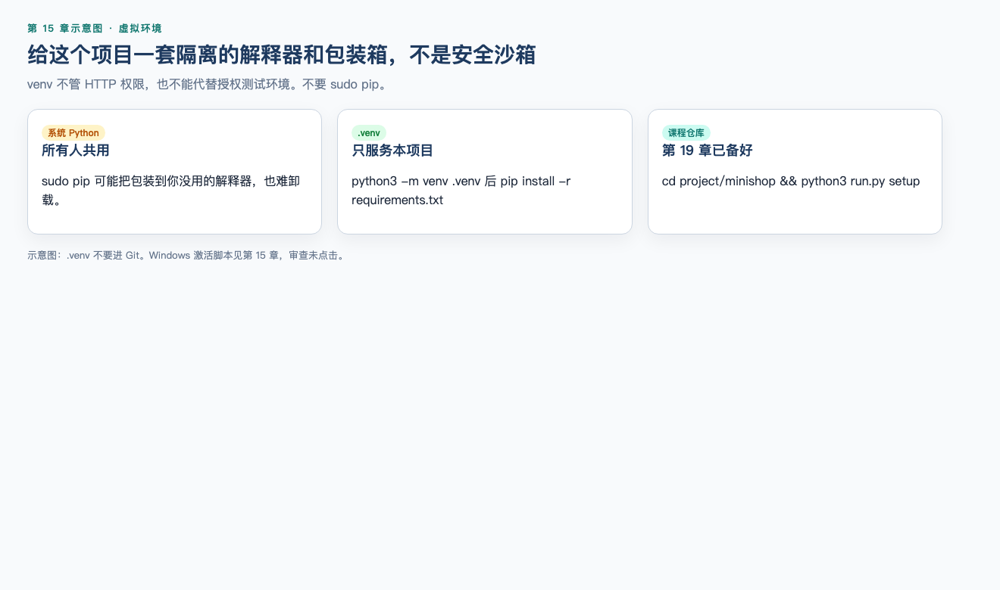
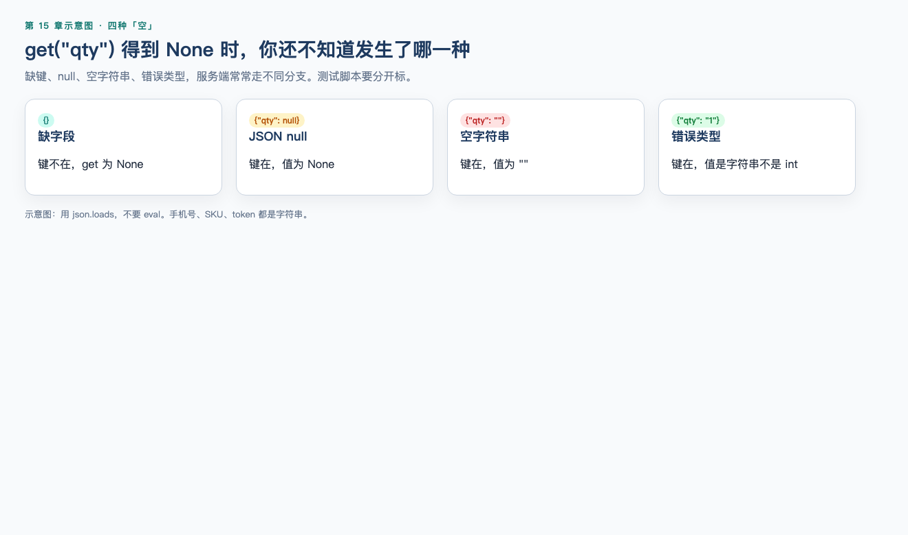

# 第 15 章（下）：模块、文件与 JSON

> **一句话核心：** 文件和 JSON 是接口响应最常见的形态。

> 上一节：[15A 语法与数据](15a-python-syntax.md)

## 这一章解决什么问题

把上半章的数据检查写成可重复脚本：venv、文件、异常、`json.loads`。仍然不安装 pytest（第 16 章）。

## 学习目标

- 用 venv + `python3 -m pip` 理解第三方库从哪来；
- UTF-8 读写文本；
- 捕获 `KeyError` 与 `JSONDecodeError`；
- 用 `json` 模块而不是 `eval`；
- 完成 MiniShop 教学数据检查脚本。

## 前置知识

已完成 15A。

## 15.9 模块、import、venv 与 pip ⭐⭐⭐




**模块**是一份可被复用的 Python 代码。**导入**用 `import`。

```python
import json

body = json.loads('{"token":"teach-token"}')
print(body["token"])
```

运行后打印：

```text
teach-token
```

`from json import loads` 也可以，但看到 `loads(...)` 时不容易想起它来自哪。本章正文用 `import json`。

两类来源：

| 来源 | 例子 | 本章 |
| --- | --- | --- |
| 标准库 | `json`、`pathlib` | 直接 `import` |
| 第三方 | `requests`、`pytest` | 先安装到虚拟环境；第 16 章再用 |

**pip** 是安装第三方包的工具。官方推荐用解释器模块方式调用：`python3 -m pip`，避免系统里另一个 `pip` 装到错误的 Python。

**虚拟环境（venv）** 是项目自己的一套 Python 和 site-packages，避免把包装进系统解释器。Debian/Ubuntu 等发行版会把系统 Python 标成“由发行版管理”（PEP 668）：直接 `pip install` 常被拒绝。正确反应是建 venv，而不是随手加 `--break-system-packages`，更不要 `sudo pip install`。

在**你自己的练习目录**（不要拿课程仓库当安装实验场）：

```bash
python3 -m venv .venv
```

激活：

```bash
source .venv/bin/activate
```

Windows cmd 使用 `.venv\Scripts\activate`；PowerShell 使用 `.venv\Scripts\Activate.ps1`。

激活后，`python3 -m pip install -U pip` 只升级这个环境里的 pip。本章**不要**安装 `requests` / `pytest`；下一章再装。查看：

```bash
python3 -m pip list
```

应能看到 `pip`。`deactivate` 退出虚拟环境。

`.venv` 不要提交进 Git。团队若使用 uv、Poetry 等工具，隔离原理相同；本章以官方 `venv` + `pip` 为准，不把第三方打包工具当必修。

`if __name__ == "__main__":` 表示“直接运行本文件时才执行”，被 `import` 时不跑。完整练习脚本会用到它。

---

## 15.10 文件 ⭐⭐⭐

测试数据常放在 JSON 文件里。用 `with` 打开，并**显式写 UTF-8**，避免 Windows 默认编码把中文读乱。

先准备 `cart_cases.json`（内容见 15.12 实战）。读取：

```python
import json

with open("cart_cases.json", encoding="utf-8") as f:
    cases = json.load(f)
print(type(cases).__name__, len(cases), cases[0]["name"])
```

在包含该文件的目录运行后打印：

```text
list 8 合法数量
```

| 函数 | 对象 | 文件 |
| --- | --- | --- |
| `json.loads` / `json.dumps` | 字符串 | 不直接碰磁盘 |
| `json.load` / `json.dump` | — | 读写文件对象 |

写入练习结果：

```python
import json

result = {"over": ["SKU-DEMO-002"]}
with open("lab_result.json", "w", encoding="utf-8") as f:
    json.dump(result, f, ensure_ascii=False, indent=2)
```

无终端输出，会在当前目录生成 `lab_result.json`。

纪律：

- 只写自己的练习目录。不要覆盖别人的数据，不要写生产路径；
- `"w"` 会截断已有文件。不确定就换新文件名；
- 文本模式加 `encoding="utf-8"`。不要用默认编码碰含中文的用例文件；
- `with` 结束会关闭文件，不要依赖自己记得 `close()`。

`pathlib.Path` 也可以处理路径，属于常用进阶，本章练习用 `open` 即可。

---

## 15.11 异常 ⭐⭐⭐

程序遇到错误会**抛出异常**。不处理就会中断。测试脚本要区分：

- 输入本来就该失败（非法 JSON）——抓住并记成检查结果；
- 脚本自己写错了——不要用光秃秃的 `except:` 吞掉。

最简单：

```python
try:
    int("x")
except ValueError:
    print("not an int")
```

运行后打印：

```text
not an int
```

正常：解析接口 Body。

```python
import json

def parse_object(text):
    try:
        data = json.loads(text)
    except json.JSONDecodeError:
        return None
    if type(data) is not dict:
        return None
    return data


print(parse_object('{"qty":1}')["qty"])
print(parse_object("{qty:1}"))
```

运行后打印：

```text
1
None
```

边界：缺键是 `KeyError`，不是 `JSONDecodeError`。

```python
item = {"sku": "SKU-DEMO-001"}
try:
    print(item["qty"])
except KeyError:
    print("missing qty")
```

运行后打印：

```text
missing qty
```

业务上更稳的写法仍是 `"qty" in item`，而不是靠异常当控制流。异常留给“解析失败、文件不存在”这类意外。

`json.JSONDecodeError` 是 `ValueError` 的子类。文件不存在是 `FileNotFoundError`。捕获时尽量写具体类型。不要 `except Exception` 之后什么都不做；至少打印或返回明确失败原因。

解析失败本身可能是缺陷：响应声明 `application/json` 却不是 JSON。不要在脚本里“尽量修一修再当成功”。

---

## 15.12 JSON 与 Python 对照


 ⭐⭐⭐

第 13 章按 RFC 8259 讲 JSON。Python 标准库 `json` 负责文本和对象的转换。官方文档可能仍引用较早的 RFC 编号；测试关心的对象、数组、`true` / `false` / `null` 规则与 RFC 8259 一致。

默认转换：

| JSON | Python |
| --- | --- |
| object | `dict` |
| array | `list` |
| string | `str` |
| 整数 | `int` |
| 带小数或指数的数字 | `float` |
| `true` / `false` | `True` / `False` |
| `null` | `None` |

反向：`dict` → object，`list`/`tuple` → array，`str` → string，`int`/`float` → number，`True`/`False`/`None` → `true`/`false`/`null`。`set` 不能默认编码。

```python
import json

text = '{"result":"ok","token":"teach-token","qty":null}'
body = json.loads(text)
print(type(body).__name__)
print(body["result"], body["token"], body["qty"])
print(json.dumps({"qty": None, "ok": True}))
print(json.dumps((1, 2)))
```

运行后打印：

```text
dict
ok teach-token None
{"qty": null, "ok": true}
[1, 2]
```

JSON **不是** Python 字面量：

| 非法当 JSON 的写法 | 原因 |
| --- | --- |
| `{'qty': 1}` | 单引号 |
| `{"qty": True}` | `True` 不是 `true` |
| `{"qty": None}` | `None` 不是 `null` |
| `{"qty": 1,}` | 标准 JSON 不允许末尾逗号 |

```python
import json

samples = [
    "{'qty': 1}",
    """{"qty": True}""",
    """{"qty": 1,}""",
]
for text in samples:
    try:
        json.loads(text)
        print("parsed")
    except json.JSONDecodeError:
        print("invalid")
```

运行后打印：

```text
invalid
invalid
invalid
```

不要用 `eval` 解析接口响应。`eval` 会执行文本里的 Python 代码，既不安全，也不能按 JSON 规则工作。

数字类型陷阱：

```python
import json

print(type(json.loads('{"qty":11}')["qty"]).__name__)
print(type(json.loads('{"qty":11.0}')["qty"]).__name__)
```

运行后打印：

```text
int
float
```

`11` 和 `11.0` 在 JSON 里都是 number，到 Python 后类型不同。测试“必须是整数数量”时要看类型，不能只看 `== 11`（`11.0 == 11` 为真）。

`json.dumps` 默认 `ensure_ascii=True`，非 ASCII 会写成 `\uXXXX`。写给自己看的中文结果文件可用 `ensure_ascii=False`。

---


配套可运行实操：[实操 15-1 读商品 JSON](../practice/15-json-check/README.md)（`python3 practice/run.py 15-1`）。工作实战仍要你自己写 `cart_cases.json` 和检查脚本。

## MiniShop 工作实战：教学数据检查脚本 ⭐⭐⭐

在自己的练习目录做，不要把密码写进文件。保存说明：

```text
exercises/chapter-15-minishop-python.md
```

以及两个可运行文件：`cart_cases.json`、`check_minishop_data.py`。

### 用例文件 `cart_cases.json`

```json
[
  {"name": "合法数量", "sku": "SKU-DEMO-001", "qty": 1, "stock": 10, "expect": "ok"},
  {"name": "等于库存", "sku": "SKU-DEMO-001", "qty": 10, "stock": 10, "expect": "ok"},
  {"name": "超过库存", "sku": "SKU-DEMO-001", "qty": 11, "stock": 10, "expect": "exceeds_stock"},
  {"name": "缺字段", "sku": "SKU-DEMO-001", "stock": 10, "expect": "missing_qty"},
  {"name": "null", "sku": "SKU-DEMO-001", "qty": null, "stock": 10, "expect": "null_qty"},
  {"name": "空字符串", "sku": "SKU-DEMO-001", "qty": "", "stock": 10, "expect": "wrong_type_qty"},
  {"name": "错误类型", "sku": "SKU-DEMO-001", "qty": "11", "stock": 10, "expect": "wrong_type_qty"},
  {"name": "数量为 0", "sku": "SKU-DEMO-001", "qty": 0, "stock": 10, "expect": "qty_not_positive"}
]
```

`expect` 是本章脚本自己的标签，不是 MiniShop 正式错误码，也不是订单状态。

### 脚本 `check_minishop_data.py`

```python
import json

LOGIN_OK = '{"result":"ok","token":"teach-token"}'
LOGIN_BAD = '{"result":"error"}'
CART_LIST = """
{
  "items": [
    {"sku": "SKU-DEMO-001", "qty": 1, "stock": 10},
    {"sku": "SKU-DEMO-002", "qty": 11, "stock": 5}
  ]
}
"""


def extract_token(body):
    if type(body) is not dict:
        return None
    if "token" not in body:
        return None
    token = body["token"]
    if type(token) is not str or token == "":
        return None
    return token


def qty_status(item):
    if type(item) is not dict:
        return "not_an_object"
    if "qty" not in item:
        return "missing_qty"
    qty = item["qty"]
    if qty is None:
        return "null_qty"
    if type(qty) is not int:
        return "wrong_type_qty"
    if "stock" not in item:
        return "missing_stock"
    stock = item["stock"]
    if type(stock) is not int:
        return "wrong_type_stock"
    if qty < 1:
        return "qty_not_positive"
    if qty > stock:
        return "exceeds_stock"
    return "ok"


def parse_object(text):
    try:
        data = json.loads(text)
    except json.JSONDecodeError:
        return None
    if type(data) is not dict:
        return None
    return data


def load_cases(path):
    with open(path, encoding="utf-8") as f:
        data = json.load(f)
    if type(data) is not list:
        raise ValueError("cases file must be a JSON array")
    return data


def main():
    login = parse_object(LOGIN_OK)
    token = extract_token(login)
    assert token == "teach-token"
    assert extract_token(parse_object(LOGIN_BAD)) is None

    cart = parse_object(CART_LIST)
    over = []
    for item in cart["items"]:
        if qty_status(item) == "exceeds_stock":
            over.append(item["sku"])
    assert over == ["SKU-DEMO-002"]

    failed = []
    for case in load_cases("cart_cases.json"):
        actual = qty_status(case)
        if actual != case["expect"]:
            failed.append((case["name"], actual, case["expect"]))
    if failed:
        raise AssertionError(failed)

    order = {"id": "ord-demo-01"}
    assert "id" in order
    assert "status" not in order

    print("token_ok")
    print("over", ",".join(over))
    print("cases_ok", len(load_cases("cart_cases.json")))


if __name__ == "__main__":
    main()
```

同一目录执行：

```bash
python3 check_minishop_data.py
```

审查结果：

```text
token_ok
over SKU-DEMO-002
cases_ok 8
```

完成标准：

1. 能取出教学 `token`，失败登录返回 `None`；
2. 列表里找出超库存的 SKU；
3. 八条用例的 `expect` 全部命中；
4. 订单只检查有 `id`、没有 `status` 字段，不编造状态名；
5. 说明文件里写明：这是个人练习脚本，不是 MiniShop 正式自动化框架，也不是已冻结契约。

记录模板：

```markdown
# MiniShop Python 数据检查记录

## 环境
- Python 版本：
- 是否虚拟环境：
- 日期：

## 运行
- 命令：
- 输出：

## 结论
- token 检查：
- 超库存 SKU：
- 用例文件条数与是否全部命中：

## 声明
- 非正式 OpenAPI；无订单状态臆造；无密码入库。
```

---


第 19 章仓库已提供 `project/minishop/requirements.txt` 与 `python3 run.py setup`。本章仍要求你先在**自己的练习目录**建 venv，不要拿课程仓库当乱装包的实验场。

## 小练习

### 练习 2

`python3 -m pip install` 和直接 `sudo pip install` 对测试环境有什么差别？

### 练习 7

`eval('{"qty": 1}')` 和 `json.loads('{"qty": 1}')` 哪一个是测试脚本该用的？为什么另一个不行？

### 练习 9

哪一句正确？

A. Cookie、Session、Token 是三种互相替代的 Python 库  
B. `True` 不是 `int` 的子类，所以 `isinstance(True, int)` 为假  
C. 缺字段和 `null` 都该用 `get` 当成 `None` 即可，不必分开测  
D. JSON 的 `null` 对应 Python 的 `None`，标准 JSON 用双引号而不是单引号

### 练习 10

根据教学数据，写出 `extract_token` 对成功登录和缺少 `token` 的返回值，以及 `qty_status` 对 `qty=11, stock=10` 的返回值。不要写订单状态名。


## 练习答案

2. `python3 -m pip` 对着当前解释器装包；再配合 venv 只影响本项目。`sudo pip` 改系统环境，可能破坏发行版 Python，也常把包装到你根本没在用的解释器。

7. 用 `json.loads`。`eval` 执行代码，且不按 JSON 语法约束。

9. D。A 把认证层次说成库选型；B 与事实相反；C 违反第 13 章四态。

10. 成功返回 `"teach-token"`；缺字段返回 `None`；`qty=11, stock=10` 返回 `exceeds_stock`。合理等价函数名即可。

---


## 本章检查清单

- [ ] 我知道用 venv，而不是 `sudo pip`
- [ ] 我会用 `json.loads` 而不是 `eval`
- [ ] 我能完成数据检查脚本，且不编造订单状态

## 本章可运行性说明

`json.loads`/`dumps` 示例曾在 Python 3.14.3 执行。venv 未写入课程仓库。

## 参考资料

- [15A](15a-python-syntax.md)
- [json 文档](https://docs.python.org/3/library/json.html)

## 下一章预告

[第 16 章（上）：pytest 基础](16a-pytest-basics.md)
