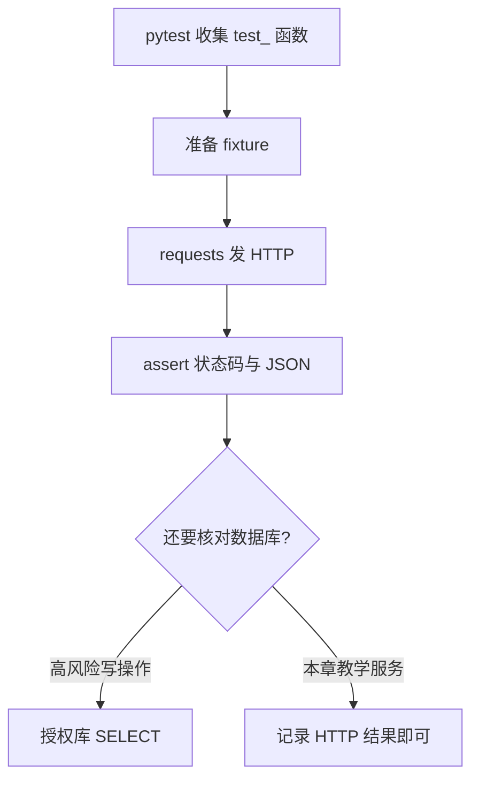

# 第 16 章：pytest 自动化

> 重要级别：⭐⭐⭐ 必须掌握  
> 核心章节发布目标：≥95/100  
> 主案例：MiniShop 个人软件测试实践项目

## 这一章解决什么问题

第 14 章能用 Postman Collection Runner 按顺序发请求。第 15 章能用 Python 解析 JSON、判断 `qty` 与 `stock`。还缺一层：**把检查写成可收集、可重复、能进 Git 的测试，并用同一套语言去发 HTTP。**

pytest 用来组织测试函数、准备数据（fixture）、展开多组输入（parametrize）。requests 用来发 GET/POST。二者合在一起，才是初级岗位最常见的接口自动化形态。

它不能替代需求评审、手工探索和 SQL 核对，更不能把教学路径说成 MiniShop 正式 OpenAPI。接口自动化的投入产出比**不是永远最高**：值不值得写，取决于变更频率、稳定性和风险。

审查环境：Python 3.14.3、pytest 9.1.1、requests 2.34.2。学习者在 venv 中安装当前稳定版即可；本章 API 与 pytest 8/9 常见写法兼容。不要把包装进系统 Python。

## 学习目标

完成本章后，你应该能够：

- 说明哪些检查适合自动化，以及 ROI 的适用条件；
- 在虚拟环境中安装 pytest 与 requests，并运行 `python3 -m pytest`；
- 编写以 `test_` 开头的测试函数，使用 `assert`；
- 用 requests 发 GET/POST，设置 `timeout`，读取状态码和 JSON；
- 使用 fixture 准备 `base_url` 和登录 `token`，并说明 scope；
- 把公共 fixture 放到 `conftest.py`；
- 使用 `@pytest.mark.parametrize` 做数据驱动；
- 按目录和 `pytest.ini` 组织一套 MiniShop 教学接口测试；
- 区分“测试绿了”和“数据库也对”。

## 前置知识

- 已完成第 15 章：能写函数、读字典、用 `json`、会建 venv；
- 已完成第 13、14 章：理解登录、购物车数量、创建订单的教学约定；
- 知道 Cookie、Session、Token 不是三种互相替代的登录产品；
- 不要求会写 class、自定义装饰器、异步或测试框架插件。

## 场景导入：Runner 全绿，改一条数据却要手点

教学规则仍是：数量必须是正整数，且不得超过提交时可售库存。`SKU-DEMO-001` 教学库存为 10。

Postman 里你已经能跑：登录 → 改数量 → 下单。现在产品经理把“等于库存是否允许”从口头规则改成要写进回归。你需要：

1. 把 `qty=1` / `qty=11` / 缺字段 / `null` / `""` / `"1"` 变成一组可重复执行的检查；
2. 登录成功后自动带 Token，而不是手抄；
3. 失败时看到是哪一条输入、期望状态码是多少；
4. 把脚本交给同事，用同一条命令跑。



只对教学服务或授权测试环境发请求。密码用环境变量，不要写进 Git。

---

## 16.1 什么该自动化，ROI 不是口号 ⭐⭐⭐

生活类比：每天都要核对的进货单，值得做成表格公式；只出现一次的异常客诉，更适合当面问清楚。

**自动化**把已经明确的检查交给脚本重复执行。pytest 是执行器，不是测试策略本身。

适合先自动化的（接口场景）：

- 稳定、有契约的登录、加购、下单；
- 同一接口很多输入组合（缺字段、`null`、边界）；
- 每次构建都要跑的回归；
- 手工容易漏的权限和重复提交。

不适合当作第一步的：

- 需求每周大改、页面结构不稳的 UI 细节（第 17 章再谈）；
- 还没有说清预期的探索性测试；
- 一次性的线上核对。

ROI 要问三件事：写脚本的成本、以后跑一次节省的时间、漏测的损失。接口往往比 UI 便宜，但**不是永远比手工或 UI 自动化更划算**。没有契约、环境天天挂、数据无法准备时，脚本会变成新的维护负担。

pytest 绿了，只证明你写过的断言成立。库存有没有真改，仍按第 12、13 章在授权库 `SELECT`。

Postman 和 pytest 互补：前者适合快速试报文和分享集合；后者适合进 Git、进 CI、和 Python 数据处理放在一起。不要说其中一种淘汰另一种。

---

## 16.2 安装 pytest 与 requests ⭐⭐⭐

在**自己的练习目录**建虚拟环境，不要拿课程仓库当安装实验场。

```bash
python3 -m venv .venv
source .venv/bin/activate
python3 -m pip install pytest requests
python3 -m pytest --version
```

Windows 激活方式见第 15 章。应能看到 pytest 版本号。审查机器为：

```text
pytest 9.1.1
```

`python3 -m pytest` 比直接打 `pytest` 更不容易跑到系统里另一个解释器。

第三方库：

| 库 | 作用 |
| --- | --- |
| pytest | 收集测试、运行 `assert`、报告失败 |
| requests | 发 HTTP，读取响应 |

不要 `sudo pip`，不要把真实密码写进即将提交的文件。`.venv` 不要进 Git。

---

## 16.3 测试函数与 assert ⭐⭐⭐

pytest 默认收集：

- 文件名 `test_*.py` 或 `*_test.py`；
- 函数名 `test_*`。

最简单（不发 HTTP，可先跑通）：

```python
def qty_allowed(qty, stock):
    if type(qty) is not int or type(stock) is not int:
        return False
    if qty < 1:
        return False
    return qty <= stock


def test_qty_one_allowed():
    assert qty_allowed(1, 10) is True
```

保存为 `tests/test_qty_allowed.py` 后：

```bash
python3 -m pytest tests/test_qty_allowed.py -q
```

通过时大致看到 `.` 和 `passed`。

正常例子：同一文件里再写超库存（须与上面的 `qty_allowed` 放在同一文件）。

```python
def qty_allowed(qty, stock):
    if type(qty) is not int or type(stock) is not int:
        return False
    if qty < 1:
        return False
    return qty <= stock


def test_qty_over_stock():
    assert qty_allowed(11, 10) is False
```

失败时，pytest 会改写 `assert`，把两边的值印出来。例如：

```python
def test_fail_demo():
    qty = 11
    stock = 10
    assert qty <= stock
```

审查中失败信息包含：

```text
assert 11 <= 10
```

这就是 pytest 相对“自己 print 再肉眼看”的价值。不要写 `assert True`，也不要用 `print` 代替断言。

`@` 是装饰器：写在函数上一行，把函数交给别人处理。本章只要求会用 pytest 提供的两个：`@pytest.fixture` 和 `@pytest.mark.parametrize`。不要自己实现装饰器，也不要展开 class 测试。

---

## 16.4 requests 发 HTTP ⭐⭐⭐

requests 把第 9、13 章的 HTTP 变成函数调用。下面是**片段**：把 `PORT` 换成教学服务端口后再运行。

```python
import requests

response = requests.get(
    "http://127.0.0.1:PORT/products",
    params={"keyword": "mouse"},
    timeout=5,
)
print(response.status_code)
```

常用属性：

| 写法 | 含义 |
| --- | --- |
| `response.status_code` | 状态码 |
| `response.json()` | 解析 JSON，失败会异常 |
| `response.headers` | 响应头 |
| `requests.post(..., json={...})` | JSON Body，并带 `Content-Type: application/json` |
| `timeout=5` | 超时秒数；不写可能一直挂起 |

纪律：

- **每次请求都写 `timeout`。**
- 期望 400/401 时，不要先 `raise_for_status()`：它会把 4xx/5xx 直接变成异常，断言还没执行。
- `json=` 发 JSON；`data=` 配字典则是表单。测 JSON 接口用 `json=`。
- 不要在断言失败信息里打印完整 token 或密码。

教学服务行为与第 13、14 章一致，但是**教学约定**：

| 请求 | 教学结果 |
| --- | --- |
| `POST /login` 正确 | `200`，`result=ok`，`token`，以及 `Set-Cookie` |
| `POST /login` 错误密码 | `401` |
| `GET /products` | `200`，`items` 为数组 |
| `POST /cart/items` `qty=1` | `200` |
| `POST /cart/items` `qty=11` | `400` |
| `POST /orders` 无 Bearer | `401` |
| `POST /orders` 带 `teach-token` | `201`，有 `id`，无 `status` 字段 |
| 连续两次成功下单 | 两个不同 `id` |

教学购物车和教学下单**都只把 `qty=1` 当成功**。业务规则里 `qty=10`（等于库存）应允许，但教学服务未实现该分支。自动化必须按**当前被测系统**写期望，不要拿未实现的规则硬编成 200。第 19 章 MiniShop v1.0 才按 PRD 让 `qty=10` 通过。

登录密码：教学服务把占位符 `<redacted>` 当作密码，以便和已发布的 curl 一致。正式环境用环境变量 `TEACH_PASSWORD`，不要把真实密码提交进仓库。

---

## 16.5 登录 API 测试 ⭐⭐⭐

下面函数依赖 16.6 的 fixture，完整可运行文件见本章实战。

```python
import requests

TIMEOUT = 5


def test_login_ok(base_url, phone, password):
    response = requests.post(
        f"{base_url}/login",
        json={"phone": phone, "password": password},
        timeout=TIMEOUT,
    )
    assert response.status_code == 200
    body = response.json()
    assert body["result"] == "ok"
    assert type(body["token"]) is str and body["token"] != ""
    assert "Set-Cookie" in response.headers


def test_login_wrong_password(base_url, phone):
    response = requests.post(
        f"{base_url}/login",
        json={"phone": phone, "password": "wrong-password"},
        timeout=TIMEOUT,
    )
    assert response.status_code == 401
```

`base_url` / `phone` / `password` 来自下一节的 fixture。成功响应里同时有 JSON `token` 和 `Set-Cookie`：二者可以同时存在，后续订单教学接口以 `Authorization: Bearer` 为准。

不要在 query 里传密码。不要把这次拿到的 token 粘到别的测试文件里当常量——下一节用 fixture。

---

## 16.6 fixture 与 scope ⭐⭐⭐

**fixture** 是测试运行前（或后）准备好的东西：地址、账号、token。测试函数写同名参数，pytest 会注入。下面是**片段**，完整 `conftest.py` 见实战。

```python
import os

import pytest
import requests

TIMEOUT = 5


@pytest.fixture
def base_url():
    url = os.environ.get("TEACH_BASE_URL")
    assert url, "TEACH_BASE_URL is required"
    return url.rstrip("/")
```

`test_login_ok(base_url, phone, password)` 并不需要你手动调用 `base_url()`。

| scope | 何时创建一次 | 适用 |
| --- | --- | --- |
| `function` | 每个测试（默认） | 入门默认；隔离最好 |
| `class` | 一个测试类 | 本章不用 class |
| `module` | 该文件 | 文件内共享只读配置 |
| `package` | 包 | ⭐ 了解 |
| `session` | 整次 pytest | 登录贵、启动服务 |

token 用默认 `function` 最稳：每个需要它的测试自己登录一次。登录很慢时再改为 `scope="session"`。不要把 token fixture 设成 `autouse=True`，否则“无凭证”用例也会先登录，401 测不准。

需要收尾时用 `yield`：`yield` 之前是准备，之后是清理。教学服务没有登出接口，token fixture 直接 `return` 即可。

fixture 里的 `assert` 失败算 **setup 错误**，测试函数体还没执行。先看是环境（没设 `TEACH_BASE_URL`、服务没启动）还是业务断言失败。

---

## 16.7 conftest.py ⭐⭐⭐

`conftest.py` 专门放本目录及子目录都能用的 fixture。它**不会**被当成测试模块收集。

项目根目录放一份即可。测试函数仍写在 `tests/test_*.py`。不要在 `conftest.py` 里写 `test_` 函数。

同一 fixture 名在测试文件里再定义，会覆盖更外层的定义。入门阶段保持一层 `conftest.py`，避免同名打架。

---

## 16.8 Token fixture ⭐⭐⭐

下面两段是**片段**，须放进 `conftest.py` / `tests/test_orders.py`，不能单独当脚本执行。

```python
import pytest
import requests

TIMEOUT = 5


@pytest.fixture
def token(base_url, phone, password):
    response = requests.post(
        f"{base_url}/login",
        json={"phone": phone, "password": password},
        timeout=TIMEOUT,
    )
    assert response.status_code == 200
    value = response.json().get("token")
    assert type(value) is str and value != ""
    return value
```

需要认证的测试声明 `token` 参数：

```python
def test_create_order_returns_id(base_url, token):
    response = requests.post(
        f"{base_url}/orders",
        json={"sku": "SKU-DEMO-001", "qty": 1},
        headers={"Authorization": f"Bearer {token}"},
        timeout=5,
    )
    assert response.status_code == 201
    body = response.json()
    assert "id" in body
    assert "status" not in body
```

无凭证用例**不要**声明 `token`，也不要复用 `requests.Session` 里已经存下的 Cookie 来“顺便”带登录态——除非你在测 Cookie 认证。教学订单接口看的是 Bearer。Cookie 与 Bearer 可同时出现在登录响应里，检查哪一种以文档为准。

---

## 16.9 parametrize：数据驱动 ⭐⭐⭐

同一检查逻辑、多组输入，用 `@pytest.mark.parametrize`，不要复制六个几乎一样的函数。须与 `base_url` fixture 一起由 pytest 收集。

```python
import pytest
import requests

TIMEOUT = 5


@pytest.mark.parametrize(
    "body, status",
    [
        ({"sku": "SKU-DEMO-001", "qty": 1}, 200),
        ({"sku": "SKU-DEMO-001", "qty": 11}, 400),
        ({"sku": "SKU-DEMO-001"}, 400),
        ({"sku": "SKU-DEMO-001", "qty": None}, 400),
        ({"sku": "SKU-DEMO-001", "qty": ""}, 400),
        ({"sku": "SKU-DEMO-001", "qty": "1"}, 400),
    ],
    ids=["ok", "over_stock", "missing", "null", "empty_str", "wrong_type"],
)
def test_cart_qty_cases(base_url, body, status):
    response = requests.post(
        f"{base_url}/cart/items",
        json=body,
        timeout=TIMEOUT,
    )
    assert response.status_code == status
```

`ids` 出现在收集列表和失败报告里，比默认的 `[body0]` 好读。

一次只变一个主要无效条件，与第 13 章一致。教学服务未校验购物车 Bearer，这是教学简化；正式接口以文档为准，不要把“没校验”写成 MiniShop 已上线行为。

从 JSON 文件读用例也可以，本质仍是 parametrize 的数据来源。先把表写在装饰器里。

---

## 16.10 目录结构与基础配置 ⭐⭐⭐

推荐练习目录：

```text
minishop-api-tests/
  .venv/
  pytest.ini
  conftest.py
  teach_server.py
  tests/
    test_qty_allowed.py
    test_login.py
    test_cart.py
    test_orders.py
```

`pytest.ini`：

```ini
[pytest]
testpaths = tests
addopts = -ra
```

`testpaths` 限制搜索目录。`-ra` 在结束时多打印跳过等原因（本章用得少，但报告更完整）。

有的项目把配置写在 `pyproject.toml` 的 `[tool.pytest.ini_options]`。pytest 9 还认识 `pytest.toml`。入门用 `pytest.ini` 即可；遇到空的 `pytest.ini` 时，它仍会成为配置来源，不要留一个空白文件在仓库里干扰其他配置。

常用命令：

```bash
python3 -m pytest
python3 -m pytest -q
python3 -m pytest --collect-only -q
python3 -m pytest -k login
python3 -m pytest tests/test_orders.py
```

`-k login` 按名字过滤。`--collect-only` 只看收集到哪些测试，不发请求。

需要把项目根目录加入导入路径时，可在 ini 里设 `pythonpath = .`。本章示例把辅助函数写在测试文件或 `conftest.py`，不必先上这条。

---

## MiniShop 工作实战：教学接口 pytest 包 ⭐⭐⭐

在自己的练习目录完成。保存说明：

```text
exercises/chapter-16-minishop-pytest.md
```

教学服务 `teach_server.py` 使用 `class` 继承标准库 HTTP 服务器。你**不需要会写 class**；把它当成一台可启动的教学机器。审查用它验证测试，它不是 MiniShop 正式后端。发送 `Connection: close`，避免单线程服务被 keep-alive 卡住。

```python
from http.server import BaseHTTPRequestHandler, HTTPServer
import json
import os
import time

TEACH_PHONE = os.environ.get("TEACH_PHONE", "13800138000")
TEACH_PASSWORD = os.environ.get("TEACH_PASSWORD", "<redacted>")
TEACH_TOKEN = "teach-token"
STOCK = 10


class TeachHandler(BaseHTTPRequestHandler):
    def log_message(self, format, *args):
        return

    def _json(self, code, obj, extra_headers=None):
        body = json.dumps(obj).encode()
        self.send_response(code)
        self.send_header("Content-Type", "application/json")
        if extra_headers:
            for key, value in extra_headers:
                self.send_header(key, value)
        self.send_header("Content-Length", str(len(body)))
        self.send_header("Connection", "close")
        self.end_headers()
        self.wfile.write(body)

    def _read(self):
        length = int(self.headers.get("Content-Length") or 0)
        raw = self.rfile.read(length) if length else b""
        if not raw:
            return {}
        return json.loads(raw)

    def do_GET(self):
        path = self.path.split("?", 1)[0]
        if path == "/products":
            self._json(200, {"items": [{"sku": "SKU-DEMO-001", "name": "mouse", "stock": STOCK}]})
            return
        self._json(404, {"error": "not found"})

    def do_POST(self):
        if self.path == "/login":
            data = self._read()
            if data.get("phone") == TEACH_PHONE and data.get("password") == TEACH_PASSWORD:
                self._json(
                    200,
                    {"result": "ok", "token": TEACH_TOKEN},
                    [("Set-Cookie", "session_demo=abc; HttpOnly; Path=/")],
                )
            else:
                self._json(401, {"result": "fail"})
            return
        if self.path == "/cart/items":
            data = self._read()
            qty = data.get("qty")
            if qty == 11:
                self._json(400, {"error": "qty exceeds stock"})
            elif qty == 1:
                self._json(200, {"sku": data.get("sku"), "qty": 1})
            else:
                self._json(400, {"error": "bad qty"})
            return
        if self.path == "/orders":
            auth = self.headers.get("Authorization", "")
            if auth != f"Bearer {TEACH_TOKEN}":
                self._json(401, {"error": "unauthorized"})
                return
            data = self._read()
            if data.get("qty") == 11:
                self._json(400, {"error": "qty exceeds stock"})
                return
            if data.get("qty") != 1:
                self._json(400, {"error": "bad qty"})
                return
            self._json(201, {"id": f"ord-demo-{time.time_ns()}"})
            return
        self._json(404, {"error": "not found"})


def main():
    host = "127.0.0.1"
    httpd = HTTPServer((host, 0), TeachHandler)
    port = httpd.server_address[1]
    print(f"TEACH_BASE_URL=http://{host}:{port}", flush=True)
    httpd.serve_forever()


if __name__ == "__main__":
    main()
```

启动（另一个终端）：

```bash
python3 teach_server.py
```

它会打印 `TEACH_BASE_URL=http://127.0.0.1:端口`。然后：

```bash
export TEACH_BASE_URL=http://127.0.0.1:端口
python3 -m pytest -q
```

Windows 用 `set TEACH_BASE_URL=...`。

### `conftest.py`

```python
import os

import pytest
import requests

TIMEOUT = 5


@pytest.fixture
def base_url():
    url = os.environ.get("TEACH_BASE_URL")
    assert url, "TEACH_BASE_URL is required, e.g. http://127.0.0.1:PORT"
    return url.rstrip("/")


@pytest.fixture
def phone():
    return os.environ.get("TEACH_PHONE", "13800138000")


@pytest.fixture
def password():
    return os.environ.get("TEACH_PASSWORD", "<redacted>")


@pytest.fixture
def token(base_url, phone, password):
    response = requests.post(
        f"{base_url}/login",
        json={"phone": phone, "password": password},
        timeout=TIMEOUT,
    )
    assert response.status_code == 200
    body = response.json()
    value = body.get("token")
    assert type(value) is str and value != ""
    return value
```

### `tests/test_qty_allowed.py`

```python
def qty_allowed(qty, stock):
    if type(qty) is not int or type(stock) is not int:
        return False
    if qty < 1:
        return False
    return qty <= stock


def test_qty_one_allowed():
    assert qty_allowed(1, 10) is True


def test_qty_equals_stock():
    assert qty_allowed(10, 10) is True


def test_qty_over_stock():
    assert qty_allowed(11, 10) is False


def test_qty_wrong_type():
    assert qty_allowed("11", 10) is False
```

`tests/test_login.py` 用 16.5 的两个函数。

### `tests/test_cart.py`

```python
import pytest
import requests

TIMEOUT = 5


def test_products_list(base_url):
    response = requests.get(
        f"{base_url}/products",
        params={"keyword": "mouse"},
        timeout=TIMEOUT,
    )
    assert response.status_code == 200
    body = response.json()
    assert type(body["items"]) is list


@pytest.mark.parametrize(
    "body, status",
    [
        ({"sku": "SKU-DEMO-001", "qty": 1}, 200),
        ({"sku": "SKU-DEMO-001", "qty": 11}, 400),
        ({"sku": "SKU-DEMO-001"}, 400),
        ({"sku": "SKU-DEMO-001", "qty": None}, 400),
        ({"sku": "SKU-DEMO-001", "qty": ""}, 400),
        ({"sku": "SKU-DEMO-001", "qty": "1"}, 400),
    ],
    ids=["ok", "over_stock", "missing", "null", "empty_str", "wrong_type"],
)
def test_cart_qty_cases(base_url, body, status):
    response = requests.post(
        f"{base_url}/cart/items",
        json=body,
        timeout=TIMEOUT,
    )
    assert response.status_code == status
```

### `tests/test_orders.py`

```python
import requests

TIMEOUT = 5


def test_create_order_returns_id(base_url, token):
    response = requests.post(
        f"{base_url}/orders",
        json={"sku": "SKU-DEMO-001", "qty": 1},
        headers={"Authorization": f"Bearer {token}"},
        timeout=TIMEOUT,
    )
    assert response.status_code == 201
    body = response.json()
    assert "id" in body
    assert type(body["id"]) is str
    assert "status" not in body


def test_create_order_twice_not_idempotent(base_url, token):
    payload = {"sku": "SKU-DEMO-001", "qty": 1}
    headers = {"Authorization": f"Bearer {token}"}
    first = requests.post(f"{base_url}/orders", json=payload, headers=headers, timeout=TIMEOUT)
    second = requests.post(f"{base_url}/orders", json=payload, headers=headers, timeout=TIMEOUT)
    assert first.status_code == 201
    assert second.status_code == 201
    assert first.json()["id"] != second.json()["id"]


def test_create_order_unauthorized(base_url):
    response = requests.post(
        f"{base_url}/orders",
        json={"sku": "SKU-DEMO-001", "qty": 1},
        timeout=TIMEOUT,
    )
    assert response.status_code == 401
```

审查收集到 16 条，执行结果：

```text
................                                                         [100%]
16 passed in 0.02s
```

耗时随机器变化。完整文件与 `teach_server.py` 以你练习目录中的拷贝为准；逻辑须与上表及第 13 章教学行为一致。

完成标准：

1. 不连教学服务时，数量规则的纯函数测试能独立通过；
2. 登录成功 / 错误密码；
3. 购物车至少覆盖合法数量、超库存，以及缺字段 / `null` / 空字符串 / 错误类型之一组；
4. 下单有 id、无状态名、重复提交两个 id、无凭证 401；
5. Token 来自 fixture，密码来自环境变量或教学占位符；
6. 说明：个人练习，非正式契约，未冒充已测通 MiniShop 全部订单状态。

记录模板：

```markdown
# MiniShop pytest 记录

## 环境
- Python / pytest / requests 版本：
- TEACH_BASE_URL：
- 是否授权 / 是否教学服务：
- 日期：

## 结果
- 收集条数：
- passed / failed：
- 纯函数测试是否可单独跑：

## 声明
- 非正式 OpenAPI；无订单状态臆造；无真实密码入库。
```

---

## 常见错误

### 错误 1：接口自动化 ROI 永远最高

修正：看稳定性、重复次数和风险。没有契约或环境极差时，先把手工和文档做稳。

### 错误 2：文件或函数不叫 `test_`

修正：`test_login.py` 里的 `test_login_ok`。`login_ok` 不会被收集。

### 错误 3：`assert True` 或只 `print`

修正：断言状态码、字段类型和业务值。pytest 靠 `assert` 出报告。

### 错误 4：requests 不写 `timeout`

修正：每次调用都加。挂起看起来像“测试卡住”，其实是客户端在等。

### 错误 5：对预期 400 的请求先 `raise_for_status()`

修正：先按契约断言状态码。`raise_for_status` 适合“必须成功否则别往下解析”的客户端代码，不是失败用例的第一句。

### 错误 6：token fixture 设 `autouse=True`

修正：401 用例不要先登录。需要 token 的测试显式写参数。

### 错误 7：`json=` 和表单 `data=` 混用

修正：JSON 接口用 `json={...}`。用错会变成错误的 `Content-Type` 或 Body。

### 错误 8：把教学服务 `qty=10` 写成 200

修正：规则上等于库存应允许；**当前教学服务**只让 `qty=1` 成功。期望值跟被测系统走。

### 错误 9：pytest 全绿就写“库存已扣、订单状态已测通”

修正：本章多数检查停在 HTTP。高风险步骤仍要授权 `SELECT`。不要编造订单状态名。

### 错误 10：单线程教学服务开了 HTTP/1.1 keep-alive，连续 requests 超时，当成产品缺陷

修正：教学服务关闭连接即可。超时要先分清是环境还是业务。不要把真实密码、生产 URL 写进测试。

---

## 面试角度 ⭐⭐⭐

回答顺序：结论 → 原理 → 场景 → 示例 → 边界。

### 什么时候做接口自动化？ROI 怎么看？

结论：稳定、重复、组合多、回归价值高的检查优先。ROI 是成本对收益，不是接口永远第一。  
示例：购物车数量的六种输入用 parametrize 每次构建都跑。  
边界：契约未定或环境不能准备数据时，先手工。

### pytest 和 Postman 怎么选？

结论：试报文、给非写代码的同事复现，用 Postman；要进 Git/CI、参数化和 Python 复用，用 pytest。  
边界：不是淘汰关系。

### fixture 和 parametrize 有什么区别？

结论：fixture 准备运行环境（地址、token）；parametrize 展开多组输入。  
示例：`token` fixture + `qty` 的多组 Body。  
边界：不要用 fixture 的 `params` 硬代替全部数据驱动，入门先掌握装饰器 parametrize。

### 为什么失败用例不能只调用 `raise_for_status`？

结论：它把 4xx/5xx 变成异常，等于没断言“应该是 400 还是 401”。  
示例：超库存应 `400`，无凭证应 `401`。  
边界：成功路径解析 JSON 前检查状态码仍然必要。

### pytest 绿了是否说明没缺陷？

结论：没有。只覆盖已写断言。库存是否落库要 SQL；页面能否点要 UI。  
边界：测试通过不能证明系统没有缺陷。

### 登录 Token 怎样在用例间传递？

结论：登录放进 fixture，测试通过参数拿字符串，再写 `Authorization`。  
边界：Cookie 与 Bearer 层次不同；无凭证用例不要复用已登录 Session。

---

## 小练习

### 练习 1

举一个 MiniShop 场景适合 pytest 自动化，再举一个更适合先手工。说明 ROI 判断依据。

### 练习 2

为什么 `python3 -m pytest` 往往比直接输入 `pytest` 更稳？

### 练习 3

函数名叫 `login_ok`、文件名叫 `login.py`，运行 pytest 会怎样？应改成什么？

### 练习 4

对预期状态码 400 的请求，第一句写成 `response.raise_for_status()` 有什么问题？

### 练习 5

`token` fixture 的默认 scope 是什么？为什么 401 用例不能 `autouse` 这个 fixture？

### 练习 6

`conftest.py` 会被当成测试文件收集吗？公共 `base_url` 应放哪？

### 练习 7

用一句话区分 fixture 与 `@pytest.mark.parametrize`。购物车六种 Body 应主要用哪一个？

### 练习 8

连续两次 `POST /orders` 得到两个 `id`，自动化应断言什么？不要写订单状态名。

### 练习 9

哪一句正确？

A. 接口自动化 ROI 永远高于 UI  
B. Cookie、Session、Token 是三种 pytest 插件，三选一  
C. `requests.post(..., json={...})` 发送 JSON Body  
D. GET 比 POST 安全，所以登录必须用 GET

### 练习 10

列出教学登录测试最少要断言的 4 项（含一项失败密码）。密码如何提供？不要写订单状态名。

## 练习答案

1. 适合：超库存与缺字段每次回归都跑。不适合先自动：全新结算页还在改文案。依据是重复次数、稳定性和漏测损失。
2. `-m` 保证用的是当前解释器（通常是 venv）里的 pytest，避免系统路径上另一个 pytest。
3. 不会被收集。改为 `test_login.py` 与 `def test_login_ok():`。
4. 400 会在断言前变成异常，分不清“实现成了 400”还是“实现成了 500”。
5. `function`。`autouse` 会让无凭证测试先登录，测不到 401。
6. 不会。放在项目或 `tests` 目录的 `conftest.py`。
7. fixture 准备环境，parametrize 展开数据。六种 Body 用 parametrize。
8. 两次都成功创建且 `id` 不同（教学服务不幂等）。若正式需求只允许一笔，再按正式文档改期望。
9. C。A 违反 ROI 绝对化；B 把认证层次说成插件；D 是 GET/POST 安全神话。
10. 状态码 200、`result=ok`、token 为非空字符串、错误密码 401。密码来自环境变量或教学占位符，不入库。合理四项即可。

---

## 本章检查清单

- [ ] 我能说明自动化适用条件和 ROI 边界
- [ ] 我会在 venv 里安装并运行 pytest
- [ ] 我会写 `test_` 函数和有意义的 `assert`
- [ ] 我会用 requests 发 JSON 请求并设置 timeout
- [ ] 我不会对失败用例先 `raise_for_status`
- [ ] 我会用 fixture 注入 `base_url` 和 `token`
- [ ] 我知道 401 用例不要 autouse token
- [ ] 我会用 parametrize 覆盖数量与四态输入
- [ ] 我能读 `pytest.ini` 的 `testpaths`
- [ ] 我不会把教学绿当成正式契约或库存已核对
- [ ] 我能完成 MiniShop pytest 包

### 进入下一章的自测门槛

1. 练习 1～10 至少完成 9 题，且第 1、4、5、8 题能用自己的话回答；
2. 亲手跑通：纯函数测试不依赖服务；HTTP 测试含登录、超库存、401、两次下单不同 id；
3. 能口述 fixture 与 parametrize 的分工；
4. 完成 MiniShop pytest 记录。

## 本章总结

本章需要真正掌握七件事：

1. 自动化要算 ROI，接口脚本不是永远最优先；
2. pytest 收集 `test_` 函数，用 `assert` 报告失败；
3. requests 发 HTTP 必须带 timeout，JSON 用 `json=`；
4. fixture 准备地址和 token，scope 默认按测试隔离；
5. `conftest.py` 放公共 fixture，不当测试收集；
6. parametrize 覆盖组合，期望值跟被测系统走；
7. 教学路径非正式 OpenAPI；绿不等于库对，也不冻结订单状态。

## 本章可运行性说明

审查在 Python 3.14.3 + pytest 9.1.1 + requests 2.34.2 的虚拟环境中执行。教学服务与第 13 章行为对齐，并关闭连接以免 keep-alive 卡住单线程服务。完整练习包 16 条测试全部通过：数量纯函数 4 条、登录 2 条、商品与购物车参数化 7 条、订单 3 条。`assert 11 <= 10` 的失败改写已单独验证。

未点击 Windows 激活脚本。未对真实 MiniShop 后端或未授权系统发请求。未把第三方包装进课程仓库。教学密码占位符 `<redacted>` 仅用于本地教学服务。

## 参考资料

- [pytest 文档](https://docs.pytest.org/)（本章于 2026-09-08 核验，审查版本 9.1.1）
- [pytest fixtures](https://docs.pytest.org/en/stable/how-to/fixtures.html)
- [pytest parametrize](https://docs.pytest.org/en/stable/how-to/parametrize.html)
- [requests 文档](https://requests.readthedocs.io/)（审查版本 2.34.2）
- 本仓库 [第 13 章：接口测试](13-api-testing.md)
- 本仓库 [第 15 章：Python 测试基础](15-python-basics.md)
- 本仓库 [全局内容质量标准](../standards/QUALITY_STANDARD_v1.0.md)

## 下一章预告

下一章进入第 17 章《自动化测试进阶概览》。你将看到测试分层和测试金字塔、接口自动化与 UI 自动化（Playwright/Selenium）的分工、报告和 CI/CD 在初级岗位上的边界。仍然不要把“接口 ROI 永远最高”当成结论。
