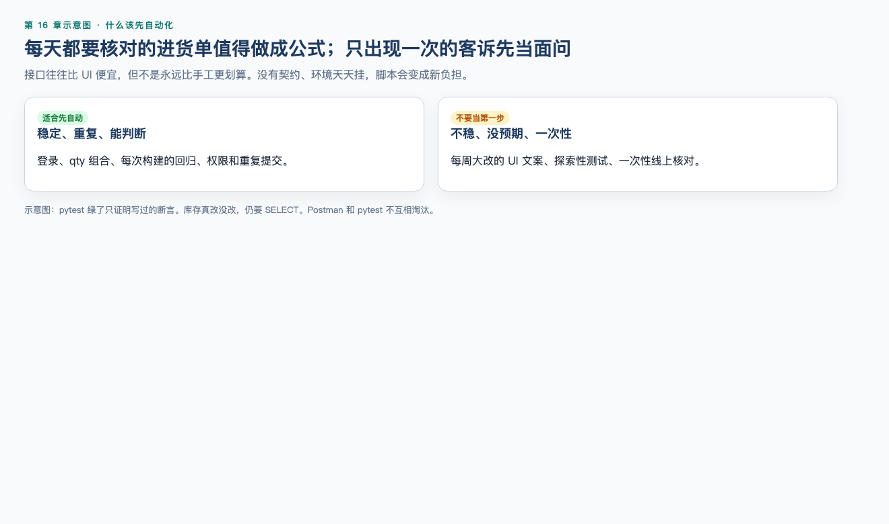
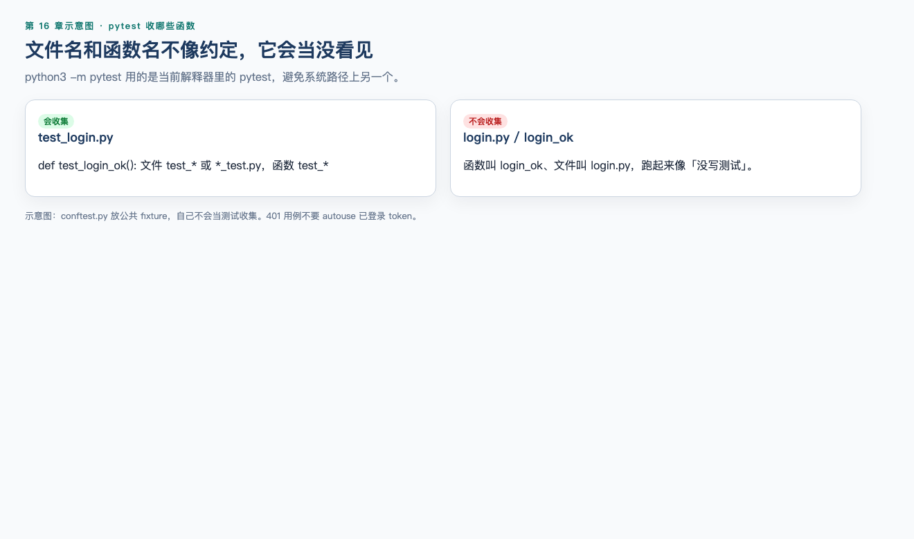

# 第 16 章（上）：pytest 基础

> **一句话核心：** pytest 把已经明确的判定交给脚本重复执行。

> 重要级别：⭐⭐⭐ 必须掌握  
> 核心章节发布目标：≥95/100  
> 下一节：[16B fixture 与 MiniShop 自动化](16b-pytest-fixtures.md)

## 这一章解决什么问题

Postman Runner 适合试报文。要进 Git、重复跑登录和库存规则，用 pytest。上半章：ROI、安装、测试函数、requests、登录 API。

## 学习目标

- 说明自动化适用条件和 ROI 边界；
- 在 venv 安装并运行 pytest；
- 写 `test_` 函数和有意义的 `assert`；
- 用 requests 发 JSON 并设置 timeout；
- 不对失败用例先 `raise_for_status`。

## 前置知识

已完成第 15 章。

## 场景导入

Runner 全绿，改一条库存却要手点。把稳定规则写成 pytest。

## 16.1 什么该自动化，ROI 不是口号 ⭐⭐⭐




生活类比：每天都要核对的进货单，值得做成表格公式；只出现一次的异常客诉，更适合当面问清楚。

**自动化**把已经明确的检查交给脚本重复执行。pytest 是执行器，不是测试策略本身。

适合先自动化的（接口场景）：

- 稳定、有契约的登录、加购、下单；
- 同一接口很多输入组合（缺字段、`null`、边界）；
- 每次构建都要跑的回归；
- 手工容易漏的权限和重复提交。

不适合当作第一步的：

- 需求每周大改、页面结构不稳的 UI 细节（第 17 章再谈）；
- 还没有说清预期的探索性测试；
- 一次性的线上核对。

ROI 要问三件事：写脚本的成本、以后跑一次节省的时间、漏测的损失。接口往往比 UI 便宜，但**不是永远比手工或 UI 自动化更划算**。没有契约、环境天天挂、数据无法准备时，脚本会变成新的维护负担。

pytest 绿了，只证明你写过的断言成立。库存有没有真改，仍按第 12、13 章在授权库 `SELECT`。

Postman 和 pytest 互补：前者适合快速试报文和分享集合；后者适合进 Git、进 CI、和 Python 数据处理放在一起。不要说其中一种淘汰另一种。

---

## 16.2 安装 pytest 与 requests ⭐⭐⭐

在**自己的练习目录**建虚拟环境，不要拿课程仓库当安装实验场。

```bash
python3 -m venv .venv
source .venv/bin/activate
python3 -m pip install pytest requests
python3 -m pytest --version
```

Windows 激活方式见第 15 章。应能看到 pytest 版本号。审查机器为：

```text
pytest 9.1.1
```

`python3 -m pytest` 比直接打 `pytest` 更不容易跑到系统里另一个解释器。

第三方库：

| 库 | 作用 |
| --- | --- |
| pytest | 收集测试、运行 `assert`、报告失败 |
| requests | 发 HTTP，读取响应 |

不要 `sudo pip`，不要把真实密码写进即将提交的文件。`.venv` 不要进 Git。

---

## 16.3 测试函数与 assert ⭐⭐⭐




pytest 默认收集：

- 文件名 `test_*.py` 或 `*_test.py`；
- 函数名 `test_*`。

最简单（不发 HTTP，可先跑通）：

```python
def qty_allowed(qty, stock):
    if type(qty) is not int or type(stock) is not int:
        return False
    if qty < 1:
        return False
    return qty <= stock


def test_qty_one_allowed():
    assert qty_allowed(1, 10) is True
```

保存为 `tests/test_qty_allowed.py` 后：

```bash
python3 -m pytest tests/test_qty_allowed.py -q
```

通过时大致看到 `.` 和 `passed`。

正常例子：同一文件里再写超库存（须与上面的 `qty_allowed` 放在同一文件）。

```python
def qty_allowed(qty, stock):
    if type(qty) is not int or type(stock) is not int:
        return False
    if qty < 1:
        return False
    return qty <= stock


def test_qty_over_stock():
    assert qty_allowed(11, 10) is False
```

失败时，pytest 会改写 `assert`，把两边的值印出来。例如：

```python
def test_fail_demo():
    qty = 11
    stock = 10
    assert qty <= stock
```

审查中失败信息包含：

```text
assert 11 <= 10
```

这就是 pytest 相对“自己 print 再肉眼看”的价值。不要写 `assert True`，也不要用 `print` 代替断言。

`@` 是装饰器：写在函数上一行，把函数交给别人处理。本章只要求会用 pytest 提供的两个：`@pytest.fixture` 和 `@pytest.mark.parametrize`。不要自己实现装饰器，也不要展开 class 测试。

---

## 16.4 requests 发 HTTP ⭐⭐⭐

requests 把第 9、13 章的 HTTP 变成函数调用。先另开一个终端，在仓库里启动 MiniShop（保持开着）：

```bash
cd project/minishop
python3 run.py serve
```

第一帧应打印 `MINISHOP_BASE_URL=http://127.0.0.1:8765`。没启动时下面这段会 `ConnectionError`，那不是断言失败。

下面是**片段**：MiniShop 默认 `http://127.0.0.1:8765`。

```python
import requests

response = requests.get(
    "http://127.0.0.1:8765/api/products",
    params={"keyword": "鼠标"},
    timeout=5,
)
print(response.status_code)
```

常用属性：

| 写法 | 含义 |
| --- | --- |
| `response.status_code` | 状态码 |
| `response.json()` | 解析 JSON，失败会异常 |
| `response.headers` | 响应头 |
| `requests.post(..., json={...})` | JSON Body，并带 `Content-Type: application/json` |
| `timeout=5` | 超时秒数；不写可能一直挂起 |

纪律：

- **每次请求都写 `timeout`。**
- 期望 400/401 时，不要先 `raise_for_status()`：它会把 4xx/5xx 直接变成异常，断言还没执行。
- `json=` 发 JSON；`data=` 配字典则是表单。测 JSON 接口用 `json=`。
- 不要在断言失败信息里打印完整 token 或密码。

当前 MiniShop 行为（与第 13、14 章、PRD 一致）：

| 请求 | 结果 |
| --- | --- |
| `POST /api/login` 正确 | `200`，`result=ok`，`token`，以及 `Set-Cookie` |
| `POST /api/login` 错误密码 | `401` |
| `GET /api/products?keyword=鼠标` | `200`，命中无线鼠标 |
| `POST /api/cart/items` `qty=1` 或 `qty=10`（需 Bearer） | `200` |
| `POST /api/cart/items` `qty=11`（需 Bearer） | `400` |
| `POST /api/orders` 无 Bearer **且** 无 Cookie | `401`（仅缺 Authorization、仍带登录 Cookie 时可能 201） |
| `POST /api/orders` 带 token | `201`，有 `id`，无 `status` |
| 连续两次成功下单 | 两个不同 `id` |

自动化必须按**当前被测系统**写期望。`qty=10` → 200，`qty=11` → 400，购物车要 Bearer。教学密码是仓库写明的 `Test1234`，只许用在本机，不要提交别的真实密码。

---

## 16.5 登录 API 测试 ⭐⭐⭐

上半章先对着已启动的 MiniShop 硬编码地址跑通。不要在这里写 `base_url` 参数——那是 16B 的 fixture，现在抄下来会报 `fixture 'base_url' not found`。完整仓库文件是 `project/minishop/tests/test_api.py`（由 `cd project/minishop && python3 run.py test` 收集，自己起临时端口）。

先保证 `python3 project/minishop/run.py serve` 仍开着。

```python
import requests

TIMEOUT = 5
BASE = "http://127.0.0.1:8765"


def test_login_ok():
    response = requests.post(
        f"{BASE}/api/login",
        json={"phone": "13800138000", "password": "Test1234"},
        timeout=TIMEOUT,
    )
    assert response.status_code == 200
    body = response.json()
    assert body["result"] == "ok"
    assert type(body["token"]) is str and body["token"] != ""
    assert "Set-Cookie" in response.headers


def test_login_wrong_password():
    response = requests.post(
        f"{BASE}/api/login",
        json={"phone": "13800138000", "password": "wrong-password"},
        timeout=TIMEOUT,
    )
    assert response.status_code == 401
```

成功响应里同时有 JSON `token` 和 `Set-Cookie`：二者可以同时存在，后续接口以 `Authorization: Bearer` 为准。密码 `Test1234` 只许本机。

不要在 query 里传密码。不要把这次拿到的 token 粘到别的测试文件里当常量——下一节用 fixture。作业命令始终是 `cd project/minishop && python3 run.py test`，不要用系统 `python3 -m pytest` 去打一份没 venv 的空环境。

---


安装请优先使用仓库依赖：

```bash
cd project/minishop
python3 run.py setup
python3 run.py test
```

自己练习目录仍可 `pip install pytest requests`。审查本机：pytest 9.1.1，`38 passed, 1 xfailed`。HTML 报告截图：


汇总条应能看见 **38 Passed** 和 **1 Expected failures**。Environment 明细和每条用例名在 `project/minishop/evidence/pytest-report.html`，不要只靠这一张图填简历。

fixture、parametrize 见 [16B](16b-pytest-fixtures.md)。仓库套件用 `cd project/minishop && python3 run.py test`；实操 16-1 解释 38 / 1。

## 常见错误

### 错误 1：对预期 400 的请求先 `raise_for_status()`

修正：4xx 会在断言前变成异常，分不清“实现成了 400”还是“实现成了 500”。先看 `status_code`，再断言 Body。

### 错误 2：直接敲 `pytest`，不用 `python3 -m pytest`

修正：`-m` 保证用的是当前解释器（通常是 venv）里的 pytest，避免系统路径上另一个副本。

### 错误 3：测试函数叫 `login_ok`、文件叫 `login.py`

修正：pytest 默认收集 `test_*.py` 和 `*_test.py` 里以 `test_` 开头的函数。否则一条都不会跑。

### 错误 4：接口自动化 ROI 永远最高，所以只写脚本不点页面

修正：ROI 必须带场景。稳定、重复、漏测损失大的判定适合自动化；还在改文案的页面先手工。

### 错误 5：对着 MiniShop 打 `POST /login`

修正：路径是 `/api/login`。无前缀会 404。购物车必须带 Bearer，`qty=10` 允许。

## 面试角度 ⭐⭐⭐

### 什么场景适合先上 pytest？

结论：判定已经明确、步骤重复、失败代价高。  
示例：MiniShop 超库存和缺字段，每次回归都跑。  
边界：全新页面还在改文案，先手工。接口 ROI 不是永远最高。

### 为什么用 `python3 -m pytest`？

结论：跟着当前解释器走，避免装错环境。  
示例：`cd project/minishop && python3 run.py setup && python3 run.py test`。  
边界：系统里可能还有另一个 `pytest`，直接敲命令会跑到它。

### xfail 是失败还是已修复？

结论：都不是。它表示已知缺陷按预期失败并被标记。  
示例：仓库 38 passed、1 xfailed，对应 BUG-001 仍开放。  
边界：不要把 xfail 说成“测试挂了”，也不要写进报告当已修复。

## 小练习

题号跨上下册：上半章为 1～4；其余在 16B。

### 练习 1

举一个 MiniShop 场景适合 pytest 自动化，再举一个更适合先手工。说明 ROI 判断依据。

### 练习 2

为什么 `python3 -m pytest` 往往比直接输入 `pytest` 更稳？

### 练习 3

函数名叫 `login_ok`、文件名叫 `login.py`，运行 pytest 会怎样？应改成什么？

### 练习 4

对预期状态码 400 的请求，第一句写成 `response.raise_for_status()` 有什么问题？


## 练习答案

1. 适合：超库存与缺字段每次回归都跑。不适合先自动：全新结算页还在改文案。依据是重复次数、稳定性和漏测损失。

2. `-m` 保证用的是当前解释器（通常是 venv）里的 pytest，避免系统路径上另一个 pytest。

3. 不会被收集。改为 `test_login.py` 与 `def test_login_ok():`。

4. 400 会在断言前变成异常，分不清“实现成了 400”还是“实现成了 500”。


## 本章检查清单

- [ ] 我能说明 ROI 边界
- [ ] 我会运行 pytest
- [ ] 我会用 requests 发 JSON
- [ ] 我不会对预期 400 先 `raise_for_status`

## 本章总结

pytest 把已经明确的判定交给脚本重复执行。先会跑、会断言状态码，再谈 fixture。xfail 记录的是仍开放的缺陷。

## 本章可运行性说明

仓库套件：pytest 9.1.1，`38 passed, 1 xfailed`。对端是 `project/minishop` 的 `/api/`。

## 参考资料

- [16B](16b-pytest-fixtures.md)
- [pytest 文档](https://docs.pytest.org/)

## 下一章预告

[第 16 章（下）](16b-pytest-fixtures.md)
