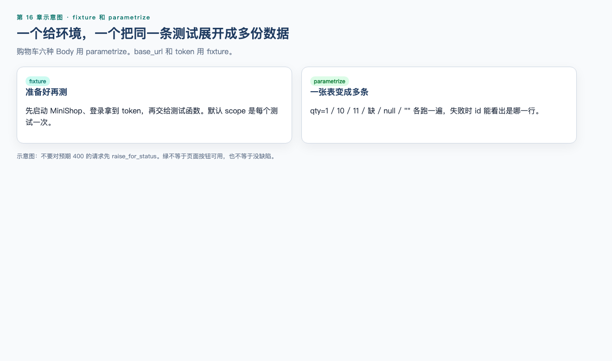
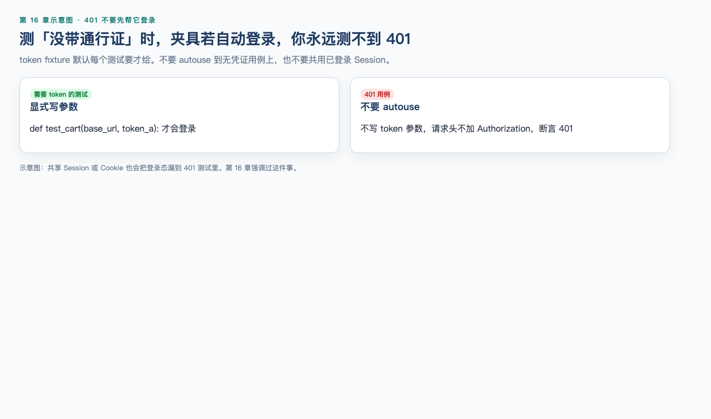

# 第 16 章（下）：fixture、参数化与 MiniShop 自动化

> **一句话核心：** fixture 负责准备观察所需的前置，不负责发明判定。

> 上一节：[16A pytest 基础](16a-pytest-basics.md)

## 这一章解决什么问题

把 token 和 base_url 从每条测试里抽出来，用 parametrize 覆盖数量和四态。并完成教学接口 pytest 包。正式 MiniShop v1.0 套件在 `project/minishop/tests/`，不要把教学 `/login` 写成已冻结契约。

## 学习目标

- 用 fixture 注入 `base_url` 和 `token`；
- 401 用例不要 autouse token；
- 用 parametrize 覆盖数量与四态；
- 读 `pytest.ini` 的 `testpaths`。

## 前置知识

已完成 16A。

## 16.6 fixture 与 scope ⭐⭐⭐




**fixture** 是测试运行前（或后）准备好的东西：地址、账号、token。测试函数写同名参数，pytest 会注入。下面是**片段**，完整 `conftest.py` 见实战。

```python
import os

import pytest
import requests

TIMEOUT = 5


@pytest.fixture
def base_url():
    url = os.environ.get("TEACH_BASE_URL")
    assert url, "TEACH_BASE_URL is required"
    return url.rstrip("/")
```

`test_login_ok(base_url, phone, password)` 并不需要你手动调用 `base_url()`。

| scope | 何时创建一次 | 适用 |
| --- | --- | --- |
| `function` | 每个测试（默认） | 入门默认；隔离最好 |
| `class` | 一个测试类 | 本章不用 class |
| `module` | 该文件 | 文件内共享只读配置 |
| `package` | 包 | ⭐ 了解 |
| `session` | 整次 pytest | 登录贵、启动服务 |

token 用默认 `function` 最稳：每个需要它的测试自己登录一次。登录很慢时再改为 `scope="session"`。不要把 token fixture 设成 `autouse=True`：无凭证用例也会先多打一次登录；若再共用 `requests.Session` 或自动带上 Cookie，401 就会测脏。本章的 token fixture 只 `return` 字符串，不会自动粘到没有声明该参数的请求上，但不要依赖这种巧合。

需要收尾时用 `yield`：`yield` 之前是准备，之后是清理。教学服务没有登出接口，token fixture 直接 `return` 即可。

fixture 里的 `assert` 失败算 **setup 错误**，测试函数体还没执行。先看是环境（没设 `TEACH_BASE_URL`、服务没启动）还是业务断言失败。

---

## 16.7 conftest.py ⭐⭐⭐

`conftest.py` 专门放本目录及子目录都能用的 fixture。它**不会**被当成测试模块收集。

项目根目录放一份即可。测试函数仍写在 `tests/test_*.py`。不要在 `conftest.py` 里写 `test_` 函数。

同一 fixture 名在测试文件里再定义，会覆盖更外层的定义。入门阶段保持一层 `conftest.py`，避免同名打架。

---

## 16.8 Token fixture ⭐⭐⭐




下面两段是**片段**，须放进 `conftest.py` / `tests/test_orders.py`，不能单独当脚本执行。

```python
import pytest
import requests

TIMEOUT = 5


@pytest.fixture
def token(base_url, phone, password):
    response = requests.post(
        f"{base_url}/login",
        json={"phone": phone, "password": password},
        timeout=TIMEOUT,
    )
    assert response.status_code == 200
    value = response.json().get("token")
    assert type(value) is str and value != ""
    return value
```

需要认证的测试声明 `token` 参数：

```python
def test_create_order_returns_id(base_url, token):
    response = requests.post(
        f"{base_url}/orders",
        json={"sku": "SKU-DEMO-001", "qty": 1},
        headers={"Authorization": f"Bearer {token}"},
        timeout=5,
    )
    assert response.status_code == 201
    body = response.json()
    assert "id" in body
    assert "status" not in body
```

无凭证用例**不要**声明 `token`，也不要复用 `requests.Session` 里已经存下的 Cookie 来“顺便”带登录态——除非你在测 Cookie 认证。教学订单接口看的是 Bearer。Cookie 与 Bearer 可同时出现在登录响应里，检查哪一种以文档为准。

---

## 16.9 parametrize：数据驱动 ⭐⭐⭐

同一检查逻辑、多组输入，用 `@pytest.mark.parametrize`，不要复制六个几乎一样的函数。须与 `base_url` fixture 一起由 pytest 收集。

```python
import pytest
import requests

TIMEOUT = 5


@pytest.mark.parametrize(
    "body, status",
    [
        ({"sku": "SKU-DEMO-001", "qty": 1}, 200),
        ({"sku": "SKU-DEMO-001", "qty": 11}, 400),
        ({"sku": "SKU-DEMO-001"}, 400),
        ({"sku": "SKU-DEMO-001", "qty": None}, 400),
        ({"sku": "SKU-DEMO-001", "qty": ""}, 400),
        ({"sku": "SKU-DEMO-001", "qty": "1"}, 400),
    ],
    ids=["ok", "over_stock", "missing", "null", "empty_str", "wrong_type"],
)
def test_cart_qty_cases(base_url, body, status):
    response = requests.post(
        f"{base_url}/cart/items",
        json=body,
        timeout=TIMEOUT,
    )
    assert response.status_code == status
```

`ids` 出现在收集列表和失败报告里，比默认的 `[body0]` 好读。

一次只变一个主要无效条件，与第 13 章一致。教学服务未校验购物车 Bearer，这是教学简化；正式接口以文档为准，不要把“没校验”写成 MiniShop 已上线行为。

从 JSON 文件读用例也可以，本质仍是 parametrize 的数据来源。先把表写在装饰器里。

---

## 16.10 目录结构与基础配置 ⭐⭐⭐

推荐练习目录：

```text
minishop-api-tests/
  .venv/
  pytest.ini
  conftest.py
  teach_server.py
  tests/
    test_qty_allowed.py
    test_login.py
    test_cart.py
    test_orders.py
```

`pytest.ini`：

```ini
[pytest]
testpaths = tests
addopts = -ra
```

`testpaths` 限制搜索目录。`-ra` 在结束时多打印跳过等原因（本章用得少，但报告更完整）。

有的项目把配置写在 `pyproject.toml` 的 `[tool.pytest.ini_options]`。pytest 9 还认识 `pytest.toml`。入门用 `pytest.ini` 即可；遇到空的 `pytest.ini` 时，它仍会成为配置来源，不要留一个空白文件在仓库里干扰其他配置。

常用命令：

```bash
python3 -m pytest
python3 -m pytest -q
python3 -m pytest --collect-only -q
python3 -m pytest -k login
python3 -m pytest tests/test_orders.py
```

`-k login` 按名字过滤。`--collect-only` 只看收集到哪些测试，不发请求。

需要把项目根目录加入导入路径时，可在 ini 里设 `pythonpath = .`。本章示例把辅助函数写在测试文件或 `conftest.py`，不必先上这条。

---


配套可运行实操：[实操 16-1 pytest 基线](../practice/16-pytest-regression/README.md)（先 `python3 project/minishop/run.py setup`，再 `python3 practice/run.py 16-1`）。37 passed / 1 xfailed 对应 BUG-001 仍开放。

## MiniShop 工作实战：教学接口 pytest 包 ⭐⭐⭐

在自己的练习目录完成。保存说明：

```text
exercises/chapter-16-minishop-pytest.md
```

教学服务 `teach_server.py` 使用 `class` 继承标准库 HTTP 服务器。你**不需要会写 class**；把它当成一台可启动的教学机器。审查用它验证测试，它不是 MiniShop 正式后端。发送 `Connection: close`，避免单线程服务被 keep-alive 卡住。

```python
from http.server import BaseHTTPRequestHandler, HTTPServer
import json
import os
import time

TEACH_PHONE = os.environ.get("TEACH_PHONE", "13800138000")
TEACH_PASSWORD = os.environ.get("TEACH_PASSWORD", "<redacted>")
TEACH_TOKEN = "teach-token"
STOCK = 10


class TeachHandler(BaseHTTPRequestHandler):
    def log_message(self, format, *args):
        return

    def _json(self, code, obj, extra_headers=None):
        body = json.dumps(obj).encode()
        self.send_response(code)
        self.send_header("Content-Type", "application/json")
        if extra_headers:
            for key, value in extra_headers:
                self.send_header(key, value)
        self.send_header("Content-Length", str(len(body)))
        self.send_header("Connection", "close")
        self.end_headers()
        self.wfile.write(body)

    def _read(self):
        length = int(self.headers.get("Content-Length") or 0)
        raw = self.rfile.read(length) if length else b""
        if not raw:
            return {}
        return json.loads(raw)

    def do_GET(self):
        path = self.path.split("?", 1)[0]
        if path == "/products":
            self._json(200, {"items": [{"sku": "SKU-DEMO-001", "name": "mouse", "stock": STOCK}]})
            return
        self._json(404, {"error": "not found"})

    def do_POST(self):
        if self.path == "/login":
            data = self._read()
            if data.get("phone") == TEACH_PHONE and data.get("password") == TEACH_PASSWORD:
                self._json(
                    200,
                    {"result": "ok", "token": TEACH_TOKEN},
                    [("Set-Cookie", "session_demo=abc; HttpOnly; Path=/")],
                )
            else:
                self._json(401, {"result": "fail"})
            return
        if self.path == "/cart/items":
            data = self._read()
            qty = data.get("qty")
            if qty == 11:
                self._json(400, {"error": "qty exceeds stock"})
            elif qty == 1:
                self._json(200, {"sku": data.get("sku"), "qty": 1})
            else:
                self._json(400, {"error": "bad qty"})
            return
        if self.path == "/orders":
            auth = self.headers.get("Authorization", "")
            if auth != f"Bearer {TEACH_TOKEN}":
                self._json(401, {"error": "unauthorized"})
                return
            data = self._read()
            if data.get("qty") == 11:
                self._json(400, {"error": "qty exceeds stock"})
                return
            if data.get("qty") != 1:
                self._json(400, {"error": "bad qty"})
                return
            self._json(201, {"id": f"ord-demo-{time.time_ns()}"})
            return
        self._json(404, {"error": "not found"})


def main():
    host = "127.0.0.1"
    httpd = HTTPServer((host, 0), TeachHandler)
    port = httpd.server_address[1]
    print(f"TEACH_BASE_URL=http://{host}:{port}", flush=True)
    httpd.serve_forever()


if __name__ == "__main__":
    main()
```

启动（另一个终端）：

```bash
python3 teach_server.py
```

它会打印 `TEACH_BASE_URL=http://127.0.0.1:端口`。然后：

```bash
export TEACH_BASE_URL=http://127.0.0.1:端口
python3 -m pytest -q
```

Windows 用 `set TEACH_BASE_URL=...`。

### `conftest.py`

```python
import os

import pytest
import requests

TIMEOUT = 5


@pytest.fixture
def base_url():
    url = os.environ.get("TEACH_BASE_URL")
    assert url, "TEACH_BASE_URL is required, e.g. http://127.0.0.1:PORT"
    return url.rstrip("/")


@pytest.fixture
def phone():
    return os.environ.get("TEACH_PHONE", "13800138000")


@pytest.fixture
def password():
    return os.environ.get("TEACH_PASSWORD", "<redacted>")


@pytest.fixture
def token(base_url, phone, password):
    response = requests.post(
        f"{base_url}/login",
        json={"phone": phone, "password": password},
        timeout=TIMEOUT,
    )
    assert response.status_code == 200
    body = response.json()
    value = body.get("token")
    assert type(value) is str and value != ""
    return value
```

### `tests/test_qty_allowed.py`

```python
def qty_allowed(qty, stock):
    if type(qty) is not int or type(stock) is not int:
        return False
    if qty < 1:
        return False
    return qty <= stock


def test_qty_one_allowed():
    assert qty_allowed(1, 10) is True


def test_qty_equals_stock():
    assert qty_allowed(10, 10) is True


def test_qty_over_stock():
    assert qty_allowed(11, 10) is False


def test_qty_wrong_type():
    assert qty_allowed("11", 10) is False
```

`tests/test_login.py` 用 16.5 的两个函数。

### `tests/test_cart.py`

```python
import pytest
import requests

TIMEOUT = 5


def test_products_list(base_url):
    response = requests.get(
        f"{base_url}/products",
        params={"keyword": "mouse"},
        timeout=TIMEOUT,
    )
    assert response.status_code == 200
    body = response.json()
    assert type(body["items"]) is list


@pytest.mark.parametrize(
    "body, status",
    [
        ({"sku": "SKU-DEMO-001", "qty": 1}, 200),
        ({"sku": "SKU-DEMO-001", "qty": 11}, 400),
        ({"sku": "SKU-DEMO-001"}, 400),
        ({"sku": "SKU-DEMO-001", "qty": None}, 400),
        ({"sku": "SKU-DEMO-001", "qty": ""}, 400),
        ({"sku": "SKU-DEMO-001", "qty": "1"}, 400),
    ],
    ids=["ok", "over_stock", "missing", "null", "empty_str", "wrong_type"],
)
def test_cart_qty_cases(base_url, body, status):
    response = requests.post(
        f"{base_url}/cart/items",
        json=body,
        timeout=TIMEOUT,
    )
    assert response.status_code == status
```

### `tests/test_orders.py`

```python
import requests

TIMEOUT = 5


def test_create_order_returns_id(base_url, token):
    response = requests.post(
        f"{base_url}/orders",
        json={"sku": "SKU-DEMO-001", "qty": 1},
        headers={"Authorization": f"Bearer {token}"},
        timeout=TIMEOUT,
    )
    assert response.status_code == 201
    body = response.json()
    assert "id" in body
    assert type(body["id"]) is str
    assert "status" not in body


def test_create_order_twice_not_idempotent(base_url, token):
    payload = {"sku": "SKU-DEMO-001", "qty": 1}
    headers = {"Authorization": f"Bearer {token}"}
    first = requests.post(f"{base_url}/orders", json=payload, headers=headers, timeout=TIMEOUT)
    second = requests.post(f"{base_url}/orders", json=payload, headers=headers, timeout=TIMEOUT)
    assert first.status_code == 201
    assert second.status_code == 201
    assert first.json()["id"] != second.json()["id"]


def test_create_order_unauthorized(base_url):
    response = requests.post(
        f"{base_url}/orders",
        json={"sku": "SKU-DEMO-001", "qty": 1},
        timeout=TIMEOUT,
    )
    assert response.status_code == 401
```

审查收集到 16 条，执行结果：

```text
................                                                         [100%]
16 passed in 0.02s
```

耗时随机器变化。完整文件与 `teach_server.py` 以你练习目录中的拷贝为准；逻辑须与上表及第 13 章教学行为一致。

完成标准：

1. 不连教学服务时，数量规则的纯函数测试能独立通过；
2. 登录成功 / 错误密码；
3. 购物车至少覆盖合法数量、超库存，以及缺字段 / `null` / 空字符串 / 错误类型之一组；
4. 下单有 id、无状态名、重复提交两个 id、无凭证 401；
5. Token 来自 fixture，密码来自环境变量或教学占位符；
6. 说明：个人练习，非正式契约，未冒充已测通 MiniShop 全部订单状态。

记录模板：

```markdown
# MiniShop pytest 记录

## 环境
- Python / pytest / requests 版本：
- TEACH_BASE_URL：
- 是否授权 / 是否教学服务：
- 日期：

## 结果
- 收集条数：
- passed / failed：
- 纯函数测试是否可单独跑：

## 声明
- 非正式 OpenAPI；无订单状态臆造；无真实密码入库。
```

---


仓库正式结果（2026-09-09）：`37 passed, 1 xfailed`。输出：`project/minishop/evidence/pytest-output.txt`。HTML 报告：`evidence/pytest-report.html`。

## 小练习

### 练习 5

`token` fixture 的默认 scope 是什么？为什么 401 用例不能 `autouse` 这个 fixture？

### 练习 6

`conftest.py` 会被当成测试文件收集吗？公共 `base_url` 应放哪？

### 练习 7

用一句话区分 fixture 与 `@pytest.mark.parametrize`。购物车六种 Body 应主要用哪一个？

### 练习 8

连续两次 `POST /orders` 得到两个 `id`，自动化应断言什么？不要写订单状态名。

### 练习 9

哪一句正确？

A. 接口自动化 ROI 永远高于 UI  
B. Cookie、Session、Token 是三种 pytest 插件，三选一  
C. `requests.post(..., json={...})` 发送 JSON Body  
D. GET 比 POST 安全，所以登录必须用 GET

### 练习 10

列出教学登录测试最少要断言的 4 项（含一项失败密码）。密码如何提供？不要写订单状态名。


## 练习答案

5. `function`。`autouse` 会让无凭证测试先多登录一次；若再共用 Session 或 Cookie，就测不到 401。需要 token 的测试显式写参数。

6. 不会。放在项目或 `tests` 目录的 `conftest.py`。

7. fixture 准备环境，parametrize 展开数据。六种 Body 用 parametrize。

8. 两次都成功创建且 `id` 不同（教学服务不幂等）。若正式需求只允许一笔，再按正式文档改期望。

9. C。A 违反 ROI 绝对化；B 把认证层次说成插件；D 是 GET/POST 安全神话。

10. 状态码 200、`result=ok`、token 为非空字符串、错误密码 401。密码来自环境变量或教学占位符，不入库。合理四项即可。

---


## 本章检查清单

- [ ] 我会用 fixture 和 parametrize
- [ ] 我知道 401 不要 autouse token
- [ ] 我不会把教学绿当成正式契约
- [ ] 我能跑通 `python3 run.py test`

## 阶段测验

[阶段测验 5](quizzes/stage-5-api.md)

## 本章可运行性说明

`python3 run.py test` 本机 2026-09-09：37 passed, 1 xfailed。教学练习包与 v1.0 套件不是同一份契约。

## 参考资料

- [16A](16a-pytest-basics.md)
- `project/minishop/evidence/pytest-output.txt`

## 下一章预告

第 17 章《自动化测试进阶概览》。
