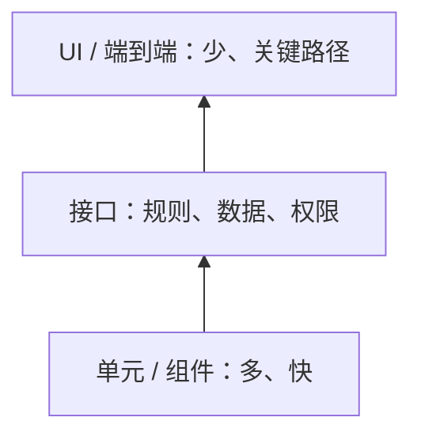

# 第 17 章：自动化测试进阶概览

> 重要级别：⭐⭐ 常用  
> 主案例：MiniShop 个人软件测试实践项目

## 这一章解决什么问题

第 16 章已经能用 pytest + requests 把登录、购物车数量和下单写成可重复的接口测试。接着会碰到另一类问题：要不要点页面？报告给谁看？合并代码后谁来跑？初级岗位要写到多深？

本章是**地图，不是第二套框架课**。你要能指出测试分层和金字塔在说什么，能说明接口自动化在什么条件下划算，能分辨 Playwright 与 Selenium 的定位，能解释 UI 脚本为什么贵，能读懂一份 HTML 报告和一次 CI 红灯，并守住初级工程师的能力边界。

不要把“接口 ROI 永远最高”当成结论。不要把本章示例结构当成 MiniShop 已上线的 UI 自动化或仓库正在跑的流水线。订单状态名仍不冻结。Playwright / Selenium 的安装向导和 CI 插件版本会变，以官方文档为准。

## 学习目标

完成本章后，你应该能够：

- 区分测试级别与自动化分层，并指出每一层典型由谁维护；
- 用测试金字塔解释“下面多、上面少”，且不把比例当国际标准；
- 结合场景说明接口自动化的优势和边界；
- 对比 Playwright 与 Selenium 的常见差异，不把其中一种说成已淘汰另一种；
- 说明 UI 自动化的主要维护成本（定位、等待、脆弱）；
- 说明 pytest 终端报告、pytest-html 和 Allure 各解决什么问题；
- 用自己的话解释 CI/CD，以及初级测试在流水线里做什么；
- 画出 MiniShop 各层自动化边界，并分清“现在会写”和“入职后再学”。

## 前置知识

- 已完成第 16 章，能运行 pytest 接口测试；
- 理解第 3 章：自动化是执行方式，不是一个测试级别；
- 理解第 8、13 章：页面测试和接口测试互补；
- 不要求先会 Playwright、Jenkins 或 Allure 命令行。

## 场景导入：接口全绿，页面登录按钮却点不动

教学规则仍是：数量为正整数且不得超过可售库存。`SKU-DEMO-001` 教学库存为 10。

第 16 章的 pytest 对 `POST /cart/items` 的 `qty=11` 断言 400，全绿。产品经理打开浏览器：登录按钮没有绑定点击，购物车提示文案是英文。接口契约对了，用户路径没过。

反过来也对：页面勉强能点，接口却接受 `"qty":"11"`。只堆 UI 脚本，会又慢又碎；只堆接口脚本，会看不见按钮和文案。



上图是启发式：越往上越接近真实用户，也越慢、越容易因页面改版失败。它不是法律，也不是 ISTQB 的强制比例。

---

## 17.1 测试分层 ⭐⭐⭐

第 3 章的**测试级别**回答“测到系统的哪一层”：组件（单元）、集成、系统、验收。

本章的**自动化分层**回答“脚本主要打在哪一扇门”：

| 层 | 打在哪 | MiniShop 例子 | 常见所有者 |
| --- | --- | --- | --- |
| 单元 / 组件 | 函数、模块 | `qty_allowed(11, 10)` 为假 | 开发为主 |
| 接口 / 服务 | HTTP API、消息 | 登录、改数量、创建订单 | 测试与开发都常见 |
| UI / 端到端 | 浏览器真实路径 | 打开登录页、点按钮、看提示 | 测试常维护少量冒烟 |

生活类比：单元像检查每种零件；接口像检查仓库出货口的单据；UI 像假装顾客把货从货架拿到收银台。

测试工程师需要分层，是因为**同一条业务规则可以在不同门上失败**：接口拒了 11，页面仍可能显示成功；页面报错，库里却已写成 11。

实际使用：先问这条检查验证的是规则、数据、权限，还是渲染和点击。规则优先放接口；必须看到页面的，再写 UI。不要用 UI 去穷举第 13 章的缺字段 / `null` / 错误类型。

---

## 17.2 测试金字塔 ⭐⭐⭐

**测试金字塔**是一种常见策略模型：自动化数量上，单元最多、接口居中、UI 最少。目的是把大多数反馈放在快而稳的层，只把少量昂贵脚本留给用户关键路径。

它来自敏捷实践中的经验模型（常追溯到 Mike Cohn 等人的讨论），**不是** ISO 或 ISTQB 规定的 70%/20%/10%。面试可以说“下面多、上面少”，不要背死比例。

倒置的形状有时被称为“冰淇淋甜筒”：几乎全是 UI 自动化，单元和接口很少。结果是：跑得慢、定位一改就红、难以在每次提交后跑完。这是策略问题，不是“UI 工具不够先进”。

还有蜂巢、奖杯等变体，强调契约测试或不同比例。⭐ 了解即可。选用哪种形状，看架构和风险，不看哪张图更好看。

对初级测试的含义：

- 你在第 16 章写的 pytest 接口测试，处在金字塔中部，这是初级岗位最常先站住的一层；
- 不要为了“看起来会自动化”而把 MiniShop 每一个按钮都录成脚本；
- 开发写的单元测试不是“与测试无关”，回归失败时要会读是哪一层红了。

---

## 17.3 接口自动化：优势必须带场景 ⭐⭐⭐

第 16 章已经实践过接口自动化。这里只补**什么时候划算**。

接口自动化常常有这些好处——**在契约清楚、环境可准备、断言明确时**：

- 比 UI 更快，适合每次构建跑数量组合；
- 少受 CSS、动画、弹窗干扰；
- 容易覆盖权限、错误类型、重复提交；
- 和 SQL 核对可以接到同一条业务规则上。

它并不自动等于最高 ROI。下列场景里，接口脚本帮不上或帮得有限：

- 按钮没发出请求、前端校验文案、响应式布局；
- 契约未定、环境天天挂、测试数据无法重置；
- 你要证明的是“用户这一趟点得下去”，而不是 Body 字段。

MiniShop 对照：

| 检查点 | 更合适的层 | 原因 |
| --- | --- | --- |
| `qty=11` 应被拒绝 | 接口（可加 SQL） | 规则与数据 |
| 登录密码在 Body 不在 query | 接口 | 报文结构 |
| 登录按钮可点、跳转正确 | UI 或手工 | 渲染与事件绑定 |
| 提示语是否好懂 | 手工 | 体验判断 |

Cookie、Session、Token 仍是不同层次。UI 自动化登录可能同时碰到 Cookie 和页面跳转；接口自动化可能只带 Bearer。不要在分层图里把它们画成三选一的“登录产品”。

---

## 17.4 Playwright 与 Selenium ⭐⭐

两者都用来驱动浏览器，做 UI / 端到端检查。本章不要求安装，也不要求交 UI 套件。

| | Playwright | Selenium |
| --- | --- | --- |
| 是什么 | 面向端到端测试的浏览器自动化库，官方支持 Chromium、Firefox、WebKit | 以 W3C WebDriver 为主的浏览器自动化生态，语言绑定多 |
| 等待 | 官方强调操作前的自动可操作性检查（auto-wait） | 常用显式等待；把 `sleep` 当默认等待容易碎 |
| 定位 | 推荐 `getByRole` / `getByLabel` / `getByTestId` 等 | 常用 id、CSS、XPath 等；同样应避免超长绝对路径 |
| 新项目 | 不少团队作为默认选项 | 大量存量项目和多语言栈仍在用 |
| 与 pytest | 官方提供 pytest 插件 | 可与 pytest 一起用，需自己组织 fixture |

官方安装形态会变。Python 侧 Playwright 常见路径是 `pip install pytest-playwright` 再 `playwright install` 下载浏览器；Selenium 则要匹配浏览器驱动或 Selenium Manager。**以官方文档为准**，不要把某年某月的点击路径写进简历当永久步骤。

示例结构（**不要**在未授权网站上跑，也不要求本章安装浏览器）：

```python
# 示例结构。把 PORT 换成授权的 MiniShop 教学前端；不要对公网随意扫描。
def test_login_button(page):
    page.goto("http://127.0.0.1:PORT/")  # MiniShop v1.0 登录页是 `/`，没有 `/login` 路由
    page.get_by_role("button", name="登录").click()
```

```python
# 示例结构。Selenium 4 常见写法，驱动与浏览器版本需匹配。
from selenium import webdriver
from selenium.webdriver.common.by import By

def test_login_button_selenium():
    driver = webdriver.Chrome()
    try:
        driver.get("http://127.0.0.1:PORT/")  # 同上，v1.0 登录页是 `/`
        driver.find_element(By.ID, "login-btn").click()
    finally:
        driver.quit()
```

不要说：

- Playwright 已经淘汰 Selenium；
- 会点录制工具就等于会 UI 自动化；
- UI 自动化可以取消手工和第 16 章的接口测试。

Cypress 等工具本章不展开。见到它们时先看团队技术栈，不要用“是不是 Playwright”当缺陷理由。

---

## 17.5 UI 自动化为什么贵 ⭐⭐⭐

UI 脚本验证的是用户看得见的路径，所以值钱，也所以贵。

主要成本：

1. **定位器。** 按钮 class 改名、嵌套 div 加深，按绝对 XPath 写的脚本会红。优先稳定的角色、标签、`data-testid`（若开发愿意提供）。
2. **等待。** 页面是异步的。随便 `sleep(3)` 在慢环境不够、在快环境浪费。Playwright 的 auto-wait 降低了这类错误，但网络超时、动画遮罩、iframe 仍会让脚本失败。
3. **脆弱（flaky）。** 同一条脚本有时绿有时红，常见原因是时序、测试数据冲突、依赖外部验证码或第三方支付页。
4. **覆盖冲动。** 用 UI 去跑第 13 章那张四态表，维护量会爆炸，收益却重复。

维护纪律：

- 只自动化稳定、高频、断言清楚的冒烟和主路径；
- 验证码、像素级视觉、一次性活动页，优先手工或专用工具，不要硬点；
- 失败时先看是定位、等待、数据，还是产品缺陷；
- 页面对象（把定位集中到一处）可以降低改版成本，⭐⭐ 入门知道有这层即可，不必先上完整框架。

MiniShop：登录成功进入可加购页，值得一条 UI 冒烟；`qty` 的 `null` / `""` / `"11"` 继续放接口。

---

## 17.6 测试报告：pytest-html 与 Allure ⭐⭐

pytest 默认把结果打在终端：`.` 通过、`F` 失败。这对自己够用，给测试经理或不看终端的同事不够。

| 形式 | 作用 | 初级怎么用 |
| --- | --- | --- |
| 终端 | 最快，适合本地 | 第 16 章已用 |
| pytest-html | 一份可打开的 HTML | 会生成、会打开、会对照失败断言 |
| Allure | 更完整的步骤、附件、历史趋势 | 知道团队若用它，去打开已生成的报告 |

审查在独立 venv 中安装 pytest-html 4.2.0，对一条本地断言执行：

```bash
python3 -m pip install pytest-html
python3 -m pytest -q --html=report.html --self-contained-html
```

生成可单独打开的 `report.html`。`--self-contained-html` 把样式打进一个文件，方便发给别人。选项名以当前插件文档为准。

Allure 通常还要：测试时写结果目录、再用 Allure 命令行生成网站。依赖比 pytest-html 多。本章不要求安装。不要把“简历写 Allure”理解成已经会搭一整套平台。

报告只反映跑过的断言。接口 HTML 报告全绿，仍可能页面按钮坏了，也可能库没扣库存。

---

## 17.7 CI/CD ⭐⭐

**持续集成（CI）**：代码合并或推送后，在机器上自动执行构建和测试，而不是只在某个人笔记本上绿过。

**持续交付 / 持续部署（CD）**：通过流水线把可发布的版本送到测试环境或生产。初级岗位先能分清“自动跑测试”和“自动上线”，不要把两者混成一个词。

常见托管：GitHub Actions、GitLab CI、Jenkins 等。界面和 YAML 字段会变。下面是**示例结构**，不是本课程仓库正在运行的流水线，版本钉死以各平台官方文档为准。

```yaml
# 示例结构，不要当作本仓库已配置的 GitHub Actions
name: minishop-api-tests
on:
  push:
  pull_request:
jobs:
  pytest:
    runs-on: ubuntu-latest
    steps:
      - uses: actions/checkout@v4
      - uses: actions/setup-python@v5
        with:
          python-version: "3.12"
      - run: python -m pip install pytest requests
      - run: python -m pytest -q
        env:
          TEACH_BASE_URL: http://127.0.0.1:PORT
          TEACH_PASSWORD: ${{ secrets.TEACH_PASSWORD }}
```

初级测试在 CI 里实际做什么：

- 看这次构建红了哪些测试名字；
- 区分：产品缺陷、测试数据没清、教学服务没启动、UI 定位改了；
- 不把密码、token 写进 YAML 明文，使用仓库密钥；
- 不在未授权环境对生产做压力或扫描。

CI 绿了，只证明流水线里那一组命令在那台机器上通过。它不能替代出口标准，也不能证明 MiniShop 正式契约已冻结。

Newman、Postman CLI 也可以进 CI，与 pytest 并列而不是互相淘汰。第 14 章已说过 Runner 不是性能测试；CI 里的 pytest 同样不是第 18 章的负载模型。

---

## 17.8 初级工程师能力边界 ⭐⭐⭐

课程把 Python、pytest、基础接口自动化放在第二梯队；把 UI 自动化、CI/CD 放在第三梯队。对应到岗位：

| 现在应能 | 了解即可 | 不要假装已经精通 |
| --- | --- | --- |
| 维护第 16 章那种 pytest 接口测试 | Playwright / Selenium 差在哪 | 从零设计自动化平台 |
| 说明金字塔和分层，不背假比例 | 打开 pytest-html / Allure | 独立负责公司 Jenkins |
| 判断一条检查该放接口还是 UI | 读懂 CI 红灯日志 | 用 UI 脚本替代全部手工 |
| 写出 MiniShop 分层地图 | 页面对象、重试、并行 | 在简历写“已测通全部订单状态 / 已上 CI 生产” |

入职后常见下一步：在团队现有框架里加一条接口用例、修一条失败的 UI 冒烟、看一眼流水线日志。框架选型、Grid、自愈、AI 录制，等你先把第 16 章的断言写稳。

第 1 章的岗位图仍然成立：功能测试可以先吃饭；自动化工程师通常要更强的编程；测开还要工程化。本章读完不等于已经是自动化工程师。

---

## MiniShop 工作实战：自动化分层地图 ⭐⭐⭐

在自己的练习目录保存：

```text
exercises/chapter-17-minishop-automation-map.md
```

不要为此去扫未授权站点，不要提交真实密钥，不要编造“已在 GitHub Actions 日跑 MiniShop 生产”。

必做：

1. 按单元 / 接口 / UI / 手工四列，各写至少两条 MiniShop 检查（数量规则必须出现在接口列）；
2. 指出一条**只适合接口、不适合先写 UI** 的检查，并说明原因；
3. 指出一条**接口绿了仍可能失败**的页面检查；
4. 写明初级现在会交付什么（第 16 章 pytest），以及明确不做的事（完整 UI 框架、生产 CI）；
5. 声明：个人实践项目，非正式 OpenAPI，无订单状态臆造。

```markdown
# MiniShop 自动化分层地图

## 环境与日期
- 是否仅教学约定：是
- 日期：

## 分层表
| 层 | 检查点 | 断言大意 | 现在谁来做 |

## 接口优先的一条
- 检查点：
- 为什么不先 UI：

## 接口不够的一条
- 检查点：
- 还要看什么：

## 初级边界
- 会交付：
- 不做：

## 声明
- 非正式契约；无生产流水线；无真实密码。
```

完成标准：四列都有例子；数量超库存在接口层；有一条 UI/手工补位；边界写清楚。

---

## 常见错误

### 错误 1：接口自动化 ROI 永远最高

修正：在契约稳定、组合多、要回归时常常划算。要证明按钮和文案时，接口不能代替 UI 或手工。

### 错误 2：把金字塔比例当成 ISTQB / 公司制度

修正：形状是启发式。团队可以因风险把某些 UI 路径加厚，但应说得出代价。

### 错误 3：用 UI 脚本穷举缺字段、`null`、错误类型

修正：这些放接口。UI 留主路径。

### 错误 4：录制一遍页面就宣称会 Playwright / Selenium

修正：还要会定位策略、失败排查、数据准备和不大规模硬点验证码。

### 错误 5：`time.sleep` 当默认等待

修正：优先工具提供的等待或条件等待。Playwright 文档也不把 `sleep` 当常规做法。

### 错误 6：CI 红了就一律报产品缺陷

修正：先看是断言、数据、环境、密钥，还是定位。把日志留在缺陷里。

### 错误 7：把密码写进 YAML 或 HTML 报告

修正：CI 用密钥；报告里脱敏 token。

### 错误 8：Cookie、Session、Token 画成金字塔三层

修正：那是认证与会话的不同层次，不是单元/接口/UI。

### 错误 9：本章读完就在简历写精通 CI/CD 和 UI 自动化

修正：写“了解分层，能维护 pytest 接口测试，能读报告和 CI 结果”。证据仍要能在仓库里找到。

### 错误 10：教学地图当成 MiniShop 已上线的自动化平台

修正：第 19 章才做完整项目材料。现在不要冻结前端选择器和订单状态机。

---

## 面试角度 ⭐⭐⭐

回答顺序：结论 → 原理 → 场景 → 示例 → 边界。

### 什么是测试金字塔？

结论：一种“下面多、上面少”的自动化策略模型，把快速稳定的检查放在单元和接口，UI 只保留关键路径。  
示例：MiniShop 数量规则用 pytest 接口跑六种输入，登录按钮用一条 UI 冒烟。  
边界：不是法定比例；倒置后会又慢又脆。

### 为什么不把所有测试都做成 UI 自动化？

结论：UI 慢、依赖定位和时序，维护成本高。规则、数据和权限用接口更合适。  
边界：必须验证渲染和真实点击时，接口不够。

### 接口自动化一定比 UI 值吗？

结论：不是一定。契约清楚、重复执行时接口往往更便宜；页面事件、文案、布局仍要 UI 或手工。  
边界：禁止“ROI 永远最高”这种说法。

### Playwright 和 Selenium 怎么选？

结论：新项目看团队栈和文档；Playwright 强调 auto-wait 与多引擎一套 API；Selenium 生态老、存量多。  
边界：选工具不是缺陷理由。以能稳定跑、有人维护为准。

### 初级测试要不要会 CI/CD？

结论：要能解释 CI 会自动跑测试，能根据日志判断失败层；不必从零搭平台。  
边界：密钥、生产发布权限不是初级日常。

### 自动化会取代手工测试吗？

结论：不会简单取代。稳定重复的检查适合自动化；探索、体验和剧变页面仍要人。与第 3 章一致。

---

## 小练习

### 练习 1

为什么“自动化测试和系统测试哪个好”仍然不是好问题？结合本章分层再答一次。

### 练习 2

把 MiniShop「库存 10 时数量 11」分别放在单元、接口、UI，各会验证到什么、验证不到什么？

### 练习 3

金字塔画成“UI 最多、单元几乎没有”，上线前最可能出现哪两类痛苦？

### 练习 4

举一个接口自动化 ROI 较高的 MiniShop 场景，再举一个较低的。不要说“永远最高”。

### 练习 5

Playwright 的 auto-wait 解决的是哪类 UI 失败？它能不能消灭所有 flaky？

### 练习 6

为什么绝对 XPath 不适合作为 MiniShop 登录按钮的长期定位？

### 练习 7

pytest 终端全绿、没有 HTML 报告时，向不看终端的同事传达结果缺什么？pytest-html 补的是哪一层？

### 练习 8

CI 上 `TEACH_BASE_URL` 指到已关机的教学服务，pytest 全红。这应先当成产品缺陷吗？日志里应留下什么？

### 练习 9

哪一句正确？

A. 接口自动化 ROI 永远高于 UI  
B. 金字塔比例由 ISTQB 强制为 70/20/10  
C. 自动化是执行方式，可以出现在多个测试级别  
D. Cookie、Session、Token 是金字塔的三层

### 练习 10

根据 17.8，列出初级现在应能交付的 3 件事，和明确不必假装精通的 2 件事。不要写订单状态名。

## 练习答案

1. 自动化是执行方式，系统测试是级别，可以组合。分层之后更清楚：系统级既可手工也可自动，自动还可以打在接口或 UI。
2. 单元：纯函数是否拒绝 11。接口：HTTP 是否 400、库是否未写成 11。UI：页面是否提示、按钮是否发请求。单层都不够覆盖另外两层。
3. 流水线过慢；页面小改就大面积失败。回归无法每次提交都跑完。
4. 较高：每次构建跑数量四态。较低：活动页文案是否温馨、验证码是否好认。
5. 主要减少“元素还不能点就去点”。不能消灭数据冲突、验证码、环境抖动和错误定位。
6. 结构一变路径就断，失败像产品缺陷。应优先稳定的角色、标签或测试 id。
7. 缺一份可打开、可转发的失败现场。pytest-html 补的是可读报告，不是新的测试级别。
8. 先当环境问题。日志应有失败测试名、连接错误或 fixture 报错、当时的 base URL（无密码）。
9. C。A 绝对化 ROI；B 把启发式当标准；D 把认证层次误当成金字塔。
10. 应能：维护 pytest 接口测试、说明分层与金字塔、读报告/CI 失败。不必假装：从零搭 UI 框架、独立负责公司 CI 生产发布。合理等价即可。

---

## 本章检查清单

- [ ] 我能区分测试级别和自动化分层
- [ ] 我能用“下面多、上面少”解释金字塔，且不背假比例
- [ ] 我能结合场景谈接口自动化，而不是 ROI 永远最高
- [ ] 我能对比 Playwright 与 Selenium 的定位，不宣布谁已淘汰
- [ ] 我知道 UI 贵在定位、等待和脆弱
- [ ] 我知道终端报告、pytest-html、Allure 的差别
- [ ] 我能解释 CI 是自动跑测试，CD 还涉及发布
- [ ] 我不会把密钥写进流水线明文
- [ ] 我清楚初级边界，不在简历夸大
- [ ] 我能完成 MiniShop 分层地图

### 进入下一章的自测门槛

1. 练习 1～10 至少完成 9 题，且第 2、4、8、9 题能用自己的话回答；
2. 能口述接口绿了为什么还可能页面失败；
3. 能指出一条不该先做 UI 自动化的 MiniShop 检查；
4. 完成分层地图。

## 本章总结

本章需要真正掌握七件事：

1. 级别回答测多深，分层回答脚本打哪扇门；
2. 金字塔是启发式，不是法定比例；
3. 接口自动化要带场景，不能绝对化 ROI；
4. Playwright 与 Selenium 都是浏览器自动化，选型看栈和存量；
5. UI 只覆盖稳定主路径，维护成本主要在定位和等待；
6. 报告和 CI 让别人看得到结果，绿不等于库对、页面对；
7. 初级先站住 pytest 接口层，UI 框架和 CI 平台是入职后的增量。

## 本章可运行性说明

pytest-html 4.2.0 已在独立 venv 中对一条本地测试执行 `--html=report.html --self-contained-html`，成功生成 HTML。Playwright / Selenium 代码块标明为示例结构，审查未安装浏览器驱动，未对公网执行点击。GitHub Actions YAML 为示例结构，本仓库未配置该流水线。

未把第三方包装进课程仓库。教学路径、端口和前端选择器非正式 MiniShop 契约。

## 参考资料

- ISTQB CTFL：测试级别与测试类型（与金字塔策略模型区分）
- [Playwright for Python](https://playwright.dev/python/)（本章于 2026-09-08 核验）
- [Playwright auto-waiting](https://playwright.dev/python/docs/actionability)
- [Selenium](https://www.selenium.dev/)
- [pytest-html](https://pytest-html.readthedocs.io/)（审查版本 4.2.0）
- [Allure Report](https://allurereport.org/docs/)
- [GitHub Actions 文档](https://docs.github.com/en/actions)
- 本仓库 [第 3 章：软件测试分类体系](03-software-testing-classification.md)
- 本仓库 [第 16 章：pytest 自动化](16-pytest.md)
- 本仓库 [全局内容质量标准](../standards/QUALITY_STANDARD_v1.0.md)

## 下一章预告

下一章进入第 18 章《性能测试基础》。你将区分响应时间、吞吐量和并发，知道负载、压力、耐久不是一回事，并看清初级岗位对 JMeter 的要求边界。CI 里的功能回归仍然不是性能测试。
