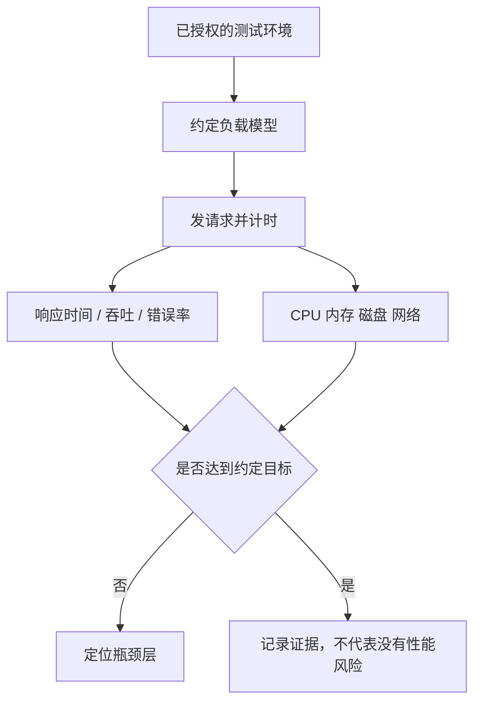

# 第 18 章：性能测试基础

> 重要级别：⭐⭐ 常用  
> 主案例：MiniShop 个人软件测试实践项目

## 这一章解决什么问题

第 16 章的 pytest 能证明“这一次请求的状态码和 JSON 对不对”。第 17 章的 CI 能证明“这次提交后功能脚本绿了”。用户说“购物车好卡”，这两类绿都回答不了：**在约定负载下，系统能不能按时、按量、稳定地干活。**

性能测试用来检查响应时间、吞吐量、并发能力和资源使用。它是第 3 章里的非功能测试，不是功能自动化的加速版，也不是把 Postman Runner 或 pytest 并发开大。

本章是基础地图。你要能读懂指标、能区分负载/压力/耐久、能认识 JMeter 的测试计划结构，并守住初级岗位边界。不要对未授权系统加压，不要把教学数字写成 MiniShop 已冻结的 SLA，不要在简历写“精通 JMeter / 已完成 MiniShop 全链路压测”。

JMeter 界面文案会变。本章以 Test Plan、Thread Group、Sampler、Listener 等功能名为准。审查环境未安装 JMeter GUI；组件含义依据 Apache JMeter 用户手册。

## 学习目标

完成本章后，你应该能够：

- 说明性能测试验证什么，以及它和功能测试、pytest、CI 的差别；
- 解释响应时间、百分位，以及为什么不能只看平均值；
- 解释吞吐量、TPS、QPS，并和并发人数分开；
- 说明 CPU、内存、磁盘、网络在性能问题里各自可能扮演的角色；
- 区分负载、压力、耐久（以及峰值冲击的了解项）；
- 说出 JMeter 测试计划里 Thread Group、HTTP Sampler、Listener 的作用，以及 GUI 不适合真正加压；
- 列出初级岗位对性能的要求，以及必须授权才能加压的纪律；
- 完成一份 MiniShop 性能问题清单，而不是一份未授权的压测报告。

## 前置知识

- 已完成第 3 章对非功能和“可验证性能目标”的认识；
- 已完成第 9～11 章：HTTP、DevTools Timing/TTFB、Linux 上看 CPU/内存/磁盘；
- 已完成第 16、17 章：知道功能自动化和 CI 回归不是负载模型；
- 不要求先成为性能工程师，不要求本机已安装 JMeter。

## 场景导入：功能绿了，晚高峰还是卡

教学规则仍是：数量为正整数且不得超过可售库存。接口在空闲时把 `qty=11` 正确地打成 400。

晚高峰测试环境（已授权）里，登录和加购变得很慢，有的请求直接超时。可能的原因包括：

- 应用 CPU 打满；
- 内存不够被杀掉；
- 磁盘写日志写满（第 11 章的 `df`）；
- 数据库锁等待；
- 连接数或线程池不够；
- 根本不是服务器慢，而是客户端到服务器的网络。

没有约定的负载模型和指标，缺陷只能写“感觉卡”。有模型，才能写：在什么环境、多少虚拟用户、爬坡多久、P95 是多少、错误率是多少、当时 CPU/内存/磁盘怎样。



**只允许在自有或书面授权的测试环境加压。** 对生产、客户站点、第三方或教学示例里的公网地址做压力，可能造成事故或违法。本章练习以阅读指标和写清单为主，不要求你打出高并发。

---

## 18.1 性能测试是什么 ⭐⭐⭐

生活类比：功能测试问“这扇门能不能开”。性能测试问“晚高峰 200 人同时挤的时候，门开得够不够快、会不会卡住、门锁会不会发热”。

正式一点：性能测试检查系统在特定负载下的时间行为、容量和稳定性。它属于质量特性里的性能效率，不是“把功能用例自动点得更快”。

测试工程师需要它，是因为：

- 用户感知的“慢”必须变成可比较的数字；
- 上线前要知道目标流量下会不会崩；
- 瓶颈可能在应用、数据库、磁盘或网络，不能只看页面转圈。

它不能替代：功能正确性、权限、SQL 一致性。错误率为 0 但业务把库存写成 11，仍是功能缺陷。pytest 全绿只说明断言过了，不说明 100 个用户同时下单时锁是否正确。

阈值必须来自需求、服务目标或风险判断。第 3 章已经说过：不能把教材里的示例毫秒数抄成 MiniShop 正式 SLA。本书**没有**冻结 MiniShop 的 P95 或 TPS 目标。

---

## 18.2 响应时间与百分位 ⭐⭐⭐

**响应时间**是从发出请求到收到完整响应（或约定截止点）所花的时间。DevTools 里的 **TTFB（Waiting）** 更接近“等到第一个字节”，其中包含网络往返和服务器准备；后面还有下载。说“慢”时要写清你量的是哪一段。

JMeter 里常见两个相关量：Elapsed（整个样本时间）和 Latency（到第一个响应字节）。读报告时看列名，不要把不同工具的“Latency”当成同一个定义。

只看**平均值**会骗人。五个教学样本（毫秒）：

```python
samples_ms = [100, 110, 120, 200, 800]
print(sum(samples_ms) / len(samples_ms))
print(sorted(samples_ms)[len(samples_ms) // 2])
print(max(samples_ms))
```

运行后打印：

```text
266.0
120
800
```

平均 266 ms，中间那次只要 120 ms，最慢一次 800 ms。用户感到的卡，往往在最慢的那一截。

**百分位**描述“有百分之多少的请求不超过某时间”。P50（中位数）看典型，P95 / P99 看尾部。百分位的具体取法（插值还是最近秩）以项目约定为准；面试先能说明**为什么要看尾部**。

写目标时要带条件，例如：“在授权测试环境、约定的搜索接口、约定并发和数据量下，响应时间 P95 不超过需求给出的阈值。” 没有环境、没有接口、没有负载，数字没有意义。

---

## 18.3 吞吐量、TPS 与 QPS ⭐⭐⭐

**吞吐量**是单位时间内完成的工作量，例如每秒成功请求数。

教学计算：50 秒内成功 1000 次 → `1000 / 50 = 20` 次/秒。

**TPS（Transactions Per Second）** 常指每秒事务数。一个事务可能包含多步（登录 + 加购 + 提交），也可以被团队约定成“一次 HTTP”。读报告时要问：这一笔事务含几步。

**QPS（Queries Per Second）** 常指每秒查询数，多用于读多的接口。和 TPS 不是互相淘汰的标准，而是不同口径。不要在缺陷里混用却不写定义。

吞吐高但错误率高，没有意义：每秒 1000 次全部 500，不是容量胜利。统计时应分开：**成功吞吐**和**错误率**。

---

## 18.4 并发 ⭐⭐⭐

**并发**描述同一时刻有多少工作在进行。JMeter 的线程数常被用来模拟虚拟用户。

并发人数 **不等于** TPS：

- 50 个虚拟用户，每人一步之后思考 2 秒，系统可能只有很低的 TPS；
- 5 个虚拟用户若脚本没有等待、循环极快，TPS 也可能不低。

所以负载模型至少要写清：虚拟用户（或到达率）、爬坡、持续时间或循环次数、是否有思考时间、测的是哪些接口。只写“测了 50 并发”不够复现。

MiniShop 教学提醒：50 个线程全部用同一个 `13800138000` 登录，测到的可能是**单用户锁或会话冲突**，不是系统容量。数据准备不足会让性能结论作废。

线程、连接、CPU 核也不是同一个“并发”。报告里写你实际控制的是哪一个旋钮。

---

## 18.5 CPU、内存、磁盘、网络 ⭐⭐⭐

性能问题很少只看响应时间曲线。要在**授权测试机**上同时看资源。第 11 章已经用过部分命令：`top`/`ps`、`df`、`du`、Linux 上的 `free -h`。

| 资源 | 可能看到的现象 | 测试含义 |
| --- | --- | --- |
| CPU | 持续接近打满 | 计算、序列化、无意义热循环 |
| 内存 | 持续上涨、进程被杀 | 泄漏、缓存过大；Linux 上才用 `free` |
| 磁盘 | `df` 显示空间将尽、I/O 等待高 | 日志、上传、数据库写 |
| 网络 | 带宽打满、丢包、DNS 慢 | 不一定是应用代码 |

不要根据本机 macOS 的一次 `top` 就写“生产内存泄漏”。对照环境、对照是否在加压窗口、对照应用日志。

瓶颈可能在数据库锁、连接池、下游超时，而不在 MiniShop 应用进程的 CPU。性能缺陷要写清**证据所在层**，与第 6、13 章的分层定位一致。

---

## 18.6 负载、压力、耐久 ⭐⭐⭐

这三种问的不是同一句话。工具可以相同，模型不同。

| 类型 | 问什么 | 典型做法 |
| --- | --- | --- |
| 负载（Load） | 在**预期**高峰下，目标能否达到 | 爬坡到约定并发或到达率，稳住一段时间 |
| 压力（Stress） | **超过**预期后从哪里开始坏、坏了怎样 | 继续加量，观察拐点、错误率和恢复 |
| 耐久（Soak / Endurance） | 较长时间是否泄漏、是否越来越慢 | 中等负载跑数小时，看内存和响应时间趋势 |

**峰值冲击（Spike）** ⭐：流量突然升高再回落，看是否能恢复。了解即可。

不要把“我用 JMeter 开了 200 线程”自动叫压力测试。若 200 仍低于预期高峰，那只是一次偏小的负载尝试。名称要跟模型和目标对齐。

功能未通时不要先做性能：大面积 500 的响应时间没有解释价值。先有可重复的功能基线，再加压。

---

## 18.7 JMeter 入门 ⭐⭐

**Apache JMeter** 是开源的负载测试工具，常用来发 HTTP 等请求并统计样本。它不是浏览器用户体验工具：默认不渲染页面、不执行页面里的全部 JavaScript。要测真实浏览器路径，应使用其他方案，并仍然遵守授权。

需要 Java 才能运行。从 [Apache JMeter](https://jmeter.apache.org/) 下载当前稳定版。安装向导和菜单名会变。

最小概念：

| 元件 | 作用 |
| --- | --- |
| Test Plan | 整份计划 |
| Thread Group | 虚拟用户数、爬坡、循环或持续时长 |
| Sampler（如 HTTP Request） | 真正发出的请求 |
| Listener | 看结果或写文件 |
| Assertion | 功能是否仍正确（状态码、片段） |

官方入门例子用 5 个线程、2 个 HTTP 请求、循环 2 次，总共 20 个样本。换到 MiniShop 教学环境时，只对**授权的教学服务或测试环境**发请求，不要去压 `jmeter.apache.org` 或任何未授权主机。

```text
Test Plan
└── Thread Group    threads=5, ramp-up=5s, loops=2
    ├── HTTP Request  POST /login     （授权环境）
    ├── HTTP Request  POST /cart/items
    └── Listener      Aggregate Report / 写 jtl 文件
```

上面是**示例结构**，不是一份可提交的正式 JMX，也不代表 MiniShop 已有性能基线。

两条纪律：

1. **真正加压用非 GUI。** 官方建议 GUI 用来调试计划；负载执行用命令行，例如 `jmeter -n -t plan.jmx -l result.jtl`（参数以当前手册为准）。GUI 里开 View Results Tree 再拉高线程，会先把压测机自己拖垮。
2. **先小流量看功能断言。** 登录是否 200、是否误伤教学库，比一上来 500 线程重要。

k6、Locust 等工具 ⭐ 了解：团队可能不用 JMeter。原理仍是负载模型 + 指标 + 资源。不要把工具名当能力本身。

---

## 18.8 初级岗位要求 ⭐⭐⭐

课程把性能放在第三梯队。招聘里“了解性能测试 / 用过 JMeter”通常表示：

| 现在应能 | 了解即可 | 不要假装精通 |
| --- | --- | --- |
| 解释响应时间、吞吐、并发、错误率 | 打开 JMeter、认出 Thread Group | 独立做容量规划 |
| 说明负载 / 压力 / 耐久差别 | 读懂一份 Aggregate 里的平均值和 P95 | 分布式压测集群 |
| 知道只在授权环境加压 | CLI `-n` 比 GUI 适合真正跑负载 | 把 pytest 并发当性能测试 |
| 加压时对照 CPU/内存/磁盘 | Spike、插件生态 | 在简历写已完成 MiniShop 生产压测 |

入职后若团队有性能组，初级更常做的是：提供功能场景和数据、在测试环境协助看日志、把“慢”复现成带 Timing 的缺陷，而不是一个人定 SLA。

功能测试岗位可以不会写复杂 JMX。会用第 10 章 TTFB 证明单次慢，已经是性能相关的取证。

---

## MiniShop 工作实战：性能问题清单 ⭐⭐⭐

不要对未授权系统加压。不要把下面的数字抄进简历当已测 SLA。保存：

```text
exercises/chapter-18-minishop-performance.md
```

必做：

1. 列出至少三个 MiniShop 可能变慢的用户路径（登录、搜索、改数量、下单等），不写订单状态机；
2. 为其中一条写出：若有需求，目标应包含环境、接口、负载模型、P95、错误率（阈值写“待需求确认”，不要编造毫秒数）；
3. 写出至少两个资源观察点（CPU / 内存 / 磁盘 / 网络）；
4. 说明为什么不能用同一个手机号模拟 50 用户；
5. 声明：未对生产加压；非正式 SLA；个人实践项目。

```markdown
# MiniShop 性能问题清单

## 授权
- 环境是否授权：
- 是否实际加压：否（本章以清单为主）
- 日期：

## 路径
| 路径 | 主要接口 | 主要风险 |

## 一条可验证目标的草稿
- 环境：
- 接口：
- 负载模型：
- 指标：P95 / 错误率（阈值待确认）

## 数据与资源
- 为何不能单账号打满线程：
- 观察：

## 声明
- 无生产加压；无编造 SLA；无订单状态臆造。
```

完成标准：有路径表；有一条带条件的目标草稿且阈值未瞎编；有数据与资源说明；有授权声明。

---

## 常见错误

### 错误 1：把 pytest、Postman Runner 或 CI 绿当成性能测试通过

修正：它们通常是功能回归。没有负载模型就没有性能测试结论。

### 错误 2：只看平均响应时间

修正：看 P95/P99、最大值、错误率。平均值会掩盖长尾。

### 错误 3：把并发人数说成 TPS

修正：并发是同时在场；吞吐是单位时间完成量。必须写思考时间、循环和接口。

### 错误 4：对未授权站点或生产加压

修正：只在书面授权的测试环境。公网示例域名不是你的压测靶。

### 错误 5：50 线程共用一个教学账号

修正：那是在测单用户冲突。准备足够的测试用户和数据。

### 错误 6：GUI 开着 View Results Tree 打高并发

修正：调试用 GUI 和小流量；真正负载用非 GUI，Listener 以落盘为主。

### 错误 7：功能大面积失败时仍报告“性能达标”

修正：先修功能。全是 500 的 P95 没有业务意义。

### 错误 8：把教材示例毫秒数写成 MiniShop SLA

修正：阈值来自需求。本书未冻结性能目标。

### 错误 9：本机 macOS 没有 `free` 就写内存缺陷

修正：`free -h` 是 Linux 命令。到授权 Linux 测试机看，并对照加压窗口。

### 错误 10：简历写精通 JMeter / 已完成生产压测

修正：本章是基础。证据只能写你真正跑过、真正授权过的范围。

---

## 面试角度 ⭐⭐⭐

回答顺序：结论 → 原理 → 场景 → 示例 → 边界。

### 什么是性能测试？

结论：在约定负载下检查时间、容量和稳定性，属于非功能测试。  
示例：授权环境中搜索接口在约定并发下 P95 是否低于需求阈值。  
边界：不能替代功能测试；阈值不能从教材抄。

### 响应时间和吞吐量有什么区别？

结论：响应时间是一次（或一笔事务）要多久；吞吐量是单位时间完成多少。  
示例：每次 100 ms 且每秒 20 次成功。  
边界：错误请求不应算进成功吞吐。

### 为什么要看 P95 而不是只看平均？

结论：平均会被少数极慢请求拉偏或掩盖，P95 描述大部分用户里偏慢的那一截。  
示例：四个 100 ms 加一个 800 ms，平均看起来还行，已有人等到 800 ms。  
边界：百分位算法以项目约定为准。

### 负载测试和压力测试有什么区别？

结论：负载看预期高峰下能否达标；压力看超出预期后从哪坏、如何恢复。  
边界：线程数本身不决定名称，模型和目标才决定。

### 初级要不要会 JMeter？

结论：要能解释元件和纪律，能读简单报告；不必独立做容量规划和分布式压测。  
边界：工具会变，授权和模型不会过时。

### 功能自动化和性能测试是一回事吗？

结论：不是。一个问对不对，一个问约定负载下快不快、稳不稳。  
边界：性能脚本里也应带断言，以免在错误响应上统计时间。

---

## 小练习

### 练习 1

为什么 pytest 接口测试全绿，不能直接写“MiniShop 性能没有问题”？

### 练习 2

五个样本 100、110、120、200、800 ms。平均值、中间值和最大值各是多少？若只汇报平均值，会漏掉什么？

### 练习 3

TPS 和并发用户数是一回事吗？举一个两者看起来“一个大、一个小”的情况。

### 练习 4

负载、压力、耐久各用一句话回答什么问题？

### 练习 5

为什么不能对 `jmeter.apache.org` 或任意公网商店做 200 线程练习？

### 练习 6

JMeter 的 Thread Group、HTTP Request、Listener 各负责什么？真正加压为什么常用 `-n`？

### 练习 7

50 个线程都登录 `13800138000`，结论“系统不支持 50 并发”可靠吗？为什么？

### 练习 8

加压时 Linux 测试机 `df -h` 显示磁盘即将写满，响应时间变差。缺陷应强调哪一层？还要看什么？

### 练习 9

哪一句正确？

A. 性能测试就是把 pytest 线程开到 50  
B. 平均响应时间小于 200 ms 就是国际标准  
C. 负载测试检查预期高峰下的目标，压力测试探查超出后的行为  
D. GET 比 POST 更适合登录压测，因为 GET 更安全

### 练习 10

写出一条 MiniShop 搜索或改数量的性能目标草稿：必须包含环境、接口、负载条件、P95、错误率。阈值标“待确认”。不要写订单状态名。

## 练习答案

1. pytest 通常验证单次或少量请求的功能断言，没有约定负载、百分位和资源证据。
2. 平均 266.0 ms，中间值 120 ms，最大 800 ms。只报平均会把已经很慢的 800 ms 藏起来。
3. 不是。例如很多虚拟用户都在思考等待，并发高而 TPS 低；或少量线程死循环，并发低而请求率高。
4. 负载：预期高峰达标吗。压力：再加会在哪坏。耐久：长时间是否泄漏或变慢。
5. 未授权加压可能影响他人服务，也违反课程安全纪律。只在授权测试环境。
6. Thread Group 控制虚拟用户和节奏；HTTP Request 发请求；Listener 收集结果。`-n` 非 GUI，避免压测机被界面拖垮。
7. 不可靠。更像单账号冲突。需要足够的独立测试用户。
8. 强调磁盘空间/I/O 与应用写日志或数据的关系，不要只写“接口慢”。还要看加压窗口的 CPU、内存和数据库。
9. C。A 把功能工具当负载模型；B 把示例当国际标准；D 是 GET/POST 安全神话，登录也不该用安全方法传密码。
10. 示例：授权测试环境；`GET /products` 或教学搜索；约定虚拟用户与爬坡；P95 待需求确认；错误率待确认。合理五项即可。

---

## 本章检查清单

- [ ] 我能说明性能测试和功能自动化的差别
- [ ] 我会解释响应时间、百分位，不迷信平均值
- [ ] 我能区分吞吐量、TPS、QPS 和并发
- [ ] 我知道加压时要看 CPU、内存、磁盘、网络
- [ ] 我能区分负载、压力、耐久
- [ ] 我认识 JMeter 的 Test Plan / Thread Group / Sampler / Listener
- [ ] 我知道 GUI 不适合真正高负载
- [ ] 我不会对未授权系统加压
- [ ] 我不会把教材数字写成 MiniShop SLA
- [ ] 我清楚初级性能能力边界
- [ ] 我能完成性能问题清单

### 进入下一章的自测门槛

1. 练习 1～10 至少完成 9 题，且第 2、3、4、9 题能用自己的话回答；
2. 能口述并发与 TPS 的差别，以及为什么要看 P95；
3. 能说明只在授权环境加压；
4. 完成 MiniShop 性能问题清单。

## 本章总结

本章需要真正掌握七件事：

1. 性能测试问约定负载下的时间、容量和稳定性，不是功能脚本加速；
2. 响应时间要写清口径，百分位比平均值更能暴露长尾；
3. 吞吐是单位时间完成量，并发是同时在场，两者不能互换；
4. 时间曲线必须对照 CPU、内存、磁盘、网络；
5. 负载、压力、耐久问法不同；
6. JMeter 用线程组发请求、用非 GUI 真正加压，且必须授权；
7. 初级先掌握术语、纪律和读数，不编造 SLA，不假装做过生产压测。

## 本章可运行性说明

响应时间教学样本的平均值、中间值和最大值已用 Python 3.14.3 计算：`266.0`、`120`、`800`。吞吐示例 `1000/50=20` 已核对。

未安装、未点击 JMeter GUI。JMeter 元件与非 GUI 运行方式依据 Apache JMeter 用户手册；命令行参数以当前手册为准。未对任何远程主机加压。教学毫秒数和 20 次/秒不是 MiniShop 正式 SLA。

## 参考资料

- Apache JMeter 用户手册：[Building a Web Test Plan](https://jmeter.apache.org/usermanual/build-web-test-plan.html)（本章于 2026-09-08 核验）
- [Apache JMeter 官网](https://jmeter.apache.org/)
- ISTQB CTFL：非功能测试 / 性能效率（与第 3 章分类一致）
- 本仓库 [第 3 章：软件测试分类体系](03-software-testing-classification.md)
- 本仓库 [第 10 章：Chrome DevTools](10-chrome-devtools.md)
- 本仓库 [第 11 章：Linux](11-linux.md)
- 本仓库 [第 17 章：自动化测试进阶概览](17-automation-overview.md)
- 本仓库 [全局内容质量标准](../standards/QUALITY_STANDARD_v1.0.md)

## 下一章预告

下一章进入第 19 章《MiniShop 完整测试项目》。你将把前面各章收成一套可展示的个人实践材料：PRD 与评审、计划、用例、功能与接口、SQL、pytest、Bug、报告和简历证据。仍然只能作为个人软件测试实践项目，不得伪造成企业工作经历。
