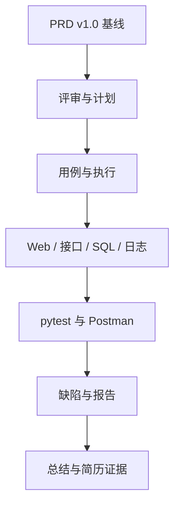

# 第 19 章：MiniShop 完整测试项目

> 重要级别：⭐⭐⭐ 必须掌握  
> 核心章节发布目标：≥95/100  
> 主案例：MiniShop 个人软件测试实践项目

## 这一章解决什么问题

前面各章分别练习了需求、用例、缺陷、Web、HTTP、DevTools、Linux、SQL、接口、Postman、Python、pytest、分层和性能名词。还缺一次**把它们收成一套能跑、能指给人看的材料**。

本章的 MiniShop v1.0 放在仓库 `project/minishop/`：有前端、后端、SQLite、PRD、OpenAPI、Postman、pytest、日志、缺陷和报告。你要能启动它、按出口标准做完一轮测试，并写得出诚实的项目总结。

它只能作为**个人软件测试实践项目**。不得写成某公司电商系统、不得声称已测通支付和全部订单状态。v1.0 **第一次**把购物车库存规则与 `/api/` 路径写成项目基线。第 13～18 章教学服务仍用 `/login`、`/cart/items`、`/orders`，且教学购物车往往只让 `qty=1` 成功；那些是教学约定。第 4、5 章用验证码、优惠券、支付练设计技术，**不要**把它们写进本项目用例或简历。

## 学习目标

完成本章后，你应该能够：

- 启动 MiniShop v1.0 并指出各目录是做什么的；
- 阅读 PRD v1.0，说明范围、非范围和已确认规则；
- 对照评审记录，解释为什么订单状态机被裁掉；
- 按测试计划执行 P0/P1 检查（课程优先级约定）；
- 用页面、接口、SQL、日志交叉核对购物车库存规则；
- 导入或对照 Postman 集合，跑 pytest 并解释 1 条 xfail；
- 阅读 BUG-001，不把开放缺陷写成已修复；
- 写出项目总结和可放进简历的诚实表述。

## 前置知识

- 已完成第 1～18 章中与本项目相关的技能；
- 会使用终端、浏览器、pytest 虚拟环境；
- 不要求独立开发一套电商平台；实现已经在仓库里，你的主业是测试它。

## 场景导入：面试官说“做个项目给我看”

如果只有各章练习碎片，你很难回答：需求在哪、测了什么、缺陷在哪、自动化怎么跑、哪些没做。

本章要求你指着仓库说：

1. PRD 写了什么、故意没写什么；
2. 怎么启动；
3. pytest 22 passed、1 xfailed 是什么意思；
4. BUG-001 为什么还开着；
5. 为什么简历里不能写订单状态和公司名称。



只在本机或自己的授权环境运行。教学密码 `Test1234` 不得用于真实系统。

---

## 19.1 项目声明与目录 ⭐⭐⭐

根目录：`project/minishop/`。

| 路径 | 作用 |
| --- | --- |
| `server.py` | 后端 + 静态前端 |
| `frontend/` | 登录、购物车、下单、后台页 |
| `data/` | SQLite（默认启动重建） |
| `docs/` | PRD、OpenAPI、计划、用例、报告 |
| `postman/` | Collection v2.1 与环境（密码留空） |
| `tests/` | pytest |
| `automation/` | 指向 tests |
| `logs/` | 应用日志 |
| `bugs/` | 缺陷 |
| `README.md` | 启动说明 |

启动：

```bash
cd project/minishop
python3 server.py
```

审查输出：

```text
MINISHOP_BASE_URL=http://127.0.0.1:8765
```

浏览器打开该 URL。`MINISHOP_RESET=1`（默认）每次启动重建教学库，避免脏数据冒充回归失败。

---

## 19.2 PRD v1.0：本章基线 ⭐⭐⭐

完整文本：`docs/PRD.md`。测试必须跟这份走，而不是跟第 13 章教学服务的“只让 qty=1 成功”。

已确认（摘要）：

- 手机号 11 位数字、以 1 开头，按字符串存；
- 密码 8～16 位，字母+数字；
- 购物车数量为正整数，且 ≤ 当前库存；**等于库存允许**（鼠标 10 件时 qty=10 通过、11 拒绝）；
- 登录返回 JSON `token` 与 HttpOnly Cookie；后续 API 用 Bearer；二者可同时存在；
- 创建订单 201 + `id`，**没有** `status` 字段；两次 POST 两个 id；
- 非管理员不能访问 `/api/admin/*`；不能读他人订单；
- 空搜索不应展示全量商品（实现未满足 → BUG-001）。

非范围：支付、物流、优惠券、订单状态机、生产 HTTPS。

第 5 章的 `Test1234`、第 12 章的 SKU 与库存数字，在 v1.0 种子数据中落地。它们现在是**本项目**数据，不再只是各章局部教学表。

---

## 19.3 需求评审 ⭐⭐⭐

记录：`docs/requirement-review.md`。

把“待支付有哪些状态”裁进非范围，是为了避免无实现的状态名进入用例和简历。空搜索写成已确认规则，是为了后面能把实现差异记成缺陷，而不是含糊过去。

---

## 19.4 测试计划、风险、测试点、用例 ⭐⭐⭐

- 计划：`docs/test-plan.md`（范围、策略、入口/出口、风险）
- 测试点：`docs/test-points.md`
- 用例摘要：`docs/test-cases.md`

出口标准包括：P0 无未关闭缺陷；自动化 22 passed + 1 xfailed；不编造订单状态。

P0/P1/P2/P3 仍是课程约定。缺陷的严重程度不要和用例优先级混用（第 6 章）。

---

## 19.5 Web 功能与后台 ⭐⭐⭐

审查对本机服务：

- `GET /` → 200，页面含登录表单、`label`、`type="password"`、提交按钮；
- `GET /admin.html` → 200。

手工冒烟（你需要自己点）：正确密码进入商品区；错误密码见“登录失败”；管理员 13800138099 登录后打开后台看库存。不要对未授权公网做同样操作。

后台 v1.0 只读库存和订单 **id**，列表里不会出现状态名。普通用户调 `/api/admin/products` 为 403。

---

## 19.6 DevTools、Linux、SQL ⭐⭐⭐

DevTools：登录时看 `POST /api/login` 的状态码、`Set-Cookie`、JSON `token`。Copy as cURL 后删掉 Cookie、token、密码再保存。

Linux：日志在 `logs/app.log`。审查抓到：

```text
login ok user=13800138000
inventory reject sku=SKU-DEMO-001 stock=10 qty=11
```

在授权测试机上仍可用第 11 章的 `grep` / `tail` 定位，不要用本机 macOS 的 `free` 写内存缺陷。

SQL：`docs/sql-check.md`。种子库 JOIN 审查结果：

| phone | sku | qty | stock |
| --- | --- | --- | --- |
| 13800138000 | SKU-DEMO-001 | 1 | 10 |
| 13800138000 | SKU-DEMO-002 | 2 | 5 |

超库存被接口拒绝后，不应靠 SQL 看到这次写下的 11。只在本机教学库查询或改数。

---

## 19.7 接口、OpenAPI、Postman ⭐⭐⭐

契约：`docs/openapi.json`（OpenAPI 3.0.3）。前缀 `/api/`。

审查 curl（密码未写入仓库命令历史说明里）：

- 正确登录 200 + `Set-Cookie` + `token`；
- `qty=11` → 400 `qty exceeds stock`；
- 空白 `keyword` → 200 且三件商品都在（BUG-001 证据）。

Postman 集合：`postman/MiniShop.postman_collection.json`（Collection v2.1，7 个请求，含 qty=1 / qty=10 / qty=11）。环境文件里 **password 与 token 初始值为空**，只在本机当前值填写。审查未点击 Postman GUI。

创建订单只断言 `id`，集合注释写明非正式生产契约。

---

## 19.8 pytest 自动化 ⭐⭐⭐

```bash
cd project/minishop
python3 -m pytest -q
```

审查（pytest 9.1.1 / requests 2.34.2）：

```text
22 passed, 1 xfailed
```

xfail：`test_empty_keyword_should_not_return_all`，原因 BUG-001，`strict=True`（若有人“修了却不改用例”，会变成失败，避免静默丢失）。

覆盖：登录成败、商品列表、购物车 qty=1/10/11 与四态、未认证、下单 id、两次下单不同 id、越权 403、管理员 200、数量纯函数。

Token 来自 fixture。不要 autouse 到 401 用例上（第 16 章）。

pytest 绿不等于页面按钮可用，也不等于性能达标。

---

## 19.9 缺陷、回归、报告 ⭐⭐⭐

`bugs/BUG-001.md`：空或空白关键字仍返回全量三件商品，与 R-SEARCH 不符。证据来自 curl 与 xfail，不是编造。

回归：修复库存规则后应重测 qty=10/11，并回归登录、下单、权限。当前无需为 BUG-001 假装关闭。

报告：`docs/test-report.md`。结论与自动化数字必须和仓库里的 pytest 输出一致。

---

## 19.10 项目总结与简历证据 ⭐⭐⭐

`docs/project-summary.md`、`docs/resume-evidence.md`。

可以写：个人项目、PRD、库存边界、pytest、一条开放缺陷。

不可以写：公司名称、已测通全部订单状态、生产压测、把教学密码当客户数据。

---

## MiniShop 工作实战：完整项目包 ⭐⭐⭐

主交付就是 `project/minishop/`。你还要在练习目录保存一份执行记录：

```text
exercises/chapter-19-minishop-run.md
```

必做：

1. 本机启动并打开首页；
2. 跑通 pytest，记录 passed/xfailed；
3. 亲手复现 BUG-001（空搜索）；
4. 用 SQL 或说明种子 JOIN 的两行结果；
5. 用自己的话改写一段诚实的项目介绍（不超过 5 句）。

```markdown
# MiniShop v1.0 执行记录

## 环境
- Python / pytest：
- BASE_URL：
- 日期：

## 运行
- 启动命令：
- pytest 输出：

## 缺陷
- BUG-001 是否复现：

## 声明
- 个人实践项目；无企业经历冒充；无订单状态臆造。
```

完成标准：能启动；pytest 数字与报告一致；BUG-001 仍开放；介绍里不出现公司名和状态机。

---

## 常见错误

### 错误 1：把 v1.0 写成公司项目

修正：全程标注个人实践。

### 错误 2：用第 13 章教学服务的 qty=1 唯一成功来测 v1.0

修正：v1.0 允许 qty=10。期望跟当前 PRD。

### 错误 3：在订单用例里填写待支付/已发货

修正：v1.0 没有这些字段。

### 错误 4：把 22 passed 说成没有缺陷

修正：还有 xfail/BUG-001。通过 ≠ 无缺陷。

### 错误 5：Postman 环境提交真实密码

修正：仓库里密码留空。

### 错误 6：对公网或生产跑本项目脚本

修正：只对本机授权实例。

### 错误 7：Cookie、Token 写成必须三选一

修正：v1.0 同时下发，后续 API 用 Bearer。

### 错误 8：把 pytest 当性能测试

修正：第 18 章。本项目未加压。

### 错误 9：修复 BUG-001 却不改 PRD/用例/xfail

修正：实现、契约、测试一起改。

### 错误 10：SQL 在未授权库验证库存

修正：只用本机 SQLite 教学库。

---

## 面试角度 ⭐⭐⭐

回答顺序：结论 → 原理 → 场景 → 示例 → 边界。

### 你这个项目做了什么？

结论：个人项目 MiniShop v1.0，测登录、购物车库存、下单和权限，带 pytest 与一笔开放缺陷。  
示例：qty=11 返回 400，日志有 inventory reject。  
边界：无支付、无订单状态机、不是公司系统。

### 为什么订单不测状态？

结论：PRD 把状态机裁出 v1.0，接口不返回 `status`。测不存在的字段会编造需求。  
边界：以后若基线增加状态，再补用例。

### 自动化全绿还有 Bug 吗？

结论：有。空搜索 xfail 对应 BUG-001。绿只覆盖已写断言。  
边界：页面体验、性能仍可能有问题。

### 购物车规则测了哪些输入？

结论：1、10、11、缺字段、null、空串、字符串、0。  
边界：等于库存在 v1.0 为合法，与早期教学服务不同。

### 怎样证明越权测过？

结论：用户 A 下单，用户 B 带自己的 token 访问该 id，得到 403 且无 A 的数据。  
边界：只使用教学账号。

---

## 小练习

### 练习 1

为什么必须在简历和报告里写“个人实践项目”？

### 练习 2

v1.0 中 `qty=10` 与第 16 章教学服务可能不一致。测试应以哪份文件为准？

### 练习 3

pytest 显示 22 passed, 1 xfailed。能否对面试官说“没有缺陷”？

### 练习 4

创建订单的响应里如果出现 `status`，应记成什么？

### 练习 5

空搜索返回三件商品，对应哪条 PRD？缺陷编号是什么？

### 练习 6

管理员接口 403 与未登录 401 各表示什么？不要只说“失败”。

### 练习 7

种子库 JOIN 查询 Tester A，应看到哪两行 SKU 与数量？

### 练习 8

Postman 环境为什么不要把 token 填进可分享的初始值？

### 练习 9

哪一句正确？

A. MiniShop 是某电商公司核心系统  
B. v1.0 已覆盖全部订单状态  
C. 接口自动化 ROI 永远最高，所以可以取消 Web 冒烟  
D. 本项目订单成功响应含 id、不含 status

### 练习 10

用不超过四句写一段可放进自我介绍的项目描述。须含个人项目、库存规则、自动化、已知缺陷。不要写公司名和订单状态名。

## 练习答案

1. 因为材料来自课程仓库和个人练习，冒充企业经历是诚信问题，也经不起深挖。
2. `project/minishop/docs/PRD.md`。教学服务不是 v1.0 契约。
3. 不能。xfail 跟踪着 BUG-001，且未覆盖的功能仍可能有缺陷。
4. 与 v1.0 契约不符：多了未基线字段。应开缺陷或先改 PRD，不能默认为合法状态机。
5. R-SEARCH；BUG-001。
6. 401 未通过认证；403 已认证但无权限。以实现/契约为准。
7. SKU-DEMO-001 qty 1 stock 10；SKU-DEMO-002 qty 2 stock 5。
8. 集合会复制凭证。只留本机当前值。
9. D。A 冒充企业；B 状态机未做；C 绝对化 ROI。
10. 示例：我做了个人项目 MiniShop v1.0，覆盖登录和购物车库存边界，并用 pytest 做接口回归；已知空搜索与需求不符。合理四句即可。

---

## 本章检查清单

- [ ] 我能启动 MiniShop 并打开首页
- [ ] 我读过 PRD 的范围与非范围
- [ ] 我知道 v1.0 允许 qty=10、拒绝 11
- [ ] 我能说明订单没有 status 字段
- [ ] 我会跑 pytest 并解释 xfail
- [ ] 我能复现 BUG-001
- [ ] 我会对照日志和 SQL
- [ ] 我不会把项目写成公司经历
- [ ] 我能完成执行记录

### 进入下一章的自测门槛

1. 练习 1～10 至少完成 9 题，且第 2、3、9、10 题能用自己的话回答；
2. 本机启动成功，pytest 为 22 passed / 1 xfailed（或记录你改动后的真实数字）；
3. 能当面指着 `bugs/BUG-001.md` 讲步骤；
4. 完成执行记录。

## 本章总结

本章需要真正掌握七件事：

1. 完整项目 = 可运行系统 + 文档 + 证据，不是一堆截图；
2. PRD v1.0 是本章基线，教学服务不再冒充契约；
3. 范围裁剪（无状态机、无支付）必须反映到用例和简历；
4. 功能、接口、SQL、日志要能对上同一条库存规则；
5. pytest 22 passed 仍带着 BUG-001；
6. 开放缺陷要保留证据，不要改口说已修；
7. 个人项目可以展示能力，不可以冒充企业经历。

## 本章可运行性说明

审查在 Python 3.14.3 启动 `project/minishop/server.py`：`GET /` 与 `/admin.html` 为 200；登录 200 且 `Set-Cookie`；`qty=11` 为 400；空白搜索返回三件商品。种子库 JOIN 得到 Tester A 的两行购物车。pytest：22 passed，1 xfailed。OpenAPI 3.0.3 与 Postman Collection v2.1 JSON 可解析。未点击 Postman GUI，未做浏览器逐项点击以外的无头 UI 套件，未加压。

教学密码仅用于本机。日志样本不含完整 token。

## 参考资料

- 本仓库 `project/minishop/`
- 本仓库 [第 4 章](04-requirements-analysis-and-static-testing.md)～[第 18 章](18-performance-testing.md)
- OpenAPI 3.0.3、Postman Collection v2.1、pytest 9.x
- 本仓库 [全局内容质量标准](../standards/QUALITY_STANDARD_v1.0.md)

## 下一章预告

下一章进入第 20 章《软件测试面试》。回答仍按“结论 → 原理 → 场景 → 示例 → 边界”。项目深挖时，用本章仓库里的 PRD、pytest 和 BUG-001 当证据，而不是临场编造。
