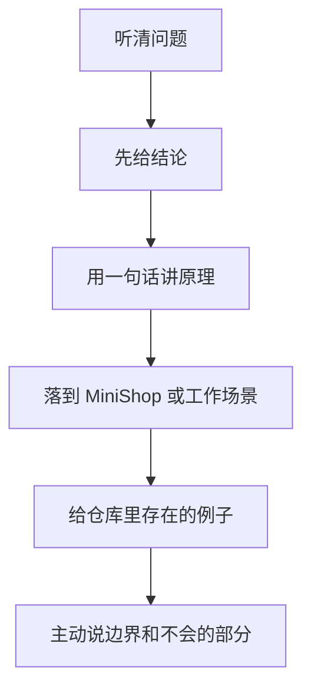
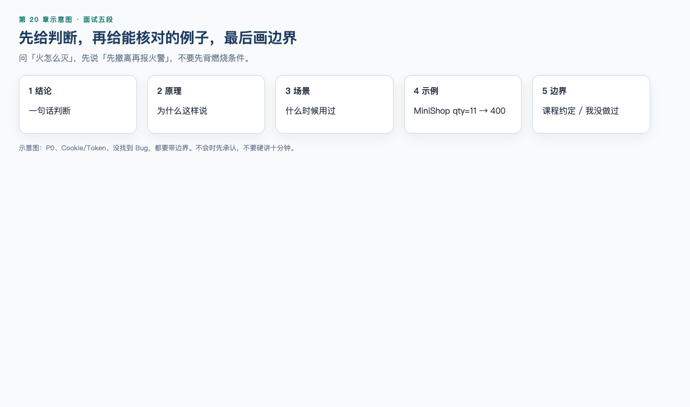

# 第 20 章：软件测试面试

> **一句话核心：** 面试是在讲你做过的观察、判定和证据，不是背名词。

> 重要级别：⭐⭐⭐ 必须掌握  
> 主案例：MiniShop 个人软件测试实践项目

## 这一章解决什么问题

第 19 章已经有一套能跑的 MiniShop v1.0 和 pytest、BUG-001、PRD。面试官不会先打开你的仓库，他们会问：你是谁、项目做了什么、理论会不会、碰到争议怎么办。

答不好通常不是“不会测”，而是：**没有先给结论、举例对不上仓库、把课程约定说成全球标准、把个人项目说成公司系统。**

本章把高频问题收成可说出口的答案。统一结构是课程要求的：

**结论 → 原理 → 场景 → 示例 → 边界。**

示例必须能指向 `project/minishop/` 里已有的证据。不要临场编造订单状态、生产压测或企业职级。不会的题目先说不会，再说你打算怎么查。

## 学习目标

完成本章后，你应该能够：

- 用五段结构回答，而不是先背定义后找不到重点；
- 在约一分钟内做自我介绍，并在约两分钟内介绍 MiniShop；
- 回答测试理论、需求分析、用例与方法、缺陷的常见追问；
- 回答 Web、HTTP、接口、SQL、Linux、Python、pytest 的常见追问；
- 在项目深挖时引用 PRD、qty=10/11、BUG-001、37 passed / 1 xfailed；
- 处理行为面试（争议、漏测、不会的题），不夸大、不攻击同事；
- 识别一套“听起来很满、其实会翻车”的答法。

## 前置知识

- 已完成第 19 章，能启动 MiniShop 并讲清范围与非范围；
- 已完成第 1～18 章中对应知识点；本章是面试表达，不新造技术规则；
- 不要求有企业实习。没有实习就用个人项目，不要编公司。

## 场景导入：先报公司，再被问订单状态

面试官：“介绍一下你的项目。”  
错误开头：“我在某电商公司负责 MiniShop 全链路，把订单从待支付测到已完成……”  
接着被问状态机、支付渠道、QPS 指标——仓库里都没有。

应改成：

1. 结论：这是个人实践项目 MiniShop v1.0；
2. 原理：用来把需求、用例、接口和缺陷收成可展示证据；
3. 场景：购物车数量与库存；
4. 示例：qty=11 返回 400，pytest 37 passed、1 xfailed（空搜索 BUG-001）；
5. 边界：无支付、无订单状态字段，不是公司系统。



---

## 20.1 为什么必须用这五段 ⭐⭐⭐




生活类比：问“火怎么灭”，先说“先撤离再报火警”，不要先背燃烧条件。

面试官时间短，先听你的判断。原理证明你不是背的。场景证明你用过。例子必须可核对。边界避免把课程约定说成宇宙真理。

错误例子：把七大原则从第一条背到第七条，不问这题要哪一条。  
边界例子：P0 先声明“这是我们课程的优先级约定”。

不会时：结论先说“这个我没在项目里做过”；原理说“我知道该查哪类资料”；场景说“如果入职后遇到”；示例说“我会先看项目文档”；边界说“现在不能装会”。

---

## 20.2 自我介绍 ⭐⭐⭐

约 45～90 秒。结构仍是五段，压缩成口语。

结论：我是转/应届初级测试，能独立完成功能、接口和 SQL 核对，用个人项目 MiniShop 练过一轮完整测试。  
原理：测试是获取质量信息、降低风险，不是只点页面。  
场景：从需求评审到 pytest 回归。  
示例：库存不得超卖；空搜索记了 BUG-001。  
边界：没有企业项目就如实说；不讲支付和状态机。

口播示例（请改成你的真实背景，不要抄学历和年限）：

> 我是零基础学测试的候选人。我会按需求写用例、提缺陷，能用 DevTools、SQL 和接口做核对。个人项目 MiniShop v1.0 覆盖登录、购物车库存和创建订单，pytest 有 37 通过、1 条预期失败对应空搜索缺陷。我没有公司实习，项目是自己的练习仓库，不是某电商的核心系统。希望做功能测试，并在团队里继续补接口自动化。

不要：编年限、编带人、背一长串工具名却举不出一条用例。

---

## 20.3 项目介绍 ⭐⭐⭐

约两分钟。问“你的项目”时用这个，而不是把自我介绍再念一遍。

结论：MiniShop v1.0 是个人测试实践，有可运行前后端和测试文档。  
原理：先定范围再测，证据要能在仓库找到。  
场景：购物车数量必须是正整数且不超过当前库存。  
示例：PRD 允许 qty=10、拒绝 11；创建订单只返回 id；用户 B 读用户 A 的订单 403；空搜索与需求不符（BUG-001）。  
边界：第 13 章教学服务不是本项目契约；无生产压测。

被追问“你开发的还是测试的”：结论是测试为主，仓库里的实现是为了让测试可运行；不冒充全栈开发岗。

被追问数据：种子账号 `13800138000`，SKU-DEMO-001 库存 10。不要把教学密码在面试里反复大声报给全场；说“教学弱口令，仅本地”即可。

---

## 20.4 测试理论 ⭐⭐⭐

### 软件测试是什么？

结论：通过静态和动态活动，提供关于质量和风险的信息，帮助团队做发布判断。  
原理：人会犯错，组合会爆炸，测试关注点与实现不同。  
场景：MiniShop 不能只看首页能打开。  
示例：qty=11 要看接口、页面和库是否一致。  
边界：没找到缺陷不等于没有缺陷。

### Testing、QC、QA？

结论：Testing 是获取信息的活动；QC 关注产品是否达标；QA 关注过程如何保障质量。  
原理：测试常是 QC 的手段，QA 不是测试的另一个英文名。  
场景：招聘里的 QA Engineer 可能就是测试岗。  
示例：评审需求是测试活动，也可以服务 QA。  
边界：入职看团队分工，不看职称翻译。

### 举一条测试原则。

结论：先说原则的名字和你的理解，不要默写七条。常用：测试显示缺陷存在、穷尽测试不可能、测试尽早介入。  
原理：ISTQB 等材料里的原则是经验规律。  
场景：MiniShop pytest 为 37 passed、1 xfailed，xfail 对应仍开放的 BUG-001。  
示例：“没有发现 Bug 就说明没 Bug”是错的。  
边界：原则不是拒绝测某模块的借口。

### 测试要等开发全部完成才能开始吗？

结论：不必。需求和设计就可以评审。  
原理：缺陷越早发现往往越便宜。  
场景：第 4 章静态测试。  
示例：评审时发现空搜索规则不清，比上线后再改便宜。  
边界：动态执行仍需要可运行版本。

---

## 20.5 需求分析 ⭐⭐⭐

结论：把需求变成可测试的规则、风险和待确认项，不是把 PRD 抄进用例。  
原理：歧义、遗漏、矛盾会导致“测完了也不知道对不对”。  
场景：“用户可以改购物车数量”。  
示例：问最小值、是否可超过库存、库存以何时为准；v1.0 确认 1≤qty≤当前库存，等于库存允许。  
边界：没有确认的状态机不要写进用例。

追问“不可测试的需求”：结论是缺少可观察结果或条件。示例：“搜索要智能、体验好”没有口径。边界：可先要求改写成可验证语句。

---

## 20.6 测试方法与用例 ⭐⭐⭐

### 你怎么设计用例？

结论：先拆测试点，再用等价类、边界值、判定表、场景等，按风险取舍。  
原理：穷尽不可能，要用模型提高命中率。  
场景：购物车数量。  
示例：1、10、11、0、负数、空、null、字符串。  
边界：方法服务于对象，不要为用判定表而硬套。

### P0 是什么？

结论：在我们课程项目里，P0 是核心主路径或阻塞基本测试的用例优先级。  
原理：优先级用来排执行顺序，不是缺陷严重程度。  
场景：登录、合法改数量、创建订单。  
示例：`TC-LOGIN-001`、`TC-CART-002`（qty=10）、`TC-ORDER-001` 在 `docs/test-cases.md` 标为 P0。  
边界：**不是所有公司同一套数字**；也不是缺陷的 Severity。入职先问组织定义。

---

## 20.7 Bug ⭐⭐⭐

结论：缺陷报告要让别人能复现：环境、步骤、预期、实际、证据。  
原理：无法复现就无法修复和验证。  
场景：空搜索。  
示例：BUG-001，`GET /api/products?keyword=` 返回三件商品，PRD 不允许把全量当搜索结果。  
边界：严重程度 ≠ 用例 P0；状态名因工具而异，不要背死禅道/Jira 的某套。

“和开发吵起来怎么办”见 20.16。  
“没找到 Bug 是不是没价值”：  
结论：不是。测试提供信息；通过的用例也是信息。  
原理：测试只能证明缺陷存在，不能证明缺陷不存在。  
场景：P0 全绿但空搜索仍不符合 PRD。  
示例：MiniShop 自动化 37 passed、1 xfailed（BUG-001）。  
边界：没有发现 Bug ≠ 系统没有 Bug，也不等于产品对用户有价值。

---

## 20.8 Web ⭐⭐⭐

结论：Web 功能测的是页面上用户路径：表单、登录态、权限、提示，不只是“页面能打开”。  
原理：接口对了，按钮也可能没绑事件。  
场景：MiniShop 登录页。  
示例：label 与密码框、错误密码提示；普通用户调用 `/api/admin/*` 返回 403（`/admin.html` 页面本身可能仍是 200）。  
边界：兼容矩阵按用户和风险裁剪，不是测遍所有浏览器才叫测过。

Cookie、Session、Token：  
结论：不同层次，常同时出现，不是三种互相替代的登录产品。  
原理：Cookie 管保存和发送，Session 管服务端会话，Token 管凭证，Bearer 管出示方式。  
场景：登录成功后既有 Cookie 又有 JSON token。  
示例：v1.0 登录既 `Set-Cookie` 又返回 token，后续 API 用 `Authorization: Bearer`。  
边界：以文档为准；不要答“现在都用 Token”。

---

## 20.9 HTTP ⭐⭐⭐

结论：按方法语义、状态码、头和 Body 测，不按“GET 不安全、POST 安全”口诀。  
原理：HTTP 的 safe 指语义上不改资源，不是保密。保密看 TLS。  
场景：登录用 POST 是因为会改会话，且密码不应放 query。  
示例：MiniShop `POST /api/login`。  
边界：不要说 GET 比 POST 更安全所以登录必须 GET。

401 与 403：  
结论：常见约定是未认证 vs 已认证但无权限。  
原理：先识别“你是谁”，再判断“你能不能做这件事”。  
场景：无凭证改购物车；用户 B 读用户 A 的订单。  
示例：无 token 下单 401；用户 B 读 A 的订单 403。  
边界：项目可能混用，以契约为准，缺陷里两者都记。

---

## 20.10 接口 ⭐⭐⭐

结论：按契约发请求，核对状态码、JSON 和副作用。  
原理：缺字段、null、空串、错误类型不是同一条输入。  
场景：`POST /api/cart/items`。  
示例：qty 为 null、""、"1"、11 在 v1.0 均应失败（11 为超库存）。  
边界：REST 不是 JSON 的别名；接口绿不能取消页面测试；**接口自动化 ROI 不是永远最高**。

幂等：结论是多次相同请求的效果与一次相同。示例：v1.0 两次 `POST /api/orders` 两个 id，符合创建默认不幂等。边界：若以后需求要求幂等，期望要改。

---

## 20.11 SQL ⭐⭐⭐

结论：用查询证明页面/接口与库是否一致。  
原理：显示 11 不等于库里是 11。  
场景：授权教学库。  
示例：JOIN 用户-购物车-商品，Tester A 为鼠标 qty 1 stock 10、键盘 qty 2 stock 5。  
边界：只在授权库改数；先 SELECT；不用 `=` 判断 NULL。

---

## 20.12 Linux ⭐⭐⭐

结论：初级要能在授权测试机上看日志、磁盘、进程，用脱敏 curl 复现。  
原理：500 的证据常常在服务端。  
场景：qty=11 被拒。  
示例：日志 `inventory reject sku=SKU-DEMO-001 stock=10 qty=11`。  
边界：`free -h` 是 Linux 命令；macOS 失败不能写成产品内存缺陷。不对未授权机器扫描。

---

## 20.13 Python ⭐⭐⭐

结论：测试用 Python 处理数据和写小脚本，不是转开发。  
原理：JSON 的 null 对应 None；缺键和 null 要用 `in` 区分。  
场景：解析登录 Body 取 token。  
示例：第 15 章 `extract_token`；不要 `eval` 解析 JSON。  
边界：`if qty:` 会把 0 当成没有数量。

---

## 20.14 pytest ⭐⭐⭐

结论：用测试函数和 assert 做可重复检查；fixture 准备 token，parametrize 展开输入。  
原理：收集 `test_`；断言失败会改写左右值。  
场景：MiniShop `tests/`。  
示例：37 passed，1 xfailed 跟踪 BUG-001。  
边界：autouse token 会毁掉 401 用例；pytest 绿不是性能结论。

---

## 20.15 项目深挖 ⭐⭐⭐

面试官会沿着你的介绍往下挖。只回答仓库里有的东西。

| 追问 | 结论要点 | 证据 |
| --- | --- | --- |
| 测了哪些接口？ | `/api/login`、products、cart、orders、admin | OpenAPI、pytest |
| 库存规则？ | 正整数且 ≤ 当前库存，等于允许 | PRD R-CART-10 |
| 有什么 Bug？ | 空搜索返回全量 | BUG-001 |
| 自动化多少条？ | 以你最近一次 pytest 为准 | 审查为 37 passed / 1 xfailed |
| 订单状态？ | v1.0 不定义，响应无 status | PRD 非范围 |
| 你做过性能吗？ | 只学了指标和纪律，项目未加压 | 第 18 章、测试报告 |
| 你写过后端吗？ | 仓库有教学实现，我的交付是测试材料 | 不要冒充开发岗 |

被问到支付、优惠券、APP、微服务治理：结论是“v1.0 没有，我没有做过”，再补“如果要测我会先要契约和数据”。不要编。

---

## 20.16 行为面试 ⭐⭐⭐

行为题仍用五段，场景换成你真实做过的事。没有企业经历，就用 MiniShop、课程练习、小组作业。不要借别人的故事。

### 和开发对缺陷有分歧？

结论：先对数据和复现，不对人。  
原理：争议缺陷要回到需求、日志和库。  
场景：空搜索算不算缺陷。  
示例：我拿出 PRD R-SEARCH 和实际三件商品的响应，标成开放缺陷而不是口头吵赢。  
边界：需求真改了就要改用例，不把过时 PRD 当武器。

### 漏过一个 Bug 怎么办？

结论：先承认，补复现和回归，再改检查单。  
原理：漏测是过程信息，不是人格否定。  
场景：若只测了 qty=11 忘了空搜索。  
示例：用 BUG-001 说明漏了会怎样。  
边界：不要把别人的线上事故说成自己的英雄故事。

### 不会的题？

结论：直接说不会或只了解到哪一步。  
原理：装会比不会更致命，深挖会穿。  
场景：被问 JMeter 分布式。  
示例：“我能解释负载和压力，没搭过分布式，不能说精通。”  
边界：说完不会，可以补“我打算看官方手册哪一节”，不要空白沉默到死。

### 为什么做测试 / 抗压 / 加班？

结论：对质量信息感兴趣、能接受细节工作；加班以事实和边界回答，不表演。  
原理：行为题看诚信和协作。  
场景：用你真实的学习节奏。  
示例：完成 MiniShop 文档比通宵背工具名更说明态度。  
边界：不攻击前公司或前同学；不承诺违法违规的加班或未授权测试。

---

## MiniShop 工作实战：面试口述稿 ⭐⭐⭐

保存：

```text
exercises/chapter-20-interview-script.md
```

必做：用自己的话写，不准整段抄本章口播。

1. 一分钟自我介绍；
2. 两分钟项目介绍；
3. 任选三道理论题按五段写提纲；
4. 一道行为题（争议或漏测）；
5. 列出三句你**不会**在面试说的话。

```markdown
# 面试口述稿

## 自我介绍

## 项目介绍

## 三道理论提纲
1.
2.
3.

## 行为题

## 禁止句
1.
2.
3.
```

完成标准：出现“个人项目”；出现库存规则或 BUG-001；出现一句边界；没有公司名、没有订单状态机、没有“ROI 永远最高”。

---

## 常见错误

### 错误 1：先背定义，一分钟后还没有结论

修正：第一句先回答问题。

### 错误 2：把 MiniShop 说成公司系统

修正：个人实践项目。证据在仓库。

### 错误 3：编订单状态、支付、QPS

修正：v1.0 没有。被问就说没有。

### 错误 4：P0 全球统一、GET 更安全、Cookie/Token 三选一、接口 ROI 永远最高、没 Bug 就是没 Bug、测试必须等开发全部完成

修正：这些是本课程质量标准禁止的绝对化说法。

### 错误 5：把 pytest 37 passed 说成没有缺陷

修正：还有 BUG-001。

### 错误 6：行为题用影视剧情节

修正：只用自己做过的事。

### 错误 7：不会也硬讲十分钟

修正：先说不会。

### 错误 8：把课程教学服务路径说成 MiniShop 正式契约

修正：以 `docs/PRD.md` 和 `/api/` 为准。

---

## 面试角度 ⭐⭐⭐

本章本身就是面试训练。再记三条元问题：

### 面试官最想听什么？

结论：判断、证据、边界，不是词表。  
示例：先说 qty=11 应拒绝，再提日志和 pytest。  
边界：工具名只能当配料。

### 没有实习怎么面？

结论：用个人项目和课程材料，诚实说明。  
示例：指得清 PRD、BUG-001、如何启动。  
边界：不要用“保密协议”挡一个不存在的公司项目。

### 被问倒了怎么收场？

结论：承认范围，给下一步，停止编造。  
示例：“性能我只做过指标学习，MiniShop 没有加压报告。”  
边界：收场后不要再补一段假数据。

---

## 小练习

### 练习 1

把“测试是什么”写成五段，每段一句话。

### 练习 2

自我介绍里为什么必须出现“个人项目”或等价声明？

### 练习 3

面试官问订单从下单到签收怎么测。按 v1.0 应怎样答？

### 练习 4

指出错误：`GET 没有 Body 所以比 POST 安全，登录我都用 GET。`

### 练习 5

P0 在课程里指什么？入职后为什么不能直接沿用？

### 练习 6

用 BUG-001 回答“你提过的一个缺陷”。须含预期和实际。

### 练习 7

pytest 37 passed、1 xfailed 在面试里应怎么解释？

### 练习 8

开发说空搜索返回全部是“方便用户”。你只重复“这是 Bug”够不够？还应拿出什么？

### 练习 9

哪一句适合说出口？

A. 我在某厂负责 MiniShop 支付全状态  
B. 接口自动化 ROI 永远最高  
C. MiniShop 是个人项目，订单成功只返回 id，空搜索仍有开放缺陷  
D. 没发现 Bug 说明质量已经过关

### 练习 10

写三句你不会在面试说的话，并各用五段结构里的“边界”解释一句为什么。

## 练习答案

1. 结论：提供质量与风险信息。原理：人会犯错且无法穷尽。场景：不能只看首页。示例：库存 11 要看接口和库。边界：没找到不等于没有。合理五句即可。
2. 避免被理解成企业项目；深挖时必须拿得出仓库。
3. 结论：v1.0 无状态机和物流。原理：测未基线字段是编造需求。场景：只有创建订单。示例：断言 id、无 status。边界：若以后加状态再补。
4. 把 HTTP safe 当成保密。登录会改会话，密码也不该放 query。
5. 课程里是核心主路径优先级。各公司数字和含义不同，入职先问定义。
6. 预期空/空白关键字不当全量结果；实际 200 且三件商品；编号 BUG-001。
7. 已写断言通过 37 条；1 条按 PRD 失败并标记 xfail，对应已知缺陷 BUG-001，不是“没有 Bug”，也不是“已经修了”。以本机 `evidence/pytest-output.txt` 为准。
8. 不够。应出示 R-SEARCH 和响应 Body，讨论是改需求还是改实现，并维持缺陷开放直到其中一方基线化。
9. C。
10. 示例禁止句：某公司核心系统；已测通全部订单状态；ROI 永远最高。边界分别是诚信、范围、绝对化。合理三句即可。

---

## 本章检查清单

- [ ] 我能不看稿说出五段结构
- [ ] 我有一分钟自我介绍，含个人项目
- [ ] 我有两分钟 MiniShop 介绍，含库存规则和边界
- [ ] 我能答理论、需求、用例、缺陷而不背整章
- [ ] 我能答 Web/HTTP/接口/SQL/Linux/Python/pytest 各至少一题
- [ ] 我能用 BUG-001 和 pytest 数字做深挖
- [ ] 我不会编公司、状态机、压测
- [ ] 我能对不会的题先说不会
- [ ] 我完成了口述稿

### 进入下一章的自测门槛

1. 练习 1～10 至少完成 9 题，且第 3、6、7、9 题能口头回答；
2. 对镜子或录音把自我介绍和项目介绍各说一遍，计时；
3. 列出三句禁止句；
4. 完成口述稿。

## 本章总结

本章需要真正掌握七件事：

1. 先结论，再原理、场景、例子、边界；
2. 自我介绍短，项目介绍有证据；
3. 理论题选一条讲透，不默写清单；
4. 方法、缺陷、协议题都要带适用条件；
5. MiniShop 深挖只说仓库里有的东西；
6. 行为题用自己的事实；
7. 不会就说不会，比编造更像初级测试。

## 本章可运行性说明

本章以口述结构为主，无新的 Python/SQL 脚本。项目数字引用第 19 章已验证结果：pytest 37 passed / 1 xfailed，BUG-001，种子 JOIN 两行，订单无 status。未模拟真实面试官。请用你本机最近一次 pytest 输出替换口述中的条数。

## 参考资料

- ISTQB CTFL：测试原则、测试过程（回答理论题时用理解而非逐字背诵）
- 本仓库 [第 19 章：MiniShop 完整测试项目](19-minishop-project.md)
- 本仓库 `project/minishop/docs/` 与 `bugs/BUG-001.md`
- 本仓库 [全局内容质量标准](../standards/QUALITY_STANDARD_v1.0.md)

## 下一章预告

下一章进入第 21 章《软件测试求职》。你将把口述收成简历上的技能清单和项目描述，处理投递、复盘和薪资沟通，并继续守住真实性：MiniShop 只能写个人实践。
