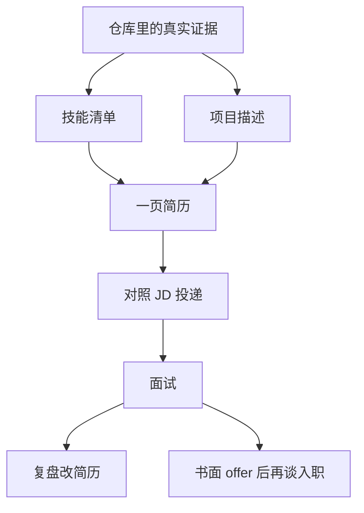

# 第 21 章：软件测试求职

> 重要级别：⭐⭐⭐ 必须掌握  
> 主案例：MiniShop 个人软件测试实践项目

## 这一章解决什么问题

第 19 章有可运行的 MiniShop，第 20 章有口述结构。求职还要把这些收成**一页能投出去的简历**，并处理投递、复盘和薪资沟通。

这一步最容易出的不是“字不够多”，而是：**把个人项目写成公司经历、把了解写成精通、把 MiniShop 写成已测通支付和全部订单状态。** 这些会在面试深挖时直接穿帮，也违反本课程的真实性原则。

本章教简历结构、技能清单、项目描述、投递、复盘和谈薪的纪律。不给无法核验的“行业平均工资表”，不教伪造实习。

## 学习目标

完成本章后，你应该能够：

- 按真实性原则决定每一句话能不能写；
- 组织一页初级测试简历：信息、技能、项目、教育/培训；
- 把技能分成会做 / 用过 / 了解，并与课程梯队对齐；
- 写出可核对的 MiniShop 项目描述；
- 对照职位描述投递，而不是无差别群发；
- 用面试复盘表改下一轮；
- 用区间和研究谈薪，不把口头承诺当成 offer。

## 前置知识

- 已完成第 19、20 章；
- 能用自己的话介绍 MiniShop 的范围、BUG-001 和 pytest 结果；
- 不要求已有企业实习。

## 场景导入：技能栏写满，项目栏经不起问

一封简历写着：精通 Python / pytest / Selenium / JMeter / CI/CD，项目是“某电商 MiniShop，负责订单全状态与性能保障”。

面试官只要问：空搜索怎么测的？订单 `status` 字段在哪？JMeter 脚本在哪？仓库里对不上。

应改成：技能写你能演示的；项目写个人实践；数字用来自 `project/minishop/` 的 pytest 和 BUG-001。



---

## 21.1 简历真实性原则 ⭐⭐⭐

生活类比：菜单上没有的菜，被点到就要现做。简历上没有证据的句子，被问到就要当场编。

原则：

1. **没做过的不写。** 没有实习就写个人项目或课程项目，不造公司名。
2. **做过但裁掉范围的不夸大。** MiniShop v1.0 无支付、无订单状态机、未加压。
3. **工具分档。** 能独立完成的写“能使用/熟悉”；跟过教程的写“了解”；不要对第三梯队写“精通”。
4. **数字可复核。** pytest 条数以你本机最近一次为准；审查记录是 22 passed / 1 xfailed。
5. **公开仓库与简历一致。** 若投递时附 GitHub，里面必须找得到 PRD、测试和 BUG-001。

禁止句（与第 19、20 章一致）：

- 某某科技 / 电商部门核心系统；
- 已测通全部订单状态、已完成生产压测；
- 精通 JMeter、独立负责公司 CI。

真实性优先于“好看”。被识破的包装比空白实习更伤。

---

## 21.2 简历结构 ⭐⭐⭐

初级测试简历建议 **一页**。招聘方先扫技能和项目，不先读小作文。

建议顺序：

| 块 | 写什么 | 不写什么 |
| --- | --- | --- |
| 标题与联系方式 | 姓名、电话、邮箱、城市；可选 GitHub | 身份证号、教学弱口令、无关生活照要求以外的信息 |
| 求职意向 | 初级测试 / 功能测试工程师 | 同时投测开、性能专家却无证据 |
| 技能 | 分会做 / 了解 | 一排 Logo |
| 项目 | MiniShop 及你真实参与过的项目 | 把课程练习每章都列成“负责模块” |
| 教育/培训 | 学历、本课程或可核验培训 | 把看过的视频课写成认证工程师 |
| 可选 | 可公开的博客、证书编号 | 无法验证的“内部奖” |

日期用年-月。在职状态如实。期望薪资可写“面议”，细节放沟通环节。

版式：黑白、可复制文本、避免整页图片。文件名用 `姓名-初级测试-城市.pdf`。

---

## 21.3 技能清单 ⭐⭐⭐

对照课程梯队，只写你能讲步骤的项。

**建议写成“能使用”（第一梯队）**

需求分析与评审、测试用例（含等价类/边界）、Web 功能测试、缺陷报告、HTTP 与 DevTools、SQL 核对、Linux 看日志、接口测试、Postman、MiniShop 实践。

**建议写成“能使用”（第二梯队，若你已跑通第 16、19 章）**

Python 处理 JSON、pytest + requests 接口自动化。

**建议写成“了解”（第三梯队）**

测试分层与金字塔、Playwright/Selenium 差别、pytest-html、CI 在做什么、性能测试指标与授权纪律、JMeter 元件名称。

不要把“了解”和“能独立负责”混在一行。Java/Appium/微服务治理，没练过就留空。

P0/P1 不要写成“精通业界优先级标准”。Cookie/Session/Token 不要写成“三种登录技术精通”。

---

## 21.4 MiniShop 项目描述 ⭐⭐⭐

放在“个人项目”，不要放进“工作经历”。

结论先行的四行结构：

1. 这是什么：个人软件测试实践，本机可运行的迷你电商。
2. 你做了什么：PRD 评审、用例、功能与接口测试、SQL、pytest、缺陷与报告。
3. 关键规则：购物车数量为正整数且不超过当前库存；等于库存允许。
4. 结果与边界：自动化 22 passed / 1 xfailed（空搜索 BUG-001）；无支付与订单状态字段。

可直接改写的示例（数字请换成你本机结果）：

> MiniShop v1.0（个人项目）  
> 完成需求评审、测试计划、用例和缺陷记录；对登录、购物车库存边界、创建订单和权限做接口自动化（pytest + requests）。  
> 规则：数量 1～当前库存；`SKU-DEMO-001` 库存 10 时 qty=10 通过、qty=11 拒绝。订单成功响应含 id、不含 status。  
> 结果：22 passed，1 xfailed 对应 BUG-001（空/空白关键字仍返回全量商品）。不含支付、状态机和生产压测。

工作经历里若另有真实实习，分开写，不要把 MiniShop 塞进那家公司的职责。

---

## 21.5 投递 ⭐⭐⭐

投之前用职位描述（JD）做三列：要求、我是否真会、简历里哪一行对应。对不上的要求，不要为了过筛而加假技能。

匹配策略：

- 功能测试 / 初级测试：主投。第一梯队对得上即可。
- 接口测试（作为能力而非独立岗位）：有 pytest 和 SQL 再投。
- 自动化 / 测开 / 性能：第三梯队只写了解时，谨慎投“独立负责框架”的 JD。

投递纪律：

- 每天数量以你能复盘为准，而不是一天 80 封复制粘贴；
- 内推仍要真实简历；
- 不在未授权系统上“帮对方测一测”当作品；
- 邮件附件与网申文本一致。

城市、到岗时间、是否接受测试环境出差，按你的真实约束填。

---

## 21.6 面试复盘 ⭐⭐⭐

每场面试当天记下：

| 项 | 写什么 |
| --- | --- |
| 职位与日期 | 便于对照 JD |
| 问到而答糊的题 | 原话尽量记 |
| 用了哪条证据 | PRD / BUG-001 / pytest / 日志 |
| 编过或差点编的 | 立刻从简历删掉隐患句 |
| 下一次改动 | 技能分档、项目四行、口述计时 |

复盘是为了改材料，不是为了给自己打“表现 80 分”。同一道库存题答不好，就回去把 qty=10/11 再跑一遍，而不是再投 20 家。

被拒后若对方给原因，只吸收与证据有关的部分。不要把一次失败解释成“测试行业不需要诚实”。

---

## 21.7 薪资沟通 ⭐⭐

结论：先做当地同类 JD 的区间功课，再给**可接受区间**，并以**书面 offer** 为准。

原理：口头数字不等于合同；初级岗位还要问五险一金、试用期薪资、加班与试用考核（以内地常见用工沟通为背景，具体以当地法规和合同为准）。

场景：面试末尾或 HR 电话。  
示例：“我了解的当地初级测试区间是 X～Y，结合我目前是个人项目+课程、没有实习，我的期望是 A～B，希望看书面总包。”  
边界：本章不提供全国统一工资表。X/Y 必须你自己查当地招聘，不要抄同学或网文当事实。

沟通纪律：

- 不确定就说“希望先看职责和书面 offer 再确认”；
- 不要为了听起来好谈而承诺未授权的加班测试或隐瞒项目范围；
- 没有书面 offer 前，不辞职、不在朋友圈宣布入职；
- 合同里的岗位名称、试用期、社保以文本为准，不以聊天记录为准。

---

## MiniShop 工作实战：一页简历草稿 ⭐⭐⭐

保存：

```text
exercises/chapter-21-resume.md
```

必做：

1. 按 21.2 写出一页结构（可用 Markdown）；
2. 技能分三档，第三梯队不得出现“精通”；
3. MiniShop 四行描述，含个人项目、库存规则、自动化结果、非范围；
4. 列三句你从初稿里删掉的话；
5. 选一则真实 JD（可打码公司名），做“要求 / 是否会 / 简历对应行”三列，至少五行。

```markdown
# 简历草稿

## 意向与联系方式

## 技能
- 能使用：
- 了解：

## MiniShop（个人项目）

## 教育/培训

## 删掉的句子
1.
2.
3.

## JD 对照
| 要求 | 是否真会 | 简历对应 |
```

完成标准：无公司冒充、无订单状态机、无生产压测、无精通 JMeter/CI；MiniShop 数字可指向仓库。

---

## 常见错误

### 错误 1：工作经历里写 MiniShop

修正：放个人项目。

### 错误 2：技能栏堆 Selenium、JMeter、K8s

修正：按梯队和能否演示来写。

### 错误 3：项目结果写“全流程零缺陷上线”

修正：写 22 passed / 1 xfailed 和 BUG-001。通过不等于无缺陷。

### 错误 4：为匹配 JD 补上不会的“精通接口自动化”

修正：JD 对不上就不要硬投或不要硬写。

### 错误 5：同一天海投且不复盘

修正：先改答糊的题和简历句子。

### 错误 6：把口头薪资当 offer

修正：书面合同。

### 错误 7：简历写 P0 标准、GET 更安全、三种登录技术

修正：这些绝对化说法在面试会被追问，且与课程不符。

### 错误 8：公开仓库与简历数字不一致

修正：以本机最新 pytest 为准，同步口述和简历。

---

## 面试角度 ⭐⭐⭐

回答顺序：结论 → 原理 → 场景 → 示例 → 边界。

### 为什么简历上是个人项目？

结论：因为 MiniShop 是课程实践，不是雇主系统。  
原理：深挖要对仓库。  
场景：被问公司业务量。  
示例：我改口为个人项目，并讲 qty=11 和 BUG-001。  
边界：有真实实习会分开写。

### 你会哪些技能？

结论：按会做和了解分开说。  
示例：能使用用例、缺陷、SQL、Postman、pytest 接口；了解分层和性能指标。  
边界：不把了解说成负责过平台。

### 期望薪资多少？

结论：给基于当地调研的区间，并等书面 offer。  
边界：本章不报统一数字；不因谈薪而夸大项目。

---

## 小练习

### 练习 1

为什么真实性比把技能栏写满更优先？

### 练习 2

MiniShop 应放在简历的哪一块？为什么不能放进某公司工作经历？

### 练习 3

把“精通 pytest、JMeter、CI/CD”改成符合你真实能力的两档表述。

### 练习 4

写出 MiniShop 项目四行中“边界/非范围”那一行。不要出现订单状态名。

### 练习 5

JD 要求“三年电商订单状态机经验”。你只有 MiniShop v1.0。应投吗？简历怎么写？

### 练习 6

面试把空搜索答糊了。复盘表至少改哪两处材料？

### 练习 7

HR 电话里说了月薪数字，但没有邮件和合同。你能否据此辞职？

### 练习 8

技能清单里写“P0/P1 业界标准、GET 比 POST 安全、Cookie/Token/Session 三选一”有什么问题？

### 练习 9

哪一句可以印在简历上？

A. 某厂核心测试，覆盖 MiniShop 全部订单状态  
B. 个人项目 MiniShop v1.0：库存边界 + pytest，已知 BUG-001  
C. 精通 JMeter 分布式与生产压测  
D. 接口自动化 ROI 永远最高

### 练习 10

对照 21.1，检查你的草稿是否含：个人项目声明、可复核数字、非范围、无虚构公司。缺哪条就补哪条。

## 练习答案

1. 面试会按简历深挖；假技能和假雇主无法指向仓库，伤害大于空白。
2. 个人项目。它不是该公司职责，放进去等于伪造经历。
3. 示例：能使用 pytest+requests 做接口回归；了解 JMeter 元件和 CI 会跑测试。不得保留“精通 CI”。
4. 示例：不含支付、订单状态字段和生产压测。
5. 通常不硬投该条为核心要求的 JD。简历仍只写 v1.0 真实范围，不补状态机。
6. 项目描述补上 BUG-001；口述/自我介绍加空搜索一句。必要时重跑复现步骤。
7. 不能。以书面 offer 和合同为准。
8. 把课程明确反对的绝对化规则写成技能，深挖时会与第 8、9、5 章冲突。
9. B。
10. 四条自检；缺声明、缺数字、缺非范围或出现公司名，都要改。合理自检即可。

---

## 本章检查清单

- [ ] 我能说出五条真实性原则
- [ ] 我的简历是一页、可复制文本
- [ ] 技能分会做/了解，无虚假精通
- [ ] MiniShop 在个人项目栏，含库存规则和 BUG-001
- [ ] 我能对照 JD 决定投或不投
- [ ] 我有复盘表
- [ ] 我知道口头薪资不是 offer
- [ ] 公开材料与简历一致
- [ ] 我完成一页草稿

### 进入下一章的自测门槛

1. 练习 1～10 至少完成 9 题，且第 2、4、7、9 题能用自己的话回答；
2. 草稿通过 21.1 四条自检；
3. 项目描述不出现公司名和订单状态名；
4. 完成 `exercises/chapter-21-resume.md`。

## 本章总结

本章需要真正掌握七件事：

1. 真实性先于包装；
2. 一页结构：意向、技能、项目、教育；
3. 技能按会做/了解分档，对齐课程梯队；
4. MiniShop 写个人项目、规则、数字、非范围；
5. 投递对照 JD，不为过筛造假；
6. 每场面试复盘并改材料；
7. 薪资用当地调研区间，以书面合同为准。

## 本章可运行性说明

本章无新的业务代码。项目描述中的 22 passed / 1 xfailed、BUG-001、qty=10/11、订单无 status，引用第 19 章已验证结果。请用本机最新 pytest 替换数字。未投递真实职位，未提供工资表。

## 参考资料

- 本仓库 [第 19 章：MiniShop 完整测试项目](19-minishop-project.md)
- 本仓库 [第 20 章：软件测试面试](20-interview.md)
- 本仓库 `project/minishop/docs/resume-evidence.md`
- 本仓库 [全局内容质量标准](../standards/QUALITY_STANDARD_v1.0.md)

## 下一章预告

下一章进入第 22 章《学习路线总结》。你将看到完整路线、必须掌握与了解即可的分档、入职后学什么，以及官方资料入口。求职主线到此收束，不再展开新的大型基础章。
