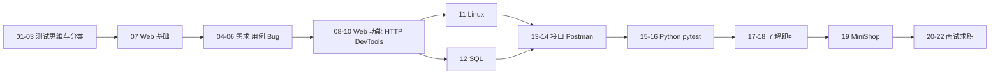
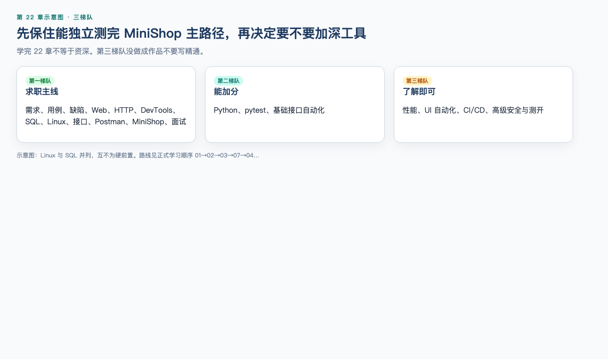

# 第 22 章：学习路线总结

> **一句话核心：** 先保住能独立测完 MiniShop 主路径的能力。

> 重要级别：⭐⭐⭐ 必须掌握  
> 主案例：MiniShop 个人软件测试实践项目

## 这一章解决什么问题

22 章已经从“测试是什么”走到“简历怎么写”。若没有一张总图，容易两头空：一边觉得什么都学过，一边面试时仍分不清**必须会、经常用、了解即可**。

本章把 v1.2 的完整路线、三梯队、入职后学习和官方资料收在一起。不增加新的大型基础章。MiniShop 仍然只是个人软件测试实践项目。

读完后，你应能判断自己是否达到“初级测试工程师入门”，以及下一份精力该放在岗位上还是补哪一块仓库证据。

## 学习目标

完成本章后，你应该能够：

- 按正式学习顺序说出整条路线，并知道 Linux 与 SQL 并列、互不为硬前置；
- 区分必须掌握、高频使用、了解即可，并知道它们不是大纲三梯队或星级的别名；
- 对照 MiniShop v1.0 说出已基线的规则和明确没做的范围；
- 列出入职后更常见的学习方向，而不把它们写进当前简历的“精通”；
- 找到理论、HTTP、工具的官方入口；
- 选择一条与自己背景匹配的后续发展方向。

## 前置知识

- 已完成第 1～21 章，或至少完成第一梯队并跑过 MiniShop；
- 不要求把第三梯队做成作品集。

## 场景导入：工具记了一串，主线却说不清

有人能列出 Postman、pytest、JMeter、Playwright，却答不出：购物车数量规则是什么、BUG-001 为什么还开着、为什么订单没有 status。

路线图的用处是：**先保住能独立测完 MiniShop 主路径的能力，再决定要不要加深自动化或性能。**



上图是**正式学习顺序**的压缩分组，不是第二张课表。完整编号：`01 → 02 → 03 → 07 → 04 → 05 → 06 → 08 → 09 → 10 → 11 → 12 → 13 → 14 → 15 → 16 → 17 → 18 → 19 → 20 → 21 → 22`。Linux 与 SQL 并列，互不为硬前置。第 17、18 章在阅读顺序里，但是了解即可，不要写成精通。

建议周期仍与大纲一致：全职约 8～12 周，兼职约 20～28 周。以你真正跑通仓库为准，不以日历自我安慰。阅读路径和实操分层见 [学习建议](../docs/LEARNING.md)；起步实操从 `python3 practice/run.py 1-1` 开始。

---

## 22.1 完整路线 ⭐⭐⭐

课程定位：零基础 → 初级软件测试工程师 → 能独立完成基础测试项目 → 面试与求职准备。

**正式学习顺序：**

01 → 02 → 03 → **07** → 04 → 05 → 06 → 08 → 09 → 10 → 11 → 12 → 13 → 14 → 15 → 16 → 17 → 18 → 19 → 20 → 21 → 22

第 7 章 Web 基础插在分类之后、需求分析之前，是为了读 PRD 时知道页面从哪来。写作顺序在部分章节与学习顺序不同，**学习请按上面这条**。

Linux（第 11 章）与 SQL（第 12 章）并列，不互相作为硬前置。

**能力链（求职主线，不是第二张阅读顺序）：**  
理解软件与测试 → 研发流程与测试生命周期 → 测试分类 → Web 基础 → 阅读需求并评审 → 拆功能、设计用例 → 提交和验证 Bug → Web 功能测试 → HTTP 与认证层次 → DevTools → Linux 日志与 SQL（并列，互不为硬前置）→ OpenAPI → Postman → Python 数据处理 → requests + pytest → MiniShop 项目 → 简历与面试。

第 17、18 章（分层/性能）属于了解即可，不画进这条能力主链；**正式学习顺序仍含 17、18**，见开篇图。Linux 与 SQL 并列。能力链上 HTTP（第 9 章）与 DevTools（第 10 章）都在 Linux/SQL（第 11、12 章）之前。

贯穿项目只有 MiniShop。仓库里曾经有过 `/login` + qty=1 的教学桩，**现行教材已删除**；你读到的第 13～16 章可运行示例就是 `/api/` 与 PRD（qty=10 允许、qty=11 拒绝）。**项目契约以 `project/minishop/docs/PRD.md` 为准。**

---

## 22.2 必须掌握 ⭐⭐⭐



本节不是另开一条课表。「必须掌握」也不是「只有第一梯队」。先把五套名字钉死：

| 名字 | 装什么 | 不要当成 |
| --- | --- | --- |
| 大纲三梯队（上图） | 第一=求职主线；第二=Python / pytest / 基础接口自动化；第三=性能、UI、CI、安全、测开 | 新的 23 章 |
| 必须掌握（本节表） | 第一梯队 + 第 16、19 章已经落地的最小 pytest + Git 协作（branch/PR，不是完整 Git 课） | 把第二梯队全部升级成精通 |
| 22.3 高频使用 | 入职后常见动作：改用例、提缺陷、页面+接口+SQL 核对 | 第二梯队 |
| 22.4 了解即可 | 第三梯队 | 现在就要做成作品 |
| 质量标准星级 | ⭐⭐⭐ 必须掌握、⭐⭐ 常用、⭐ 了解。星级管本章练多深；梯队管求职先学哪 | 把「高频」读成第二梯队，或把星级当成另一张课表 |

pytest 写在必须掌握里，只因为 MiniShop 回归已经用它；仍是第二梯队。卡在 fixture 的人在自检里写「不会」即可，不要为此去补 Playwright。达不到下表这些，不要自称“课程已经学完可以面高级自动化”。

| 能力 | 你应能做到 | 章节 |
| --- | --- | --- |
| 测试是什么 | 提供质量信息、没找到 Bug ≠ 没有 Bug、测试可早于编码 | 1～3 |
| 需求与用例 | 评审歧义；等价类/边界；P0～P3 是课程约定 | 4～5 |
| 缺陷与计划 | 可复现的报告；范围、出口、风险 | 6 |
| Web | 表单、登录态、权限；Cookie/Session/Token 不同层 | 7（在 4 前）；8（在 6 后） |
| HTTP / DevTools | 方法语义、状态码、TTFB；不把 GET/POST 说成保密 | 9～10 |
| Linux / SQL | 日志与磁盘；授权库 SELECT/JOIN；先 SELECT 再改 | 11～12 |
| Git 协作（branch / PR） | clone；开 branch；用 PR 写清测了什么。能看 log。不写精通 rebase，不要求独立建 CI | 2（2.9） |
| 接口 / Postman | 四态、401/403（401=无 Bearer **且** 无 Cookie）、幂等、`lastOrderId`。GUI Runner：`exercises/` 有自己的记录才写「会做」，否则写了解/用过作者集合 | 13～14 |
| Python / pytest（第二梯队，结课最小自动化） | JSON 与 None；fixture 与 parametrize；401 不要 autouse token | 15～16 |
| MiniShop | 能启动；注册不自动登录；qty=10 允许、11 拒绝；订单无 status；讲解 BUG-001 | 19 |
| 面试求职 | 五段回答；个人项目；书面 offer | 20～21 |

必须掌握的**纪律**（质量标准硬约束，全程有效）：

- 不把 GET 说成不安全、POST 说成安全；
- 不把 Cookie、Session、Token 当成三种互相替代的技术；
- 不把 P0/P1/P2/P3 说成所有公司统一；
- 不说测试必须等开发全部完成；
- 不说接口自动化 ROI 永远最高；
- MiniShop 不得伪造成企业经历。

---

## 22.3 高频使用（工作动作，不是第二梯队） ⭐⭐⭐

入职第一年更常碰到的，往往不是新框架，而是这些动作：

- 读这一版需求有没有变；
- 补或改一条用例；
- 按步骤提缺陷、做确认和回归；
- 在测试环境用页面 + 接口 + SQL 对同一条规则；
- 看 Network / 日志定位是前端、后端还是数据；
- 用 Postman 或 pytest 回归登录和主接口；
- 把结果写进日报或测试报告，而不是只发一张“全绿”截图。

MiniShop 里对应的高频证据：注册、登录、购物车库存、创建订单 id、越权 403、日志 `inventory reject`、JOIN 两行购物车。把这些练到不看稿能讲，比再学一个 UI 框架更值钱。

---

## 22.4 了解即可 ⭐⭐

大纲第三梯队：性能、UI 自动化、CI/CD、高级安全、高级测试开发。

你应能：

- 解释分层和金字塔是启发式，不是法定比例；
- 说明 Playwright 与 Selenium 的定位，不宣布谁已淘汰；
- 说明 CI 会自动跑测试，不等于你做过生产发布；
- 说明响应时间、P95、并发 ≠ TPS，且只在授权环境加压；
- 安全测试只在自有或明确授权环境。

不应：把了解写成精通，把第 17、18 章读完当成自动化/性能工程师。

v1.2 冻结后，不再为这些方向新开大型基础章；需要时在入职后按团队栈补。

---

## 22.5 入职后学习 ⭐⭐⭐

入职后再学，通常是因为**团队已经选好工具**，而不是因为课程漏了某一章。

常见增量：

| 方向 | 何时学 | 注意 |
| --- | --- | --- |
| 团队用例库与缺陷工作流 | 第一周 | 组织的 P0 定义优先于课程 |
| 真实测试环境与账号 | 立即 | 授权、脱敏、不要用教学弱口令 |
| 项目里的 pytest/Java 框架 | 有人带时 | 先加一条用例，再谈框架改造 |
| UI 自动化 | 有稳定主路径且有人维护 | 不要用 UI 穷举四态 |
| 性能 | 有模型和授权 | 不要对生产或公网加压 |
| 业务域（支付、仓储、广告） | 随项目 | 先要契约，再写状态 |

入职不等于可以在简历追写“已负责公司 MiniShop”。那仍是假经历。

---

## 22.6 官方资料 ⭐⭐⭐

优先官方与正式规范，而不是随机博客。发布前各章已按当时文档核验；**工具菜单会变，以你打开的现行文档为准。**

| 主题 | 入口 |
| --- | --- |
| 测试原则与过程 | ISTQB CTFL 大纲与术语 |
| 质量特性 | ISO/IEC 25010（课程用教学译法） |
| HTTP | RFC 9110；JSON：RFC 8259 |
| 接口描述 | OpenAPI Specification |
| Python | https://docs.python.org/3/ |
| 包装与 venv | https://packaging.python.org/ |
| pytest | https://docs.pytest.org/ |
| requests | https://requests.readthedocs.io/ |
| Postman | Postman Learning Center |
| Playwright | https://playwright.dev/python/ |
| Selenium | https://www.selenium.dev/ |
| JMeter | https://jmeter.apache.org/ |
| Git | https://git-scm.com/doc |
| GitHub Actions | https://docs.github.com/en/actions |

本仓库入口：`docs/COURSE_OUTLINE_v1.2.md`、`standards/QUALITY_STANDARD_v1.0.md`、`project/minishop/`。

---

## 22.7 后续发展方向 ⭐⭐

第 1 章的岗位图仍然有效，按证据选择，不按称号选择：

- 继续做功能测试：加深业务、用例质量和缺陷沟通；
- 功能 + 接口：把 SQL、契约和 pytest 做稳；
- 自动化测试：在已有框架里贡献用例，再学设计；
- 性能 / 安全 / 测开：第三梯队，需要额外工程能力。

无论哪条路，MiniShop 只能当作品，不能当雇主。

---

## MiniShop 工作实战：结课自检 ⭐⭐⭐

保存：

```text
exercises/chapter-22-self-check.md
```

必做：

1. 写出你实际走过的章节顺序（若与正式顺序不同，说明原因）；
2. 用下面预填表勾：必须掌握里你会的、卡着的；至少一行诚实的「不会」；
3. 在仓库根目录执行 `cd project/minishop && python3 run.py test`；把**本机最后一行**贴进自检。不要抄正文、README 或 `evidence/pytest-output.txt` 里的数字（包括 38 passed）。启动失败就原样贴报错。浏览器走主路径可用同目录 `python3 run.py serve`（http://127.0.0.1:8765），那不是自检验收数字；
4. 五句话按槽位写：个人项目、库存规则、订单无 status、BUG-001、非企业；
5. 从 22.5 表只选一个 90 天目标，并写「本周第一步」和「怎样算做成」。

```markdown
# 结课自检

## 路线
- 实际顺序：
- 与正式顺序差异：

## 分档
| 必须掌握项 | 会 / 不会 |
| --- | --- |
| 测试是什么 |  |
| 需求与用例 |  |
| 缺陷与计划 |  |
| Web |  |
| HTTP / DevTools |  |
| Linux / SQL |  |
| Git 协作（branch / PR） |  |
| 接口 / Postman |  |
| Python / pytest（第二梯队最小集） |  |
| MiniShop |  |
| 面试求职 |  |
| 第三梯队未写成精通 | 是 / 否 |

## MiniShop
- 本机命令：`cd project/minishop && python3 run.py test`
- 本机最后一行（不要抄 38 passed）：
- 五句项目：个人项目 / 库存规则 / 订单无 status / BUG-001 / 非企业

## 90 天只学一件
- 从 22.5 表只选一个：
- 本周第一步：
- 怎样算做成：
```

完成标准：至少一行诚实的「不会」；pytest 行是本机输出或真实报错，不要抄 38 passed；五句无公司名、无订单状态名；90 天目标能在一周内做出第一步。  
坏例子：学自动化、精通性能。  
好例子：在团队现有接口框架里加一条登录用例，留下红/绿输出。  
类型：📖 书面实操。

---

## 常见错误

### 错误 1：学完 22 章等于资深测试

修正：这是初级入门路线。

### 错误 2：第三梯队没做成作品就写精通

修正：了解即可。

### 错误 3：跳过需求、用例、缺陷，只刷工具

修正：第一梯队才是求职主线。

### 错误 4：Linux 没学就不学 SQL，或反过来卡住

修正：二者并列。

### 错误 5：把已删除的教学桩或通用练习系统当成 MiniShop 现行契约

修正：现行第 13～16 章就是 `/api/` + qty=10/11；以 PRD v1.0 为准。不要去找第二套 `/login`、qty=1 服务。

### 错误 6：把课程仓库说成任职公司

修正：个人实践。

### 错误 7：认为没有第 23 章就是知识结束

修正：入职后按团队栈继续，只是不再走 v1.2 大型基础章。

---

## 面试角度 ⭐⭐⭐

回答顺序：结论 → 原理 → 场景 → 示例 → 边界。

### 你的学习路线是什么？

结论：按正式顺序从测试思维到 MiniShop 再到面试求职。  
原理：能力链按依赖排，正式顺序还含了解章。  
场景：被问为什么第 7 章在第 4 章前。  
示例：07 在 04 前；Linux 与 SQL 并列。  
边界：写作顺序可能不同，学习以正式顺序为准。

### 你现在能独立做什么？

结论：能完成 MiniShop 这一类小项目的需求评审、用例、功能与接口测试、缺陷和 pytest 回归。  
原理：独立指能对着仓库证据讲清范围和结果。  
场景：被问项目做到哪一步。  
示例：qty=11 拒绝；BUG-001 仍开放。  
边界：不能声称独立负责企业平台或生产压测。

### 接下来学什么？

结论：先跟团队栈，补会卡住交付的那一块。  
原理：入职后工具已选定，不是再开一门基础课。  
场景：团队已有 Java 接口框架。  
示例：若团队用 Java 接口框架，就先会跑再谈重写。  
边界：不把计划中的学习写进当前简历当已会。

---

## 小练习

### 练习 1

写出正式学习顺序中，第 3 章之后为什么是第 7 章而不是第 4 章。

### 练习 2

Linux 和 SQL 为什么不是谁先谁后的硬前置？

### 练习 3

从必须掌握里选出三项，各用一句话证明你会（要能指向章节或 MiniShop 文件）。

### 练习 4

第三梯队列出三项。哪一句不该出现在当前简历技能栏？

### 练习 5

MiniShop v1.0 已基线的库存规则是什么？明确没做的两件事是什么？

### 练习 6

入职第一周更应该先做哪件：重写公司自动化框架，还是搞清缺陷流程和测试账号授权？

### 练习 7

举出三份官方资料及各解决哪类问题。

### 练习 8

v1.2 为什么原则上不再新增大基础章？

### 练习 9

哪一句正确？

A. 学完即可写精通 Playwright 与生产压测  
B. MiniShop 可写进某公司工作经历  
C. 接口自动化 ROI 永远最高  
D. 第一梯队是求职主线，第三梯队了解即可

### 练习 10

用五句话做结课陈述：路线、必须掌握、MiniShop、诚实边界、下一步。不要公司名和订单状态名。

## 练习答案

1. 先有 Web 基础，读需求和页面测试时才知道浏览器、前后端在说什么。
2. 都是排障基础：一个看机器和日志，一个看库。可按环境并行，不互锁。
3. 示例：能写库存边界用例（第 5、19 章）；能看 TTFB（第 10 章）；能跑 pytest 并解释 xfail（第 16、19 章）。合理三项即可。
4. 性能、UI 自动化、CI/CD（或高级安全/测开）。不该写“精通 JMeter 分布式/独立负责 CI”。
5. 正整数且 ≤ 当前库存，等于库存允许。没做：支付、订单状态机（及生产压测）。
6. 缺陷流程和授权账号。
7. 示例：ISTQB 讲原则；RFC 9110 讲 HTTP 语义；pytest 文档讲 fixture。合理三份即可。
8. 避免拖慢求职主线；其余进入职后学习。
9. D。
10. 示例：我按正式顺序学完初级路线；能做需求、用例、接口和 SQL；MiniShop 是个人项目，库存规则和 BUG-001 有证据；不编企业经历；下一步跟团队栈补一块短板。合理五句即可。

---

阶段测验入口：[quizzes/README.md](quizzes/README.md)。七份测验覆盖从入门到求职；通过线为 10 题中至少 8 题。

## 本章检查清单

- [ ] 我能背出正式学习顺序的关键拐点（07 在 04 前，11 与 12 并列）
- [ ] 我能分开必须掌握 / 高频 / 了解，并能指出三梯队和星级各管什么
- [ ] 我能指出质量标准里的禁止口诀
- [ ] 我能五句话讲 MiniShop 且不冒充企业
- [ ] 我知道入职后学什么、简历上不提前写什么
- [ ] 我收藏了至少三份官方文档入口
- [ ] 我完成结课自检

### 课程收束门槛

1. 练习 1～10 至少完成 9 题，且第 5、9、10 题能口头回答；
2. 在 `project/minishop/` 跑通 `python3 run.py test`，自检里贴本机最后一行（或真实报错），不要抄 38 passed；
3. 简历与口述通过第 21 章真实性自检；
4. 完成结课自检。

没有第 23 章。达到门槛即完成本课程正文。

## 本章总结

本章需要真正掌握七件事：

1. 正式顺序是学习顺序，写作顺序只是编写过程；
2. 第一梯队必须会，第二梯队的 pytest 要能跑 MiniShop；Git 只要 clone / branch / PR，不写精通 rebase；
3. 高频工作是需求、用例、缺陷、三层核对，不是天天换框架；
4. 第三梯队了解即可；
5. 入职后按团队栈补，不改写个人项目为企业经历；
6. 资料以官方规范为准；
7. v1.2 收束基础章，发展方向用证据选择。

## 本章可运行性说明

本章无新程序。结课自检命令是 `cd project/minishop && python3 run.py test`，贴本机最后一行，不要抄 38 passed。路线、梯队与 MiniShop 边界引用已发布各章及第 19 章验证结果。未新增工具安装。

## 参考资料

- [课程主控大纲 v1.2](../docs/COURSE_OUTLINE_v1.2.md)
- [全局内容质量标准](../standards/QUALITY_STANDARD_v1.0.md)
- [课程主控文件](../docs/COURSE_CONTROL.md)
- ISTQB CTFL、RFC 9110、RFC 8259、OpenAPI、Python / pytest / Postman 官方文档
- 本仓库 `project/minishop/`

## 下一章预告

没有第 23 章。v1.2 正文到此结束。请用 MiniShop 仓库、简历草稿和面试五段结构去投递与入职；新的大型基础内容按第 22.5 节在工作中学习。
