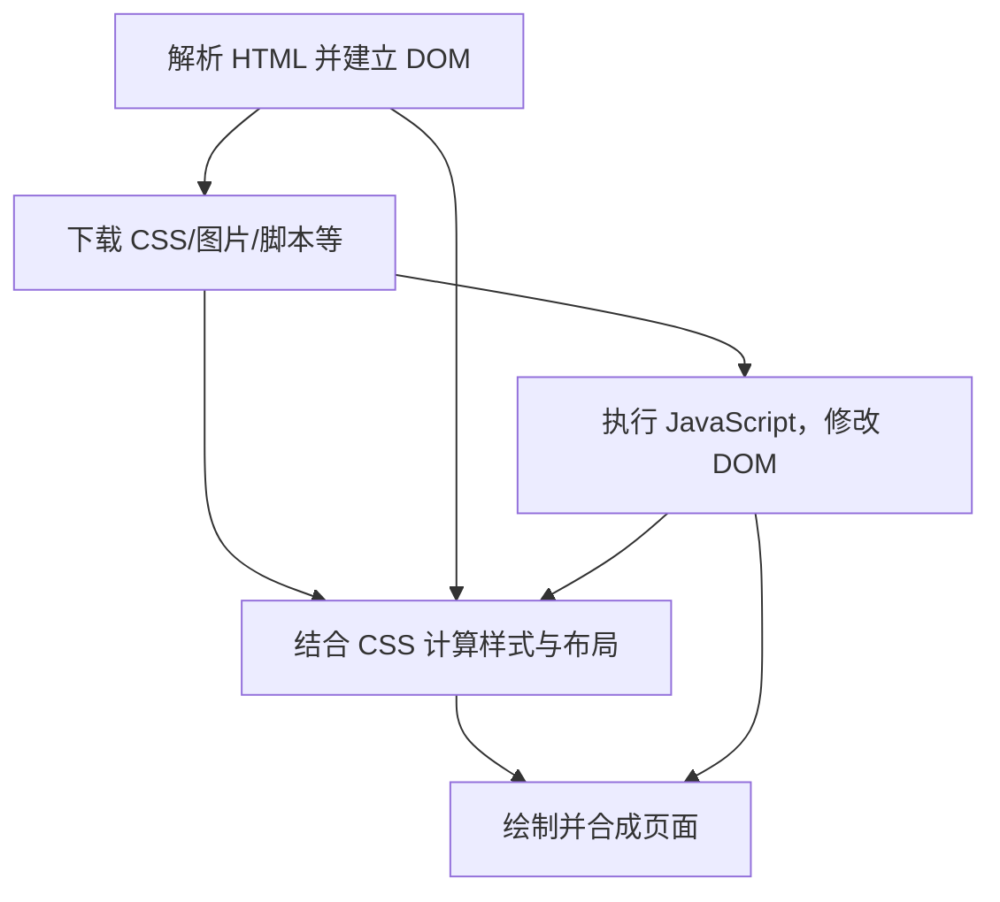

# Chapter 07 Audit

审计员：Chapter-Audit-Agent-07  
日期：2026-09-10  
对象：第 7 章《Web 基础》（学习顺序 01→02→03→**07**→04）  
禁止范围：未审第 4 章及以后正文；阶段测验 1 仅深审第 7 章题。

---

## 1. Coverage

Coverage **100%**。下表「数量」按本章必读文件统计；「未检查」必须为 0。

| 类型 | 数量 | 已检查 | 未检查 | 备注 |
| --- | ---: | ---: | ---: | --- |
| 正文文件 | 1 | 1 | 0 | `chapters/07-web-basics.md`（656 行） |
| 一级标题 | 1 | 1 | 0 | |
| 二级小节 `##`（围栏外） | 22 | 22 | 0 | 含结构段、7.1–7.9、实战、错误、面试、练习、清单、总结、资料、预告 |
| 三级小节 `###`（围栏外） | 56 | 56 | 0 | 含练习 1–8、答案 1–8、错误 1–7、面试 1–4、实战任务 |
| 正文段落（围栏外非空段） | 109 | 109 | 0 | |
| 无序列表项 | 81 | 81 | 0 | 含学习目标 9 条、检查清单 15 条 |
| 有序列表项 | 9 | 9 | 0 | 总结 5 条 + 任务三 4 条 |
| 引用块行 | 11 | 11 | 0 | |
| 正文表格 | 5 | 5 | 0 | 7.1 / 7.2 / 7.3 / 7.8 / 任务二 |
| 模板围栏内表格 | 2 | 2 | 0 | 交付模板「页面组成」「故障分析」 |
| 代码围栏 | 14 | 14 | 0 | text×6、mermaid×3、html/css/js/bash/markdown 各 1 |
| Linux/Shell 命令 | 1 | 1 | 0 | `cd project/minishop` + `python3 run.py serve` |
| SQL | 0 | 0 | 0 | 本章无 SQL |
| 正式 HTTP 报文示例 | 0 | 0 | 0 | 刻意留到第 9 章；仅有口语「404」 |
| 测试用例（编号用例） | 0 | 0 | 0 | 本章无 |
| Bug 示例（缺陷单） | 0 | 0 | 0 | 仅有假想现象（负价格、负数量） |
| 章内小练习 | 8 | 8 | 0 | 先独立作答再对答案 |
| 章内标准答案 | 8 | 8 | 0 | |
| 工作实战任务 | 3 | 3 | 0 | 7-1 书面；教材无填好的标准答卷 |
| 阶段测验 1 第 7 章题 | 2 | 2 | 0 | 题 7、题 8（必过） |
| 阶段测验 1 其余题 | 8 | 8 | 0 | 只核时机与是否误用第 7 章未教概念，不深审 1/2/3 章知识 |
| Markdown 图片引用 | 5 | 5 | 0 | `ch07-*.png` |
| 示意图 HTML 源 | 5 | 5 | 0 | 与 PNG 对照 |
| 正文链接的截图 | 1 | 1 | 0 | `assets/01-login.png`（引用 2 次） |
| 练习 HTML 页 | 2 | 2 | 0 | `07-html-combo.html`、`07-html-lab.html`（源码 + Chrome dump-dom + JS 执行） |
| Markdown 链接 | 11 | 11 | 0 | 4 条外链已检索确认存活 |
| 星级标注的知识节 | 9 | 9 | 0 | 7.1 ⭐⭐；7.2–7.8 ⭐⭐⭐；7.9 ⭐⭐ |
| 一句话核心 / 结构必含块 | 13 | 13 | 0 | 对照质量标准第七节 |

**围栏明细（14）**

| # | 语言 | 起始行 | 内容 |
| ---: | --- | ---: | --- |
| 1 | text | 41 | 场景 URL |
| 2 | mermaid | 51 | 访问六步 flowchart |
| 3 | text | 130 | 7.3 同一 URL |
| 4 | text | 169 | `example.test` |
| 5 | text | 203 | `https://shop.example.test` |
| 6 | mermaid | 241 | 请求–响应 sequence |
| 7 | html | 312 | `<article class="product-card">` |
| 8 | css | 326 | `.product-card` |
| 9 | javascript | 337 | 点击改按钮文案 |
| 10 | mermaid | 355 | 渲染简化模型 |
| 11 | bash | 380 | MiniShop serve |
| 12 | text | 391 | URL 拆解空表 |
| 13 | markdown | 430 | 观察报告模板 |
| 14 | text | 527 | 练习 1 URL |

**图片与配套 HTML（必须 `read_file` 打开，已打开）**

| 文件 | 结论入口 |
| --- | --- |
| `chapters/assets/diagrams/ch07-url.png` + `.html` | IMG-CH07-001 |
| `chapters/assets/diagrams/ch07-dns.png` + `.html` | IMG-CH07-002 |
| `chapters/assets/diagrams/ch07-client-server.png` + `.html` | IMG-CH07-003 |
| `chapters/assets/diagrams/ch07-frontend-backend.png` + `.html` | IMG-CH07-004 |
| `chapters/assets/diagrams/ch07-html-css-js.png` + `.html` | IMG-CH07-005 |
| `chapters/assets/01-login.png` | IMG-CH07-006 |

未检查 = 0。

---

## 2. 总评分

| 项目 | 得分 |
| --- | ---: |
| 技术准确性 | 9/10 |
| 岗位实用性 | 8/10 |
| 完整性 | 8/10 |
| 初学者友好度 | 7/10 |
| 教学顺序 | 8/10 |
| 代码质量 | 9/10 |
| 实操质量 | 7/10 |
| 练习质量 | 8/10 |
| 图片质量 | 8/10 |
| **总体** | **81/100** |

评分依据：Web 原理（URL 六段、fragment 不进 HTTP 请求目标、DNS≠健康、前后端不可凭页面判死刑、源码≠DOM）经 WHATWG / RFC 9110 / RFC 6761 / RFC 5737 核对，**无 P0**。扣分集中在：开篇把非 v1.0 地址写成「MiniShop 的网址」（P1）、7.4 术语堆砌、示意图超前词、实操没把「查看源代码」做成必做动作。九项合计 72/90，按问题严重度独立定为 81。

质量标准作者发布线 90 **不是**本审计下限。本章达不到「可以发布、只改错字」。

---

## 3. P0

无。

未发现会把学生教错的协议级错误，也没有把 Cookie/Session/Token 写成三选一、GET 不安全/POST 安全、或把 MiniShop 写成公司项目。`BUG-001`、支付、优惠券、订单 `status` 未在本章冻结。

---

## 4. P1

## ISSUE
ID：CH07-0001
文件：`chapters/07-web-basics.md`
章节：第 7 章
小节：这一章解决什么问题；场景导入；7.5 MiniShop 场景
精确位置：L10–L12；L38–L42；L198–L206
原文：
> 当你在浏览器里输入 MiniShop 的网址并看到商品首页时……
>
> 你在浏览器地址栏输入：
> `https://shop.example.test:8443/products?keyword=mouse&page=2#reviews`
>
> 测试环境地址：`https://shop.example.test`
问题等级：P1
问题类别：PRE / SEQ / MiniShop
问题说明：开篇把教学用 `.test` 商品 URL 说成「MiniShop 的网址」，并预设「商品首页」。按正式学习顺序 03→07，v1.0 未登录打开 `http://127.0.0.1:8765/` 第一帧是登录+注册（已用 `01-login.png` 拍到；本次 GET `/` 返回 200，正文含「登录」「注册」，**不含**「加入购物车」）。示意图 HTML 已写「教学示例（非正式 MiniShop 冻结地址）」，**正文场景没有同等声明**。7.5 又把 `https://shop.example.test` 写成「测试环境地址」，与工作实战的本机 HTTP 地址冲突。
为什么有问题：零基础读者会按开篇去敲 `shop.example.test`（`.test` 为 RFC 6761 保留 TLD，通常 NXDOMAIN），或以为 MiniShop 有 `/products` 商品首页。后文工作实战才说「不要虚构商品列表」，前后口径打架。
依据：`project/minishop/docs/PRD.md`（本机 `http://127.0.0.1:8765`；页面为 `/` 与 `/admin.html`）；质量标准第五节「第 19 章之前的路径必须标明教学约定」；本次实测 GET `http://127.0.0.1:8765/`。
建议修改：开篇用短地址承接第 3 章；六段 URL 明确标「教学拆解示例，不是 v1.0 地址」。
推荐替换文本：
```markdown
第 3 章说：系统级功能测试常常是打开浏览器去点 MiniShop。
你看见的页面只是整条链路的最后一截，不是整个被测系统。

本机第一帧（项目未启动也没关系，7.8 有不连服务器的练习页）是：

http://127.0.0.1:8765/

此刻先认三个格子：`http` 怎么走，`127.0.0.1` 去哪台机器，`8765` 敲哪扇门。
下面这条带搜索词、非默认端口和 `#锚点` 的地址**不是** v1.0 MiniShop，只供 7.3 拆格子：

https://shop.example.test:8443/products?keyword=mouse&page=2#reviews
```

---

## 5. P2

## ISSUE
ID：CH07-0002
文件：`chapters/07-web-basics.md`
章节：第 7 章
小节：学习目标；场景导入；7.8
精确位置：L16–L28；L38–L62；L347–L349
原文：学习目标 9 条在前 30 行点名 scheme/host/port/path/query/fragment、DNS、前后端、HTML/CSS/JS；场景用完整六段 URL；combo 链接出现在约 L349。
问题等级：P2
问题类别：PED
问题说明：开篇不是「一个最小可点的例子」，前 ~300 行像词典。能点的 combo/lab 排在 7.8 之后。
为什么有问题：质量标准第三节要求生活类比 → 简单模型 → 定义 → 例子；禁止定义堆砌。零基础在还没拆过本机短地址时就被六段 URL 压住。
依据：Quality Standard v1.0 第三节、第七节；学习顺序 03→07。
建议修改：场景用 `http://127.0.0.1:8765/`；combo 提前成「先点一下」；六段拆解留在 7.3。
推荐替换文本：见 CH07-0001；7.8 开头增加「现在就打开 combo，三步验收」（见第 16 节）。

## ISSUE
ID：CH07-0003
文件：`chapters/07-web-basics.md`
章节：第 7 章
小节：7.4 Domain、Host、Hostname 与 IP ⭐⭐⭐
精确位置：L163–L188
原文：用三段分别讲域名、host/hostname、IP，并声明「不同工具、标准……可能略有差异」。星级 ⭐⭐⭐。
问题等级：P2
问题类别：PED / TERM
问题说明：测试入门此刻需要的是「完整 URL / 给人看的名字 / 给机器的号码」。host 与 hostname 的标准差异（WHATWG **记录**里的 host 不含端口；浏览器 `URL.host` getter 在端口非空时**含**端口）被写成必须掌握，正文自己也说不必打官司。
为什么有问题：星级不诚实；免责声明比可执行区别长，符合「定义堆砌」。
依据：WHATWG URL Standard（URL record host ≠ `URL.host` IDL 属性）；质量标准第三节。
建议修改：降为 ⭐⭐；改三分表；host = URL 里「去哪」一格。
推荐替换文本：
```markdown
## 7.4 URL、名字和号码 ⭐⭐

入门先记三样。domain / host / hostname 在不同工具里用词不完全一样，不必先打官司。

| 你看见的 | 它是什么 | 打不开时先查 |
| --- | --- | --- |
| 完整 URL | 怎么走 + 去哪 + 哪份资源 | 整串有没有抄错、环境对不对 |
| 域名 / 主机名 | 给人看的名字，如 `shop.example.test` | DNS、Hosts、证书名字 |
| IP 地址 | 给机器看的号码 | 这台地址上有没有服务在听 |

URL 里用来确定「去哪」的那一格可以是名字，也可以直接写 IP。
本章表格把 host 与 port 分开写，这与 RFC 3986 / WHATWG 的 host **记录**一致；浏览器控制台里 `new URL(...).host` 在非默认端口时会带上 `:8443`，那是 API 口径，不要和表格打架。
禁止把「一个域名永远对应一台服务器」当成规则。
```

## ISSUE
ID：CH07-0004
文件：`chapters/07-web-basics.md`
章节：第 7 章
小节：7.2 测试工程师如何使用这条链路；面试问题 2
精确位置：L112–L118；L503–L507
原文：「页面返回 404」；面试推荐「再观察请求是否发出、响应状态……检查浏览器控制台」
问题等级：P2
问题类别：SEQ / PRE
问题说明：状态码在第 9 章、控制台在第 10 章。此处当已会技能用。
为什么有问题：零基础会以为本章就要会读 404 和控制台，或反过来因看不懂而跳过整张排查表。
依据：大纲第 9、10 章范围；本章 L14「不会提前展开 HTTP 报文……DevTools」。
建议修改：404 改口语并指向第 9 章；控制台标明「第 10 章再打开」。
推荐替换文本：
```markdown
| 页面提示找不到（常见状态码 404，第 9 章再记） | URL、路由、部署路径、资源是否存在 | 「一定是前端 Bug」 |
```
面试问题 2 在「控制台」后加：「（Elements / Console / Network 的具体点法见第 10 章；现在只要知道：页面之外还有请求和日志两条通道。）」

## ISSUE
ID：CH07-0005
文件：`chapters/assets/diagrams/ch07-client-server.html`；`ch07-frontend-backend.html`；`ch07-url.html`；`ch07-dns.html`；对应 PNG
章节：第 7 章
小节：7.3–7.7 配图
精确位置：client-server 后厨盒子；frontend-backend 后端卡片；URL/DNS 图注
原文：`/api/login`、`JSON`、`SQLite`、`qty=11`；图注「第 19 章本机默认是 http://127.0.0.1:8765/」
问题等级：P2
问题类别：SEQ / IMG / TERM
问题说明：JSON、SQLite、`/api/login`、库存边界 `qty=11` 分别属于第 9/12/13/5 章主讲。学习顺序里第 5 章还在第 7 章**之后**。图注写成「第 19 章本机」会让读者以为现在不能跑 MiniShop。
为什么有问题：图比正文更「像项目」，但用的词正文还没教；与「第 19 章之前路径必须标明教学约定」不一致。
依据：正式学习顺序；PRD `R-CART-10` 在第 5/19 章才作为判定；本章 7.6–7.7 未定义 JSON/SQLite。
建议修改：后厨改口「校验密码、拒绝超量、记下库存」；`/api/login` 若保留，加「这是门牌上的路径名，报文第 9 章再拆」；图注改「本章工作实战就是这个本机地址」。
推荐替换文本：见第 16 节配图改口。

## ISSUE
ID：CH07-0006
文件：`chapters/07-web-basics.md`；`chapters/assets/07-html-combo.html`；`chapters/assets/07-html-lab.html`
章节：第 7 章
小节：7.8；7.9；MiniShop 工作实战
精确位置：L347–L372；L374–L461
原文：组合页「用浏览器直接打开即可」；7.9 说「查看网页源代码与运行后的 DOM 可能不同」；实战任务没有「对照源码」步骤。
问题等级：P2
问题类别：EX / PED
问题说明：本章最该亲手做的观察是：点 combo 按钮后屏幕变成「已加入购物车」，「查看网页源代码」仍是「加入购物车」。练习页和 7-1 都没要求这一步。MiniShop 登录页源码里其实已经有 `hidden` 的商品区（本次 GET `/` 证实 `shop-panel` 在 HTML 里），正好能练同一句话，正文没点。
为什么有问题：练习 6 / 测验必过第 8 题考的就是这件事，却停在阅读理解。
依据：学习目标「用简化模型解释浏览器如何把资源呈现为页面」；质量标准「实操要能练会该章那句话」。
建议修改：7.8 与 7-1 增加强制的源码对照步骤（见第 16 节）。
推荐替换文本：见第 16 节补丁 3。

## ISSUE
ID：CH07-0007
文件：`chapters/07-web-basics.md`
章节：第 7 章
小节：MiniShop 工作实战 任务一 / 任务三
精确位置：L387–L424
原文：
> 没有出现的部分填写「未显式提供」
> 1. 浏览器提示无法解析主机名
> 3. 登录按钮点了没反应（在登录页、lab 页或 combo 教学页上观察……）
> 4. 登录失败提示出现了……
问题等级：P2
问题类别：EX
问题说明：三处会让学生以为自己做错了。
1. 地址栏常显示 `http://127.0.0.1:8765`（无尾斜杠）。Python `urlparse`：有尾斜杠时 path=`/`，无尾斜杠时 path=`''`。WHATWG 对 http(s) 特殊 scheme 会把空 path 当成 `/`。按「未显式提供」填写会与「path=/」的参考口径冲突。
2. 任务三第 1 点对 `127.0.0.1` **套不上**（没有主机名解析）。
3. 真登录页空提交会触发浏览器 `required` 校验，有反应；combo 点击会改文案，有反应；lab 填完提交出现「已触发提交（本页不连接服务器）」，不是「登录失败」。第 4 点依赖真服务器且本章未给教学账号。
为什么有问题：完成标准要求四个场景各两个假设，但提供的对象默认复现不了所述现象。
依据：本次 `urlparse` 结果；Chrome dump-dom 的 combo/lab；`frontend/index.html` + `app.js`（失败文案「登录失败」仅在 `fetch /api/login` 非 200 时出现）。
建议修改：path 写明「http(s) 空路径按 `/` 记」；任务三改为假想题或 combo「点击后文字不变」的破坏性观察；第 1 点注明 IP 地址不会走 DNS。
推荐替换文本：见第 16 节补丁 3。

## ISSUE
ID：CH07-0008
文件：`chapters/07-web-basics.md`
章节：第 7 章
小节：7.9 浏览器如何呈现页面
精确位置：L355–L362
原文：mermaid 中 `E[执行 JavaScript，修改 DOM]` 没有入边，与 A/B 并列作为源节点。
问题等级：P2
问题类别：PED / CODE
问题说明：文字已纠正「不要读成 JS 会重新解析 HTML」（相对旧审查 ISS-07-01，**箭头指回解析 HTML 的问题已不存在**）。但 E 悬空，读者无法看出脚本来自 HTML 里的 `<script>` 或已下载资源。
为什么有问题：简化模型应仍能回答「JS 从哪来」。当前图画成 JS 凭空执行。
依据：MDN *Populating the page: how browsers work*（slug `Web/Performance/Guides/How_browsers_work`）；本章自己的第五步「继续获取依赖资源」。
建议修改：增加 `A --> E` 或 `B --> E`（脚本随 HTML/资源而来），保持 E → 改 DOM → 布局/绘制。
推荐替换文本：


## ISSUE
ID：CH07-0009
文件：`chapters/quizzes/stage-1-foundations.md`
章节：阶段测验 1（覆盖 1/2/3/7）
小节：第 8 题及答案
精确位置：题 L8；答案 L25
原文：
> 8.（必过）查看网页源代码和浏览器里当前看到的页面，可能不一致。差在哪？
> 答案：源代码是初始 HTML；页面可能已被 JavaScript 改过，Elements 看的是当前 DOM。
问题等级：P2
问题类别：SEQ / ANS / TERM
问题说明：独立作答与教材**实质一致**，不构成 【ANSWER VERIFICATION FAILED】。但答案把第 10 章工具名 Elements 当作已会词，题干并未要求。
为什么有问题：阶段测验 1 的时机是学完第 7 章，DevTools 尚未主讲。
依据：`chapters/quizzes/README.md`「学完第 7 章」；大纲第 10 章才是 Elements。
建议修改：答案改为「运行后的 DOM」；Elements 放括号「第 10 章在 DevTools 的 Elements 里看」。
推荐替换文本：
> 源代码是服务器返回的初始 HTML；屏幕上的内容可能已被 JavaScript 改过，对应运行后的 DOM。两者可以不一致。（第 10 章用 DevTools 的 Elements 看当前 DOM。）

## ISSUE
ID：CH07-0010
文件：`chapters/07-web-basics.md`（缺图）
章节：第 7 章
小节：7.2 测试工程师如何使用这条链路
精确位置：L110–L120 表前
原文：（无对应图）
问题等级：P2
问题类别：IMG / PED
问题说明：一句话核心是「页面只是一条观察通道」。访问六步只有 mermaid 职责链，没有「白屏/打不开/没样式/按钮没反应分别坏在哪一格」。
为什么有问题：核心句缺一张图；7.2 表全是文字，初学者记不住落点。
依据：质量标准「图表确实帮助理解」；本章核心句 L3。
建议修改：新增 `ch07-observation-channel`（见第 15 节）。
推荐替换文本：不适用（新图）。

## ISSUE
ID：CH07-0011
文件：`chapters/07-web-basics.md`
章节：第 7 章
小节：小练习 8 / 答案 8
精确位置：L557–L558；L604–L608
原文：练习「MiniShop 商品数量显示为负数」；答案「商品详情页中，商品库存显示为 `-1`」。
问题等级：P2
问题类别：EX / MiniShop
问题说明：开放题允许假想，但挂了 MiniShop 名字。v1.0 没有独立商品详情页；购物车数量是表单里的 `type=number`，主路径也不会展示库存 `-1`。
为什么有问题：学生若去真页面找「详情页库存」会误报缺陷或认为练习对象错了。
依据：`frontend/index.html`（登录后同页商品列表 + 购物车，无详情路由）；PRD 范围。
建议修改：标明「假想题，不必在 v1.0 复现」；或改成登录页能看见的异常（例如把价格改成教学 HTML 里的 `-99`，指向 combo）。
推荐替换文本：
> 练习 8（假想，v1.0 没有商品详情页）：若某商品页把数量显示成负数，请写一条区分事实与假设的初步描述。不要编造 MiniShop 截图。

---

## 6. P3

## ISSUE
ID：CH07-0012
文件：`chapters/07-web-basics.md`；`chapters/assets/07-html-combo.html`
章节：第 7 章
小节：7.8 JavaScript 示例
精确位置：L337–L343；combo L20–L23
原文：`() => { button.textContent = "已加入购物车"; }`；`querySelector` 未判断 null
问题等级：P3
问题类别：CODE / PED
问题说明：正文写「不要求学习者独立编写 JavaScript」，示例却用箭头函数。lab 页反而用 `function`，两页风格不统一。combo 在按钮存在时安全（已执行通过）。
为什么有问题：零基础会把 `=>` 当成必须认识的语法。
依据：质量标准「零基础章节不得无提示地引入未学习的……」；本章前置「不要求编程」。
建议修改：combo 与正文改成 `function () { ... }`，与 lab 一致；可选加一句「找不到按钮时脚本会报错，这本身也是一种前端证据」。
推荐替换文本：
```javascript
var button = document.querySelector(".product-card button");
button.addEventListener("click", function () {
  button.textContent = "已加入购物车";
});
```

## ISSUE
ID：CH07-0013
文件：`chapters/assets/diagrams/ch07-url.html`；`ch07-client-server.html`；五张 PNG
章节：第 7 章
小节：示意图
精确位置：url/client-server 的 `<head>` 无 `<title>`；PNG 画布约 1320×780，内容集中在上半
问题等级：P3
问题类别：IMG
问题说明：可读，但大量留白；两份 HTML 缺 title，与同套 dns/frontend/html-css-js 不一致。
为什么有问题：无头截图与可访问性标题不统一；打印/预览浪费版面。
依据：`diagrams/README.md` 窗口 1320×780；同目录其他 ch07 html 有 title。
建议修改：补 title；截图裁到内容区。
推荐替换文本：url.html 增加 `<title>把地址栏拆开，缺陷才能写到具体格子上</title>`。

## ISSUE
ID：CH07-0014
文件：`chapters/assets/01-login.png`；`project/minishop/frontend/index.html`
章节：第 7 章
小节：7.8；工作实战第一帧
精确位置：截图注册说明「不会自动签发 token」
问题等级：P3
问题类别：PRE / PED
问题说明：截图与真页面一致（KEEP 的前提），但 token 是第 8/9 章词。本章把它当「第一帧对照」。
为什么有问题：【Beginner Friction】盯着截图会问 token 是什么。
依据：PRD `R-AUTH` 在认证章才展开。
建议修改：正文加半句「截图里若出现 token 字样，先当成『登录凭证的名字』，第 8–9 章再拆」。
推荐替换文本：见上。

## ISSUE
ID：CH07-0015
文件：`exercises/README.md`；`chapters/07-web-basics.md`
章节：第 7 章
小节：实操作业交付模板
精确位置：正文 L428 `exercises/chapter-07-web-observation.md`；`exercises/README.md` 示例名单未列此文件名
问题等级：P3
问题类别：SEQ
问题说明：学习者按 exercises README 的例子命名会对不上本章指定路径。
为什么有问题：小一致性，不改变对错。
依据：质量标准实操路径要可验收。
建议修改：在 `exercises/README.md` 补一行 `chapter-07-web-observation.md`（属全局文件，本章 Agent 不改，只记录）。
推荐替换文本：`- chapter-07-web-observation.md`

## ISSUE
ID：CH07-0016
文件：`chapters/07-web-basics.md`
章节：第 7 章
小节：7.6 服务器
精确位置：L228–L235
原文：「提供图片的对象存储或内容分发服务」列为 MiniShop 中「可能存在」的服务。
问题等级：P3
问题类别：MiniShop / PED
问题说明：「可能存在」未写成冻结契约，但零基础会当成这个项目有 CDN。v1.0 是单进程 + 本地静态文件。
为什么有问题：轻微超描项目形态。
依据：`server.py` 从 `frontend/` 提供静态资源；PRD 非范围无 CDN。
建议修改：改成「大型站点还可能有……MiniShop v1.0 没有单独的对象存储」。
推荐替换文本：
> MiniShop v1.0 是本机一个进程同时给页面和 JSON。大型站点还可能把图片放到对象存储或 CDN——那是以后的观察通道，不是本项目现成组件。

## ISSUE
ID：CH07-0017
文件：`chapters/07-web-basics.md`
章节：第 7 章
小节：工作实战启动命令
精确位置：L380–L383
原文：
```bash
cd project/minishop
python3 run.py serve
```
问题等级：P3
问题类别：SEQ
问题说明：未写「在仓库根目录执行」。根 README 同样写法，口径一致；若读者 cwd 已在 `chapters/` 会失败。
为什么有问题：书面实操的最小命令应防迷路。
依据：`project/minishop/run.py` 以脚本所在目录为 ROOT，但 `cd project/minishop` 相对当前目录。
建议修改：加「在仓库根目录打开终端」。
推荐替换文本：
```bash
# 在仓库根目录
cd project/minishop
python3 run.py serve
```

## ISSUE
ID：CH07-0018
文件：`chapters/quizzes/stage-1-foundations.md`
章节：阶段测验 1
小节：整卷结构（第 7 章覆盖）
精确位置：题 7、8；其余 1–6、9、10
原文：10 题中与第 7 章直接对应的只有 7（多请求）和 8（源码≠页面）。
问题等级：P3
问题类别：EX
问题说明：测验**整体不算过早**（安排在 01→02→03→07 之后，见第 11 节）。但第 7 章学习目标里的 URL 拆解、DNS 边界、前后端归因完全未考；必过题 8 还泄漏 Elements（CH07-0009）。
为什么有问题：阶段测验承担「这四章能不能过」的闸门，第 7 章闸门偏窄。
依据：`quizzes/README.md`；本章学习目标 L20–L28。
建议修改：把题 7 或加一道（若保持 10 题则替换较易的分类题）改为拆一条短 URL，或判断「DNS 成功 ≠ 服务健康」。
推荐替换文本：可选新增：「`http://127.0.0.1:8765/` 的 scheme、host、port、path 各是什么？没有的部分写『未显式提供』。」

---

## 7. 逐段问题

对围栏外全部 22 个 `##`、56 个 `###` 的判定。只列偏差；标「通过」表示该单元未发现 P0/P1 事实错误。

| 位置 | 判定 | 关联 |
| --- | --- | --- |
| 标题 + 一句话核心 L1–L6 | 通过。核心句能当过滤器，后文 7.2/7.7/错误 5 都在用。MiniShop 标注为个人实践项目。 | |
| 这一章解决什么问题 L8–L14 | **P1**：L10「MiniShop 的网址」「商品首页」。HTTP/DevTools 推到 9/10 章，克制合格。 | CH07-0001 |
| 学习目标 L16–L28 | 9 条覆盖大纲第 7 章范围。开篇清单过重。 | CH07-0002 |
| 前置知识 L30–L35 | 通过。1–3 章；不要求编程。与正式顺序 03→07 一致。 | |
| 场景导入 L37–L62 | **P1** 教学 URL 冒充 MiniShop；mermaid 六步有「不是固定次数」的边界，**技术正确**（缓存、重定向）。 | CH07-0001, 0002 |
| 7.1 Web 是什么 L65–L70 | 通过。Web ≠ Internet；电邮/IM 例子恰当。 | |
| 7.1 网页/网站/Web 应用表 L72–L80 | 通过。承认日常混用；对象边界优先于名词之争。MiniShop 示例（详情页、整站、登录购物车下单后台）是概念例，未写成「现在首页就是商品详情」。 | |
| 7.2 第一步–第六步 L82–L108 | 通过。域名才走 DNS；HTTPS/TLS 点到为止；多资源请求；加载与呈现交错。 | |
| 7.2 排查表 L110–L120 | 方向正确，禁止直接下结论。404 超前。 | CH07-0004, 0010 |
| 7.3 URL 定义与表 L122–L161 | 通过。scheme/host/port/path/query/fragment 与 `urlparse` 及 WHATWG 记录一致；query 不含 `?`、fragment 不含 `#`；userinfo 边界与「不要把凭据写进 URL」符合 RFC 9110 §4.2.4；「query ≠ GET 专属」避免了禁止的 GET/POST 安全神话；fragment「通常不作为 HTTP 请求目标发送」符合 RFC 9110（fragment identifiers are not sent in requests）。 | |
| 7.3 三个易错点 / 测试关注点 | 通过。 | |
| 7.4 域名 L165–L173 | 通过。`.test` 为 RFC 6761 / RFC 2606 特殊用途 TLD，用法正确。 | |
| 7.4 主机与主机名 L175–L184 | 术语堆砌；星级过重。 | CH07-0003 |
| 7.4 IP L186–L188 | 通过。禁止一对一，正确。 | |
| 7.5 DNS L190–L214 | 通过。通讯录类比有边界；缓存层级；解析成功 ≠ 应用健康；能访问 IP ≠ 域名一定成功（Host/证书）。203.0.113.10 为 RFC 5737 TEST-NET-3，图注「示例网段」正确。 | CH07-0001（「测试环境地址」）, 0005（图注第 19 章） |
| 7.6 Client/Server L216–L249 | 通过。客户端不限于浏览器；服务器可指软件或机器；MiniShop 多服务「可能」略超描。sequence 是角色图不是报文。 | CH07-0016 |
| 7.7 Frontend/Backend L251–L293 | 通过。负价格多因归因是岗位级表达；禁止「前端价格 Bug」。 | |
| 7.8 HTML/CSS/JS L295–L349 | 职责表正确；错误 6 已反制「互不影响」。HTML/CSS/JS 语法正确，combo 与正文 `<article>` 对齐（旧 ISS-07-02 **已不成立**）。缺源码对照步骤。 | CH07-0006, 0012, 0014 |
| 7.9 渲染 L351–L372 | 文字正确：DOM、源码≠DOM、JS 改 DOM 而非重新解析 HTML。mermaid E 悬空。 | CH07-0008 |
| 工作实战开段 L374–L385 | 类型 📖、编号 7-1、serve 命令、第一帧登录/注册、lab 备选、禁止虚构商品列表：**相对旧 ISS-07-03 / 教学审查 P1-1/P1-2 已修好**。cwd 未写仓库根。 | CH07-0017 |
| 任务一 L387–L401 | 拆解表可用。空 path 口径未写清。 | CH07-0007 |
| 任务二 L403–L413 | 通过。给 3 行要求自补到 5，合理。 | |
| 任务三 L415–L424 | 现象与提供的页面不对齐。 | CH07-0007 |
| 交付模板 L426–L461 | 通过。完成标准可量化。缺 combo 点击前后文案、缺源码对照。 | CH07-0006 |
| 错误 1–7 L463–L490 | 通过。七条都是高频误解，有反例。 | |
| 面试 1 L494–L501 | 通过。有缓存/代理/重定向边界；反对「DNS 找到网页一次发回」。 | |
| 面试 2 L503–L507 | 控制台超前。归因逻辑正确。 | CH07-0004 |
| 面试 3–4 | 通过。有「简化划分 / 非一对一」。 | |
| 小练习 1–8 / 答案 1–8 | 见第 11 节。答案 1–7 一致；8 挂 MiniShop 详情页。 | CH07-0011 |
| 检查清单 L612–L630 | 通过。15 条可自检，对齐目标。 | |
| 本章总结 L632–L640 | 通过。五句与核心句同向。 | |
| 参考资料 L642–L647 | 四条外链均存在（见 §18）。MDN How browsers work 的 slug `Web/Performance/Guides/How_browsers_work` 与 mdn/content 一致。 | |
| 下一章预告 L649–L655 | 通过。指向第 4 章 / 04A，符合 07→04；测验 1 入口正确。 | |

**练习 HTML 源码审查（强制）**

| 文件 | 源码结论 |
| --- | --- |
| `07-html-combo.html` | HTML5、`lang="zh-CN"`、UTF-8；`<article>`/`<h2>`/`<button type="button">` 与正文一致；内联 CSS 与正文 `.product-card` 一致；点击只改 `textContent`；注释写明不连服务器。Chrome `--dump-dom` 可解析；Node 模拟点击后文案变为「已加入购物车」。 |
| `07-html-lab.html` | 登录表单、`label for=`、`required`、`maxlength="11"`、`type="password"`、`role="status"`；`preventDefault` 后写「已触发提交（本页不连接服务器）」。可练标签/必填/密码框。不能当「登录失败」现象页。 |

---

## 8. 代码问题

| 块 | 语法 | 可运行性 | 问题 |
| --- | --- | --- | --- |
| mermaid 访问六步 | 合法 flowchart TD | 教学模型 | 无 |
| mermaid sequence | 合法 | 角色示意 | 「请求商品列表」与未登录第一帧不符，属场景问题 CH07-0001，不是语法错 |
| HTML 片段 | 合法（需放入完整文档） | combo 已是完整文档 | 无 |
| CSS | 合法 | combo 内联一致 | 无 |
| JavaScript | 合法 | Node 模拟 + Chrome 解析通过 | CH07-0012 箭头函数；无 null 守卫 |
| mermaid 渲染 | 合法 | E 无入边 | CH07-0008 |
| bash serve | 合法 | 本机 8765 已被 PID 77142 的 `server.py` 占用；对**已在听的服务** GET `/` → 200，证实命令语义正确 | CH07-0017 cwd |
| 观察报告 markdown 模板 | 合法 | 书面 | 无 |

未把伪代码写成可运行代码。JS 依赖浏览器 DOM，正文已说明。

---

## 9. 图片问题

IMG-CH07-001
文件：`chapters/assets/diagrams/ch07-url.png`（源 `ch07-url.html`）
出现位置：7.3 L126
图片主要内容：把教学 URL 拆成 scheme/host/port/path/query/fragment 色块，并解释每格。
技术准确性：正确。默认端口 http 80 / https 443 符合 WHATWG special scheme；fragment「通常不发给服务器」正确。`.test` + 非 8765 端口与 v1.0 区分，HTML 写了「非正式 MiniShop 冻结地址」。
与正文一致性：与 7.3 表一致。正文场景未同步「非正式」声明。
文字是否正确：是。
UI 是否过时：不适用（示意图）。
教学价值：高，直接服务「缺陷写到格子上」。
可读性：色块清楚；PNG 下半大块留白。
是否需要修改：是（图注「第 19 章」；html 缺 title）。
修改建议：图注改为「本章实战地址是 http://127.0.0.1:8765/ ，这条是拆格子用的教学串」。
最终结论：MODIFY

IMG-CH07-002
文件：`chapters/assets/diagrams/ch07-dns.png`（源 `ch07-dns.html`）
出现位置：7.5 L192
图片主要内容：域名 → DNS → 203.0.113.10 → 再敲门。
技术准确性：203.0.113.10 为 TEST-NET-3（RFC 5737），标注「不是公网」正确。命题「解析成功 ≠ 店开着」正确。
与正文一致性：与 7.5 误区一致。
文字是否正确：是。「Host、证书」对初学者偏硬（HTTP Host / 证书 CN），可接受为脚注。
UI 是否过时：否。
教学价值：高。
可读性：好；同样留白。
是否需要修改：是（「第 19 章本机是 127.0.0.1」）。
修改建议：改「本章就可以在 127.0.0.1 上练；那是 IP，不走 DNS」。
最终结论：MODIFY

IMG-CH07-003
文件：`chapters/assets/diagrams/ch07-client-server.png`（源 `ch07-client-server.html`）
出现位置：7.6 L218
图片主要内容：浏览器客户端 vs MiniShop 服务器；区分前端/后端另一把尺子。
技术准确性：请求–响应角色正确。后厨写 `/api/login`、SQLite、JSON、qty=11 对本章超前，不是协议错误。
与正文一致性：正文 7.6 尚未教这些词；图更「项目化」。
文字是否正确：是。
UI 是否过时：否。
教学价值：中高。混入前端标签有助于区分两把尺子。
可读性：好。html 缺 `<title>`。
是否需要修改：是。
修改建议：后厨改「校验密码、拒绝超量、记下库存」；路径名加「第 9 章再拆报文」。
最终结论：MODIFY

IMG-CH07-004
文件：`chapters/assets/diagrams/ch07-frontend-backend.png`（源 `ch07-frontend-backend.html`）
出现位置：7.7 L253
图片主要内容：摆盘 vs 后厨规则/账本；CSS 挡住按钮也是前端。
技术准确性：正确。SQLite/JSON/qty=11 同 CH07-0005。
与正文一致性：与 7.7 负价格多因归因同向。
文字是否正确：是。
UI 是否过时：否。
教学价值：高（「都可能把菜做砸」）。
可读性：好。
是否需要修改：是（超前词改口）。
修改建议：后端改为「校验密码、拒绝超量、写入账本、把结果送回」。
最终结论：MODIFY

IMG-CH07-005
文件：`chapters/assets/diagrams/ch07-html-css-js.png`（源 `ch07-html-css-js.html`）
出现位置：7.8 L297
图片主要内容：结构 / 装修 / 电路三卡。
技术准确性：正确。JS 卡「页未必打不开」与正文一致。HTML 卡提到「密码框」，combo 示例无密码框（lab 有），轻微不一致。
与正文一致性：高。脚注指向 combo。
文字是否正确：是。
UI 是否过时：否。
教学价值：高。
可读性：好。
是否需要修改：可选（密码框改「按钮」以对齐 combo）。
修改建议：HTML 卡改「标题、按钮、价格文字」。
最终结论：KEEP（可选 MODIFY 对齐 combo）

IMG-CH07-006
文件：`chapters/assets/01-login.png`
出现位置：7.8 L349（链接）；工作实战 L385（链接）
图片主要内容：MiniShop 登录 + 注册第一帧。
技术准确性：与 `frontend/index.html` 和本次 GET `/` 一致：标题 MiniShop、登录/注册、注册规则含 token 句。无「加入购物车」。
与正文一致性：工作实战「第一帧应看到登录和注册」成立。
文字是否正确：是（真 UI）。
UI 是否过时：否（v1.0 当前页）。
教学价值：高，用来钉死「现在不要虚构商品列表」。
可读性：好。
是否需要修改：正文加 token 旁注即可，图本身不用重拍。
修改建议：见 CH07-0014。
最终结论：KEEP

**缺图（最多记入建议新增）**：见第 15 节，`ch07-observation-channel`、`ch07-url-name-ip`、源码≠DOM 小图。

---

## 10. 表格问题

| 表 | 位置 | 判定 |
| --- | --- | --- |
| 网页/网站/Web 应用 | 7.1 | 通过。MiniShop 示例是概念级。 |
| 现象 / 优先确认 / 不能直接下的结论 | 7.2 | 「404」超前，见 CH07-0004。其余排查方向正确，没有把现象写成根因。 |
| URL 六段 | 7.3 | 通过。与解析结果一致。host 不含端口是 RFC/WHATWG **记录**口径，建议在 7.4 补 API 差异（CH07-0003）。 |
| HTML/CSS/JS 职责 | 7.8 | 通过。房屋类比标明不是正式定义。 |
| 任务二示例三行 | 实战 | 通过。要求自补到五项。 |
| 模板内两表 | 围栏 | 通过。空表头可填写。 |

无表内自相矛盾、无把 v1.0 没有的控件写成「本表已观察」。

---

## 11. 练习与答案问题

### 11.1 独立作答 → 对答案（章内 1–8）

**练习 1**  
独立答案：scheme=`https`；host=`admin.example.test`；port=`9443`；path=`/orders/1001`；query=`tab=payment`；fragment=`history`。  
教材答案：相同。  
结果：一致。`urlparse` 复核相同。

**练习 2**  
独立答案：不能。DNS 成功只得到地址，进程/端口/证书/应用/依赖仍可坏。  
教材答案：同向。  
结果：一致。

**练习 3**  
独立答案：不能报「后端宕机」。标题和价格已出，至少部分资源可达。先查图片 URL、该请求状态、权限/防盗链、前端拼接、拦截。  
教材答案：同向，并列出对象存储。  
结果：一致（教材略深，仍合理）。

**练习 4**  
独立答案：客户端发起并使用服务；服务器提供服务。浏览器不是唯一客户端，curl/Postman/App/自动化脚本都可以。  
教材答案：同向。  
结果：一致。

**练习 5**  
独立答案：事件未绑定；脚本已报错；被遮挡或 disabled；请求没发出；请求发出但响应/前端未处理。  
教材答案：五条，要求三条即可。  
结果：一致。

**练习 6**  
独立答案：屏幕内容可能是 JS 写入 DOM 的；源代码是初始 HTML。  
教材答案：同向，并提 DevTools Elements。  
结果：实质一致；Elements 超前（CH07-0009 同类，发生在章内答案 6 L598）。不判 【ANSWER VERIFICATION FAILED】。

**练习 7**  
独立答案：错误。fragment 由客户端处理，不是 HTTP 请求目标的一部分。  
教材答案：同向。  
依据：RFC 9110（fragment identifiers are not sent in requests）；RFC 9112 origin-form = `absolute-path [ "?" query ]`。  
结果：一致。

**练习 8**  
独立答案：应写成「在××页观察到数量为负数（事实）；尚未区分接口数据、前端格式化、测试数据（假设）」。  
教材答案：用「商品详情页 / 库存 -1」作参考，要求事实与假设分开。  
结果：开放题结构一致；**对象不在 v1.0**（CH07-0011）。不判 【ANSWER VERIFICATION FAILED】（答案作为「表达模板」仍成立）。

### 11.2 工作实战 7-1（教材无填好的标准答卷）

独立作答（对象：`http://127.0.0.1:8765/` 未登录第一帧；备选 lab/combo）：

**任务一**

| 字段 | 独立填写 |
| --- | --- |
| 完整 URL | `http://127.0.0.1:8765/` |
| scheme | `http` |
| host | `127.0.0.1` |
| port | `8765` |
| path | `/`（见 CH07-0007：无尾斜杠时解析器可能给出空 path；http(s) 应按 `/` 记） |
| query | 未显式提供 |
| fragment | 未显式提供 |

**任务二（五项）**

| 页面观察 | 更可能涉及 | 仍需确认 |
| --- | --- | --- |
| 「登录 / 注册」标题与 label | HTML | 文案是否写死在 HTML |
| 表单纵向排列、输入框对齐 | CSS | 缩窄窗口是否换行 |
| 「登录」按钮 | HTML + JS | 空提交是浏览器校验还是脚本 |
| 密码框显示圆点 | HTML `type=password` | 无 |
| 源码中有 `shop-panel hidden`，屏幕没有商品 | HTML + JS | 登录成功后是否 unhide（本章不必登录） |

**任务三（假想，因默认页复现不了）**

1. 无法解析主机名：输入错误 / DNS / hosts / 离线；下一步换 IP 或查解析。对 `127.0.0.1` 说明「这题套不上」。  
2. 有字无样式：CSS 没加载 / 路径错 / 被禁用；下一步看是否请求了 `styles.css`（第 10 章）。本次对已启动实例 GET `/styles.css` → 200。  
3. 按钮没反应：脚本报错 / 未绑定 / 被遮挡 / `required` 拦住提交。combo 正常点击**有**反应。  
4. 出现「登录失败」：可能是前端写死文案，也可能是 `/api/login` 非 200。lab 页文案不是失败。

教材无对照答卷，故无 【ANSWER VERIFICATION FAILED】。缺口见 CH07-0006/0007。

### 11.3 阶段测验 1（只深审第 7 章题；整卷时机）

覆盖声明：第 1、2、3、7 章。通过线 10 题 ≥8，题 1、4、8 必过。入口在第 7 章末，符合正式顺序。

**整卷是否过早？**  
**不算过早。** 读者按 01→02→03→07 读完再做，是配套闸门，不是把第 4 章内容提前考。体裁是「基础与分类 + 刚学的 Web 通道」，名字略偏分类，但不构成顺序错误。

**题 7（第 7 章）**  
独立：不是一次请求；还有 CSS/JS/图片/接口等。  
教材：不是。文档、CSS、JS、图片、接口常是多条请求。  
结果：一致。

**题 8（第 7 章，必过）**  
独立：源码=初始 HTML；当前页面可能已被 JS 改过（运行后 DOM）。  
教材：同向 + Elements。  
结果：实质一致；术语超前 CH07-0009。

**其余题 1–6、9、10**：未深审第 1–3 章知识。抽查是否误用第 7 章未教内容：题 10 MiniShop 口径「个人实践项目」与本章一致；题 6 的 `qty=11` 来自第 5 章主线，出现在**阶段测验 1** 时读者尚未学第 5 章——这是测验整体对第 5 章的提前，**不是第 7 章正文错误**，记一笔给 Global/第 5 章 Agent：阶段测验 1 题 6 用了学习顺序上仍在后面的库存边界。本题 Agent 不把该条算进第 7 章 ISSUE 清单的 P1。

第 7 章在测验中的覆盖偏窄：CH07-0018。

---

## 12. 初学者理解障碍

标记 【Beginner Friction】：

1. 开篇六段 URL + 商品首页，本机却是 IP:端口登录页（CH07-0001/0002）。  
2. 7.4 host/hostname/domain 绕圈（CH07-0003）。  
3. 图里 JSON、SQLite、`/api/login`、qty=11（CH07-0005）。  
4. 「404」「控制台」「Elements」未定义（CH07-0004/0009）。  
5. 箭头函数 `=>`（CH07-0012）。  
6. 截图注册文案里的 token（CH07-0014）。  
7. 任务三在提供的页面上「点了没反应 / 登录失败 / 无法解析主机名」对不上（CH07-0007）。  
8. 文件协议打开 lab 时 URL 变成 `file://...`，拆解格子与课堂示例完全不同，正文未预警。  
9. 7.9 mermaid 中 JS 从哪来看不出来（CH07-0008）。

未发现「完全读不懂核心句」级别的障碍：核心句本身清楚。

---

## 13. 岗位能力缺口

标记 【Job Reality Gap】：

1. 观察报告模板是岗位可用的（环境/浏览器/事实与假设分栏），方向对。  
2. 缺「查看源代码 vs 当前 DOM」的必做取证（CH07-0006）——这是初级 Web 测试每天用的动作。  
3. 缺「故障落在 URL/DNS/服务/资源/页面哪一格」的图（CH07-0010）。  
4. 面试题 2 把 Network/控制台说成当前就会，真实带教会说「现在先建立假设，工具下周再开」。  
5. 未练：复制地址栏、刷新、前进后退（7.3 关注点有文字，实战没要求）。  
6. 未练：一次页面访问对应多次请求（测验考了，手没做过；本机 `/` + `/styles.css` + `/app.js` 其实就是现成证据）。

对初级测试工程师入职第一周：本章能建立「别看见就判前端」；还不能独立用浏览器完成一次有证据的页面排障。这与「第 10 章才 DevTools」的课程设计一致，但 7-1 至少应留下源码对照证据。

---

## 14. 建议删除内容

- 不要删 7.1–7.9 主体、错误 1–7、面试边界句、combo/lab。  
- 建议删除或降级：7.4 里「host / hostname 展示方式可能略有差异」的长免责，改成三分表 + 一句 API 口径（不是删节，是替换）。  
- 示意图中的 `JSON`、`SQLite` 字样建议删，不删 qty=11 的**思想**（超量被拒），但不要在第 7 章图上写 `qty=11` 这个尚未教授的符号。

---

## 15. 建议新增内容

1. 图 `ch07-observation-channel`：左→右 地址栏 → DNS → 门后的服务 → HTML/CSS/JS 资源 → 你看见的页面；每格一句反例。插在 7.2 表前。  
2. 图 `ch07-url-name-ip`：完整 URL 长条标出 host；域名 `shop.example.test`；IP `203.0.113.10`；脚注本机 `127.0.0.1:8765` 没有域名。  
3. 源码≠DOM 小步骤：combo 点击前后各看一次「查看网页源代码」。  
4. 任务一 path 口径：http(s) 空路径记 `/`。  
5. 测验补一道 URL 拆解或 DNS 边界（或替换）。  
6. 可选：打开 MiniShop 源码指出 `id="shop-panel" hidden`——屏幕没有商品，源码里有。这是本书项目上最好的「源码≠屏幕」标本。

---

## 16. 建议重写内容

1. **场景导入整段**（CH07-0001/0002）：短地址接第 3 章，教学六段 URL 降为「拆格子样本」。  
2. **7.4**（CH07-0003）：降星 + 三分表。  
3. **工作实战任务三 + 7.8 验收**（CH07-0006/0007）：

```markdown
现在就打开 `assets/07-html-combo.html`（不必等 MiniShop）：
1. 看到标题、价格、按钮 → 结构在（HTML）；
2. 卡片有边框 → 装修在（CSS）；
3. 点击后按钮变成「已加入购物车」，再用浏览器「查看网页源代码」，源码里仍是「加入购物车」→ 屏幕 ≠ 源码；刷新又回去 → 只是本页脚本，没有后厨账本。

任务三（现象题，不必在 MiniShop 默认页复现）：
1. 提示无法解析主机名（说明：本机 `127.0.0.1` 不走 DNS，这题套不上）；
2. 文字还在，样式没了；
3. combo 若点击后文字不变，可能方向是什么；
4. 真登录页填错密码出现「登录失败」时，如何区分前端文案与服务没理睬（未启动服务器就写「无法取证」）。
```

4. **配图改口**（CH07-0005）：JSON/SQLite/`/api/login`/qty=11/「第 19 章」。  
5. **7.9 mermaid**（CH07-0008）：给 E 入边。

不建议整章重写。骨架、核心句、错误清单、面试边界、combo 对齐都该留。

---

## 17. 本章结论

**C 明显需要修改**

不是 E（章节目标对，Web 事实对，combo/lab 可跑）。不是 A（开篇 MiniShop 地址、7.4 堆砌、实操没练源码对照，不能当「可以发布」）。不是 D（不需要推翻 7.1–7.9）。相对 2026-09-09 旧审查：combo 与 `<article>` 对齐、7.9 不再把 JS 指回「解析 HTML」、工作实战改为登录页并给出 serve 与第一帧——这些**旧 P1 已不在当前正文**。当前挡住「小修即可发布」的是 CH07-0001 以及一组仍会让零基础迷路的 P2。

对照质量标准 20 项（本审计，不是照抄旧 reviews）：

| # | 项 | 结果 |
| ---: | --- | --- |
| 1 | 目标明确 | 通过 |
| 2 | 前置正确 | 通过 |
| 3 | 无知识性错误 | 通过（协议级） |
| 4 | 未过时 | 通过 |
| 5 | 无错误绝对化 | 通过 |
| 6 | 术语准确 | 有条件（7.4 / URL.host） |
| 7 | 零基础能理解 | 有条件（开篇堆砌） |
| 8 | 示例具体 | 通过（combo 已对齐） |
| 9 | 工作场景 | 通过 |
| 10 | MiniShop 一致 | **失败**（开篇 URL / 练习 8 详情页） |
| 11 | 代码验证 | 通过（本次已跑） |
| 12 | SQL 安全 | 不适用，视为满足 |
| 13 | 图表有帮助 | 有条件（超前词、缺通道图） |
| 14 | 重要级别 | 有条件（7.4 ⭐⭐⭐） |
| 15 | 常见错误有价值 | 通过 |
| 16 | 面试非死记 | 通过（题 2 工具超前） |
| 17 | 练习覆盖目标 | 有条件（源码对照未动手） |
| 18 | 答案对应 | 通过 |
| 19 | 清单可验证 | 通过 |
| 20 | 衔接下一章 | 通过（04A） |

约 **16/20 干净通过**，4 项有条件、1 项失败。低于「18～19 修正后发布」的舒适区，对应结论 C。

禁止的错误绝对化：本章未出现。  
MiniShop 只能当个人实践项目：正文 L6 已写。  
v1.0 不做支付/HTTPS/订单 status：本章未违背。

---

## 18. 执行记录

### 读过的文件

- `reviews/_full-audit-2026-09-10/AUDIT_AGENT_BRIEF.md`
- `reviews/_full-audit-2026-09-10/REPOSITORY_INVENTORY.md`
- `reviews/_full-audit-2026-09-10/MASTER_AUDIT.md`
- `reviews/_full-audit-2026-09-10/AUDIT_PROGRESS.md`
- `standards/QUALITY_STANDARD_v1.0.md`
- `README.md`
- `docs/COURSE_CONTROL.md`
- `docs/COURSE_OUTLINE_v1.2.md`
- `docs/LEARNING.md`
- `practice/README.md`
- `practice/STATUS.md`
- `exercises/README.md`
- `project/minishop/README.md`
- `project/minishop/docs/PRD.md`（前 38 行规则表）
- `project/minishop/run.py`（serve 实现）
- `project/minishop/server.py`（端口 8765、静态目录）
- `project/minishop/frontend/index.html`
- `project/minishop/frontend/app.js`（登录失败文案）
- `chapters/07-web-basics.md`（全文）
- `chapters/assets/07-html-combo.html`（全文 + Chrome dump-dom）
- `chapters/assets/07-html-lab.html`（全文 + Chrome dump-dom）
- `chapters/assets/01-login.png`（`read_file` 打开）
- `chapters/assets/diagrams/ch07-url.html` + `.png`
- `chapters/assets/diagrams/ch07-dns.html` + `.png`
- `chapters/assets/diagrams/ch07-client-server.html` + `.png`
- `chapters/assets/diagrams/ch07-frontend-backend.html` + `.png`
- `chapters/assets/diagrams/ch07-html-css-js.html` + `.png`
- `chapters/assets/diagrams/README.md`
- `chapters/quizzes/README.md`
- `chapters/quizzes/stage-1-foundations.md`（全文；深审题 7、8）
- `reviews/chapter-07-review.md`（线索，未照抄分数）
- `reviews/_pedagogy-2026-09-10/ch07.md`（线索；若干旧 P1 已在正文修复，本次独立复核）
- `reviews/_rereview-2026-09-09/stage-3-ch07-08-10.md` 中 ISS-07-*（线索）
- `reviews/v1.2.1-rescore.md` 第 7 章行

未读其他章正文。

### 实际跑过的命令与结果摘要

| 动作 | 结果 |
| --- | --- |
| Python 统计标题/围栏/表/链接 | 见 §1 |
| `urllib.parse.urlparse` 三条教学 URL + 本机 URL ± 尾斜杠 | 与答案 1、7.3 表一致；无尾斜杠 path 为空字符串 |
| `html.parser` 扫 combo/lab/五张图 HTML | 无 parser error；void 元素造成 start/end 计数差，属正常 |
| 本地链接存在性 | 全部 OK；4 条外链见下 |
| Node 模拟执行 combo/lab 脚本 | combo 点击后「已加入购物车」；lab `preventDefault` + 指定文案 |
| Chrome headless `--dump-dom` file:// combo、lab | 可解析，结构与源文件一致 |
| `python3 run.py serve`（本章给出的命令） | 8765 `Address already in use`（PID 77142 已是 `server.py`） |
| GET `http://127.0.0.1:8765/` | **200**，含「登录」「注册」「MiniShop」「个人软件测试实践项目」；**不含**「加入购物车」；含 `shop-panel` hidden |
| GET `/styles.css`、`/app.js` | 均为 200（一张页面多次请求的现成证据） |

未安装 mermaid-cli，三张 mermaid 按语法人工复核。未改教材、未杀 PID 77142。

### 外部核查

| 条目 | 结论 | 来源 |
| --- | --- | --- |
| fragment 不随 HTTP 请求发送 | 成立 | RFC 9110（fragment identifiers are not sent in requests）；RFC 9112 origin-form 无 fragment |
| userinfo 不该写进 http(s) URL | 成立 | RFC 9110 §4.2.4 |
| `.test` 保留 | 成立 | RFC 6761 / IANA special-use |
| 203.0.113.0/24 文档网段 | 成立 | RFC 5737 TEST-NET-3 |
| WHATWG URL host 记录不含端口；IDL `URL.host` 可含端口 | 成立 | WHATWG URL Standard |
| WHATWG URL / HTML Living Standard 链接 | 站点存活 | url.spec.whatwg.org；html.spec.whatwg.org（2026-09 仍更新） |
| MDN How the web works | 存活 | `.../Learn_web_development/Getting_started/Web_standards/How_the_web_works` |
| MDN How browsers work | 存活 | slug `Web/Performance/Guides/How_browsers_work`（mdn/content 主线；旧路径 `/Web/Performance/How_browsers_work` 仍有镜像） |
| 本审计环境 `web_fetch` 访问 MDN | 失败（解析到 198.18.0.0/15 被 SSRF 拦截） | 改用检索 + GitHub mdn/content 交叉确认 |

【External Verification Required】：无未决事实。MDN 页面正文因 SSRF 未能抓取全文，但 slug 与索引页已交叉验证，不把链接标死。

### 对旧审查的独立复核（禁止照抄）

| 旧 ID | 旧结论 | 2026-09-10 正文事实 |
| --- | --- | --- |
| ISS-07-01 JS→解析 HTML | 成立于当时 | **已修**：E 现为「执行 JavaScript，修改 DOM」；剩余 E 悬空（CH07-0008，降为 P2） |
| ISS-07-02 combo 与 article 不一致 | 成立于当时 | **已修**：combo 现为同一 `<article>` / 价格 / 按钮 |
| ISS-07-03 工作实战商品列表页 | 成立于当时 | **已修**：现为登录页 + 禁止虚构商品列表 |
| 教学审查 P1-1 加入购物车当 MiniShop 控件 | 成立于当时 | **已修**：任务三改为登录按钮，并声明 v1.0 首页无该按钮 |
| 教学审查 P1-2 无 serve / 第一帧 / 类型 | 成立于当时 | **已修**：有 📖、7-1、serve、01-login.png |
| 教学审查 P1-3 / P1-4 / P2-1 / P2-2 | 仍部分成立 | 写入 CH07-0002/0003/0004/0005 |
| 旧评分 99 / 92 / 93 | 过程记录 | **不以旧分为本章分数**；本审计 81，结论 C |
