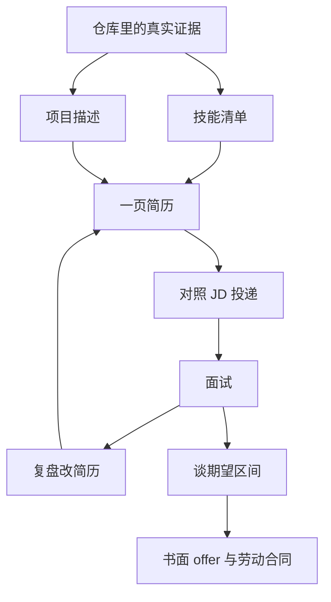

# Chapter 21 Audit

审计角色：Chapter-Audit-Agent-21  
范围：仅第 21 章求职及其明确列出的相关文件  
日期：2026-09-10  
正文：`chapters/21-job-hunting.md`（418 行）

独立原则：不沿用 `reviews/chapter-21-review.md` 的 99/94 分，不沿用 `_rereview-2026-09-09/stage-7-ch20-22.md` 的 93 分。旧审查只作线索。MiniShop 数字、非范围、pytest 基线均重新核验。

---

## 1. Coverage

禁止抽样。下表「应检查」来自正文 + 本章示意图 + 阶段测验中第 21 章题 + MiniShop 简历证据链。未检查必须为 0。

| 类型 | 应检查 | 已检查 | 未检查 |
| --- | ---: | ---: | ---: |
| 章内标题（含模板内标题） | 51 | 51 | 0 |
| 正文段落块 | 68 | 68 | 0 |
| 列表项 | 74 | 74 | 0 |
| 表格 | 3 | 3 | 0 |
| 代码围栏 | 3 | 3 | 0 |
| mermaid 流程图（节点+边） | 1 图 / 8 节点 | 1 / 8 | 0 |
| Linux / Shell 命令（章内新命令） | 0 | 0 | 0 |
| SQL | 0 | 0 | 0 |
| HTTP 报文示例 | 0 | 0 | 0 |
| 测试用例引用（qty=10/11） | 1 组 | 1 | 0 |
| Bug 示例引用（BUG-001） | 1 | 1 | 0 |
| 小练习题 | 10 | 10 | 0 |
| 小练习标准答案 | 10 | 10 | 0 |
| 工作实战必做项 | 5 | 5 | 0 |
| 工作实战模板槽位 | 6 节 | 6 | 0 |
| 常见错误 | 8 | 8 | 0 |
| 面试角度（含五段标签） | 3 | 3 | 0 |
| 检查清单勾选项 | 9 | 9 | 0 |
| 自测门槛 | 4 | 4 | 0 |
| 学习目标条 | 7 | 7 | 0 |
| 真实性原则 | 5 | 5 | 0 |
| 禁止句 | 3 | 3 | 0 |
| Markdown 链接 | 3 | 3 | 0 |
| 图片 PNG | 1 | 1 | 0 |
| 示意图 HTML | 1 | 1 | 0 |
| 阶段测验第 21 章相关题 | Q2 / Q4 / Q5 / Q6（Q9 交叉） | 5 | 0 |
| 一页简历草稿（审计员独立完成） | 1 | 1 | 0 |
| MiniShop 证据链（PRD / OpenAPI / pytest / BUG-001 / jmx / resume-evidence） | 6 | 6 | 0 |

**Coverage：100%。**

单元清单（均已读）：

- 元信息：标题、一句话核心、重要级别、主案例
- 开篇块：这一章解决什么问题 / 学习目标 / 前置知识 / 场景导入 + mermaid
- 21.1～21.7 全文
- MiniShop 工作实战（路径、必做 5、模板、完成标准）
- 常见错误 1～8、面试角度 3 题、小练习 1～10、答案 1～10
- 检查清单、自测门槛、总结 7 条、可运行性说明、参考资料、下一章预告
- `chapters/assets/diagrams/ch21-resume.png` + `ch21-resume.html`（`read_file` 打开）
- `chapters/quizzes/stage-7-career.md` 第 21 章题（先作答后对答案）
- `project/minishop/docs/resume-evidence.md`、`PRD.md`、`openapi.json`、`bugs/BUG-001.md`、`evidence/pytest-output.txt`、`jmeter/minishop-get-products.jmx`

---

## 2. 总评分

| 维度 | 分数 | 依据（压缩） |
| --- | ---: | --- |
| 技术准确性 | 8/10 | MiniShop 数字、非范围、qty、无 status、BUG-001 与仓库一致；未把禁止绝对化写成正说。扣在技能档口术语打架、默认「能使用 Postman/DevTools」、offer 与劳动合同并称。 |
| 岗位实用性 | 7/10 | 真实性原则是本章最有用的部分，能挡住假公司/假支付/假精通。扣在：未挡住「我独立开发了 MiniShop」；初级 JD「1～3 年」怎么处理；外包/派遣；谈薪示例自我贬低。 |
| 完整性 | 8/10 | 大纲 8 个主题都在。投递/薪资有纪律、缺做法；无仓库→简历字段表；无打码 JD 样例。 |
| 初学者友好度 | 7/10 | 菜单类比和四行结构清楚。学习目标「用过」无槽位；模板可整段抄 21.4；练习 4「不要出现订单状态名」会误删非范围句。 |
| 教学顺序 | 9/10 | 假简历 → 原则 → 结构 → 技能 → 四行 → JD → 复盘 → 谈薪 → 交草稿，坡度对；接 19/20、预告 22。mermaid 把谈薪画成「书面 offer 后再谈入职」，与 21.7 不一致。 |
| 代码质量 | 8/10 | 无新业务代码。mermaid 合法。作业模板的 JD 表只有表头、无分隔行，标准 Markdown 不能渲染成表。 |
| 实操质量 | 6/10 | 有产出路径和完成标准，类型却未标 📖。完成标准能挡住假公司，挡不住对着 21.4 抄而不打开仓库。与一句话核心「只写仓库里能指出来的东西」不对齐。 |
| 练习质量 | 7/10 | 10 题答案与独立作答一致，无 【ANSWER VERIFICATION FAILED】。练习 1/2/10 重复 21.1；练习 4 题干与示例口径拧着。 |
| 图片质量 | 7/10 | 左右对照命题正确，HTML/PNG 一致。1320×780 下半幅空白；没有「简历句子 → 仓库文件」图。 |
| **总体** | **67/100** | 无 P0。3 个 P1 打在技能槽、主作业和岗位归属。不是重写整章，但也不能叫小修后即可宣称求职收口干净。 |

发布线 90 是作者目标，不是本审计下限。本章非核心章（5/8/12/13/14/16/19），仍按事实给分。

---

## 3. P0

无。

未发现：把 MiniShop 写成公司项目（仅反例）、把支付/订单状态机/生产压测写成可写内容、把 GET/POST 安全神话或 Cookie 三选一或 P0 全球统一或 ROI 永远最高写成正说、pytest 数字与仓库不符、教伪造实习。

---

## 4. P1

## ISSUE
ID：CH21-0001
文件：`chapters/21-job-hunting.md`
章节：第 21 章
小节：学习目标；21.1；21.2 表「技能」；21.3；工作实战模板；检查清单；本章总结
精确位置：L22；L67；L91；L106–116；L225–227；L378；L399
原文：
> 把技能分成会做 / 用过 / 了解，并与课程梯队对齐
> 能独立完成的写“能使用/熟悉”；跟过教程的写“了解”
> 技能 | 分会做 / 了解
> **建议写成“能使用”（第一梯队）** … **建议写成“能使用”（第二梯队…）** … **建议写成“了解”（第三梯队）**
> - 能使用： / - 了解：
问题等级：P1
问题类别：PED / TERM
问题说明：技能档口至少三套，且「用过」从未给槽位。学习目标承诺三档（会做 / 用过 / 了解），正文把第一、第二梯队都标成「能使用」，第三梯队「了解」。21.1 又多出「熟悉」。模板只有两行。读者填简历时不知道第二梯队「跑过 pytest 但讲不清 fixture」该进哪一档，也不知道「用过」是不是比「了解」高一级。
为什么有问题：本章 ⭐⭐⭐ 的交付物就是技能清单。档口不统一会直接写出面试官追问时穿帮的一行。课程梯队是三档（大纲第一/二/三），简历技能被设计成两档（能使用 / 了解），这可以是有意压缩，但必须只保留一套词，并写明第二梯队的入档条件（已跑通才「能使用」，只跟过教程改「了解」）。
依据：`docs/COURSE_OUTLINE_v1.2.md` 三梯队；质量标准「术语准确」；本章一句话核心「简历只写仓库里能指出来的东西」。
建议修改：全书本章统一两档。删「用过」或给它一行并禁止写精通。
推荐替换文本：
```markdown
- 把技能分成会做（能使用）和了解两档，并与课程梯队对齐；不要写「用过」或「精通」。

**建议写成「能使用 / 会做」**
第一梯队（已练过、能讲步骤的）：……
第二梯队（仅当你已跑通第 16、19 章 pytest）：Python 处理 JSON、pytest + requests。

**建议写成「了解」**
第三梯队，以及只跟过教程、不能独立演示的：……
跟过 JMeter 教程但没在授权环境跑过：写了解，不写能使用。

## 技能
- 能使用（会做，能演示步骤）：
- 了解（第三梯队或只跟过教程）：
```

## ISSUE
ID：CH21-0002
文件：`chapters/21-job-hunting.md`
章节：第 21 章
小节：21.4；MiniShop 工作实战
精确位置：L135–140；L204–242
原文：
> 可直接改写的示例（数字请换成你本机结果）：
> MiniShop v1.0（个人项目）
> 完成需求评审、测试计划、用例和缺陷记录；对注册、登录、购物车库存边界、创建订单和权限做接口自动化（pytest + requests）。
> ## MiniShop（个人项目）   ← 模板下无四行槽、无文件路径
> 完成标准：…… MiniShop 数字可指向仓库。
问题等级：P1
问题类别：EX / JOB
问题说明：主作业是「一页诚实简历」，但模板的 MiniShop 节是空白标题，完成标准只禁假公司/状态机/压测/精通，不要求写出核对过的路径。21.4 又给了可整段复制的四行。审计员按「对着仓库填」独立写草稿时，必须离开本章去打开 `PRD.md`、`BUG-001.md`、`evidence/pytest-output.txt`、`jmeter/*.jmx`；按本章模板则可以 30 秒抄示例交卷。`practice/19-project-pack/README.md` 的 19-1 只检查仓库里**已有** PRD/用例/报告，并不证明学生自己写了测试计划。把示例里的「完成测试计划」抄进简历，是假技能的一种，比假公司更隐蔽。
为什么有问题：一句话核心是「简历只写仓库里能指出来的东西」。主实操验不出「指出来」。
依据：质量标准 §七（实操要练会该章那句话、验收能判断对错）、§十诚实证据；`practice/19-project-pack/README.md`；`practice/STATUS.md` 21-1 = Reader exercise。
建议修改：21.4 加「打开哪个文件抄哪一句」表；模板加四行槽 + 数字来源路径；完成标准要求至少三个仓库路径，且 `jmeter/` 未写成压测。
推荐替换文本：
```markdown
填项目段时打开这些文件，不要凭记忆补字段：

| 简历句子 | 打开 | 抄什么 |
| --- | --- | --- |
| 个人项目，不是任职 | `project/minishop/README.md` 首段 | 「个人软件测试实践」 |
| 库存规则、qty=10/11 | `docs/PRD.md` R-CART、R-CART-10 | 正整数、不超过当前库存 |
| 订单无 status、无支付 | `docs/PRD.md` 非范围与 R-ORDER | 成功只返回 id |
| 自动化数字 | 本机 `python3 run.py test`，对照 `evidence/pytest-output.txt` | 审查记录 37 passed / 1 xfailed，以你本机为准 |
| 开放缺陷 | `bugs/BUG-001.md` | 空搜索，未修复 |
| 不要写生产压测 | `jmeter/` 即使在目录里 | 教学 1 用户 1 圈，最多写了解 JMeter 元件 |

## MiniShop（个人项目）
- 这是什么（必须含「个人项目」）：
- 你做了什么（只写你自己做过的动作；课程仓库里的 PRD/计划/用例是教材材料，不是你的任职产出）：
- 关键规则（R-CART，qty=10/11）：
- 结果与边界（本机 pytest 数字 + BUG-001 + 不含支付/状态机/生产压测）：
- 数字来源路径：
```

## ISSUE
ID：CH21-0003
文件：`chapters/21-job-hunting.md`
章节：第 21 章
小节：21.1 原则 5；21.4
精确位置：L69；L128–140
原文：
> 5. **公开仓库与简历一致。** 若投递时附 GitHub，里面必须找得到 PRD、测试和 BUG-001。
> 1. 这是什么：个人软件测试实践，本机可运行的迷你电商。
> 2. 你做了什么：PRD 评审、用例、注册与登录、功能与接口测试、SQL、pytest、缺陷与报告。
问题等级：P1
问题类别：JOB / ACC
问题说明：禁止句挡住了「某某科技 / 已测通全部订单状态 / 精通 JMeter」，但没挡住课程毕业生最常见的两种写法：（1）「独立开发 MiniShop 前后端并完成测试」——`server.py` / `frontend/` 是教材代码；（2）简历 GitHub 填 `ycyue/software-testing-course` 或不加「课程实践」说明，让人以为提交人是 owner 或从零建仓。原则 5 只要求仓里有 PRD/测试/BUG-001，课程公开仓天然满足，起不到「这是你的作品」核验作用。
为什么有问题：面试深挖「你写的后端还是测的后端」时，按 21.4 示例无法自证边界。这比技能栏多一个 Logo 更致命，因为项目段是初级简历的唯一柱子。
依据：`project/minishop/README.md`「个人软件测试实践项目，不是企业工作系统」；根 `README.md` clone 地址；质量标准 §十「MiniShop 只能标注为个人软件测试实践项目」。
建议修改：原则 5 和 21.4 加两条硬禁令。
推荐替换文本：
```markdown
5. **公开仓库与简历一致，且所有权表述一致。** 附 GitHub 时必须能找到 PRD、测试和 BUG-001；必须标明这是课程个人实践。不要把教材的 `server.py` / `frontend/` 写成「独立开发」。不要把课程组织仓当成自己从零创建的作品仓（应 fork 后只提交你的评审/用例/缺陷/pytest 输出，或只贴 `exercises/`）。

禁止句补一条：
- 独立开发 MiniShop 电商系统 / 负责 MiniShop 后端架构
```

---

## 5. P2

## ISSUE
ID：CH21-0004
文件：`chapters/21-job-hunting.md`
章节：第 21 章
小节：练习 4；进入下一章的自测门槛第 3 条
精确位置：L326–328；L368；L390
原文：
> 写出 MiniShop 项目四行中“边界/非范围”那一行。不要出现订单状态名。
> 4. 示例：不含支付、订单状态字段和生产压测。
> 3. 项目描述不出现公司名和订单状态名；
问题等级：P2
问题类别：EX / PED
问题说明：21.4 要求非范围行写「无支付与订单状态字段」或「不含 status」。练习 4 和门槛却说「不要出现订单状态名」。零基础会把「订单状态字段」「不含 status」整行删掉，交白卷或只写「不含支付」。
为什么有问题：非范围句是防穿帮的关键句；题干把「禁止写待支付/已发货」和「禁止出现状态二字」混在一起。
依据：`PRD.md` 非范围「不定义待支付/已发货等状态名；创建成功只保证返回订单 id」；21.4 L133。
建议修改：题干改为必须出现非范围，禁止出现具体状态名。
推荐替换文本：
```markdown
### 练习 4
写出 MiniShop 四行中「结果与边界」那一行。必须出现非范围（不含支付，或订单响应不含 status）。禁止出现待支付、已发货、已完成等状态名，也禁止写「已测通全部订单状态」。

4. 示例：37 passed / 1 xfailed（BUG-001）；不含支付、订单 status 字段和生产压测。出现「不含 status」算对；出现「待支付/已发货」或「全状态」算错。
```

## ISSUE
ID：CH21-0005
文件：`chapters/21-job-hunting.md`
章节：第 21 章
小节：21.3
精确位置：L106–108
原文：
> **建议写成“能使用”（第一梯队）**
> 需求分析与评审、测试用例（含等价类/边界）、Web 功能测试、缺陷报告、HTTP 与 DevTools、SQL 核对、Linux 看日志、接口测试、Postman、MiniShop 实践。
问题等级：P2
问题类别：JOB / PRE
问题说明：同一节第二梯队有门闩「若你已跑通第 16、19 章」。第一梯队把 Postman、DevTools 默认放进「能使用」，但仓库对这两项的作者证据是 Incomplete：`practice/STATUS.md` 写明 Postman Runner 未点、DevTools 面板无截图。Linux/SQL/pytest 有可复核产物，Postman/DevTools 没有对等门闩。另：「MiniShop 实践」是项目不是技能，与清单其他项混放。
为什么有问题：技能清单是学生最容易整行复制的段落。抄完就变成「能使用 Postman / DevTools」，超过仓库可演示证据。
依据：`practice/STATUS.md` 10-1 / 14-1 Incomplete；质量标准 §十「不得把未执行的 GUI 写成已完成」。第二梯队已有「若已跑通」句式，第一梯队应同样加。
建议修改：第一梯队每项加「仅当你自己做过对应实操」。Postman/DevTools 写成「点过 GUI 才能写能使用，否则改了解」。MiniShop 从技能清单移到项目栏。
推荐替换文本：
```markdown
**建议写成「能使用 / 会做」（第一梯队，仅当你能讲步骤）**
需求分析与评审、测试用例（含等价类/边界）、Web 功能测试、缺陷报告、HTTP、SQL 核对、Linux 看日志、接口测试。
Postman、DevTools：只有你自己发过请求 / 打开过 Network 才写能使用；只看过章节步骤则写了解。
MiniShop 不进技能栏，进个人项目栏。
```

## ISSUE
ID：CH21-0006
文件：`chapters/21-job-hunting.md`
章节：第 21 章
小节：21.5 投递
精确位置：L146–163
原文：
> 功能测试 / 初级测试：主投。第一梯队对得上即可。
> 每天数量以你能复盘为准，而不是一天 80 封复制粘贴；
问题等级：P2
问题类别：JOB
问题说明：投递标 ⭐⭐⭐，正文约 18 行。不是话术（没有「您好我是xxx」邮件模板，这是优点），但是一份过短的纪律清单，缺初级测试市场里真正会卡住读者的判断：
1. 大量「初级/应届」JD 仍写 1～3 年经验——看到年限就放弃，或编年限，都是错的；应用本章三列看「是否真会」，不编工作年限。
2. 初级测试录用大量走外包/派遣/劳务，合同主体可能不是办公场地那家公司；21.7 只提五险一金，21.5 不提看清用人单位。
3. 培训机构「包就业 / 交证 / 培训贷」与「未授权帮对方测一测」是同一诚信轴，本章只写了后者。
4. 必做第 5 条要求「选一则真实 JD」，不给打码样例。没有招聘账号的人无法完成 ⭐⭐⭐ 作业。
为什么有问题：目标读者是零基础转初级。21.5 的匹配策略（功能主投、谨慎投测开）方向对，但执行时最先碰到的是年限和用工形式，不是「一天 80 封」。
依据：岗位视角；质量标准「实际工作适用性」优先于篇幅。外部市场材料（2026 校招测试模板、初级电商项目模板）普遍把课程作业包装成「支付/优惠券/状态流转」——正是本章要防的，但本章没把「年限栏」和「外包合同」写进投递纪律。
建议修改：21.5 加三条判断，并在工作实战附一则打码 JD（可先练，再换真实 JD）。
推荐替换文本：
```markdown
- JD 写「1～3 年」但岗位仍是初级功能测试：用三列核对会不会，不编工作年限，不把 MiniShop 写成 24 个月在职。
- 看清合同主体：正式劳动合同 / 劳务派遣 / 外包驻场不是同一件事；投递前按真实约束填，入职以合同文本为准。
- 不交培训贷、不交「就业保证金」、不把机构承诺薪资当市场区间。
```

## ISSUE
ID：CH21-0007
文件：`chapters/21-job-hunting.md`
章节：第 21 章
小节：21.7 薪资沟通；面试角度「期望薪资多少？」
精确位置：L185–200；L302–307
原文：
> 示例：“我了解的当地初级测试区间是 X～Y，结合我目前是个人项目+课程、没有实习，我的期望是 A～B，希望看书面总包。”
> 先做当地同类 JD 的区间功课
> 以**书面 offer** 为准
> 合同里的岗位名称、试用期、社保以文本为准
问题等级：P2
问题类别：JOB / TERM
问题说明：薪资节**不过时**：五险一金、口头数字不是合同、没有书面文件不辞职，2026 年仍然成立；不给全国工资表是正确纪律。问题是空泛 + 一处话术 + 一处概念合并：
1. 「当地调研」没有方法（看多少条同类 JD、记下样本日、不抄培训机构广告、区分税前月薪与年总包）。
2. 唯一示例是口播稿，并且主动用「没有实习」给自己打折。岗位上更稳的是报当地区间和能做的事，缺口等对方问。
3. 「书面 offer」与「劳动合同」并称。录用通知书是要约，劳动合同是《劳动合同法》第十条要求的书面合同。口头电话不能辞职，这条对；但 offer 邮件也不等于劳动合同。学生可能以为 HR 邮件就是合同。
4. 提到「试用期薪资」却不给合同阅读线索。现行《劳动合同法》第二十条：试用期工资不得低于相同岗位最低档或约定工资的 80%，且不得低于当地最低工资（人社部 2025-04 解读仍引用该条）。这不是工资表，是看合同时问什么。
5. 面试角度示例变成「先说已做调研，再等书面 offer」，21.7 正文却要求给出 A～B 区间，两处示范不一致。
为什么有问题：⭐⭐ 可以薄，但不能只剩一句可填空话术。
依据：`https://www.gov.cn/gongbao/content/2007/content_711013.htm` 《劳动合同法》第十、二十条；人社部 2025-04「试用期工资不能随便定」；司法实践区分录用通知书与劳动合同。
建议修改：示例去掉自我贬低；补三步调研；把 offer 和合同拆开；试用期 80% 作为「问合同」不是「报薪」。
推荐替换文本：
```markdown
调研（至少 8～10 条当地同类初级功能测试 JD，记下日期）：列出税前月薪区间，把明显培训广告剔除。谈法：给可接受区间 A～B，对应你能演示的第一梯队，不主动用「没实习」要求对方压价。书面录用通知可以当作入职前的要约，仍要等劳动合同文本看岗位、试用期、试用期工资、社保主体；没有劳动合同不要当成已经入职。试用期工资若低于约定工资 80% 或低于当地最低工资，按当地法规处理，本章不代替律师意见。
```

## ISSUE
ID：CH21-0008
文件：`chapters/21-job-hunting.md`
章节：第 21 章
小节：常见错误 1–3；练习 1、2、10；检查清单
精确位置：L246–258；L314–320；L355–357；L374–384
原文：错误 1 工作经历写 MiniShop / 错误 2 堆 Selenium JMeter K8s / 错误 3 全流程零缺陷；练习 1「为什么真实性更优先」；练习 10 再默写 21.1 四条。
问题等级：P2
问题类别：PED
问题说明：同一组禁止句（不造公司名 / 无支付与状态机 / 不写精通 JMeter）出现在开篇、21.1、21.4、完成标准、错误 1–3、练习 1/2/4/5/9/10、清单、总结。有教学必要，但密度把 21.5 JD 对照、21.6 复盘删句、21.7 不夸大项目这些**新动作**淹没了。
为什么有问题：读者会以为后半还有新规矩，其实只是 21.1 再贴一遍；该练的投递/复盘仍是清单。
依据：质量标准「后续章节只复习已有概念，不重复大段主讲」；本章学习目标第 5～7 条是投递、复盘、谈薪。
建议修改：错误 1–3 收成一条「对照 21.1，此处不展开」。练习 1 改成「抄出一句对不上仓库的话并指出文件」。练习 10 改成列出核对过的三个路径。
推荐替换文本：见 §16。

## ISSUE
ID：CH21-0009
文件：`chapters/assets/diagrams/ch21-resume.png`；`chapters/21-job-hunting.md` L58
章节：第 21 章
小节：21.1
精确位置：图 `ch21-resume.png`（1320×780）；正文 L58 alt
原文：alt「个人项目可以写，公司经历不能编」；图题「个人项目可以展示能力，不可以冒充任职」
问题等级：P2
问题类别：IMG / PED
问题说明：现图命题正确，但（1）画布下半约一半空白，信息密度低；（2）没有把 pytest 数字、BUG-001、PRD 非范围、`jmeter/`≠压测画进「可以写」；（3）与开篇 mermaid（仓库→简历→JD→面试）部分重叠。技能分档和证据地图这两个填简历时会填错的点，都没有图。
为什么有问题：21.1 的难点已经用左右对照讲清；21.4 的难点「对着仓库填」完全没图。
依据：质量标准 §七「图表确实帮助理解」；示意图 README 截图窗口 1320×780。
建议修改：本图可裁空白后 KEEP；优先另增 `ch21-evidence-map`（见 IMG 记录）。21.3 用三行表即可，不必第三张 PNG。
推荐替换文本：无（见图节）。

## ISSUE
ID：CH21-0010
文件：`chapters/21-job-hunting.md`
章节：第 21 章
小节：21.4；完成标准
精确位置：L66；L140；L242
原文：
> MiniShop v1.0 无支付、无订单状态机、未加压。
> 不含支付、状态机和生产压测。
问题等级：P2
问题类别：JOB / ACC
问题说明：禁止写「生产压测」对，但仓库里确实有 `project/minishop/jmeter/minishop-get-products.jmx`（1 thread / 1 loop，注释写 Not an SLA）。学生列目录时会把「有 jmeter 文件夹」写成「做过性能测试」。21.3 把 JMeter 放在了解，完成标准只禁「精通 JMeter」，不禁「用 JMeter 对 MiniShop 做了性能测试」。
为什么有问题：与第 18 章诚实披露「未安装、未跑 GUI」相比，第 21 章作为简历章更需要把目录存在 ≠ 做过压测写死。
依据：该 jmx 文件；`practice/STATUS.md` 18-1 Incomplete；`project/minishop/docs/test-report.md`「性能：未加压」。
建议修改：21.4 对照表加一行，完成标准加「`jmeter/` 未写成压测或精通」。
推荐替换文本：见 CH21-0002 表最后一行。

## ISSUE
ID：CH21-0011
文件：`chapters/21-job-hunting.md`
章节：第 21 章
小节：场景导入 mermaid；21.7
精确位置：L42–52；L185–192
原文：
> F[面试] --> H[书面 offer 后再谈入职]
> 场景：面试末尾或 HR 电话。
问题等级：P2
问题类别：SEQ
问题说明：流程图把「谈入职」放在书面 offer 之后；21.7 把谈薪放在面试末尾或 HR 电话（offer 前）。真实流程通常是：期望区间在面试/HR 电话出现 → 书面 offer → 对合同条款 → 入职。mermaid 跳过谈薪节点，也没有 G（复盘）回到 D（简历）的回边。
为什么有问题：场景导入是全章地图。地图和 ⭐⭐ 节方向相反，初学者会按图等到 offer 后再说期望，和 HR 常见问法冲突。
依据：21.7 正文 L191；本章面试角度 L302–307。
建议修改：H 改为「谈期望区间（面试/HR）」；书面 offer/合同作为 F 之后的独立节点；G --> D。
推荐替换文本：


---

## 6. P3

## ISSUE
ID：CH21-0012
文件：`chapters/21-job-hunting.md`
章节：第 21 章
小节：MiniShop 工作实战
精确位置：L204
原文：`## MiniShop 工作实战：一页简历草稿 ⭐⭐⭐`
问题等级：P3
问题类别：PRE
问题说明：质量标准 §七要求实操写清类型（✅ / 📖 / 🚧）。`practice/README.md` 已标 21-1 为 📖，章内未标。产出路径和完成标准在，类型图标缺。
依据：`standards/QUALITY_STANDARD_v1.0.md` §七；`practice/README.md` L81。
建议修改：标题改为「MiniShop 工作实战：一页简历草稿 📖 ⭐⭐⭐」，并加一句「书面实操，无新脚本」。
推荐替换文本：`## MiniShop 工作实战：一页简历草稿 📖 ⭐⭐⭐`

## ISSUE
ID：CH21-0013
文件：`chapters/21-job-hunting.md`
章节：第 21 章
小节：工作实战模板「JD 对照」
精确位置：L238–239
原文：
```
## JD 对照
| 要求 | 是否真会 | 简历对应 |
```
问题等级：P3
问题类别：EX / CODE
问题说明：Markdown 表需要分隔行 `| --- | --- | --- |`。模板只有表头，GitHub/多数渲染器不会当成表。必做第 5 条要求至少五行，学生在坏表头下填，作业难看且难批。
依据：CommonMark 表格扩展。
建议修改：补分隔行，并预留一行示例结构。
推荐替换文本：
```markdown
| 要求 | 是否真会 | 简历对应 |
| --- | --- | --- |
| （至少五行） |  |  |
```

## ISSUE
ID：CH21-0014
文件：`chapters/21-job-hunting.md`
章节：第 21 章
小节：参考资料
精确位置：L409–413
原文：
> 本仓库 `project/minishop/docs/resume-evidence.md`
> [全局内容质量标准](../standards/QUALITY_STANDARD_v1.0.md)
问题等级：P3
问题类别：LINK
问题说明：第 19、20 章和质量标准是可点击相对链接，`resume-evidence.md` 只是仓库根路径的反引号。从 `chapters/` 打开本章时点不进去。文件本身存在。
依据：同节另外三条已用相对链接。
建议修改：改成 `[简历证据（诚实写法）](../project/minishop/docs/resume-evidence.md)`。
推荐替换文本：`- 本仓库 [简历证据（诚实写法）](../project/minishop/docs/resume-evidence.md)`

## ISSUE
ID：CH21-0015
文件：`chapters/21-job-hunting.md`
章节：第 21 章
小节：21.2 表「标题与联系方式」
精确位置：L89
原文：`身份证号、教学弱口令、无关生活照要求以外的信息`
问题等级：P3
问题类别：TERM
问题说明：宾语缠绕。本意是「除岗位明确要求照片外，不要附生活照和其他无关信息」，读成「写要求以外的信息」。教学弱口令未点名 `Test1234`，零基础不一定知道那四个字指什么。
依据：本章场景是投递简历；根 README 教学密码 `Test1234`。
建议修改：拆开写。
推荐替换文本：`身份证号、教学账号密码（如 Test1234）、家庭住址门牌；除非 JD 明确要求，不要生活照`

## ISSUE
ID：CH21-0016
文件：`chapters/21-job-hunting.md`；`project/minishop/docs/resume-evidence.md`
章节：第 21 章
小节：21.4 示例 vs 仓库诚实写法
精确位置：正文 L137–140；`resume-evidence.md` L5
原文：
> 完成需求评审、测试计划、用例和缺陷记录
> 完成 PRD 评审、覆盖矩阵、用例、接口自动化（pytest）和缺陷记录
问题等级：P3
问题类别：ACC
问题说明：同仓库两份「可写」摘要不完全一样。21.4 有测试计划、无覆盖矩阵；`resume-evidence.md` 相反。两者都可以是学生做过的动作，但「可直接改写」和「诚实写法」应对同一组文件。与 CH21-0002 叠加后，抄哪一份都会漏一项或超一项。
依据：两文件原文。
建议修改：21.4 示例与 `resume-evidence.md` 对齐，并加「只写你核对过的文件名」。
推荐替换文本：以对照表为准，两处都改成「PRD 评审、用例、接口自动化、缺陷记录；覆盖矩阵/测试计划仅当你自己写过或逐条核对过再写」。

## ISSUE
ID：CH21-0017
文件：`chapters/21-job-hunting.md`
章节：第 21 章
小节：21.2；工作实战保存路径
精确位置：L98；L206–209
原文：`文件名用 姓名-初级测试-城市.pdf` / `保存：exercises/chapter-21-resume.md`
问题等级：P3
问题类别：PED
问题说明：作业交 Markdown，投递用 PDF，中间没有一句「作业用 md，对外再导出 PDF」。有人会交 pdf 到 exercises，或以为 md 就是投递件。
依据：21.2 L98；工作实战 L208。
建议修改：加一句分工。
推荐替换文本：`作业保存为 exercises/chapter-21-resume.md。对外投递再导出黑白 PDF，文件名 姓名-初级测试-城市.pdf。`

## ISSUE
ID：CH21-0018
文件：`chapters/21-job-hunting.md`
章节：第 21 章
小节：面试角度「期望薪资多少？」示例
精确位置：L307
原文：`示例：先说已做当地调研，再等书面 offer。`
问题等级：P3
问题类别：PED
问题说明：与 21.7「给可接受区间 A～B」不完全同向。可并入 CH21-0007，单列是为了改面试角度那一行。
依据：21.7 L192。
建议修改：示例改成「给出当地调研后的 A～B，并说明以书面 offer 和劳动合同为准」。
推荐替换文本：`示例：当地初级功能测试我看到的区间是 A～B，我的期望在这个区间内，最终以书面 offer 和劳动合同为准。`

---

## 7. 逐段问题

凡未单列 ISSUE 的单元，结论为通过或「通过，附观察」。观察不是新问题。

### 元信息（L1–6）

- 标题与大纲第 21 章一致。
- 一句话核心「简历只写仓库里能指出来的东西」能当过滤器，合格。
- ⭐⭐⭐ 与主案例「MiniShop 个人软件测试实践项目」与全书口径一致。通过。

### 这一章解决什么问题（L8–14）

- 正确接到第 19、20 章。
- 点名三类穿帮：公司经历、精通、支付/全部订单状态。与 PRD 非范围一致。
- 「不给无法核验的行业平均工资表，不教伪造实习」与 21.7 一致，正确。通过。

### 学习目标（L16–26）

- 7 条覆盖原则、一页结构、技能、项目、投递、复盘、谈薪，对大纲。
- L22「会做 / 用过 / 了解」→ CH21-0001。
- 前 50 行信息密度高，但没有 5 个新术语要同时会。观察：略满，不另开 ISSUE。

### 前置知识（L28–32）

- 要求已完成 19、20，能介绍范围、BUG-001、pytest。合理。
- 「不要求已有企业实习」与目标读者一致。通过。

### 场景导入（L34–52）

- 假技能栏（精通 Python/pytest/Selenium/JMeter/CI/CD + 订单全状态与性能保障）是真假简历，能引出本章。
- 「空搜索怎么测 / 订单 status 在哪 / JMeter 脚本在哪」三问对准仓库。通过。
- mermaid 语法合法，主链正确。H 节点与 21.7 冲突 → CH21-0011。
- 与 PNG 都在讲真假，有重叠，无口径打架。观察。

### 21.1 简历真实性原则（L56–77）

- 五条原则可操作，禁止句与第 19、20 章、`resume-evidence.md`「不可用」三条同向。
- 原则 2「未加压」正确（test-report 性能栏为未加压）。
- 原则 4 数字可复核：本审计跑 pytest 得 `37 passed, 1 xfailed`，与 L68、`evidence/pytest-output.txt` 一致。通过。
- 原则 3「能使用/熟悉」→ CH21-0001。
- 原则 5 GitHub → CH21-0003。
- 生活类比（菜单）有效。通过。
- 插图见 §9。

### 21.2 简历结构（L81–98）

- 一页、先扫技能和项目、黑白可复制文本、日期年-月、文件名规则，均符合初级投递常识。通过。
- 表六块：标题/意向/技能/项目/教育/可选，不写项具体。通过。
- 「同时投测开、性能专家却无证据」与 21.5 谨慎投测开同向。通过。
- 「期望薪资可写面议」：部分网申强制填数字，21.7 已把细节放到沟通环节，可接受。观察。
- 联系方式病句 → CH21-0015。
- 技能列「会做/了解」→ CH21-0001。
- pdf vs md → CH21-0017。
- 缺「课程项目如何写日期（学习月份，禁止写成 24 个月在职）」——并入 CH21-0006 的年限条，不另开。

### 21.3 技能清单（L102–120）

- 与大纲三梯队整体对齐；第二梯队有「若已跑通 16、19」门闩，诚实。通过（结构）。
- 双「能使用」标题 + 用过悬空 → CH21-0001。
- Postman/DevTools 默认能使用 → CH21-0005。
- 「P0/P1 不要写成精通业界优先级标准」「Cookie/Session/Token 不要写成三种登录技术精通」正确，对准质量标准禁止项。通过。
- 「Java/Appium/微服务治理，没练过就留空」正确。通过。
- 了解栏含「CI 在做什么」：仓库无 `.github/workflows`，第 17 章 YAML 标明示例结构，放了解合适。通过。
- 了解栏「pytest-html」：`requirements.txt` 有 `pytest-html==4.2.0`，`evidence/pytest-report.html` 存在；写成了解偏保守，可接受。观察。
- 「JMeter 元件名称」放了解，与未跑 GUI 一致。通过。与 CH21-0010 的缺口是项目段不是技能段。

### 21.4 MiniShop 项目描述（L124–142）

- 「放在个人项目，不要放进工作经历」硬约束正确。通过。
- 四行结构（是什么 / 做了什么 / 规则 / 结果与边界）可教。通过。
- 规则：正整数且不超过当前库存；等于库存允许。与 R-CART、R-CART-10 一致。通过。
- 示例含注册、登录、购物车、订单、权限，与 `resume-evidence.md`、PRD 范围、`tests/test_register.py` 一致。旧审查「漏注册」在现行正文已修，**不再报**。
- 示例含「订单成功响应含 id、不含 status」。`tests/test_api.py` `test_create_order_returns_id` 断言 `"status" not in body`；OpenAPI POST `/api/orders` 201 为 Created id。通过。
- 数字 37/1 与本机 pytest、`evidence/pytest-output.txt` 末行一致。通过。
- qty=10/11 与 `test_cart_qty_cases` ids `eq_stock`/`over_stock` 及 R-CART-10 一致。通过。
- 非范围：无支付、无状态机、无生产压测。通过。
- 示例可整段抄、未列仓库路径、未禁「独立开发」→ CH21-0002、CH21-0003。
- 示例写「测试计划」vs resume-evidence 写「覆盖矩阵」→ CH21-0016。
- 相对 `test_cart_qty_cases` 的 null/空串/错误类型，示例只写 10/11，是压缩不是错误。观察。

### 21.5 投递（L146–163）

- JD 三列（要求 / 是否真会 / 简历哪一行）是真方法，不是话术。通过。
- 「对不上的要求不要为过筛加假技能」对准一句话核心。通过。
- 匹配策略：功能主投、接口要有 pytest+SQL、测开/性能在第三梯队只了解时谨慎投「独立负责框架」，方向正确，有分寸。通过。
- 「一天 80 封」是在打培训班海投，不是教学生一天投 80。通过。
- 内推仍要真实简历；未授权系统不帮测；附件与网申一致。通过。
- 缺口 → CH21-0006。结论：投递节**不像话术**，像过短清单。

### 21.6 面试复盘（L167–181）

- 表五列可执行。通过。
- 「不是给自己打表现 80 分」「同一道库存题答不好就回去跑 qty=10/11」把复盘接到仓库，好。通过。
- 「不要把一次失败解释成测试行业不需要诚实」价值高。通过。
- 被禁句淹没的观感 → CH21-0008。本节本身通过。

### 21.7 薪资沟通（L185–200）

- ⭐⭐ 合适。
- 拒绝全国工资表正确，不过时。
- 「口头数字不等于合同」「没有书面 offer 前不辞职、不在朋友圈宣布」作为职业纪律正确。
- 「以内地常见用工沟通为背景，具体以当地法规和合同为准」免责合适。
- 空泛、话术、offer≠劳动合同、试用期 80% 未作为阅读线索 → CH21-0007。
- 纪律第 2 条「不要承诺未授权加班测试或隐瞒项目范围」把谈薪和真实性连上，好。通过（该条）。

### MiniShop 工作实战（L204–242）

- 路径 `exercises/chapter-21-resume.md` 与 `exercises/README.md` 一致。通过。
- 必做 5 条能对应 21.2～21.5。通过（意图）。
- 完成标准能挡住假公司/状态机/压测/精通 JMeter/CI。通过（能挡住的部分）。
- 挡不住抄 21.4、不写路径、把教材代码写成自研 → CH21-0002、CH21-0003。
- 未标 📖 → CH21-0012。
- JD 表无分隔行 → CH21-0013。
- 模板技能只有两行，无「用过」→ CH21-0001。
- 无四行小标题 → CH21-0002。
- `exercises/` 目录目前只有 README，不预置 `chapter-21-resume.md`，符合「学习者自己保存」约定。通过。

### 常见错误 1–8（L246–277）

| 错误 | 判断 |
| --- | --- |
| 1 MiniShop 进工作经历 | 对。与 21.1 重复 → CH21-0008 |
| 2 堆 Selenium/JMeter/K8s | 对 |
| 3 全流程零缺陷 | 对；「通过不等于无缺陷」对准 ISTQB 测试原则（测试能显示缺陷存在，不能证明没有） |
| 4 为 JD 补精通接口自动化 | 对，是新动作 |
| 5 海投不复盘 | 对，是新动作 |
| 6 口头薪资当 offer | 对，是新动作 |
| 7 简历写 P0 标准、GET 更安全、三种登录技术 | 对；禁止项与质量标准一致，未当正说 |
| 8 公开仓与简历数字不一致 | 对 |

错误 7 写「GET 更安全」是作为反例，不是教这条。通过。

### 面试角度（L282–307）

- 声明「结论 → 原理 → 场景 → 示例 → 边界」，三题五段标签齐全（大纲第 21 章没有「所有答案必须五段」硬句，比第 20 章松）。通过。
- 「为什么是个人项目」：结论正确，示例回到 qty=11 和 BUG-001。通过。
- 「你会哪些技能」：示例偏瘦（只举用例/缺陷/SQL/Postman/pytest），第一梯队的需求/Web/HTTP/Linux 未出现，可接受为示例不是穷尽。观察。
- 「期望薪资」示例弱于 21.7 → CH21-0018 / CH21-0007。

### 小练习与答案（L312–370）

见 §11。无答案错误。练习 4 题干 → CH21-0004。练习 1/10 重复 → CH21-0008。

### 检查清单与门槛（L374–391）

- 9 条可勾，能对应原则/一页/分档/个人项目/JD/复盘/口头薪资/公开材料/草稿。通过。
- 门槛要求练习 2、4、7、9 能用自己的话回答，选得对（放置、非范围、口头薪资、选择题）。通过。
- 门槛 3「不出现订单状态名」→ CH21-0004。
- 「完成 exercises/chapter-21-resume.md」与实战路径一致。通过。

### 总结 / 可运行性 / 参考 / 预告（L393–418）

- 总结 7 条与学习目标同构。通过。
- 可运行性说明：无新业务代码，引用 19 章已验证结果，未投递真实职位，未提供工资表。诚实。通过。
- 本审计复跑 pytest，引用成立。
- 参考三章+标准+resume-evidence：19/20/标准链接可解析。resume-evidence 裸路径 → CH21-0014。
- 下一章预告第 22 章学习路线、求职主线收束、不展开新大型基础章，与大纲一致。未审第 22 章正文。通过。

### 阶段测验（仅第 21 章题）

见 §11。Q2/Q4/Q5/Q6 与本章同向。Q1/Q3/Q7/Q8/Q10 属 20/22，本 Agent 不审他章正文。Q9 与错误 7 同向，交叉核对通过。

---

## 8. 代码问题

本章无 Python / SQL / curl / HTTP 报文。

| 块 | 位置 | 结论 |
| --- | --- | --- |
| mermaid flowchart TD | L42–52 | 语法合法，节点 8 个。语义问题见 CH21-0011。 |
| ```text exercises/chapter-21-resume.md``` | L208–210 | 路径与 exercises 约定一致。 |
| 简历 Markdown 模板 | L220–240 | 结构可用。JD 表缺分隔行 → CH21-0013。MiniShop 节无四行槽 → CH21-0002。 |

未发现可运行代码隐藏依赖或未教授语法。

---

## 9. 图片问题

IMG-CH21-001
文件：`chapters/assets/diagrams/ch21-resume.png`（源 `ch21-resume.html`，主题 `_theme.css`）
出现位置：`chapters/21-job-hunting.md` L58，21.1 下
图片主要内容：左右对照。左「可以写」个人项目 MiniShop v1.0（PRD 评审、库存边界、pytest、开放缺陷 BUG-001）。右「不可以写」公司 / 精通 / 零缺陷（某某科技核心系统；精通 JMeter；全流程零缺陷上线；已测通全部订单状态）。标题「个人项目可以展示能力，不可以冒充任职」。导语「技能栏只写真正做过的。公开仓库和简历数字必须对得上。」脚注「投出去发现写错，立刻改并说明。诚信优先于投出份数。」
技术准确性：正确。未把支付、状态机、压测放进「可以写」。pytest / BUG-001 与仓库一致。
与正文一致性：对准 21.1 原则与禁止句。未画 21.4 的文件路径。
文字是否正确：与 HTML 逐句一致。alt「个人项目可以写，公司经历不能编」是压缩版图题，能当一句教学，与 h1 不完全相同，可接受。
UI 是否过时：概念示意图，无产品 UI。
教学价值：讲清本章最难点（个人项目 ≠ 任职）。不讲「对着仓库填」。
可读性：1320×780，内容集中在上半，下半空白。字号在 PNG 中可读。
是否需要修改：裁空白；证据地图应另图，不替换本图。
修改建议：按 `diagrams/README.md` 截图流程重截或裁切；另增 `ch21-evidence-map.html/png`：盒子为 `evidence/pytest-output.txt`、`bugs/BUG-001.md`、`docs/PRD.md` R-CART/R-ORDER、简历「个人项目」栏（禁止箭头指向工作经历）、`jmeter/*.jmx` 标「了解，不是生产压测」。
最终结论：KEEP（命题保留）+ 建议另增证据地图；若只允许动这一张，则 MODIFY（裁空白，不改文案）

HTML 已读：lang=zh-CN，kicker/h1/lead/caption 与 PNG 可见文字一致，无错别字，无过期按钮文案。

---

## 10. 表格问题

| 表 | 位置 | 结论 |
| --- | --- | --- |
| 简历结构 块 / 写什么 / 不写什么 | L87–94 | 列设计对。联系方式「不写」单元格病句 → CH21-0015。技能「会做/了解」→ CH21-0001。 |
| 复盘表 项 / 写什么 | L171–176 | 五列够用，能导向改材料而不是打分。通过。 |
| JD 对照模板 | L238–239 | 缺分隔行 → CH21-0013。无示例行。 |

无表内技术数字错误。无把 P0 写成全球标准的表。

---

## 11. 练习与答案问题

### 11.1 工作实战：审计员独立完成的一页草稿

先做后评。数字来自本机 2026-09-10 复跑 pytest，以及打开的仓库文件，不是抄 21.4。

```markdown
# 简历草稿

## 意向与联系方式
姓名：（示例，不写真实证件号）
意向：初级功能测试工程师
城市：本地　电话/邮箱：（占位）
公开材料：若附 GitHub，只贴个人 fork 或 exercises，README 标明「课程个人实践，非任职、非独立开发」

## 技能
- 能使用（能演示步骤）：需求评审、等价类/边界用例、Web 功能测试、缺陷报告、HTTP 观察、SQL JOIN 核对购物车、Linux grep 日志、接口测试、pytest + requests（本机已跑通第 16/19 章）
- 了解：测试分层、Playwright 与 Selenium 差别、pytest-html、CI 会跑测试、性能测试指标与授权纪律、JMeter 元件名称
- 留空：Java、Appium、K8s、微服务治理、精通 JMeter/CI

## MiniShop（个人项目）
- 这是什么：个人软件测试实践，本机可运行的迷你电商；不是公司系统，前后端代码来自课程仓库，我做的是测试。
- 你做了什么：按 PRD 做评审与用例；测注册/登录/购物车库存边界/创建订单/权限；SQL 交叉验证；pytest + requests 接口回归；记录开放缺陷。
- 关键规则：数量为正整数且不超过当前库存；`SKU-DEMO-001` 库存 10 时 qty=10 通过、qty=11 拒绝（`docs/PRD.md` R-CART / R-CART-10）。
- 结果与边界：本机 pytest 37 passed / 1 xfailed；xfail 对应 BUG-001（空/空白关键字仍返回全量商品）。订单成功响应含 id、不含 status。不含支付、状态机、生产压测。`jmeter/minishop-get-products.jmx` 为 1 用户 1 圈教学骨架，不写成压测。
- 数字来源：`project/minishop/evidence/pytest-output.txt`（本机复跑同为 37 passed, 1 xfailed）；缺陷 `bugs/BUG-001.md`；非范围 `docs/PRD.md`。

## 教育/培训
本课程《软件测试从零基础到初级测试工程师》（个人实践，非正式学位认证）

## 删掉的句子
1. 某某科技有限公司电商部门核心系统测试工程师
2. 精通 JMeter 分布式与 CI/CD，独立负责公司自动化平台
3. 独立开发 MiniShop 并已测通全部订单状态、全流程零缺陷上线

## JD 对照
（打码后的真实结构：某本地软件公司「初级功能测试工程师」）

| 要求 | 是否真会 | 简历对应 |
| --- | --- | --- |
| 1～3 年测试经验 | 不会编年限；只有课程实践 | 教育/培训；不写工作经历 |
| 等价类/边界用例 | 会，能演示 qty=10/11 | 技能能使用；项目关键规则 |
| 缺陷报告 | 会，有 BUG-001 | 项目结果行 |
| HTTP / Postman | HTTP 能讲方法路径头体；Postman 若只读过章节则写了解 | 技能分档，不写精通接口 |
| SQL | 会 JOIN 核对购物车 | 技能能使用 |
| 电商项目优先 | MiniShop 个人实践，无支付/状态机 | 个人项目栏 + 非范围 |
| Python / pytest 优先 | 已跑 37/1 | 第二梯队能使用 |
| JMeter / 性能优先 | 只了解元件，未加压 | 了解；不投「独立负责性能」 |
| 测试环境驻场 | 按真实约束填 | 投递纪律，不空许诺 |
```

用本章完成标准自检：无公司冒充、无订单状态机、无生产压测、无精通 JMeter/CI；数字可指向仓库。**模板本身不能逼出上述路径行**——这是 CH21-0002 的证据，不是学生不会。

### 11.2 小练习：独立作答 → 对答案

| 题 | 独立答案 | 教材答案 | 结论 |
| --- | --- | --- | --- |
| 1 | 面试按简历深挖；假技能/假雇主指不到仓库，伤害大于空白实习 | 同向 | 通过。题本身重复 21.1 → CH21-0008 |
| 2 | 个人项目栏。放进某公司工作经历 = 伪造任职 | 同向 | 通过 |
| 3 | 能使用 pytest+requests 做接口回归；了解 JMeter 元件和 CI 会跑测试。删除精通 | 同向，且点名不得保留精通 CI | 通过 |
| 4 | 不含支付、订单 status 字段和生产压测（不写待支付/已发货） | 示例：不含支付、订单状态字段和生产压测 | 答案可接受。题干「不要出现订单状态名」与答案里「订单状态字段」拧着 → CH21-0004。**不是 ANSWER VERIFICATION FAILED**（答案本身对） |
| 5 | 状态机是核心要求则不硬投；简历仍只写 v1.0，不补状态机 | 同向 | 通过 |
| 6 | 项目描述补 BUG-001；口述加空搜索；必要时重跑 | 同向 | 通过 |
| 7 | 不能据此辞职。书面 offer + 劳动合同 | 不能。以书面 offer 和合同为准 | 通过。概念合并见 CH21-0007，答案方向仍对 |
| 8 | 把课程反对的绝对化写成技能，深挖会穿帮（P0 不统一、GET/POST 非保密分类、Cookie/Session/Token 不同层） | 同向，并指向第 8、9、5 章 | 通过。P0 也在第 6 章，不构成答案错误 |
| 9 | B | B | 通过。A 假公司+全状态；C 精通压测；D ROI 永远最高 |
| 10 | 自检个人项目声明、可复核数字、非范围、无虚构公司 | 同向 | 通过。重复 21.1 → CH21-0008 |

无 【ANSWER VERIFICATION FAILED】。

### 11.3 阶段测验第 21 章题（先作答后对答案）

覆盖声明：阶段 7 共 10 题，属 20+21+22。本 Agent 只独立作答并核对第 21 章题。

| 题 | 独立答案 | 公布答案 | 结论 |
| --- | --- | --- | --- |
| Q2 不超过四句介绍 MiniShop | 个人项目 MiniShop v1.0；库存正整数且不超过当前库存（10 过 11 拒）；pytest 接口回归；已知空搜索 BUG-001。无公司名、无待支付/已发货 | 示例含个人项目、库存边界、pytest、已知空搜索；不要公司名和订单状态名 | 通过。与 21.4 一致（现行正文已含注册，测验示例写「注册登录」不冲突） |
| Q4（必过）技能栏「精通 JMeter / 独立负责 CI」可以吗 | 不可以。17/18 是概览，仓库未跑 JMeter GUI、无 CI 流水线 | 不可以。只能写真正做过、真正授权过的范围 | 通过 |
| Q5 pytest 数字从哪来 | 本机最近一次 pytest；审查基线 37 passed / 1 xfailed；可对 `evidence/pytest-output.txt` | 同向 | 通过。本机复跑确认 37/1 |
| Q6 投出后发现写成公司项目 | 立刻改已投材料并如实说明，不靠份数硬扛 | 立刻改正并如实说明。诚信优先于投出份数 | 通过 |
| Q9 交叉 | D（测试不能证明系统没有缺陷）。A/B/C 为质量标准禁止项 | D | 通过。与错误 7、练习 9 同向 |

Q1/Q3/Q7/Q8/Q10 不在本章正文审计范围（口述五段、没找到 Bug、入职后清单/三张表、行为面试结构、还不会的三件事）。不审第 20、22 章正文。

---

## 12. 初学者理解障碍

标记 【Beginner Friction】：

1. **三套技能词**（CH21-0001）。零基础会在「会做 / 用过 / 了解 / 能使用 / 熟悉」里选一个看起来最满的词。
2. **模板对着 21.4 抄**（CH21-0002）。空白 MiniShop 节 + 「可直接改写的示例」= 最短路径是复制。作业交得出，验不出「打开了仓库」。
3. **练习 4「订单状态名」**（CH21-0004）。刚学会写「不含 status」，下一题又说不要出现订单状态。
4. **没有第一份打码 JD**（CH21-0006）。必做第 5 条假设学生已经在用招聘 App。
5. **谈薪 X～Y 不知道去哪查**（CH21-0007）。唯一示范是填空口播。
6. **「教学弱口令」**（CH21-0015）未点名 Test1234。
7. **md 作业 vs pdf 投递**（CH21-0017）。
8. mermaid「书面 offer 后再谈入职」（CH21-0011）会让人以为面试当场不要说区间。

未构成摩擦、对零基础友好的部分：菜单类比、假简历开场、四行结构、禁止句具体、不给假工资表、不要求实习。

质量标准「每个重要知识点回答是什么/为什么/何时/怎么用/常见错」：21.1～21.4 基本满足；21.5、21.7 的「怎么用」不足。

---

## 13. 岗位能力缺口

标记 【Job Reality Gap】：

1. **课程代码 vs 自研**（CH21-0003）。初级面试官第一问常常是「这项目你写的还是测的」。
2. **「1～3 年」JD**（CH21-0006）。应届/转行最常见的筛选行。不教就会编年限或全都不投。
3. **外包 / 派遣 / 劳务 vs 劳动合同**（CH21-0006、CH21-0007）。初级测试入职极常见；只说五险一金不够。
4. **技能默认能使用 Postman/DevTools**（CH21-0005）。现场「你打开 Postman 发一条」会穿帮。
5. **jmeter 目录 ≠ 压测**（CH21-0010）。
6. **谈薪自我贬低**（CH21-0007）。没实习不是开价理由，是被问到再诚实说。
7. **ATS / 关键词**：本章正确禁止为过筛造假，但没说「用 JD 里你真会的词替换同义词」（例如 JD 写接口测试，你做了 Postman+pytest，应用 JD 的词而不是发明「精通」）。观察，未升 P2。
8. **培训机构简历模板**（外部 2026 年仍大量教「支付回调、订单状态流转、效率提升 40%」）。本章禁止句能打掉这些，但没点名「不要抄网文项目模板」。可在错误 4 后加一句。观察。

本章做对的岗位教育：个人项目声明、数字可复核、口头薪资不是 offer、未授权不帮测、内推不造假、通过 ≠ 无缺陷。这些应保留。

---

## 14. 建议删除内容

- 常见错误 1–3 的展开（保留一条「对照 21.1」）。
- 学习目标里的「用过」（若坚持两档技能）。
- 练习 1、练习 10 的默写式提问（改成路径核验，见下）。
- 不要删禁止句本身，不要删个人项目声明，不要删 37/1 与 BUG-001，不要删「不提供全国工资表」。

---

## 15. 建议新增内容

1. 21.4 仓库字段对照表（CH21-0002）。
2. 工作实战四行槽 + 数字来源路径 + `jmeter/` 行。
3. 硬禁令：不写独立开发教材代码；GitHub 标明课程实践（CH21-0003）。
4. 投递：1～3 年 JD、合同主体、培训贷（CH21-0006）；附一则打码 JD。
5. 薪资：调研步骤、总包 vs 月薪、offer ≠ 劳动合同、试用期 80% 作为阅读线索（CH21-0007）。
6. 示意图 `ch21-evidence-map`（CH21-0009）。
7. 21.3 三行技能表（会做 / 了解 / 留空），代替第二张技能 PNG。

---

## 16. 建议重写内容

### 21.3 标题

两档，第二梯队并入「能使用」并保留门闩；第三梯队和只跟过教程进「了解」。全文消灭「用过」「熟悉」或给唯一定义。

### 工作实战模板

按 CH21-0002 推荐文本重写 MiniShop 节和完成标准。

### 练习 4 与门槛 3

按 CH21-0004。

### 练习 1 / 10

```markdown
### 练习 1
打开你的草稿，抄出一句如果面试官要看仓库你会删掉的话，并写它对不上哪个文件。

### 练习 10
在 MiniShop 段落后列出你核对过的三个路径（pytest 输出、BUG-001、PRD 非范围）。缺路径即未完成。
```

### 21.7 示例

去掉「没有实习所以请压价」。补调研方法和合同阅读清单。面试角度示例与此对齐。

### 错误 1–3

收成：

```markdown
### 错误 1：假公司、假范围、假精通
对照 21.1 五条和禁止句。MiniShop 只放个人项目；不写支付/订单状态机/生产压测；第三梯队不写精通。此处不重复展开。
```

其后原错误 4–8 顺延为 2–6。

---

## 17. 本章结论

**C 明显需要修改**

不是 E（章节任务对、顺序对、MiniShop 口径对）。不是 D（不需要拆章或部分推倒）。不是 A/B：主作业验不出「对着仓库填」，技能档口会写出错简历，项目段没挡住「我开发了 MiniShop」。这三处都打在求职章的交付物上。

DoD（质量标准 §八，本审计独立勾）：

| # | 项 | 结论 |
| --- | --- | --- |
| 1 | 目标明确 | 通过 |
| 2 | 前置知识正确 | 通过 |
| 3 | 无知识性错误 | 通过（无 P0 事实错误） |
| 4 | 重要信息未过时 | 通过（薪资原则 2026 仍成立；市场语境缺口记在 P2，不是过时工资表） |
| 5 | 无错误绝对化 | 通过 |
| 6 | 术语准确 | 部分（CH21-0001） |
| 7 | 零基础能理解 | 部分（档口、可抄模板、练习 4） |
| 8 | 示例具体 | 通过（21.4 具体；副作用是可抄） |
| 9 | 有实际工作场景 | 通过 |
| 10 | MiniShop 一致 | 通过（37/1、qty、无 status、个人项目、BUG-001 仍开放） |
| 11 | 代码经过验证 | 通过（无新代码；引用数字已复跑） |
| 12 | SQL 操作安全 | 通过（无 SQL） |
| 13 | 图表确实帮助理解 | 部分（真假对照有用，缺证据地图，留白） |
| 14 | 知识重要级别明确 | 通过（21.7 ⭐⭐ 诚实） |
| 15 | 常见错误有价值 | 部分（1–3 重复） |
| 16 | 面试题不是死记硬背 | 通过 |
| 17 | 练习覆盖目标 | 部分（覆盖了真实性，覆盖不住「指到仓库」） |
| 18 | 答案与练习对应 | 通过 |
| 19 | 检查清单可验证 | 通过 |
| 20 | 能自然衔接下一章 | 通过 |

硬通过 14/20，部分 6 项。无 17 项以下的知识性崩溃，但主实操与术语未达到「可宣称求职收口干净」。

明确**不要改**的：个人项目声明；37 passed / 1 xfailed；BUG-001 开放；订单无 status；无支付/状态机/生产压测；不提供全国工资表；不教伪造实习；禁止绝对化只作反例。

---

## 18. 执行记录

### 读过的文件

- `reviews/_full-audit-2026-09-10/AUDIT_AGENT_BRIEF.md`
- `reviews/_full-audit-2026-09-10/REPOSITORY_INVENTORY.md`
- `reviews/_full-audit-2026-09-10/MASTER_AUDIT.md`
- `reviews/_full-audit-2026-09-10/AUDIT_PROGRESS.md`
- `reviews/_full-audit-2026-09-10/UNIT_INVENTORY.md`（仅确认 ch21 围栏/图条目）
- `README.md`
- `docs/COURSE_CONTROL.md`
- `docs/COURSE_OUTLINE_v1.2.md`
- `docs/LEARNING.md`
- `standards/QUALITY_STANDARD_v1.0.md`
- `practice/README.md`
- `practice/STATUS.md`
- `practice/19-project-pack/README.md`（核验 19-1 并不证明学生写了测试计划）
- `exercises/README.md`
- `project/minishop/README.md`
- `project/minishop/docs/PRD.md`
- `project/minishop/docs/resume-evidence.md`
- `project/minishop/docs/test-report.md`
- `project/minishop/docs/project-summary.md`
- `project/minishop/docs/openapi.json`（订单 201 无 status 字段）
- `project/minishop/bugs/BUG-001.md`
- `project/minishop/evidence/pytest-output.txt`
- `project/minishop/jmeter/minishop-get-products.jmx`
- `project/minishop/requirements.txt`
- `project/minishop/pytest.ini`
- `project/minishop/tests/test_api.py`
- `project/minishop/tests/test_register.py`
- `chapters/21-job-hunting.md`（全文）
- `chapters/quizzes/stage-7-career.md`（第 21 章题；他章题未审正文）
- `chapters/quizzes/README.md`
- `chapters/assets/diagrams/ch21-resume.png`（`read_file` 打开）
- `chapters/assets/diagrams/ch21-resume.html`
- `chapters/assets/diagrams/README.md`
- `reviews/chapter-21-review.md`（线索，未照抄分数）
- `reviews/_pedagogy-2026-09-10/ch21.md`（线索；C21-01/02 经独立复核成立并改写为 CH21-0001/0002）
- `reviews/_pedagogy-2026-09-10/RUBRIC.md`
- `reviews/_rereview-2026-09-09/stage-7-ch20-22.md`（线索；其中「21.4 漏注册 / 数量 1～当前库存」在现行正文已修，本审计不重复开单）
- `reviews/v1.2.1-rescore.md`（线索）
- `reviews/full-course-audit-v1.2.md`（线索）

未读、未审：第 20、22 章正文（仅用提纲/测验交叉核对本章口径）。

### 实际跑过的命令与结果摘要

```text
cd project/minishop
python3 -m pytest -q
→ 37 passed, 1 xfailed in 0.71s
→ XFAIL tests/test_api.py::test_empty_keyword_should_not_return_all (BUG-001)
```

与 `evidence/pytest-output.txt` 末行 `37 passed, 1 xfailed` 一致。  
测试函数核对：`test_api.py` 含 8 条 cart parametrize + 1 条 xfail；`test_register.py` 5 函数（含 phone 4 参、password 4 参）；`test_qty_rule.py` 4 函数。基线 37+1 对得上。

`sips` / `file`：`ch21-resume.png` 为 1320×780 RGB PNG。

链接解析：`19-minishop-project.md`、`20-interview.md`、`../standards/QUALITY_STANDARD_v1.0.md`、`assets/diagrams/ch21-resume.png` 均存在。

jmx：`ThreadGroup.num_threads=1`，`LoopController.loops=1`。

仓库无 `.github/workflows`，CI 不能写进能使用。

本章无新 Shell/SQL 可跑；未真实投递职位（正文已声明）。

### 外部核查

| 条目 | 结果 |
| --- | --- |
| 《劳动合同法》第十条书面合同、第二十条试用期工资 80% | 中国政府网公报文本仍有效。人社部 2025-04、上海人社 2025-11 解读仍引用。本章不报工资表是对的；缺「看合同时问试用期比例」记为 CH21-0007。【External Verification】法律适用以当地和个案为准，审计不当作律师意见。 |
| 口头 offer / 录用通知书 ≠ 劳动合同 | 多份 2024–2025 裁判与律师述评：offer 可为要约，劳动合同仍是用工后的法定书面形式。本章「不辞职」纪律对，概念合并记 CH21-0007。 |
| 2026 初级测试简历市场 | 公开「校招测试模板」仍堆 Selenium/CI/支付/状态流转。本章禁止句打得对。同时存在把课程作业改写成量化业绩的教法，支撑 CH21-0003。需求「年限 1–3 年」普遍，支撑 CH21-0006。培训自媒体「手工测试死亡/必须 AI Agent」数据无法核验，【External Verification Required】，不据以要求本章改成测开章。 |

### 旧审查对照（不沿用分数）

- `chapter-21-review.md` 初审 99、v1.2.1 复评 94：本审计 67。差在主作业不可核验、档口、岗位归属，不是 MiniShop 数字。
- 现行正文已修旧 S7-02（注册）和 S7-09（「数量 1～当前库存」）。这两条不再开单。
- 教学法 C21-01/02/04 经独立复核成立，已写入 CH21-0001/0002/0004，措辞重写，未复制评分。
